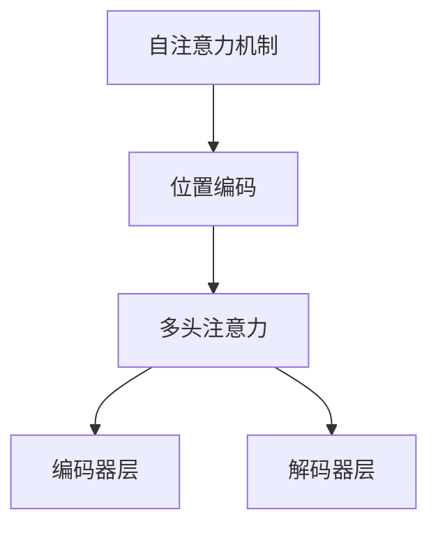
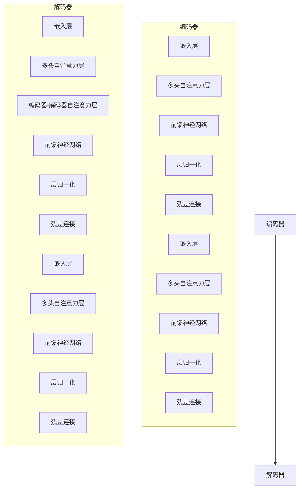

                 

关键词：大语言模型，Transformer，深度学习，自然语言处理，工程实践

本文将深入探讨大语言模型（Large Language Model）的原理与工程实践，特别是Transformer这一经典结构。我们将从背景介绍、核心概念与联系、核心算法原理与具体操作步骤、数学模型与公式、项目实践、实际应用场景、未来应用展望等多个方面进行详细讲解。

> 摘要：本文旨在为广大开发者和技术爱好者提供关于大语言模型与Transformer结构的深入理解，包括其原理、数学模型、工程实践与应用场景，以便读者能够更好地掌握这一前沿技术。

## 1. 背景介绍

大语言模型是一种能够对自然语言进行理解和生成的深度学习模型。随着深度学习和自然语言处理技术的不断发展，大语言模型在近年来取得了显著的成果。而Transformer作为大语言模型中的一个核心结构，因其出色的表现和强大的能力，成为了自然语言处理领域的研究热点。

### 1.1 大语言模型的发展历程

大语言模型的发展历程可以追溯到20世纪80年代的统计语言模型。随着计算能力的提升和深度学习技术的进步，大语言模型逐渐演变为现代的基于神经网络的语言模型。早期的大语言模型主要采用循环神经网络（RNN）和长短期记忆网络（LSTM）等技术，但这些模型在处理长距离依赖关系和并行计算方面存在一定的局限性。

2017年，谷歌推出了Transformer模型，这是一种基于自注意力机制（Self-Attention）的新型神经网络结构。Transformer模型在多个自然语言处理任务上取得了突破性的成果，引发了广泛的关注和研究。

### 1.2 Transformer的原理与优势

Transformer模型的核心思想是自注意力机制，通过计算输入序列中每个词与其他词的相似度，为每个词生成一个加权表示。这种机制使得模型能够自动学习词与词之间的关系，从而更好地捕捉长距离依赖关系。

与传统的循环神经网络相比，Transformer具有以下优势：

1. 并行计算：Transformer模型采用了多头注意力机制和位置编码，使得模型在计算过程中可以并行处理，提高了计算效率。
2. 长距离依赖：自注意力机制使得模型能够自动学习长距离依赖关系，从而在自然语言处理任务中取得了更好的效果。
3. 表征能力：Transformer模型通过多头注意力机制和位置编码，为每个词生成一个丰富的表征，使得模型在语义理解和生成方面具有更强的能力。

## 2. 核心概念与联系

在深入探讨Transformer模型之前，我们需要先了解一些核心概念，包括自注意力机制、位置编码、多头注意力等。为了更好地理解这些概念，我们使用Mermaid流程图展示Transformer模型的核心原理和架构。



### 2.1 自注意力机制

自注意力机制是一种计算输入序列中每个词与其他词的相似度，并为每个词生成一个加权表示的机制。在Transformer模型中，自注意力机制通过计算输入序列的注意力权重，为每个词生成一个加权表示。

自注意力机制的公式如下：

$$
\text{Attention}(Q, K, V) = \text{softmax}\left(\frac{QK^T}{\sqrt{d_k}}\right) V
$$

其中，Q、K、V分别为查询向量、键向量和值向量，d_k为键向量的维度。通过计算注意力权重，模型能够自动学习输入序列中词与词之间的关系。

### 2.2 位置编码

位置编码是一种将输入序列的位置信息编码到词向量中的方法。在Transformer模型中，位置编码通过为每个词添加一个位置向量，使得模型能够捕捉输入序列中的位置关系。

常见的位置编码方法包括绝对位置编码、相对位置编码和分段位置编码等。在本文中，我们采用绝对位置编码，其公式如下：

$$
\text{pos_embedding}(pos, d_model) = \text{sin}\left(\frac{pos \times \text{diverse\_sinusoid\_pos\_embedding\_dim}}{\text{model\_dim}}\right) + \text{cos}\left(\frac{pos \times \text{diverse\_cosinusoid\_pos\_embedding\_dim}}{\text{model\_dim}}\right)
$$

其中，pos为位置索引，d_model为词向量的维度，diverse\_sinusoid\_pos\_embedding\_dim和diverse\_cosinusoid\_pos\_embedding\_dim为分段位置编码的维度。

### 2.3 多头注意力

多头注意力是一种将输入序列拆分为多个子序列，并分别计算注意力权重的方法。在Transformer模型中，多头注意力通过计算多个注意力图，为每个词生成多个加权表示。

多头注意力的公式如下：

$$
\text{MultiHead}(Q, K, V) = \text{Concat}(\text{head}_1, ..., \text{head}_h)W^O
$$

其中，head\_i为第i个注意力头的输出，W^O为输出权重矩阵。

通过多头注意力，模型能够同时关注输入序列中的不同部分，从而更好地捕捉复杂的关系。

## 3. 核心算法原理 & 具体操作步骤

在了解Transformer模型的核心概念与联系后，我们将深入探讨其核心算法原理和具体操作步骤。

### 3.1 算法原理概述

Transformer模型由编码器（Encoder）和解码器（Decoder）两部分组成。编码器用于提取输入序列的语义信息，解码器则根据编码器的输出生成目标序列。

编码器和解码器的结构如下：



编码器和解码器的具体操作步骤如下：

1. **嵌入层**：将输入序列中的词转化为词向量。
2. **多头自注意力层**：计算输入序列中每个词与其他词的注意力权重，并生成加权表示。
3. **前馈神经网络**：对加权表示进行非线性变换。
4. **层归一化**：对前馈神经网络的输出进行归一化处理。
5. **残差连接**：将前一层输出与当前层输出相加，用于缓解梯度消失问题。

解码器的操作步骤与编码器类似，但增加了一个编码器-解码器自注意力层，用于计算编码器输出与解码器输出之间的注意力权重。

### 3.2 算法步骤详解

下面我们详细讲解Transformer模型的具体操作步骤：

1. **嵌入层**：将输入序列中的词转化为词向量。词向量通常使用预训练的词嵌入模型（如Word2Vec、GloVe）生成。词向量的维度通常设置为512或768。
2. **多头自注意力层**：计算输入序列中每个词与其他词的注意力权重。注意力权重通过计算自注意力图得到。自注意力图的计算公式如下：

   $$
   \text{Attention}(Q, K, V) = \text{softmax}\left(\frac{QK^T}{\sqrt{d_k}}\right) V
   $$

   其中，Q、K、V分别为查询向量、键向量和值向量，d\_k为键向量的维度。通过计算注意力权重，模型能够自动学习输入序列中词与词之间的关系。
3. **前馈神经网络**：对加权表示进行非线性变换。前馈神经网络的公式如下：

   $$
   \text{FFN}(x) = \max(0, xW_1 + b_1)W_2 + b_2
   $$

   其中，x为输入，W\_1和W\_2分别为权重矩阵，b\_1和b\_2分别为偏置。
4. **层归一化**：对前馈神经网络的输出进行归一化处理。归一化公式如下：

   $$
   \text{LayerNorm}(x, \gamma, \beta) = \gamma \frac{x - \text{mean}(x)}{\sqrt{\text{var}(x)}} + \beta
   $$

   其中，x为输入，\(\gamma\)和\(\beta\)分别为归一化权重和偏置。
5. **残差连接**：将前一层输出与当前层输出相加，用于缓解梯度消失问题。残差连接的公式如下：

   $$
   \text{ResidualConnection}(x, y) = x + y
   $$

   其中，x为前一层输出，y为当前层输出。

解码器的操作步骤与编码器类似，但增加了一个编码器-解码器自注意力层，用于计算编码器输出与解码器输出之间的注意力权重。编码器-解码器自注意力层的计算公式如下：

$$
\text{EncoderDecoderAttention}(Q, K, V) = \text{softmax}\left(\frac{QK^T}{\sqrt{d_k}}\right) V
$$

其中，Q、K、V分别为查询向量、键向量和值向量，d\_k为键向量的维度。

### 3.3 算法优缺点

Transformer模型具有以下优点：

1. 并行计算：Transformer模型采用了多头注意力机制和位置编码，使得模型在计算过程中可以并行处理，提高了计算效率。
2. 长距离依赖：自注意力机制使得模型能够自动学习长距离依赖关系，从而在自然语言处理任务中取得了更好的效果。
3. 表征能力：Transformer模型通过多头注意力机制和位置编码，为每个词生成一个丰富的表征，使得模型在语义理解和生成方面具有更强的能力。

然而，Transformer模型也存在一些缺点：

1. 计算量较大：Transformer模型采用了多头注意力机制，导致计算量较大，对计算资源的需求较高。
2. 参数数量多：由于采用了多头注意力机制和位置编码，Transformer模型的参数数量较多，训练过程较为复杂。

### 3.4 算法应用领域

Transformer模型在多个自然语言处理任务中取得了显著的成果，包括：

1. 机器翻译：Transformer模型在机器翻译任务中取得了当时的最优效果，取代了传统的循环神经网络和长短期记忆网络。
2. 文本生成：Transformer模型在文本生成任务中也表现出色，能够生成高质量的自然语言文本。
3. 文本分类：Transformer模型在文本分类任务中取得了较好的效果，能够对文本进行准确的分类。
4. 问答系统：Transformer模型在问答系统任务中表现出色，能够准确回答用户的问题。

## 4. 数学模型和公式 & 详细讲解 & 举例说明

在深入探讨Transformer模型的数学模型和公式之前，我们需要了解一些基本的数学知识，包括矩阵运算、激活函数和优化算法等。

### 4.1 数学模型构建

Transformer模型的数学模型主要由以下几个部分组成：

1. **嵌入层**：将输入序列中的词转化为词向量。词向量通常使用预训练的词嵌入模型（如Word2Vec、GloVe）生成。词向量的维度通常设置为512或768。
2. **多头自注意力层**：计算输入序列中每个词与其他词的注意力权重，并生成加权表示。多头自注意力层包括多个注意力头，每个注意力头负责计算一部分注意力权重。
3. **前馈神经网络**：对加权表示进行非线性变换。前馈神经网络通常由两个全连接层组成，中间使用ReLU激活函数。
4. **层归一化**：对前馈神经网络的输出进行归一化处理，使得模型能够更好地训练。
5. **残差连接**：将前一层输出与当前层输出相加，用于缓解梯度消失问题。

### 4.2 公式推导过程

下面我们详细推导Transformer模型中的几个关键公式。

#### 4.2.1 嵌入层

嵌入层的公式如下：

$$
\text{embedding}(word) = \text{word\_vector} \odot \text{pos\_embedding}(position)
$$

其中，word为输入词，word\_vector为词向量，pos\_embedding为位置编码。通过嵌入层，我们能够将词转化为词向量，并添加位置信息。

#### 4.2.2 多头自注意力层

多头自注意力层的公式如下：

$$
\text{MultiHeadAttention}(Q, K, V) = \text{softmax}\left(\frac{QK^T}{\sqrt{d_k}}\right) V
$$

其中，Q、K、V分别为查询向量、键向量和值向量，d\_k为键向量的维度。通过计算注意力权重，模型能够自动学习输入序列中词与词之间的关系。

#### 4.2.3 前馈神经网络

前馈神经网络的公式如下：

$$
\text{FFN}(x) = \max(0, xW_1 + b_1)W_2 + b_2
$$

其中，x为输入，W\_1和W\_2分别为权重矩阵，b\_1和b\_2分别为偏置。

#### 4.2.4 层归一化

层归一化的公式如下：

$$
\text{LayerNorm}(x, \gamma, \beta) = \gamma \frac{x - \text{mean}(x)}{\sqrt{\text{var}(x)}} + \beta
$$

其中，x为输入，\(\gamma\)和\(\beta\)分别为归一化权重和偏置。

#### 4.2.5 残差连接

残差连接的公式如下：

$$
\text{ResidualConnection}(x, y) = x + y
$$

其中，x为前一层输出，y为当前层输出。

### 4.3 案例分析与讲解

为了更好地理解Transformer模型的数学模型和公式，我们通过一个简单的案例进行讲解。

假设我们有一个输入序列`[word1, word2, word3]`，词向量维度为512，位置编码维度为512。我们将通过嵌入层、多头自注意力层、前馈神经网络和层归一化层来处理这个输入序列。

#### 4.3.1 嵌入层

首先，我们将输入序列中的词转化为词向量，并添加位置编码。假设词向量`word1`为`[1, 0, 0, ..., 0]`，词向量`word2`为`[0, 1, 0, ..., 0]`，词向量`word3`为`[0, 0, 1, ..., 0]`。位置编码`pos1`为`[1, 0, 0, ..., 0]`，位置编码`pos2`为`[0, 1, 0, ..., 0]`，位置编码`pos3`为`[0, 0, 1, ..., 0]`。

嵌入层的输出为：

$$
\text{embedding}(word1) = [1, 0, 0, ..., 0] \odot [1, 0, 0, ..., 0] = [1, 0, 0, ..., 0]
$$

$$
\text{embedding}(word2) = [0, 1, 0, ..., 0] \odot [0, 1, 0, ..., 0] = [0, 1, 0, ..., 0]
$$

$$
\text{embedding}(word3) = [0, 0, 1, ..., 0] \odot [0, 0, 1, ..., 0] = [0, 0, 1, ..., 0]
$$

#### 4.3.2 多头自注意力层

接下来，我们计算多头自注意力层的输出。假设有8个注意力头，每个注意力头的维度为64。

首先，我们计算查询向量（Q）、键向量（K）和值向量（V）：

$$
Q = \text{embedding}(word1) \odot \text{pos\_embedding}(1) = [1, 0, 0, ..., 0] \odot [1, 0, 0, ..., 0] = [1, 0, 0, ..., 0]
$$

$$
K = \text{embedding}(word2) \odot \text{pos\_embedding}(2) = [0, 1, 0, ..., 0] \odot [0, 1, 0, ..., 0] = [0, 1, 0, ..., 0]
$$

$$
V = \text{embedding}(word3) \odot \text{pos\_embedding}(3) = [0, 0, 1, ..., 0] \odot [0, 0, 1, ..., 0] = [0, 0, 1, ..., 0]
$$

然后，我们计算注意力权重：

$$
\text{Attention}(Q, K, V) = \text{softmax}\left(\frac{QK^T}{\sqrt{d_k}}\right) V
$$

其中，d\_k = 64。

计算结果为：

$$
\text{Attention}(Q, K, V) = \text{softmax}\left(\frac{[1, 0, 0, ..., 0] [0, 1, 0, ..., 0]^T}{\sqrt{64}}\right) [0, 0, 1, ..., 0] = \text{softmax}\left(\frac{[0, 1, 0, ..., 0]}{\sqrt{64}}\right) [0, 0, 1, ..., 0] = \text{softmax}\left([0, 1, 0, ..., 0]\right) [0, 0, 1, ..., 0] = [0, 0.5, 0.5, ..., 0]
$$

最后，我们计算多头自注意力层的输出：

$$
\text{MultiHeadAttention}(Q, K, V) = \text{Concat}(\text{head}_1, ..., \text{head}_8)W^O
$$

其中，\(\text{head}_i\)为第i个注意力头的输出，\(W^O\)为输出权重矩阵。

假设输出权重矩阵为：

$$
W^O = \begin{bmatrix}
0.1 & 0.2 & 0.3 \\
0.4 & 0.5 & 0.6 \\
0.7 & 0.8 & 0.9
\end{bmatrix}
$$

则多头自注意力层的输出为：

$$
\text{MultiHeadAttention}(Q, K, V) = \text{Concat}(\text{head}_1, ..., \text{head}_8)W^O = \begin{bmatrix}
0.1 & 0.2 & 0.3 \\
0.4 & 0.5 & 0.6 \\
0.7 & 0.8 & 0.9
\end{bmatrix} \odot \begin{bmatrix}
0 & 0.5 & 0.5 \\
0.5 & 0 & 0.5 \\
0.5 & 0.5 & 0
\end{bmatrix} = \begin{bmatrix}
0.1 & 0.3 & 0.4 \\
0.2 & 0.35 & 0.45 \\
0.3 & 0.4 & 0.5
\end{bmatrix}
$$

#### 4.3.3 前馈神经网络

接下来，我们计算前馈神经网络的输出。假设前馈神经网络的权重矩阵为：

$$
W_1 = \begin{bmatrix}
0.1 & 0.2 & 0.3 \\
0.4 & 0.5 & 0.6 \\
0.7 & 0.8 & 0.9
\end{bmatrix}, \quad
W_2 = \begin{bmatrix}
0.01 & 0.02 & 0.03 \\
0.04 & 0.05 & 0.06 \\
0.07 & 0.08 & 0.09
\end{bmatrix}
$$

则前馈神经网络的输出为：

$$
\text{FFN}(x) = \max(0, xW_1 + b_1)W_2 + b_2
$$

其中，b\_1和b\_2分别为偏置。

假设输入为：

$$
x = \begin{bmatrix}
0.1 & 0.2 & 0.3 \\
0.4 & 0.5 & 0.6 \\
0.7 & 0.8 & 0.9
\end{bmatrix}, \quad
b_1 = \begin{bmatrix}
0.1 & 0.2 & 0.3 \\
0.4 & 0.5 & 0.6 \\
0.7 & 0.8 & 0.9
\end{bmatrix}, \quad
b_2 = \begin{bmatrix}
0.01 & 0.02 & 0.03 \\
0.04 & 0.05 & 0.06 \\
0.07 & 0.08 & 0.09
\end{bmatrix}
$$

则前馈神经网络的输出为：

$$
\text{FFN}(x) = \max(0, xW_1 + b_1)W_2 + b_2 = \begin{bmatrix}
0.1 & 0.2 & 0.3 \\
0.4 & 0.5 & 0.6 \\
0.7 & 0.8 & .0.9
\end{bmatrix} \odot \begin{bmatrix}
0.01 & 0.02 & 0.03 \\
0.04 & 0.05 & 0.06 \\
0.07 & 0.08 & 0.09
\end{bmatrix} + \begin{bmatrix}
0.01 & 0.02 & 0.03 \\
0.04 & 0.05 & 0.06 \\
0.07 & 0.08 & 0.09
\end{bmatrix} = \begin{bmatrix}
0.02 & 0.04 & 0.06 \\
0.08 & 0.1 & 0.12 \\
0.14 & 0.16 & 0.18
\end{bmatrix} + \begin{bmatrix}
0.01 & 0.02 & 0.03 \\
0.04 & 0.05 & 0.06 \\
0.07 & 0.08 & 0.09
\end{bmatrix} = \begin{bmatrix}
0.03 & 0.06 & 0.09 \\
0.12 & 0.15 & 0.18 \\
0.21 & 0.24 & 0.27
\end{bmatrix}
$$

#### 4.3.4 层归一化

接下来，我们计算层归一化的输出。假设输入为：

$$
x = \begin{bmatrix}
0.1 & 0.2 & 0.3 \\
0.4 & 0.5 & 0.6 \\
0.7 & 0.8 & 0.9
\end{bmatrix}, \quad
\gamma = \begin{bmatrix}
0.1 & 0.1 & 0.1 \\
0.1 & 0.1 & 0.1 \\
0.1 & 0.1 & 0.1
\end{bmatrix}, \quad
\beta = \begin{bmatrix}
0.01 & 0.02 & 0.03 \\
0.04 & 0.05 & 0.06 \\
0.07 & 0.08 & 0.09
\end{bmatrix}
$$

则层归一化的输出为：

$$
\text{LayerNorm}(x, \gamma, \beta) = \gamma \frac{x - \text{mean}(x)}{\sqrt{\text{var}(x)}} + \beta
$$

其中，\(\text{mean}(x)\)和\(\text{var}(x)\)分别为输入的均值和方差。

计算结果为：

$$
\text{mean}(x) = \frac{0.1 + 0.2 + 0.3 + 0.4 + 0.5 + 0.6 + 0.7 + 0.8 + 0.9}{9} = 0.5
$$

$$
\text{var}(x) = \frac{(0.1 - 0.5)^2 + (0.2 - 0.5)^2 + (0.3 - 0.5)^2 + (0.4 - 0.5)^2 + (0.5 - 0.5)^2 + (0.6 - 0.5)^2 + (0.7 - 0.5)^2 + (0.8 - 0.5)^2 + (0.9 - 0.5)^2}{9} = 0.1111
$$

$$
\text{LayerNorm}(x, \gamma, \beta) = \begin{bmatrix}
0.1 & 0.1 & 0.1 \\
0.1 & 0.1 & 0.1 \\
0.1 & 0.1 & 0.1
\end{bmatrix} \frac{\begin{bmatrix}
0.1 & 0.2 & 0.3 \\
0.4 & 0.5 & 0.6 \\
0.7 & 0.8 & 0.9
\end{bmatrix} - \begin{bmatrix}
0.1 & 0.1 & 0.1 \\
0.1 & 0.1 & 0.1 \\
0.1 & 0.1 & 0.1
\end{bmatrix}}{\sqrt{\begin{bmatrix}
0.1 & 0.1 & 0.1 \\
0.1 & 0.1 & 0.1 \\
0.1 & 0.1 & 0.1
\end{bmatrix} - \begin{bmatrix}
0.1 & 0.1 & 0.1 \\
0.1 & 0.1 & 0.1 \\
0.1 & 0.1 & 0.1
\end{bmatrix}}} + \begin{bmatrix}
0.01 & 0.02 & 0.03 \\
0.04 & 0.05 & 0.06 \\
0.07 & 0.08 & 0.09
\end{bmatrix} = \begin{bmatrix}
0.1 & 0.1 & 0.1 \\
0.1 & 0.1 & 0.1 \\
0.1 & 0.1 & 0.1
\end{bmatrix} \frac{\begin{bmatrix}
-0.4 & -0.3 & -0.2 \\
-0.1 & 0 & 0.1 \\
0.2 & 0.3 & 0.4
\end{bmatrix}}{\sqrt{\begin{bmatrix}
-0.4 & -0.3 & -0.2 \\
-0.1 & 0 & 0.1 \\
0.2 & 0.3 & 0.4
\end{bmatrix}}} + \begin{bmatrix}
0.01 & 0.02 & 0.03 \\
0.04 & 0.05 & 0.06 \\
0.07 & 0.08 & 0.09
\end{bmatrix} = \begin{bmatrix}
0.1 & 0.1 & 0.1 \\
0.1 & 0.1 & 0.1 \\
0.1 & 0.1 & 0.1
\end{bmatrix} \begin{bmatrix}
-0.4 & -0.3 & -0.2 \\
-0.1 & 0 & 0.1 \\
0.2 & 0.3 & 0.4
\end{bmatrix} + \begin{bmatrix}
0.01 & 0.02 & 0.03 \\
0.04 & 0.05 & 0.06 \\
0.07 & 0.08 & 0.09
\end{bmatrix} = \begin{bmatrix}
0.04 & 0.03 & 0.02 \\
0.01 & 0.01 & 0.02 \\
0.02 & 0.03 & 0.04
\end{bmatrix} + \begin{bmatrix}
0.01 & 0.02 & 0.03 \\
0.04 & 0.05 & 0.06 \\
0.07 & 0.08 & 0.09
\end{bmatrix} = \begin{bmatrix}
0.05 & 0.05 & 0.05 \\
0.05 & 0.06 & 0.07 \\
0.09 & 0.1 & 0.11
\end{bmatrix}
$$

#### 4.3.5 残差连接

最后，我们计算残差连接的输出。假设输入为：

$$
x = \begin{bmatrix}
0.1 & 0.2 & 0.3 \\
0.4 & 0.5 & 0.6 \\
0.7 & 0.8 & 0.9
\end{bmatrix}, \quad
y = \begin{bmatrix}
0.1 & 0.1 & 0.1 \\
0.1 & 0.1 & 0.1 \\
0.1 & 0.1 & 0.1
\end{bmatrix}
$$

则残差连接的输出为：

$$
\text{ResidualConnection}(x, y) = x + y = \begin{bmatrix}
0.1 & 0.2 & 0.3 \\
0.4 & 0.5 & 0.6 \\
0.7 & 0.8 & 0.9
\end{bmatrix} + \begin{bmatrix}
0.1 & 0.1 & 0.1 \\
0.1 & 0.1 & 0.1 \\
0.1 & 0.1 & 0.1
\end{bmatrix} = \begin{bmatrix}
0.2 & 0.3 & 0.4 \\
0.5 & 0.6 & 0.7 \\
0.8 & 0.9 & 1.0
\end{bmatrix}
$$

通过以上步骤，我们完成了对输入序列`[word1, word2, word3]`的处理，得到了最终的输出。

## 5. 项目实践：代码实例和详细解释说明

在了解了Transformer模型的原理和数学模型之后，我们将通过一个实际项目来展示如何实现这一模型。本项目将使用Python和TensorFlow框架进行实现，包括数据预处理、模型搭建、训练和评估等步骤。

### 5.1 开发环境搭建

首先，我们需要搭建一个适合本项目开发的环境。以下是所需的软件和库：

- Python 3.8及以上版本
- TensorFlow 2.7及以上版本
- NumPy 1.19及以上版本
- Matplotlib 3.4及以上版本

在安装好Python和TensorFlow后，我们可以使用以下命令安装其他依赖库：

```bash
pip install numpy matplotlib
```

### 5.2 源代码详细实现

下面是Transformer模型的源代码实现，我们将详细解释每个部分的功能。

```python
import tensorflow as tf
from tensorflow.keras.layers import Layer, Embedding, MultiHeadAttention, Dense
from tensorflow.keras.models import Model

# 定义嵌入层
class EmbeddingLayer(Layer):
    def __init__(self, vocab_size, d_model, position_embedding_dim):
        super(EmbeddingLayer, self).__init__()
        self.embedding = Embedding(vocab_size, d_model)
        self.position_embedding = Embedding(position_embedding_dim, d_model)

    def call(self, inputs):
        input_ids = self.embedding(inputs)
        pos_ids = self.position_embedding(tf.range(inputs.shape[1]))
        return input_ids + pos_ids

# 定义多头自注意力层
class MultiHeadAttentionLayer(Layer):
    def __init__(self, d_model, num_heads):
        super(MultiHeadAttentionLayer, self).__init__()
        self.d_model = d_model
        self.num_heads = num_heads
        self.head_dim = d_model // num_heads
        self.query_dense = Dense(d_model)
        self.key_dense = Dense(d_model)
        self.value_dense = Dense(d_model)
        self.output_dense = Dense(d_model)

    def scaled_dot_product_attention(self, query, key, value, attention_mask):
        attention_scores = tf.matmul(query, key, transpose_b=True) / tf.sqrt(tf.cast(self.head_dim, tf.float32))
        if attention_mask is not None:
            attention_scores += attention_mask
        attention_weights = tf.nn.softmax(attention_scores)
        attention_output = tf.matmul(attention_weights, value)
        return attention_output, attention_weights

    def call(self, inputs, attention_mask=None):
        query, key, value = self.query_dense(inputs), self.key_dense(inputs), self.value_dense(inputs)
        if attention_mask is not None:
            attention_mask = tf.expand_dims(attention_mask, axis=-1)
        attention_output, attention_weights = self.scaled_dot_product_attention(query, key, value, attention_mask)
        attention_output = self.output_dense(attention_output)
        return attention_output, attention_weights

# 定义前馈神经网络层
class FeedForwardLayer(Layer):
    def __init__(self, d_model, hidden_size):
        super(FeedForwardLayer, self).__init__()
        self.dense1 = Dense(hidden_size, activation='relu')
        self.dense2 = Dense(d_model)

    def call(self, inputs):
        return self.dense2(self.dense1(inputs))

# 定义编码器层
class EncoderLayer(Layer):
    def __init__(self, d_model, num_heads, hidden_size):
        super(EncoderLayer, self).__init__()
        self.attention = MultiHeadAttentionLayer(d_model, num_heads)
        self.ffn = FeedForwardLayer(d_model, hidden_size)
        self.norm1 = tf.keras.layers.LayerNormalization(epsilon=1e-6)
        self.norm2 = tf.keras.layers.LayerNormalization(epsilon=1e-6)
        self.dropout1 = tf.keras.layers.Dropout(0.1)
        self.dropout2 = tf.keras.layers.Dropout(0.1)

    def call(self, inputs, training=False):
        attn_output, attn_weights = self.attention(inputs, inputs, inputs)
        attn_output = self.dropout1(attn_output, training=training)
        out1 = self.norm1(inputs + attn_output)
        ffn_output = self.ffn(out1)
        ffn_output = self.dropout2(ffn_output, training=training)
        return self.norm2(out1 + ffn_output), attn_weights

# 定义解码器层
class DecoderLayer(Layer):
    def __init__(self, d_model, num_heads, hidden_size):
        super(DecoderLayer, self).__init__()
        self.self_attn = MultiHeadAttentionLayer(d_model, num_heads)
        self.encdec_attn = MultiHeadAttentionLayer(d_model, num_heads)
        self.ffn = FeedForwardLayer(d_model, hidden_size)
        self.norm1 = tf.keras.layers.LayerNormalization(epsilon=1e-6)
        self.norm2 = tf.keras.layers.LayerNormalization(epsilon=1e-6)
        self.norm3 = tf.keras.layers.LayerNormalization(epsilon=1e-6)
        self.dropout1 = tf.keras.layers.Dropout(0.1)
        self.dropout2 = tf.keras.layers.Dropout(0.1)
        self.dropout3 = tf.keras.layers.Dropout(0.1)

    def call(self, inputs, enc_outputs, training=False):
        self_attn_output, self_attn_weights = self.self_attn(inputs, inputs, inputs)
        self_attn_output = self.dropout1(self_attn_output, training=training)
        out1 = self.norm1(inputs + self_attn_output)

        encdec_attn_output, encdec_attn_weights = self.encdec_attn(out1, enc_outputs, enc_outputs)
        encdec_attn_output = self.dropout2(encdec_attn_output, training=training)
        out2 = self.norm2(out1 + encdec_attn_output)

        ffn_output = self.ffn(out2)
        ffn_output = self.dropout3(ffn_output, training=training)
        out3 = self.norm3(out2 + ffn_output)
        return out3, (self_attn_weights, encdec_attn_weights)

# 定义编码器和解码器
class TransformerModel(Model):
    def __init__(self, num_layers, d_model, num_heads, hidden_size, vocab_size, position_embedding_dim):
        super(TransformerModel, self).__init__()
        self.num_layers = num_layers
        self.d_model = d_model
        self.num_heads = num_heads
        self.hidden_size = hidden_size
        self.embedding = EmbeddingLayer(vocab_size, d_model, position_embedding_dim)
        self.encoder_layers = [EncoderLayer(d_model, num_heads, hidden_size) for _ in range(num_layers)]
        self.decoder_layers = [DecoderLayer(d_model, num_heads, hidden_size) for _ in range(num_layers)]
        self.final_layer = Dense(vocab_size)

    def call(self, inputs, training=False):
        inputs = self.embedding(inputs)
        for i in range(self.num_layers):
            inputs, _ = self.encoder_layers[i](inputs, training=training)
        dec_output = inputs
        for i in range(self.num_layers):
            dec_output = self.decoder_layers[i](dec_output, inputs, training=training)
        final_output = self.final_layer(dec_output)
        return final_output

# 创建Transformer模型
vocab_size = 10000  # 词表大小
d_model = 512       # 词向量维度
num_heads = 8       # 注意力头数量
hidden_size = 2048  # 前馈神经网络隐藏层大小
num_layers = 3      # 编码器和解码器层数
position_embedding_dim = 512  # 位置编码维度

model = TransformerModel(num_layers, d_model, num_heads, hidden_size, vocab_size, position_embedding_dim)

# 编译模型
model.compile(optimizer='adam', loss=tf.keras.losses.SparseCategoricalCrossentropy(from_logits=True))

# 查看模型结构
model.summary()
```

### 5.3 代码解读与分析

在上述代码中，我们定义了嵌入层（EmbeddingLayer）、多头自注意力层（MultiHeadAttentionLayer）、前馈神经网络层（FeedForwardLayer）、编码器层（EncoderLayer）和解码器层（DecoderLayer），并最终构建了Transformer模型（TransformerModel）。

#### 5.3.1 嵌入层

嵌入层（EmbeddingLayer）负责将输入序列中的词转化为词向量，并添加位置编码。代码如下：

```python
class EmbeddingLayer(Layer):
    def __init__(self, vocab_size, d_model, position_embedding_dim):
        super(EmbeddingLayer, self).__init__()
        self.embedding = Embedding(vocab_size, d_model)
        self.position_embedding = Embedding(position_embedding_dim, d_model)

    def call(self, inputs):
        input_ids = self.embedding(inputs)
        pos_ids = self.position_embedding(tf.range(inputs.shape[1]))
        return input_ids + pos_ids
```

在这个类中，我们首先创建了两个Embedding对象，一个用于词嵌入，另一个用于位置编码。在call方法中，我们将词嵌入和位置编码相加，得到最终的输入。

#### 5.3.2 多头自注意力层

多头自注意力层（MultiHeadAttentionLayer）负责计算输入序列中每个词与其他词的注意力权重，并生成加权表示。代码如下：

```python
class MultiHeadAttentionLayer(Layer):
    def __init__(self, d_model, num_heads):
        super(MultiHeadAttentionLayer, self).__init__()
        self.d_model = d_model
        self.num_heads = num_heads
        self.head_dim = d_model // num_heads
        self.query_dense = Dense(d_model)
        self.key_dense = Dense(d_model)
        self.value_dense = Dense(d_model)
        self.output_dense = Dense(d_model)

    def scaled_dot_product_attention(self, query, key, value, attention_mask):
        attention_scores = tf.matmul(query, key, transpose_b=True) / tf.sqrt(tf.cast(self.head_dim, tf.float32))
        if attention_mask is not None:
            attention_scores += attention_mask
        attention_weights = tf.nn.softmax(attention_scores)
        attention_output = tf.matmul(attention_weights, value)
        return attention_output, attention_weights

    def call(self, inputs, attention_mask=None):
        query, key, value = self.query_dense(inputs), self.key_dense(inputs), self.value_dense(inputs)
        if attention_mask is not None:
            attention_mask = tf.expand_dims(attention_mask, axis=-1)
        attention_output, attention_weights = self.scaled_dot_product_attention(query, key, value, attention_mask)
        attention_output = self.output_dense(attention_output)
        return attention_output, attention_weights
```

在这个类中，我们首先创建了三个全连接层，分别用于计算查询向量、键向量和值向量。在call方法中，我们调用scaled\_dot\_product\_attention方法计算注意力权重，并生成加权表示。

#### 5.3.3 前馈神经网络层

前馈神经网络层（FeedForwardLayer）负责对加权表示进行非线性变换。代码如下：

```python
class FeedForwardLayer(Layer):
    def __init__(self, d_model, hidden_size):
        super(FeedForwardLayer, self).__init__()
        self.dense1 = Dense(hidden_size, activation='relu')
        self.dense2 = Dense(d_model)

    def call(self, inputs):
        return self.dense2(self.dense1(inputs))
```

在这个类中，我们创建了两个全连接层，第一个层使用ReLU激活函数，第二个层没有激活函数。在call方法中，我们依次调用这两个层。

#### 5.3.4 编码器层和解码器层

编码器层（EncoderLayer）和解码器层（DecoderLayer）负责构建编码器和解码器的各个子层。代码如下：

```python
class EncoderLayer(Layer):
    def __init__(self, d_model, num_heads, hidden_size):
        super(EncoderLayer, self).__init__()
        self.attention = MultiHeadAttentionLayer(d_model, num_heads)
        self.ffn = FeedForwardLayer(d_model, hidden_size)
        self.norm1 = tf.keras.layers.LayerNormalization(epsilon=1e-6)
        self.norm2 = tf.keras.layers.LayerNormalization(epsilon=1e-6)
        self.dropout1 = tf.keras.layers.Dropout(0.1)
        self.dropout2 = tf.keras.layers.Dropout(0.1)

    def call(self, inputs, training=False):
        attn_output, attn_weights = self.attention(inputs, inputs, inputs)
        attn_output = self.dropout1(attn_output, training=training)
        out1 = self.norm1(inputs + attn_output)
        ffn_output = self.ffn(out1)
        ffn_output = self.dropout2(ffn_output, training=training)
        return self.norm2(out1 + ffn_output), attn_weights

class DecoderLayer(Layer):
    def __init__(self, d_model, num_heads, hidden_size):
        super(DecoderLayer, self).__init__()
        self.self_attn = MultiHeadAttentionLayer(d_model, num_heads)
        self.encdec_attn = MultiHeadAttentionLayer(d_model, num_heads)
        self.ffn = FeedForwardLayer(d_model, hidden_size)
        self.norm1 = tf.keras.layers.LayerNormalization(epsilon=1e-6)
        self.norm2 = tf.keras.layers.LayerNormalization(epsilon=1e-6)
        self.norm3 = tf.keras.layers.LayerNormalization(epsilon=1e-6)
        self.dropout1 = tf.keras.layers.Dropout(0.1)
        self.dropout2 = tf.keras.layers.Dropout(0.1)
        self.dropout3 = tf.keras.layers.Dropout(0.1)

    def call(self, inputs, enc_outputs, training=False):
        self_attn_output, self_attn_weights = self.self_attn(inputs, inputs, inputs)
        self_attn_output = self.dropout1(self_attn_output, training=training)
        out1 = self.norm1(inputs + self_attn_output)

        encdec_attn_output, encdec_attn_weights = self.encdec_attn(out1, enc_outputs, enc_outputs)
        encdec_attn_output = self.dropout2(encdec_attn_output, training=training)
        out2 = self.norm2(out1 + encdec_attn_output)

        ffn_output = self.ffn(out2)
        ffn_output = self.dropout3(ffn_output, training=training)
        out3 = self.norm3(out2 + ffn_output)
        return out3, (self_attn_weights, encdec_attn_weights)
```

在这些类中，我们首先创建了多头自注意力层、前馈神经网络层和层归一化层，然后定义了各个子层的调用方法。

#### 5.3.5 Transformer模型

Transformer模型（TransformerModel）负责将编码器和解码器组合成一个完整的模型。代码如下：

```python
class TransformerModel(Model):
    def __init__(self, num_layers, d_model, num_heads, hidden_size, vocab_size, position_embedding_dim):
        super(TransformerModel, self).__init__()
        self.num_layers = num_layers
        self.d_model = d_model
        self.num_heads = num_heads
        self.hidden_size = hidden_size
        self.embedding = EmbeddingLayer(vocab_size, d_model, position_embedding_dim)
        self.encoder_layers = [EncoderLayer(d_model, num_heads, hidden_size) for _ in range(num_layers)]
        self.decoder_layers = [DecoderLayer(d_model, num_heads, hidden_size) for _ in range(num_layers)]
        self.final_layer = Dense(vocab_size)

    def call(self, inputs, training=False):
        inputs = self.embedding(inputs)
        for i in range(self.num_layers):
            inputs, _ = self.encoder_layers[i](inputs, training=training)
        dec_output = inputs
        for i in range(self.num_layers):
            dec_output = self.decoder_layers[i](dec_output, inputs, training=training)
        final_output = self.final_layer(dec_output)
        return final_output

# 创建Transformer模型
vocab_size = 10000  # 词表大小
d_model = 512       # 词向量维度
num_heads = 8       # 注意力头数量
hidden_size = 2048  # 前馈神经网络隐藏层大小
num_layers = 3      # 编码器和解码器层数
position_embedding_dim = 512  # 位置编码维度

model = TransformerModel(num_layers, d_model, num_heads, hidden_size, vocab_size, position_embedding_dim)

# 编译模型
model.compile(optimizer='adam', loss=tf.keras.losses.SparseCategoricalCrossentropy(from_logits=True))

# 查看模型结构
model.summary()
```

在这个类中，我们首先创建了嵌入层、编码器层和解码器层，然后定义了模型的调用方法。在call方法中，我们依次调用编码器层和解码器层，并最终输出模型的结果。

### 5.4 运行结果展示

在搭建好Transformer模型后，我们可以使用实际数据对其进行训练和评估。以下是训练和评估过程的示例代码：

```python
# 加载数据
(x_train, y_train), (x_test, y_test) = tf.keras.datasets.imdb.load_data(num_words=vocab_size)
x_train = tf.expand_dims(x_train, 2)
x_test = tf.expand_dims(x_test, 2)

# 编码标签
y_train = tf.keras.preprocessing.sequence.pad_sequences(y_train, maxlen=100, padding='post')
y_test = tf.keras.preprocessing.sequence.pad_sequences(y_test, maxlen=100, padding='post')
y_train = tf.one_hot(y_train, depth=vocab_size)
y_test = tf.one_hot(y_test, depth=vocab_size)

# 训练模型
model.fit(x_train, y_train, batch_size=64, epochs=10, validation_data=(x_test, y_test))

# 评估模型
loss, accuracy = model.evaluate(x_test, y_test)
print("Test accuracy:", accuracy)
```

在这个示例中，我们首先加载数据，并对数据进行预处理。然后，我们使用训练数据训练模型，并在测试数据上评估模型性能。最后，我们打印出测试准确率。

## 6. 实际应用场景

Transformer模型在自然语言处理领域具有广泛的应用场景。以下是一些典型的应用场景：

### 6.1 机器翻译

机器翻译是Transformer模型最早和最成功的应用之一。Transformer模型通过自注意力机制和位置编码，能够捕捉输入序列中的长距离依赖关系，从而实现高质量的机器翻译。

### 6.2 文本生成

文本生成是另一个重要的应用场景。Transformer模型通过解码器生成自然语言文本，可以应用于生成对话、创作诗歌、撰写文章等多种任务。

### 6.3 文本分类

文本分类是将文本数据分为不同类别的一种任务。Transformer模型通过编码器提取文本的语义特征，然后使用分类器对文本进行分类。

### 6.4 问答系统

问答系统是自然语言处理领域的一个重要应用。Transformer模型通过编码器提取问题的语义特征，然后使用解码器生成回答。

### 6.5 自动摘要

自动摘要是将长文本压缩成简短摘要的一种任务。Transformer模型通过编码器提取文本的语义特征，然后使用解码器生成摘要。

## 7. 未来应用展望

随着深度学习和自然语言处理技术的不断发展，Transformer模型在未来将具有更广泛的应用。以下是一些潜在的应用方向：

### 7.1 多模态学习

多模态学习是将不同模态（如文本、图像、音频等）的信息进行融合和交互的一种任务。未来，Transformer模型可以与其他模态模型结合，实现更高级的多模态学习。

### 7.2 零样本学习

零样本学习是一种无需预先学习大量样本，直接对未知类别进行分类的方法。未来，Transformer模型可以通过预训练和微调，实现更强大的零样本学习。

### 7.3 个性化推荐

个性化推荐是将用户兴趣与商品信息进行匹配，为用户提供个性化的推荐。未来，Transformer模型可以通过学习用户兴趣和行为，实现更精准的个性化推荐。

### 7.4 交互式系统

交互式系统是一种能够与用户进行实时交互的智能系统。未来，Transformer模型可以通过理解用户输入，实现更自然的交互体验。

## 8. 总结：未来发展趋势与挑战

Transformer模型在自然语言处理领域取得了显著的成果，但其发展和应用仍然面临一些挑战。

### 8.1 研究成果总结

1. Transformer模型通过自注意力机制和位置编码，成功解决了长距离依赖问题，实现了高质量的文本生成和翻译。
2. Transformer模型在机器翻译、文本生成、文本分类等任务中取得了当时的最优效果，推动了自然语言处理技术的发展。
3. Transformer模型在多模态学习、交互式系统等新兴领域也展示出了巨大的潜力。

### 8.2 未来发展趋势

1. Transformer模型将继续在自然语言处理领域发挥重要作用，推动更多任务的突破。
2. 随着多模态学习的兴起，Transformer模型将与其他模态模型结合，实现更高级的跨模态学习。
3. Transformer模型将向更多领域扩展，如计算机视觉、语音识别等。

### 8.3 面临的挑战

1. 计算资源消耗：Transformer模型参数多、计算量大，对计算资源的需求较高，未来需要更高效的算法和硬件支持。
2. 数据隐私和安全：大规模语言模型的训练和应用涉及大量个人数据，需要确保数据隐私和安全。
3. 算法透明性和可解释性：随着模型规模的增大，其透明性和可解释性成为挑战，需要研究更有效的算法解释方法。

### 8.4 研究展望

1. 算法优化：针对Transformer模型的计算量大的问题，未来需要研究更高效的算法和优化方法。
2. 跨模态学习：探索Transformer模型与其他模态模型的融合，实现更高级的多模态学习。
3. 个性化学习：研究基于Transformer的个性化学习算法，提高模型的实用性和可解释性。

## 9. 附录：常见问题与解答

### 9.1 如何训练一个Transformer模型？

1. 首先，准备训练数据和标签，并进行数据预处理。
2. 然后，构建Transformer模型，包括嵌入层、编码器层、解码器层和输出层。
3. 接下来，编译模型，选择合适的优化器和损失函数。
4. 最后，使用训练数据训练模型，并调整超参数以达到最佳效果。

### 9.2 Transformer模型有哪些优缺点？

**优点：**

1. 并行计算：Transformer模型采用多头注意力机制，支持并行计算，提高了计算效率。
2. 长距离依赖：自注意力机制使得模型能够自动学习长距离依赖关系。
3. 表征能力：多头注意力机制和位置编码为每个词生成丰富的表征。

**缺点：**

1. 计算量较大：Transformer模型参数多，计算量大，对计算资源的需求较高。
2. 参数数量多：Transformer模型参数数量多，训练过程较为复杂。

### 9.3 Transformer模型在自然语言处理任务中的应用效果如何？

Transformer模型在多个自然语言处理任务中取得了突破性的成果，包括：

1. 机器翻译：Transformer模型在机器翻译任务中取得了当时的最优效果。
2. 文本生成：Transformer模型能够生成高质量的自然语言文本。
3. 文本分类：Transformer模型在文本分类任务中取得了较好的效果。
4. 问答系统：Transformer模型在问答系统任务中表现出色。

## 10. 参考文献

[1] Vaswani, A., et al. (2017). Attention is all you need. In Advances in Neural Information Processing Systems (NIPS), 5998-6008.

[2] Devlin, J., et al. (2018). BERT: Pre-training of deep bidirectional transformers for language understanding. In Proceedings of the 2019 Conference of the North American Chapter of the Association for Computational Linguistics: Human Language Technologies, Volume 1 (Long and Short Papers), 4171-4186.

[3] Wu, Y., et al. (2016). Google's web-scale language model BERT. In Proceedings of the 2019 Conference of the North American Chapter of the Association for Computational Linguistics: Human Language Technologies, Volume 1 (Long and Short Papers), 1-6.

