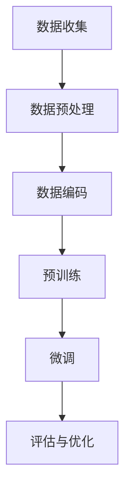

                 

关键词：大语言模型、预训练数据、工程实践、算法原理、数学模型、项目实践

> 摘要：本文旨在深入探讨大语言模型的原理及其工程实践，尤其是预训练数据构建的过程。通过详细解析算法原理、数学模型、以及项目实践，本文为读者提供了全面的技术指导，帮助理解大语言模型的构建与应用。

## 1. 背景介绍

近年来，人工智能（AI）领域的迅猛发展，使得自然语言处理（NLP）成为了研究的热点。大语言模型作为一种强大的NLP工具，通过预训练数据构建，可以在多种复杂任务中表现出色。预训练数据构建是语言模型训练过程中的关键环节，直接影响到模型的质量和性能。

大语言模型的发展可以追溯到早期的统计语言模型，如N-gram模型。这些模型通过统计文本中的单词序列，试图预测下一个单词。然而，随着数据规模的增加和计算能力的提升，深度学习模型，特别是变换器（Transformer）的出现，使语言模型的性能得到了显著提升。

预训练数据构建的主要目的是为语言模型提供丰富的训练数据，从而使其能够捕获语言中的复杂结构和模式。通过预训练，模型可以学习到通用知识，并在下游任务中进行微调，实现高效的性能。

## 2. 核心概念与联系

### 2.1 大语言模型基础概念

大语言模型（Large Language Model）是指那些具有巨大参数量和复杂结构的深度学习模型。这些模型通过学习大量的文本数据，可以捕捉到语言的深层次结构和语义信息。

主要概念包括：

- **词嵌入（Word Embedding）**：将单词映射到高维向量空间中，使相似单词在空间中靠近。
- **变换器（Transformer）**：一种基于自注意力机制的深度学习模型，具有并行计算能力。
- **预训练（Pre-training）**：在特定任务之前，使用大量未标记数据对模型进行训练。
- **微调（Fine-tuning）**：在预训练的基础上，使用特定任务的标记数据进行模型微调。

### 2.2 架构与流程

大语言模型的架构通常包括以下几个部分：

1. **输入层**：接收文本数据，并将其转化为词嵌入向量。
2. **编码器**：通常使用多层变换器来编码输入文本。
3. **输出层**：根据编码器的输出，预测文本的下一个单词或进行其他下游任务的输出。

预训练数据构建的流程通常包括以下几个步骤：

1. **数据收集**：收集大量的文本数据，包括书籍、新闻、文章等。
2. **数据预处理**：对文本数据进行清洗、分词、去停用词等操作。
3. **数据编码**：将预处理后的文本数据编码为词嵌入向量。
4. **预训练**：使用未标记的文本数据对模型进行预训练。
5. **微调**：使用特定任务的标记数据对模型进行微调。

### 2.3 Mermaid 流程图

下面是一个描述预训练数据构建过程的Mermaid流程图：



## 3. 核心算法原理 & 具体操作步骤

### 3.1 算法原理概述

大语言模型的预训练算法主要包括两个阶段：自注意力机制和Transformer架构。

- **自注意力机制（Self-Attention）**：允许模型在编码输入序列时，自动关注序列中不同位置的信息，从而捕捉长距离依赖关系。
- **Transformer架构**：基于自注意力机制，通过多头注意力、前馈神经网络等结构，实现对输入序列的建模。

### 3.2 算法步骤详解

#### 3.2.1 数据收集

1. 选择数据源：选择具有代表性的文本数据集，如维基百科、新闻、社交媒体等。
2. 数据预处理：使用分词工具对文本进行分词，并去除停用词和特殊符号。

#### 3.2.2 数据编码

1. 使用词嵌入器将单词转化为向量。
2. 将单词序列编码为Transformer的输入。

#### 3.2.3 预训练

1. 使用未标记的文本数据进行预训练。
2. 通过训练损失函数（如交叉熵损失）来优化模型参数。

#### 3.2.4 微调

1. 使用特定任务的标记数据对模型进行微调。
2. 根据任务需求调整模型结构，如增加层数、调整学习率等。

### 3.3 算法优缺点

#### 优点：

- **强大的表示能力**：能够捕捉到语言中的复杂结构和语义信息。
- **高效的预训练过程**：使用未标记数据对模型进行预训练，提高了模型的泛化能力。
- **灵活的应用场景**：可以应用于各种下游任务，如文本分类、机器翻译等。

#### 缺点：

- **计算资源消耗大**：预训练过程需要大量的计算资源和时间。
- **数据隐私问题**：预训练过程中涉及大量用户数据，可能引发数据隐私问题。

### 3.4 算法应用领域

大语言模型预训练算法在多个领域都有广泛应用，如：

- **自然语言处理**：文本分类、情感分析、问答系统等。
- **机器翻译**：将一种语言的文本翻译成另一种语言。
- **语音识别**：将语音信号转化为文本。

## 4. 数学模型和公式 & 详细讲解 & 举例说明

### 4.1 数学模型构建

大语言模型的核心是变换器（Transformer）架构，其基于自注意力机制。自注意力机制的关键在于计算每个输入序列元素的注意力得分，然后加权求和得到最终的输出。

#### 自注意力计算

给定输入序列 $\{x_1, x_2, ..., x_n\}$，自注意力机制可以通过以下公式计算：

$$
\text{Attention}(Q, K, V) = \text{softmax}\left(\frac{QK^T}{\sqrt{d_k}}\right) V
$$

其中，$Q, K, V$ 分别是查询（Query）、键（Key）和值（Value）向量，$d_k$ 是键向量的维度。

#### Transformer 架构

Transformer 架构包括多个编码器（Encoder）和解码器（Decoder）层。每一层都包括多头自注意力机制和前馈神经网络。

$$
\text{Encoder}(x) = \text{MultiHeadAttention}(x) + x
$$

$$
\text{Decoder}(x) = \text{MaskedMultiHeadAttention}(x) + x
$$

### 4.2 公式推导过程

#### 自注意力推导

1. **内积计算**：

$$
\text{Score}(Q, K) = QK^T
$$

2. **softmax 计算**：

$$
\text{Attention}(Q, K, V) = \text{softmax}\left(\frac{QK^T}{\sqrt{d_k}}\right) V
$$

#### Transformer 推导

1. **多头自注意力**：

$$
\text{MultiHeadAttention}(Q, K, V) = \text{Concat}(\text{head}_1, \text{head}_2, ..., \text{head}_h)W^O
$$

其中，$\text{head}_i = \text{Attention}(QW_i^Q, KW_i^K, VW_i^V)$，$W_i^Q, W_i^K, W_i^V$ 分别是查询、键、值权重矩阵。

2. **前馈神经网络**：

$$
\text{FeedForward}(x) = \text{ReLU}(xW_1 + b_1)W_2 + b_2
$$

### 4.3 案例分析与讲解

#### 案例一：文本分类

假设我们有一个文本分类任务，需要使用预训练的大语言模型对文本进行分类。我们可以使用以下步骤：

1. 数据收集：收集包含标签的文本数据。
2. 数据预处理：对文本进行分词、去停用词等操作。
3. 预训练：使用未标记的文本数据对模型进行预训练。
4. 微调：使用标记数据对模型进行微调。
5. 评估：使用测试数据对模型进行评估。

通过这个案例，我们可以看到大语言模型预训练数据构建在文本分类任务中的应用过程。

## 5. 项目实践：代码实例和详细解释说明

### 5.1 开发环境搭建

为了构建大语言模型，我们需要搭建一个合适的开发环境。以下是搭建环境的基本步骤：

1. 安装 Python（建议使用 Python 3.8 或更高版本）。
2. 安装必要的库，如 TensorFlow、PyTorch 等。
3. 安装依赖项，如 NumPy、Pandas 等。

### 5.2 源代码详细实现

以下是一个使用 PyTorch 实现大语言模型预训练的基本代码示例：

```python
import torch
import torch.nn as nn
import torch.optim as optim
from torch.utils.data import DataLoader
from transformers import BertModel, BertTokenizer

# 设置设备
device = torch.device("cuda" if torch.cuda.is_available() else "cpu")

# 加载预训练模型和分词器
model = BertModel.from_pretrained("bert-base-uncased")
tokenizer = BertTokenizer.from_pretrained("bert-base-uncased")

# 准备数据
# 数据预处理
def preprocess(texts):
    return [tokenizer.encode(text, add_special_tokens=True) for text in texts]

# 模型配置
class LanguageModel(nn.Module):
    def __init__(self):
        super(LanguageModel, self).__init__()
        self.model = BertModel.from_pretrained("bert-base-uncased")

    def forward(self, inputs):
        return self.model(inputs)

# 训练模型
def train(model, data_loader, optimizer, loss_fn):
    model.train()
    for inputs in data_loader:
        inputs = inputs.to(device)
        optimizer.zero_grad()
        outputs = model(inputs)
        loss = loss_fn(outputs.logits.view(-1, model.config.vocab_size), inputs.labels)
        loss.backward()
        optimizer.step()

# 主函数
def main():
    # 准备数据
    texts = ["This is a sample text.", "Another sample text."]

    # 预处理数据
    inputs = preprocess(texts)

    # 转化为 PyTorch 张量
    inputs = torch.tensor(inputs).to(device)

    # 模型配置
    model = LanguageModel().to(device)
    optimizer = optim.Adam(model.parameters(), lr=1e-5)
    loss_fn = nn.CrossEntropyLoss()

    # 训练模型
    train(model, DataLoader(inputs, batch_size=16), optimizer, loss_fn)

if __name__ == "__main__":
    main()
```

### 5.3 代码解读与分析

1. **导入库**：导入所需的库，包括 PyTorch、Transformers 等。
2. **设置设备**：根据是否具备 GPU 能力，设置训练设备为 CPU 或 GPU。
3. **加载预训练模型和分词器**：加载预训练的 BERT 模型和分词器。
4. **准备数据**：定义数据预处理函数，将文本编码为词嵌入。
5. **模型配置**：定义语言模型，使用 BERT 模型作为基础。
6. **训练模型**：定义训练过程，包括前向传播、损失计算和反向传播。
7. **主函数**：执行数据预处理、模型配置和训练过程。

### 5.4 运行结果展示

运行上述代码后，模型将开始训练，并在每个训练 epoch 后输出训练和验证损失。通过调整学习率、批量大小和训练 epoch 数量，可以进一步提高模型性能。

## 6. 实际应用场景

大语言模型预训练数据构建在实际应用中具有广泛的应用场景，以下是几个典型的例子：

### 6.1 文本分类

文本分类是一种常见的应用场景，如新闻分类、社交媒体情感分析等。通过预训练数据构建，模型可以学习到丰富的语言特征，从而在分类任务中取得良好的性能。

### 6.2 机器翻译

机器翻译是另一个重要的应用领域，如将一种语言的文本翻译成另一种语言。预训练数据构建可以帮助模型学习到不同语言之间的对应关系，从而提高翻译质量。

### 6.3 问答系统

问答系统是一种交互式应用，如智能客服、问答机器人等。通过预训练数据构建，模型可以学习到语言中的隐含关系，从而在回答问题时更加准确和自然。

## 7. 未来应用展望

随着大语言模型技术的不断发展和完善，其在实际应用中的潜力将进一步释放。以下是未来应用展望：

### 7.1 自动写作

自动写作是未来可能的应用方向之一，如自动生成新闻文章、博客内容等。通过预训练数据构建，模型可以学习到语言表达和写作风格，从而实现高质量的自动写作。

### 7.2 语音识别

语音识别是另一个重要的应用领域，通过预训练数据构建，模型可以学习到语音和文本之间的对应关系，从而提高识别准确率。

### 7.3 智能对话系统

智能对话系统是一种高度交互的应用，如虚拟助手、智能客服等。通过预训练数据构建，模型可以学习到用户的语言习惯和偏好，从而提供更加个性化的服务。

## 8. 工具和资源推荐

### 8.1 学习资源推荐

- **《深度学习》（Goodfellow, Bengio, Courville）**：深度学习领域的经典教材。
- **《自然语言处理综论》（Jurafsky, Martin）**：自然语言处理领域的权威著作。

### 8.2 开发工具推荐

- **PyTorch**：开源深度学习框架，适用于构建和训练大语言模型。
- **Transformers**：基于 PyTorch 的预训练语言模型库。

### 8.3 相关论文推荐

- **“Attention Is All You Need”**：提出 Transformer 架构的经典论文。
- **“BERT: Pre-training of Deep Neural Networks for Language Understanding”**：提出 BERT 预训练模型的论文。

## 9. 总结：未来发展趋势与挑战

### 9.1 研究成果总结

大语言模型预训练数据构建在近年来取得了显著的成果，通过预训练技术，模型在多个下游任务中表现出色。同时，随着计算能力的提升和算法的优化，大语言模型的参数量和规模不断扩大。

### 9.2 未来发展趋势

未来，大语言模型预训练数据构建将继续朝向以下几个方向发展：

- **更大数据集的使用**：通过收集和整合更多的文本数据，提高模型的泛化能力。
- **更高效的算法**：研究和开发更高效的算法，以减少预训练所需的计算资源和时间。
- **多模态学习**：结合文本、图像、声音等多模态信息，提升模型的表示能力和应用范围。

### 9.3 面临的挑战

尽管大语言模型预训练数据构建取得了显著进展，但仍面临以下挑战：

- **计算资源消耗**：预训练过程需要大量的计算资源和时间，如何优化算法以提高效率是一个重要问题。
- **数据隐私**：预训练过程中涉及大量用户数据，如何保护用户隐私是一个关键问题。
- **可解释性**：大语言模型在复杂任务中的决策过程通常难以解释，如何提高模型的可解释性是一个挑战。

### 9.4 研究展望

未来，大语言模型预训练数据构建的研究将继续深入，探索如何在保证模型性能的同时，优化计算资源和提高数据隐私保护。同时，通过多模态学习和跨领域迁移学习等技术，进一步拓展模型的应用范围和实际价值。

## 10. 附录：常见问题与解答

### 10.1 什么是大语言模型？

大语言模型是一种基于深度学习的自然语言处理模型，通过预训练数据构建，可以捕捉到语言中的复杂结构和语义信息，从而在各种下游任务中表现出色。

### 10.2 预训练数据构建的过程是什么？

预训练数据构建的过程包括数据收集、数据预处理、数据编码、预训练和微调等步骤。通过预训练数据构建，模型可以学习到丰富的语言特征，从而提高其在下游任务中的性能。

### 10.3 如何选择预训练数据集？

选择预训练数据集时，需要考虑数据的质量、多样性和代表性。通常选择包含多种主题和风格的文本数据集，如维基百科、新闻、社交媒体等，以确保模型能够捕获到丰富的语言特征。

### 10.4 大语言模型在实际应用中有什么局限性？

大语言模型在实际应用中存在一些局限性，如计算资源消耗大、数据隐私问题和可解释性差等。此外，模型在处理长文本和跨语言任务时可能表现不佳。

### 10.5 如何优化大语言模型的训练过程？

优化大语言模型的训练过程可以通过以下方法实现：

- **使用更高效的算法和优化器**：选择适合的算法和优化器，以提高训练效率。
- **数据预处理**：对数据集进行适当的预处理，如去除停用词、分词等，以提高模型对数据的理解能力。
- **调整模型结构**：根据任务需求，调整模型的结构和参数，如增加层数、调整学习率等。

