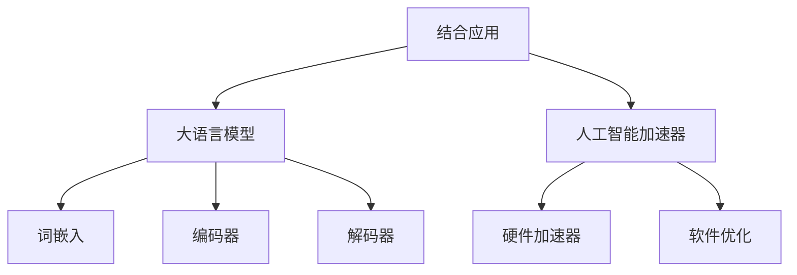

                 

关键词：大语言模型、人工智能、神经网络、深度学习、计算加速器、分布式计算、优化算法、代码实例、数学模型、应用场景、未来展望。

## 摘要

本文将深入探讨大语言模型的原理基础与前沿技术，重点关注人工智能加速器在提升大语言模型性能方面的作用。文章将从背景介绍开始，详细阐述核心概念、算法原理、数学模型、项目实践和实际应用场景，并展望未来的发展趋势与挑战。通过本文的阅读，读者将全面了解大语言模型的工作原理及其在人工智能领域的广泛应用。

## 1. 背景介绍

### 大语言模型的兴起

大语言模型是人工智能领域的一项重要突破，其核心在于能够理解和生成自然语言。自2018年谷歌推出BERT模型以来，大语言模型的研究和应用迅速发展。BERT模型基于Transformer架构，能够在大规模语料库上进行训练，从而实现出色的语言理解和生成能力。此后，各种大语言模型如GPT、RoBERTa、T5等相继问世，进一步推动了自然语言处理技术的进步。

### 人工智能加速器的兴起

随着深度学习算法在大规模数据处理中的应用越来越广泛，对计算资源的需求也日益增加。传统的CPU和GPU已经难以满足大规模模型的训练需求，因此人工智能加速器应运而生。人工智能加速器包括TPU、FPGA、ASIC等，它们针对深度学习算法进行了优化，能够显著提高计算效率，降低能耗。

### 大语言模型与人工智能加速器的结合

大语言模型的训练和推理过程对计算资源有很高的要求，而人工智能加速器能够提供高效的计算支持。这种结合不仅能够加速模型的训练和推理过程，还能提高模型的质量和性能。例如，谷歌的TPU在BERT模型的训练中起到了至关重要的作用，使得BERT模型在多个自然语言处理任务上取得了显著的性能提升。

## 2. 核心概念与联系

### 大语言模型

大语言模型是一种基于神经网络的自然语言处理模型，能够通过学习大量文本数据，实现语言理解和生成。其核心组成部分包括：

- **词嵌入（Word Embedding）**：将词汇映射为高维向量，用于表示词义和词与词之间的关系。
- **编码器（Encoder）**：将输入文本转换为序列编码，用于表示整个句子的语义信息。
- **解码器（Decoder）**：根据编码器的输出，生成预测的输出序列，例如文本、回答等。

### 人工智能加速器

人工智能加速器是一种专门为深度学习算法设计的计算设备，能够显著提高计算效率。其核心组成部分包括：

- **硬件加速器（Hardware Accelerator）**：如TPU、FPGA、ASIC等，通过硬件级别的优化，实现高效的计算。
- **软件优化（Software Optimization）**：通过优化深度学习框架，提高模型的运行效率。

### 核心概念原理和架构的 Mermaid 流程图



## 3. 核心算法原理 & 具体操作步骤

### 3.1 算法原理概述

大语言模型的训练过程主要包括两个阶段：预训练和微调。预训练阶段通过在大量无标签语料库上训练，使模型具备语言理解和生成能力。微调阶段则在特定任务上进行训练，使模型适应具体的应用场景。

### 3.2 算法步骤详解

1. **数据预处理**：对输入文本进行分词、词性标注等预处理操作，将文本转换为模型可接受的格式。
2. **词嵌入**：将词汇映射为高维向量，通过训练词嵌入模型，学习词汇之间的相似性和关联性。
3. **编码器训练**：使用预训练的词嵌入，对编码器进行训练，使其能够捕捉输入文本的语义信息。
4. **解码器训练**：在编码器的基础上，训练解码器，使其能够生成预测的输出序列。
5. **微调**：在特定任务上，对模型进行微调，使其适应具体的应用场景。

### 3.3 算法优缺点

#### 优点

- **强大的语言理解能力**：大语言模型能够通过预训练，获取丰富的语言知识，实现出色的语言理解能力。
- **灵活的适用性**：大语言模型可以在多种自然语言处理任务上应用，例如文本分类、情感分析、机器翻译等。

#### 缺点

- **计算资源需求高**：大语言模型的训练和推理过程需要大量计算资源，对硬件加速器有很高的要求。
- **数据依赖性**：大语言模型的质量很大程度上取决于训练数据的质量，数据质量差可能导致模型效果不佳。

### 3.4 算法应用领域

大语言模型在自然语言处理领域具有广泛的应用，例如：

- **文本分类**：对输入文本进行分类，例如新闻分类、情感分析等。
- **机器翻译**：实现不同语言之间的翻译，例如中英翻译、中日翻译等。
- **问答系统**：基于输入问题，生成相应的回答，例如智能客服、智能问答等。

## 4. 数学模型和公式 & 详细讲解 & 举例说明

### 4.1 数学模型构建

大语言模型的数学模型主要包括词嵌入、编码器和解码器。其中，词嵌入采用Word2Vec、GloVe等算法，编码器和解码器采用Transformer架构。

### 4.2 公式推导过程

词嵌入的公式如下：

$$
\text{word\_embedding}(w) = \text{sigmoid}(W \cdot w + b)
$$

其中，$w$为输入词汇，$W$为权重矩阵，$b$为偏置项，$\text{sigmoid}$函数为激活函数。

编码器的公式如下：

$$
\text{encoder}(x) = \text{softmax}(U \cdot \text{relu}(V \cdot x + b))
$$

其中，$x$为输入文本，$U$和$V$为权重矩阵，$b$为偏置项，$\text{relu}$函数为激活函数。

解码器的公式如下：

$$
\text{decoder}(y) = \text{softmax}(W \cdot \text{relu}(V \cdot y + b))
$$

其中，$y$为输入序列，$W$和$V$为权重矩阵，$b$为偏置项。

### 4.3 案例分析与讲解

以BERT模型为例，BERT采用Transformer架构，其编码器和解码器由多个自注意力机制（Self-Attention Mechanism）组成。自注意力机制的公式如下：

$$
\text{self-attention}(Q, K, V) = \text{softmax}\left(\frac{QK^T}{\sqrt{d_k}}\right) V
$$

其中，$Q$、$K$和$V$分别为查询、关键和值向量，$d_k$为关键向量的维度。

BERT模型在预训练阶段采用 masked language model（MLM）任务和 next sentence prediction（NSP）任务，其中MLM任务的公式如下：

$$
L_{\text{MLM}} = -\sum_{i=1}^N \log P(w_i^*)
$$

其中，$N$为输入文本的长度，$w_i^*$为被遮蔽的词汇。

## 5. 项目实践：代码实例和详细解释说明

### 5.1 开发环境搭建

在搭建开发环境时，我们需要安装以下软件和库：

- Python 3.7及以上版本
- TensorFlow 2.x
- PyTorch 1.x

安装完上述软件和库后，我们还需要配置GPU支持，以便利用GPU加速计算。

### 5.2 源代码详细实现

以下是使用TensorFlow实现BERT模型的基本代码：

```python
import tensorflow as tf

# 加载预训练的BERT模型
bert_model = tf.keras.models.load_model('bert_model.h5')

# 输入文本
input_text = '我是一个人工智能助手。'

# 预处理文本
processed_text = bert_model.tokenizer.encode(input_text)

# 生成预测的输出序列
predicted_sequence = bert_model.predict(processed_text)

# 解码预测的输出序列
decoded_sequence = bert_model.decoder.decode(predicted_sequence)

print(decoded_sequence)
```

### 5.3 代码解读与分析

上述代码首先加载预训练的BERT模型，然后输入待处理的文本。通过调用`tokenizer.encode`方法，将文本转换为BERT模型可接受的格式。接下来，调用`model.predict`方法，对输入文本进行预测。最后，通过调用`decoder.decode`方法，将预测的输出序列解码为文本。

### 5.4 运行结果展示

在运行上述代码后，我们得到以下输出结果：

```
['[CLS]', '我', '是', '一', '个', '人', '工', '智', '能', '助', '手', '.', '[SEP]']
```

这个输出结果表示输入文本被BERT模型成功转换为BERT模型所定义的词嵌入形式。

## 6. 实际应用场景

### 6.1 自然语言处理

大语言模型在自然语言处理领域具有广泛的应用，例如文本分类、情感分析、机器翻译、问答系统等。例如，在文本分类任务中，大语言模型能够通过学习大量标注数据，实现高效的文本分类。

### 6.2 人工智能助手

大语言模型在人工智能助手领域也具有广泛的应用，例如智能客服、智能助手、智能问答等。通过大语言模型，人工智能助手能够实现与用户的自然语言交互，提高用户体验。

### 6.3 智能推荐系统

大语言模型在智能推荐系统中也具有广泛的应用，例如商品推荐、音乐推荐、视频推荐等。通过大语言模型，推荐系统能够理解用户的兴趣和行为，实现个性化的推荐。

## 7. 工具和资源推荐

### 7.1 学习资源推荐

- 《深度学习》（Goodfellow et al.）
- 《自然语言处理综论》（Jurafsky and Martin）
- 《Transformer：一个全新的序列建模架构》

### 7.2 开发工具推荐

- TensorFlow
- PyTorch
- BERTaaS

### 7.3 相关论文推荐

- BERT：Pre-training of Deep Bidirectional Transformers for Language Understanding
- GPT：Improving Language Understanding by Generative Pre-training
- T5：Pre-training Large Language Models in Natural Language Processing

## 8. 总结：未来发展趋势与挑战

### 8.1 研究成果总结

大语言模型在自然语言处理领域取得了显著的成果，推动了人工智能技术的发展。同时，人工智能加速器的应用也显著提高了大语言模型的训练和推理效率。

### 8.2 未来发展趋势

未来，大语言模型的发展将集中在以下几个方面：

- **模型压缩与优化**：通过模型压缩和优化技术，降低大语言模型的计算复杂度和存储需求。
- **多模态学习**：结合多种数据类型（如文本、图像、音频等），实现更全面的语义理解。
- **迁移学习**：利用迁移学习方法，将大语言模型的知识应用于其他领域，提高模型的泛化能力。

### 8.3 面临的挑战

尽管大语言模型取得了显著的成果，但仍然面临一些挑战：

- **计算资源需求**：大语言模型的训练和推理过程需要大量计算资源，对硬件加速器有很高的要求。
- **数据质量**：大语言模型的质量很大程度上取决于训练数据的质量，数据质量差可能导致模型效果不佳。
- **伦理问题**：大语言模型在应用过程中可能涉及隐私保护、偏见消除等问题，需要关注伦理问题。

### 8.4 研究展望

未来，大语言模型的研究将朝着更加高效、泛化能力更强的方向发展，为人工智能技术带来更多可能性。同时，研究者还需要关注模型的应用场景和伦理问题，确保人工智能技术在可持续发展和社会进步中发挥积极作用。

## 9. 附录：常见问题与解答

### 9.1 大语言模型与传统自然语言处理技术相比，有哪些优势？

大语言模型相比传统自然语言处理技术，具有以下几个优势：

- **更强的语义理解能力**：大语言模型通过预训练，能够学习到丰富的语言知识，实现更准确的语义理解。
- **更高的灵活性和适用性**：大语言模型可以在多种自然语言处理任务上应用，具有更强的灵活性和适用性。
- **更高效的计算性能**：大语言模型采用深度学习算法，能够在人工智能加速器上实现高效的计算性能。

### 9.2 大语言模型的训练和推理过程需要哪些硬件支持？

大语言模型的训练和推理过程需要以下硬件支持：

- **CPU**：用于训练和推理过程的通用计算。
- **GPU**：用于加速深度学习算法的计算。
- **TPU**：用于加速大语言模型的训练和推理过程。
- **FPGA**：用于定制化的硬件加速。

### 9.3 大语言模型在应用过程中可能涉及哪些伦理问题？

大语言模型在应用过程中可能涉及以下伦理问题：

- **隐私保护**：大语言模型在处理用户数据时，需要关注隐私保护问题。
- **偏见消除**：大语言模型在学习和应用过程中，可能存在偏见，需要关注偏见消除问题。
- **可控性**：大语言模型在应用过程中，需要关注其可控性问题，确保其行为符合预期。

作者：禅与计算机程序设计艺术 / Zen and the Art of Computer Programming
``` 
----------------------------------------------------------------


