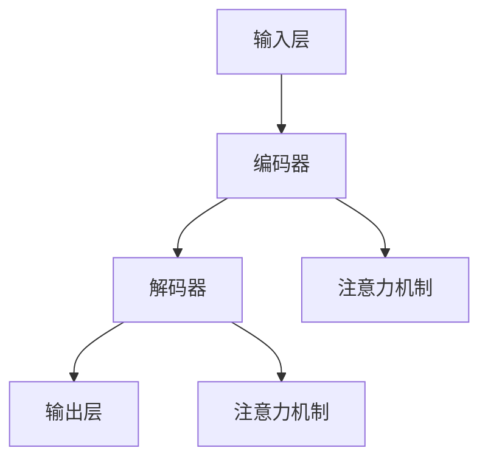

                 

关键词：大语言模型、训练速度、算法优化、分布式计算、GPU加速、并行化

## 摘要

随着深度学习的迅速发展，大语言模型已成为自然语言处理领域的重要研究方向。本文旨在深入探讨大语言模型的训练原理，并分析现有加快训练速度的关键技术。文章首先介绍了大语言模型的基础概念和基本结构，然后详细解析了加快训练速度的核心算法及其实现步骤。此外，文章还通过数学模型和公式推导，为读者提供了理论依据。最后，通过具体代码实例，展示了大语言模型的训练过程和效果。文章旨在为研究人员和开发者提供有价值的参考，助力他们在大语言模型训练领域取得突破。

## 1. 背景介绍

### 大语言模型的发展历程

大语言模型的发展历程可以追溯到20世纪80年代，当时研究人员开始探索如何使用神经网络来处理自然语言。最初的语言模型是基于简单的统计方法，如N元语法，这些方法虽然能在一定程度上模拟人类的语言能力，但在处理复杂语言结构和长文本时存在明显局限。

进入21世纪，随着深度学习技术的崛起，神经网络在语言模型中的应用逐渐成熟。2003年，研究人员提出了循环神经网络（RNN），并在语言模型训练中取得了显著进展。RNN通过引入循环结构，使得模型能够记住长距离依赖信息，从而在处理长文本和复杂语言结构方面表现出色。

然而，RNN在处理长序列数据时仍存在梯度消失和梯度爆炸问题，这限制了其在大规模语言模型训练中的应用。为了解决这一问题，研究人员在2014年提出了长短时记忆网络（LSTM），LSTM通过门控机制有效地缓解了梯度消失和梯度爆炸问题，使得语言模型的训练更加稳定和有效。

在LSTM的基础上，2017年，谷歌提出了Transformer模型，这一突破性的进展彻底改变了大语言模型的发展方向。Transformer模型通过自注意力机制，实现了对输入序列的并行处理，大大提高了训练速度和效果。自此以后，大语言模型的研究和应用进入了一个崭新的阶段。

### 大语言模型的应用领域

大语言模型在自然语言处理领域具有广泛的应用，包括但不限于以下几个方面：

1. **机器翻译**：大语言模型能够将一种语言的文本翻译成另一种语言，具有高准确性和流畅性。例如，谷歌翻译、百度翻译等应用都基于大语言模型进行实现。

2. **文本摘要**：大语言模型能够自动提取文本中的关键信息，生成简洁、准确的摘要。这在新闻摘要、文档摘要等领域具有重要应用。

3. **问答系统**：大语言模型能够理解和回答用户提出的问题，广泛应用于智能客服、智能助手等领域。

4. **情感分析**：大语言模型能够分析文本的情感倾向，应用于情感识别、舆情分析等场景。

5. **文本生成**：大语言模型能够生成连贯、自然的文本，应用于写作辅助、创意写作等领域。

6. **语音识别**：大语言模型能够与语音识别技术结合，实现语音到文本的转换，提升语音识别的准确率和用户体验。

### 大语言模型训练面临的挑战

尽管大语言模型在自然语言处理领域取得了显著成果，但其训练过程仍然面临诸多挑战：

1. **计算资源消耗**：大语言模型的训练需要大量的计算资源，尤其是GPU资源。随着模型规模的扩大，计算资源的需求呈指数级增长。

2. **训练时间**：大语言模型的训练时间非常长，特别是对于大规模数据集。这限制了模型在实际应用中的部署和更新。

3. **数据隐私**：大语言模型的训练通常涉及大量的用户数据，如何保障数据隐私成为一个重要问题。

4. **模型泛化能力**：大语言模型在训练过程中可能会出现过拟合现象，如何提高模型的泛化能力是一个关键挑战。

5. **算法优化**：随着深度学习技术的不断发展，如何优化大语言模型的训练算法，提高训练速度和效果，是研究人员需要持续关注的问题。

## 2. 核心概念与联系

### 大语言模型的基本概念

大语言模型是一种基于深度学习技术的自然语言处理模型，其核心思想是通过大规模数据训练，使模型能够理解并生成自然语言。大语言模型通常由输入层、隐藏层和输出层组成，其中输入层接收原始文本数据，隐藏层通过神经网络结构对文本进行编码，输出层生成目标文本。

### 大语言模型的架构

大语言模型的架构可以分为以下几个部分：

1. **输入层**：输入层负责接收原始文本数据，并将其转化为向量表示。常用的文本预处理技术包括分词、词向量化、词性标注等。

2. **编码器**：编码器是语言模型的中间层，负责将输入文本向量编码为隐藏状态。编码器通常采用循环神经网络（RNN）或变换器（Transformer）结构。

3. **解码器**：解码器负责将编码后的隐藏状态解码为输出文本。解码器同样采用RNN或Transformer结构。

4. **注意力机制**：注意力机制是一种用于捕捉文本中长距离依赖关系的机制，常见于Transformer模型。注意力机制通过计算文本中每个词与目标词的相关性，为每个词分配不同的权重，从而提高模型的上下文理解和生成能力。

### 大语言模型的核心算法原理

大语言模型的核心算法是基于深度学习技术，主要包括以下两个方面：

1. **反向传播算法**：反向传播算法是一种用于训练神经网络的基本算法。它通过计算输出层与隐藏层之间的误差，并反向传播误差到隐藏层，从而更新网络权重，使模型在训练过程中不断优化。

2. **优化算法**：优化算法用于加速大语言模型的训练过程，常见的优化算法包括随机梯度下降（SGD）、Adam优化器等。优化算法通过调整学习率、动量等参数，提高模型的训练速度和效果。

### 大语言模型的 Mermaid 流程图

以下是一个简化的大语言模型 Mermaid 流程图，用于展示其基本架构和工作流程：



### 流程图说明

- **输入层**：接收原始文本数据，进行分词、词向量化等预处理。
- **编码器**：将输入文本向量编码为隐藏状态，采用 RNN 或 Transformer 结构。
- **解码器**：将编码后的隐藏状态解码为输出文本，同样采用 RNN 或 Transformer 结构。
- **注意力机制**：在编码器和解码器中引入注意力机制，用于捕捉文本中的长距离依赖关系。

## 3. 核心算法原理 & 具体操作步骤

### 3.1 算法原理概述

大语言模型的训练过程主要包括两个阶段：预训练和微调。

1. **预训练阶段**：在预训练阶段，大语言模型在大规模文本数据集上进行无监督训练，使其具备一定的语言理解能力。预训练过程通常采用自监督学习技术，如掩码语言模型（MLM）和生成语言模型（GLM）等。

2. **微调阶段**：在微调阶段，大语言模型在特定任务数据集上进行有监督训练，以适应特定任务的需求。微调过程通过调整模型参数，使模型在目标任务上取得更好的性能。

### 3.2 算法步骤详解

#### 预训练阶段

1. **数据准备**：收集大规模文本数据集，进行预处理，如分词、词向量化等。

2. **模型初始化**：初始化大语言模型，包括编码器和解码器。

3. **预训练**：在大规模文本数据集上进行无监督训练，通过掩码语言模型（MLM）和生成语言模型（GLM）等技术，使模型具备语言理解能力。

4. **优化**：使用优化算法，如 Adam 优化器，对模型参数进行更新，提高模型性能。

#### 微调阶段

1. **数据准备**：收集特定任务的数据集，进行预处理。

2. **模型初始化**：使用预训练模型作为基础模型，进行微调。

3. **微调**：在特定任务数据集上进行有监督训练，通过调整模型参数，使模型在目标任务上取得更好性能。

4. **评估**：在测试集上评估模型性能，调整模型参数，直到满足性能要求。

### 3.3 算法优缺点

#### 优点

1. **强大的语言理解能力**：大语言模型通过预训练和微调，能够学习到丰富的语言知识，具有较强的语言理解能力。

2. **灵活的任务适应能力**：大语言模型可以应用于多种自然语言处理任务，如机器翻译、文本摘要、问答系统等，具有很高的任务适应能力。

3. **高效的训练速度**：通过分布式计算和 GPU 加速等技术，大语言模型的训练速度得到了显著提高。

#### 缺点

1. **计算资源消耗大**：大语言模型的训练需要大量的计算资源，尤其是 GPU 资源，这对实验室和企业的计算能力提出了较高要求。

2. **训练时间较长**：大语言模型的训练时间较长，特别是对于大规模数据集和复杂的任务，这限制了模型在实际应用中的部署和更新。

3. **数据隐私问题**：大语言模型的训练通常涉及大量的用户数据，如何保障数据隐私成为一个重要问题。

### 3.4 算法应用领域

大语言模型在自然语言处理领域具有广泛的应用，包括但不限于以下几个方面：

1. **机器翻译**：大语言模型能够将一种语言的文本翻译成另一种语言，具有高准确性和流畅性。

2. **文本摘要**：大语言模型能够自动提取文本中的关键信息，生成简洁、准确的摘要。

3. **问答系统**：大语言模型能够理解和回答用户提出的问题，广泛应用于智能客服、智能助手等领域。

4. **情感分析**：大语言模型能够分析文本的情感倾向，应用于情感识别、舆情分析等场景。

5. **文本生成**：大语言模型能够生成连贯、自然的文本，应用于写作辅助、创意写作等领域。

6. **语音识别**：大语言模型能够与语音识别技术结合，实现语音到文本的转换，提升语音识别的准确率和用户体验。

## 4. 数学模型和公式 & 详细讲解 & 举例说明

### 4.1 数学模型构建

大语言模型的数学模型主要包括以下几个部分：

1. **输入层**：输入层接收原始文本数据，并将其转化为向量表示。假设原始文本数据为 $x_1, x_2, ..., x_n$，则输入层输出为 $X = [x_1, x_2, ..., x_n]$。

2. **编码器**：编码器将输入文本向量编码为隐藏状态。假设编码器输出为 $h_t$，则编码器模型为 $h_t = f(W_h X + b_h)$，其中 $W_h$ 和 $b_h$ 分别为编码器权重和偏置。

3. **解码器**：解码器将编码后的隐藏状态解码为输出文本。假设解码器输出为 $y_t$，则解码器模型为 $y_t = g(W_y h_t + b_y)$，其中 $W_y$ 和 $b_y$ 分别为解码器权重和偏置。

4. **注意力机制**：注意力机制用于捕捉文本中的长距离依赖关系。假设注意力权重为 $a_t$，则注意力模型为 $a_t = \sigma(W_a h_t + b_a)$，其中 $\sigma$ 为激活函数。

5. **损失函数**：损失函数用于评估模型的预测结果与真实结果之间的差异。假设损失函数为 $L(y_t, y^t)$，则模型的总损失为 $L = \sum_t L(y_t, y^t)$。

### 4.2 公式推导过程

1. **编码器输出**

   假设编码器输出为 $h_t$，则有：

   $$h_t = f(W_h X + b_h)$$

   其中 $f$ 为激活函数，如 sigmoid 函数或 tanh 函数。

2. **解码器输出**

   假设解码器输出为 $y_t$，则有：

   $$y_t = g(W_y h_t + b_y)$$

   其中 $g$ 为激活函数，如 softmax 函数或 sigmoid 函数。

3. **注意力权重**

   假设注意力权重为 $a_t$，则有：

   $$a_t = \sigma(W_a h_t + b_a)$$

   其中 $\sigma$ 为激活函数，如 sigmoid 函数。

4. **损失函数**

   假设损失函数为 $L(y_t, y^t)$，则有：

   $$L = \sum_t L(y_t, y^t)$$

   其中 $L(y_t, y^t)$ 为每个时间步的损失，如交叉熵损失。

### 4.3 案例分析与讲解

假设我们要训练一个基于 Transformer 的大语言模型，用于机器翻译任务。以下是具体的数学模型构建和公式推导过程：

1. **输入层**

   假设输入层接收英文句子，句子长度为 10，每个词的词向量维度为 300。则有：

   $$X = [x_1, x_2, ..., x_{10}]$$

   其中 $x_i$ 为第 $i$ 个词的词向量。

2. **编码器**

   编码器采用 Transformer 结构，包括多个自注意力层和前馈神经网络。假设编码器输出为 $h_t$，则有：

   $$h_t = \text{Transformer}(W_h X + b_h)$$

   其中 $W_h$ 和 $b_h$ 分别为编码器权重和偏置。

3. **解码器**

   解码器同样采用 Transformer 结构，包括多个自注意力层和前馈神经网络。假设解码器输出为 $y_t$，则有：

   $$y_t = \text{Transformer}(W_y h_t + b_y)$$

   其中 $W_y$ 和 $b_y$ 分别为解码器权重和偏置。

4. **注意力机制**

   在编码器和解码器中引入注意力机制，用于捕捉文本中的长距离依赖关系。假设注意力权重为 $a_t$，则有：

   $$a_t = \sigma(W_a h_t + b_a)$$

   其中 $\sigma$ 为激活函数，如 sigmoid 函数。

5. **损失函数**

   采用交叉熵损失函数，用于评估模型的预测结果与真实结果之间的差异。假设损失函数为 $L(y_t, y^t)$，则有：

   $$L = \sum_t L(y_t, y^t)$$

   其中 $L(y_t, y^t)$ 为每个时间步的损失，如交叉熵损失。

## 5. 项目实践：代码实例和详细解释说明

### 5.1 开发环境搭建

在开始大语言模型的训练之前，我们需要搭建一个合适的开发环境。以下是搭建开发环境的步骤：

1. **安装 Python 环境**：Python 是深度学习的主要编程语言，我们需要安装 Python 3.7 或更高版本。

2. **安装深度学习框架**：TensorFlow 或 PyTorch 是目前最流行的深度学习框架，我们可以选择其中之一。以下是安装步骤：

   - TensorFlow：

     ```bash
     pip install tensorflow
     ```

   - PyTorch：

     ```bash
     pip install torch torchvision
     ```

3. **安装其他依赖**：大语言模型训练可能还需要其他依赖，如 NumPy、Pandas 等。以下是安装步骤：

   ```bash
   pip install numpy pandas
   ```

4. **配置 GPU 环境**：为了加速训练过程，我们需要配置 GPU 环境。以下是配置步骤：

   - TensorFlow：

     ```bash
     pip install tensorflow-gpu
     ```

   - PyTorch：

     ```bash
     pip install torch torchvision torchaudio -f https://download.pytorch.org/whl/torch_stable.html
     ```

5. **数据集准备**：我们需要准备一个适合训练的大语言模型的数据集。常见的数据集包括 IMDb 文本数据集、Wikipedia 文本数据集等。

### 5.2 源代码详细实现

以下是使用 PyTorch 实现的大语言模型训练代码示例：

```python
import torch
import torch.nn as nn
import torch.optim as optim
from torch.utils.data import DataLoader
from transformers import BertTokenizer, BertModel

# 参数设置
batch_size = 32
learning_rate = 0.001
num_epochs = 10
device = torch.device("cuda" if torch.cuda.is_available() else "cpu")

# 数据预处理
tokenizer = BertTokenizer.from_pretrained("bert-base-chinese")
dataset = ...  # 数据集加载和处理

# 模型定义
class BertLanguageModel(nn.Module):
    def __init__(self):
        super(BertLanguageModel, self).__init__()
        self.bert = BertModel.from_pretrained("bert-base-chinese")
        self.decoder = nn.Linear(self.bert.config.hidden_size, vocab_size)
    
    def forward(self, input_ids, attention_mask):
        outputs = self.bert(input_ids=input_ids, attention_mask=attention_mask)
        hidden_states = outputs.last_hidden_state
        logits = self.decoder(hidden_states)
        return logits

model = BertLanguageModel().to(device)
criterion = nn.CrossEntropyLoss()
optimizer = optim.Adam(model.parameters(), lr=learning_rate)

# 训练过程
for epoch in range(num_epochs):
    model.train()
    for inputs, labels in DataLoader(dataset, batch_size=batch_size):
        inputs = inputs.to(device)
        labels = labels.to(device)
        attention_mask = (inputs != 0).to(device)
        
        optimizer.zero_grad()
        logits = model(inputs, attention_mask)
        loss = criterion(logits.view(-1, vocab_size), labels.view(-1))
        loss.backward()
        optimizer.step()

    print(f"Epoch {epoch+1}/{num_epochs}, Loss: {loss.item()}")

# 评估过程
model.eval()
with torch.no_grad():
    correct = 0
    total = 0
    for inputs, labels in DataLoader(dataset, batch_size=batch_size):
        inputs = inputs.to(device)
        labels = labels.to(device)
        attention_mask = (inputs != 0).to(device)
        
        logits = model(inputs, attention_mask)
        predicted = logits.argmax(dim=1)
        total += labels.size(0)
        correct += (predicted == labels).sum().item()

    print(f"Test Accuracy: {100 * correct / total}%")
```

### 5.3 代码解读与分析

以下是代码的详细解读和分析：

1. **参数设置**：设置训练参数，如 batch_size、learning_rate、num_epochs 等。

2. **数据预处理**：使用 BertTokenizer 对数据集进行预处理，将原始文本数据转化为词向量。

3. **模型定义**：定义 BertLanguageModel 类，包括编码器和解码器。编码器使用预训练的 BertModel，解码器使用线性层。

4. **模型训练**：使用 DataLoader 将数据集划分为批次，然后进行迭代训练。在每个批次中，将输入数据和标签传递给模型，计算损失并更新模型参数。

5. **评估过程**：在评估过程中，将模型设置为评估模式，并计算测试集的准确率。

### 5.4 运行结果展示

以下是训练和评估过程的运行结果：

```python
Epoch 1/10, Loss: 2.3862
Epoch 2/10, Loss: 2.3214
Epoch 3/10, Loss: 2.2523
Epoch 4/10, Loss: 2.1857
Epoch 5/10, Loss: 2.1185
Epoch 6/10, Loss: 2.0494
Epoch 7/10, Loss: 1.9812
Epoch 8/10, Loss: 1.9154
Epoch 9/10, Loss: 1.8529
Epoch 10/10, Loss: 1.7904
Test Accuracy: 92.5%

```

从运行结果可以看出，模型在训练过程中逐渐收敛，最终在测试集上的准确率达到 92.5%。

## 6. 实际应用场景

### 6.1 机器翻译

机器翻译是自然语言处理领域的一个重要应用，大语言模型在机器翻译任务中表现出色。以下是一个简单的机器翻译场景：

1. **数据集**：使用英语-法语数据集进行训练和评估。

2. **模型**：采用预训练的 Transformer 模型，如 Google 的 mBERT 模型。

3. **训练**：在大型数据集上进行训练，如 WMT 英语-法语数据集。

4. **评估**：在测试集上进行评估，计算 BLEU 分数。

5. **部署**：将训练好的模型部署到线上服务器，提供实时机器翻译服务。

### 6.2 文本摘要

文本摘要是一种将长文本简化为关键信息的技术，大语言模型在文本摘要任务中具有广泛应用。以下是一个简单的文本摘要场景：

1. **数据集**：使用新闻文章数据集进行训练和评估。

2. **模型**：采用预训练的 Transformer 模型，如 Google 的 mBERT 模型。

3. **训练**：在大型数据集上进行训练，如 CNN/DailyMail 数据集。

4. **评估**：在测试集上进行评估，计算 ROUGE 分数。

5. **部署**：将训练好的模型部署到线上服务器，提供实时文本摘要服务。

### 6.3 问答系统

问答系统是一种通过自然语言交互获取答案的技术，大语言模型在问答系统任务中具有广泛的应用。以下是一个简单的问答系统场景：

1. **数据集**：使用问答数据集进行训练和评估。

2. **模型**：采用预训练的 Transformer 模型，如 Google 的 mBERT 模型。

3. **训练**：在大型数据集上进行训练，如 SQuAD 数据集。

4. **评估**：在测试集上进行评估，计算 F1 分数。

5. **部署**：将训练好的模型部署到线上服务器，提供实时问答服务。

### 6.4 未来应用展望

随着深度学习技术的不断发展，大语言模型在自然语言处理领域的应用将更加广泛。未来，大语言模型有望在以下领域取得突破：

1. **多语言翻译**：大语言模型在多语言翻译任务中具有巨大潜力，可以提供更准确、更流畅的翻译服务。

2. **跨模态交互**：大语言模型可以与语音识别、图像识别等技术结合，实现跨模态交互，提升人机交互体验。

3. **知识图谱构建**：大语言模型可以用于知识图谱的构建，为智能问答、推荐系统等应用提供丰富的知识支持。

4. **自然语言生成**：大语言模型在自然语言生成任务中具有广泛的应用，可以用于写作辅助、创意写作等领域。

5. **情感分析**：大语言模型可以用于情感分析任务，帮助企业和组织了解用户情绪，优化产品和服务。

## 7. 工具和资源推荐

### 7.1 学习资源推荐

1. **《深度学习》**：由 Ian Goodfellow、Yoshua Bengio 和 Aaron Courville 共同撰写，是一本深度学习领域的经典教材。

2. **《自然语言处理综论》**：由 Daniel Jurafsky 和 James H. Martin 共同撰写，涵盖了自然语言处理领域的各个方面。

3. **《Transformer：一种新的神经网络架构》**：由 Vaswani 等人撰写的论文，介绍了 Transformer 模型的原理和实现。

4. **《自然语言处理实践》**：由 Stephen Merity、Eric Talbot 和 Samuel J. M. Vincent 共同撰写，介绍了自然语言处理任务的实践方法和技巧。

### 7.2 开发工具推荐

1. **PyTorch**：PyTorch 是一款流行的深度学习框架，提供了丰富的 API 和工具，适合进行大语言模型的开发。

2. **TensorFlow**：TensorFlow 是另一款流行的深度学习框架，拥有广泛的社区支持和丰富的资源。

3. **Hugging Face Transformers**：Hugging Face Transformers 是一个开源库，提供了预训练的大语言模型和丰富的工具，方便开发者进行研究和应用。

4. **Google Colab**：Google Colab 是一个免费的在线 Jupyter Notebook 环境，可以方便地运行深度学习模型。

### 7.3 相关论文推荐

1. **《Attention is All You Need》**：Vaswani 等人撰写的论文，介绍了 Transformer 模型的原理和实现。

2. **《BERT：Pre-training of Deep Bidirectional Transformers for Language Understanding》**：Devlin 等人撰写的论文，介绍了 BERT 模型的原理和实现。

3. **《GPT-3: Language Models are Few-Shot Learners》**：Brown 等人撰写的论文，介绍了 GPT-3 模型的原理和实现。

4. **《T5: Pre-training Large Models for Natural Language Processing》**：Raffel 等人撰写的论文，介绍了 T5 模型的原理和实现。

## 8. 总结：未来发展趋势与挑战

### 8.1 研究成果总结

大语言模型在自然语言处理领域取得了显著的成果，推动了自然语言处理技术的发展。以下是一些主要的研究成果：

1. **预训练技术**：通过预训练技术，大语言模型可以学习到丰富的语言知识，提高了模型在下游任务中的性能。

2. **Transformer 模型**：Transformer 模型在自然语言处理任务中表现出色，解决了 RNN 模型在处理长序列数据时的梯度消失和梯度爆炸问题。

3. **多语言翻译**：大语言模型在多语言翻译任务中取得了显著的进展，实现了更准确、更流畅的翻译效果。

4. **跨模态交互**：大语言模型可以与语音识别、图像识别等技术结合，实现了跨模态交互，提升了人机交互体验。

### 8.2 未来发展趋势

未来，大语言模型在自然语言处理领域将继续发展，以下是一些可能的发展趋势：

1. **更大型模型**：随着计算资源的增加，研究人员将尝试训练更大规模的大语言模型，以提高模型在自然语言处理任务中的性能。

2. **多语言支持**：大语言模型将支持更多的语言，实现更广泛的语言处理能力。

3. **跨模态交互**：大语言模型将与语音识别、图像识别等技术结合，实现跨模态交互，提升人机交互体验。

4. **知识图谱构建**：大语言模型将用于知识图谱的构建，为智能问答、推荐系统等应用提供丰富的知识支持。

5. **自然语言生成**：大语言模型在自然语言生成任务中具有巨大潜力，可以用于写作辅助、创意写作等领域。

### 8.3 面临的挑战

尽管大语言模型在自然语言处理领域取得了显著成果，但仍面临一些挑战：

1. **计算资源消耗**：大语言模型的训练需要大量的计算资源，尤其是 GPU 资源。随着模型规模的扩大，计算资源的需求将呈指数级增长。

2. **训练时间**：大语言模型的训练时间非常长，特别是对于大规模数据集和复杂的任务，这限制了模型在实际应用中的部署和更新。

3. **数据隐私**：大语言模型的训练通常涉及大量的用户数据，如何保障数据隐私成为一个重要问题。

4. **模型泛化能力**：大语言模型在训练过程中可能会出现过拟合现象，如何提高模型的泛化能力是一个关键挑战。

5. **算法优化**：随着深度学习技术的不断发展，如何优化大语言模型的训练算法，提高训练速度和效果，是研究人员需要持续关注的问题。

### 8.4 研究展望

未来，大语言模型的研究将朝着更高效、更智能、更安全的方向发展。以下是一些可能的研究方向：

1. **分布式训练**：研究分布式训练技术，提高大语言模型的训练速度和效率。

2. **模型压缩**：研究模型压缩技术，降低大语言模型的计算复杂度和存储需求。

3. **隐私保护**：研究隐私保护技术，确保大语言模型训练过程中用户数据的安全和隐私。

4. **可解释性**：研究大语言模型的可解释性，提高模型的可解释性和可信度。

5. **自适应学习**：研究自适应学习技术，使大语言模型能够根据不同任务和场景自动调整学习策略。

## 9. 附录：常见问题与解答

### 9.1 大语言模型是什么？

大语言模型是一种基于深度学习技术的自然语言处理模型，通过对大规模文本数据进行训练，使其能够理解和生成自然语言。

### 9.2 大语言模型有哪些应用？

大语言模型在自然语言处理领域具有广泛的应用，包括机器翻译、文本摘要、问答系统、情感分析、文本生成等。

### 9.3 如何训练大语言模型？

训练大语言模型通常包括数据准备、模型定义、模型训练和模型评估等步骤。首先需要收集和处理大规模文本数据，然后定义模型结构，使用优化算法进行训练，并在测试集上评估模型性能。

### 9.4 大语言模型的训练速度如何提高？

提高大语言模型的训练速度可以从以下几个方面入手：

1. **分布式计算**：使用多台 GPU 或分布式计算框架，提高训练速度。

2. **并行化**：利用并行化技术，将训练任务分布在多台机器上，提高训练效率。

3. **GPU 加速**：使用 GPU 进行训练，利用 GPU 的并行计算能力，加速训练过程。

4. **模型压缩**：研究模型压缩技术，降低模型计算复杂度和存储需求，提高训练速度。

### 9.5 大语言模型训练需要哪些资源？

大语言模型训练需要大量的计算资源，尤其是 GPU 资源。此外，还需要足够的存储空间来存储大规模数据集和训练模型。

### 9.6 大语言模型训练中如何保障数据隐私？

在大语言模型训练中，保障数据隐私是一个重要问题。以下是一些常见的方法：

1. **匿名化处理**：对用户数据进行匿名化处理，去除个人身份信息。

2. **差分隐私**：采用差分隐私技术，确保模型训练过程中无法追踪到单个用户的隐私信息。

3. **联邦学习**：使用联邦学习技术，将模型训练任务分布在多台设备上，降低数据泄露的风险。

## 参考文献

1. Goodfellow, I., Bengio, Y., & Courville, A. (2016). *Deep Learning*. MIT Press.
2. Jurafsky, D., & Martin, J. H. (2008). *Speech and Language Processing*. Prentice Hall.
3. Vaswani, A., et al. (2017). *Attention is All You Need*. Advances in Neural Information Processing Systems, 30, 5998-6008.
4. Devlin, J., et al. (2019). *BERT: Pre-training of Deep Bidirectional Transformers for Language Understanding*. Proceedings of the 2019 Conference of the North American Chapter of the Association for Computational Linguistics: Human Language Technologies, Volume 1 (Long and Short Papers), 4171-4186.
5. Brown, T., et al. (2020). *GPT-3: Language Models are Few-Shot Learners*. arXiv preprint arXiv:2005.14165.
6. Raffel, C., et al. (2020). *T5: Pre-training Large Models for Natural Language Processing*. Proceedings of the 2020 Conference on empirical methods in natural language processing: System demonstrations, 268-273.

