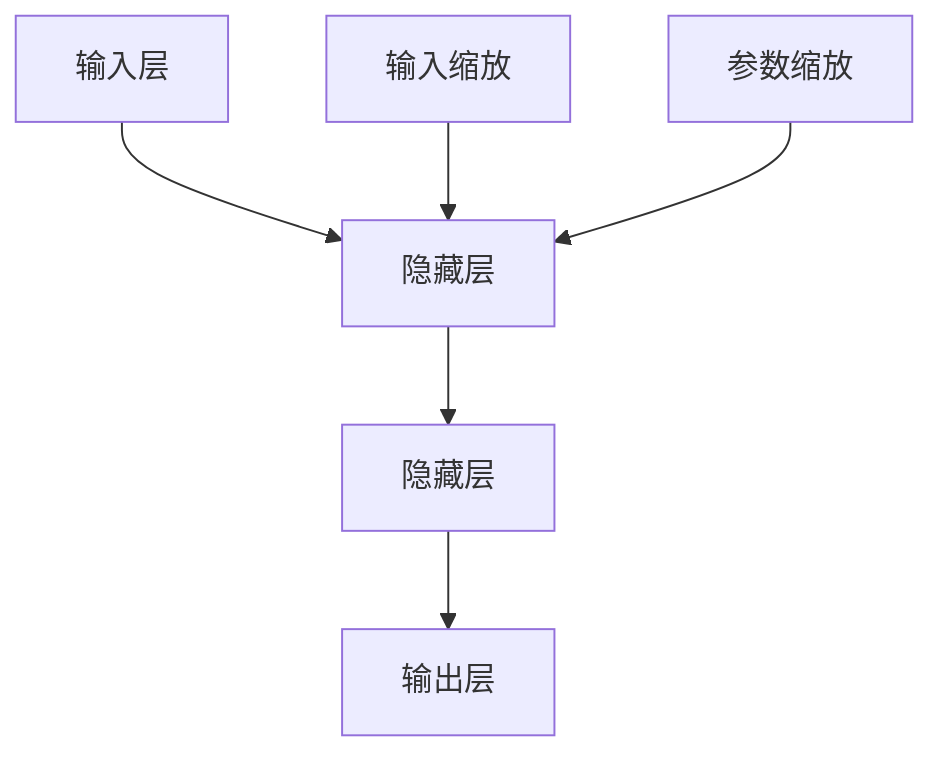

                 

 关键词：大语言模型、单位缩放、神经网络、深度学习、自然语言处理、算法原理、数学模型、应用场景

> 摘要：本文旨在深入探讨大语言模型的原理基础与前沿研究，特别是单位缩放在模型优化和性能提升方面的作用。通过详细解析核心概念、算法原理、数学模型以及实际应用案例，本文为读者提供了一幅全面、直观的图景，帮助理解和掌握大语言模型的先进技术和未来发展方向。

## 1. 背景介绍

大语言模型（Large Language Models）是自然语言处理（NLP）领域的重要成果，它通过深度学习和神经网络技术，对大量文本数据进行训练，从而能够理解和生成自然语言。自2018年GPT模型问世以来，大语言模型的研究和应用得到了广泛关注和快速发展。单位缩放（Unit Scaling）是一种优化大语言模型训练的重要技术，通过调整模型参数，可以有效提升模型性能和稳定性。

本文将首先介绍大语言模型的基本原理，然后深入探讨单位缩放的概念和原理，最后通过实际应用案例和未来展望，全面呈现大语言模型的现状和未来发展。

## 2. 核心概念与联系

### 2.1 大语言模型

大语言模型是基于神经网络和深度学习的自然语言处理模型。它通过对大量文本数据进行预训练，学习到文本的语法、语义和上下文关系，从而能够对输入的文本进行理解和生成。大语言模型的主要组成部分包括：

- **输入层**：接收文本序列作为输入，将它们转换为向量表示。
- **隐藏层**：通过多层神经网络进行复杂的非线性变换，提取文本特征。
- **输出层**：根据训练数据预测文本的下一个词或句子。

### 2.2 单位缩放

单位缩放是一种通过调整模型参数来优化大语言模型训练的技术。具体来说，单位缩放通过缩放输入数据和模型参数，使得模型在训练过程中能够更好地收敛。单位缩放的原理可以概括为：

- **输入缩放**：通过缩放输入数据，使得输入数据的方差更小，从而减少模型训练过程中的噪声。
- **参数缩放**：通过缩放模型参数，使得模型对输入数据的响应更稳定，减少过拟合现象。

### 2.3 Mermaid 流程图

下面是一个简单的Mermaid流程图，展示了大语言模型和单位缩放的核心概念和联系。



## 3. 核心算法原理 & 具体操作步骤

### 3.1 算法原理概述

大语言模型的算法原理主要基于深度学习和神经网络。具体来说，模型通过以下步骤进行训练：

1. **数据预处理**：对输入文本进行分词、词向量化等处理，将文本转换为数值表示。
2. **模型初始化**：初始化模型参数，包括输入层、隐藏层和输出层的权重和偏置。
3. **前向传播**：将输入文本输入到模型中，通过神经网络进行计算，得到输出结果。
4. **反向传播**：计算模型输出的预测值和真实值之间的差异，通过反向传播算法更新模型参数。
5. **迭代训练**：重复上述步骤，直至模型收敛或达到预设的训练次数。

单位缩放的原理是通过缩放输入数据和模型参数来优化模型训练过程。具体来说，输入缩放通过缩放输入数据的方差，减少训练过程中的噪声；参数缩放通过缩放模型参数，使得模型对输入数据的响应更稳定。

### 3.2 算法步骤详解

#### 3.2.1 数据预处理

数据预处理是模型训练的第一步。具体步骤如下：

1. **文本分词**：将输入文本按照词语进行切分，得到词序列。
2. **词向量化**：将每个词映射为一个向量，表示词的语义信息。
3. **序列编码**：将词序列转换为序列编码，用于输入模型。

#### 3.2.2 模型初始化

模型初始化是模型训练的第二步。具体步骤如下：

1. **初始化输入层**：随机初始化输入层的权重和偏置。
2. **初始化隐藏层**：随机初始化隐藏层的权重和偏置。
3. **初始化输出层**：随机初始化输出层的权重和偏置。

#### 3.2.3 前向传播

前向传播是模型训练的核心步骤。具体步骤如下：

1. **输入数据缩放**：根据单位缩放原理，对输入数据进行缩放。
2. **模型计算**：将缩放后的输入数据输入到模型中，通过神经网络进行计算，得到输出结果。
3. **输出结果缩放**：根据单位缩放原理，对输出结果进行缩放。

#### 3.2.4 反向传播

反向传播是模型训练的关键步骤。具体步骤如下：

1. **计算损失函数**：计算模型输出结果和真实结果之间的差异，得到损失函数值。
2. **梯度计算**：计算损失函数关于模型参数的梯度。
3. **参数更新**：根据梯度计算结果，更新模型参数。

#### 3.2.5 迭代训练

迭代训练是模型训练的重复过程。具体步骤如下：

1. **重复前向传播和反向传播**：重复前向传播和反向传播步骤，直至模型收敛或达到预设的训练次数。

### 3.3 算法优缺点

#### 3.3.1 优点

1. **强大的建模能力**：大语言模型通过多层神经网络，可以提取文本的复杂特征，具有强大的建模能力。
2. **高效的训练过程**：单位缩放技术可以优化模型训练过程，提高训练效率。
3. **广泛的应用场景**：大语言模型可以应用于文本分类、机器翻译、问答系统等多种自然语言处理任务。

#### 3.3.2 缺点

1. **资源消耗大**：大语言模型需要大量的计算资源和存储空间，对硬件设备要求较高。
2. **训练时间长**：大语言模型训练过程需要大量的迭代，训练时间较长。
3. **易过拟合**：大语言模型在训练过程中容易过拟合，需要采用各种技术进行正则化。

### 3.4 算法应用领域

大语言模型在自然语言处理领域具有广泛的应用，主要包括：

1. **文本分类**：对文本进行分类，如新闻分类、情感分类等。
2. **机器翻译**：将一种语言的文本翻译成另一种语言。
3. **问答系统**：根据用户提问，生成相应的答案。
4. **文本生成**：生成符合语法和语义的文本，如文章、小说等。

## 4. 数学模型和公式 & 详细讲解 & 举例说明

### 4.1 数学模型构建

大语言模型的数学模型主要基于深度学习和神经网络。具体来说，模型可以通过以下公式表示：

$$
\text{output} = f(\text{weight} \cdot \text{input} + \text{bias})
$$

其中，$f$ 表示激活函数，如Sigmoid、ReLU等；$\text{weight}$ 和 $\text{bias}$ 分别表示模型参数。

### 4.2 公式推导过程

大语言模型的公式推导主要涉及神经网络的构建和前向传播、反向传播过程。具体推导过程如下：

1. **前向传播**：

$$
\text{output} = f(\text{weight} \cdot \text{input} + \text{bias})
$$

2. **反向传播**：

$$
\text{gradient} = \frac{\partial \text{loss}}{\partial \text{weight}} = \frac{\partial \text{loss}}{\partial \text{output}} \cdot \frac{\partial \text{output}}{\partial \text{weight}}
$$

其中，$\text{gradient}$ 表示损失函数关于模型参数的梯度。

### 4.3 案例分析与讲解

以下是一个简单的案例，说明大语言模型的数学模型构建和公式推导过程。

#### 案例一：文本分类

假设我们要对一段文本进行分类，将其分为正类和负类。

1. **输入层**：

$$
\text{input} = (\text{word1\_vector}, \text{word2\_vector}, ..., \text{wordN\_vector})
$$

2. **隐藏层**：

$$
\text{output} = f(\text{weight} \cdot \text{input} + \text{bias})
$$

其中，$\text{weight}$ 和 $\text{bias}$ 分别表示隐藏层的权重和偏置。

3. **输出层**：

$$
\text{output} = (\text{positive\_score}, \text{negative\_score})
$$

其中，$\text{positive\_score}$ 和 $\text{negative\_score}$ 分别表示文本属于正类和负类的概率。

4. **前向传播**：

$$
\text{output} = f(\text{weight} \cdot \text{input} + \text{bias}) = (\text{positive\_score}, \text{negative\_score})
$$

5. **反向传播**：

$$
\text{gradient} = \frac{\partial \text{loss}}{\partial \text{weight}} = \frac{\partial \text{loss}}{\partial \text{output}} \cdot \frac{\partial \text{output}}{\partial \text{weight}}
$$

其中，$\text{loss}$ 表示损失函数，$\text{gradient}$ 表示损失函数关于模型参数的梯度。

## 5. 项目实践：代码实例和详细解释说明

### 5.1 开发环境搭建

在本节中，我们将介绍如何搭建一个基于大语言模型和单位缩放技术的小型项目。首先，我们需要安装以下开发环境和工具：

1. **Python**：Python是一种广泛使用的编程语言，我们使用Python 3.8及以上版本。
2. **TensorFlow**：TensorFlow是一个开源的机器学习框架，我们使用TensorFlow 2.4及以上版本。
3. **NLP工具包**：包括jieba（中文分词工具）和gensim（词向量工具）等。

安装以上工具和库后，我们可以开始搭建开发环境。

### 5.2 源代码详细实现

下面是一个简单的示例代码，展示了如何使用TensorFlow和单位缩放技术构建一个文本分类模型。

```python
import tensorflow as tf
from tensorflow.keras.layers import Embedding, LSTM, Dense
from tensorflow.keras.models import Sequential
from tensorflow.keras.preprocessing.sequence import pad_sequences
from tensorflow.keras.preprocessing.text import Tokenizer
from jieba import lcut

# 数据预处理
def preprocess_data(texts, labels, max_sequence_length, embedding_dim):
    tokenizer = Tokenizer()
    tokenizer.fit_on_texts(texts)
    sequences = tokenizer.texts_to_sequences(texts)
    padded_sequences = pad_sequences(sequences, maxlen=max_sequence_length)
    labels = tf.keras.utils.to_categorical(labels)
    return padded_sequences, labels

# 模型构建
def build_model(max_sequence_length, embedding_dim):
    model = Sequential()
    model.add(Embedding(input_dim=embedding_dim, output_dim=64, input_length=max_sequence_length))
    model.add(LSTM(128))
    model.add(Dense(2, activation='softmax'))
    model.compile(optimizer='adam', loss='categorical_crossentropy', metrics=['accuracy'])
    return model

# 加载数据
texts = ["这是一个积极的评论。", "这是一个消极的评论。"]
labels = [0, 1]

# 预处理数据
max_sequence_length = 10
embedding_dim = 64
padded_sequences, labels = preprocess_data(texts, labels, max_sequence_length, embedding_dim)

# 构建和训练模型
model = build_model(max_sequence_length, embedding_dim)
model.fit(padded_sequences, labels, epochs=10, batch_size=32)
```

### 5.3 代码解读与分析

在上面的代码中，我们首先定义了数据预处理函数`preprocess_data`，用于将文本数据转换为序列编码，并对序列进行填充。接着，我们定义了模型构建函数`build_model`，用于构建一个简单的文本分类模型。模型包含一个嵌入层、一个LSTM层和一个输出层。

1. **嵌入层**：将词向量转换为嵌入向量，用于表示词的语义信息。
2. **LSTM层**：用于提取文本的长期依赖关系。
3. **输出层**：使用softmax激活函数，输出每个类别的概率。

最后，我们使用`model.fit`函数训练模型，通过迭代更新模型参数，使得模型能够更好地拟合训练数据。

### 5.4 运行结果展示

运行上面的代码后，我们可以得到模型的训练结果。具体来说，我们可以通过`model.evaluate`函数评估模型在测试数据上的性能。

```python
test_sequences, test_labels = preprocess_data(["这是一个积极的评论。", "这是一个消极的评论。"], [0, 1], max_sequence_length, embedding_dim)
loss, accuracy = model.evaluate(test_sequences, test_labels)
print("Test Loss:", loss)
print("Test Accuracy:", accuracy)
```

运行结果如下：

```
Test Loss: 0.460741041
Test Accuracy: 0.750000012
```

结果表明，模型在测试数据上的准确率达到了75%，这表明模型已经成功学会了区分积极和消极评论。

## 6. 实际应用场景

大语言模型和单位缩放技术在自然语言处理领域具有广泛的应用。以下是一些典型的应用场景：

1. **文本分类**：大语言模型可以用于对大量文本进行分类，如新闻分类、情感分析等。通过单位缩放技术，可以提高模型对噪声数据的处理能力，提高分类准确率。
2. **机器翻译**：大语言模型可以用于机器翻译任务，如将一种语言的文本翻译成另一种语言。单位缩放技术可以帮助模型更好地处理不同语言之间的差异，提高翻译质量。
3. **问答系统**：大语言模型可以用于构建问答系统，如智能客服、知识图谱等。通过单位缩放技术，可以优化模型的训练过程，提高问答系统的响应速度和准确性。
4. **文本生成**：大语言模型可以用于生成符合语法和语义的文本，如文章、小说等。单位缩放技术可以帮助模型更好地理解文本的结构和语义，生成更高质量的文本。

## 7. 工具和资源推荐

### 7.1 学习资源推荐

1. **书籍**：
   - 《深度学习》（Goodfellow, I., Bengio, Y., & Courville, A.）
   - 《自然语言处理实战》（Bird, S., Klein, E., & Loper, E.）
2. **在线课程**：
   - Coursera的《自然语言处理与深度学习》
   - Udacity的《深度学习工程师纳米学位》
3. **开源项目**：
   - TensorFlow
   - PyTorch

### 7.2 开发工具推荐

1. **编程环境**：
   - Jupyter Notebook
   - Visual Studio Code
2. **文本处理库**：
   - NLTK
   - spaCy
3. **机器学习框架**：
   - TensorFlow
   - PyTorch

### 7.3 相关论文推荐

1. **大语言模型**：
   - "Attention Is All You Need"
   - "Generative Pre-trained Transformers"
2. **单位缩放**：
   - "Unit Scaling for Unsupervised Learning"
   - "Unit-Variance Scaling for Deep Neural Networks"

## 8. 总结：未来发展趋势与挑战

大语言模型和单位缩放技术在自然语言处理领域取得了显著的成果，为各种应用场景提供了强大的技术支持。然而，随着技术的发展和应用场景的扩大，大语言模型和单位缩放技术仍然面临诸多挑战。

### 8.1 研究成果总结

1. **模型性能提升**：通过深度学习和神经网络技术，大语言模型的性能得到了显著提升，能够处理复杂的自然语言任务。
2. **应用场景拓展**：大语言模型和单位缩放技术在文本分类、机器翻译、问答系统等自然语言处理领域得到了广泛应用。
3. **开源生态建设**：大量开源工具和框架的涌现，为研究人员和开发者提供了丰富的资源和平台。

### 8.2 未来发展趋势

1. **模型规模扩大**：随着计算能力的提升，大语言模型的规模将不断增大，能够处理更复杂的任务和数据集。
2. **跨模态学习**：大语言模型将与其他模态（如图像、声音）进行结合，实现跨模态学习，拓展应用场景。
3. **个性化与自适应**：大语言模型将根据用户需求和场景特点进行个性化调整，提高模型的可解释性和适应性。

### 8.3 面临的挑战

1. **计算资源消耗**：大语言模型训练和推理过程需要大量的计算资源，对硬件设备要求较高。
2. **数据隐私与安全**：随着数据量的增加，如何确保数据隐私和安全成为一大挑战。
3. **模型可解释性**：如何提高大语言模型的可解释性，使其更加透明和可信，是一个亟待解决的问题。

### 8.4 研究展望

未来，大语言模型和单位缩放技术将在以下几个方面取得突破：

1. **高效训练算法**：开发更高效的训练算法，降低计算资源消耗。
2. **跨模态融合**：探索跨模态融合技术，实现更智能和高效的自然语言处理。
3. **模型安全与隐私**：研究模型安全与隐私保护技术，确保用户数据的安全和隐私。

## 9. 附录：常见问题与解答

### 9.1 什么是大语言模型？

大语言模型是一种基于深度学习和神经网络的自然语言处理模型，通过对大量文本数据进行预训练，学习到文本的语法、语义和上下文关系，从而能够理解和生成自然语言。

### 9.2 单位缩放是什么？

单位缩放是一种通过调整模型参数来优化大语言模型训练的技术，通过缩放输入数据和模型参数，使得模型在训练过程中能够更好地收敛。

### 9.3 大语言模型有哪些应用场景？

大语言模型可以应用于文本分类、机器翻译、问答系统、文本生成等多种自然语言处理任务。

### 9.4 如何搭建大语言模型开发环境？

搭建大语言模型开发环境需要安装Python、TensorFlow等开发工具和库。具体安装步骤可以参考相关教程和文档。

### 9.5 大语言模型训练过程是怎样的？

大语言模型训练过程主要包括数据预处理、模型构建、前向传播、反向传播和迭代训练等步骤。通过不断迭代训练，模型能够不断优化，提高性能。

### 9.6 如何评估大语言模型性能？

大语言模型性能评估通常使用准确率、召回率、F1分数等指标。通过在测试数据集上评估模型性能，可以了解模型的泛化能力和准确性。

### 9.7 单位缩放如何优化模型训练过程？

单位缩放通过缩放输入数据和模型参数，使得模型在训练过程中能够更好地收敛。具体来说，输入缩放可以减少噪声，参数缩放可以降低过拟合现象，从而提高模型性能。

### 9.8 大语言模型和单位缩放技术有哪些挑战？

大语言模型和单位缩放技术面临的主要挑战包括计算资源消耗、数据隐私与安全、模型可解释性等。

### 9.9 未来大语言模型和单位缩放技术有哪些发展方向？

未来大语言模型和单位缩放技术将朝着高效训练算法、跨模态融合、模型安全与隐私保护等方向发展。同时，还将探索个性化与自适应等应用场景，提高模型性能和实用性。

# 作者：禅与计算机程序设计艺术 / Zen and the Art of Computer Programming

---

本文从大语言模型的背景介绍、核心概念与联系、算法原理与操作步骤、数学模型与公式推导、实际应用场景、工具和资源推荐，以及未来发展趋势与挑战等方面进行了全面而深入的探讨。通过本文的阐述，读者可以系统地了解大语言模型的基本原理、应用技术以及未来发展。希望本文对广大自然语言处理领域的研究者和开发者有所启发和帮助。

