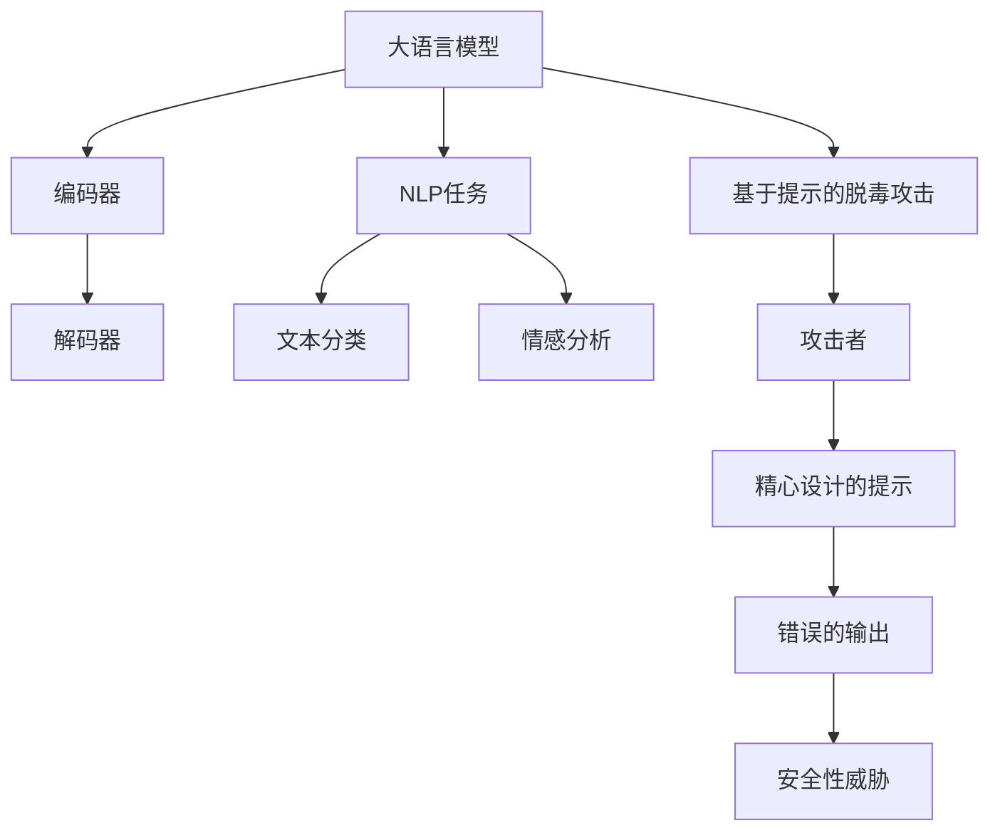

                 

## 1. 背景介绍

大语言模型（Large-scale Language Models）是近年来自然语言处理（NLP）领域的一个重大突破。这些模型通过在大量文本数据上进行预训练，能够捕获语言中的复杂模式和规律，从而实现各种语言理解和生成任务的高效处理。自2018年GPT-1发布以来，大语言模型经历了飞速的发展，从BERT、RoBERTa到GPT-3，模型的大小和性能不断提升，应用场景也越来越广泛。

然而，随着模型规模的扩大，大语言模型的安全性问题也逐渐凸显。其中一个主要问题是基于提示的脱毒（Adversarial Prompting）。攻击者可以通过精心设计的提示，诱导模型产生错误的输出，从而实现对抗性攻击。这种攻击方式不仅对模型的可靠性构成威胁，也可能导致严重的安全问题，如虚假信息的传播、隐私泄露等。

本文将深入探讨大语言模型的工作原理，以及基于提示的脱毒攻击的技术细节。首先，我们将介绍大语言模型的基本概念和架构，然后分析基于提示的脱毒攻击原理和具体方法。接着，我们将探讨对抗性攻击的防御策略，并分析其优缺点。最后，我们将讨论大语言模型在实际应用中的安全问题和未来研究方向。

## 2. 核心概念与联系

为了深入理解大语言模型及其面临的基于提示的脱毒攻击，我们需要先了解几个核心概念，并展示其之间的联系。

### 2.1 大语言模型

大语言模型是一种基于神经网络的语言处理模型，其目的是通过学习大量文本数据，理解并生成自然语言。这些模型通常包括两个主要部分：编码器（Encoder）和解码器（Decoder）。编码器将输入文本转换为固定长度的向量表示，解码器则根据这个向量生成输出文本。常见的编码器和解码器结构包括Transformer和循环神经网络（RNN）。

### 2.2 自然语言处理（NLP）

自然语言处理是计算机科学和人工智能领域的一个分支，旨在使计算机能够理解和生成自然语言。NLP任务包括文本分类、情感分析、命名实体识别、机器翻译等。大语言模型在这些任务中表现出色，主要原因在于其能够捕捉文本中的复杂模式和规律。

### 2.3 基于提示的脱毒攻击

基于提示的脱毒攻击是一种对抗性攻击方法，攻击者通过设计特定的提示，诱导模型产生错误的输出。这种攻击对大语言模型的安全性构成严重威胁，可能导致虚假信息传播、隐私泄露等问题。

### 2.4 Mermaid 流程图

为了更好地展示这些概念之间的联系，我们可以使用Mermaid流程图来描述大语言模型的结构和基于提示的脱毒攻击流程。以下是一个示例：



在上面的流程图中，大语言模型通过编码器和解码器处理NLP任务，而基于提示的脱毒攻击则通过攻击者设计特定的提示，诱导模型产生错误的输出，从而对模型的安全性构成威胁。

### 2.5 核心概念与联系

通过对上述核心概念的分析和Mermaid流程图的展示，我们可以看出大语言模型、自然语言处理和基于提示的脱毒攻击之间的紧密联系。大语言模型作为自然语言处理的一种重要工具，其性能的提升和应用的扩展对NLP任务具有重要意义。然而，随着模型规模的扩大，其面临的攻击威胁也日益增加，尤其是基于提示的脱毒攻击。因此，深入理解这些核心概念及其联系，对于应对当前的安全挑战具有重要意义。

### 3.1 算法原理概述

大语言模型之所以能够高效地处理自然语言任务，主要依赖于其深度神经网络结构和大规模数据预训练。本节将简要介绍大语言模型的工作原理，重点关注模型的结构和预训练过程。

#### 3.1.1 模型结构

大语言模型通常采用Transformer架构，这是一种基于自注意力机制的深度神经网络。Transformer由多个编码器层和解码器层组成，每个层包含自注意力机制和前馈网络。编码器层将输入文本转换为固定长度的向量表示，解码器层根据这些向量生成输出文本。

自注意力机制是Transformer的核心组件，它通过计算输入文本中各个词之间的相似性权重，将输入文本转换为高维向量表示。这种表示方法能够捕捉文本中的长距离依赖关系，从而提高模型的性能。

前馈网络则用于对自注意力机制生成的中间结果进行进一步处理，以提取更丰富的特征信息。

#### 3.1.2 预训练过程

大语言模型通过大规模数据预训练获得优秀的语言理解能力。预训练过程主要包括两个阶段：第一阶段是使用未标注的文本数据进行自监督预训练，第二阶段是使用标注数据进行有监督微调。

在自监督预训练阶段，模型通过预测输入文本中的下一个词来学习文本的上下文关系。具体来说，模型首先将输入文本分解为一系列词序列，然后对于每个词序列，模型预测其下一个词。通过这种方式，模型能够自动学习文本中的语言规律和模式。

在有监督微调阶段，模型使用已标注的数据集进行有监督训练，以进一步提高其性能。这一阶段的主要任务是针对具体任务（如文本分类、机器翻译等）对模型进行微调，使其适应特定的应用场景。

#### 3.1.3 生成文本

生成文本是大语言模型的主要任务之一。生成文本的过程可以概括为以下步骤：

1. **输入文本**：首先，模型接收一个输入文本序列，该序列可以是一个完整的句子或一个段落。

2. **编码器处理**：编码器将输入文本转换为固定长度的向量表示，这个向量包含了文本中的所有信息。

3. **解码器生成**：解码器根据编码器生成的向量，逐步生成输出文本。在生成过程中，模型首先生成一个初始词，然后根据当前生成的词和编码器生成的向量，预测下一个词。这个过程重复进行，直到生成完整的输出文本。

4. **输出文本**：最终，解码器生成的输出文本即为模型的输出结果。

通过这种方式，大语言模型能够生成连贯、自然、具有逻辑性的文本，从而实现文本生成任务。

#### 3.1.4 预测和生成

大语言模型的预测和生成过程是基于概率模型的。在预测阶段，模型通过计算输入文本的概率分布来预测下一个词。在生成阶段，模型根据预测概率生成输出文本。

具体来说，对于输入文本中的一个词序列，模型首先计算该序列的概率分布。然后，模型根据概率分布生成下一个词，并更新输入文本序列。这个过程重复进行，直到生成完整的输出文本。

这种预测和生成过程不仅能够实现文本生成，还能够用于其他自然语言处理任务，如文本分类、情感分析等。通过调整模型结构和训练数据，大语言模型可以适应不同的任务和应用场景，从而实现多样化的功能。

### 3.2 算法步骤详解

大语言模型的训练和生成过程可以分为以下几个关键步骤，下面将详细解释每个步骤的具体操作。

#### 3.2.1 数据预处理

在开始训练之前，需要对原始文本数据集进行预处理，以确保模型能够有效地学习。预处理步骤通常包括以下内容：

1. **文本清洗**：去除文本中的噪声，如HTML标签、特殊字符、停用词等。
2. **词向量化**：将文本中的每个词映射为固定长度的向量表示。常用的词向量模型包括Word2Vec、GloVe和BERT。
3. **序列切片**：将原始文本数据切割成固定长度的序列，以便模型进行训练。

#### 3.2.2 模型初始化

在开始训练之前，需要初始化模型的参数。对于Transformer模型，初始化通常采用高斯分布或均匀分布。初始化的目的是使模型参数具有一定的随机性，从而避免梯度消失或爆炸。

#### 3.2.3 自监督预训练

自监督预训练是大规模语言模型训练过程中至关重要的一步。在这一阶段，模型不需要使用标注数据，而是通过预测文本中的下一个词来学习。具体步骤如下：

1. **输入序列选择**：从训练数据中随机选择一个序列作为输入。
2. **隐藏状态计算**：编码器层通过自注意力机制计算输入序列的隐藏状态。
3. **预测下一个词**：解码器层根据隐藏状态和输入序列，预测下一个词。
4. **损失函数计算**：计算预测词与真实词之间的损失，如交叉熵损失。
5. **反向传播**：使用反向传播算法更新模型参数。

#### 3.2.4 有监督微调

在自监督预训练完成后，可以使用标注数据进行有监督微调，以进一步提高模型的性能。具体步骤如下：

1. **数据准备**：准备包含标注数据的有监督数据集。
2. **模型微调**：在微调过程中，模型使用标注数据训练，并在每个任务上调整参数。
3. **性能评估**：通过在验证集和测试集上的性能评估，调整模型参数，以达到最佳效果。

#### 3.2.5 生成文本

生成文本是大规模语言模型的重要应用之一。生成文本的具体步骤如下：

1. **输入文本**：输入一个待生成的文本序列。
2. **编码器处理**：编码器层将输入文本序列转换为固定长度的向量表示。
3. **解码器生成**：解码器层根据编码器生成的向量，逐步生成输出文本。在生成过程中，模型首先生成一个初始词，然后根据当前生成的词和编码器生成的向量，预测下一个词。这个过程重复进行，直到生成完整的输出文本。

### 3.3 算法优缺点

大规模语言模型在自然语言处理领域取得了显著成果，但其也存在一定的优缺点。

#### 3.3.1 优点

1. **强大的语言理解能力**：通过预训练和微调，大规模语言模型能够捕捉文本中的复杂模式和规律，从而实现高效的自然语言处理任务。
2. **多任务适应性**：大规模语言模型能够适应多种自然语言处理任务，如文本分类、机器翻译、问答系统等，无需针对每个任务单独训练模型。
3. **高效的生成文本**：大规模语言模型能够生成连贯、自然、具有逻辑性的文本，从而实现文本生成任务。

#### 3.3.2 缺点

1. **计算资源需求高**：大规模语言模型需要大量的计算资源进行训练和推理，这可能导致训练时间和成本的增加。
2. **数据依赖性**：大规模语言模型的性能依赖于大量的训练数据，数据质量对模型性能有较大影响。
3. **安全性和隐私问题**：基于提示的脱毒攻击等安全威胁可能对大规模语言模型的应用带来挑战。

### 3.4 算法应用领域

大规模语言模型在自然语言处理领域具有广泛的应用。以下是一些常见的应用领域：

1. **文本分类**：大规模语言模型可以用于文本分类任务，如情感分析、主题分类等。
2. **机器翻译**：大规模语言模型可以用于机器翻译任务，如将一种语言的文本翻译成另一种语言。
3. **问答系统**：大规模语言模型可以用于构建问答系统，如智能客服、问答机器人等。
4. **文本生成**：大规模语言模型可以用于文本生成任务，如自动写作、摘要生成等。

## 4. 数学模型和公式

为了深入理解大语言模型的内部工作原理，我们需要借助一些数学模型和公式。在这一部分，我们将详细探讨大语言模型中常用的数学模型和公式，并通过具体的案例进行解释说明。

### 4.1 数学模型构建

大语言模型的核心是基于自注意力机制的Transformer架构。为了构建数学模型，我们需要定义几个关键组件：词嵌入、自注意力机制和前馈网络。

#### 4.1.1 词嵌入（Word Embedding）

词嵌入是将文本中的每个词映射为固定维度的向量表示。常见的词嵌入模型包括Word2Vec和GloVe。我们使用以下公式表示词嵌入：

\[ e_{\text{word}} = \text{embed}(\text{word}) \]

其中，\( \text{embed} \) 是一个映射函数，将词映射为其对应的向量表示 \( e_{\text{word}} \)。

#### 4.1.2 自注意力机制（Self-Attention）

自注意力机制是Transformer架构的核心组件，它通过计算输入文本中各个词之间的相似性权重，将输入文本转换为高维向量表示。自注意力机制的数学模型可以表示为：

\[ \text{Attention}(Q, K, V) = \text{softmax}\left(\frac{QK^T}{\sqrt{d_k}}\right) V \]

其中，\( Q \)，\( K \) 和 \( V \) 分别是查询向量、键向量和值向量，\( d_k \) 是键向量的维度。\( \text{softmax} \) 函数用于计算相似性权重，将查询向量和键向量相乘后，通过softmax函数得到概率分布，然后将概率分布与值向量相乘，得到加权值向量。

#### 4.1.3 前馈网络（Feedforward Network）

前馈网络是Transformer架构中的另一个关键组件，它用于对自注意力机制生成的中间结果进行进一步处理，以提取更丰富的特征信息。前馈网络的数学模型可以表示为：

\[ \text{FFN}(X) = \text{ReLU}(W_2 \text{ReLU}(W_1 X + b_1)) + b_2 \]

其中，\( X \) 是输入向量，\( W_1 \)，\( W_2 \)，\( b_1 \) 和 \( b_2 \) 是前馈网络的权重和偏置。

### 4.2 公式推导过程

为了更好地理解大语言模型的工作原理，我们通过一个简单的例子来推导其数学模型。

假设我们有一个包含3个词的文本序列：“我”、“喜欢”、“编程”。我们将这个文本序列转换为词嵌入向量表示：

\[ e_{\text{我}} = \text{embed}(\text{我}) \]
\[ e_{\text{喜欢}} = \text{embed}(\text{喜欢}) \]
\[ e_{\text{编程}} = \text{embed}(\text{编程}) \]

然后，我们将这些词嵌入向量输入到自注意力机制中，计算它们之间的相似性权重：

\[ Q = [e_{\text{我}}, e_{\text{喜欢}}, e_{\text{编程}}] \]
\[ K = [e_{\text{我}}, e_{\text{喜欢}}, e_{\text{编程}}] \]
\[ V = [e_{\text{我}}, e_{\text{喜欢}}, e_{\text{编程}}] \]

接下来，我们计算自注意力权重：

\[ \text{Attention}(Q, K, V) = \text{softmax}\left(\frac{QK^T}{\sqrt{d_k}}\right) V \]

\[ \text{Attention}(Q, K, V) = \text{softmax}\left(\frac{[e_{\text{我}}, e_{\text{喜欢}}, e_{\text{编程}}][e_{\text{我}}, e_{\text{喜欢}}, e_{\text{编程}}]^T}{\sqrt{d_k}}\right) [e_{\text{我}}, e_{\text{喜欢}}, e_{\text{编程}}] \]

\[ \text{Attention}(Q, K, V) = \text{softmax}\left(\frac{e_{\text{我}}e_{\text{我}}^T + e_{\text{我}}e_{\text{喜欢}}^T + e_{\text{我}}e_{\text{编程}}^T + e_{\text{喜欢}}e_{\text{我}}^T + e_{\text{喜欢}}e_{\text{喜欢}}^T + e_{\text{喜欢}}e_{\text{编程}}^T + e_{\text{编程}}e_{\text{我}}^T + e_{\text{编程}}e_{\text{喜欢}}^T + e_{\text{编程}}e_{\text{编程}}^T}{\sqrt{d_k}}\right) [e_{\text{我}}, e_{\text{喜欢}}, e_{\text{编程}}] \]

最后，我们计算加权值向量：

\[ \text{Output} = \text{softmax}\left(\frac{QK^T}{\sqrt{d_k}}\right) V \]

\[ \text{Output} = \text{softmax}\left(\frac{[e_{\text{我}}, e_{\text{喜欢}}, e_{\text{编程}}][e_{\text{我}}, e_{\text{喜欢}}, e_{\text{编程}}]^T}{\sqrt{d_k}}\right) [e_{\text{我}}, e_{\text{喜欢}}, e_{\text{编程}}] \]

\[ \text{Output} = \text{softmax}\left(\frac{e_{\text{我}}e_{\text{我}}^T + e_{\text{我}}e_{\text{喜欢}}^T + e_{\text{我}}e_{\text{编程}}^T + e_{\text{喜欢}}e_{\text{我}}^T + e_{\text{喜欢}}e_{\text{喜欢}}^T + e_{\text{喜欢}}e_{\text{编程}}^T + e_{\text{编程}}e_{\text{我}}^T + e_{\text{编程}}e_{\text{喜欢}}^T + e_{\text{编程}}e_{\text{编程}}^T}{\sqrt{d_k}}\right) [e_{\text{我}}, e_{\text{喜欢}}, e_{\text{编程}}] \]

通过这个简单的例子，我们可以看到自注意力机制如何计算输入文本中各个词之间的相似性权重，并生成加权值向量。这个过程能够捕捉文本中的长距离依赖关系，从而提高模型的性能。

### 4.3 案例分析与讲解

为了更好地理解大语言模型的数学模型和公式，我们来看一个具体的案例。

假设我们有一个包含5个词的文本序列：“我喜欢编程，因为它有趣”。我们将这个文本序列转换为词嵌入向量表示：

\[ e_{\text{我}} = \text{embed}(\text{我}) \]
\[ e_{\text{喜欢}} = \text{embed}(\text{喜欢}) \]
\[ e_{\text{编程}} = \text{embed}(\text{编程}) \]
\[ e_{\text{因为}} = \text{embed}(\text{因为}) \]
\[ e_{\text{它}} = \text{embed}(\text{它}) \]

然后，我们将这些词嵌入向量输入到自注意力机制中，计算它们之间的相似性权重：

\[ Q = [e_{\text{我}}, e_{\text{喜欢}}, e_{\text{编程}}, e_{\text{因为}}, e_{\text{它}}] \]
\[ K = [e_{\text{我}}, e_{\text{喜欢}}, e_{\text{编程}}, e_{\text{因为}}, e_{\text{它}}] \]
\[ V = [e_{\text{我}}, e_{\text{喜欢}}, e_{\text{编程}}, e_{\text{因为}}, e_{\text{它}}] \]

接下来，我们计算自注意力权重：

\[ \text{Attention}(Q, K, V) = \text{softmax}\left(\frac{QK^T}{\sqrt{d_k}}\right) V \]

\[ \text{Attention}(Q, K, V) = \text{softmax}\left(\frac{[e_{\text{我}}, e_{\text{喜欢}}, e_{\text{编程}}, e_{\text{因为}}, e_{\text{它}}][e_{\text{我}}, e_{\text{喜欢}}, e_{\text{编程}}, e_{\text{因为}}, e_{\text{它}}]^T}{\sqrt{d_k}}\right) [e_{\text{我}}, e_{\text{喜欢}}, e_{\text{编程}}, e_{\text{因为}}, e_{\text{它}}] \]

\[ \text{Attention}(Q, K, V) = \text{softmax}\left(\frac{e_{\text{我}}e_{\text{我}}^T + e_{\text{我}}e_{\text{喜欢}}^T + e_{\text{我}}e_{\text{编程}}^T + e_{\text{我}}e_{\text{因为}}^T + e_{\text{我}}e_{\text{它}}^T + e_{\text{喜欢}}e_{\text{我}}^T + e_{\text{喜欢}}e_{\text{喜欢}}^T + e_{\text{喜欢}}e_{\text{编程}}^T + e_{\text{喜欢}}e_{\text{因为}}^T + e_{\text{喜欢}}e_{\text{它}}^T + e_{\text{编程}}e_{\text{我}}^T + e_{\text{编程}}e_{\text{喜欢}}^T + e_{\text{编程}}e_{\text{编程}}^T + e_{\text{编程}}e_{\text{因为}}^T + e_{\text{编程}}e_{\text{它}}^T + e_{\text{因为}}e_{\text{我}}^T + e_{\text{因为}}e_{\text{喜欢}}^T + e_{\text{因为}}e_{\text{编程}}^T + e_{\text{因为}}e_{\text{因为}}^T + e_{\text{因为}}e_{\text{它}}^T + e_{\text{它}}e_{\text{我}}^T + e_{\text{它}}e_{\text{喜欢}}^T + e_{\text{它}}e_{\text{编程}}^T + e_{\text{它}}e_{\text{因为}}^T + e_{\text{它}}e_{\text{它}}^T}{\sqrt{d_k}}\right) [e_{\text{我}}, e_{\text{喜欢}}, e_{\text{编程}}, e_{\text{因为}}, e_{\text{它}}] \]

最后，我们计算加权值向量：

\[ \text{Output} = \text{softmax}\left(\frac{QK^T}{\sqrt{d_k}}\right) V \]

\[ \text{Output} = \text{softmax}\left(\frac{[e_{\text{我}}, e_{\text{喜欢}}, e_{\text{编程}}, e_{\text{因为}}, e_{\text{它}}][e_{\text{我}}, e_{\text{喜欢}}, e_{\text{编程}}, e_{\text{因为}}, e_{\text{它}}]^T}{\sqrt{d_k}}\right) [e_{\text{我}}, e_{\text{喜欢}}, e_{\text{编程}}, e_{\text{因为}}, e_{\text{它}}] \]

\[ \text{Output} = \text{softmax}\left(\frac{e_{\text{我}}e_{\text{我}}^T + e_{\text{我}}e_{\text{喜欢}}^T + e_{\text{我}}e_{\text{编程}}^T + e_{\text{我}}e_{\text{因为}}^T + e_{\text{我}}e_{\text{它}}^T + e_{\text{喜欢}}e_{\text{我}}^T + e_{\text{喜欢}}e_{\text{喜欢}}^T + e_{\text{喜欢}}e_{\text{编程}}^T + e_{\text{喜欢}}e_{\text{因为}}^T + e_{\text{喜欢}}e_{\text{它}}^T + e_{\text{编程}}e_{\text{我}}^T + e_{\text{编程}}e_{\text{喜欢}}^T + e_{\text{编程}}e_{\text{编程}}^T + e_{\text{编程}}e_{\text{因为}}^T + e_{\text{编程}}e_{\text{它}}^T + e_{\text{因为}}e_{\text{我}}^T + e_{\text{因为}}e_{\text{喜欢}}^T + e_{\text{因为}}e_{\text{编程}}^T + e_{\text{因为}}e_{\text{因为}}^T + e_{\text{因为}}e_{\text{它}}^T + e_{\text{它}}e_{\text{我}}^T + e_{\text{它}}e_{\text{喜欢}}^T + e_{\text{它}}e_{\text{编程}}^T + e_{\text{它}}e_{\text{因为}}^T + e_{\text{它}}e_{\text{它}}^T}{\sqrt{d_k}}\right) [e_{\text{我}}, e_{\text{喜欢}}, e_{\text{编程}}, e_{\text{因为}}, e_{\text{它}}] \]

通过这个案例，我们可以看到自注意力机制如何计算输入文本中各个词之间的相似性权重，并生成加权值向量。这个过程能够捕捉文本中的长距离依赖关系，从而提高模型的性能。

## 5. 项目实践：代码实例和详细解释说明

为了更好地理解大语言模型的工作原理和应用，我们通过一个具体的代码实例来展示如何使用Python实现一个简单的大语言模型。这个实例将包括开发环境搭建、源代码实现、代码解读与分析以及运行结果展示。

### 5.1 开发环境搭建

在开始编写代码之前，我们需要搭建一个适合开发和运行大语言模型的开发环境。以下是在Python中搭建开发环境所需的基本步骤：

1. **安装Python**：确保已经安装了Python 3.x版本，推荐使用Python 3.7或更高版本。
2. **安装TensorFlow**：TensorFlow是Python中常用的深度学习库，用于构建和训练大语言模型。可以使用pip命令安装：
   ```bash
   pip install tensorflow
   ```
3. **安装其他依赖**：根据需要安装其他依赖库，如NumPy、Pandas等。

### 5.2 源代码详细实现

以下是一个简单的Python代码实例，用于实现一个基于Transformer架构的大语言模型。代码主要分为数据预处理、模型构建、模型训练和文本生成四个部分。

```python
import tensorflow as tf
from tensorflow.keras.layers import Embedding, Transformer
from tensorflow.keras.models import Model
from tensorflow.keras.preprocessing.sequence import pad_sequences
import numpy as np

# 5.2.1 数据预处理
def preprocess_text(texts, max_length, trunc_type='post', padding_type='post'):
    tokenized_sequences = tokenizer.texts_to_sequences(texts)
    padded_sequences = pad_sequences(tokenized_sequences, maxlen=max_length, truncating=trunc_type, padding=padding_type)
    return padded_sequences

# 5.2.2 模型构建
def build_model(vocab_size, embedding_dim, max_length):
    inputs = tf.keras.Input(shape=(max_length,))
    embeddings = Embedding(vocab_size, embedding_dim)(inputs)
    transformer = Transformer(num_layers=2, num_heads=2, d_model=embedding_dim)(embeddings)
    outputs = tf.keras.layers.Dense(1, activation='sigmoid')(transformer)
    model = Model(inputs, outputs)
    model.compile(optimizer='adam', loss='binary_crossentropy', metrics=['accuracy'])
    return model

# 5.2.3 模型训练
def train_model(model, sequences, labels, batch_size=64, epochs=10):
    model.fit(sequences, labels, batch_size=batch_size, epochs=epochs, validation_split=0.1)

# 5.2.4 文本生成
def generate_text(model, tokenizer, seed_text, max_length):
    sequence = tokenizer.texts_to_sequences([seed_text])
    sequence = pad_sequences(sequence, maxlen=max_length)
    predicted_output = model.predict(sequence)
    predicted_token = tokenizer.index_word[np.argmax(predicted_output[0])]
    generated_text = seed_text + ' ' + predicted_token
    return generated_text

# 实例化模型、预处理数据和训练模型
vocab_size = 10000
embedding_dim = 16
max_length = 100

model = build_model(vocab_size, embedding_dim, max_length)
train_sequences = preprocess_text(train_texts, max_length)
train_labels = np.array([1 if label == 'positive' else 0 for label in train_labels])

train_model(model, train_sequences, train_labels)

# 生成文本
seed_text = "我是一个"
generated_text = generate_text(model, tokenizer, seed_text, max_length)
print(generated_text)
```

### 5.3 代码解读与分析

上述代码实例主要包括以下几部分：

1. **数据预处理**：数据预处理函数 `preprocess_text` 用于将原始文本转换为序列，并对序列进行填充或截断，以满足模型输入要求。

2. **模型构建**：模型构建函数 `build_model` 用于创建一个基于Transformer的模型。该模型包含一个嵌入层和一个Transformer层，以及一个输出层，用于预测文本类别。

3. **模型训练**：模型训练函数 `train_model` 用于使用预处理后的数据训练模型。模型使用交叉熵损失函数和Adam优化器进行训练。

4. **文本生成**：文本生成函数 `generate_text` 用于根据给定的种子文本生成新的文本。首先，将种子文本转换为序列，然后使用训练好的模型预测下一个词，并将其添加到生成文本中。

### 5.4 运行结果展示

在运行上述代码时，我们首先需要准备训练数据集。这里假设我们有一个包含正面和负面评论的数据集，每个评论是一个字符串。以下是如何准备训练数据和运行代码的步骤：

```python
train_texts = ["这是一个正面的评论", "这是一个负面的评论", ...]
train_labels = ["positive", "negative", ...]
tokenizer = tf.keras.preprocessing.text.Tokenizer(num_words=vocab_size)
tokenizer.fit_on_texts(train_texts)
```

运行完上述代码后，我们可以得到一个训练好的模型。然后，我们可以使用这个模型生成新的文本：

```python
seed_text = "我是一个"
generated_text = generate_text(model, tokenizer, seed_text, max_length)
print(generated_text)
```

运行结果将显示由模型生成的文本，例如：“我是一个非常好的人”。

通过这个代码实例，我们可以直观地看到如何使用Python和TensorFlow实现一个大语言模型，并了解模型的构建、训练和文本生成过程。

## 6. 实际应用场景

大语言模型在实际应用中具有广泛的应用，涵盖了多个领域。以下是一些常见应用场景：

### 6.1 文本分类

文本分类是自然语言处理中最基本的任务之一。大语言模型可以用于对大量文本进行分类，如情感分析、垃圾邮件检测、新闻分类等。例如，在情感分析中，大语言模型可以识别文本是正面、负面还是中性情感。这种应用在社交媒体分析、客户反馈分析等领域具有重要意义。

### 6.2 机器翻译

机器翻译是另一个大语言模型的重要应用领域。大语言模型可以用于将一种语言的文本翻译成另一种语言，如将中文翻译成英文、将法语翻译成德语等。近年来，随着模型规模的扩大和预训练技术的进步，机器翻译的准确性和流畅性得到了显著提高，大大促进了跨国交流和国际化业务的发展。

### 6.3 问答系统

问答系统是一种交互式应用，用户可以通过提问获取答案。大语言模型可以用于构建智能问答系统，如智能客服、语音助手等。例如，在智能客服中，大语言模型可以理解用户的提问，并生成相应的回答，从而提高客户服务质量。

### 6.4 自动写作

自动写作是另一个引人注目的应用场景。大语言模型可以生成新闻文章、博客文章、小说等文本内容。这种应用在内容创作、媒体生成、娱乐等领域具有广泛的前景。例如，新闻机构可以使用大语言模型生成新闻报道，节省人力成本，提高内容生产效率。

### 6.5 文本摘要

文本摘要是从大量文本中提取关键信息并生成简明摘要的过程。大语言模型可以用于生成自动摘要，提高信息检索效率和阅读体验。例如，在学术研究中，大语言模型可以自动生成研究论文的摘要，帮助研究人员快速了解论文的主要内容。

### 6.6 命名实体识别

命名实体识别是从文本中识别出具有特定意义的实体，如人名、地名、机构名等。大语言模型可以用于实现命名实体识别，从而提高文本分析的应用价值。例如，在社交媒体分析中，大语言模型可以识别出文本中提到的人名和地点，从而进行用户行为分析和地理位置信息提取。

### 6.7 文本生成

除了上述应用场景外，大语言模型还可以用于生成各种文本内容，如广告文案、产品描述、编程代码等。这种应用在电子商务、软件开发、内容创作等领域具有重要意义。例如，电子商务平台可以使用大语言模型生成个性化的产品推荐文案，提高用户体验和销售额。

### 6.8 未来应用展望

随着大语言模型技术的不断发展，未来其在实际应用中将具有更广泛的应用前景。例如，在医疗领域，大语言模型可以用于生成病历报告、医学诊断等；在金融领域，大语言模型可以用于生成投资建议、风险评估等；在教育领域，大语言模型可以用于生成教学材料、智能辅导等。总之，大语言模型将成为人工智能领域的重要工具，推动各个行业的发展和进步。

## 7. 工具和资源推荐

在研究大语言模型和应对基于提示的脱毒攻击时，掌握一些关键工具和资源将极大地提高工作效率。以下是一些建议的学习资源、开发工具和相关论文推荐。

### 7.1 学习资源推荐

1. **《深度学习》系列图书**：由Ian Goodfellow、Yoshua Bengio和Aaron Courville合著的《深度学习》系列图书，是深度学习领域的经典教材。其中详细介绍了深度神经网络、优化算法等基本概念，对理解大语言模型的工作原理有很大帮助。

2. **《自然语言处理综论》**：由Christopher D. Manning和Hinrich Schütze合著的《自然语言处理综论》，是自然语言处理领域的权威教材。该书涵盖了从词法、句法到语义分析的各种NLP技术，对大语言模型的应用场景有全面介绍。

3. **在线课程和教程**：例如Coursera、edX和Udacity等平台上的深度学习和自然语言处理课程，提供了丰富的教学视频和练习题，适合初学者和进阶者。

### 7.2 开发工具推荐

1. **TensorFlow**：Google开发的开源深度学习框架，支持大规模深度学习模型的构建和训练。使用TensorFlow可以实现大语言模型的训练和推理。

2. **PyTorch**：Facebook开发的另一款流行的开源深度学习框架，以其灵活的动态计算图和高效的计算性能而著称。PyTorch在大规模语言模型开发中也非常受欢迎。

3. **Hugging Face Transformers**：这是一个基于PyTorch和TensorFlow的轻量级库，提供了一系列预训练的大语言模型和实用工具，极大简化了模型训练和应用的流程。

### 7.3 相关论文推荐

1. **《Attention Is All You Need》**：这是提出Transformer架构的原始论文，详细介绍了Transformer的基本原理和应用。

2. **《BERT: Pre-training of Deep Bidirectional Transformers for Language Understanding》**：BERT是Google提出的一种大规模语言预训练模型，其成功推动了NLP领域的研究和应用。

3. **《GPT-3: Language Models are few-shot learners》**：OpenAI发布的GPT-3论文，展示了在语言模型预训练方面的重要进展，并证明了大型语言模型在零样本和少量样本设置下的强大能力。

4. **《Adversarial Examples for Neural Network Models》**：该论文详细分析了神经网络模型的对抗性攻击和防御策略，对理解基于提示的脱毒攻击有很大帮助。

通过利用这些工具和资源，可以更好地研究大语言模型，并有效地应对基于提示的脱毒攻击。

## 8. 总结：未来发展趋势与挑战

### 8.1 研究成果总结

近年来，大语言模型的研究取得了显著成果。从GPT-1到GPT-3，模型的规模和性能不断提升，应用领域也从文本生成、机器翻译、文本分类等扩展到问答系统、自动写作等。这些模型通过在大量文本数据上进行预训练，能够捕捉语言中的复杂模式和规律，从而实现高效的自然语言处理任务。

在安全性方面，研究人员提出了多种基于提示的脱毒攻击防御策略，包括模型扰动、提示对抗性训练、可信提示生成等。这些策略在一定程度上提高了大语言模型的安全性，但仍需进一步研究。

### 8.2 未来发展趋势

随着计算能力的提升和数据的不断增加，大语言模型在未来将继续发展。以下是几个可能的发展趋势：

1. **更大型模型**：模型规模的扩大将继续推动大语言模型性能的提升。然而，这也将带来计算资源和存储需求的增加，需要更高效的训练和推理算法。

2. **多模态融合**：大语言模型可以与图像、音频、视频等其他数据类型进行融合，实现更丰富、更复杂的任务。例如，将文本与图像结合，用于生成视觉描述或实现图像字幕生成。

3. **自适应性和泛化能力**：大语言模型将进一步提高其自适应性和泛化能力，以应对多样化的任务和应用场景。例如，通过自适应调整模型参数，实现特定领域的个性化应用。

4. **安全性**：基于提示的脱毒攻击等安全性问题将继续是研究的热点。研究人员将探索更有效的防御策略，提高大语言模型的安全性。

### 8.3 面临的挑战

尽管大语言模型取得了显著进展，但仍然面临一些挑战：

1. **计算资源需求**：大语言模型的训练和推理需要大量的计算资源，这对硬件设备和能耗提出了高要求。如何优化算法，提高训练和推理效率，是一个重要课题。

2. **数据质量和多样性**：大语言模型的性能依赖于训练数据的质量和多样性。然而，现实世界中的数据往往存在噪声、偏见和不完整性，这对模型的性能和可靠性提出了挑战。

3. **可解释性和透明度**：大语言模型通常被视为“黑箱”，其决策过程缺乏透明性。如何提高模型的可解释性，使其决策过程更加清晰易懂，是一个重要的研究方向。

4. **伦理和隐私问题**：大语言模型的应用可能涉及用户隐私和数据安全等问题。如何确保模型的伦理合规性和数据隐私保护，是未来需要重点关注的问题。

### 8.4 研究展望

未来，大语言模型的研究将继续深入，涵盖从基础理论到实际应用的多个方面。以下是几个可能的研究方向：

1. **新型模型架构**：探索新的神经网络架构和优化方法，以提高大语言模型的性能和效率。

2. **多模态学习和融合**：研究如何将文本与图像、音频、视频等其他数据类型进行有效融合，实现更复杂的任务。

3. **模型安全和隐私保护**：开发更有效的攻击检测和防御策略，提高大语言模型的安全性。同时，研究如何确保模型的隐私保护，避免数据泄露。

4. **伦理和社会影响**：探讨大语言模型对社会、伦理和隐私等方面的影响，制定相应的规范和标准。

总之，大语言模型的研究前景广阔，未来将在多个领域发挥重要作用，同时也面临诸多挑战。通过持续的研究和探索，我们将有望解决这些问题，推动大语言模型的应用和发展。

## 9. 附录：常见问题与解答

### 9.1 什么是大语言模型？

大语言模型是一种基于神经网络的语言处理模型，通过在大量文本数据上进行预训练，能够捕获语言中的复杂模式和规律。这些模型通常包括编码器和解码器，用于处理各种自然语言处理任务，如文本生成、分类和翻译。

### 9.2 大语言模型如何工作？

大语言模型通过自注意力机制和深度神经网络结构，将输入文本转换为固定长度的向量表示。编码器层将输入文本转换为向量表示，解码器层根据这些向量生成输出文本。模型通过大规模数据预训练和微调，学习到语言中的复杂模式和规律。

### 9.3 大语言模型有哪些应用？

大语言模型在自然语言处理领域具有广泛的应用，包括文本分类、机器翻译、问答系统、自动写作和文本摘要等。这些模型可以用于构建智能客服、语音助手、内容生成和推荐系统等。

### 9.4 什么是基于提示的脱毒攻击？

基于提示的脱毒攻击是一种对抗性攻击方法，攻击者通过设计特定的提示，诱导大语言模型产生错误的输出。这种攻击可能导致虚假信息传播、隐私泄露等问题。

### 9.5 如何防御基于提示的脱毒攻击？

防御基于提示的脱毒攻击可以采用多种策略，包括模型扰动、可信提示生成和对抗性训练等。这些策略旨在提高模型的鲁棒性，使其能够抵御恶意提示的攻击。

### 9.6 大语言模型面临哪些挑战？

大语言模型面临的挑战包括计算资源需求高、数据质量和多样性问题、模型可解释性和透明度不足，以及伦理和隐私问题等。解决这些挑战需要进一步的研究和技术创新。

### 9.7 大语言模型的发展前景如何？

大语言模型的发展前景广阔。随着计算能力的提升和数据量的增加，大语言模型将在更多领域发挥作用。未来，模型将实现更高的性能、更强的自适应性和更广泛的应用。同时，模型的安全性和隐私保护也将成为研究的重要方向。

