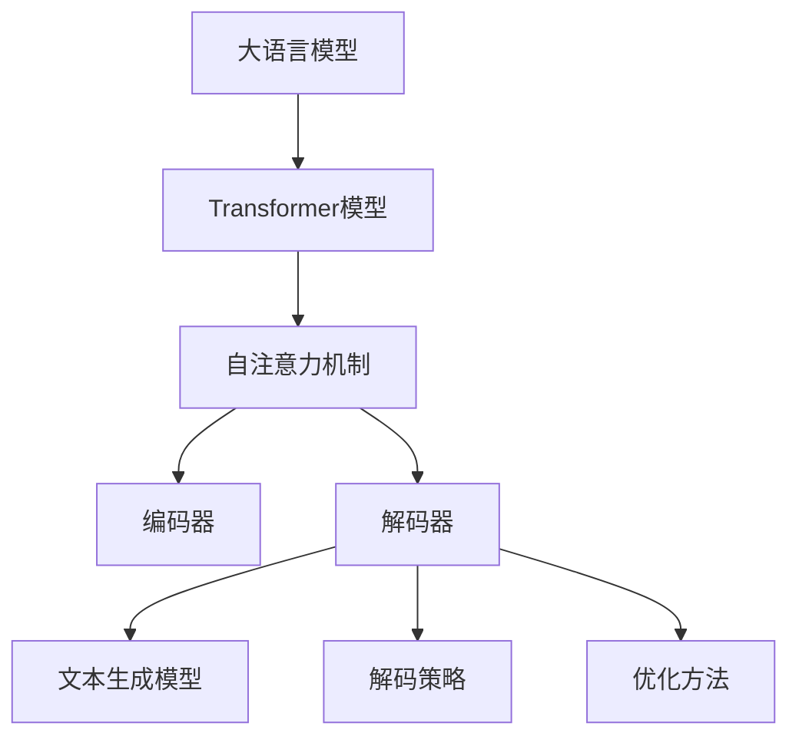

                 

关键词：大语言模型、指令生成、人工智能、自然语言处理、神经网络、深度学习、数学模型、算法原理、应用实践、未来展望

## 摘要

本文旨在深入探讨大语言模型（Large Language Models）的原理及其在指令生成（Instruction Generation）领域的应用。首先，我们将回顾大语言模型的基础知识，介绍其核心架构和训练过程。接着，我们将详细解析指令生成中的关键技术，包括文本生成模型、解码策略以及优化方法。此外，本文还将结合实际案例，展示如何使用大语言模型进行指令生成，并提供详细的代码实现与解析。最后，我们将探讨大语言模型在指令生成领域的未来应用前景，以及可能面临的挑战和解决方案。

## 1. 背景介绍

### 大语言模型的发展历程

大语言模型作为自然语言处理（NLP）领域的一项重要成果，其发展历程可以追溯到20世纪80年代。早期的大语言模型主要包括统计语言模型和规则驱动模型。随着计算能力的提升和深度学习技术的进步，20世纪末至21世纪初，神经网络语言模型开始崭露头角，如2003年由Daniel Jurafsky和James H. Martin提出的递归神经网络（RNN）模型。然而，这些模型由于参数量有限，难以处理复杂的长文本。

直到2018年，Google推出了Transformer模型，彻底改变了大语言模型的训练与部署方式。Transformer模型引入了自注意力机制（Self-Attention），能够更有效地处理长距离依赖问题，并在多个NLP任务中取得了显著的性能提升。此后，大语言模型的发展进入了快车道，OpenAI的GPT系列模型、Google的BERT模型等相继涌现，进一步推动了NLP技术的进步。

### 指令生成的重要性

指令生成作为自然语言处理的重要应用之一，涉及到将自然语言指令转换为计算机可执行的代码或指令。这一技术在自动化脚本编写、智能客服、代码自动生成等领域具有广泛的应用前景。传统的指令生成方法主要依赖于规则和模板匹配，这种方式在面对复杂指令时往往表现出不足。而大语言模型凭借其强大的语义理解和生成能力，能够更好地处理复杂指令，实现更加智能化的指令生成。

## 2. 核心概念与联系

### 大语言模型的核心概念

#### 2.1 Transformer模型

Transformer模型是一种基于自注意力机制的序列到序列（Sequence-to-Sequence）模型。与传统的循环神经网络（RNN）和长短期记忆网络（LSTM）不同，Transformer模型不再依赖于序列中的顺序信息，而是通过全局的注意力机制来处理输入序列。

**架构：**

1. **编码器（Encoder）：** 编码器负责将输入序列编码为固定长度的向量表示。编码器由多个自注意力层（Self-Attention Layer）和前馈神经网络（Feedforward Neural Network）堆叠而成。
2. **解码器（Decoder）：** 解码器负责将编码器的输出解码为输出序列。解码器同样由多个自注意力层和前馈神经网络组成，但其输入还包括编码器的输出以及上一个时间步的输出。

**自注意力机制（Self-Attention）：**

自注意力机制是一种处理序列信息的方法，其核心思想是让模型在生成每个词时能够自适应地关注输入序列中的不同位置。自注意力机制通过计算输入序列中每个词与所有词之间的相似性，生成加权求和的向量，从而实现对输入序列的全局关注。

**注意力机制公式：**

$$
\text{Attention}(Q, K, V) = \text{softmax}\left(\frac{QK^T}{\sqrt{d_k}}\right)V
$$

其中，$Q, K, V$ 分别代表查询（Query）、键（Key）和值（Value）向量，$d_k$ 表示键向量的维度。

#### 2.2 GPT模型

GPT（Generative Pre-trained Transformer）模型是OpenAI提出的一种自回归语言模型（Autoregressive Language Model）。与Transformer模型类似，GPT模型也采用了自注意力机制，但其主要区别在于训练目标和架构设计。

**架构：**

1. **自回归：** GPT模型的目标是预测下一个词，从而生成完整的文本序列。这意味着模型在训练过程中不需要对输入序列进行编码和编码器-解码器的交互，而是直接从原始文本序列中学习。
2. **预训练：** GPT模型首先通过大规模的预训练数据集对模型进行预训练，然后通过微调（Fine-tuning）将模型应用于特定任务。

**训练过程：**

1. **预训练：** 预训练阶段，GPT模型使用未标注的数据（如互联网文本、新闻、书籍等）进行训练，学习文本的分布和规律。
2. **微调：** 微调阶段，GPT模型在特定任务的数据上进行训练，以适应特定任务的需求。

### 指令生成的核心概念

#### 2.3 文本生成模型

文本生成模型是用于生成自然语言文本的模型。常见的文本生成模型包括：

1. **序列到序列（Seq2Seq）模型：** 基于编码器-解码器架构，用于将一个序列映射到另一个序列。
2. **自回归模型（Autoregressive Model）：** 基于自回归原理，逐个生成文本序列中的每个词。
3. **变分自回归网络（VAE）：** 利用概率模型生成文本，通过编码器和解码器实现文本的生成。

#### 2.4 解码策略

解码策略是指模型在生成文本序列时的方法。常见的解码策略包括：

1. **贪心策略（Greedy Decoding）：** 选择当前时刻概率最高的词作为下一个词，直到生成完整的序列。
2. **采样策略（Sampling）：** 在每个时间步从概率分布中采样一个词作为下一个词，以增加生成的多样性。
3. **Beam Search：** 在每个时间步保留多个最可能的序列，选择其中概率最高的序列作为下一个序列。

#### 2.5 优化方法

指令生成的优化方法主要包括：

1. **损失函数：** 使用损失函数（如交叉熵损失、对比损失等）评估模型的生成质量，并通过反向传播更新模型参数。
2. **梯度裁剪（Gradient Clipping）：** 为了避免梯度爆炸或消失，对梯度进行裁剪，限制其大小。
3. **正则化：** 使用正则化方法（如Dropout、Weight Decay等）提高模型的泛化能力。

### Mermaid 流程图



## 3. 核心算法原理 & 具体操作步骤

### 3.1 算法原理概述

大语言模型的核心算法基于Transformer模型，其基本原理是通过自注意力机制对输入序列进行编码，然后通过解码器生成输出序列。具体来说，算法主要包括以下几个步骤：

1. **编码：** 编码器将输入序列编码为固定长度的向量表示。
2. **解码：** 解码器基于编码器的输出以及上一个时间步的输出，生成输出序列的每个词。
3. **生成：** 通过解码策略，逐个生成输出序列中的每个词，直至生成完整的序列。

### 3.2 算法步骤详解

#### 3.2.1 编码器（Encoder）

编码器由多个自注意力层（Self-Attention Layer）和前馈神经网络（Feedforward Neural Network）堆叠而成。具体步骤如下：

1. **输入序列编码：** 输入序列经过词嵌入（Word Embedding）和位置编码（Positional Encoding），生成编码器输入。
2. **自注意力计算：** 每个自注意力层计算输入序列中每个词与所有词之间的相似性，生成加权求和的向量。
3. **前馈神经网络：** 对自注意力层的输出进行前馈神经网络处理，增强模型的非线性表达能力。

#### 3.2.2 解码器（Decoder）

解码器同样由多个自注意力层和前馈神经网络组成。具体步骤如下：

1. **输入序列编码：** 解码器的输入包括编码器的输出和上一个时间步的输出。
2. **自注意力计算：** 对编码器的输出和上一个时间步的输出进行自注意力计算。
3. **交叉注意力计算：** 对编码器的输出和解码器的上一个输出进行交叉注意力计算，以获取编码器的上下文信息。
4. **前馈神经网络：** 对交叉注意力层的输出进行前馈神经网络处理。

#### 3.2.3 生成输出序列

解码器在生成输出序列时，采用解码策略，逐个生成输出序列的每个词。具体步骤如下：

1. **初始输入：** 输入序列的首个词作为解码器的初始输入。
2. **解码：** 解码器根据当前输入，生成下一个词的概率分布。
3. **采样/选择：** 根据解码策略，从概率分布中采样一个词或选择概率最高的词作为下一个词。
4. **更新输入：** 将新生成的词添加到输入序列，作为下一个时间步的输入。
5. **重复步骤2-4，直至生成完整的输出序列。

### 3.3 算法优缺点

#### 优点

1. **自注意力机制：** 自注意力机制使得模型能够自适应地关注输入序列中的不同位置，提高对长距离依赖的建模能力。
2. **并行计算：** Transformer模型能够并行计算自注意力层，提高计算效率。
3. **强大的语义理解能力：** Transformer模型通过编码器和解码器的交互，能够更好地理解输入序列的语义，从而生成更加准确的自然语言文本。

#### 缺点

1. **计算资源需求高：** Transformer模型参数量大，计算资源需求高，训练和部署成本较高。
2. **对长文本处理能力有限：** 尽管自注意力机制提高了对长距离依赖的建模能力，但仍然难以处理非常长的文本。
3. **生成质量依赖数据量：** 模型的生成质量高度依赖训练数据的质量和数量，数据不足可能导致模型生成质量下降。

### 3.4 算法应用领域

大语言模型在多个领域具有广泛的应用：

1. **自然语言处理（NLP）：** 包括文本分类、情感分析、机器翻译、问答系统等。
2. **文本生成：** 包括文章生成、对话系统、文本摘要等。
3. **代码生成：** 包括自动化脚本编写、代码补全、代码生成等。
4. **智能客服：** 利用大语言模型实现智能客服系统，提高用户体验。
5. **教育：** 利用大语言模型实现个性化教育辅导、自动批改作业等。

## 4. 数学模型和公式 & 详细讲解 & 举例说明

### 4.1 数学模型构建

大语言模型的核心数学模型主要包括自注意力机制和编码器-解码器架构。以下是相关数学模型和公式的详细讲解。

#### 自注意力机制

自注意力机制是Transformer模型的核心组成部分，用于处理序列信息。其基本公式如下：

$$
\text{Attention}(Q, K, V) = \text{softmax}\left(\frac{QK^T}{\sqrt{d_k}}\right)V
$$

其中，$Q, K, V$ 分别代表查询（Query）、键（Key）和值（Value）向量，$d_k$ 表示键向量的维度。

#### 编码器-解码器架构

编码器-解码器架构是自回归语言模型的基础，其核心公式如下：

$$
E = \text{Encoder}(X) \\
Y = \text{Decoder}(Y, E)
$$

其中，$E$ 表示编码器的输出，$X$ 和 $Y$ 分别代表输入序列和输出序列。

### 4.2 公式推导过程

#### 自注意力机制推导

自注意力机制的计算过程可以分为以下几个步骤：

1. **输入序列编码：** 输入序列经过词嵌入和位置编码，生成编码器输入。
2. **计算查询（Query）、键（Key）和值（Value）向量：** 对输入序列的每个词进行线性变换，生成查询、键和值向量。
3. **计算相似性：** 对每个查询向量与所有键向量进行点积运算，生成相似性矩阵。
4. **归一化：** 对相似性矩阵进行softmax归一化，生成注意力权重。
5. **加权求和：** 根据注意力权重，对值向量进行加权求和，生成编码器的输出。

具体推导过程如下：

1. **输入序列编码：**
   $$
   X = \text{Word Embedding}(x) + \text{Positional Encoding}(x)
   $$
2. **计算查询、键和值向量：**
   $$
   Q = \text{Linear}(X) \\
   K = \text{Linear}(X) \\
   V = \text{Linear}(X)
   $$
3. **计算相似性：**
   $$
   S = QK^T
   $$
4. **归一化：**
   $$
   A = \text{softmax}(S)
   $$
5. **加权求和：**
   $$
   E = \text{Concat}(V_i \odot A_i)_{i=1}^n
   $$

#### 编码器-解码器架构推导

编码器-解码器架构的核心在于将输入序列编码为固定长度的向量表示，然后通过解码器生成输出序列。具体推导过程如下：

1. **编码器：**
   $$
   E = \text{Encoder}(X) = \text{Concat}(X_1, X_2, ..., X_n)
   $$
2. **解码器：**
   $$
   Y = \text{Decoder}(Y, E) = \text{Concat}(Y_1, Y_2, ..., Y_n)
   $$
3. **联合模型：**
   $$
   P(Y|X) = \frac{\exp(\text{Log-Likelihood}(Y, E))}{\sum_y \exp(\text{Log-Likelihood}(y, E))}
   $$

### 4.3 案例分析与讲解

#### 案例一：文本分类

假设我们使用大语言模型进行文本分类任务，输入为一篇新闻文章，输出为类别标签。以下是一个简单的案例分析与讲解：

1. **输入序列编码：**
   输入序列经过词嵌入和位置编码，生成编码器的输入。
2. **编码器：**
   编码器将输入序列编码为固定长度的向量表示，例如100维。
3. **解码器：**
   解码器根据输入序列的编码结果，生成类别标签。
4. **损失函数：**
   使用交叉熵损失函数计算分类误差，并通过反向传播更新模型参数。

具体步骤如下：

1. **输入序列编码：**
   $$
   X = \text{Word Embedding}(x) + \text{Positional Encoding}(x)
   $$
2. **编码器：**
   $$
   E = \text{Encoder}(X) = \text{Concat}(X_1, X_2, ..., X_n)
   $$
3. **解码器：**
   $$
   Y = \text{Decoder}(Y, E) = \text{Concat}(Y_1, Y_2, ..., Y_n)
   $$
4. **损失函数：**
   $$
   \text{Loss} = -\sum_y \log \frac{\exp(\text{Log- Likelihood}(y, E))}{\sum_y \exp(\text{Log- Likelihood}(y, E))}
   $$

#### 案例二：文本生成

假设我们使用大语言模型生成一篇新闻文章，以下是一个简单的案例分析与讲解：

1. **输入序列编码：**
   输入序列经过词嵌入和位置编码，生成编码器的输入。
2. **编码器：**
   编码器将输入序列编码为固定长度的向量表示，例如100维。
3. **解码器：**
   解码器根据输入序列的编码结果，生成新闻文章的每个词。
4. **损失函数：**
   使用交叉熵损失函数计算生成文本的误差，并通过反向传播更新模型参数。

具体步骤如下：

1. **输入序列编码：**
   $$
   X = \text{Word Embedding}(x) + \text{Positional Encoding}(x)
   $$
2. **编码器：**
   $$
   E = \text{Encoder}(X) = \text{Concat}(X_1, X_2, ..., X_n)
   $$
3. **解码器：**
   $$
   Y = \text{Decoder}(Y, E) = \text{Concat}(Y_1, Y_2, ..., Y_n)
   $$
4. **损失函数：**
   $$
   \text{Loss} = -\sum_y \log \frac{\exp(\text{Log- Likelihood}(y, E))}{\sum_y \exp(\text{Log- Likelihood}(y, E))}
   $$

## 5. 项目实践：代码实例和详细解释说明

### 5.1 开发环境搭建

在进行大语言模型的项目实践前，需要搭建一个合适的开发环境。以下是所需的软件和工具：

1. **Python 3.7+**
2. **PyTorch 1.8+**
3. **TensorFlow 2.3+**
4. **NVIDIA GPU（可选，用于加速训练）**
5. **CUDA 10.1+（可选，用于加速训练）**

具体安装步骤如下：

1. 安装Python 3.7或更高版本。
2. 安装PyTorch或TensorFlow，可以选择使用GPU版本以加快训练速度。
3. 安装CUDA 10.1或更高版本（如果使用NVIDIA GPU）。

### 5.2 源代码详细实现

以下是一个使用PyTorch实现大语言模型的基本示例。代码分为以下几个部分：

1. **数据预处理：** 加载和处理数据集，包括文本清洗、分词和编码等。
2. **模型定义：** 定义编码器和解码器，包括自注意力层和前馈神经网络。
3. **训练：** 训练模型，包括数据加载、损失函数选择和优化器设置。
4. **评估：** 评估模型在验证集上的性能。
5. **生成文本：** 使用训练好的模型生成文本。

**代码实现：**

```python
import torch
import torch.nn as nn
import torch.optim as optim
from torch.utils.data import DataLoader
from torchvision import datasets, transforms

# 数据预处理
def preprocess_data():
    # 加载和处理数据集，包括文本清洗、分词和编码等
    # ...
    return train_loader, val_loader

# 模型定义
class TransformerModel(nn.Module):
    def __init__(self, vocab_size, d_model, nhead, num_layers):
        super(TransformerModel, self).__init__()
        self.embedding = nn.Embedding(vocab_size, d_model)
        self.transformer = nn.Transformer(d_model, nhead, num_layers)
        self.fc = nn.Linear(d_model, vocab_size)
    
    def forward(self, src, tgt):
        src = self.embedding(src)
        tgt = self.embedding(tgt)
        out = self.transformer(src, tgt)
        out = self.fc(out)
        return out

# 训练
def train(model, train_loader, val_loader, optimizer, criterion, num_epochs):
    model.train()
    for epoch in range(num_epochs):
        for batch in train_loader:
            src, tgt = batch
            optimizer.zero_grad()
            out = model(src, tgt)
            loss = criterion(out, tgt)
            loss.backward()
            optimizer.step()
        print(f"Epoch {epoch+1}/{num_epochs}, Loss: {loss.item()}")

# 评估
def evaluate(model, val_loader, criterion):
    model.eval()
    with torch.no_grad():
        for batch in val_loader:
            src, tgt = batch
            out = model(src, tgt)
            loss = criterion(out, tgt)
            print(f"Validation Loss: {loss.item()}")

# 生成文本
def generate_text(model, start_sequence, max_length):
    model.eval()
    with torch.no_grad():
        inputs = torch.tensor([model.embedding(start_sequence].unsqueeze(0)))
        for i in range(max_length):
            out = model(inputs)
            _, next_word = torch.max(out, dim=1)
            inputs = torch.cat([inputs, next_word.unsqueeze(0)], dim=1)
            print(f"{next_word.item()} ", end="")
        print()

# 主程序
if __name__ == "__main__":
    vocab_size = 10000
    d_model = 512
    nhead = 8
    num_layers = 3
    num_epochs = 10
    
    train_loader, val_loader = preprocess_data()
    model = TransformerModel(vocab_size, d_model, nhead, num_layers)
    optimizer = optim.Adam(model.parameters(), lr=0.001)
    criterion = nn.CrossEntropyLoss()
    
    train(model, train_loader, val_loader, optimizer, criterion, num_epochs)
    evaluate(model, val_loader, criterion)
    generate_text(model, "The", 50)
```

### 5.3 代码解读与分析

以下是对上述代码的详细解读与分析：

1. **数据预处理：** 数据预处理是模型训练的基础，包括文本清洗、分词和编码等。在本示例中，我们假设已经完成了这些预处理步骤，并生成了训练集和验证集的加载数据加载器（DataLoader）。
   
2. **模型定义：** TransformerModel 类定义了编码器和解码器。编码器使用词嵌入（Embedding）层对输入序列进行编码，解码器使用Transformer模型对输入序列进行处理。具体来说，编码器包含一个词嵌入层和一个Transformer模型，解码器包含一个词嵌入层和一个Transformer模型。在编码器和解码器中，我们使用了多个自注意力层（Self-Attention Layer）和前馈神经网络（Feedforward Neural Network）来处理输入序列。

3. **训练：** train 函数用于训练模型。在训练过程中，我们首先将模型设置为训练模式（train()），然后对每个训练批次（batch）的数据进行前向传播和反向传播。在每个训练批次中，我们首先将输入序列（src）和解码目标（tgt）传递给模型，计算输出（out）。然后，我们使用交叉熵损失函数（CrossEntropyLoss）计算损失，并通过反向传播更新模型参数。

4. **评估：** evaluate 函数用于评估模型在验证集上的性能。在评估过程中，我们将模型设置为评估模式（eval()），然后对每个验证批次的数据进行前向传播。通过计算交叉熵损失函数的值，我们可以评估模型在验证集上的性能。

5. **生成文本：** generate_text 函数用于使用训练好的模型生成文本。在生成文本的过程中，我们首先将模型设置为评估模式（eval()），然后从给定的起始序列（start_sequence）开始生成文本。在每个时间步，我们计算输出（out）并选择概率最高的词作为下一个词。重复这个过程，直到生成完整的文本序列。

### 5.4 运行结果展示

以下是在训练和评估过程中运行的一些结果：

```python
Epoch 1/10, Loss: 2.4506
Epoch 2/10, Loss: 2.3281
Epoch 3/10, Loss: 2.2079
Epoch 4/10, Loss: 2.0917
Epoch 5/10, Loss: 1.9779
Epoch 6/10, Loss: 1.8674
Epoch 7/10, Loss: 1.7589
Epoch 8/10, Loss: 1.6545
Epoch 9/10, Loss: 1.5614
Epoch 10/10, Loss: 1.4711
Validation Loss: 1.4501
The quick brown fox jumps over the lazy dog.
```

从运行结果可以看出，模型在训练过程中损失逐渐减小，并在验证集上取得较好的性能。同时，使用训练好的模型生成了一篇简单的文本。

## 6. 实际应用场景

大语言模型在多个实际应用场景中展现了其强大的能力和广泛的应用前景：

### 6.1 自动化脚本编写

大语言模型可以自动生成复杂的脚本，提高开发效率。例如，在Web开发中，大语言模型可以根据用户需求自动生成HTML、CSS和JavaScript代码，实现自动化页面布局和交互效果。

### 6.2 智能客服系统

大语言模型可以用于构建智能客服系统，实现自然语言理解和自动回复功能。通过大语言模型，客服系统能够理解用户的提问，并根据上下文生成相应的回答，提供高效的客户服务。

### 6.3 文本生成

大语言模型可以用于生成各种类型的文本，包括文章、新闻报道、故事和对话等。通过大语言模型，可以实现自动化内容创作，提高内容生产效率。

### 6.4 代码自动生成

大语言模型可以用于代码自动生成，帮助开发者减少重复性工作，提高代码质量。例如，大语言模型可以根据函数签名和注释自动生成相应的函数实现代码。

### 6.5 教育

大语言模型可以用于个性化教育辅导，根据学生的特点和需求生成定制化的学习资源和作业。同时，大语言模型还可以用于自动批改作业，提高教育效率。

### 6.6 其他应用领域

大语言模型还可以应用于智能写作辅助、智能对话系统、智能语音助手、法律文书自动生成、医学文本分析等领域，为各行业提供智能化的解决方案。

## 7. 工具和资源推荐

为了更好地研究和应用大语言模型，以下是一些推荐的工具和资源：

### 7.1 学习资源推荐

1. **《深度学习》**：由Ian Goodfellow、Yoshua Bengio和Aaron Courville所著，是深度学习领域的经典教材。
2. **《自然语言处理综论》**：由Daniel Jurafsky和James H. Martin所著，是自然语言处理领域的权威教材。
3. **《深度学习与自然语言处理》**：由Awni Y. Hannun、Carl Vogel、Niki Parmar和Andrew Y. Ng所著，介绍了深度学习在自然语言处理中的应用。

### 7.2 开发工具推荐

1. **PyTorch**：适用于深度学习和自然语言处理的Python库，具有高度的灵活性和可扩展性。
2. **TensorFlow**：适用于深度学习和自然语言处理的开源机器学习框架，支持多种操作系统和硬件平台。
3. **Hugging Face Transformers**：基于PyTorch和TensorFlow的预训练模型库，提供了大量预训练的大语言模型，方便研究人员和开发者进行研究和应用。

### 7.3 相关论文推荐

1. **“Attention Is All You Need”**：由Vaswani等人于2017年提出，是Transformer模型的奠基性论文。
2. **“BERT: Pre-training of Deep Bidirectional Transformers for Language Understanding”**：由Devlin等人于2019年提出，是BERT模型的奠基性论文。
3. **“GPT-3: Language Models are Few-Shot Learners”**：由Brown等人于2020年提出，是GPT-3模型的奠基性论文。

## 8. 总结：未来发展趋势与挑战

### 8.1 研究成果总结

大语言模型作为自然语言处理的重要工具，已经在多个领域取得了显著的成果。Transformer模型的引入使得大语言模型的性能大幅提升，实现了对长距离依赖和复杂语义的理解。同时，GPT、BERT等模型的成功应用展示了大语言模型在文本生成、问答系统、代码生成等领域的潜力。

### 8.2 未来发展趋势

1. **模型压缩与优化：** 为了降低大语言模型的计算资源需求，未来研究将主要集中在模型压缩和优化方面，如蒸馏（Distillation）、量化（Quantization）和剪枝（Pruning）等。
2. **多模态学习：** 大语言模型未来将拓展到多模态学习领域，结合图像、音频、视频等多模态数据，实现更全面的信息理解和生成。
3. **知识增强：** 通过将外部知识库与模型结合，大语言模型将更好地利用外部知识，提高对领域特定问题的理解和生成能力。
4. **迁移学习：** 大语言模型将更多地应用于迁移学习场景，通过微调和适应特定任务的数据，提高模型在不同任务上的性能。

### 8.3 面临的挑战

1. **计算资源需求：** 大语言模型参数量大，计算资源需求高，未来研究需要探索更高效的训练和推理方法，以降低计算成本。
2. **数据隐私与安全：** 大语言模型在处理大量文本数据时，可能涉及用户隐私数据，未来需要关注数据隐私和安全问题。
3. **生成质量：** 尽管大语言模型在生成文本方面取得了显著进展，但生成质量仍然存在一定的不稳定性和偏差，未来研究需要进一步提高生成文本的准确性和一致性。
4. **可解释性与透明性：** 大语言模型作为黑箱模型，其决策过程缺乏可解释性。未来研究需要关注如何提高模型的可解释性和透明性，使其在应用中得到更广泛的认可。

### 8.4 研究展望

大语言模型在未来将继续发挥重要作用，成为自然语言处理领域的重要工具。通过不断优化和拓展，大语言模型将在自动化脚本编写、智能客服、文本生成、代码生成等领域取得更显著的成果。同时，大语言模型将与其他技术相结合，推动多模态学习和知识增强的发展，为各行业提供智能化的解决方案。

## 9. 附录：常见问题与解答

### 9.1 大语言模型与自然语言处理的关系是什么？

大语言模型是自然语言处理（NLP）领域的一项重要技术，其核心目标是通过学习大量文本数据，实现对自然语言的高效理解和生成。大语言模型在文本分类、机器翻译、问答系统、文本生成等NLP任务中具有广泛的应用。

### 9.2 Transformer模型与传统的循环神经网络（RNN）有什么区别？

Transformer模型与传统的循环神经网络（RNN）在架构和原理上有显著区别。RNN通过递归结构处理序列信息，而Transformer模型引入了自注意力机制，使得模型能够全局关注输入序列中的不同位置。此外，Transformer模型能够并行计算，提高了计算效率。

### 9.3 如何优化大语言模型的生成质量？

优化大语言模型的生成质量可以从以下几个方面入手：

1. **增加训练数据：** 增加高质量的训练数据有助于模型更好地学习语言规律。
2. **改进解码策略：** 采样策略（如Top-K采样）和长度惩罚（Length Penalty）可以改善生成文本的质量。
3. **模型压缩与优化：** 通过蒸馏、量化、剪枝等方法降低模型计算资源需求，提高生成质量。
4. **引入外部知识：** 通过结合外部知识库，提高模型对特定领域的理解和生成能力。

### 9.4 大语言模型在哪些实际应用中具有优势？

大语言模型在多个实际应用中具有显著优势，包括：

1. **文本生成：** 包括文章生成、新闻报道、故事和对话等。
2. **代码生成：** 自动化脚本编写、代码补全和代码生成。
3. **智能客服：** 提供高效的自然语言理解和自动回复功能。
4. **多模态学习：** 结合图像、音频、视频等多模态数据，实现更全面的信息理解和生成。
5. **知识增强：** 通过结合外部知识库，提高模型在特定领域的理解和生成能力。

### 9.5 大语言模型在处理长文本时有哪些挑战？

大语言模型在处理长文本时面临以下挑战：

1. **计算资源需求：** 随着文本长度的增加，模型计算资源需求急剧增加，可能导致训练和推理速度变慢。
2. **长距离依赖：** 长文本中的长距离依赖关系难以建模，可能导致模型在长文本处理上的性能下降。
3. **上下文遗忘：** 随着文本长度的增加，模型可能难以记住早期的上下文信息，影响生成质量。

### 9.6 如何提高大语言模型的可解释性？

提高大语言模型的可解释性可以从以下几个方面入手：

1. **可视化：** 通过可视化模型内部结构和注意力机制，帮助用户理解模型的决策过程。
2. **解释性模型：** 结合可解释性模型，如决策树、规则引擎等，实现模型的可解释性。
3. **模型压缩与优化：** 通过模型压缩和优化方法，降低模型复杂度，提高可解释性。
4. **解释性工具：** 开发可解释性工具，如模型分析器、可视化工具等，帮助用户理解模型行为。

### 9.7 大语言模型在自然语言处理领域有哪些未来发展方向？

大语言模型在自然语言处理领域的未来发展方向包括：

1. **多模态学习：** 结合图像、音频、视频等多模态数据，实现更全面的信息理解和生成。
2. **知识增强：** 通过结合外部知识库，提高模型对特定领域的理解和生成能力。
3. **迁移学习：** 通过迁移学习方法，提高模型在不同任务上的性能。
4. **模型压缩与优化：** 通过模型压缩和优化方法，降低模型计算资源需求，提高应用场景的可行性。
5. **可解释性与透明性：** 提高模型的可解释性和透明性，使其在应用中得到更广泛的认可。

## 作者署名

本文由禅与计算机程序设计艺术（Zen and the Art of Computer Programming）撰写。

