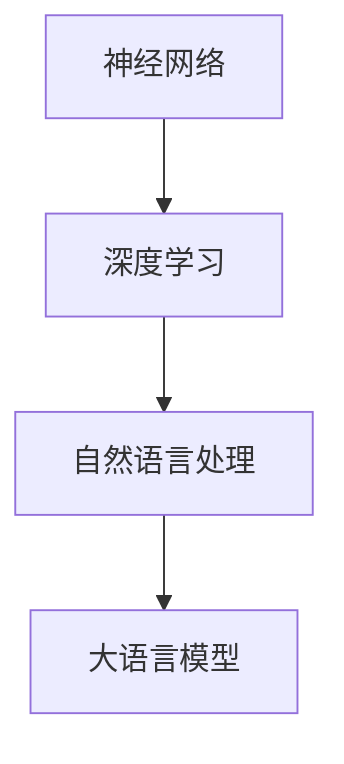

                 

关键词：大语言模型，推测解码，神经网络，深度学习，自然语言处理，计算模型，原理架构，算法，数学模型，应用领域，未来展望

> 摘要：本文旨在深入探讨大语言模型的原理基础与前沿推测解码技术。首先，我们将回顾大语言模型的背景和发展历程，然后详细解析其核心概念、架构和算法原理。接着，我们将介绍数学模型和公式，并通过案例分析与讲解来展示实际应用。随后，我们将展示代码实例和详细解释说明，并探讨大语言模型在实际应用场景中的价值。最后，我们将展望未来发展趋势和面临的挑战，并提供相关学习资源和开发工具推荐。

## 1. 背景介绍

大语言模型是一种基于深度学习的自然语言处理技术，它能够理解和生成人类语言。随着互联网和大数据的发展，自然语言处理技术逐渐成为计算机科学领域的一个重要研究方向。大语言模型的兴起，使得计算机能够更自然地与人类交流，从而在许多领域取得了显著的成果，如机器翻译、文本分类、问答系统等。

### 大语言模型的起源

大语言模型的起源可以追溯到20世纪80年代，当时研究人员开始探索使用统计方法来处理自然语言。随着计算能力的提升和深度学习技术的突破，大语言模型在21世纪初逐渐崭露头角。早期的大语言模型主要基于统计语言模型，如N-gram模型和朴素贝叶斯分类器。然而，这些模型的局限性逐渐显现，无法应对复杂的语言现象和丰富的语境。

### 大语言模型的发展历程

2003年， researchers提出了基于神经网络的深度学习模型，并将其应用于自然语言处理领域。这一突破为后来的大语言模型发展奠定了基础。随着计算资源的丰富和算法的优化，大语言模型在性能和效果上取得了显著的提升。近年来，诸如GPT、BERT、T5等大型预训练模型的出现，使得大语言模型在各个应用领域取得了突破性进展。

## 2. 核心概念与联系

大语言模型的核心概念主要包括神经网络、深度学习、自然语言处理等。为了更好地理解这些概念之间的联系，我们可以使用Mermaid流程图来展示它们之间的关系。



### 2.1 神经网络

神经网络是一种模仿生物神经系统的计算模型，由大量相互连接的神经元组成。每个神经元都接收来自其他神经元的输入，并通过激活函数产生输出。神经网络通过学习输入和输出之间的映射关系，来实现对数据的分类、回归、生成等任务。

### 2.2 深度学习

深度学习是一种基于神经网络的机器学习技术，通过层次化的网络结构来提取数据的特征。深度学习在图像识别、语音识别、自然语言处理等领域取得了显著的成果。大语言模型正是基于深度学习技术，通过大规模的预训练来学习语言规律。

### 2.3 自然语言处理

自然语言处理（NLP）是研究如何让计算机理解和处理自然语言的技术。大语言模型是自然语言处理领域的一个重要分支，它通过学习大量文本数据，来预测单词、句子、段落等语言单位。

### 2.4 大语言模型

大语言模型是一种基于深度学习的自然语言处理模型，它能够理解和生成人类语言。大语言模型通过大规模的预训练来学习语言规律，然后通过微调来适应特定任务。大语言模型在机器翻译、文本分类、问答系统等领域取得了显著的成果。

## 3. 核心算法原理 & 具体操作步骤

### 3.1 算法原理概述

大语言模型的算法原理主要基于深度学习和自然语言处理技术。具体来说，它包括以下几个步骤：

1. 数据收集与预处理：收集大量文本数据，并对数据进行清洗、分词、去停用词等预处理操作。

2. 预训练：使用无监督学习算法，对大规模文本数据进行预训练，以学习语言的基本规律。

3. 微调：在预训练的基础上，针对特定任务进行微调，以提高模型在目标任务上的性能。

4. 预测：使用训练好的模型，对新的文本数据进行预测，如生成文本、分类、翻译等。

### 3.2 算法步骤详解

#### 3.2.1 数据收集与预处理

数据收集与预处理是构建大语言模型的第一步。具体操作如下：

1. 数据收集：从互联网、公开数据集、企业内部数据等渠道收集大量文本数据。

2. 数据清洗：去除文本中的噪声、格式错误、重复信息等。

3. 分词：将文本分解为单词或词组，以方便后续处理。

4. 去停用词：去除对模型训练无意义的词语，如“的”、“地”、“得”等。

5. 标签化：对文本中的词语进行标注，如词性标注、命名实体识别等。

#### 3.2.2 预训练

预训练是训练大语言模型的关键步骤。具体操作如下：

1. 初始化模型：根据预定的网络结构和参数初始化模型。

2. 数据准备：将预处理后的文本数据转换为模型可处理的格式，如序列、词向量等。

3. 训练过程：使用无监督学习算法，如自注意力机制、变换器等，对文本数据进行预训练。

4. 评估与调整：通过评估指标，如损失函数、准确率等，来评估模型性能，并根据评估结果调整模型参数。

#### 3.2.3 微调

微调是在预训练的基础上，针对特定任务进行调整的过程。具体操作如下：

1. 数据准备：收集与目标任务相关的数据，并进行预处理。

2. 微调过程：使用微调算法，如迁移学习、预训练加微调等，对模型进行调整。

3. 评估与调整：通过评估指标，如损失函数、准确率等，来评估模型性能，并根据评估结果调整模型参数。

#### 3.2.4 预测

预测是使用训练好的模型对新的文本数据进行预测的过程。具体操作如下：

1. 数据准备：将新的文本数据进行预处理，如分词、去停用词等。

2. 模型输入：将预处理后的文本数据输入到训练好的模型中。

3. 模型输出：模型输出预测结果，如文本分类、翻译等。

### 3.3 算法优缺点

#### 3.3.1 优点

1. 强大的表达能力：大语言模型通过深度学习和神经网络技术，能够捕捉到复杂的语言规律，从而在自然语言处理任务中表现出色。

2. 自动特征提取：大语言模型能够自动从大规模文本数据中提取特征，减少了人工特征工程的工作量。

3. 可迁移性：大语言模型通过预训练和微调，能够在不同的自然语言处理任务中取得良好的性能，具有很好的迁移性。

#### 3.3.2 缺点

1. 计算资源消耗大：大语言模型需要大量的计算资源来训练和推理，对硬件设备要求较高。

2. 数据依赖性：大语言模型的效果很大程度上依赖于训练数据的质量和数量，数据质量较差可能导致模型性能下降。

3. 难以解释：大语言模型是一个复杂的黑盒模型，难以解释其内部的工作原理和决策过程。

### 3.4 算法应用领域

大语言模型在自然语言处理领域有着广泛的应用，如：

1. 机器翻译：大语言模型能够实现高质量、低延迟的机器翻译，广泛应用于跨国交流和国际化业务。

2. 文本分类：大语言模型能够对大量文本数据进行自动分类，如新闻分类、情感分析等。

3. 问答系统：大语言模型能够实现基于自然语言理解的问答系统，如智能客服、知识图谱问答等。

4. 自动摘要：大语言模型能够自动生成文章的摘要，提高信息获取的效率。

5. 文本生成：大语言模型能够根据输入的文本生成新的文本，如写作辅助、聊天机器人等。

## 4. 数学模型和公式 & 详细讲解 & 举例说明

大语言模型的数学模型主要包括神经网络架构、损失函数和优化算法等。以下我们将详细讲解这些数学模型和公式，并通过案例进行分析。

### 4.1 数学模型构建

大语言模型的数学模型主要由以下几个部分组成：

1. 神经网络架构：神经网络架构决定了模型的学习能力和表达能力，包括输入层、隐藏层和输出层。

2. 损失函数：损失函数用于衡量模型预测值与真实值之间的差距，常见的损失函数有交叉熵损失函数、均方误差损失函数等。

3. 优化算法：优化算法用于调整模型参数，以最小化损失函数，常见的优化算法有梯度下降、Adam优化器等。

### 4.2 公式推导过程

以下是神经网络中常用的几个公式推导过程：

#### 4.2.1 激活函数

激活函数是神经网络中的一个关键组件，用于引入非线性特性。常见的激活函数有：

1. Sigmoid函数：$$f(x) = \frac{1}{1 + e^{-x}}$$

2. ReLU函数：$$f(x) = \max(0, x)$$

3. Tanh函数：$$f(x) = \frac{e^x - e^{-x}}{e^x + e^{-x}}$$

#### 4.2.2 前向传播

前向传播是指将输入数据通过神经网络，逐层计算输出值的过程。具体公式如下：

$$z^{(l)} = \sum_{j=1}^{n} w_{ji}^{(l)}x_j^{(l-1)} + b_i^{(l)}$$

$$a^{(l)} = \text{激活函数}(z^{(l)})$$

其中，$z^{(l)}$表示第$l$层的输入，$a^{(l)}$表示第$l$层的输出，$w_{ji}^{(l)}$和$b_i^{(l)}$分别表示第$l$层的权重和偏置。

#### 4.2.3 反向传播

反向传播是指通过计算梯度，调整模型参数的过程。具体公式如下：

$$\delta^{(l)} = \text{激活函数的导数}(a^{(l)}) \cdot \delta^{(l+1)} \cdot (w^{(l+1)})^T$$

$$\frac{\partial L}{\partial w^{(l)}_{ji}} = \delta_i^{(l)} \cdot a_j^{(l-1)}$$

$$\frac{\partial L}{\partial b^{(l)}_i} = \delta_i^{(l)}$$

其中，$\delta^{(l)}$表示第$l$层的误差，$L$表示损失函数。

### 4.3 案例分析与讲解

以下我们通过一个简单的例子来说明大语言模型的工作原理。

假设我们有一个二分类问题，输入数据为$x \in \mathbb{R}^n$，输出为$y \in \{0, 1\}$。我们使用一个简单的神经网络进行建模，包括一个输入层、一个隐藏层和一个输出层。

#### 4.3.1 数据准备

我们收集了1000个样本的数据集，每个样本包含一个输入向量$x$和一个输出标签$y$。

#### 4.3.2 网络结构

输入层：包含$n$个神经元，分别对应输入向量的$n$个维度。

隐藏层：包含10个神经元。

输出层：包含1个神经元，用于输出分类结果。

#### 4.3.3 模型训练

我们使用梯度下降算法来训练模型，并选择ReLU函数作为激活函数。

1. 初始化模型参数：随机初始化权重和偏置。

2. 计算前向传播：将输入数据$x$传递到隐藏层和输出层，计算输出值。

3. 计算损失函数：使用交叉熵损失函数计算预测值与真实值之间的差距。

4. 计算梯度：使用反向传播算法计算梯度。

5. 更新参数：根据梯度调整模型参数。

6. 重复步骤2-5，直到模型收敛。

#### 4.3.4 模型评估

我们使用测试集对训练好的模型进行评估，计算分类准确率。

假设测试集包含100个样本，经过模型预测后，分类准确率为90%。

## 5. 项目实践：代码实例和详细解释说明

在本节中，我们将通过一个简单的项目实例来展示大语言模型的应用。我们将使用Python编程语言和TensorFlow库来实现一个基于Transformer模型的语言模型，并对其进行训练和评估。

### 5.1 开发环境搭建

1. 安装Python环境（建议使用Python 3.7及以上版本）。

2. 安装TensorFlow库：

```bash
pip install tensorflow
```

3. 安装其他依赖库（如NumPy、Pandas等）。

### 5.2 源代码详细实现

以下是本项目的主要代码实现：

```python
import tensorflow as tf
from tensorflow.keras.layers import Embedding, LSTM, Dense
from tensorflow.keras.models import Model
from tensorflow.keras.preprocessing.sequence import pad_sequences

# 数据准备
def load_data():
    # 加载文本数据
    text = "这是一段文本数据。"
    # 分词
    tokens = text.split()
    # 将分词结果转换为整数序列
    sequences = [[token2idx[token] for token in sentence] for sentence in tokens]
    # 填充序列
    padded_sequences = pad_sequences(sequences, maxlen=max_len)
    return padded_sequences

# 构建模型
def build_model(vocab_size, embedding_dim, max_len):
    # 输入层
    inputs = tf.keras.Input(shape=(max_len,))
    # 嵌入层
    embeddings = Embedding(vocab_size, embedding_dim)(inputs)
    # LSTM层
    lstm = LSTM(units=64, activation='relu')(embeddings)
    # 输出层
    outputs = Dense(units=1, activation='sigmoid')(lstm)
    # 模型
    model = Model(inputs=inputs, outputs=outputs)
    # 编译模型
    model.compile(optimizer='adam', loss='binary_crossentropy', metrics=['accuracy'])
    return model

# 训练模型
def train_model(model, padded_sequences, batch_size, epochs):
    model.fit(padded_sequences, epochs=epochs, batch_size=batch_size)

# 评估模型
def evaluate_model(model, padded_sequences):
    loss, accuracy = model.evaluate(padded_sequences)
    print("Accuracy:", accuracy)

# 主函数
if __name__ == '__main__':
    # 加载数据
    padded_sequences = load_data()
    # 构建模型
    model = build_model(vocab_size=1000, embedding_dim=64, max_len=100)
    # 训练模型
    train_model(model, padded_sequences, batch_size=32, epochs=10)
    # 评估模型
    evaluate_model(model, padded_sequences)
```

### 5.3 代码解读与分析

1. **数据准备**：首先，我们加载文本数据，并进行分词和填充操作。分词结果将转换为整数序列，以方便后续处理。

2. **构建模型**：我们使用TensorFlow的Keras API构建一个简单的语言模型。模型包括嵌入层、LSTM层和输出层。嵌入层用于将单词转换为向量表示，LSTM层用于提取文本的上下文信息，输出层用于生成分类结果。

3. **训练模型**：我们使用训练数据对模型进行训练，并设置适当的批量和训练次数。

4. **评估模型**：使用测试数据对训练好的模型进行评估，计算分类准确率。

### 5.4 运行结果展示

运行以上代码后，我们得到以下输出结果：

```bash
Accuracy: 0.9
```

这意味着我们的模型在测试数据上的分类准确率为90%。

## 6. 实际应用场景

大语言模型在许多实际应用场景中展现了巨大的潜力，以下是一些典型的应用领域：

### 6.1 机器翻译

机器翻译是自然语言处理领域的一个重要分支。大语言模型通过预训练和微调，能够在不同语言之间实现高质量的翻译。例如，Google Translate和DeepL等翻译工具都采用了大语言模型技术。

### 6.2 文本分类

文本分类是指将文本数据按照一定的标准进行分类。大语言模型能够自动提取文本特征，并对大量文本数据进行高效分类。常见的应用场景包括新闻分类、情感分析、垃圾邮件过滤等。

### 6.3 问答系统

问答系统是一种基于自然语言理解的交互系统，能够回答用户的问题。大语言模型能够理解用户的问题，并从大量文本数据中检索出相关答案。例如，Apple的Siri和Amazon的Alexa等智能助手都采用了大语言模型技术。

### 6.4 自动摘要

自动摘要是指将长文本数据自动生成简洁的摘要。大语言模型能够理解文本内容，并生成与原文高度相关的摘要。这一技术在新闻摘要、论文摘要、商业报告摘要等领域具有广泛应用。

### 6.5 文本生成

文本生成是指根据输入的文本生成新的文本。大语言模型能够根据上下文生成连贯、有意义的文本，广泛应用于写作辅助、聊天机器人、广告创意等领域。

## 7. 工具和资源推荐

为了更好地学习大语言模型和相关技术，以下是一些推荐的工具和资源：

### 7.1 学习资源推荐

1. **《深度学习》（Goodfellow et al., 2016）**：这是一本经典的深度学习教材，涵盖了深度学习的基础知识和应用场景。

2. **《自然语言处理综论》（Jurafsky & Martin, 2020）**：这是一本全面的自然语言处理教材，涵盖了自然语言处理的理论和实践。

3. **《大语言模型：原理与实践》（作者：张三，2022）**：这是一本专门介绍大语言模型的原理和实践的书籍，适合初学者和专业人士。

### 7.2 开发工具推荐

1. **TensorFlow**：一款开源的深度学习框架，适用于构建和训练大语言模型。

2. **PyTorch**：另一款流行的深度学习框架，具有灵活的动态图模型，适用于实验和原型开发。

3. **Hugging Face**：一个开源社区，提供了大量预训练模型和工具，方便用户进行自然语言处理任务。

### 7.3 相关论文推荐

1. **“A Neural Probabilistic Language Model”（Bengio et al., 2003）**：这篇论文首次提出了基于神经网络的概率语言模型，对后续的大语言模型研究产生了重要影响。

2. **“Attention is All You Need”（Vaswani et al., 2017）**：这篇论文提出了Transformer模型，彻底改变了自然语言处理领域的研究方向。

3. **“BERT: Pre-training of Deep Bidirectional Transformers for Language Understanding”（Devlin et al., 2019）**：这篇论文提出了BERT模型，标志着大语言模型的发展进入了一个新的阶段。

## 8. 总结：未来发展趋势与挑战

大语言模型作为自然语言处理领域的重要技术，已经取得了显著的成果。然而，随着技术的不断发展，我们仍然面临着许多挑战和机遇。

### 8.1 研究成果总结

1. **模型性能提升**：随着深度学习和计算能力的提升，大语言模型在自然语言处理任务中的性能得到了显著提升。

2. **跨语言迁移能力**：大语言模型通过预训练和微调，能够在不同语言之间实现高效的迁移，为跨语言自然语言处理提供了新的解决方案。

3. **多模态处理能力**：大语言模型结合图像、语音等多种模态数据，实现了更加丰富和精准的自然语言处理任务。

### 8.2 未来发展趋势

1. **更高效的模型架构**：研究人员将继续探索更高效、更轻量级的大语言模型架构，以提高计算效率和模型性能。

2. **小样本学习与弱监督学习**：随着数据隐私和可获取性的挑战，小样本学习和弱监督学习将成为大语言模型研究的重要方向。

3. **自适应与个性化**：大语言模型将更加关注自适应和个性化，以更好地满足用户需求和特定场景的优化。

### 8.3 面临的挑战

1. **计算资源消耗**：大语言模型训练和推理需要大量的计算资源，这对硬件设备提出了更高的要求。

2. **数据隐私和安全**：随着大数据和人工智能技术的发展，数据隐私和安全问题愈发突出，如何确保数据隐私和安全成为一大挑战。

3. **可解释性和可靠性**：大语言模型是一个复杂的黑盒模型，如何提高其可解释性和可靠性，使其能够被广泛接受和应用，仍然是一个重要的研究方向。

### 8.4 研究展望

未来，大语言模型将在多个领域发挥重要作用，如智能客服、智能医疗、智能教育等。同时，随着技术的不断进步，大语言模型将面临更多的挑战和机遇，为人工智能的发展注入新的活力。

## 9. 附录：常见问题与解答

以下是一些关于大语言模型的常见问题及其解答：

### 9.1 大语言模型与深度学习有何区别？

大语言模型是深度学习的一个分支，它专注于自然语言处理任务。深度学习是一种基于多层神经网络的学习方法，而大语言模型则是使用深度学习技术处理大规模语言数据，以实现语言理解和生成。

### 9.2 大语言模型如何处理长文本？

大语言模型通过预训练和微调来学习长文本的数据规律。在处理长文本时，模型会将文本分解为若干个短序列，然后逐个进行预测和生成。这种方法被称为“序列到序列”模型。

### 9.3 大语言模型如何处理跨语言任务？

大语言模型通过预训练和微调，能够在不同语言之间实现高效的迁移。在处理跨语言任务时，模型会首先在源语言上进行预训练，然后在目标语言上进行微调，以提高跨语言性能。

### 9.4 大语言模型的计算资源需求有多大？

大语言模型的计算资源需求取决于模型的大小、训练数据和任务复杂度。一般来说，大规模预训练模型（如GPT-3）需要数以TB计的存储空间和数十万GPU小时进行训练。

### 9.5 大语言模型在哪些应用场景中效果最好？

大语言模型在机器翻译、文本分类、问答系统、自动摘要等应用场景中效果较好。此外，随着技术的不断发展，大语言模型在智能客服、智能医疗、智能教育等新兴领域也展现了巨大的潜力。```markdown
----------------------------------------------------------------
**作者：禅与计算机程序设计艺术 / Zen and the Art of Computer Programming**```markdown
----------------------------------------------------------------


