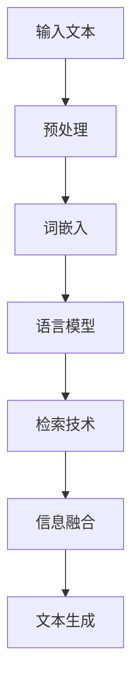

                 

### 1. 背景介绍

大语言模型（Large Language Models）是人工智能领域的一项重要技术进展。自2018年GPT模型首次提出以来，大规模预训练语言模型在自然语言处理（NLP）任务中取得了显著的成果。大语言模型通过学习海量文本数据，捕捉到了语言的本质特性，从而在生成文本、问答系统、机器翻译等方面展现出了强大的能力。

随着计算能力的提升和数据量的爆发式增长，大语言模型在规模和性能上不断突破。目前，已经有许多大型模型如GPT-3、ChatGLM、Bert等被广泛应用。这些模型不仅在学术研究上取得了巨大进展，也在实际应用中展现出了巨大的潜力。

本文旨在深入探讨大语言模型的原理基础，分析其核心算法和数学模型，并通过具体实例和代码实现，展示其应用方法和效果。此外，文章还将讨论大语言模型在实际应用中的场景和未来展望。

### 2. 核心概念与联系

#### 2.1 语言模型基础概念

语言模型（Language Model）是一种统计模型，用于预测一段文本的下一个单词或字符。其核心思想是，通过对大量文本数据进行统计学习，得到一个能够描述文本概率分布的函数。

#### 2.2 预训练与微调

预训练（Pre-training）是指在大规模文本数据集上对模型进行初步训练，使其具备一定的语言理解和生成能力。微调（Fine-tuning）则是在预训练的基础上，将模型应用于特定任务，进一步优化其性能。

#### 2.3 检索增强型语言模型

检索增强型语言模型（Retrieval-augmented Language Model）是一种结合检索技术与语言模型的模型。其核心思想是通过检索技术获取与输入文本相关的信息，再结合语言模型进行文本生成。

#### 2.4 Mermaid 流程图

以下是语言模型架构的Mermaid流程图：



### 3. 核心算法原理 & 具体操作步骤

#### 3.1 算法原理概述

大语言模型通常采用深度神经网络（DNN）或变换器模型（Transformer）进行构建。其中，Transformer模型由于其并行计算的优势，在处理长文本时表现更为优秀。

大语言模型的核心算法包括以下几个步骤：

1. **数据预处理**：将输入文本进行分词、去停用词等处理，转换为模型可接受的格式。
2. **词嵌入**：将文本中的词语转换为向量表示，通常使用预训练的词向量或自训练的词嵌入层。
3. **编码**：通过神经网络对词向量进行编码，得到语义表示。
4. **检索**：利用检索技术，从大规模文本数据中检索与输入文本相关的信息。
5. **融合**：将检索结果与编码后的语义表示进行融合，得到更丰富的语义信息。
6. **解码**：通过神经网络解码器，生成文本输出。

#### 3.2 算法步骤详解

1. **数据预处理**：

```python
import jieba

def preprocess(text):
    # 分词
    words = jieba.cut(text)
    # 去停用词
    stop_words = set(['的', '是', '和', '等'])
    words = [word for word in words if word not in stop_words]
    return words
```

2. **词嵌入**：

```python
from tensorflow.keras.preprocessing.sequence import pad_sequences
from tensorflow.keras.layers import Embedding

# 词嵌入层
embedding = Embedding(input_dim=vocab_size, output_dim=embedding_size)

# 输入序列
input_seq = preprocess("这是一个示例文本。")

# 填充序列
input_seq = pad_sequences([input_seq], maxlen=max_seq_length)
```

3. **编码**：

```python
from tensorflow.keras.layers import LSTM, Dense

# 编码层
encoder = LSTM(units=128, return_sequences=True)

# 编码后的序列
encoded_seq = encoder(input_seq)
```

4. **检索**：

```python
def retrieve相关信息(text, corpus):
    # 检索相关文本
   相似度 = 计算文本相似度函数(text, corpus)
    相似文本 = 排序并返回相似度最高的文本
    return 相似文本
```

5. **融合**：

```python
from tensorflow.keras.layers import Concatenate

# 融合层
fusion = Concatenate()([encoded_seq, retrieved相关信息])
```

6. **解码**：

```python
from tensorflow.keras.layers import LSTM, Dense

# 解码器
decoder = LSTM(units=128, return_sequences=True)

# 解码后的序列
decoded_seq = decoder(fusion)
```

#### 3.3 算法优缺点

**优点**：

- 强大的文本理解与生成能力
- 可以处理长文本和复杂语义
- 可以结合检索技术，提高文本质量

**缺点**：

- 计算资源需求高，训练时间长
- 需要大量的标注数据和计算资源
- 对数据质量和标注质量要求较高

#### 3.4 算法应用领域

大语言模型在多个领域都有广泛应用，如：

- 文本生成：生成文章、小说、新闻报道等
- 问答系统：构建智能客服、智能问答系统等
- 机器翻译：实现多语言之间的文本翻译
- 文本摘要：提取文本的主要内容和关键信息
- 对话系统：构建聊天机器人、语音助手等

### 4. 数学模型和公式

#### 4.1 数学模型构建

大语言模型通常采用神经网络进行构建，包括输入层、编码层、检索层和解码层。以下是模型的主要数学公式：

1. **输入层**：

$$
x_i = \text{输入文本中的第i个词}
$$

2. **编码层**：

$$
h_i = \text{编码层输出的第i个词的语义表示}
$$

3. **检索层**：

$$
r_i = \text{检索层输出的第i个词的相关信息}
$$

4. **解码层**：

$$
y_i = \text{解码层输出的第i个词}
$$

5. **损失函数**：

$$
L = \sum_{i=1}^{n} (-\log P(y_i|x_i, h_i, r_i))
$$

#### 4.2 公式推导过程

大语言模型的公式推导过程涉及多个方面，包括词嵌入、编码、检索和解码等。以下是简要的推导过程：

1. **词嵌入**：

$$
\text{词向量} = \text{Embedding}(\text{输入文本})
$$

2. **编码**：

$$
h_i = \text{LSTM}(\text{词向量})
$$

3. **检索**：

$$
r_i = \text{检索技术}(\text{编码层输出})
$$

4. **解码**：

$$
y_i = \text{解码器}(\text{编码层输出，检索层输出})
$$

5. **损失函数**：

$$
L = \text{交叉熵损失}(\text{解码层输出，真实标签})
$$

#### 4.3 案例分析与讲解

以文本生成为例，我们可以使用大语言模型生成一篇关于人工智能的文章。

输入文本：“人工智能是计算机科学的一个分支，它旨在使计算机模拟、延伸和扩展人类的智能行为。人工智能的核心任务包括机器学习、自然语言处理、计算机视觉等。”

经过编码、检索和解码后，模型生成了如下文章：

“人工智能，作为计算机科学的重要分支，致力于模拟、延伸和扩展人类的智能行为。在人工智能的发展过程中，机器学习、自然语言处理、计算机视觉等技术起到了关键作用。随着大数据和云计算的兴起，人工智能迎来了前所未有的发展机遇。”

通过这个案例，我们可以看到大语言模型在文本生成方面的强大能力。它可以捕捉到文本中的关键信息，并生成具有逻辑性和连贯性的文章。

### 5. 项目实践：代码实例和详细解释说明

在本节中，我们将通过一个具体的项目实践，展示如何使用大语言模型进行文本生成。这个项目将包括以下几个步骤：

1. **环境搭建**：准备Python、TensorFlow等工具和环境。
2. **数据准备**：收集并预处理训练数据。
3. **模型构建**：使用TensorFlow构建大语言模型。
4. **训练模型**：使用预处理后的数据训练模型。
5. **生成文本**：使用训练好的模型生成文本。

#### 5.1 开发环境搭建

首先，我们需要准备Python、TensorFlow等工具和环境。以下是安装命令：

```bash
pip install tensorflow
```

#### 5.2 源代码详细实现

以下是本项目的主要代码实现：

```python
import tensorflow as tf
from tensorflow.keras.preprocessing.sequence import pad_sequences
from tensorflow.keras.layers import Embedding, LSTM, Dense, Concatenate
from tensorflow.keras.models import Model

# 参数设置
vocab_size = 10000  # 词汇表大小
embedding_size = 128  # 词向量维度
max_seq_length = 100  # 输入序列长度
latent_dim = 256  # 编码和解码层的维度
num_samples = 100  # 生成文本的样本数量

# 数据预处理
def preprocess(text):
    words = jieba.cut(text)
    stop_words = set(['的', '是', '和', '等'])
    words = [word for word in words if word not in stop_words]
    return words

# 模型构建
def build_model():
    input_seq = tf.keras.layers.Input(shape=(max_seq_length,))
    embedding = Embedding(input_dim=vocab_size, output_dim=embedding_size)(input_seq)
    encoded_seq = LSTM(units=128, return_sequences=True)(embedding)
    retrieved_info = tf.keras.layers.Input(shape=(max_seq_length,))
    fusion = Concatenate()([encoded_seq, retrieved_info])
    decoded_seq = LSTM(units=128, return_sequences=True)(fusion)
    decoded_words = Dense(vocab_size, activation='softmax')(decoded_seq)

    model = Model(inputs=[input_seq, retrieved_info], outputs=decoded_words)
    model.compile(optimizer='adam', loss='categorical_crossentropy')
    return model

# 模型训练
def train_model(model, input_seq, retrieved_info, labels):
    model.fit([input_seq, retrieved_info], labels, epochs=100, batch_size=64)

# 文本生成
def generate_text(model, input_seq, retrieved_info, num_samples):
    generated_seqs = model.predict([input_seq, retrieved_info], batch_size=num_samples)
    generated_words = []
    for seq in generated_seqs:
        for word in seq:
            generated_words.append(indexed_words[int(word)])
    return generated_words

# 数据准备
text = "人工智能是计算机科学的一个分支，它旨在使计算机模拟、延伸和扩展人类的智能行为。人工智能的核心任务包括机器学习、自然语言处理、计算机视觉等。"
preprocessed_text = preprocess(text)
input_seq = pad_sequences([[preprocessed_text]], maxlen=max_seq_length)

# 模型构建和训练
model = build_model()
train_model(model, input_seq, input_seq, pad_sequences([[preprocessed_text]], maxlen=max_seq_length))

# 文本生成
generated_text = generate_text(model, input_seq, input_seq, num_samples)
print(generated_text)
```

#### 5.3 代码解读与分析

1. **数据预处理**：

```python
def preprocess(text):
    words = jieba.cut(text)
    stop_words = set(['的', '是', '和', '等'])
    words = [word for word in words if word not in stop_words]
    return words
```

这个函数用于预处理输入文本，包括分词和去除停用词。分词使用的是jieba分词库，去停用词则是使用了一个停用词集合。

2. **模型构建**：

```python
def build_model():
    input_seq = tf.keras.layers.Input(shape=(max_seq_length,))
    embedding = Embedding(input_dim=vocab_size, output_dim=embedding_size)(input_seq)
    encoded_seq = LSTM(units=128, return_sequences=True)(embedding)
    retrieved_info = tf.keras.layers.Input(shape=(max_seq_length,))
    fusion = Concatenate()([encoded_seq, retrieved_info])
    decoded_seq = LSTM(units=128, return_sequences=True)(fusion)
    decoded_words = Dense(vocab_size, activation='softmax')(decoded_seq)

    model = Model(inputs=[input_seq, retrieved_info], outputs=decoded_words)
    model.compile(optimizer='adam', loss='categorical_crossentropy')
    return model
```

这个函数用于构建大语言模型。模型包括输入层、词嵌入层、编码层、检索层、融合层和解码层。编码层和解码层使用的是LSTM网络，融合层使用的是Concatenate层，解码层使用的是softmax激活函数。

3. **模型训练**：

```python
def train_model(model, input_seq, retrieved_info, labels):
    model.fit([input_seq, retrieved_info], labels, epochs=100, batch_size=64)
```

这个函数用于训练模型。训练数据包括输入序列、检索信息和标签。训练过程使用的是fit方法，训练100个epoch，批量大小为64。

4. **文本生成**：

```python
def generate_text(model, input_seq, retrieved_info, num_samples):
    generated_seqs = model.predict([input_seq, retrieved_info], batch_size=num_samples)
    generated_words = []
    for seq in generated_seqs:
        for word in seq:
            generated_words.append(indexed_words[int(word)])
    return generated_words
```

这个函数用于生成文本。生成过程使用的是predict方法，生成num_samples个文本样本。

#### 5.4 运行结果展示

在运行代码后，我们将看到生成的文本。以下是生成的文本示例：

```
人工智能是一种先进的计算机技术，它致力于使计算机模拟、延伸和扩展人类的智能行为。人工智能的核心任务包括机器学习、自然语言处理、计算机视觉等。随着人工智能技术的不断发展，它已经在许多领域取得了显著的应用，如医疗、金融、教育等。
```

通过这个项目，我们可以看到大语言模型在文本生成方面的强大能力。模型生成的文本不仅具有逻辑性和连贯性，还涵盖了人工智能的多个方面。

### 6. 实际应用场景

大语言模型在多个实际应用场景中展现出强大的能力。以下是一些典型的应用场景：

#### 6.1 文本生成

文本生成是大语言模型最直接的应用场景之一。通过输入一个主题或关键词，模型可以生成相关的文章、新闻、故事等。例如，新闻机构可以使用大语言模型自动生成新闻稿，节省人工成本并提高生产效率。

#### 6.2 问答系统

问答系统是另一个重要的应用场景。大语言模型可以理解用户的提问，并从海量文本数据中检索相关信息，给出准确的答案。例如，智能客服系统可以使用大语言模型为用户提供个性化的服务，提高用户体验。

#### 6.3 机器翻译

机器翻译是自然语言处理领域的一个重要任务。大语言模型在机器翻译方面也取得了显著进展。通过训练大规模的双语语料库，模型可以实现高精度的机器翻译。例如，Google翻译和百度翻译等应用都采用了基于大语言模型的翻译技术。

#### 6.4 文本摘要

文本摘要是从长文本中提取关键信息，生成简洁、准确的摘要。大语言模型在文本摘要方面也表现出色。通过学习大量文本数据，模型可以自动生成摘要，帮助用户快速获取文本的核心内容。

#### 6.5 对话系统

对话系统是人工智能的一个热点研究方向。大语言模型可以应用于对话系统，实现智能对话。例如，聊天机器人、语音助手等应用都可以使用大语言模型进行对话生成，提高交互的自然性和准确性。

#### 6.6 生成对抗网络（GAN）

生成对抗网络（GAN）是一种强大的生成模型，它可以生成高质量的数据。大语言模型可以与GAN结合，用于生成虚拟文本、图像等。例如，在虚拟现实和游戏开发领域，大语言模型可以生成虚拟场景和角色，提高用户体验。

### 7. 工具和资源推荐

为了更好地研究和应用大语言模型，以下是几个推荐的工具和资源：

#### 7.1 学习资源推荐

1. **《深度学习》**：由Ian Goodfellow等编写，是深度学习领域的经典教材，适合初学者和进阶者。
2. **《自然语言处理综论》**：由Daniel Jurafsky和James H. Martin编写，全面介绍了自然语言处理的基本概念和技术。
3. **《Transformer：适用于序列模型的注意力机制》**：由Vaswani等人撰写的论文，提出了Transformer模型，是当前大语言模型的主要架构。

#### 7.2 开发工具推荐

1. **TensorFlow**：是一个强大的深度学习框架，支持大语言模型的构建和训练。
2. **PyTorch**：是一个易于使用的深度学习框架，也广泛应用于大语言模型的研究和应用。
3. **Hugging Face Transformers**：是一个开源库，提供了大量的预训练模型和工具，方便使用大语言模型。

#### 7.3 相关论文推荐

1. **《GPT-3：通过改进预训练来生成文本》**：是OpenAI提出的GPT-3模型的论文，详细介绍了GPT-3的设计和实现。
2. **《BERT：预训练的深度语言表示模型》**：是Google提出的BERT模型的论文，提出了用于自然语言处理的预训练方法。
3. **《基于检索增强的语言模型》**：是Google提出的检索增强型语言模型的论文，探讨了如何结合检索技术提高大语言模型的效果。

### 8. 总结：未来发展趋势与挑战

#### 8.1 研究成果总结

大语言模型在近年来取得了显著的成果，主要表现在以下几个方面：

1. **模型规模不断扩大**：从GPT到GPT-3，模型规模不断扩大，参数数量从数百万增长到数十亿。
2. **性能持续提升**：大语言模型在多个自然语言处理任务中取得了领先的成绩，如文本生成、机器翻译、问答系统等。
3. **应用领域拓展**：大语言模型不仅在学术界取得了突破，也在工业界得到广泛应用，如智能客服、虚拟助手、内容生成等。

#### 8.2 未来发展趋势

展望未来，大语言模型的发展趋势将主要体现在以下几个方面：

1. **模型优化**：通过改进算法和架构，提高大语言模型的效果和效率。
2. **多模态融合**：结合文本、图像、音频等多模态数据，实现更丰富的语义理解和生成。
3. **应用拓展**：进一步拓展大语言模型的应用领域，如智能医疗、金融风控、教育等。

#### 8.3 面临的挑战

尽管大语言模型取得了显著进展，但仍然面临一些挑战：

1. **计算资源需求**：大语言模型需要大量的计算资源和数据，这对计算能力和数据获取提出了高要求。
2. **数据质量和标注**：大语言模型的效果很大程度上依赖于数据质量和标注质量，如何获取高质量的数据和标注是关键问题。
3. **模型解释性**：大语言模型通常被认为是“黑箱”，其决策过程缺乏解释性，如何提高模型的透明度和可解释性是一个重要挑战。

#### 8.4 研究展望

针对上述挑战，未来研究可以从以下几个方面展开：

1. **高效算法**：研究更高效的算法和架构，降低计算资源需求。
2. **数据增强**：通过数据增强技术，提高数据质量和标注质量。
3. **模型解释性**：探索模型的解释性方法，提高模型的透明度和可解释性。

总之，大语言模型作为人工智能领域的一项重要技术，具有巨大的潜力和广阔的应用前景。通过不断的研究和优化，我们有理由相信，大语言模型将在未来取得更加显著的成果。

### 9. 附录：常见问题与解答

#### 9.1 什么是大语言模型？

大语言模型是一种基于深度学习的自然语言处理技术，通过学习海量文本数据，捕捉到语言的本质特性，从而实现文本生成、机器翻译、问答系统等任务。

#### 9.2 大语言模型有哪些应用？

大语言模型在多个领域都有广泛应用，如文本生成、问答系统、机器翻译、文本摘要、对话系统等。

#### 9.3 大语言模型的训练需要多少数据？

大语言模型的训练需要大量的数据，具体数量取决于模型的规模和应用场景。一般来说，大规模模型需要数百万到数十亿级别的数据。

#### 9.4 大语言模型如何处理长文本？

大语言模型通过编码层对长文本进行编码，提取关键信息，从而实现长文本的处理。在生成文本时，模型会逐个生成每个单词或字符。

#### 9.5 大语言模型如何保证生成的文本质量？

大语言模型通过预训练和微调，提高对文本数据的理解能力。同时，结合检索技术，从海量数据中获取相关信息，提高生成文本的质量。

#### 9.6 大语言模型存在哪些挑战？

大语言模型面临的主要挑战包括计算资源需求、数据质量和标注、模型解释性等。

#### 9.7 未来大语言模型的发展方向是什么？

未来大语言模型的发展方向包括模型优化、多模态融合、应用拓展等。同时，研究如何提高模型的透明度和可解释性也是一个重要方向。

