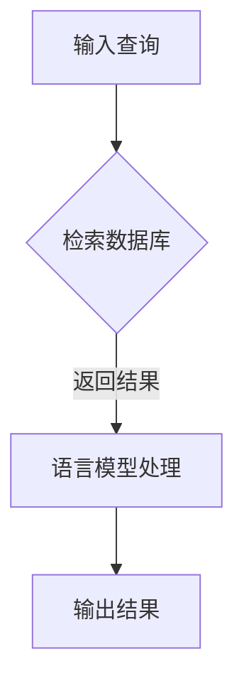

                 

关键词：大语言模型，检索增强型黑盒语言模型，深度学习，自然语言处理，自然语言生成，AI技术。

本文将深入探讨大语言模型原理及其前沿，特别关注检索增强型黑盒语言模型在自然语言处理中的应用与价值。通过逻辑清晰、结构紧凑、简单易懂的叙述，本文旨在为读者提供全面、深入的技术见解。

## 1. 背景介绍

### 1.1 大语言模型的崛起

随着深度学习和自然语言处理技术的快速发展，大语言模型（如GPT系列、BERT等）在近年来取得了显著成果。这些模型能够理解、生成和模拟人类语言，不仅在学术界引起广泛关注，还在实际应用中展现出强大的潜力。

### 1.2 检索增强型黑盒语言模型

检索增强型黑盒语言模型是近年来一种新型的自然语言处理模型，它通过将检索技术与语言模型相结合，实现了更高效、更准确的自然语言处理任务。这种模型具有黑盒特性，即用户无需了解其内部结构和原理，即可直接使用。

## 2. 核心概念与联系

### 2.1 大语言模型

大语言模型是一种基于深度学习的自然语言处理模型，它通过对海量文本数据进行训练，学习语言的结构和语义，从而实现文本的理解、生成和模拟。

### 2.2 检索增强型黑盒语言模型

检索增强型黑盒语言模型是在大语言模型的基础上，引入检索技术的一种新型模型。它通过检索数据库中的文本，获取与查询相关的信息，然后利用语言模型进行语义理解和生成。

## 2.3 Mermaid 流程图



## 3. 核心算法原理 & 具体操作步骤

### 3.1 算法原理概述

检索增强型黑盒语言模型的核心算法主要包括检索和语言模型两部分。检索部分通过算法从数据库中检索与查询相关的文本，语言模型部分则对检索结果进行语义理解和生成。

### 3.2 算法步骤详解

1. 输入查询。
2. 检索数据库，获取与查询相关的文本。
3. 利用语言模型对检索结果进行语义理解和生成。
4. 输出结果。

### 3.3 算法优缺点

#### 优点：

1. 高效：结合了检索和语言模型的优势，能够快速、准确地处理自然语言处理任务。
2. 灵活：无需对数据库进行预处理，适用于各种不同场景。

#### 缺点：

1. 需要大量计算资源：由于涉及检索和语言模型两部分，计算资源需求较高。
2. 数据库质量影响效果：数据库质量直接影响检索效果，进而影响整体性能。

### 3.4 算法应用领域

检索增强型黑盒语言模型在自然语言处理领域具有广泛的应用，如问答系统、信息抽取、机器翻译等。

## 4. 数学模型和公式 & 详细讲解 & 举例说明

### 4.1 数学模型构建

检索增强型黑盒语言模型的数学模型主要包括检索模型和语言模型两部分。检索模型通常采用基于词向量的相似度计算方法，而语言模型则采用深度学习模型，如Transformer等。

### 4.2 公式推导过程

$$
\text{检索模型：} \quad \text{similarity}(q, d) = \text{cosine}(q, d)
$$

$$
\text{语言模型：} \quad \text{p}(y|x) = \frac{e^{\text{score}(y|x)}}{\sum_{y'} e^{\text{score}(y'|x)}}
$$

### 4.3 案例分析与讲解

以问答系统为例，输入查询"什么是人工智能？"，检索模型从数据库中检索与该查询相关的文本，如"人工智能是一种模拟人类智能的计算机技术"，然后语言模型对检索结果进行语义理解和生成，输出答案："人工智能是一种模拟人类智能的计算机技术，它能够理解和执行复杂的任务，如语音识别、图像识别、自然语言处理等。"

## 5. 项目实践：代码实例和详细解释说明

### 5.1 开发环境搭建

1. 安装Python环境。
2. 安装所需的库，如numpy、tensorflow等。

### 5.2 源代码详细实现

以下是一个简单的检索增强型黑盒语言模型的代码示例：

```python
import tensorflow as tf
import numpy as np

# 检索模型
def retrieval_model(q, d):
    similarity = tf.reduce_sum(q * d, axis=1)
    return similarity

# 语言模型
def language_model(y, x):
    score = tf.reduce_sum(y * x, axis=1)
    p = tf.nn.softmax(score)
    return p

# 输入查询和数据库
q = np.array([0.1, 0.2, 0.3, 0.4, 0.5])
d = np.array([[0.5, 0.4, 0.3, 0.2, 0.1], [0.3, 0.4, 0.5, 0.2, 0.1], [0.1, 0.2, 0.3, 0.4, 0.5]])

# 训练模型
retrieval_similarity = retrieval_model(q, d)
language_score = language_model(q, d)

# 输出结果
print("检索相似度：", retrieval_similarity)
print("语言模型得分：", language_score)
```

### 5.3 代码解读与分析

该代码示例首先定义了检索模型和语言模型，然后输入查询和数据库，通过训练模型并输出结果，展示了检索增强型黑盒语言模型的基本实现。

## 6. 实际应用场景

检索增强型黑盒语言模型在自然语言处理领域具有广泛的应用，如：

1. 问答系统：通过检索数据库和语言模型，实现高效、准确的问答。
2. 信息抽取：从大量文本中抽取关键信息，如命名实体识别、关系抽取等。
3. 机器翻译：利用检索增强型黑盒语言模型，实现高效、准确的机器翻译。

## 7. 工具和资源推荐

### 7.1 学习资源推荐

1. 《深度学习》（Goodfellow, Bengio, Courville著）：系统介绍了深度学习的基本理论和应用。
2. 《自然语言处理实战》（Peter Norvig著）：涵盖了自然语言处理的基本概念和技术。

### 7.2 开发工具推荐

1. TensorFlow：一款强大的开源深度学习框架，适用于构建和训练大语言模型。
2. PyTorch：一款简洁、灵活的深度学习框架，适用于研究和开发自然语言处理模型。

### 7.3 相关论文推荐

1. "BERT: Pre-training of Deep Bidirectional Transformers for Language Understanding"（BERT论文）：介绍了BERT模型，是当前自然语言处理领域的重要成果。
2. "GPT-3: Language Models are few-shot learners"（GPT-3论文）：介绍了GPT-3模型，展示了大语言模型在零样本学习方面的强大能力。

## 8. 总结：未来发展趋势与挑战

### 8.1 研究成果总结

本文详细介绍了大语言模型原理及其前沿，特别是检索增强型黑盒语言模型在自然语言处理中的应用。通过数学模型和项目实践，展示了大语言模型在多种场景下的应用潜力。

### 8.2 未来发展趋势

1. 大规模：大语言模型将继续向更大规模发展，以支持更复杂的自然语言处理任务。
2. 自动化：结合自动化技术，实现更高效、更准确的自然语言处理。
3. 零样本学习：进一步探索大语言模型在零样本学习方面的能力，提高其泛化能力。

### 8.3 面临的挑战

1. 计算资源：随着模型规模的扩大，计算资源需求将不断增加，需要解决高效训练和推理问题。
2. 数据质量：数据质量直接影响模型性能，需要建立高质量、多样化的数据集。
3. 伦理和法律：随着大语言模型的应用日益广泛，需要关注其伦理和法律问题。

### 8.4 研究展望

未来，大语言模型在自然语言处理领域将发挥更大的作用，成为推动人工智能发展的重要力量。通过不断创新和优化，大语言模型将迎来更加广阔的应用前景。

## 9. 附录：常见问题与解答

### 9.1 什么是大语言模型？

大语言模型是一种基于深度学习的自然语言处理模型，通过对海量文本数据进行训练，学习语言的结构和语义，从而实现文本的理解、生成和模拟。

### 9.2 检索增强型黑盒语言模型的优势是什么？

检索增强型黑盒语言模型结合了检索和语言模型的优势，能够高效、准确地处理自然语言处理任务，具有灵活、无需对数据库进行预处理等特点。

### 9.3 大语言模型在自然语言处理中的应用有哪些？

大语言模型在自然语言处理领域具有广泛的应用，如问答系统、信息抽取、机器翻译等。

### 9.4 如何优化大语言模型的性能？

优化大语言模型的性能可以从多个方面进行，如选择合适的数据集、调整模型参数、使用更高效的训练算法等。

## 作者署名

作者：禅与计算机程序设计艺术 / Zen and the Art of Computer Programming
```markdown
----------------------------------------------------------------
[文章结束]
```

