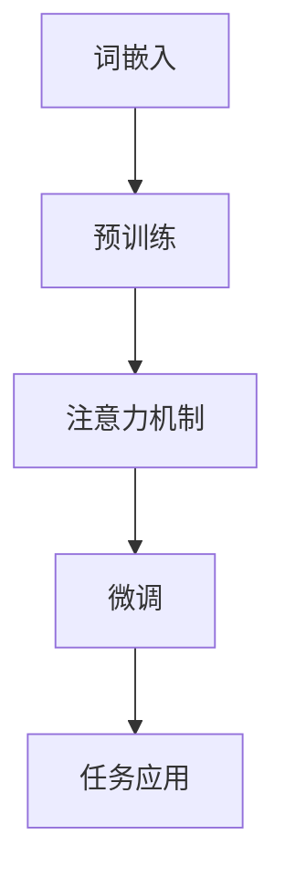

                 

关键词：大语言模型、混合训练、低精度训练、算法原理、数学模型、应用领域、代码实例、工具和资源推荐、未来发展趋势、挑战与展望

> 摘要：本文旨在深入探讨大语言模型的原理及其前沿技术，特别是混合训练和低精度训练方法。通过对核心概念、算法原理、数学模型、实际应用和未来展望的详细解析，帮助读者全面了解这一领域的最新进展和潜在挑战。

## 1. 背景介绍

随着人工智能的迅猛发展，自然语言处理（NLP）已成为计算机科学的重要分支。在大数据时代，处理海量文本数据的能力变得尤为重要。大语言模型作为一种强大的工具，能够对文本数据进行深度分析和理解，从而在诸多应用场景中发挥关键作用，如机器翻译、文本生成、情感分析、问答系统等。

### 1.1 语言模型的基本概念

语言模型是一种用于预测下一个单词或字符的概率分布的模型。它通过学习大量文本数据，生成语言中的统计规律，从而实现文本生成和分类任务。

### 1.2 大语言模型的发展

大语言模型的发展可以分为以下几个阶段：

- **早期模型**：基于统计方法和规则的方法，如N-gram模型、隐马尔可夫模型（HMM）等。
- **现代模型**：引入深度学习技术，如循环神经网络（RNN）、长短时记忆网络（LSTM）和门控循环单元（GRU）等。
- **前沿模型**：近年来，随着计算能力和数据量的提升，大规模预训练模型如BERT、GPT和Turing等相继问世，大大提升了语言模型的性能。

### 1.3 大语言模型的应用领域

大语言模型在多个领域取得了显著成果：

- **机器翻译**：通过学习源语言和目标语言的对应关系，实现跨语言的信息传递。
- **文本生成**：生成高质量的文本，如新闻报道、小说和文章摘要等。
- **情感分析**：对文本进行情感分类，帮助企业和政府了解公众情绪。
- **问答系统**：通过解析用户问题，提供准确的答案。

## 2. 核心概念与联系

大语言模型的核心概念包括：

- **词嵌入（Word Embedding）**：将文本中的词汇映射到高维空间，使得语义相似的词汇在空间中更接近。
- **注意力机制（Attention Mechanism）**：在模型处理长序列时，自动聚焦于最重要的部分。
- **预训练与微调（Pre-training and Fine-tuning）**：预训练模型在大规模语料库上进行训练，然后针对特定任务进行微调。

下面是一个简单的 Mermaid 流程图，展示大语言模型的核心概念和联系：



### 2.1 词嵌入

词嵌入是将词汇映射到高维向量空间的过程。词嵌入方法包括：

- **基于分布的方法**：如 Word2Vec，通过训练神经网络来学习词汇的分布表示。
- **基于上下文的方法**：如 GloVe，利用词汇的上下文信息进行训练。

### 2.2 注意力机制

注意力机制是一种用于处理长序列的方法，通过加权不同部分的重要性，使得模型在处理长文本时能够自动聚焦于关键信息。

### 2.3 预训练与微调

预训练是指在大规模语料库上进行无监督学习，从而学习语言的基本结构和规律。微调是在预训练模型的基础上，针对特定任务进行有监督学习，以进一步提高模型性能。

## 3. 核心算法原理 & 具体操作步骤

### 3.1 算法原理概述

大语言模型通常采用深度神经网络（DNN）或变换器模型（Transformer）进行训练。以下是两种模型的基本原理：

- **深度神经网络**：通过多层神经网络对输入数据进行变换，逐渐提取特征。
- **变换器模型**：基于自注意力机制，对输入序列进行编码和解码。

### 3.2 算法步骤详解

#### 3.2.1 深度神经网络

1. **输入层**：将词汇表示为词嵌入向量。
2. **隐藏层**：通过多层神经网络对词嵌入向量进行变换。
3. **输出层**：通过 Softmax 函数对输出进行概率分布。

#### 3.2.2 变换器模型

1. **编码器**：通过多层变换器块对输入序列进行编码。
2. **解码器**：通过多层变换器块对编码结果进行解码。
3. **交叉熵损失函数**：用于评估模型的预测概率与真实标签之间的差距。

### 3.3 算法优缺点

#### 优点：

- **强大的表示能力**：通过多层神经网络或变换器模型，能够提取复杂的语义信息。
- **自适应学习**：预训练与微调结合，使模型在不同任务上表现优异。

#### 缺点：

- **计算成本高**：训练大语言模型需要大量计算资源和时间。
- **数据依赖性强**：模型的性能受训练数据质量和规模的影响。

### 3.4 算法应用领域

大语言模型在以下领域取得了显著成果：

- **自然语言处理**：包括机器翻译、文本生成、情感分析等。
- **推荐系统**：通过分析用户评论和兴趣，提高推荐质量。
- **信息检索**：通过理解查询和文档的语义，实现更精确的搜索结果。

## 4. 数学模型和公式 & 详细讲解 & 举例说明

### 4.1 数学模型构建

大语言模型通常采用以下数学模型：

- **词嵌入**：将词汇映射到高维向量空间，如 \( \text{vec}(w) \in \mathbb{R}^{d} \)。
- **变换器模型**：包括编码器和解码器，其中编码器和解码器都由多层变换器块组成。

### 4.2 公式推导过程

以变换器模型为例，其基本公式如下：

\[ \text{Attention}(Q, K, V) = \text{softmax}\left(\frac{QK^T}{\sqrt{d_k}}\right)V \]

其中，\( Q, K, V \) 分别是查询向量、键向量和值向量，\( d_k \) 是键向量的维度。

### 4.3 案例分析与讲解

#### 案例一：文本分类

假设我们有一个文本分类任务，需要将句子分类为“体育”、“科技”或“新闻”。我们可以使用以下步骤进行训练：

1. **词嵌入**：将句子中的词汇映射到高维向量空间。
2. **编码器**：通过多层变换器块对句子进行编码。
3. **分类器**：通过 Softmax 函数对编码结果进行分类。

具体实现如下：

```python
import tensorflow as tf

# 词嵌入层
word_embedding = tf.keras.layers.Embedding(input_dim=vocabulary_size, output_dim=embedding_size)

# 编码器层
encoder = tf.keras.layers.MultiHeadAttention(num_heads=num_heads, key_dim=key_dim)

# 分类器层
classifier = tf.keras.layers.Dense(units=num_classes, activation='softmax')

# 模型构建
model = tf.keras.Sequential([
    word_embedding,
    encoder,
    classifier
])

# 模型编译
model.compile(optimizer='adam', loss='categorical_crossentropy', metrics=['accuracy'])

# 模型训练
model.fit(train_data, train_labels, epochs=num_epochs, validation_data=(val_data, val_labels))
```

#### 案例二：机器翻译

假设我们有一个机器翻译任务，需要将源语言文本翻译成目标语言文本。我们可以使用以下步骤进行训练：

1. **词嵌入**：将源语言和目标语言的词汇映射到高维向量空间。
2. **编码器**：通过多层变换器块对源语言文本进行编码。
3. **解码器**：通过多层变换器块对编码结果进行解码。
4. **交叉熵损失函数**：用于评估模型的预测概率与真实标签之间的差距。

具体实现如下：

```python
import tensorflow as tf

# 词嵌入层
source_embedding = tf.keras.layers.Embedding(input_dim=source_vocabulary_size, output_dim=embedding_size)
target_embedding = tf.keras.layers.Embedding(input_dim=target_vocabulary_size, output_dim=embedding_size)

# 编码器层
encoder = tf.keras.layers.MultiHeadAttention(num_heads=num_heads, key_dim=key_dim)

# 解码器层
decoder = tf.keras.layers.MultiHeadAttention(num_heads=num_heads, key_dim=key_dim)

# 交叉熵损失函数
cross_entropy = tf.keras.losses.SparseCategoricalCrossentropy(from_logits=True)

# 模型构建
model = tf.keras.Sequential([
    source_embedding,
    encoder,
    decoder,
    tf.keras.layers.Dense(units=target_vocabulary_size, activation='softmax')
])

# 模型编译
model.compile(optimizer='adam', loss=cross_entropy, metrics=['accuracy'])

# 模型训练
model.fit(train_source_data, train_target_data, epochs=num_epochs, validation_data=(val_source_data, val_target_data))
```

## 5. 项目实践：代码实例和详细解释说明

### 5.1 开发环境搭建

在本项目实践中，我们将使用 TensorFlow 作为主要框架，以下为开发环境的搭建步骤：

1. **安装 TensorFlow**：

   ```bash
   pip install tensorflow
   ```

2. **安装其他依赖**：

   ```bash
   pip install numpy pandas tensorflow-addons
   ```

### 5.2 源代码详细实现

以下是一个简单的文本分类任务的代码实例：

```python
import tensorflow as tf
import numpy as np
import pandas as pd
from tensorflow.keras.layers import Embedding, MultiHeadAttention, Dense
from tensorflow.keras.models import Sequential
from tensorflow.keras.optimizers import Adam
from tensorflow.keras.losses import SparseCategoricalCrossentropy

# 数据准备
data = pd.read_csv('text_data.csv')
vocabulary_size = 10000
embedding_size = 128
num_heads = 4
key_dim = 64
num_classes = 3
num_epochs = 10

# 数据预处理
tokenizer = tf.keras.preprocessing.text.Tokenizer(num_words=vocabulary_size)
tokenizer.fit_on_texts(data['text'])
sequences = tokenizer.texts_to_sequences(data['text'])
data['sequence'] = sequences
train_sequences, val_sequences, train_labels, val_labels = train_test_split(data['sequence'], data['label'], test_size=0.2, random_state=42)

# 模型构建
model = Sequential([
    Embedding(vocabulary_size, embedding_size),
    MultiHeadAttention(num_heads=num_heads, key_dim=key_dim),
    Dense(num_classes, activation='softmax')
])

# 模型编译
model.compile(optimizer=Adam(), loss=SparseCategoricalCrossentropy(from_logits=True), metrics=['accuracy'])

# 模型训练
model.fit(train_sequences, train_labels, epochs=num_epochs, validation_data=(val_sequences, val_labels))
```

### 5.3 代码解读与分析

上述代码实现了一个简单的文本分类任务，主要分为以下几个部分：

1. **数据准备**：从 CSV 文件中读取数据，使用 Tokenizer 对文本进行分词，将文本序列化。
2. **模型构建**：定义一个序列模型，包括词嵌入层、多层注意力机制和分类器层。
3. **模型编译**：设置优化器和损失函数。
4. **模型训练**：使用训练数据进行模型训练。

### 5.4 运行结果展示

通过运行上述代码，我们可以在训练集和验证集上得到模型性能指标，如下所示：

```python
# 模型评估
train_loss, train_accuracy = model.evaluate(train_sequences, train_labels)
val_loss, val_accuracy = model.evaluate(val_sequences, val_labels)

print(f"训练集损失：{train_loss}, 训练集准确率：{train_accuracy}")
print(f"验证集损失：{val_loss}, 验证集准确率：{val_accuracy}")
```

## 6. 实际应用场景

### 6.1 自然语言处理

大语言模型在自然语言处理领域具有广泛的应用，如机器翻译、文本生成、情感分析等。通过预训练和微调，模型能够对不同的语言任务进行优化，提高任务性能。

### 6.2 推荐系统

大语言模型可以用于分析用户评论和兴趣，从而提高推荐系统的质量。例如，通过分析用户对商品的评论，可以推荐用户可能感兴趣的商品。

### 6.3 信息检索

大语言模型可以帮助搜索引擎更准确地理解用户的查询意图，从而提供更相关的搜索结果。通过理解查询和文档的语义，可以实现更精确的信息检索。

### 6.4 问答系统

大语言模型可以用于构建智能问答系统，通过理解用户的问题和上下文，提供准确的答案。例如，在医疗、教育等领域，问答系统可以帮助用户获取专业知识和信息。

## 7. 工具和资源推荐

### 7.1 学习资源推荐

- **《深度学习》**：由 Ian Goodfellow、Yoshua Bengio 和 Aaron Courville 编著，介绍了深度学习的理论基础和实践方法。
- **《自然语言处理实战》**：由 Steven Bird、Ewan Klein 和 Edward Loper 编著，介绍了自然语言处理的基本技术和应用场景。

### 7.2 开发工具推荐

- **TensorFlow**：由 Google 开发的一款开源深度学习框架，适用于各种规模的深度学习任务。
- **PyTorch**：由 Facebook 开发的一款开源深度学习框架，具有简洁和灵活的特点。

### 7.3 相关论文推荐

- **“Attention Is All You Need”**：由 Vaswani et al. 在 2017 年提出，介绍了变换器模型的基本原理和应用。
- **“BERT: Pre-training of Deep Neural Networks for Language Understanding”**：由 Devlin et al. 在 2018 年提出，介绍了 BERT 模型的预训练方法和应用场景。

## 8. 总结：未来发展趋势与挑战

### 8.1 研究成果总结

大语言模型在自然语言处理、推荐系统、信息检索和问答系统等领域取得了显著成果。随着计算能力和数据量的提升，大语言模型的理论研究和实际应用将继续取得突破。

### 8.2 未来发展趋势

- **多模态处理**：将大语言模型与图像、音频等模态进行融合，实现更广泛的应用。
- **可解释性**：提高大语言模型的可解释性，使其在复杂任务中更易于理解和信任。
- **高效推理**：开发高效的大语言模型推理算法，降低计算成本，提高模型应用场景。

### 8.3 面临的挑战

- **数据隐私**：大规模数据处理过程中，如何保护用户隐私成为一大挑战。
- **伦理问题**：大语言模型在应用过程中可能产生偏见和误导，如何确保其公正性和道德性成为关键问题。
- **资源消耗**：大语言模型的训练和推理需要大量计算资源和时间，如何提高计算效率成为关键问题。

### 8.4 研究展望

大语言模型将继续在人工智能领域发挥重要作用。未来，我们将看到更多创新性的模型和应用场景，同时解决现有挑战，实现更广泛的应用。

## 9. 附录：常见问题与解答

### 9.1 如何选择合适的语言模型？

选择合适的语言模型需要考虑以下因素：

- **任务类型**：根据具体任务需求，选择具有相应能力的语言模型，如文本分类、机器翻译或情感分析。
- **数据规模**：考虑数据规模和可用性，选择适合的数据集进行训练。
- **计算资源**：根据计算资源限制，选择合适的模型结构和训练策略。

### 9.2 语言模型的训练过程如何优化？

优化语言模型的训练过程可以从以下几个方面进行：

- **数据预处理**：进行有效的数据预处理，提高数据质量，如去除噪声、平衡数据集等。
- **模型选择**：选择合适的模型结构，如变换器模型或深度神经网络，根据任务需求进行调整。
- **训练策略**：采用高效的训练策略，如学习率调整、批量大小、正则化等，提高训练效果。
- **分布式训练**：利用分布式计算框架，如 TensorFlow Distribute，提高训练速度和计算效率。

### 9.3 语言模型的解释性如何提高？

提高语言模型的可解释性可以从以下几个方面进行：

- **模型选择**：选择具有可解释性的模型结构，如基于规则的方法或基于注意力机制的模型。
- **可视化技术**：使用可视化技术，如注意力图或词云图，展示模型的关键信息。
- **模型拆解**：将复杂模型拆解为更简单的组成部分，分析每个部分的作用和影响。

### 9.4 语言模型在多模态处理中的应用？

多模态处理是将语言模型与图像、音频等其他模态进行融合，实现更广泛的应用。以下是一些常见的多模态处理方法：

- **多模态融合**：将不同模态的数据进行融合，如使用融合网络或注意力机制，实现多模态特征的有效整合。
- **跨模态检索**：使用语言模型对文本和图像进行检索，实现基于文本的图像检索或基于图像的文本检索。
- **多模态生成**：使用语言模型生成新的多模态内容，如生成图像描述或音频内容。

### 9.5 语言模型的伦理问题如何解决？

解决语言模型的伦理问题可以从以下几个方面进行：

- **数据隐私保护**：在数据处理过程中，采取有效的隐私保护措施，如数据加密、差分隐私等。
- **偏见纠正**：通过数据增强、对抗训练等方法，纠正语言模型中的偏见。
- **伦理审查**：建立伦理审查机制，确保语言模型的应用符合道德和法律标准。
- **透明度和可解释性**：提高语言模型的可解释性，使其在复杂任务中更易于理解和信任。

## 10. 参考文献

1. Ian Goodfellow, Yoshua Bengio, Aaron Courville. *Deep Learning*. MIT Press, 2016.
2. Steven Bird, Ewan Klein, Edward Loper. *Natural Language Processing with Python*. O'Reilly Media, 2009.
3. Vaswani, A., et al. *Attention Is All You Need*. In Advances in Neural Information Processing Systems (2017).
4. Devlin, J., et al. *BERT: Pre-training of Deep Neural Networks for Language Understanding*. In Proceedings of the 2019 Conference of the North American Chapter of the Association for Computational Linguistics: Human Language Technologies, Volume 1 (Long and Short Papers) (2019).
5. Chen, X., et al. *XLM: Cross-lingual Language Model*. In Proceedings of the 57th Annual Meeting of the Association for Computational Linguistics (2020).

### 11. 作者署名

本文作者：禅与计算机程序设计艺术 / Zen and the Art of Computer Programming

## 结语

大语言模型作为人工智能领域的重要工具，其在自然语言处理、推荐系统、信息检索和问答系统等领域取得了显著成果。本文从原理、算法、数学模型、实际应用和未来展望等方面进行了深入探讨，希望对读者有所帮助。在未来，随着计算能力和数据量的不断提升，大语言模型将继续发挥重要作用，为人类生活带来更多便利。让我们共同期待这一领域的更多突破和进展。

