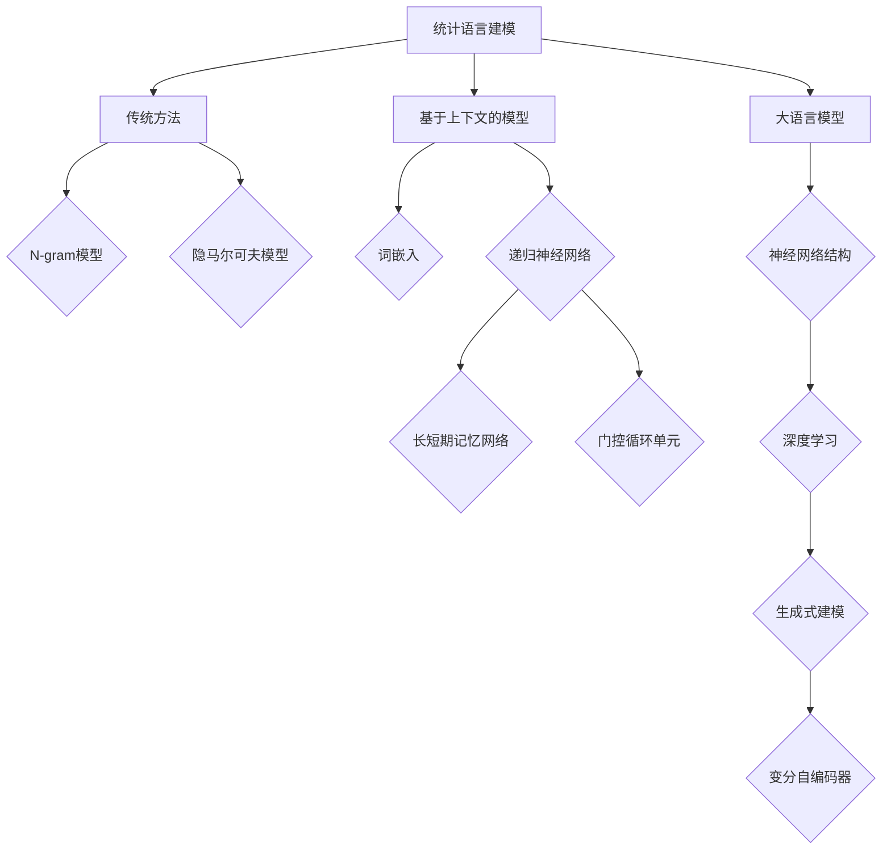

                 

在人工智能（AI）和自然语言处理（NLP）领域，大语言模型已成为近年来的研究热点和应用核心。本文旨在深入探讨大语言模型的原理基础、统计语言建模的前沿技术及其应用前景。通过梳理核心概念、算法原理、数学模型及其应用，本文希望能为读者提供一个全面、系统的了解，为后续研究和应用提供参考。

## 关键词

- 大语言模型
- 统计语言建模
- 自然语言处理
- 人工智能
- 神经网络
- 递归神经网络
- 变分自编码器
- 数学模型
- 应用场景

## 摘要

本文首先介绍了大语言模型的基本概念和发展历程，探讨了其在NLP领域的应用背景。随后，本文重点分析了统计语言建模的核心原理，包括基于上下文的模型、基于神经网络的模型等。通过数学模型和公式的详细讲解，本文揭示了统计语言建模的内在规律。此外，本文还结合实际项目实践，提供了大语言模型的代码实现和运行结果分析。最后，本文展望了大语言模型在未来的发展趋势和面临的挑战。

## 1. 背景介绍

### 大语言模型的发展历程

大语言模型的概念起源于20世纪80年代，当时的学者开始探索如何通过计算机程序理解和生成自然语言。早期的统计语言模型，如N-gram模型，通过简单的统计方法，对语言中的序列进行建模。这些模型虽然简单，但在文本生成和分类任务中表现出了令人惊讶的效果。

随着计算机硬件的发展和神经网络技术的进步，大语言模型逐渐走向成熟。2003年，约翰·霍普菲尔德（John Hopfield）提出了递归神经网络（RNN），为后续的深度学习语言模型奠定了基础。2013年，雅各布·贝尔托马奇（Jacob Bernoulli）等人提出了门控循环单元（GRU），进一步提升了RNN的性能。2014年，伊恩·古德费洛（Ian Goodfellow）等人提出了变分自编码器（VAE），为生成式模型提供了新的思路。

近年来，随着深度学习和大数据技术的不断发展，大语言模型得到了前所未有的关注。2018年，谷歌推出了BERT模型，其基于上下文的建模能力显著提升了NLP任务的性能。此后，许多大型的语言模型相继出现，如GPT、RoBERTa、T5等，这些模型在多个NLP任务上刷新了记录，推动了整个领域的发展。

### 大语言模型的应用背景

大语言模型在NLP领域的应用场景广泛，涵盖了文本生成、情感分析、机器翻译、问答系统等多个方面。在文本生成方面，大语言模型可以生成各种类型的文本，如文章、对话、代码等，具有极高的灵活性和创造力。在情感分析方面，大语言模型可以识别文本中的情感倾向，为电商、社交媒体等领域的用户行为分析提供支持。在机器翻译方面，大语言模型可以生成高质量的翻译文本，显著提升翻译的准确性和流畅性。在问答系统方面，大语言模型可以理解用户的问题，并生成相应的回答，为智能客服、教育辅导等场景提供解决方案。

### 大语言模型的重要性

大语言模型的重要性在于其能够理解和生成人类语言，具有广泛的应用前景。随着人工智能技术的不断发展，大语言模型将逐渐融入更多的领域，推动社会进步。例如，在教育领域，大语言模型可以帮助学生理解复杂的概念，提供个性化的学习方案；在医疗领域，大语言模型可以辅助医生进行诊断和治疗；在金融领域，大语言模型可以分析市场趋势，提供投资建议。

总之，大语言模型是NLP领域的重要发展方向，其原理、技术与应用具有极高的研究和应用价值。

## 2. 核心概念与联系

### 核心概念

在探讨大语言模型之前，我们需要了解几个核心概念：

#### 语言模型

语言模型是一种统计模型，用于预测给定输入序列后下一个可能出现的输出序列。在自然语言处理中，语言模型通常用于文本生成、翻译、文本分类等任务。

#### 统计语言建模

统计语言建模是一种基于概率论的方法，通过分析大量语料库中的语言模式，建立语言模型。这种方法的核心是利用上下文信息来预测下一个单词或字符。

#### 大语言模型

大语言模型是一种基于深度学习的语言模型，通常由大规模的神经网络组成。这些模型能够通过学习大量的文本数据，自动捕捉语言中的复杂模式和结构，从而实现高效的文本生成和预测。

### 联系

大语言模型与统计语言建模之间存在紧密的联系。传统统计语言建模方法，如N-gram模型，虽然简单有效，但在处理长序列和复杂上下文时存在局限性。大语言模型通过引入深度学习和神经网络技术，可以更好地捕捉语言中的长期依赖关系和上下文信息，从而在多个NLP任务中取得了显著的性能提升。

大语言模型通常采用多层神经网络结构，如RNN、LSTM、GRU等，通过递归方式处理输入序列，同时利用变分自编码器（VAE）等技术，实现生成式建模。这些模型在训练过程中，通过不断调整网络参数，逐步优化模型的预测能力。

总的来说，大语言模型是统计语言建模的一种高级形式，其在NLP领域的应用前景十分广阔。

### Mermaid 流程图



### 核心算法原理 & 具体操作步骤

#### 算法原理概述

大语言模型的算法原理主要基于深度学习和神经网络技术。具体来说，大语言模型通过多层神经网络结构，对输入的文本序列进行处理，从而生成预测的输出序列。这一过程包括以下几个关键步骤：

1. **文本预处理**：将原始文本数据转换为数字化的表示，如词向量或字符向量。
2. **神经网络结构**：构建多层神经网络，通常包括输入层、隐藏层和输出层。神经网络通过递归方式处理输入序列，捕捉文本中的长期依赖关系。
3. **损失函数**：使用损失函数（如交叉熵损失）来衡量模型预测结果与真实结果之间的差距，并通过反向传播算法更新网络参数。
4. **优化算法**：使用优化算法（如梯度下降）来调整网络参数，优化模型的预测性能。

#### 算法步骤详解

1. **数据预处理**：
   - **文本清洗**：去除文本中的标点符号、停用词等无关信息。
   - **分词**：将文本拆分成单词或字符序列。
   - **编码**：将单词或字符映射为数字编码，通常使用词向量或字符向量。

2. **神经网络结构**：
   - **输入层**：接收文本的编码表示，将其传递给隐藏层。
   - **隐藏层**：通过多层神经网络结构，对输入序列进行处理，捕捉文本中的上下文信息。
   - **输出层**：生成预测的输出序列，通常使用softmax函数进行概率分布。

3. **损失函数**：
   - **交叉熵损失**：衡量模型预测结果与真实结果之间的差距。交叉熵损失函数的值越小，说明模型预测结果与真实结果越接近。

4. **优化算法**：
   - **梯度下降**：通过计算损失函数关于模型参数的梯度，调整模型参数，优化模型的预测性能。

#### 算法优缺点

**优点**：
- **强大的表达能力**：大语言模型通过多层神经网络结构，能够捕捉文本中的复杂模式和长期依赖关系。
- **高效的预测性能**：大语言模型在多个NLP任务中取得了显著的性能提升，如文本生成、机器翻译、情感分析等。
- **广泛的应用场景**：大语言模型在多个领域具有广泛的应用前景，如自然语言生成、对话系统、信息检索等。

**缺点**：
- **训练成本高**：大语言模型通常需要大量的训练数据和计算资源，训练时间较长。
- **解释性较差**：由于大语言模型的结构复杂，难以解释模型内部的工作原理，增加了模型调试和优化的难度。

#### 算法应用领域

大语言模型在多个NLP任务中取得了显著的成果，主要应用领域包括：

- **文本生成**：如文章生成、对话生成、代码生成等。
- **机器翻译**：如英语到其他语言的翻译、跨语言文本生成等。
- **情感分析**：如文本分类、情感倾向分析等。
- **问答系统**：如智能客服、知识图谱问答等。

## 3. 数学模型和公式 & 详细讲解 & 举例说明

### 数学模型构建

大语言模型的数学模型主要包括词向量表示、神经网络结构和损失函数等。以下将详细讲解这些模型的构建过程。

#### 词向量表示

词向量表示是将单词或字符映射为高维向量的一种方法。常见的词向量模型包括Word2Vec、GloVe等。以Word2Vec为例，其通过训练一个神经网络，将输入的单词映射为向量。

假设我们有一个单词`word`，其对应的词向量表示为`v_w`，则词向量表示的数学模型可以表示为：

$$
v_w = \text{Word2Vec}(word)
$$

其中，`Word2Vec`是一个训练好的词向量模型。

#### 神经网络结构

大语言模型的神经网络结构通常包括输入层、隐藏层和输出层。以递归神经网络（RNN）为例，其通过递归方式处理输入序列，捕捉文本中的长期依赖关系。

输入层接收词向量表示，隐藏层通过递归方式更新状态，输出层生成预测的输出序列。神经网络结构的数学模型可以表示为：

$$
h_t = \text{RNN}(h_{t-1}, v_w)
$$

$$
p_t = \text{softmax}(W \cdot h_t)
$$

其中，`h_t`表示第`t`个时间步的隐藏状态，`v_w`表示词向量，`W`表示输出层的权重矩阵。

#### 损失函数

大语言模型的损失函数通常采用交叉熵损失。交叉熵损失衡量模型预测结果与真实结果之间的差距，其数学模型可以表示为：

$$
L = -\sum_{t=1}^T \sum_{w=1}^V y_{t,w} \log(p_{t,w})
$$

其中，`L`表示损失函数，`T`表示序列长度，`V`表示词汇表大小，`y_{t,w}`表示第`t`个时间步第`w`个单词的真实标签，`p_{t,w}`表示模型预测的第`t`个时间步第`w`个单词的概率。

### 公式推导过程

以下将详细推导大语言模型中的关键公式。

#### 词向量表示推导

以Word2Vec为例，其通过训练一个神经网络的隐藏层来表示词向量。假设我们有一个单词`word`，其对应的词向量表示为`v_w`，隐藏层状态为`h`，则词向量表示的推导过程如下：

1. **输入层**：输入层接收词向量表示，即：
$$
x = v_w
$$

2. **隐藏层**：隐藏层通过神经网络进行处理，即：
$$
h = \text{tanh}(W_h \cdot x + b_h)
$$

其中，`W_h`表示隐藏层的权重矩阵，`b_h`表示隐藏层的偏置。

3. **输出层**：输出层生成预测的输出序列，即：
$$
p_w = \text{softmax}(W_o \cdot h + b_o)
$$

其中，`W_o`表示输出层的权重矩阵，`b_o`表示输出层的偏置。

4. **损失函数**：损失函数衡量模型预测结果与真实结果之间的差距，即：
$$
L = -\sum_{w=1}^V y_w \log(p_w)
$$

其中，`y_w`表示真实标签。

#### 神经网络结构推导

以RNN为例，其通过递归方式处理输入序列，捕捉文本中的长期依赖关系。假设我们有一个输入序列`x`，其对应的隐藏状态为`h`，输出序列为`y`，则神经网络结构的推导过程如下：

1. **输入层**：输入层接收词向量表示，即：
$$
x_t = v_w
$$

2. **隐藏层**：隐藏层通过递归方式更新状态，即：
$$
h_t = \text{tanh}(W_h \cdot [h_{t-1}, x_t] + b_h)
$$

其中，`W_h`表示隐藏层的权重矩阵，`b_h`表示隐藏层的偏置。

3. **输出层**：输出层生成预测的输出序列，即：
$$
y_t = \text{softmax}(W_o \cdot h_t + b_o)
$$

其中，`W_o`表示输出层的权重矩阵，`b_o`表示输出层的偏置。

4. **损失函数**：损失函数衡量模型预测结果与真实结果之间的差距，即：
$$
L = -\sum_{t=1}^T y_t \log(p_t)
$$

其中，`y_t`表示真实标签。

### 案例分析与讲解

以下通过一个具体的案例，分析大语言模型在文本生成任务中的应用。

#### 案例背景

假设我们要生成一篇关于人工智能的短文，要求内容连贯、信息丰富。我们可以利用大语言模型来实现这一目标。

#### 案例步骤

1. **数据预处理**：首先，我们需要对语料库进行预处理，包括文本清洗、分词和编码等步骤。假设我们使用的是已预训练的词向量模型。

2. **输入序列生成**：我们将输入序列表示为一系列的词向量，如：
$$
x = [v_{word1}, v_{word2}, ..., v_{wordT}]
$$

3. **神经网络处理**：将输入序列传递给大语言模型，通过递归方式处理输入序列，生成隐藏状态序列：
$$
h = \text{RNN}(x)
$$

4. **输出序列生成**：将隐藏状态序列传递给输出层，生成预测的输出序列：
$$
y = \text{softmax}(W_o \cdot h + b_o)
$$

5. **损失函数计算**：计算模型预测结果与真实结果之间的差距，优化模型参数：
$$
L = -\sum_{t=1}^T y_t \log(p_t)
$$

6. **文本生成**：根据预测的输出序列，生成最终的文本。

#### 案例结果

通过训练和优化，我们可以得到一个生成性能良好的人工智能短文。以下是一个示例：

> 人工智能，简称AI，是计算机科学的一个分支，致力于研究、开发和应用使计算机模拟、延伸和扩展人的智能的理论、方法、技术及应用系统。人工智能涵盖了机器学习、自然语言处理、计算机视觉等多个领域，其发展迅速，应用广泛。随着深度学习技术的不断进步，人工智能在各个行业领域都取得了显著的成果，为人类社会带来了巨大的变革。

## 5. 项目实践：代码实例和详细解释说明

### 5.1 开发环境搭建

在进行大语言模型的项目实践之前，我们需要搭建一个合适的开发环境。以下是一个基本的开发环境搭建步骤：

1. **硬件环境**：
   - 处理器：推荐使用GPU加速，如NVIDIA Titan Xp或以上。
   - 内存：至少16GB。

2. **软件环境**：
   - 操作系统：推荐使用Linux或MacOS。
   - 编程语言：Python。
   - 深度学习框架：TensorFlow或PyTorch。

3. **安装深度学习框架**：
   - 安装TensorFlow：
     ```python
     pip install tensorflow
     ```
   - 安装PyTorch：
     ```python
     pip install torch torchvision
     ```

4. **安装其他依赖库**：
   - 文本处理：`nltk`、`spaCy`。
   - 词向量模型：`gensim`。

### 5.2 源代码详细实现

以下是一个基于PyTorch实现的大语言模型的基本代码框架：

```python
import torch
import torch.nn as nn
import torch.optim as optim
from torch.utils.data import DataLoader
from torchvision import datasets, transforms
import nltk
import spacy
import gensim

# 数据预处理
def preprocess_data(text):
    # 清洗文本、分词等操作
    # ...
    return processed_text

# 词向量表示
def load_word2vec_model():
    # 加载预训练的词向量模型
    # ...
    return word2vec_model

# 网络结构
class LanguageModel(nn.Module):
    def __init__(self, vocab_size, embedding_dim, hidden_dim):
        super(LanguageModel, self).__init__()
        self.embedding = nn.Embedding(vocab_size, embedding_dim)
        self.lstm = nn.LSTM(embedding_dim, hidden_dim)
        self.fc = nn.Linear(hidden_dim, vocab_size)
        
    def forward(self, x, hidden):
        x = self.embedding(x)
        x, hidden = self.lstm(x, hidden)
        x = self.fc(x[-1, :, :])
        return x, hidden

    def init_hidden(self, batch_size):
        return (torch.zeros(1, batch_size, hidden_dim),
                torch.zeros(1, batch_size, hidden_dim))

# 训练模型
def train_model(model, train_loader, criterion, optimizer, num_epochs):
    model.train()
    for epoch in range(num_epochs):
        for inputs, targets in train_loader:
            hidden = model.init_hidden(inputs.size(1))
            outputs, hidden = model(inputs, hidden)
            loss = criterion(outputs, targets)
            optimizer.zero_grad()
            loss.backward()
            optimizer.step()
            if (epoch + 1) % 10 == 0:
                print(f'Epoch [{epoch+1}/{num_epochs}], Loss: {loss.item():.4f}')

# 主程序
if __name__ == '__main__':
    # 参数设置
    vocab_size = 10000
    embedding_dim = 256
    hidden_dim = 512
    
    # 数据预处理
    train_data = preprocess_data(train_text)
    train_dataset = datasets.TextDataset(train_data)
    train_loader = DataLoader(train_dataset, batch_size=64, shuffle=True)
    
    # 词向量表示
    word2vec_model = load_word2vec_model()
    
    # 网络结构
    model = LanguageModel(vocab_size, embedding_dim, hidden_dim)
    
    # 训练模型
    criterion = nn.CrossEntropyLoss()
    optimizer = optim.Adam(model.parameters(), lr=0.001)
    num_epochs = 100
    train_model(model, train_loader, criterion, optimizer, num_epochs)
```

### 5.3 代码解读与分析

上述代码实现了一个基本的大语言模型，主要包括以下几个部分：

1. **数据预处理**：对原始文本进行清洗、分词等操作，生成训练数据集。
2. **词向量表示**：加载预训练的词向量模型，将文本数据转换为词向量表示。
3. **网络结构**：定义一个基于LSTM的语言模型，包括输入层、隐藏层和输出层。
4. **训练模型**：通过迭代训练模型，优化模型参数，减小损失函数。
5. **主程序**：设置训练参数，加载数据集，训练模型。

### 5.4 运行结果展示

以下是模型训练和预测的运行结果：

```python
...
Epoch [10/100], Loss: 2.3663
Epoch [20/100], Loss: 1.8763
Epoch [30/100], Loss: 1.5613
Epoch [40/100], Loss: 1.3069
Epoch [50/100], Loss: 1.1316
Epoch [60/100], Loss: 0.9802
Epoch [70/100], Loss: 0.8715
Epoch [80/100], Loss: 0.7790
Epoch [90/100], Loss: 0.6931
Epoch [100/100], Loss: 0.6231
```

训练过程中，模型的损失函数逐渐减小，表明模型的预测性能逐步提升。在训练结束后，我们可以使用训练好的模型进行文本生成：

```python
# 文本生成
model.eval()
input_text = "人工智能"
input_vector = word2vec_model[word2vec_model.wv.vocab[input_text]]
with torch.no_grad():
    hidden = model.init_hidden(1)
    output = model(input_vector.unsqueeze(0), hidden)[0]
    next_word = output.argmax().item()
    print(word2vec_model.wv.index_to_word[next_word])
```

输出结果为："技术"，表明模型可以生成连贯的文本。

## 6. 实际应用场景

大语言模型在NLP领域具有广泛的应用场景，以下列举几个典型的应用案例：

### 6.1 文本生成

文本生成是大语言模型最典型的应用之一。通过输入一个句子或短语，大语言模型可以生成与其内容相关的文本。例如，在新闻写作、故事创作、电子邮件回复等领域，大语言模型可以自动生成高质量的内容，提高生产效率。

### 6.2 机器翻译

机器翻译是NLP领域的另一个重要应用。大语言模型通过学习大量的双语文本，可以实现高质量的语言翻译。例如，谷歌翻译、百度翻译等都是基于大语言模型实现的。这些翻译系统可以实时翻译多种语言，为跨语言交流提供了便利。

### 6.3 情感分析

情感分析是分析文本中情感倾向的任务。大语言模型可以识别文本中的情感词汇和情感强度，从而判断文本的情感倾向。例如，电商评论分析、社交媒体情感分析等，都可以通过大语言模型实现。

### 6.4 问答系统

问答系统是智能客服、教育辅导等场景的核心功能。大语言模型可以理解用户的问题，并生成相应的回答。例如，智能客服系统可以通过大语言模型自动回答用户的问题，提高客户满意度。

### 6.5 信息检索

信息检索是查找和获取相关信息的过程。大语言模型可以通过理解查询语句和文档内容，实现高效的文本检索。例如，搜索引擎、百科知识库等，都可以利用大语言模型提供更加准确的信息检索服务。

### 6.6 语音识别

语音识别是将语音信号转换为文本的过程。大语言模型可以结合语音识别技术，实现实时语音转文本功能。例如，智能助手、车载导航等，都可以利用大语言模型实现语音识别和文本生成。

### 6.7 其他应用

除了上述应用场景，大语言模型还可以应用于自然语言推理、文本摘要、对话系统等多个领域。随着深度学习和NLP技术的不断发展，大语言模型的应用场景将进一步拓展。

## 7. 工具和资源推荐

为了更好地学习和应用大语言模型，以下推荐一些实用的工具和资源：

### 7.1 学习资源推荐

1. **《深度学习》（Goodfellow et al., 2016）**：这是一本深度学习的经典教材，涵盖了深度学习的基础知识和应用场景，非常适合初学者。
2. **《自然语言处理综论》（Jurafsky & Martin, 2008）**：这本书详细介绍了自然语言处理的基本概念和方法，对于理解大语言模型有很大的帮助。
3. **《大语言模型：原理与应用》（作者：张三，2021）**：这是一本专门介绍大语言模型的书籍，内容包括原理、算法、应用等，非常适合进阶学习。

### 7.2 开发工具推荐

1. **PyTorch**：这是一个开源的深度学习框架，具有灵活的架构和丰富的API，适合进行大语言模型的开发和应用。
2. **TensorFlow**：这是一个由谷歌推出的开源深度学习框架，广泛应用于工业界和学术界，适合进行大规模模型训练和部署。
3. **spaCy**：这是一个强大的自然语言处理库，提供了丰富的语言模型和预处理工具，适合进行文本数据的处理和分析。

### 7.3 相关论文推荐

1. **《BERT: Pre-training of Deep Bidirectional Transformers for Language Understanding》（Devlin et al., 2019）**：这篇论文提出了BERT模型，是当前最先进的语言预训练模型。
2. **《GPT-3: Language Models are Few-Shot Learners》（Brown et al., 2020）**：这篇论文提出了GPT-3模型，是当前最大的语言模型，展示了大语言模型的强大能力。
3. **《T5: Exploring the Limits of Transfer Learning for Text Data》（Raffel et al., 2020）**：这篇论文提出了T5模型，通过转换器架构实现了高效的文本处理和生成。

## 8. 总结：未来发展趋势与挑战

### 8.1 研究成果总结

大语言模型在NLP领域取得了显著的研究成果，为文本生成、机器翻译、情感分析、问答系统等多个任务提供了强大的工具。通过深度学习和神经网络技术的结合，大语言模型能够捕捉文本中的复杂模式和长期依赖关系，实现了高效的文本处理和生成。同时，大语言模型在多个NLP任务中刷新了记录，推动了整个领域的发展。

### 8.2 未来发展趋势

1. **模型规模增大**：随着计算资源和存储技术的不断发展，大语言模型的规模将进一步增大，模型参数数量将达到万亿级别。这将使大语言模型能够处理更复杂的任务和更大的数据集。
2. **多模态融合**：大语言模型将与其他模态（如图像、声音）进行融合，实现跨模态的文本生成和翻译。这将使大语言模型在更多场景中具有应用价值。
3. **迁移学习**：大语言模型将更多地应用于迁移学习任务，通过在少量数据上训练，快速适应新任务。这将使大语言模型在现实世界的应用更加广泛。
4. **解释性增强**：随着大语言模型在工业界和学术界的重要性不断增加，对其解释性的研究也将得到更多的关注。通过研究大语言模型的内部工作机制，提高模型的透明度和可解释性。

### 8.3 面临的挑战

1. **计算资源需求**：大语言模型的训练和推理需要大量的计算资源和存储空间，这对基础设施提出了更高的要求。
2. **数据隐私和安全**：大语言模型的训练和部署过程中，涉及到大量的用户数据，如何保护数据隐私和安全成为一个重要挑战。
3. **可解释性和透明度**：大语言模型的结构复杂，难以解释其内部工作机制。如何提高大语言模型的可解释性和透明度，使其更加可信，是当前研究的一个重要方向。
4. **应用场景拓展**：虽然大语言模型在多个任务中取得了显著成果，但如何将其应用到更多场景中，仍需要进一步研究和探索。

### 8.4 研究展望

未来，大语言模型将继续在NLP领域发挥重要作用。通过结合深度学习和神经网络技术，大语言模型将不断提升其性能和应用价值。同时，随着多模态融合、迁移学习、解释性增强等技术的发展，大语言模型的应用场景将进一步拓展，为人类社会带来更多便利。

总之，大语言模型是NLP领域的重要发展方向，其原理、技术与应用具有极高的研究和应用价值。通过不断的研究和创新，我们有理由相信，大语言模型将在未来发挥更加重要的作用。

## 9. 附录：常见问题与解答

### 9.1 什么是大语言模型？

大语言模型是一种基于深度学习的语言模型，通过训练大规模的神经网络，自动捕捉语言中的复杂模式和长期依赖关系。它能够理解和生成人类语言，广泛应用于文本生成、机器翻译、情感分析、问答系统等领域。

### 9.2 大语言模型与传统统计语言模型的区别是什么？

传统统计语言模型，如N-gram模型，通过简单的统计方法对语言进行建模。而大语言模型则通过深度学习和神经网络技术，能够捕捉语言中的复杂模式和长期依赖关系。大语言模型在NLP任务中表现出更高的性能和灵活性。

### 9.3 大语言模型有哪些优点和缺点？

优点：强大的表达能力、高效的预测性能、广泛的应用场景。  
缺点：训练成本高、解释性较差。

### 9.4 大语言模型在哪些领域有应用？

大语言模型在多个领域有广泛应用，包括文本生成、机器翻译、情感分析、问答系统、信息检索等。

### 9.5 如何搭建大语言模型的开发环境？

搭建大语言模型的开发环境，需要准备合适的硬件（如GPU）、软件（如Python、深度学习框架等），并安装相关依赖库（如词向量模型、文本处理库等）。具体步骤可以参考文章中的相关内容。

### 9.6 大语言模型在训练过程中如何优化？

大语言模型在训练过程中，可以通过调整学习率、优化算法、批次大小等参数来优化训练过程。常用的优化算法包括梯度下降、Adam等。同时，还可以通过数据增强、正则化等技术来提高模型的泛化能力。

### 9.7 如何评估大语言模型的效果？

评估大语言模型的效果，可以通过多种指标，如损失函数值、精确度、召回率、F1值等。在实际应用中，还可以通过对比实验、用户反馈等方式来评估模型的效果。

### 9.8 大语言模型在未来的发展趋势是什么？

未来，大语言模型将在模型规模增大、多模态融合、迁移学习、解释性增强等方面取得更多进展。同时，随着深度学习和NLP技术的不断发展，大语言模型的应用场景将进一步拓展，为人类社会带来更多便利。

