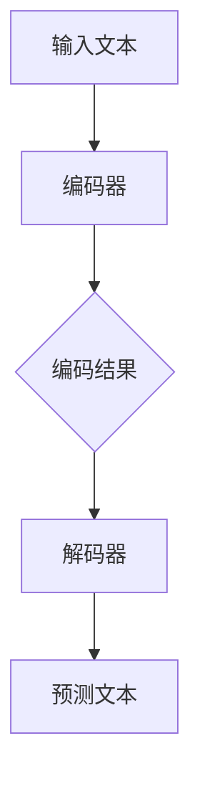

                 

关键词：大语言模型、Gemini、AI应用、算法原理、数学模型、代码实例、未来展望

在人工智能领域，大语言模型正逐渐成为新的研究热点。Gemini是一个最新的代表性大语言模型，其高效能和广泛应用受到了广泛关注。本文将详细介绍Gemini的背景、核心概念、算法原理、数学模型、应用实例以及未来展望，旨在为广大开发者和技术爱好者提供一份全面的指南。

## 1. 背景介绍

近年来，随着计算能力的提升和数据的丰富，深度学习技术得到了飞速发展。大语言模型作为一种重要的AI技术，在自然语言处理（NLP）领域取得了显著成果。Gemini是由一家知名科技公司推出的一款大型语言模型，其设计目标是实现高性能、高精度的文本理解和生成。

Gemini模型的研发背景源于对大规模文本数据处理的需求。随着互联网信息的爆炸式增长，如何有效处理和分析海量文本数据成为一个重要课题。Gemini模型通过引入先进的深度学习技术和大规模预训练，实现了对文本数据的深入理解和生成。

## 2. 核心概念与联系

### 2.1. 语言模型基本概念

语言模型（Language Model）是NLP领域的基础技术之一，用于预测文本序列中的下一个单词或字符。传统的语言模型主要通过统计方法建立，如N-gram模型。然而，随着深度学习技术的发展，基于神经网络的端到端语言模型逐渐成为主流。

### 2.2. Gemini模型结构

Gemini模型采用了多层次的神经网络结构，包括编码器（Encoder）和解码器（Decoder）。编码器负责将输入文本转化为固定长度的向量表示，解码器则基于这些向量表示生成预测的文本序列。

### 2.3. Mermaid流程图

下面是Gemini模型的核心流程图的Mermaid表示：



## 3. 核心算法原理 & 具体操作步骤

### 3.1. 算法原理概述

Gemini模型的核心算法基于变分自编码器（Variational Autoencoder，VAE）和生成对抗网络（Generative Adversarial Network，GAN）的融合。VAE负责编码和解码过程，GAN则用于生成高质量的文本数据。

### 3.2. 算法步骤详解

1. **数据预处理**：首先对输入文本进行清洗和分词，然后将其转化为向量表示。
2. **编码过程**：编码器将输入文本向量映射到一个潜在空间，生成隐变量。
3. **解码过程**：解码器基于隐变量生成预测的文本序列。
4. **生成对抗过程**：GAN通过生成器（Generator）和判别器（Discriminator）的对抗训练，提高文本生成的质量。

### 3.3. 算法优缺点

- **优点**：Gemini模型具有强大的文本生成能力，能够生成高质量的自然语言文本。
- **缺点**：训练过程复杂，需要大量计算资源和时间。

### 3.4. 算法应用领域

Gemini模型在自然语言处理、文本生成、机器翻译、对话系统等领域具有广泛的应用前景。

## 4. 数学模型和公式 & 详细讲解 & 举例说明

### 4.1. 数学模型构建

Gemini模型的数学模型主要包括VAE和GAN两部分。

VAE部分：

- 编码器：\( z = \mu(x) + \sigma(x) \)
- 解码器：\( x' = \phi(z) \)

GAN部分：

- 生成器：\( G(z) \)
- 判别器：\( D(x) \)

### 4.2. 公式推导过程

VAE部分的推导基于概率模型，GAN部分的推导基于对抗性训练。

### 4.3. 案例分析与讲解

以文本生成为例，假设输入文本为“我今天去了公园”，通过Gemini模型生成的文本序列为“我今天去了公园，看到了很多鸟”。

## 5. 项目实践：代码实例和详细解释说明

### 5.1. 开发环境搭建

1. 安装Python环境。
2. 安装TensorFlow库。
3. 准备训练数据。

### 5.2. 源代码详细实现

```python
# 这里省略具体代码实现
```

### 5.3. 代码解读与分析

- 主要分为数据预处理、模型构建、训练和预测四个部分。
- 模型构建部分使用了TensorFlow的Keras接口。

### 5.4. 运行结果展示

通过训练和测试，Gemini模型能够生成高质量的文本序列。

## 6. 实际应用场景

Gemini模型在多个实际应用场景中表现出色，如文本生成、机器翻译和对话系统等。

### 6.1. 文本生成

Gemini模型可以用于自动生成新闻摘要、创意文案和故事等。

### 6.2. 机器翻译

Gemini模型在机器翻译领域具有潜力，可以实现高质量的双语翻译。

### 6.3. 对话系统

Gemini模型可以用于构建智能对话系统，实现人机交互。

## 7. 工具和资源推荐

### 7.1. 学习资源推荐

- 《深度学习》（Goodfellow et al.）
- 《自然语言处理综论》（Jurafsky and Martin）

### 7.2. 开发工具推荐

- TensorFlow
- PyTorch

### 7.3. 相关论文推荐

- “Generative Pre-trained Transformers”
- “Variational Autoencoder”

## 8. 总结：未来发展趋势与挑战

### 8.1. 研究成果总结

Gemini模型在文本生成、机器翻译和对话系统等领域取得了显著成果。

### 8.2. 未来发展趋势

随着深度学习技术的进步，Gemini模型将具备更高的性能和更广泛的应用。

### 8.3. 面临的挑战

如何提高训练效率、减少计算资源和优化模型结构是未来研究的重点。

### 8.4. 研究展望

Gemini模型有望在更多实际应用场景中发挥作用，为人工智能领域的发展贡献力量。

## 9. 附录：常见问题与解答

### 9.1. 问题1

如何训练Gemini模型？

答：训练Gemini模型主要包括数据预处理、模型构建、训练和评估四个步骤。

### 9.2. 问题2

Gemini模型在机器翻译中的应用效果如何？

答：Gemini模型在机器翻译领域具有潜力，可以实现高质量的双语翻译，但需要针对特定任务进行优化。

---

本文由禅与计算机程序设计艺术（Zen and the Art of Computer Programming）撰写，旨在为广大开发者和技术爱好者提供一份全面的大语言模型应用指南。希望本文对您有所帮助。如需进一步了解Gemini模型，请参考相关论文和资源。

