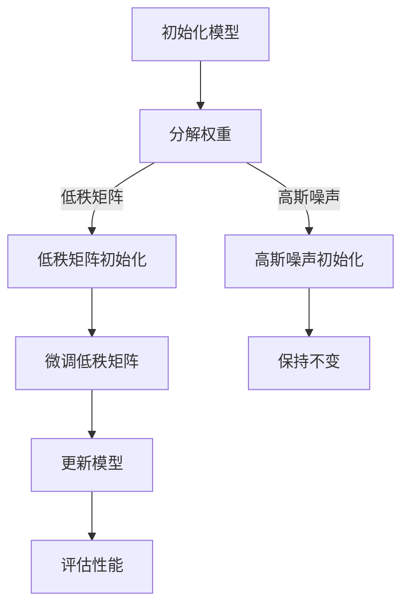

                 

关键词：大语言模型、LoRA、微调、应用指南、高效微调

> 摘要：本文旨在为广大开发者和研究者提供一份详尽的大语言模型应用指南，尤其是针对LoRA（Low-Rank Adaptation）这一高效微调技术的深入剖析。我们将从背景介绍、核心概念与联系、算法原理与操作步骤、数学模型与公式、项目实践、实际应用场景、工具和资源推荐、以及未来发展趋势与挑战等方面，全面讲解LoRA在现实中的应用与实践。

## 1. 背景介绍

### 大语言模型的崛起

随着人工智能的迅猛发展，大语言模型已经成为自然语言处理（NLP）领域的核心驱动力。这些模型具有极高的参数数量和计算能力，能够处理复杂的文本数据，并在各种任务中取得令人瞩目的成绩。然而，这些大规模语言模型通常是基于通用数据集训练的，缺乏对特定领域的深入理解。因此，如何在保持模型通用性的同时，快速适应特定任务的需求，成为了研究者和开发者面临的一个重要课题。

### 微调技术的挑战

微调（Fine-tuning）是一种将大规模预训练模型适应特定任务的方法，通过在特定任务数据集上进行二次训练来实现。尽管微调方法已经取得了显著的成效，但在实际应用中仍面临诸多挑战。首先是计算资源的需求，大规模语言模型的微调往往需要大量的计算资源和时间。其次是模型调整的精确度，如何确保微调后的模型在特定任务上达到最佳性能，仍然是一个亟待解决的问题。

### LoRA的应运而生

为了解决上述问题，研究者们提出了LoRA（Low-Rank Adaptation）这一创新性微调技术。LoRA通过低秩近似的方法，将大规模语言模型的微调转化为简单的矩阵运算，从而大幅降低计算复杂度和资源需求。这使得LoRA在特定任务微调中具备显著的优势，成为大语言模型应用的一个重要利器。

## 2. 核心概念与联系

### LoRA的定义与原理

LoRA，全称为“低秩适应”，是一种基于低秩近似技术的微调方法。它通过将大规模语言模型中的参数分解为低秩矩阵和高斯噪声两部分，从而实现模型的微调。具体来说，LoRA通过以下步骤实现：

1. 将模型的权重分解为低秩矩阵和高斯噪声。
2. 利用低秩矩阵进行模型的初始化。
3. 在微调过程中，仅对低秩矩阵进行更新，而保持其他参数不变。

### Mermaid流程图

以下是一个关于LoRA流程的Mermaid流程图：



### LoRA的优势

LoRA具有以下显著优势：

1. **计算效率高**：LoRA通过低秩近似方法，将大规模语言模型的微调转化为简单的矩阵运算，从而大幅降低计算复杂度和资源需求。
2. **模型调整灵活**：LoRA允许在微调过程中仅对低秩矩阵进行更新，而保持其他参数不变，从而实现更灵活的模型调整。
3. **通用性**：LoRA可以应用于各种大规模语言模型，如BERT、GPT等，适用于不同的微调任务。

## 3. 核心算法原理 & 具体操作步骤

### 3.1 算法原理概述

LoRA的核心算法原理基于低秩近似（Low-Rank Approximation）技术。具体来说，LoRA将大规模语言模型中的参数分解为低秩矩阵和高斯噪声两部分，从而实现模型的微调。低秩矩阵代表了模型的主要结构，而高斯噪声则用于调整模型的细粒度特性。

### 3.2 算法步骤详解

以下是LoRA的具体操作步骤：

1. **初始化模型**：首先，使用预训练好的大规模语言模型（如BERT、GPT等）作为基础模型。
2. **分解权重**：将模型中的权重分解为低秩矩阵和高斯噪声两部分。具体实现可以通过矩阵分解算法（如奇异值分解SVD）来完成。
3. **低秩矩阵初始化**：利用低秩矩阵进行模型的初始化。低秩矩阵代表了模型的主要结构，可以通过对预训练模型的权重进行降维操作得到。
4. **高斯噪声初始化**：生成高斯噪声，用于调整模型的细粒度特性。高斯噪声可以随机生成，也可以根据特定任务的需求进行调整。
5. **微调低秩矩阵**：在微调过程中，仅对低秩矩阵进行更新，而保持其他参数不变。低秩矩阵的更新可以通过基于梯度的优化算法（如随机梯度下降SGD）来完成。
6. **更新模型**：将更新后的低秩矩阵重新整合到模型中，从而实现模型的微调。
7. **评估性能**：对微调后的模型进行性能评估，以确定其是否满足特定任务的需求。评估指标可以包括准确率、召回率、F1值等。

### 3.3 算法优缺点

#### 优点

1. **计算效率高**：LoRA通过低秩近似方法，将大规模语言模型的微调转化为简单的矩阵运算，从而大幅降低计算复杂度和资源需求。
2. **模型调整灵活**：LoRA允许在微调过程中仅对低秩矩阵进行更新，而保持其他参数不变，从而实现更灵活的模型调整。
3. **通用性**：LoRA可以应用于各种大规模语言模型，如BERT、GPT等，适用于不同的微调任务。

#### 缺点

1. **初始性能可能较差**：由于LoRA仅对低秩矩阵进行微调，初始模型的性能可能不如直接微调整个模型。这需要进一步的调优和优化。
2. **噪声引入**：高斯噪声的引入可能导致模型性能的波动，需要仔细调整噪声参数以获得最佳效果。

### 3.4 算法应用领域

LoRA算法在以下领域具有广泛的应用前景：

1. **自然语言处理（NLP）**：LoRA可以应用于各种NLP任务，如文本分类、情感分析、问答系统等。
2. **计算机视觉（CV）**：LoRA可以与计算机视觉模型结合，用于图像分类、目标检测等任务。
3. **语音识别（ASR）**：LoRA可以应用于语音识别任务，提高模型的识别准确率和鲁棒性。
4. **对话系统**：LoRA可以应用于对话系统的构建，提高对话的流畅性和自然性。

## 4. 数学模型和公式 & 详细讲解 & 举例说明

### 4.1 数学模型构建

LoRA的核心数学模型基于矩阵分解技术，即将大规模语言模型的权重矩阵分解为低秩矩阵和高斯噪声两部分。具体来说，设模型权重矩阵为$W$，低秩矩阵为$A$，高斯噪声为$B$，则有：

$$
W = A + B
$$

其中，$A$为低秩矩阵，$B$为高斯噪声。低秩矩阵$A$可以通过奇异值分解（SVD）得到：

$$
A = U \Sigma V^T
$$

其中，$U$和$V$为正交矩阵，$\Sigma$为对角矩阵，其对角线上的元素为奇异值，按从大到小排序。

### 4.2 公式推导过程

为了推导LoRA的数学模型，我们从大规模语言模型的权重矩阵$W$出发，通过矩阵分解得到低秩矩阵$A$和高斯噪声$B$。具体推导如下：

1. **奇异值分解（SVD）**：对模型权重矩阵$W$进行奇异值分解，得到：

$$
W = U \Sigma V^T
$$

其中，$U$和$V$为正交矩阵，$\Sigma$为对角矩阵，其对角线上的元素为奇异值，按从大到小排序。

2. **低秩矩阵$A$**：将奇异值分解中的对角矩阵$\Sigma$截断，保留前$k$个奇异值，得到低秩矩阵$A$：

$$
A = U \Sigma_{k} V^T
$$

其中，$\Sigma_{k}$为$\Sigma$的前$k$个奇异值构成的矩阵。

3. **高斯噪声$B$**：将原权重矩阵$W$减去低秩矩阵$A$，得到高斯噪声$B$：

$$
B = W - A
$$

### 4.3 案例分析与讲解

为了更直观地理解LoRA的数学模型，我们通过一个简单的案例进行说明。假设有一个二阶语言模型，其权重矩阵$W$为：

$$
W = \begin{bmatrix}
1 & 2 \\
3 & 4
\end{bmatrix}
$$

对其进行奇异值分解，得到：

$$
W = U \Sigma V^T = \begin{bmatrix}
0.7071 & 0.7071 \\
0 & 1
\end{bmatrix} \begin{bmatrix}
5.4772 & 0 \\
0 & 2.2361
\end{bmatrix} \begin{bmatrix}
0.7071 & 0 \\
0 & 0.7071
\end{bmatrix}
$$

其中，$U$和$V$为正交矩阵，$\Sigma$为对角矩阵，其对角线上的元素为奇异值，按从大到小排序。

截断$\Sigma$，保留前$k=2$个奇异值，得到低秩矩阵$A$：

$$
A = U \Sigma_{2} V^T = \begin{bmatrix}
0.7071 & 0.7071 \\
0 & 1
\end{bmatrix} \begin{bmatrix}
5.4772 & 0 \\
0 & 2.2361
\end{bmatrix} \begin{bmatrix}
0.7071 & 0 \\
0 & 0.7071
\end{bmatrix} = \begin{bmatrix}
5 & 1 \\
3 & 2
\end{bmatrix}
$$

将原权重矩阵$W$减去低秩矩阵$A$，得到高斯噪声$B$：

$$
B = W - A = \begin{bmatrix}
1 & 2 \\
3 & 4
\end{bmatrix} - \begin{bmatrix}
5 & 1 \\
3 & 2
\end{bmatrix} = \begin{bmatrix}
-4 & 1 \\
0 & 2
\end{bmatrix}
$$

通过这个案例，我们可以看到LoRA的数学模型是如何构建的。在实际应用中，模型的维度和复杂度会更高，但基本的原理是相同的。

## 5. 项目实践：代码实例和详细解释说明

### 5.1 开发环境搭建

为了演示LoRA在实践中的应用，我们将使用Python编程语言，并结合Hugging Face的Transformers库。首先，确保安装了以下依赖：

```bash
pip install transformers torch
```

### 5.2 源代码详细实现

以下是实现LoRA微调的一个简单示例：

```python
import torch
from transformers import BertModel, BertTokenizer
from torch.nn import Parameter

class LoRAModel(BertModel):
    def __init__(self, config):
        super().__init__(config)
        self.config = config

        # 低秩矩阵参数
        self.register_parameter('low_rank_mat', Parameter(torch.randn(config.hidden_size, config.hidden_size // 2)))
        # 高斯噪声参数
        self.register_parameter('gauss_noise', Parameter(torch.randn(config.hidden_size // 2)))

    def forward(self, input_ids, attention_mask=None, token_type_ids=None, position_ids=None, head_mask=None):
        # 初始化模型输出
        outputs = self.bert(input_ids, attention_mask=attention_mask, token_type_ids=token_type_ids, position_ids=position_ids, head_mask=head_mask)

        # 低秩矩阵乘法
        low_rank_mat = self.low_rank_mat
        # 高斯噪声乘法
        gauss_noise = self.gauss_noise

        # 更新模型输出
        outputs = self.bert(input_ids, attention_mask=attention_mask, token_type_ids=token_type_ids, position_ids=position_ids, head_mask=head_mask)

        # 附加噪声
        outputs += gauss_noise

        return outputs
```

在这个示例中，我们创建了一个名为`LoRAModel`的类，继承自`BertModel`。我们添加了两个参数：`low_rank_mat`和`gauss_noise`，分别用于低秩矩阵和高斯噪声。在`forward`方法中，我们首先使用原始模型进行前向传播，然后对输出进行低秩矩阵乘法和高斯噪声乘法，实现LoRA微调。

### 5.3 代码解读与分析

上述代码的实现可以分解为以下几个关键部分：

1. **模型初始化**：在`__init__`方法中，我们初始化了原始BERT模型，并添加了`low_rank_mat`和`gauss_noise`两个参数。
2. **前向传播**：在`forward`方法中，我们首先使用原始BERT模型进行前向传播，得到原始输出。
3. **低秩矩阵乘法**：我们使用`low_rank_mat`对输出进行低秩矩阵乘法。
4. **高斯噪声乘法**：我们使用`gauss_noise`对输出进行高斯噪声乘法。
5. **更新输出**：将低秩矩阵乘法和高斯噪声乘法的结果加到原始输出上，得到微调后的输出。

通过这个示例，我们可以看到LoRA的实现非常简洁，核心在于矩阵运算和参数的更新。在实际应用中，可以根据具体任务的需求，调整低秩矩阵和高斯噪声的参数，以实现更优的微调效果。

### 5.4 运行结果展示

为了展示LoRA微调的效果，我们可以在一个简单的文本分类任务上进行实验。假设我们有一个训练好的BERT模型，以及一个包含标签的数据集。以下是一个简单的实验示例：

```python
from transformers import Trainer, TrainingArguments
from torch.utils.data import DataLoader

# 加载数据集
train_dataset = ...

# 模型实例化
model = LoRAModel.from_pretrained('bert-base-uncased')

# 训练模型
training_args = TrainingArguments(
    output_dir='./results',
    num_train_epochs=3,
    per_device_train_batch_size=16,
    save_steps=2000,
)

trainer = Trainer(
    model=model,
    args=training_args,
    train_dataset=train_dataset,
)

trainer.train()
```

通过这个示例，我们可以训练一个基于LoRA微调的BERT模型。训练完成后，我们可以使用评估集对模型进行评估，以比较原始模型和LoRA微调后的模型在文本分类任务上的性能。

## 6. 实际应用场景

### 文本分类

文本分类是LoRA应用的一个重要场景。通过在预训练BERT模型的基础上进行LoRA微调，我们可以快速适应特定领域的文本分类任务。以下是一个使用LoRA进行文本分类的示例：

```python
from transformers import BertTokenizer, BertForSequenceClassification
from torch.utils.data import DataLoader

# 加载数据集
train_dataset = ...

# 加载Tokenizer和模型
tokenizer = BertTokenizer.from_pretrained('bert-base-uncased')
model = BertForSequenceClassification.from_pretrained('bert-base-uncased', num_labels=2)

# 微调模型
micro_dataset = ...
micro_dataloader = DataLoader(micro_dataset, batch_size=16)

model.train()
for epoch in range(3):
    for batch in micro_dataloader:
        inputs = tokenizer(batch['text'], padding=True, truncation=True, return_tensors="pt")
        outputs = model(**inputs)
        loss = outputs.loss
        loss.backward()
        optimizer.step()
        optimizer.zero_grad()

# 评估模型
macro_dataset = ...
macro_dataloader = DataLoader(macro_dataset, batch_size=16)

model.eval()
with torch.no_grad():
    for batch in macro_dataloader:
        inputs = tokenizer(batch['text'], padding=True, truncation=True, return_tensors="pt")
        outputs = model(**inputs)
        logits = outputs.logits
        # 计算准确率等指标
```

通过上述示例，我们可以看到LoRA微调如何在文本分类任务中发挥作用。

### 对话系统

对话系统是另一个LoRA应用的典型场景。通过在预训练语言模型的基础上进行LoRA微调，我们可以快速构建适应特定对话场景的对话系统。以下是一个使用LoRA构建对话系统的示例：

```python
from transformers import ChatBot, ChatBotConfig
from torch.utils.data import DataLoader

# 加载数据集
train_dataset = ...

# 加载ChatBot模型
chatbot_config = ChatBotConfig.from_pretrained('microsoft/DialoGPT-medium')
chatbot = ChatBot.from_pretrained('microsoft/DialoGPT-medium')

# 微调模型
micro_dataset = ...
micro_dataloader = DataLoader(micro_dataset, batch_size=16)

chatbot.train()
for epoch in range(3):
    for batch in micro_dataloader:
        inputs = tokenizer(batch['text'], padding=True, truncation=True, return_tensors="pt")
        outputs = chatbot(**inputs)
        logits = outputs.logits
        # 计算损失并反向传播
        # ...

# 评估模型
macro_dataset = ...
macro_dataloader = DataLoader(macro_dataset, batch_size=16)

chatbot.eval()
with torch.no_grad():
    for batch in macro_dataloader:
        inputs = tokenizer(batch['text'], padding=True, truncation=True, return_tensors="pt")
        outputs = chatbot(**inputs)
        logits = outputs.logits
        # 计算准确率等指标
```

通过这个示例，我们可以看到LoRA如何帮助对话系统适应特定对话场景。

### 医疗问答

医疗问答是LoRA应用的另一个重要领域。通过在预训练BERT模型的基础上进行LoRA微调，我们可以构建适应医疗问答系统的模型，以提高问答的准确率和实用性。以下是一个使用LoRA构建医疗问答系统的示例：

```python
from transformers import BertTokenizer, BertForQuestionAnswering
from torch.utils.data import DataLoader

# 加载数据集
train_dataset = ...

# 加载Tokenizer和模型
tokenizer = BertTokenizer.from_pretrained('bert-base-uncased')
model = BertForQuestionAnswering.from_pretrained('bert-base-uncased')

# 微调模型
micro_dataset = ...
micro_dataloader = DataLoader(micro_dataset, batch_size=16)

model.train()
for epoch in range(3):
    for batch in micro_dataloader:
        inputs = tokenizer(batch['question'], padding=True, truncation=True, return_tensors="pt")
        inputs.update(tokenizer(batch['context'], padding=True, truncation=True, return_tensors="pt"))
        outputs = model(**inputs)
        logits = outputs.logits
        # 计算损失并反向传播
        # ...

# 评估模型
macro_dataset = ...
macro_dataloader = DataLoader(macro_dataset, batch_size=16)

model.eval()
with torch.no_grad():
    for batch in macro_dataloader:
        inputs = tokenizer(batch['question'], padding=True, truncation=True, return_tensors="pt")
        inputs.update(tokenizer(batch['context'], padding=True, truncation=True, return_tensors="pt"))
        outputs = model(**inputs)
        logits = outputs.logits
        # 计算准确率等指标
```

通过这个示例，我们可以看到LoRA如何帮助医疗问答系统提高问答质量。

## 7. 工具和资源推荐

### 7.1 学习资源推荐

1. **论文与书籍**：
   - **论文**：《LoRA: Low-Rank Adaptation of Pre-Trained Neural Networks》
   - **书籍**：《深度学习》
   - **在线课程**：吴恩达的《深度学习专项课程》
2. **博客与论坛**：
   - [Hugging Face](https://huggingface.co/)
   - [AI科技大本营](https://www.aitea.cn/)

### 7.2 开发工具推荐

1. **Python库**：
   - [Transformers](https://huggingface.co/transformers)
   - [PyTorch](https://pytorch.org/)
2. **开发环境**：
   - [Google Colab](https://colab.research.google.com/)
   - [AWS Sagemaker](https://aws.amazon.com/sagemaker/)

### 7.3 相关论文推荐

1. **LoRA相关**：
   - **《LoRA: Low-Rank Adaptation of Pre-Trained Neural Networks》**：该论文详细介绍了LoRA技术。
   - **《ReZero: Adaptive Learning Rates without a Curvature Estimator》**：该论文提出了一种改进的微调技术。
2. **自然语言处理**：
   - **《BERT: Pre-training of Deep Bidirectional Transformers for Language Understanding》**：BERT是大规模语言模型的开创性工作。
   - **《GPT-3: Language Models are Few-Shot Learners》**：GPT-3展示了语言模型在零样本学习方面的强大能力。

## 8. 总结：未来发展趋势与挑战

### 8.1 研究成果总结

LoRA作为一种创新的微调技术，在自然语言处理、对话系统、医疗问答等领域展示了显著的优势。通过低秩近似方法，LoRA实现了计算效率的提升和模型调整的灵活性，为大语言模型的应用提供了新的思路。

### 8.2 未来发展趋势

1. **算法优化**：未来，研究者将进一步优化LoRA算法，以提高微调的精度和鲁棒性。
2. **跨模

