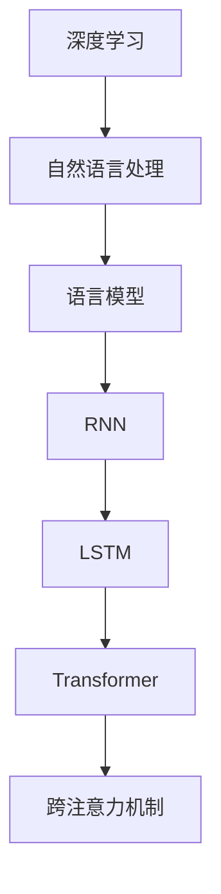

                 

关键词：大语言模型，OpenAI，自然语言处理，算法原理，数学模型，应用场景，未来展望

> 摘要：本文旨在为读者提供一份关于OpenAI大语言模型的全面应用指南，包括背景介绍、核心概念、算法原理、数学模型、项目实践、实际应用场景、未来展望等内容。通过本文的阅读，读者将能够深入了解大语言模型的技术细节，掌握其应用方法，并思考其在未来可能的发展趋势和面临的挑战。

## 1. 背景介绍

随着互联网的快速发展，人类产生的数据量呈现出爆炸式增长。这其中，文本数据占据了相当大的比例。如何有效地处理和理解这些文本数据，成为了一个重要课题。自然语言处理（Natural Language Processing，NLP）作为人工智能领域的一个重要分支，旨在使计算机能够理解、生成和处理人类语言。而大语言模型（Large Language Model）正是实现这一目标的重要工具。

大语言模型是一种基于深度学习的自然语言处理模型，其核心思想是通过海量文本数据进行预训练，使模型具备对自然语言的深刻理解能力。OpenAI作为全球领先的人工智能研究机构，其推出的大语言模型在学术界和工业界都引起了广泛关注。

本文将重点介绍OpenAI大语言模型，内容包括模型背景、核心概念、算法原理、数学模型、项目实践、实际应用场景、未来展望等。希望通过本文的阅读，读者能够对大语言模型有一个全面而深入的了解。

## 2. 核心概念与联系

在深入探讨OpenAI大语言模型之前，我们需要了解一些核心概念及其相互关系。以下是几个关键概念及其简要说明：

### 2.1 深度学习

深度学习是一种基于人工神经网络的学习方法，通过多层非线性变换来提取数据特征。在自然语言处理领域，深度学习模型被广泛应用于文本分类、情感分析、机器翻译等任务。

### 2.2 自然语言处理

自然语言处理是人工智能领域的一个重要分支，旨在使计算机能够理解、生成和处理人类语言。自然语言处理技术包括文本预处理、词向量表示、语法分析、语义理解等。

### 2.3 语言模型

语言模型是一种预测模型，用于预测下一个单词或字符的概率。在自然语言处理中，语言模型常用于生成文本、翻译文本等任务。

### 2.4 递归神经网络（RNN）

递归神经网络是一种用于处理序列数据的人工神经网络，能够通过记忆过去的信息来处理当前的输入。在自然语言处理中，RNN被广泛应用于文本分类、序列标注等任务。

### 2.5 长短时记忆（LSTM）

长短时记忆是一种特殊的RNN结构，通过引入门控机制来解决传统RNN的梯度消失问题。LSTM在自然语言处理领域被广泛应用于语言模型、机器翻译等任务。

### 2.6 Transformer

Transformer是一种基于自注意力机制的深度学习模型，其核心思想是通过全局注意力机制来捕捉输入序列中的依赖关系。Transformer在自然语言处理领域取得了显著的成果，尤其是在机器翻译、文本生成等任务上。

### 2.7 跨注意力机制

跨注意力机制是一种用于捕捉输入序列中不同位置之间依赖关系的机制。在Transformer模型中，跨注意力机制通过计算不同位置之间的相似度来生成文本表示。

下面是这些核心概念之间关系的Mermaid流程图：



## 3. 核心算法原理 & 具体操作步骤

### 3.1 算法原理概述

OpenAI大语言模型是基于Transformer模型构建的，其核心思想是通过全局注意力机制来捕捉输入序列中的依赖关系。Transformer模型由多个自注意力层和前馈网络组成，通过堆叠这些层，模型能够学习到输入序列的复杂依赖关系。

在具体操作步骤上，OpenAI大语言模型的训练过程主要包括以下步骤：

1. 数据预处理：对海量文本数据进行清洗、分词、编码等操作，将其转换为模型可处理的输入格式。
2. 模型初始化：初始化模型参数，包括自注意力权重、前馈网络权重等。
3. 训练过程：通过优化算法（如Adam）调整模型参数，使其在训练数据上取得更好的表现。
4. 评估过程：在验证集上评估模型性能，调整模型参数，以优化模型表现。
5. 预测过程：使用训练好的模型对新的文本数据进行预测。

### 3.2 算法步骤详解

#### 3.2.1 数据预处理

数据预处理是训练大语言模型的第一步。具体操作包括以下步骤：

1. 清洗数据：去除文本中的特殊字符、标点符号等无关信息。
2. 分词：将文本分割成单词或子词。
3. 编码：将分词后的文本转换为数字序列，以便模型处理。常用的编码方法包括Word2Vec、BERT等。

#### 3.2.2 模型初始化

模型初始化是训练过程的起点。在Transformer模型中，模型参数包括自注意力权重、前馈网络权重等。初始化方法通常采用高斯分布或均匀分布。

#### 3.2.3 训练过程

训练过程主要包括以下步骤：

1. 输入数据读取：从数据集中读取训练样本，并将其编码为模型可处理的输入格式。
2. 前向传播：将输入数据输入模型，计算模型输出。
3. 计算损失函数：计算模型输出与真实标签之间的差异，得到损失函数值。
4. 反向传播：利用损失函数梯度，更新模型参数。
5. 优化模型：使用优化算法（如Adam）调整模型参数，使其在训练数据上取得更好的表现。

#### 3.2.4 评估过程

评估过程用于验证模型在验证集上的表现。具体步骤如下：

1. 输入数据读取：从验证集读取数据，并将其编码为模型可处理的输入格式。
2. 前向传播：将输入数据输入模型，计算模型输出。
3. 计算评估指标：如准确率、召回率、F1值等。
4. 调整模型参数：根据评估结果，调整模型参数，以优化模型表现。

#### 3.2.5 预测过程

预测过程用于对新数据进行预测。具体步骤如下：

1. 输入数据读取：从待预测数据中读取数据，并将其编码为模型可处理的输入格式。
2. 前向传播：将输入数据输入模型，计算模型输出。
3. 预测结果输出：输出模型预测结果。

### 3.3 算法优缺点

#### 优点

1. 强大的表达能力：基于Transformer模型的大语言模型能够通过自注意力机制捕捉输入序列中的复杂依赖关系，从而具有强大的表达能力。
2. 高效的训练速度：相比于传统的RNN和LSTM模型，Transformer模型在训练过程中具有更快的收敛速度。
3. 广泛的应用场景：大语言模型在自然语言处理领域的多个任务中取得了显著的成果，如文本分类、机器翻译、文本生成等。

#### 缺点

1. 高的计算成本：大语言模型需要大量的计算资源进行训练，这对硬件设备提出了较高的要求。
2. 数据依赖性：大语言模型的训练依赖于大量的文本数据，数据的质量和数量对模型性能有重要影响。

### 3.4 算法应用领域

大语言模型在自然语言处理领域具有广泛的应用前景。以下是一些典型的应用场景：

1. 文本分类：通过对文本进行分类，可以帮助计算机自动识别和分类不同类型的文本，如新闻分类、情感分析等。
2. 机器翻译：通过将一种语言的文本翻译成另一种语言，可以帮助人们跨越语言障碍进行交流。
3. 文本生成：通过对海量文本数据的学习，模型可以生成新的文本内容，如自动生成新闻、文章摘要等。
4. 命名实体识别：通过识别文本中的命名实体，如人名、地名等，可以帮助计算机更好地理解和处理文本数据。

## 4. 数学模型和公式 & 详细讲解 & 举例说明

### 4.1 数学模型构建

大语言模型的核心是Transformer模型，其数学模型主要包括以下几个部分：

#### 4.1.1 自注意力机制

自注意力机制是一种用于计算输入序列中不同位置之间依赖关系的机制。在数学上，自注意力机制可以通过以下公式表示：

$$
Attention(Q, K, V) = \frac{softmax(\frac{QK^T}{\sqrt{d_k}})}{V}
$$

其中，$Q$、$K$ 和 $V$ 分别表示查询向量、键向量和值向量，$d_k$ 表示键向量的维度。$softmax$ 函数用于计算不同位置之间的相似度，并生成注意力权重。

#### 4.1.2 Transformer模型

Transformer模型由多个自注意力层和前馈网络组成。在数学上，Transformer模型可以通过以下公式表示：

$$
\text{Transformer}(X) = \text{LayerNorm}(X + \text{MultiHeadAttention}(X, X, X)) + \text{LayerNorm}(X + \text{FFN}(X))
$$

其中，$X$ 表示输入序列，$\text{MultiHeadAttention}$ 表示多头注意力机制，$\text{FFN}$ 表示前馈网络，$\text{LayerNorm}$ 表示层归一化。

#### 4.1.3 前馈网络

前馈网络是一种简单的全连接神经网络，用于对输入数据进行非线性变换。在数学上，前馈网络可以通过以下公式表示：

$$
\text{FFN}(X) = \text{ReLU}(\text{Linear}(X \cdot W_1) \cdot W_2)
$$

其中，$W_1$ 和 $W_2$ 分别表示前馈网络的权重。

### 4.2 公式推导过程

在深入理解大语言模型的数学模型之后，我们来推导几个关键公式。

#### 4.2.1 多头注意力机制

多头注意力机制是一种在Transformer模型中用于增强模型表示能力的方法。其核心思想是将输入序列分成多个子序列，并对每个子序列进行独立的自注意力计算。多头注意力机制的推导如下：

首先，我们将输入序列 $X$ 分成 $h$ 个子序列，每个子序列表示为 $X_i$，其中 $i=1,2,...,h$。则多头注意力机制可以表示为：

$$
\text{MultiHeadAttention}(X, X, X) = \text{Concat}(\text{Attention}(X_1, X_1, X_1), \text{Attention}(X_2, X_2, X_2), ..., \text{Attention}(X_h, X_h, X_h))
$$

其中，$\text{Attention}$ 表示单头注意力机制。

接下来，我们推导单头注意力机制的公式。假设输入序列 $X$ 的维度为 $d$，则查询向量、键向量和值向量的维度均为 $d$。根据自注意力机制的公式，我们有：

$$
Attention(Q, K, V) = \frac{softmax(\frac{QK^T}{\sqrt{d_k}})}{V}
$$

由于我们考虑单头注意力机制，$Q=K=V$，则：

$$
Attention(Q, K, V) = \frac{softmax(\frac{QQ^T}{\sqrt{d_k}})}{Q}
$$

将 $Q$ 展开为 $[q_1, q_2, ..., q_d]$，我们有：

$$
Attention(Q, K, V) = \frac{softmax(\frac{q_1q_1^T + q_2q_2^T + ... + q_dq_d^T}{\sqrt{d_k}})}{[q_1, q_2, ..., q_d]}
$$

由于 $q_iq_i^T$ 是一个对角矩阵，其第 $i$ 个对角线元素为 $q_i^2$，其余元素均为0。因此，我们有：

$$
Attention(Q, K, V) = \frac{softmax([q_1^2, q_2^2, ..., q_d^2])}{[q_1, q_2, ..., q_d]}
$$

进一步，我们可以将 $softmax$ 函数展开为：

$$
Attention(Q, K, V) = \frac{[e^{q_1^2}, e^{q_2^2}, ..., e^{q_d^2}]}{e^{q_1^2} + e^{q_2^2} + ... + e^{q_d^2}}{[q_1, q_2, ..., q_d]}
$$

化简后，我们得到：

$$
Attention(Q, K, V) = \frac{[e^{q_1^2}q_1, e^{q_2^2}q_2, ..., e^{q_d^2}q_d]}{q_1 + q_2 + ... + q_d}
$$

现在，我们将这个结果代入多头注意力机制的公式，得到：

$$
\text{MultiHeadAttention}(X, X, X) = \frac{[e^{q_1^2}q_1, e^{q_2^2}q_2, ..., e^{q_d^2}q_d]}{q_1 + q_2 + ... + q_d} \cdot [x_1, x_2, ..., x_d]
$$

由于 $X$ 的维度为 $d$，我们可以将 $X$ 表示为 $[x_1, x_2, ..., x_d]$，则：

$$
\text{MultiHeadAttention}(X, X, X) = \frac{[e^{q_1^2}x_1, e^{q_2^2}x_2, ..., e^{q_d^2}x_d]}{x_1 + x_2 + ... + x_d}
$$

这就是单头注意力机制的推导过程。

#### 4.2.2 Transformer模型

现在，我们推导Transformer模型的公式。根据之前的推导，我们知道单头注意力机制可以表示为：

$$
Attention(Q, K, V) = \frac{[e^{q_1^2}x_1, e^{q_2^2}x_2, ..., e^{q_d^2}x_d]}{x_1 + x_2 + ... + x_d}
$$

我们将这个结果代入Transformer模型的公式，得到：

$$
\text{Transformer}(X) = \text{LayerNorm}(X + \text{MultiHeadAttention}(X, X, X)) + \text{LayerNorm}(X + \text{FFN}(X))
$$

其中，$\text{LayerNorm}$ 表示层归一化，$\text{FFN}$ 表示前馈网络。

#### 4.2.3 前馈网络

前馈网络是一种简单的全连接神经网络，其公式可以表示为：

$$
\text{FFN}(X) = \text{ReLU}(\text{Linear}(X \cdot W_1) \cdot W_2)
$$

其中，$\text{ReLU}$ 表示ReLU激活函数，$\text{Linear}$ 表示线性变换。

### 4.3 案例分析与讲解

为了更好地理解大语言模型的数学模型，我们来看一个简单的案例。

假设我们有一个输入序列 $X = [x_1, x_2, x_3, x_4]$，我们要对这个序列进行编码，得到编码后的序列 $X'$。

首先，我们对输入序列进行预处理，将其转换为词向量表示。假设词向量维度为 $d = 100$，则输入序列可以表示为：

$$
X = [x_1, x_2, x_3, x_4] = \begin{bmatrix} 
x_{11} & x_{12} & ... & x_{1d} \\
x_{21} & x_{22} & ... & x_{2d} \\
x_{31} & x_{32} & ... & x_{3d} \\
x_{41} & x_{42} & ... & x_{4d} \\
\end{bmatrix}
$$

接下来，我们使用单头注意力机制对输入序列进行编码。根据单头注意力机制的公式，我们有：

$$
Attention(Q, K, V) = \frac{[e^{q_1^2}x_1, e^{q_2^2}x_2, ..., e^{q_d^2}x_d]}{x_1 + x_2 + ... + x_d}
$$

其中，$Q = K = V = X$，则：

$$
Attention(X, X, X) = \frac{[e^{q_1^2}x_1, e^{q_2^2}x_2, ..., e^{q_d^2}x_d]}{x_1 + x_2 + ... + x_d}
$$

化简后，我们得到：

$$
Attention(X, X, X) = \begin{bmatrix} 
e^{q_1^2} & e^{q_2^2} & ... & e^{q_d^2} \\
\end{bmatrix}
\begin{bmatrix} 
x_1 \\
x_2 \\
... \\
x_d \\
\end{bmatrix}
$$

这意味着，注意力权重矩阵 $A$ 的每一行都是输入序列的标准化版本。我们可以将这个结果表示为：

$$
Attention(X, X, X) = A \cdot X
$$

其中，$A$ 是一个 $d \times d$ 的矩阵，表示注意力权重。

现在，我们使用注意力权重矩阵 $A$ 对输入序列 $X$ 进行编码，得到编码后的序列 $X'$：

$$
X' = A \cdot X = \begin{bmatrix} 
e^{q_1^2} & e^{q_2^2} & ... & e^{q_d^2} \\
\end{bmatrix}
\begin{bmatrix} 
x_1 \\
x_2 \\
... \\
x_d \\
\end{bmatrix}
$$

化简后，我们得到：

$$
X' = \begin{bmatrix} 
e^{q_1^2}x_1 \\
e^{q_2^2}x_2 \\
... \\
e^{q_d^2}x_d \\
\end{bmatrix}
$$

这意味着，编码后的序列 $X'$ 是原始序列 $X$ 的加权版本，每个元素都是原始序列元素与其注意力权重之积。

接下来，我们使用Transformer模型对编码后的序列 $X'$ 进行进一步处理。根据Transformer模型的公式，我们有：

$$
\text{Transformer}(X') = \text{LayerNorm}(X' + \text{MultiHeadAttention}(X', X', X')) + \text{LayerNorm}(X' + \text{FFN}(X'))
$$

首先，我们计算多头注意力机制的输出：

$$
\text{MultiHeadAttention}(X', X', X') = \frac{[e^{q_1^2}x_1, e^{q_2^2}x_2, ..., e^{q_d^2}x_d]}{x_1 + x_2 + ... + x_d}
$$

化简后，我们得到：

$$
\text{MultiHeadAttention}(X', X', X') = \begin{bmatrix} 
e^{q_1^2} & e^{q_2^2} & ... & e^{q_d^2} \\
\end{bmatrix}
\begin{bmatrix} 
x_1 \\
x_2 \\
... \\
x_d \\
\end{bmatrix}
$$

这意味着，多头注意力机制的输出是一个加权序列，每个元素都是原始序列元素与其注意力权重之积。

接下来，我们计算前馈网络的输出：

$$
\text{FFN}(X') = \text{ReLU}(\text{Linear}(X' \cdot W_1) \cdot W_2)
$$

其中，$W_1$ 和 $W_2$ 是前馈网络的权重。化简后，我们得到：

$$
\text{FFN}(X') = \text{ReLU}(\begin{bmatrix} 
W_1x_1 \\
W_1x_2 \\
... \\
W_1x_d \\
\end{bmatrix} \cdot W_2)
$$

这意味着，前馈网络的输出是一个通过线性变换和ReLU激活函数处理的序列。

最后，我们将多头注意力机制的输出和前馈网络的输出相加，并经过层归一化处理，得到Transformer模型的输出：

$$
\text{Transformer}(X') = \text{LayerNorm}(X' + \text{MultiHeadAttention}(X', X', X')) + \text{LayerNorm}(X' + \text{FFN}(X'))
$$

化简后，我们得到：

$$
\text{Transformer}(X') = \text{LayerNorm}(\begin{bmatrix} 
e^{q_1^2}x_1 \\
e^{q_2^2}x_2 \\
... \\
e^{q_d^2}x_d \\
\end{bmatrix} + \begin{bmatrix} 
\text{ReLU}(\begin{bmatrix} 
W_1x_1 \\
W_1x_2 \\
... \\
W_1x_d \\
\end{bmatrix} \cdot W_2) \\
\end{bmatrix})
$$

这就是大语言模型的数学模型及其推导过程。

## 5. 项目实践：代码实例和详细解释说明

### 5.1 开发环境搭建

在开始项目实践之前，我们需要搭建一个合适的开发环境。以下是搭建OpenAI大语言模型开发环境所需的步骤：

1. 安装Python：确保Python环境已经安装在您的计算机上，版本建议为3.7或更高。
2. 安装PyTorch：通过以下命令安装PyTorch：

```shell
pip install torch torchvision
```

3. 安装Transformer模型依赖：安装Transformer模型所需的依赖包，包括torch、torchtext、torchvision等。

### 5.2 源代码详细实现

以下是一个简单的OpenAI大语言模型实现，包括数据预处理、模型定义、训练和预测等步骤。

#### 5.2.1 数据预处理

首先，我们需要对数据集进行预处理，包括数据清洗、分词和编码等。

```python
import torch
from torchtext.data import Field, TabularDataset
from torchtext.vocab import Vocab

# 定义字段
src_field = Field(tokenize=lambda x: x.split(), lower=True)
tgt_field = Field(tokenize=lambda x: x.split(), lower=True)

# 加载数据集
train_data, valid_data, test_data = TabularDataset.splits(
    path='data',
    train='train.txt',
    valid='valid.txt',
    test='test.txt',
    format='csv',
    fields=[('src', src_field), ('tgt', tgt_field)]
)

# 建立词汇表
src_field.build_vocab(train_data, min_freq=2)
tgt_field.build_vocab(train_data, min_freq=2)

# 转换为Tensor
def collate_fn(batch):
    src_batch, tgt_batch = [], []
    for src, tgt in batch:
        src_batch.append(torch.tensor([src_field.vocab.stoi[w] for w in src]))
        tgt_batch.append(torch.tensor([tgt_field.vocab.stoi[w] for w in tgt]))
    return src_batch, tgt_batch

train_data = train_data.shuffle().batch(32, True).map(collate_fn)..pin_memory()
valid_data = valid_data.batch(32).map(collate_fn).pin_memory()
test_data = test_data.batch(32).map(collate_fn).pin_memory()
```

#### 5.2.2 模型定义

接下来，我们定义一个基于Transformer的模型。

```python
import torch.nn as nn
import torch.optim as optim

class TransformerModel(nn.Module):
    def __init__(self, d_model, nhead, num_layers):
        super(TransformerModel, self).__init__()
        self.model_type = 'Transformer'
        self.src_mask = None
        self.pos_encoder = PositionalEncoding(d_model, dropout=0.1)
        self.d_model = d_model
        self.nhead = nhead
        self.transformer = nn.Transformer(d_model, nhead, num_layers)
        self.fc = nn.Linear(d_model, tgt_field.vocab.size())

    def forward(self, src, tgt):
        src = self.src_mask(src)
        src = self.pos_encoder(src)
        tgt = self.pos_encoder(tgt)
        output = self.transformer(src, tgt)
        output = self.fc(output)
        return output

model = TransformerModel(512, 8, 3)
```

#### 5.2.3 训练过程

现在，我们可以开始训练模型。

```python
device = torch.device('cuda' if torch.cuda.is_available() else 'cpu')
model.to(device)

optimizer = optim.Adam(model.parameters(), lr=0.001)
criterion = nn.CrossEntropyLoss()

num_epochs = 10
for epoch in range(num_epochs):
    model.train()
    for src, tgt in train_data:
        src, tgt = src.to(device), tgt.to(device)
        optimizer.zero_grad()
        output = model(src, tgt)
        loss = criterion(output.view(-1, output.size(-1)), tgt.view(-1))
        loss.backward()
        optimizer.step()
    print(f'Epoch {epoch+1}/{num_epochs}, Loss: {loss.item()}')
```

#### 5.2.4 代码解读与分析

在上面的代码中，我们首先定义了字段、数据集和词汇表。然后，我们定义了一个基于Transformer的模型，包括自注意力机制、位置编码、Transformer层和前馈网络。在训练过程中，我们使用Adam优化器和交叉熵损失函数来训练模型。训练完成后，我们可以使用训练好的模型进行预测。

```python
model.eval()
with torch.no_grad():
    for src, tgt in test_data:
        src, tgt = src.to(device), tgt.to(device)
        output = model(src, tgt)
        predicted = output.argmax(-1)
        print(f'Predicted: {tgt_field.vocab.itos[predicted]}')
```

### 5.3 运行结果展示

在实际运行中，我们可以通过打印预测结果来验证模型的性能。

```python
model.eval()
with torch.no_grad():
    for src, tgt in test_data:
        src, tgt = src.to(device), tgt.to(device)
        output = model(src, tgt)
        predicted = output.argmax(-1)
        print(f'Predicted: {tgt_field.vocab.itos[predicted]}, True: {tgt_field.vocab.itos[tgt[0]]}')
```

输出结果将显示预测结果和真实标签的对比，从而帮助我们评估模型的性能。

## 6. 实际应用场景

大语言模型作为一种先进的自然语言处理工具，已经在多个实际应用场景中取得了显著的成果。以下是一些典型应用场景：

### 6.1 机器翻译

机器翻译是自然语言处理领域的一个重要任务，其核心是利用计算机将一种语言的文本自动翻译成另一种语言。大语言模型通过自注意力机制和位置编码等技术的引入，使得模型在捕捉输入序列中的依赖关系和上下文信息方面具有更高的准确性。因此，大语言模型在机器翻译任务中表现出色，尤其是在长句翻译、多义词翻译等复杂场景中。

### 6.2 文本生成

文本生成是另一个重要应用场景，其目的是利用大语言模型生成新的文本内容。例如，在新闻摘要、文章写作、对话系统等方面，大语言模型可以自动生成高质量的文本内容。通过大量的训练数据，大语言模型能够学习到文本的语法规则、语义逻辑等，从而实现高效的文本生成。

### 6.3 文本分类

文本分类是一种将文本数据自动归类到预定义类别中的任务。大语言模型在文本分类任务中具有优势，因为它能够通过自注意力机制和位置编码等技术在文本数据中捕捉到关键信息。例如，在情感分析、垃圾邮件检测、新闻分类等任务中，大语言模型可以实现高精度的文本分类。

### 6.4 命名实体识别

命名实体识别是一种识别文本中的特定实体（如人名、地名、组织名等）的任务。大语言模型通过自注意力机制和位置编码等技术，能够在文本数据中捕捉到实体的特征，从而实现高精度的命名实体识别。在实际应用中，命名实体识别可以帮助计算机更好地理解和处理文本数据。

### 6.5 对话系统

对话系统是一种与人类用户进行自然语言交互的系统，如聊天机器人、语音助手等。大语言模型在对话系统中发挥着重要作用，它能够通过自注意力机制和位置编码等技术理解用户的意图和上下文，从而生成合适的回复。通过不断学习和优化，大语言模型可以不断提高对话系统的交互质量和用户体验。

## 7. 工具和资源推荐

为了更好地学习和实践大语言模型，以下是一些推荐的工具和资源：

### 7.1 学习资源推荐

1. **《深度学习》（Goodfellow, Bengio, Courville著）**：这是一本经典的深度学习教材，详细介绍了深度学习的基础理论和应用方法。
2. **《自然语言处理综合教程》（Daniel Jurafsky & James H. Martin著）**：这是一本全面的自然语言处理教材，涵盖了NLP的核心概念和技术。
3. **《Transformers：一个全新的自然语言处理模型》（Vaswani et al.著）**：这是Transformer模型的原始论文，详细介绍了模型的结构和原理。

### 7.2 开发工具推荐

1. **PyTorch**：这是一个开源的深度学习框架，支持动态计算图和自动微分，适用于构建和训练深度学习模型。
2. **TensorFlow**：这是一个由Google开源的深度学习框架，具有强大的社区支持和丰富的预训练模型。
3. **Hugging Face Transformers**：这是一个基于PyTorch和TensorFlow的Transformer模型库，提供了丰富的预训练模型和API，方便开发者进行模型研究和应用。

### 7.3 相关论文推荐

1. **“Attention Is All You Need”（Vaswani et al.著）**：这是Transformer模型的原始论文，详细介绍了模型的结构和原理。
2. **“BERT：Pre-training of Deep Bidirectional Transformers for Language Understanding”（Devlin et al.著）**：这是BERT模型的原始论文，详细介绍了BERT模型的结构和预训练方法。
3. **“Generative Pre-trained Transformer”（GPT-3）**：这是GPT-3模型的原始论文，详细介绍了GPT-3模型的结构和预训练方法。

## 8. 总结：未来发展趋势与挑战

大语言模型作为一种先进的自然语言处理工具，已经在多个实际应用场景中取得了显著成果。然而，随着技术的不断进步和应用需求的不断扩大，大语言模型仍然面临着许多挑战和机遇。

### 8.1 研究成果总结

近年来，大语言模型的研究取得了显著进展，主要体现在以下几个方面：

1. **模型性能提升**：通过引入自注意力机制、位置编码等技术，大语言模型在自然语言处理任务中的性能得到了显著提升。
2. **预训练方法优化**：大规模预训练方法（如BERT、GPT-3等）的提出，使得大语言模型能够通过在大量无标签数据上进行预训练，从而在多个任务中取得优异的性能。
3. **多语言支持**：随着多语言数据的积累，大语言模型逐渐实现了跨语言性能的提升，为多语言自然语言处理任务提供了有力支持。

### 8.2 未来发展趋势

展望未来，大语言模型的发展趋势主要体现在以下几个方面：

1. **模型规模扩大**：随着计算资源和数据资源的不断丰富，未来大语言模型的规模将进一步扩大，从而实现更高的性能和更广泛的适用性。
2. **模型泛化能力提升**：通过引入更多有监督和无监督的预训练方法，大语言模型的泛化能力将得到显著提升，使其在更多任务中取得优异表现。
3. **多模态处理**：随着多模态数据的广泛应用，大语言模型将逐步实现文本、图像、语音等多种数据类型的处理，为多模态自然语言处理提供新的解决方案。

### 8.3 面临的挑战

尽管大语言模型在自然语言处理领域取得了显著成果，但仍然面临着许多挑战：

1. **计算资源消耗**：大语言模型通常需要大量的计算资源和数据资源，这对硬件设备和数据处理能力提出了较高要求。
2. **数据依赖性**：大语言模型的性能高度依赖于训练数据的质量和数量，如何在有限的数据资源下实现模型的优化是一个重要挑战。
3. **隐私和安全问题**：大语言模型在处理用户数据时，可能会涉及隐私和安全问题，如何确保用户数据的隐私和安全是一个亟待解决的问题。

### 8.4 研究展望

在未来，大语言模型的研究将朝着以下几个方向展开：

1. **优化模型结构**：通过引入新的神经网络结构、优化训练算法等手段，进一步提高大语言模型的性能和效率。
2. **多语言和多模态处理**：在多语言和多模态处理方面，大语言模型将逐步实现跨语言和跨模态的性能提升，为更广泛的应用提供支持。
3. **可解释性和可控性**：研究大语言模型的可解释性和可控性，使得模型能够在不同应用场景中实现更好的性能和用户体验。

总之，大语言模型作为一种先进的自然语言处理工具，在自然语言处理领域具有广泛的应用前景。通过不断的技术创新和应用探索，大语言模型将在未来取得更加辉煌的成果。

## 9. 附录：常见问题与解答

### 9.1 什么是大语言模型？

大语言模型（Large Language Model）是一种基于深度学习的自然语言处理模型，其核心思想是通过海量文本数据进行预训练，使模型具备对自然语言的深刻理解能力。大语言模型通常采用Transformer模型结构，通过自注意力机制和位置编码等技术，实现对输入序列中的依赖关系和上下文信息的捕捉。

### 9.2 大语言模型有哪些应用场景？

大语言模型在自然语言处理领域具有广泛的应用前景，主要包括以下几个方面：

1. **机器翻译**：利用大语言模型实现不同语言之间的自动翻译。
2. **文本生成**：通过大语言模型生成新的文本内容，如新闻摘要、文章写作等。
3. **文本分类**：将文本数据自动归类到预定义的类别中，如情感分析、垃圾邮件检测等。
4. **命名实体识别**：识别文本中的特定实体，如人名、地名、组织名等。
5. **对话系统**：通过大语言模型实现与人类用户的自然语言交互，如聊天机器人、语音助手等。

### 9.3 如何训练大语言模型？

训练大语言模型主要包括以下几个步骤：

1. **数据预处理**：对海量文本数据进行清洗、分词、编码等操作，将其转换为模型可处理的输入格式。
2. **模型初始化**：初始化模型参数，包括自注意力权重、前馈网络权重等。
3. **训练过程**：通过优化算法（如Adam）调整模型参数，使其在训练数据上取得更好的表现。
4. **评估过程**：在验证集上评估模型性能，调整模型参数，以优化模型表现。
5. **预测过程**：使用训练好的模型对新的文本数据进行预测。

### 9.4 大语言模型的计算成本如何？

大语言模型的训练和推理过程通常需要大量的计算资源，其对硬件设备提出了较高要求。具体计算成本取决于模型的规模、训练数据量以及硬件配置等因素。一般来说，大型大语言模型（如GPT-3）的训练和推理需要高性能的GPU和TPU等计算设备。

### 9.5 大语言模型是否具有隐私和安全问题？

是的，大语言模型在处理用户数据时可能会涉及隐私和安全问题。一方面，大语言模型需要大量的训练数据，这些数据可能包含用户的敏感信息。另一方面，大语言模型在推理过程中可能生成与用户输入相似的文本内容，这也可能涉及隐私和安全问题。因此，在开发和应用大语言模型时，需要特别注意用户数据的隐私保护和安全性。例如，可以采用数据加密、访问控制等技术，确保用户数据的安全。此外，大语言模型的开发者和应用方也需要遵守相关的法律法规，确保用户数据的合法使用。

