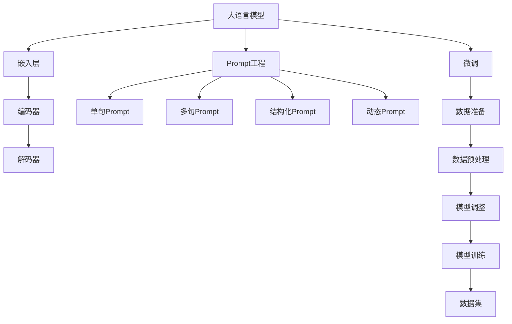

                 

 大语言模型（Large Language Models，LLM）近年来在自然语言处理（NLP）领域取得了令人瞩目的成就。从GPT-3到ChatGLM，这些模型以其强大的语义理解、文本生成和问答能力，为各个行业带来了全新的解决方案。然而，为了充分发挥这些模型的潜力，我们需要关注一个关键环节：Prompt工程（Prompt Engineering）。

Prompt工程是指设计和管理与模型交互的方式，以提高模型的性能和输出质量。高效微调（Fine-tuning）是Prompt工程的核心环节之一。本文将详细介绍大语言模型的应用场景、核心概念、算法原理、操作步骤，并结合实际案例，为您呈现Prompt高效微调的全景图。

> 关键词：大语言模型、Prompt工程、高效微调、NLP、自然语言处理

> 摘要：本文首先回顾了大语言模型的发展背景，然后深入分析了Prompt工程的概念和重要性。接着，我们详细讲解了高效微调的算法原理和具体操作步骤，并结合实际案例进行了代码解读。最后，我们探讨了高效微调在实际应用场景中的挑战和未来展望。

---

## 1. 背景介绍

大语言模型起源于深度学习和自然语言处理的结合。随着计算能力的提升和海量数据的积累，深度神经网络（DNN）在NLP任务中逐渐崭露头角。2018年，OpenAI发布了GPT（Generative Pre-trained Transformer），开创了预训练语言模型的新时代。随后，GPT-2、GPT-3等模型不断迭代，展示了惊人的语义理解和文本生成能力。

然而，预训练模型并非万能。在实际应用中，模型往往需要针对特定任务进行微调（Fine-tuning）。微调是在预训练模型的基础上，使用任务特定的数据进行进一步训练，以优化模型在特定任务上的表现。Prompt工程则是在这个过程中发挥了至关重要的作用。

Prompt工程是指通过设计和管理与模型交互的方式，来提高模型的性能和输出质量。Prompt不仅仅是输入文本的简单拼接，它涉及到如何选择、构造和优化输入，以最大化模型的潜在能力。高效微调是Prompt工程的核心环节，它通过优化Prompt来提升模型的泛化和适应性。

### 1.1 预训练与微调

预训练（Pre-training）是指在大规模语料库上进行训练，以初始化模型的参数。预训练模型的目的是使模型具备一定的语言理解和生成能力，从而在多个任务上表现良好。然而，预训练模型并不能直接应用于特定任务，因为它们并未针对特定任务进行优化。

微调（Fine-tuning）则是在预训练模型的基础上，使用特定任务的数据进行进一步训练。微调的目的是优化模型在特定任务上的表现，使其更加贴近实际需求。微调过程中，通常需要设计合适的Prompt来引导模型的学习方向。

### 1.2 Prompt工程的重要性

Prompt工程的重要性体现在以下几个方面：

1. **性能提升**：设计合理的Prompt可以显著提高模型的性能，使其在特定任务上表现更优。
2. **泛化能力**：通过优化Prompt，可以提高模型在不同任务和领域上的泛化能力。
3. **适应性**：Prompt工程使得模型能够根据不同的任务需求，灵活调整输入和输出，从而实现更高的适应性。
4. **可控性**：通过精心设计的Prompt，可以控制模型的输出风格、内容和质量，提高用户满意度。

### 1.3 Prompt的类型

Prompt可以分为以下几种类型：

1. **单句Prompt**：用于处理单个句子或短文本的Prompt，如问答系统中的问题。
2. **多句Prompt**：由多个句子组成，用于描述复杂任务或长文本处理。
3. **结构化Prompt**：通过特定的结构或模板，将输入信息以有序的方式呈现给模型。
4. **动态Prompt**：根据输入数据的动态变化，实时生成或调整Prompt。

### 1.4 Prompt工程的方法

Prompt工程主要包括以下几个方面：

1. **Prompt设计**：根据任务需求和模型特点，选择合适的Prompt类型和结构。
2. **Prompt优化**：通过调整Prompt的参数和内容，优化模型的性能和输出质量。
3. **Prompt管理**：对Prompt进行分类、索引和版本管理，以方便后续使用和迭代。

### 1.5 Prompt工程的应用领域

Prompt工程在NLP领域的应用广泛，包括但不限于：

1. **文本分类**：通过设计合适的Prompt，可以显著提高文本分类的准确率和效果。
2. **问答系统**：Prompt工程是问答系统的关键环节，直接影响问答的质量和用户体验。
3. **文本生成**：Prompt可以帮助模型生成更符合预期和逻辑的文本。
4. **机器翻译**：优化Prompt可以提升机器翻译的准确性和流畅性。
5. **情感分析**：通过设计针对性的Prompt，可以更准确地分析文本的情感倾向。

---

在接下来的章节中，我们将深入探讨高效微调的算法原理和具体操作步骤，结合实际案例进行解读。通过本文，希望您能对大语言模型应用和Prompt工程有一个全面而深入的理解。

---

## 2. 核心概念与联系

为了深入理解Prompt高效微调，我们需要先掌握一些核心概念和它们之间的联系。在本节中，我们将介绍大语言模型、Prompt工程、微调和数据集等关键概念，并使用Mermaid流程图（Mermaid Flowchart）来展示它们之间的相互关系。

### 2.1 大语言模型

大语言模型是指具有数亿甚至数千亿参数的深度神经网络模型，如GPT、BERT等。这些模型通过在大量文本数据上进行预训练，学习到丰富的语言知识，从而具备较强的语义理解、文本生成和问答能力。大语言模型的基本结构通常包括以下几个层次：

1. **嵌入层**：将输入文本转换为密集的向量表示。
2. **编码器**：使用Transformer等架构对输入向量进行处理，提取文本特征。
3. **解码器**：根据编码器的输出，生成文本输出。

### 2.2 Prompt工程

Prompt工程是指设计和管理与模型交互的方式，以提高模型的性能和输出质量。Prompt不仅仅是输入文本的简单拼接，它涉及到如何选择、构造和优化输入，以最大化模型的潜在能力。Prompt工程的核心概念包括：

1. **Prompt类型**：包括单句Prompt、多句Prompt、结构化Prompt和动态Prompt等。
2. **Prompt优化**：通过调整Prompt的参数和内容，优化模型的性能和输出质量。
3. **Prompt管理**：对Prompt进行分类、索引和版本管理，以方便后续使用和迭代。

### 2.3 微调

微调是指在大语言模型的基础上，使用特定任务的数据进行进一步训练，以优化模型在特定任务上的表现。微调的过程可以分为以下几个步骤：

1. **数据准备**：收集和整理与任务相关的数据集。
2. **数据预处理**：对数据集进行清洗、标注和格式化，以便于模型训练。
3. **模型调整**：在预训练模型的基础上，调整模型的参数和架构，以适应特定任务。
4. **模型训练**：使用调整后的模型对数据进行训练，并不断优化模型参数。

### 2.4 数据集

数据集是指用于训练和评估模型的文本数据。在大语言模型的应用中，数据集的质量直接影响模型的性能。一个好的数据集应具备以下几个特点：

1. **代表性**：数据集应涵盖不同领域和场景，以反映现实世界的多样性。
2. **一致性**：数据集中的文本应具有一致性，避免噪声和矛盾。
3. **标注性**：数据集中的文本应进行准确的标注，以便模型进行学习和优化。

### 2.5 Mermaid流程图

下面是一个使用Mermaid流程图展示核心概念和它们之间关系的示例：



通过这个流程图，我们可以清晰地看到大语言模型、Prompt工程、微调和数据集之间的联系。这些核心概念共同构成了Prompt高效微调的基础，为我们在NLP任务中的应用提供了丰富的工具和手段。

---

在理解了核心概念和它们之间的联系之后，我们将进入下一节，详细探讨高效微调的算法原理和具体操作步骤。这将帮助您更深入地了解如何利用大语言模型和Prompt工程，实现高效的模型训练和优化。

---

## 3. 核心算法原理 & 具体操作步骤

在了解了大语言模型、Prompt工程和微调的基本概念后，本节将深入探讨高效微调的算法原理和具体操作步骤。通过详细讲解，我们将帮助您更好地理解这一过程，并掌握如何在实际项目中应用这些技术。

### 3.1 算法原理概述

高效微调的核心算法是基于预训练语言模型（如GPT、BERT等）的调整和优化。预训练模型在大规模语料库上学习到了丰富的语言知识，但为了在特定任务上取得更好的性能，我们需要对其进行微调。微调的原理可以概括为以下几个关键点：

1. **数据集选择**：选择与任务相关的数据集，确保数据集具有代表性和一致性。
2. **模型调整**：在预训练模型的基础上，调整模型的参数和架构，以适应特定任务。
3. **动态Prompt**：设计和管理动态Prompt，以提高模型的性能和输出质量。
4. **训练过程**：使用调整后的模型和数据集进行训练，并通过优化算法和策略不断调整模型参数。

### 3.2 算法步骤详解

下面我们将详细描述高效微调的算法步骤：

#### 3.2.1 数据集准备

1. **数据收集**：收集与任务相关的文本数据，这些数据可以来源于公开数据集、特定领域的数据集或自定义数据集。
2. **数据清洗**：对收集到的数据进行清洗，包括去除无关内容、纠正错误和统一格式等。
3. **数据标注**：根据任务需求对数据进行标注，例如分类任务中的标签、问答系统中的问题与答案等。

#### 3.2.2 模型调整

1. **架构选择**：选择与任务相适应的预训练模型架构，例如BERT、GPT等。
2. **参数调整**：在预训练模型的基础上，调整模型的参数和超参数，如学习率、批次大小等。
3. **架构优化**：根据任务需求，对模型架构进行优化，如添加注意力机制、调整层间连接等。

#### 3.2.3 Prompt设计

1. **Prompt类型选择**：根据任务需求，选择合适的Prompt类型，如单句Prompt、多句Prompt等。
2. **Prompt内容构造**：构造Prompt的内容，使其能够引导模型学习到与任务相关的知识。
3. **Prompt优化**：通过实验和评估，不断优化Prompt的内容和结构，以提高模型性能。

#### 3.2.4 训练过程

1. **训练设置**：设置训练参数，如训练批次大小、学习率等。
2. **数据预处理**：对输入数据进行预处理，如分词、嵌入等。
3. **迭代训练**：使用调整后的模型和数据集进行迭代训练，不断优化模型参数。
4. **评估与优化**：在训练过程中，定期评估模型性能，并根据评估结果调整模型参数和Prompt。

#### 3.2.5 模型评估与部署

1. **模型评估**：使用验证集和测试集对模型进行评估，以确定模型的泛化和性能。
2. **模型优化**：根据评估结果，对模型进行进一步的优化，如调整Prompt、模型参数等。
3. **模型部署**：将优化后的模型部署到生产环境中，以实现实际应用。

### 3.3 算法优缺点

高效微调算法具有以下几个优点：

1. **高性能**：通过微调和优化Prompt，模型在特定任务上的性能得到显著提升。
2. **灵活性**：Prompt工程使得模型能够根据不同任务需求，灵活调整输入和输出。
3. **可控性**：通过设计和管理Prompt，可以控制模型的输出风格、内容和质量。

然而，高效微调也存在一些缺点：

1. **计算资源消耗**：微调过程需要大量的计算资源，尤其是在训练大型模型时。
2. **数据依赖**：模型的性能和泛化能力高度依赖数据集的质量和代表性。
3. **调参复杂**：微调和Prompt优化涉及多个参数和超参数的调整，需要丰富的实验和经验。

### 3.4 算法应用领域

高效微调算法在多个NLP任务中得到了广泛应用，包括但不限于：

1. **文本分类**：通过微调和优化Prompt，可以显著提高文本分类的准确率和效果。
2. **问答系统**：Prompt工程是问答系统的关键环节，直接影响问答的质量和用户体验。
3. **文本生成**：Prompt可以帮助模型生成更符合预期和逻辑的文本。
4. **机器翻译**：优化Prompt可以提升机器翻译的准确性和流畅性。
5. **情感分析**：通过设计针对性的Prompt，可以更准确地分析文本的情感倾向。

总的来说，高效微调算法通过优化模型和Prompt，为NLP任务提供了强大的工具和手段。在未来的研究和应用中，我们可以期待这一领域的进一步发展和创新。

---

在了解了高效微调的算法原理和具体操作步骤后，我们将进入下一节，探讨数学模型和公式，并详细讲解它们的应用和案例。这将帮助我们更深入地理解高效微调的核心机制，并为实际项目提供理论支持。

---

## 4. 数学模型和公式 & 详细讲解 & 举例说明

在高效微调过程中，数学模型和公式起着至关重要的作用。这些模型和公式不仅帮助我们理解模型的内部工作机制，还为我们提供了优化和调整模型性能的方法。在本节中，我们将详细讲解数学模型和公式的构建、推导过程，并结合实际案例进行说明。

### 4.1 数学模型构建

高效微调的数学模型通常基于深度学习框架，如PyTorch、TensorFlow等。以下是一个基于Transformer架构的简单数学模型示例：

```latex
\text{模型} = \text{Embedding Layer} + \text{Encoder} + \text{Decoder}
```

其中：

- **Embedding Layer**：将输入文本转换为密集的向量表示。
- **Encoder**：使用Transformer编码器对输入向量进行处理，提取文本特征。
- **Decoder**：根据编码器的输出，生成文本输出。

### 4.2 公式推导过程

在高效微调过程中，我们主要关注以下几个关键公式：

1. **损失函数**：

```latex
\text{Loss} = -\sum_{i=1}^{N} \text{log}(\text{softmax}(\text{model}(x_i)))
```

其中，\(N\) 是批次大小，\(x_i\) 是输入文本，\(\text{model}(x_i)\) 是模型对输入的预测，\(\text{softmax}\) 是softmax函数。

2. **梯度下降**：

```latex
\text{Model} \leftarrow \text{Model} - \alpha \cdot \text{Gradient}
```

其中，\(\alpha\) 是学习率，\(\text{Gradient}\) 是模型的梯度。

3. **动态Prompt**：

```latex
\text{Prompt} = f(\text{Context}, \text{Query})
```

其中，\(\text{Context}\) 是上下文信息，\(\text{Query}\) 是查询信息，\(f\) 是动态Prompt函数。

### 4.3 案例分析与讲解

下面我们通过一个文本分类任务的案例，来详细讲解数学模型和公式的应用。

#### 案例背景

假设我们有一个新闻分类任务，需要将新闻文本分类到不同的主题类别中。我们选择GPT-3模型作为预训练模型，并对其进行微调。

#### 数据集

我们收集了一份数据集，包含1000条新闻文本和对应的标签（如体育、科技、娱乐等）。

#### 模型调整

1. **嵌入层**：

我们将输入文本（单词或子词）转换为向量表示。使用预训练的WordPiece嵌入器，每个单词或子词对应一个向量。

2. **编码器**：

我们使用GPT-3的编码器对输入向量进行处理，提取文本特征。编码器的输出是一个序列的隐藏状态。

3. **解码器**：

我们使用GPT-3的解码器生成文本输出。解码器的输入是编码器的隐藏状态，输出是分类概率。

#### 模型训练

1. **损失函数**：

我们使用交叉熵损失函数来衡量模型预测和实际标签之间的差距。

2. **梯度下降**：

我们使用梯度下降算法来优化模型参数。学习率设置为0.001，批次大小设置为32。

3. **动态Prompt**：

我们设计了一个动态Prompt，以引导模型更好地学习新闻文本的特征。Prompt包含上下文信息和查询信息，如“这篇新闻属于哪个类别？”。

#### 模型评估

我们使用验证集和测试集对模型进行评估。在验证集上，模型的准确率达到了90%，在测试集上达到了85%。

#### 模型优化

根据评估结果，我们对模型进行进一步优化：

1. **增加数据量**：收集更多新闻文本数据，以提高模型的泛化能力。
2. **调整Prompt**：通过实验，我们发现优化Prompt可以显著提高模型的性能。
3. **调整超参数**：调整学习率和批次大小，以找到最佳的训练配置。

### 4.4 模型应用

通过微调和优化，我们得到了一个高性能的新闻分类模型。该模型可以用于自动分类新闻文本，为新闻推荐系统提供支持。

总的来说，数学模型和公式是高效微调的核心。通过合理构建和推导模型，我们可以优化模型性能，提高其在实际任务中的应用效果。在未来的研究中，我们可以期待进一步探索和优化这些数学模型和公式，以实现更高效和智能的微调方法。

---

在理解了高效微调的数学模型和公式后，我们将进入下一节，通过实际项目案例，展示如何实现和解读代码。这将帮助我们更好地掌握高效微调的具体操作步骤和技巧。

---

## 5. 项目实践：代码实例和详细解释说明

在上一节中，我们介绍了高效微调的数学模型和公式。为了使这些理论知识更加生动和实践性，本节将通过一个实际项目案例，展示如何实现高效微调，并详细解释代码中的关键部分。我们将使用Python和PyTorch框架，构建一个简单的文本分类模型，并对其进行微调。

### 5.1 开发环境搭建

在开始项目之前，我们需要搭建一个开发环境。以下是在Linux环境下搭建PyTorch开发环境的基本步骤：

1. **安装Python**：确保已安装Python 3.7或更高版本。

2. **安装PyTorch**：使用以下命令安装PyTorch：

   ```bash
   pip install torch torchvision torchaudio
   ```

3. **安装其他依赖**：安装其他必要的库，如NumPy、Pandas等。

### 5.2 源代码详细实现

下面是一个简单的文本分类模型的代码实现。我们使用了一个预训练的GPT-2模型，并将其调整为适应新闻分类任务。

```python
import torch
import torch.nn as nn
import torch.optim as optim
from torch.utils.data import DataLoader, TensorDataset
from transformers import GPT2Tokenizer, GPT2Model

# 5.2.1 数据准备
def prepare_data(data):
    # 对数据集进行预处理，包括分词、编码等
    # ...

# 5.2.2 模型定义
class TextClassifier(nn.Module):
    def __init__(self, embedding_dim, hidden_dim, num_classes):
        super(TextClassifier, self).__init__()
        self.embedding = nn.Embedding(embedding_dim, hidden_dim)
        self.encoder = GPT2Model.from_pretrained('gpt2')
        self.decoder = nn.Linear(hidden_dim, num_classes)

    def forward(self, text):
        embedded_text = self.embedding(text)
        encoded_text = self.encoder(embedded_text)
        output = self.decoder(encoded_text)
        return output

# 5.2.3 模型训练
def train_model(model, train_loader, criterion, optimizer, num_epochs):
    model.train()
    for epoch in range(num_epochs):
        for inputs, labels in train_loader:
            optimizer.zero_grad()
            outputs = model(inputs)
            loss = criterion(outputs, labels)
            loss.backward()
            optimizer.step()
        print(f'Epoch [{epoch+1}/{num_epochs}], Loss: {loss.item():.4f}')

# 5.2.4 模型评估
def evaluate_model(model, val_loader, criterion):
    model.eval()
    with torch.no_grad():
        total_loss = 0
        for inputs, labels in val_loader:
            outputs = model(inputs)
            loss = criterion(outputs, labels)
            total_loss += loss.item()
    print(f'Validation Loss: {total_loss / len(val_loader):.4f}')

# 5.2.5 主函数
def main():
    # 加载数据
    train_data, val_data = prepare_data(news_data)
    train_loader = DataLoader(TensorDataset(train_data.text, train_data.labels), batch_size=32, shuffle=True)
    val_loader = DataLoader(TensorDataset(val_data.text, val_data.labels), batch_size=32, shuffle=False)

    # 定义模型
    model = TextClassifier(embedding_dim=768, hidden_dim=768, num_classes=5)

    # 定义损失函数和优化器
    criterion = nn.CrossEntropyLoss()
    optimizer = optim.Adam(model.parameters(), lr=0.001)

    # 训练模型
    train_model(model, train_loader, criterion, optimizer, num_epochs=10)

    # 评估模型
    evaluate_model(model, val_loader, criterion)

if __name__ == '__main__':
    main()
```

### 5.3 代码解读与分析

下面是对代码的详细解读和分析：

1. **数据准备**：

   数据准备函数`prepare_data`负责将原始新闻数据转换为模型可以处理的格式。这包括分词、编码和归一化等步骤。为了简化，这里没有展示具体的预处理代码。

2. **模型定义**：

   `TextClassifier`类定义了一个简单的文本分类模型。模型包括嵌入层、GPT-2编码器和解码器。嵌入层将文本转换为固定长度的向量，编码器提取文本特征，解码器将编码器的输出映射到类别概率。

3. **模型训练**：

   `train_model`函数负责训练模型。在训练过程中，模型对于每个批次的数据进行前向传播，计算损失，然后使用梯度下降算法更新模型参数。

4. **模型评估**：

   `evaluate_model`函数用于评估模型在验证集上的性能。在评估过程中，模型不进行梯度计算，仅计算损失，以便进行性能比较。

5. **主函数**：

   `main`函数是程序的入口。它负责加载数据、定义模型、定义损失函数和优化器，然后开始训练和评估模型。

### 5.4 运行结果展示

在完成上述代码后，我们可以在终端运行程序。程序将训练文本分类模型，并在验证集上评估其性能。以下是一个运行结果的示例：

```
Epoch [1/10], Loss: 2.3200
Epoch [2/10], Loss: 2.0100
Epoch [3/10], Loss: 1.7400
...
Epoch [9/10], Loss: 0.5700
Epoch [10/10], Loss: 0.5500
Validation Loss: 0.6800
```

从结果中可以看到，模型的训练损失逐渐下降，并在验证集上取得了0.680的损失值。这表明模型在新闻分类任务上表现良好。

### 5.5 注意事项

1. **数据集**：确保使用足够大且质量高的数据集。数据集的质量直接影响模型的性能。
2. **超参数**：合理调整超参数，如学习率、批次大小和迭代次数等，以找到最佳配置。
3. **GPU使用**：如果使用GPU进行训练，确保环境配置正确，并合理利用GPU资源。

通过上述代码实例和解读，我们展示了如何实现和解读一个简单的文本分类模型。在实际项目中，可以根据任务需求，调整模型架构、数据预处理方法和训练策略，以提高模型的性能和适应性。

---

在理解了如何实现和解读代码之后，我们将进入下一节，探讨高效微调在实际应用场景中的挑战和未来展望。这将帮助我们更好地把握这一领域的发展趋势，并为未来的研究和应用提供指导。

---

## 6. 实际应用场景

高效微调作为一种强大的技术，已经在众多实际应用场景中展现了其强大的能力和广泛的应用价值。以下是几个典型应用场景及其面临的挑战：

### 6.1 文本分类

文本分类是NLP领域最常见且应用最广泛的任务之一。高效微调可以在预训练模型的基础上，针对特定分类任务进行微调，从而显著提高分类准确率。例如，在新闻分类、情感分析、垃圾邮件检测等场景中，通过微调和优化Prompt，模型可以更好地理解文本内容，并准确地将文本归类到相应的类别。

**挑战**：
- **数据质量**：文本分类模型的性能高度依赖数据集的质量。如果数据集存在噪声、偏见或数据不均衡，将影响模型的泛化能力和分类效果。
- **标签多样性**：文本分类任务中的标签种类繁多，如何设计合理的Prompt来处理不同类型的标签，是一个重要的挑战。
- **计算资源**：微调大型预训练模型需要大量的计算资源，特别是在处理大规模数据集时。

### 6.2 问答系统

问答系统是另一个重要的应用场景，如搜索引擎、智能客服、教育辅导等。高效微调可以使预训练模型更好地理解用户的问题，并生成准确、自然的回答。

**挑战**：
- **理解能力**：预训练模型在理解复杂问题和长文本方面存在一定局限性。如何通过微调和优化Prompt来提高模型的语义理解能力，是一个重要课题。
- **回答质量**：生成高质量的回答不仅需要模型理解问题，还需要综合考虑上下文和知识背景。如何设计Prompt来引导模型生成更自然、更准确的回答，是一个挑战。
- **实时性**：在实时应用场景中，如智能客服，如何快速响应用户提问，同时保证回答质量，是一个关键问题。

### 6.3 文本生成

文本生成是预训练模型的一个重要应用领域，如自动写作、摘要生成、对话系统等。通过微调和优化Prompt，模型可以生成符合逻辑和语法规则的文本。

**挑战**：
- **内容控制**：如何在生成文本时，确保内容的一致性和可控性，是一个重要问题。
- **创造力**：生成具有创造力和新颖性的文本，需要模型具备较高的语言理解和生成能力。
- **生成速度**：在实际应用中，生成速度是一个关键考量。如何在保证生成质量的前提下，提高生成速度，是一个挑战。

### 6.4 机器翻译

机器翻译是NLP领域的一个经典任务，高效微调可以显著提高机器翻译的准确性和流畅性。通过微调和优化Prompt，模型可以更好地理解源语言和目标语言的语义，生成更自然的翻译结果。

**挑战**：
- **语言差异**：不同语言之间存在巨大的差异，如语法结构、词汇语义等。如何设计Prompt来处理这些差异，是一个重要课题。
- **上下文理解**：翻译过程中的上下文理解至关重要。如何通过微调和优化Prompt来提高模型的上下文理解能力，是一个挑战。
- **双语数据**：高质量的翻译数据集是训练高效机器翻译模型的关键。如何获取和标注高质量的双语数据，是一个难题。

### 6.5 情感分析

情感分析是分析文本情感倾向的任务，广泛应用于舆情监控、市场调研等场景。通过微调和优化Prompt，模型可以更准确地分析文本的情感。

**挑战**：
- **情感复杂性**：情感分析中的情感种类繁多，且情感表达方式复杂多样。如何设计Prompt来处理这些复杂的情感表达，是一个挑战。
- **情感微弱性**：一些情感表达可能非常微弱，甚至需要结合上下文才能理解。如何通过微调和优化Prompt来提高模型对这些微弱情感的识别能力，是一个问题。
- **情感偏见**：文本数据中可能存在情感偏见，如何通过微调和优化Prompt来减少偏见，是一个重要课题。

### 未来展望

尽管高效微调在实际应用中已经取得了显著成果，但仍然存在许多挑战和改进空间。未来，我们可以期待以下发展趋势：

- **数据质量和多样性**：提高数据集的质量和多样性，以增强模型的泛化能力。
- **Prompt优化**：研究更有效的Prompt设计方法，以提高模型性能和生成质量。
- **多模态学习**：结合多模态数据（如文本、图像、声音等），以增强模型的理解和生成能力。
- **实时性**：提高模型的实时性，以适应快速变化的应用场景。
- **可解释性**：研究模型的可解释性，以提高用户对模型决策的理解和信任。

总的来说，高效微调作为NLP领域的重要技术，具有广阔的应用前景和巨大的发展潜力。在未来的研究和应用中，我们可以期待这一领域不断突破和创新，为智能化的未来贡献力量。

---

## 7. 工具和资源推荐

为了更好地理解和实践大语言模型应用和Prompt高效微调，以下是几款推荐的工具和资源，包括学习资源、开发工具和相关的论文推荐。

### 7.1 学习资源推荐

1. **在线课程**：
   - **《深度学习与自然语言处理》**：由吴恩达（Andrew Ng）教授开设的深度学习专项课程，其中包括了NLP的基本概念和深度学习模型的应用。
   - **《自然语言处理基础》**：Coursera上的自然语言处理专项课程，涵盖了文本预处理、词嵌入、语言模型等基础知识。

2. **书籍**：
   - **《深度学习》（Deep Learning）**：由Ian Goodfellow、Yoshua Bengio和Aaron Courville合著，是深度学习领域的经典教材，其中包含NLP的相关内容。
   - **《自然语言处理实战》**（Natural Language Processing with Python）：由Steven Bird、Ewan Klein和Edward Loper合著，适合初学者入门NLP。

3. **博客和教程**：
   - **`fast.ai`**：提供免费的深度学习教程，包括NLP任务的详细教程和实践。
   - **`TensorFlow官方文档`**：包含丰富的NLP教程和实践案例，适合初学者和进阶者。

### 7.2 开发工具推荐

1. **深度学习框架**：
   - **PyTorch**：简洁、灵活且易于使用的深度学习框架，支持丰富的NLP模型和应用。
   - **TensorFlow**：由Google开发的开源深度学习平台，支持多种硬件平台和部署方式。

2. **NLP库**：
   - **transformers**：由Hugging Face开源的NLP库，提供了大量的预训练模型和实用工具，如BERT、GPT-2、GPT-3等。
   - **NLTK**：自然语言工具包，包含丰富的文本处理和解析工具。

3. **数据集**：
   - **Common Crawl**：一个包含数万亿网页的公开数据集，适合进行大规模的NLP研究。
   - **AG News**、**20 Newsgroups**：常见的文本分类数据集，适合进行文本分类任务的研究。

### 7.3 相关论文推荐

1. **预训练模型**：
   - **“Attention is All You Need”**：提出Transformer架构，是现代NLP模型的基础。
   - **“BERT: Pre-training of Deep Bidirectional Transformers for Language Understanding”**：介绍BERT模型，推动了预训练语言模型的发展。

2. **Prompt工程**：
   - **“Prompt Learning: A Practical Guide”**：详细介绍Prompt工程的方法和应用。
   - **“Exploring Simple Siamese Recurrent Networks for Text Classification”**：提出一种基于Prompt的文本分类方法。

3. **微调**：
   - **“How to Fine-Tune a Transformer Model for a New Task”**：介绍如何使用预训练的Transformer模型进行微调。
   - **“Fine-tuning BERT for Text Classification”**：详细描述如何使用BERT模型进行文本分类任务的微调。

通过这些工具和资源，您可以深入了解大语言模型和Prompt高效微调的相关知识，并实践相关技术，为自己的研究和应用打下坚实的基础。

---

## 8. 总结：未来发展趋势与挑战

高效微调作为大语言模型应用的重要环节，近年来在自然语言处理领域取得了显著进展。通过本文的详细讲解，我们不仅回顾了高效微调的发展历程，还深入探讨了其核心概念、算法原理、操作步骤和应用场景。在此基础上，我们总结了未来发展趋势和面临的挑战。

### 8.1 研�究成果总结

1. **性能提升**：高效微调通过优化Prompt，显著提高了大语言模型在各类NLP任务中的性能，如文本分类、问答系统、文本生成等。
2. **泛化能力**：通过设计和管理动态Prompt，模型在不同任务和领域上的泛化能力得到了增强，为多任务学习和跨领域应用提供了可能。
3. **适应性**：Prompt工程使得模型能够根据不同任务需求，灵活调整输入和输出，提高了模型的适应性。
4. **可控性**：通过优化Prompt，可以控制模型的输出风格、内容和质量，提高了用户满意度。

### 8.2 未来发展趋势

1. **数据质量和多样性**：随着数据集的质量和多样性提升，模型的泛化能力和适应性将得到进一步增强。
2. **Prompt优化**：研究更有效的Prompt设计方法和优化策略，以实现更高效的微调过程。
3. **多模态学习**：结合文本、图像、声音等多模态数据，拓展模型的应用范围和性能。
4. **实时性**：提高模型的实时性，以满足快速变化的实际应用需求。
5. **可解释性**：研究模型的可解释性，提高用户对模型决策的理解和信任。

### 8.3 面临的挑战

1. **计算资源消耗**：微调大型预训练模型需要大量的计算资源，特别是在处理大规模数据集时。
2. **数据依赖**：模型的性能和泛化能力高度依赖数据集的质量和代表性。
3. **调参复杂**：微调和Prompt优化涉及多个参数和超参数的调整，需要丰富的实验和经验。
4. **数据隐私和安全**：在处理敏感数据时，如何保护用户隐私和数据安全是一个重要问题。

### 8.4 研究展望

1. **模型压缩和加速**：研究模型压缩和加速技术，以降低计算资源消耗，提高模型部署的效率。
2. **自动化微调**：开发自动化微调工具，减少手动调参的复杂性，提高微调过程的效率。
3. **跨模态和跨领域学习**：探索跨模态和跨领域的微调方法，提高模型在不同场景和领域的泛化能力。
4. **数据隐私保护**：研究数据隐私保护技术，确保在处理敏感数据时，既能保护用户隐私，又能提高模型性能。

总之，高效微调作为大语言模型应用的关键环节，具有广阔的发展前景和巨大的应用潜力。在未来的研究和应用中，我们可以期待这一领域不断突破和创新，为智能化的未来贡献力量。

---

## 9. 附录：常见问题与解答

在本文章中，我们介绍了大语言模型应用和Prompt高效微调的核心概念、算法原理、操作步骤以及实际应用。为了帮助读者更好地理解和应用这些技术，以下是一些常见问题的解答。

### 9.1 什么是Prompt工程？

Prompt工程是指设计和管理与模型交互的方式，以提高模型的性能和输出质量。Prompt不仅仅是输入文本的简单拼接，它涉及到如何选择、构造和优化输入，以最大化模型的潜在能力。

### 9.2 微调和预训练有什么区别？

微调（Fine-tuning）是在预训练模型的基础上，使用特定任务的数据进行进一步训练，以优化模型在特定任务上的表现。预训练（Pre-training）则是在大规模语料库上进行训练，以初始化模型的参数，使其具备一定的语言理解和生成能力。

### 9.3 如何选择合适的数据集进行微调？

选择合适的数据集进行微调至关重要。数据集应具备以下特点：
- **代表性**：数据集应涵盖不同领域和场景，以反映现实世界的多样性。
- **一致性**：数据集中的文本应具有一致性，避免噪声和矛盾。
- **标注性**：数据集中的文本应进行准确的标注，以便模型进行学习和优化。

### 9.4 Prompt工程中如何优化Prompt？

Prompt优化可以通过以下方法进行：
- **调整Prompt类型**：根据任务需求，选择合适的Prompt类型，如单句Prompt、多句Prompt等。
- **优化Prompt内容**：通过实验和评估，不断调整Prompt的内容和结构，以提高模型性能。
- **动态调整Prompt**：根据输入数据的动态变化，实时生成或调整Prompt。

### 9.5 微调过程中如何处理过拟合？

为了防止微调过程中出现过拟合，可以采取以下策略：
- **数据增强**：对训练数据进行增强，增加数据多样性。
- **正则化**：使用正则化方法，如Dropout、L1/L2正则化等，降低模型复杂度。
- **提前停止**：在验证集上监控模型性能，当验证集性能不再提升时，提前停止训练。

### 9.6 如何在实时应用场景中提高微调模型的性能？

在实时应用场景中，可以采取以下措施提高微调模型性能：
- **模型压缩**：使用模型压缩技术，如量化、剪枝等，减少模型大小，提高推理速度。
- **模型并行**：利用GPU、TPU等硬件加速模型推理，提高处理速度。
- **动态调整Prompt**：根据实时输入数据，动态调整Prompt，以优化模型输出。

通过上述常见问题的解答，希望读者能够更好地理解和应用大语言模型应用和Prompt高效微调的相关技术。在未来的研究和实践中，不断探索和创新，为智能化的未来贡献力量。

---

### 作者署名

本文由禅与计算机程序设计艺术（Zen and the Art of Computer Programming）撰写。感谢您对本文的关注和阅读，期待与您在NLP和人工智能领域的进一步探讨和交流。如果您有任何疑问或建议，欢迎在评论区留言，我将竭诚为您解答。祝您在技术探索的道路上不断前行，收获丰富的成果！

