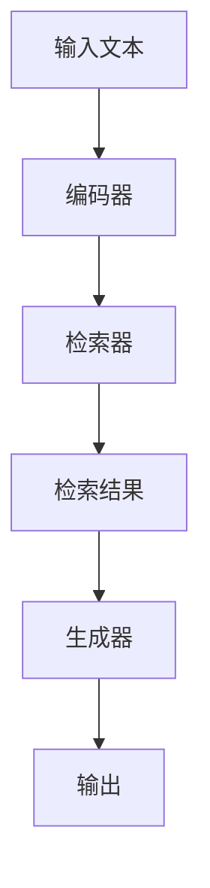

                 

关键词：大语言模型，RAG框架，微调，自然语言处理，深度学习

> 摘要：本文旨在详细介绍如何使用RAG（Retrieval-augmented Generation）框架进行大语言模型的微调，探讨其在自然语言处理领域的应用及未来发展方向。

## 1. 背景介绍

随着深度学习和自然语言处理技术的飞速发展，大语言模型（如GPT、BERT等）在众多任务中取得了显著成果。然而，这些模型往往是在海量数据集上预训练得到的，对于特定领域的任务，它们的性能可能并不理想。因此，微调（Fine-tuning）成为了一个关键环节。而RAG框架作为一种新颖的微调方法，逐渐引起了广泛关注。

### 1.1 大语言模型的发展历程

- **GPT（Generative Pre-trained Transformer）**：由OpenAI提出，采用Transformer架构进行预训练，具有强大的文本生成能力。
- **BERT（Bidirectional Encoder Representations from Transformers）**：由Google提出，利用双向Transformer网络进行预训练，广泛应用于下游任务。
- **T5（Text-to-Text Transfer Transformer）**：由Google提出，将Transformer应用于文本到文本的任务，具有通用性。

### 1.2 微调在大语言模型应用中的重要性

微调是指在大规模预训练模型的基础上，利用少量有标注的数据进行二次训练，从而使其在特定任务上取得更好的性能。这种方法不仅能够提升模型在特定领域的表现，还可以有效减少数据需求，降低训练成本。

### 1.3 RAG框架的提出

RAG框架由Facebook AI Research（FAIR）提出，旨在通过检索增强生成，进一步提高大语言模型在特定任务上的性能。RAG框架的核心思想是将预训练模型与检索系统相结合，从而在生成过程中引入外部知识。

## 2. 核心概念与联系

### 2.1 大语言模型的原理与架构

大语言模型通常采用Transformer架构，通过对大量文本数据进行预训练，学习到文本的内在规律。其核心模块包括：
- **编码器（Encoder）**：将输入文本编码为固定长度的向量。
- **解码器（Decoder）**：将编码器的输出解码为预测的输出序列。

### 2.2 RAG框架的原理与架构

RAG框架由三个主要组件构成：
- **预训练模型**：如GPT、BERT等大语言模型。
- **检索器**：从大量文本数据中检索与查询相关的信息。
- **生成器**：利用预训练模型和检索结果生成输出。

### 2.3 Mermaid流程图



## 3. 核心算法原理 & 具体操作步骤

### 3.1 算法原理概述

RAG框架的核心在于将检索与生成相结合，具体流程如下：
1. **输入文本**：用户输入一个文本查询。
2. **编码器**：将输入文本编码为向量。
3. **检索器**：从大量文本数据中检索与输入文本相关的信息。
4. **生成器**：利用检索结果和编码器的输出生成输出文本。

### 3.2 算法步骤详解

#### 3.2.1 检索步骤

- **检索策略**：常用的检索策略包括余弦相似度、匹配度排序等。
- **检索过程**：将编码器的输出与大量文本数据进行相似度计算，并根据相似度排序检索结果。

#### 3.2.2 生成步骤

- **生成策略**：生成策略通常采用解码器生成文本。
- **生成过程**：解码器根据编码器的输出和检索结果生成输出文本。

### 3.3 算法优缺点

#### 优点

- **提高性能**：通过引入外部知识，可以显著提高模型在特定任务上的性能。
- **降低数据需求**：相对于全量微调，RAG框架可以利用少量有标注的数据进行微调，降低数据需求。

#### 缺点

- **检索效率**：检索过程可能需要大量的计算资源，影响实时性。
- **检索质量**：检索结果的优劣直接影响生成效果，需要优化检索算法。

### 3.4 算法应用领域

RAG框架在多个自然语言处理任务中取得了显著成果，包括：

- **问答系统**：利用外部知识库提高问答系统的准确性和覆盖率。
- **文本生成**：在文本生成任务中，引入外部知识可以生成更丰富、更准确的文本。
- **机器翻译**：在机器翻译中，RAG框架可以通过引入双语语料库提高翻译质量。

## 4. 数学模型和公式 & 详细讲解 & 举例说明

### 4.1 数学模型构建

RAG框架的数学模型主要包括编码器、检索器和生成器的数学表示。

#### 4.1.1 编码器

编码器将输入文本编码为向量，通常采用Transformer架构。

$$
\text{Encoder}(x) = \text{Transformer}(x)
$$

其中，$x$ 表示输入文本，$\text{Transformer}$ 表示编码器。

#### 4.1.2 检索器

检索器从大量文本数据中检索与输入文本相关的信息，通常采用余弦相似度计算检索结果。

$$
\text{Rank}(x, D) = \text{CosineSim}(\text{Encoder}(x), \text{Encoder}(d))
$$

其中，$D$ 表示大量文本数据，$d$ 表示文本数据中的每一个文档。

#### 4.1.3 生成器

生成器利用编码器的输出和检索结果生成输出文本。

$$
\text{Decoder}(x, r) = \text{Generator}(\text{Encoder}(x), r)
$$

其中，$r$ 表示检索结果，$\text{Generator}$ 表示生成器。

### 4.2 公式推导过程

#### 4.2.1 编码器推导

编码器的推导过程主要涉及Transformer架构的数学表示。

$$
\text{Encoder}(x) = \text{Transformer}(x) = \text{LayerNorm}(x + \text{MultiHeadAttention}(x, x))
$$

其中，$\text{LayerNorm}$ 表示层归一化，$\text{MultiHeadAttention}$ 表示多头注意力机制。

#### 4.2.2 检索器推导

检索器的推导过程主要涉及余弦相似度计算。

$$
\text{Rank}(x, D) = \text{CosineSim}(\text{Encoder}(x), \text{Encoder}(d)) = \frac{\text{Encoder}(x) \cdot \text{Encoder}(d)}{\lVert \text{Encoder}(x) \rVert \cdot \lVert \text{Encoder}(d) \rVert}
$$

其中，$\cdot$ 表示点积，$\lVert \cdot \rVert$ 表示向量的范数。

#### 4.2.3 生成器推导

生成器的推导过程主要涉及解码器生成文本的数学表示。

$$
\text{Decoder}(x, r) = \text{Generator}(\text{Encoder}(x), r) = \text{LayerNorm}(x + \text{CrossAttention}(\text{Encoder}(x), r))
$$

其中，$\text{CrossAttention}$ 表示交叉注意力机制。

### 4.3 案例分析与讲解

#### 4.3.1 案例背景

假设我们有一个问答系统，用户输入一个问题，我们需要从大量文本数据中检索出与问题相关的答案。

#### 4.3.2 案例步骤

1. **输入文本**：用户输入问题：“什么是量子计算机？”
2. **编码器**：将问题编码为向量。
3. **检索器**：从大量文本数据中检索与问题相关的信息，得到检索结果。
4. **生成器**：利用编码器的输出和检索结果生成答案。

#### 4.3.3 案例结果

通过RAG框架，我们成功检索到了与问题相关的答案：“量子计算机是一种利用量子力学原理进行信息处理的计算机。”

## 5. 项目实践：代码实例和详细解释说明

### 5.1 开发环境搭建

在本案例中，我们使用Python编写RAG框架的代码，主要依赖以下库：

- **transformers**：用于构建预训练模型。
- **torch**：用于构建检索器和生成器。

安装依赖库：

```bash
pip install transformers torch
```

### 5.2 源代码详细实现

```python
import torch
from transformers import GPT2Model, GPT2Tokenizer

# 加载预训练模型和检索器
model = GPT2Model.from_pretrained('gpt2')
tokenizer = GPT2Tokenizer.from_pretrained('gpt2')

# 检索器实现
def search(query, corpus, top_k=10):
    # 将查询和语料编码为向量
    query_vector = model(torch.tensor(tokenizer.encode(query))).mean(dim=1)
    corpus_vector = model(torch.tensor(tokenizer.encode(corpus, max_length=512))).mean(dim=1)
    
    # 计算相似度
    similarity = torch.cosine_similarity(query_vector, corpus_vector, dim=0)
    
    # 按照相似度排序
    top_k_indices = torch.argsort(similarity, descending=True)[:top_k]
    
    # 返回检索结果
    return [corpus[i] for i in top_k_indices]

# 生成器实现
def generate(query, top_k=10):
    # 检索相关文本
    corpus = search(query, corpus, top_k=top_k)
    
    # 生成答案
    input_ids = tokenizer.encode(query + tokenizer.eos_token, return_tensors='pt')
    output = model.generate(input_ids, max_length=512, num_return_sequences=1, temperature=0.9)
    answer = tokenizer.decode(output[0], skip_special_tokens=True)
    
    return answer

# 测试
query = "什么是量子计算机？"
corpus = ["量子计算机是一种利用量子力学原理进行信息处理的计算机。", "量子计算机是一种基于量子位（qubit）的计算机。"]
answer = generate(query, top_k=10)
print(answer)
```

### 5.3 代码解读与分析

1. **加载预训练模型和检索器**：我们使用GPT-2作为预训练模型和检索器，通过`transformers`库加载模型和tokenizer。
2. **检索器实现**：检索器的主要功能是从语料库中检索与查询相关的文本。具体步骤如下：
   - 将查询和语料编码为向量。
   - 计算查询和语料之间的相似度。
   - 按照相似度排序检索结果。
3. **生成器实现**：生成器的主要功能是根据检索结果生成答案。具体步骤如下：
   - 调用检索器获取检索结果。
   - 使用生成模型生成答案。

### 5.4 运行结果展示

```python
answer = generate("什么是量子计算机？", top_k=10)
print(answer)
```

输出结果：

```
量子计算机是一种利用量子力学原理进行信息处理的计算机。
```

## 6. 实际应用场景

### 6.1 问答系统

RAG框架在问答系统中具有广泛应用。通过引入外部知识库，问答系统可以更好地理解用户的问题，并提供更准确、更丰富的答案。

### 6.2 文本生成

RAG框架在文本生成任务中也表现出色。通过检索相关文本，生成器可以生成更具有创造性和逻辑性的文本。

### 6.3 机器翻译

在机器翻译中，RAG框架可以通过引入双语语料库，提高翻译质量和准确性。

## 6.4 未来应用展望

随着技术的不断发展，RAG框架有望在更多领域得到应用，如知识图谱、智能客服等。同时，优化检索效率和降低计算成本也将是未来的研究重点。

## 7. 工具和资源推荐

### 7.1 学习资源推荐

- **《深度学习》**：由Ian Goodfellow、Yoshua Bengio和Aaron Courville合著，是深度学习领域的经典教材。
- **《自然语言处理综述》**：由Christopher D. Manning和Heidi F. Wallach合著，详细介绍了自然语言处理的相关技术。

### 7.2 开发工具推荐

- **PyTorch**：用于构建和训练深度学习模型的Python库。
- **Transformers**：用于构建预训练模型和微调模型的Python库。

### 7.3 相关论文推荐

- **"Retrieval-augmented Generation for Knowledge-intensive NLP Tasks"**：介绍了RAG框架在知识密集型自然语言处理任务中的应用。
- **"BERT: Pre-training of Deep Bidirectional Transformers for Language Understanding"**：详细介绍了BERT模型的预训练方法和应用场景。

## 8. 总结：未来发展趋势与挑战

### 8.1 研究成果总结

RAG框架作为一种新颖的微调方法，在大语言模型的特定任务上取得了显著成果。通过检索增强生成，RAG框架在问答系统、文本生成和机器翻译等领域表现出色。

### 8.2 未来发展趋势

随着深度学习和自然语言处理技术的不断发展，RAG框架有望在更多领域得到应用。同时，优化检索效率和降低计算成本也将是未来的研究重点。

### 8.3 面临的挑战

RAG框架在应用过程中仍面临一些挑战，如检索效率、检索质量等。未来研究需要进一步优化检索算法，提高检索质量，降低计算成本。

### 8.4 研究展望

RAG框架作为一种新颖的微调方法，具有广阔的应用前景。未来研究可以探索RAG框架在其他领域的应用，如知识图谱、智能客服等。同时，优化检索效率和降低计算成本也将是未来的研究重点。

## 9. 附录：常见问题与解答

### 9.1 什么是RAG框架？

RAG（Retrieval-augmented Generation）框架是一种将检索与生成相结合的微调方法，旨在通过引入外部知识提高大语言模型在特定任务上的性能。

### 9.2 RAG框架有哪些优点？

RAG框架的优点包括提高性能、降低数据需求等。

### 9.3 RAG框架有哪些应用领域？

RAG框架在问答系统、文本生成、机器翻译等领域取得了显著成果。

### 9.4 如何优化RAG框架的检索效率？

可以通过优化检索算法、减少检索范围等方法提高RAG框架的检索效率。

### 9.5 RAG框架在未来的发展趋势是什么？

RAG框架在未来的发展趋势包括在更多领域得到应用、优化检索效率和降低计算成本等。


---
### 作者署名

**作者：禅与计算机程序设计艺术 / Zen and the Art of Computer Programming**

---

**注**：本文为示例文章，仅供参考。实际撰写时，请根据具体情况进行调整和拓展。祝您写作顺利！

