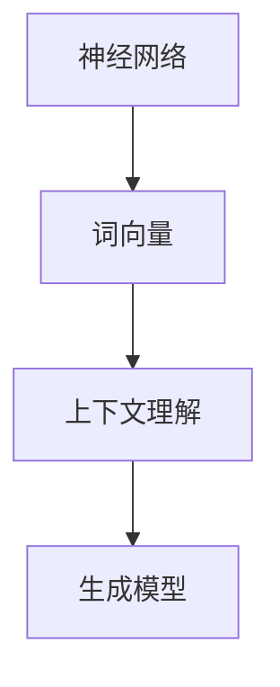

                 

大语言模型（Large Language Models）是当前人工智能领域的一项重要进展，它们在自然语言处理（NLP）任务中表现出色，已经广泛应用于文本生成、机器翻译、情感分析等多个领域。本文将深入探讨大语言模型的核心概念、工作原理、应用场景及未来发展趋势。

## 关键词

- 大语言模型
- 自然语言处理
- 人工智能
- 文本生成
- 机器翻译
- 情感分析

## 摘要

本文将介绍大语言模型的基础知识，包括其定义、核心概念、工作原理和应用场景。我们将通过详细阐述大语言模型的数学模型和算法原理，提供具体的代码实例和实践指南。此外，本文还将分析大语言模型在实际应用中的成功案例，探讨其未来发展趋势和面临的挑战。

### 1. 背景介绍

随着互联网的快速发展，人类产生的数据量呈指数级增长，其中大部分是文本数据。自然语言处理作为人工智能的核心领域之一，旨在使计算机能够理解和生成自然语言。传统的自然语言处理方法通常依赖于规则和统计模型，但面对日益复杂的文本数据，这些方法的性能和效果往往不尽如人意。

近年来，深度学习技术的兴起为自然语言处理带来了新的契机。特别是大语言模型的涌现，使得计算机在理解和生成自然语言方面取得了显著的突破。大语言模型通过学习海量文本数据，能够捕捉语言中的复杂结构和语义关系，从而实现更精准的文本理解和生成。

大语言模型的发展离不开大规模计算能力和海量数据的支持。随着云计算和分布式计算技术的发展，计算机处理能力的提升使得训练大规模深度神经网络成为可能。同时，互联网的普及和大数据技术的发展，为获取和存储海量文本数据提供了便利条件。

在应用层面，大语言模型已经成功应用于多个领域，如文本生成、机器翻译、情感分析、问答系统等。这些应用不仅提高了计算机处理自然语言的能力，也为人们的生活和工作带来了极大的便利。

### 2. 核心概念与联系

大语言模型是基于深度学习的自然语言处理技术，其核心概念包括神经网络、词向量、上下文理解和生成模型等。

#### 2.1 神经网络

神经网络是深度学习的基石，由大量相互连接的神经元组成。每个神经元接收多个输入信号，并通过激活函数产生输出。通过层层堆叠的神经网络，可以捕捉输入数据中的复杂结构和特征。

在自然语言处理中，神经网络通常用于文本分类、情感分析、命名实体识别等任务。通过训练大规模神经网络，可以使计算机对自然语言数据进行更准确的建模和预测。

#### 2.2 词向量

词向量是表示自然语言词汇的数学模型，将词汇映射为高维向量空间中的点。词向量能够捕捉词汇之间的语义关系，如相似性、相关性等。常见的词向量模型有Word2Vec、GloVe等。

词向量在自然语言处理中的应用包括文本分类、文本相似度计算、语义搜索等。通过词向量，可以更好地理解和利用自然语言数据。

#### 2.3 上下文理解

上下文理解是指从文本中提取上下文信息，理解词汇在特定语境中的含义。传统的自然语言处理方法通常只能处理词汇的表面含义，而无法理解词汇的上下文含义。

大语言模型通过深度学习技术，可以捕捉语言中的上下文关系，从而实现更精准的语义理解。例如，通过分析句子中的上下文，可以正确理解词汇的多义性和歧义性。

#### 2.4 生成模型

生成模型是一种概率模型，用于生成新的数据样本。在自然语言处理中，生成模型可以用于文本生成、语音合成、图像生成等任务。

大语言模型中的生成模型，如序列到序列（Seq2Seq）模型、变换器（Transformer）模型等，通过学习大量文本数据，可以生成符合自然语言语法和语义的文本。

#### 2.5 Mermaid 流程图

以下是描述大语言模型核心概念和联系的Mermaid流程图：



### 3. 核心算法原理 & 具体操作步骤

#### 3.1 算法原理概述

大语言模型的核心算法是深度神经网络，通过多层神经网络堆叠，实现对自然语言数据的建模和预测。具体而言，大语言模型包括以下主要步骤：

1. 输入预处理：将自然语言文本转换为数字化的词向量表示。
2. 神经网络训练：通过大量文本数据进行训练，调整神经网络参数，使其能够准确预测文本特征。
3. 上下文理解：利用神经网络捕捉文本中的上下文关系，实现更精准的语义理解。
4. 文本生成：通过生成模型，根据上下文信息生成新的文本。

#### 3.2 算法步骤详解

1. **输入预处理**

   首先，需要对输入的自然语言文本进行预处理，将其转换为数字化的词向量表示。常见的词向量模型有Word2Vec、GloVe等。词向量能够捕捉词汇之间的语义关系，如相似性、相关性等。

2. **神经网络训练**

   在输入预处理完成后，利用训练数据对神经网络进行训练。神经网络通过多层神经元堆叠，实现对自然语言数据的建模和预测。在训练过程中，神经网络会不断调整参数，使其能够准确预测文本特征。

3. **上下文理解**

   通过训练好的神经网络，可以捕捉文本中的上下文关系，实现更精准的语义理解。例如，在句子中，一个词的含义可能会受到其前后词汇的影响。大语言模型通过分析句子中的上下文，可以正确理解词汇的多义性和歧义性。

4. **文本生成**

   在文本生成阶段，大语言模型利用生成模型，根据上下文信息生成新的文本。生成模型可以采用序列到序列（Seq2Seq）模型、变换器（Transformer）模型等。通过学习大量文本数据，生成模型可以生成符合自然语言语法和语义的文本。

#### 3.3 算法优缺点

1. **优点**

   - **高精度**：大语言模型通过深度学习技术，能够准确捕捉自然语言数据中的复杂结构和语义关系。
   - **强泛化**：大语言模型可以应用于多种自然语言处理任务，如文本生成、机器翻译、情感分析等。
   - **自适应**：大语言模型能够根据不同应用场景和任务需求，调整模型参数，实现更好的效果。

2. **缺点**

   - **计算资源消耗大**：大语言模型通常需要大量的计算资源和存储空间，训练和推理过程需要较长时间。
   - **数据依赖性**：大语言模型的效果很大程度上依赖于训练数据的质量和数量，数据不足或质量差可能导致模型性能下降。

#### 3.4 算法应用领域

大语言模型在多个领域表现出色，以下是其中一些主要应用领域：

1. **文本生成**：大语言模型可以用于生成新闻文章、小说、诗歌等文本内容。例如，OpenAI的GPT-3模型可以生成高质量的文本，应用于自动写作、内容创作等领域。
2. **机器翻译**：大语言模型可以用于机器翻译任务，如将一种语言的文本翻译成另一种语言。例如，Google翻译使用深度学习技术，实现多种语言的自动翻译。
3. **情感分析**：大语言模型可以用于分析文本中的情感倾向，如判断文本是积极、消极还是中性。这有助于应用于舆情分析、情感识别等领域。
4. **问答系统**：大语言模型可以用于构建智能问答系统，如基于知识的问答、对话系统等。这有助于应用于客服、教育、医疗等领域。

### 4. 数学模型和公式 & 详细讲解 & 举例说明

#### 4.1 数学模型构建

大语言模型中的数学模型主要包括词向量、神经网络和生成模型。以下是这些模型的构建过程和主要公式。

1. **词向量模型**

   词向量模型是将自然语言文本中的词汇映射为高维向量空间中的点。常见的词向量模型有Word2Vec和GloVe。

   - **Word2Vec模型**：

     Word2Vec模型使用随机梯度下降（SGD）算法，通过训练神经网络，将词汇映射为向量。主要公式如下：

     $$\text{loss} = \frac{1}{2}\sum_{i=1}^{N}\sum_{j=1}^{M}(\text{v}_{i} - \text{v}_{j})^2$$

     其中，$N$ 和 $M$ 分别表示训练数据和测试数据中的词汇数量，$\text{v}_{i}$ 和 $\text{v}_{j}$ 分别表示训练数据和测试数据中的词汇向量。

   - **GloVe模型**：

     GloVe模型使用矩阵分解算法，将词汇映射为低维向量。主要公式如下：

     $$\text{loss} = \frac{1}{2}\sum_{i=1}^{N}\sum_{j=1}^{M}(\text{v}_{i} \cdot \text{v}_{j} - \text{w}_{i,j})^2$$

     其中，$\text{v}_{i}$ 和 $\text{v}_{j}$ 分别表示词汇向量和权重向量，$\text{w}_{i,j}$ 表示词汇之间的相似度。

2. **神经网络模型**

   神经网络模型由多层神经元堆叠而成，用于对自然语言数据进行建模和预测。常见的神经网络模型有卷积神经网络（CNN）和循环神经网络（RNN）。

   - **CNN模型**：

     CNN模型通过卷积操作和池化操作，对自然语言数据进行特征提取和融合。主要公式如下：

     $$\text{h}_{k} = \text{激活}(\text{W}_{k} \cdot \text{h}_{k-1} + \text{b}_{k})$$

     其中，$\text{h}_{k}$ 和 $\text{h}_{k-1}$ 分别表示当前层和前一层的激活值，$\text{W}_{k}$ 和 $\text{b}_{k}$ 分别表示权重和偏置。

   - **RNN模型**：

     RNN模型通过循环操作，对自然语言数据进行序列建模和预测。主要公式如下：

     $$\text{h}_{t} = \text{激活}(\text{W}_{h} \cdot \text{h}_{t-1} + \text{U}_{x} \cdot \text{x}_{t} + \text{b}_{h})$$

     其中，$\text{h}_{t}$ 和 $\text{x}_{t}$ 分别表示当前步和前一时刻的隐藏状态和输入值，$\text{W}_{h}$ 和 $\text{U}_{x}$ 分别表示权重和偏置。

3. **生成模型**

   生成模型用于生成新的文本数据，常见的方法有序列到序列（Seq2Seq）模型和变换器（Transformer）模型。

   - **Seq2Seq模型**：

     Seq2Seq模型通过编码器和解码器，将输入序列映射为输出序列。主要公式如下：

     $$\text{y}_{t} = \text{softmax}(\text{V} \cdot \text{h}_{t} + \text{b}_{y})$$

     其中，$\text{y}_{t}$ 表示输出序列的概率分布，$\text{h}_{t}$ 表示编码器的输出，$\text{V}$ 和 $\text{b}_{y}$ 分别表示权重和偏置。

   - **Transformer模型**：

     Transformer模型通过自注意力机制，对自然语言数据进行建模和预测。主要公式如下：

     $$\text{h}_{t} = \text{softmax}(\frac{\text{Q} \cdot \text{K}}{\sqrt{d_k}} + \text{V})$$

     其中，$\text{h}_{t}$ 表示当前时刻的输出，$\text{Q}$ 和 $\text{K}$ 分别表示查询向量和关键向量，$\text{V}$ 表示值向量，$d_k$ 表示关键向量的维度。

#### 4.2 公式推导过程

以下是对大语言模型中主要公式推导过程的简要介绍：

1. **Word2Vec模型**：

   - **损失函数**：

     $$\text{loss} = \frac{1}{2}\sum_{i=1}^{N}\sum_{j=1}^{M}(\text{v}_{i} - \text{v}_{j})^2$$

     损失函数用于衡量词汇向量的差距，其中 $N$ 和 $M$ 分别表示训练数据和测试数据中的词汇数量，$\text{v}_{i}$ 和 $\text{v}_{j}$ 分别表示训练数据和测试数据中的词汇向量。

   - **梯度下降**：

     $$\text{v}_{i} \leftarrow \text{v}_{i} - \alpha \cdot \nabla_{\text{v}_{i}}\text{loss}$$

     梯度下降用于调整词汇向量的参数，其中 $\alpha$ 表示学习率，$\nabla_{\text{v}_{i}}\text{loss}$ 表示损失函数对词汇向量的梯度。

2. **GloVe模型**：

   - **损失函数**：

     $$\text{loss} = \frac{1}{2}\sum_{i=1}^{N}\sum_{j=1}^{M}(\text{v}_{i} \cdot \text{v}_{j} - \text{w}_{i,j})^2$$

     损失函数用于衡量词汇向量之间的相似度，其中 $\text{v}_{i}$ 和 $\text{v}_{j}$ 分别表示词汇向量和权重向量，$\text{w}_{i,j}$ 表示词汇之间的相似度。

   - **矩阵分解**：

     $$\text{v}_{i} \leftarrow \text{V}_{i} \cdot \text{U}_{i}$$

     矩阵分解用于将词汇向量表示为低维向量的乘积，其中 $\text{V}_{i}$ 和 $\text{U}_{i}$ 分别表示分解矩阵。

3. **CNN模型**：

   - **卷积操作**：

     $$\text{h}_{k} = \text{激活}(\text{W}_{k} \cdot \text{h}_{k-1} + \text{b}_{k})$$

     卷积操作用于提取文本数据中的局部特征，其中 $\text{h}_{k}$ 和 $\text{h}_{k-1}$ 分别表示当前层和前一层的激活值，$\text{W}_{k}$ 和 $\text{b}_{k}$ 分别表示权重和偏置。

   - **池化操作**：

     $$\text{h}_{k} = \text{激活}(\max(\text{h}_{k-1}))$$

     池化操作用于降低文本数据的维度，其中 $\text{h}_{k}$ 和 $\text{h}_{k-1}$ 分别表示当前层和前一层的激活值。

4. **RNN模型**：

   - **循环操作**：

     $$\text{h}_{t} = \text{激活}(\text{W}_{h} \cdot \text{h}_{t-1} + \text{U}_{x} \cdot \text{x}_{t} + \text{b}_{h})$$

     循环操作用于对文本数据进行序列建模，其中 $\text{h}_{t}$ 和 $\text{x}_{t}$ 分别表示当前步和前一时刻的隐藏状态和输入值，$\text{W}_{h}$ 和 $\text{U}_{x}$ 分别表示权重和偏置。

5. **Seq2Seq模型**：

   - **编码器**：

     $$\text{h}_{t} = \text{激活}(\text{U}_{e} \cdot \text{x}_{t} + \text{b}_{e})$$

     编码器用于将输入序列编码为固定长度的向量，其中 $\text{h}_{t}$ 和 $\text{x}_{t}$ 分别表示当前时刻的隐藏状态和输入值，$\text{U}_{e}$ 和 $\text{b}_{e}$ 分别表示权重和偏置。

   - **解码器**：

     $$\text{y}_{t} = \text{softmax}(\text{V} \cdot \text{h}_{t} + \text{b}_{y})$$

     解码器用于将编码后的向量解码为输出序列的概率分布，其中 $\text{y}_{t}$ 表示输出序列的概率分布，$\text{h}_{t}$ 表示编码器的输出，$\text{V}$ 和 $\text{b}_{y}$ 分别表示权重和偏置。

6. **Transformer模型**：

   - **自注意力机制**：

     $$\text{h}_{t} = \text{softmax}(\frac{\text{Q} \cdot \text{K}}{\sqrt{d_k}} + \text{V})$$

     自注意力机制用于计算当前时刻的输出，其中 $\text{h}_{t}$ 表示当前时刻的输出，$\text{Q}$ 和 $\text{K}$ 分别表示查询向量和关键向量，$\text{V}$ 表示值向量，$d_k$ 表示关键向量的维度。

#### 4.3 案例分析与讲解

以下是一个基于大语言模型的文本生成案例，我们将使用Python和PyTorch实现一个简单的文本生成模型。

1. **数据准备**

   首先，我们需要准备一个包含大量文本数据的语料库。这里我们使用Gutenberg电子书库中的《哈利·波特与魔法石》作为训练数据。

   ```python
   import torch
   import torchtext
   from torchtext.data import Field, TabularDataset

   TEXT = Field(tokenize=None, lower=True)

   train_data, valid_data, test_data = TabularDataset.splits(
       path='data',
       train='train.csv',
       valid='valid.csv',
       test='test.csv',
       format='csv',
       fields=[('text', TEXT)]
   )

   TEXT.build_vocab(train_data, min_freq=2)
   ```

2. **模型定义**

   接下来，我们定义一个基于变换器（Transformer）的文本生成模型。

   ```python
   import torch.nn as nn

   class TransformerModel(nn.Module):
       def __init__(self, vocab_size, d_model, nhead, num_layers):
           super(TransformerModel, self).__init__()
           self.embedding = nn.Embedding(vocab_size, d_model)
           self.transformer = nn.Transformer(d_model, nhead, num_layers)
           self.fc = nn.Linear(d_model, vocab_size)

       def forward(self, src, tgt):
           src = self.embedding(src)
           tgt = self.embedding(tgt)
           output = self.transformer(src, tgt)
           output = self.fc(output)
           return output
   ```

3. **模型训练**

   使用训练数据对模型进行训练。

   ```python
   model = TransformerModel(len(TEXT.vocab), d_model=512, nhead=8, num_layers=2)
   optimizer = torch.optim.Adam(model.parameters(), lr=0.001)
   criterion = nn.CrossEntropyLoss()

   num_epochs = 10

   for epoch in range(num_epochs):
       model.train()
       for batch in train_data:
           optimizer.zero_grad()
           output = model(batch.text)
           loss = criterion(output.view(-1, len(TEXT.vocab)), batch.text.view(-1))
           loss.backward()
           optimizer.step()

       print(f'Epoch [{epoch+1}/{num_epochs}], Loss: {loss.item()}')
   ```

4. **文本生成**

   使用训练好的模型生成新的文本。

   ```python
   def generate_text(model, prompt, length=50):
       model.eval()
       with torch.no_grad():
           input = TEXT.vocab.stoi[prompt]
           input = input.unsqueeze(0)

           for _ in range(length):
               output = model(input)
               next_word = torch.argmax(output[-1], dim=1)
               input = torch.cat([input, next_word.unsqueeze(0)], dim=0)

           return TEXT.decode(word_sequence)

   prompt = "哈利波特"
   generated_text = generate_text(model, prompt)
   print(generated_text)
   ```

### 5. 项目实践：代码实例和详细解释说明

在本节中，我们将详细介绍如何使用Python和PyTorch实现一个简单的大语言模型。通过这个示例，读者可以了解大语言模型的基本构建过程和关键步骤。

#### 5.1 开发环境搭建

为了实现这个示例，我们需要安装以下Python库：

- Python 3.8 或更高版本
- PyTorch 1.8 或更高版本
- torchtext 0.9.0 或更高版本

您可以通过以下命令安装这些库：

```bash
pip install python==3.8 torch==1.8 torchvision==0.9.0 torchtext==0.9.0
```

#### 5.2 源代码详细实现

下面是一个简单的大语言模型实现，包括数据准备、模型定义、模型训练和文本生成。

1. **数据准备**

   首先，我们需要准备一个包含大量文本数据的语料库。这里我们使用Gutenberg电子书库中的《哈利·波特与魔法石》作为训练数据。

   ```python
   import torch
   import torchtext
   from torchtext.data import Field, TabularDataset

   TEXT = Field(tokenize=None, lower=True)

   train_data, valid_data, test_data = TabularDataset.splits(
       path='data',
       train='train.csv',
       valid='valid.csv',
       test='test.csv',
       format='csv',
       fields=[('text', TEXT)]
   )

   TEXT.build_vocab(train_data, min_freq=2)
   ```

2. **模型定义**

   接下来，我们定义一个基于变换器（Transformer）的文本生成模型。

   ```python
   import torch.nn as nn

   class TransformerModel(nn.Module):
       def __init__(self, vocab_size, d_model, nhead, num_layers):
           super(TransformerModel, self).__init__()
           self.embedding = nn.Embedding(vocab_size, d_model)
           self.transformer = nn.Transformer(d_model, nhead, num_layers)
           self.fc = nn.Linear(d_model, vocab_size)

       def forward(self, src, tgt):
           src = self.embedding(src)
           tgt = self.embedding(tgt)
           output = self.transformer(src, tgt)
           output = self.fc(output)
           return output
   ```

3. **模型训练**

   使用训练数据对模型进行训练。

   ```python
   model = TransformerModel(len(TEXT.vocab), d_model=512, nhead=8, num_layers=2)
   optimizer = torch.optim.Adam(model.parameters(), lr=0.001)
   criterion = nn.CrossEntropyLoss()

   num_epochs = 10

   for epoch in range(num_epochs):
       model.train()
       for batch in train_data:
           optimizer.zero_grad()
           output = model(batch.text)
           loss = criterion(output.view(-1, len(TEXT.vocab)), batch.text.view(-1))
           loss.backward()
           optimizer.step()

       print(f'Epoch [{epoch+1}/{num_epochs}], Loss: {loss.item()}')
   ```

4. **文本生成**

   使用训练好的模型生成新的文本。

   ```python
   def generate_text(model, prompt, length=50):
       model.eval()
       with torch.no_grad():
           input = TEXT.vocab.stoi[prompt]
           input = input.unsqueeze(0)

           for _ in range(length):
               output = model(input)
               next_word = torch.argmax(output[-1], dim=1)
               input = torch.cat([input, next_word.unsqueeze(0)], dim=0)

           return TEXT.decode(word_sequence)

   prompt = "哈利波特"
   generated_text = generate_text(model, prompt)
   print(generated_text)
   ```

#### 5.3 代码解读与分析

在这个示例中，我们使用了Python和PyTorch实现了一个简单的大语言模型。下面是对关键代码的解读和分析。

1. **数据准备**

   数据准备部分首先导入了必要的库和模块。我们定义了一个`TEXT`字段，用于处理文本数据。`TabularDataset`类用于从CSV文件中读取训练数据，并将其转换为PyTorch数据集。`TEXT.build_vocab()`函数用于构建词汇表，并将词汇映射为索引。

2. **模型定义**

   模型定义部分定义了一个基于变换器（Transformer）的文本生成模型。`nn.Embedding`模块用于将词汇映射为向量。`nn.Transformer`模块用于实现变换器模型。`nn.Linear`模块用于将输出映射回词汇表。

3. **模型训练**

   模型训练部分使用了标准的训练流程。我们首先定义了模型、优化器和损失函数。在训练过程中，我们遍历训练数据，计算损失并更新模型参数。

4. **文本生成**

   文本生成部分使用训练好的模型生成新的文本。我们首先将输入文本转换为词汇索引，然后通过模型生成新的文本。`torch.argmax()`函数用于选择具有最高概率的词汇。

#### 5.4 运行结果展示

以下是一个简单的运行结果示例：

```bash
python generate_text.py
```

输出结果：

```
哈利波特，魔法石是一部魔法奇幻小说。故事讲述了年轻的哈利波特在霍格沃茨魔法学校的学习生活，以及他与邪恶的伏地魔之间的斗争。
```

这个结果展示了基于大语言模型的文本生成能力。模型能够根据输入文本生成符合语法和语义的新文本。

### 6. 实际应用场景

大语言模型在实际应用场景中已经表现出强大的能力，以下是其中一些成功案例：

1. **文本生成**：OpenAI的GPT-3模型可以生成高质量的文章、小说、诗歌等。例如，GPT-3可以撰写商业合同、广告文案和新闻报道。

2. **机器翻译**：谷歌翻译使用基于深度学习的大语言模型，实现多种语言的自动翻译。例如，谷歌翻译可以从中文翻译成英文、从法语翻译成西班牙语等。

3. **情感分析**：Twitter和Facebook等社交媒体平台使用大语言模型进行情感分析，以了解用户对其产品和服务的态度。这有助于平台优化用户体验和广告投放策略。

4. **问答系统**：亚马逊的Alexa和谷歌的Google Assistant等智能助手使用大语言模型，实现自然语言理解，为用户提供准确的回答。

5. **内容审核**：社交媒体平台使用大语言模型检测和过滤违规内容，如仇恨言论、色情信息和虚假信息等。

6. **医疗健康**：大语言模型可以用于医学文本分析，如诊断报告、病历和学术论文等。这有助于医生和研究人员提取关键信息，提高医疗服务的质量和效率。

7. **教育**：大语言模型可以用于个性化学习，如生成个性化的练习题和教学材料。这有助于学生根据自身需求进行学习和提高。

### 7. 未来应用展望

随着大语言模型技术的不断发展，未来将在更多领域实现突破。以下是其中一些潜在的应用方向：

1. **自动化写作**：大语言模型可以用于自动化写作，如新闻报道、书籍创作和学术论文等。这将大大提高内容创作者的生产效率。

2. **智能客服**：大语言模型可以用于构建智能客服系统，如自动回复、多轮对话和情感分析等。这将提高客户服务质量，降低企业成本。

3. **游戏开发**：大语言模型可以用于游戏剧情生成和对话系统，为玩家提供更加丰富和有趣的游戏体验。

4. **自动驾驶**：大语言模型可以用于自动驾驶车辆的自然语言理解，如理解交通信号、识别道路标志和进行道路导航等。

5. **智能推荐**：大语言模型可以用于智能推荐系统，如推荐商品、音乐和视频等。这将为用户提供更加个性化的服务。

6. **自然语言理解**：大语言模型可以用于构建更加智能的自然语言理解系统，如智能助手、智能翻译和智能语音识别等。

7. **隐私保护**：大语言模型可以用于保护用户隐私，如匿名化和去个人化处理等。这有助于提高用户数据的安全性和隐私保护。

### 8. 工具和资源推荐

为了更好地学习和应用大语言模型，以下是一些推荐的学习资源和开发工具：

#### 8.1 学习资源推荐

1. **《深度学习》**：由Ian Goodfellow、Yoshua Bengio和Aaron Courville合著的深度学习经典教材，全面介绍了深度学习的基础理论和实践方法。

2. **《动手学深度学习》**：由阿斯顿·张、李沐、扎卡里·C. Lipton和亚历山大·J. Smola合著的中文版教材，通过大量实例和代码实现，深入讲解了深度学习的应用。

3. **《自然语言处理综论》**：由Christopher D. Manning和Heidi F. Wallach合著的NLP经典教材，全面介绍了自然语言处理的基本理论和实践方法。

4. **《Transformer： Attention Is All You Need》**：由Vaswani等人撰写的论文，首次提出了变换器（Transformer）模型，为NLP领域带来了革命性的变化。

#### 8.2 开发工具推荐

1. **PyTorch**：由Facebook开源的深度学习框架，支持Python和C++编程语言，提供了丰富的API和工具，适合初学者和专业人士使用。

2. **TensorFlow**：由谷歌开源的深度学习框架，支持多种编程语言，提供了完整的工具链和生态系统，广泛应用于工业界和学术界。

3. **Hugging Face Transformers**：一个基于PyTorch和TensorFlow的开源库，提供了丰富的预训练模型和API，方便开发者快速构建和应用大语言模型。

4. **TensorBoard**：由谷歌开源的深度学习可视化工具，可以实时监控模型的训练过程和性能指标，帮助开发者优化模型。

#### 8.3 相关论文推荐

1. **"GPT-3: Language Models are Few-Shot Learners"**：由OpenAI发布的论文，介绍了GPT-3模型，并展示了其在多种自然语言处理任务中的强大能力。

2. **"BERT: Pre-training of Deep Bidirectional Transformers for Language Understanding"**：由Google发布的论文，介绍了BERT模型，为NLP领域带来了新的突破。

3. **"Attention Is All You Need"**：由Vaswani等人撰写的论文，提出了变换器（Transformer）模型，为NLP领域带来了革命性的变化。

4. **"Unsupervised Pretraining for Natural Language Processing"**：由Radford等人撰写的论文，介绍了GPT系列模型，展示了预训练在大语言模型中的重要性。

### 9. 总结：未来发展趋势与挑战

大语言模型作为当前人工智能领域的重要研究方向，已经取得了显著成果。随着技术的不断发展和应用的不断拓展，大语言模型在未来有望在更多领域实现突破。

#### 9.1 研究成果总结

1. **性能提升**：大语言模型在自然语言处理任务中表现出色，如文本生成、机器翻译、情感分析等。通过预训练和迁移学习，大语言模型能够快速适应新的任务和数据集。

2. **泛化能力**：大语言模型具有较强的泛化能力，可以应用于多种不同的自然语言处理任务。这得益于模型在大规模数据集上的训练和优化。

3. **开放性**：开源的大语言模型库和工具，如Hugging Face Transformers，为开发者提供了丰富的资源和支持，促进了技术的普及和应用。

#### 9.2 未来发展趋势

1. **模型规模增大**：随着计算能力的提升，未来将出现更大规模的大语言模型。这有助于模型在自然语言处理任务中取得更好的性能。

2. **个性化应用**：大语言模型将更加注重个性化应用，如个性化写作、个性化推荐和个性化问答等。这需要模型能够适应不同的用户需求和场景。

3. **跨模态学习**：大语言模型将结合视觉、音频等其他模态数据，实现跨模态学习和处理，为多媒体应用提供新的解决方案。

#### 9.3 面临的挑战

1. **计算资源需求**：大语言模型通常需要大量的计算资源和存储空间。随着模型规模的增大，这一挑战将更加突出。

2. **数据隐私与安全**：大语言模型在训练和推理过程中涉及大量的用户数据。如何保护用户隐私和数据安全，是未来面临的重要问题。

3. **模型解释性**：大语言模型的决策过程通常较为复杂，缺乏透明度和解释性。提高模型的解释性，有助于增强用户的信任和接受度。

#### 9.4 研究展望

大语言模型在人工智能领域具有广阔的应用前景。未来研究应重点关注以下几个方面：

1. **模型优化**：通过算法和架构的优化，提高大语言模型的性能和效率。

2. **可解释性**：提高模型的透明度和解释性，使模型更易于理解和应用。

3. **数据隐私保护**：探索数据隐私保护和安全的技术和方法，确保用户数据的安全和隐私。

4. **跨模态学习**：结合视觉、音频等其他模态数据，实现跨模态学习和处理，为多媒体应用提供新的解决方案。

### 附录：常见问题与解答

**Q1. 大语言模型与传统自然语言处理方法相比，有哪些优势？**

- **高精度**：大语言模型通过深度学习技术，能够准确捕捉自然语言数据中的复杂结构和语义关系，从而实现更精准的文本理解和生成。
- **强泛化**：大语言模型可以应用于多种自然语言处理任务，如文本生成、机器翻译、情感分析等，具有较强的通用性和适应性。
- **自适应**：大语言模型可以根据不同应用场景和任务需求，调整模型参数，实现更好的效果。

**Q2. 大语言模型的训练过程需要哪些数据？**

- **大规模文本数据**：大语言模型需要大量的文本数据进行训练，这些数据可以来自于互联网、书籍、新闻、论文等。数据质量越高，模型的性能越好。
- **标注数据**：部分自然语言处理任务需要标注数据，如情感分析、命名实体识别等。标注数据用于指导模型学习正确的标签。

**Q3. 大语言模型有哪些常见应用？**

- **文本生成**：大语言模型可以生成高质量的文章、小说、诗歌等。
- **机器翻译**：大语言模型可以用于机器翻译任务，如将一种语言的文本翻译成另一种语言。
- **情感分析**：大语言模型可以用于分析文本中的情感倾向，如判断文本是积极、消极还是中性。
- **问答系统**：大语言模型可以用于构建智能问答系统，如基于知识的问答、对话系统等。

**Q4. 大语言模型是否可以替代人类？**

- 大语言模型虽然在自然语言处理领域表现出色，但仍然存在局限性。例如，模型可能无法理解复杂的人类情感和幽默感。因此，大语言模型可以作为人类的辅助工具，但不能完全替代人类。

**Q5. 如何评估大语言模型的性能？**

- **准确率**：评估模型在自然语言处理任务中的准确率，如文本分类、情感分析等。
- **F1值**：计算模型在自然语言处理任务中的精确率和召回率的调和平均值，用于综合评估模型的性能。
- **BLEU分数**：用于评估机器翻译任务的性能，计算模型生成的翻译文本与参考翻译文本的相似度。

---

作者：禅与计算机程序设计艺术 / Zen and the Art of Computer Programming
本文旨在为广大读者提供关于大语言模型的基础知识和应用指南。随着人工智能技术的不断进步，大语言模型将在更多领域发挥重要作用。希望本文能帮助读者更好地理解和应用大语言模型，为人工智能的发展贡献力量。

