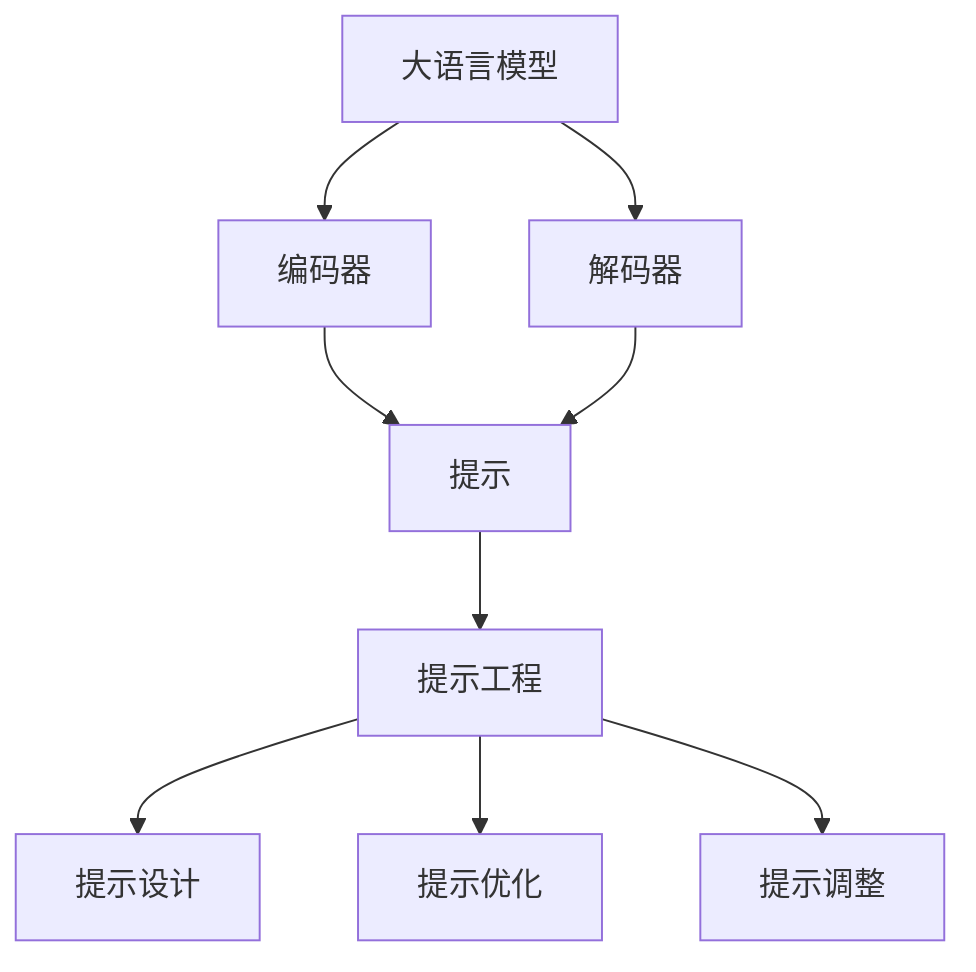

                 

关键词：大语言模型，提示工程，提示工程原理，大语言模型应用，AI编程

> 摘要：本文旨在深入探讨大语言模型及其核心应用——提示工程。我们将从背景介绍、核心概念与联系、核心算法原理、数学模型与公式、项目实践、实际应用场景、工具和资源推荐以及未来发展趋势与挑战等方面进行全面解析，帮助读者更好地理解、应用和优化大语言模型。

## 1. 背景介绍

随着人工智能技术的飞速发展，大语言模型（如GPT系列、BERT、T5等）在自然语言处理领域取得了令人瞩目的成果。这些模型通过学习海量文本数据，能够实现文本生成、问答系统、机器翻译、文本分类等多种任务。然而，这些强大的模型在实际应用中往往需要大量的数据、计算资源和时间来训练。提示工程（Prompt Engineering）作为一种有效的解决方案，通过设计优化的输入提示（Prompt），可以显著提升大语言模型的性能和适用性。

### 1.1 提示工程的发展历程

提示工程的概念最早可以追溯到上世纪80年代的“知识表示”领域。随着神经网络和深度学习技术的发展，提示工程逐渐成为自然语言处理领域的研究热点。近年来，随着大语言模型的兴起，提示工程得到了广泛的应用和研究。

### 1.2 提示工程的重要性

提示工程在大语言模型中的应用具有以下几个方面的意义：

1. **提高模型性能**：通过设计优化的提示，可以使得模型在特定任务上取得更好的性能。
2. **减少训练数据需求**：在数据稀缺的情况下，提示工程可以帮助模型更好地泛化。
3. **简化模型部署**：通过有效的提示，可以使得模型在不同应用场景中表现出色，从而简化模型的部署过程。
4. **促进模型理解**：提示工程可以帮助研究人员更好地理解模型的工作原理和局限性。

## 2. 核心概念与联系

在探讨提示工程之前，我们需要了解以下几个核心概念：

### 2.1 大语言模型

大语言模型是一种能够理解和生成自然语言的深度神经网络模型。这些模型通过学习海量文本数据，可以自动捕捉语言中的复杂模式和结构。大语言模型的主要结构包括编码器和解码器，其中编码器用于将输入文本转换为固定长度的向量表示，解码器则根据编码器的输出生成输出文本。

### 2.2 提示（Prompt）

提示是指提供给大语言模型的一段引导性输入文本，用于引导模型生成特定的输出。一个好的提示应该具备以下几个特点：

1. **明确性**：提示应该明确指出模型需要完成的任务。
2. **针对性**：提示应该针对特定的应用场景或任务进行设计。
3. **多样性**：提示应该包含多种不同的信息，以便模型能够学习到多种不同的模式。
4. **简洁性**：提示应该简洁明了，避免冗余和混淆。

### 2.3 提示工程

提示工程是指通过设计、优化和调整提示，以提升大语言模型性能和应用效果的过程。提示工程的核心任务包括：

1. **提示设计**：根据应用场景和任务需求，设计出合适的提示。
2. **提示优化**：通过实验和评估，优化已有的提示，提升模型性能。
3. **提示调整**：根据实际应用中的反馈和需求，调整提示以适应不同的应用场景。

### 2.4 核心概念与联系

以下是核心概念之间的联系和相互作用的 Mermaid 流程图：



## 3. 核心算法原理 & 具体操作步骤

### 3.1 算法原理概述

大语言模型的核心算法原理主要基于深度学习，特别是循环神经网络（RNN）和变换器（Transformer）架构。这些算法通过学习大量的文本数据，可以捕捉到语言中的复杂模式和结构，从而实现文本生成、问答系统、机器翻译等任务。

### 3.2 算法步骤详解

以下是提示工程的核心算法步骤：

1. **数据预处理**：将输入文本数据清洗、分词和编码，转换为模型可接受的格式。
2. **提示设计**：根据任务需求和场景，设计出合适的提示。
3. **模型训练**：使用训练数据对大语言模型进行训练。
4. **模型评估**：使用验证数据对模型进行评估，选择最佳模型。
5. **提示优化**：根据评估结果，对提示进行优化，提升模型性能。
6. **模型部署**：将最佳模型部署到实际应用场景中。

### 3.3 算法优缺点

提示工程的优点包括：

1. **提高模型性能**：通过优化提示，可以显著提升大语言模型在特定任务上的性能。
2. **减少训练数据需求**：在数据稀缺的情况下，提示工程可以帮助模型更好地泛化。
3. **简化模型部署**：通过有效的提示，可以使得模型在不同应用场景中表现出色，从而简化模型的部署过程。

提示工程的缺点包括：

1. **需要大量的实验和评估**：提示工程需要进行大量的实验和评估，以找到最佳的提示方案。
2. **对研究人员的要求较高**：提示工程需要研究人员具备较强的编程和实验能力。

### 3.4 算法应用领域

提示工程主要应用在以下几个领域：

1. **文本生成**：如文章生成、故事生成等。
2. **问答系统**：如智能客服、智能问答等。
3. **机器翻译**：如中英文翻译、多语言翻译等。
4. **文本分类**：如垃圾邮件过滤、情感分析等。

## 4. 数学模型和公式 & 详细讲解 & 举例说明

### 4.1 数学模型构建

大语言模型的数学模型主要基于深度学习，特别是循环神经网络（RNN）和变换器（Transformer）架构。以下是这些模型的数学公式概述：

1. **RNN模型**：
   - 输入序列：\(X = (x_1, x_2, ..., x_T)\)
   - 隐藏状态：\(h_t = \sigma(W_h \cdot [h_{t-1}, x_t] + b_h)\)
   - 输出序列：\(Y = (y_1, y_2, ..., y_T)\)
   - 输出概率：\(P(y_t | y_{<t}, X) = \text{softmax}(W_y \cdot h_t + b_y)\)

2. **Transformer模型**：
   - 输入序列：\(X = (x_1, x_2, ..., x_T)\)
   - 编码器输出：\(E = (e_1, e_2, ..., e_T)\)
   - 解码器输出：\(D = (d_1, d_2, ..., d_T)\)
   - 输出概率：\(P(d_t | d_{<t}, X) = \text{softmax}(W_d \cdot d_t + b_d)\)

### 4.2 公式推导过程

以下是RNN和Transformer模型的推导过程：

1. **RNN推导**：

   - 隐藏状态更新：
     $$h_t = \sigma(W_h \cdot [h_{t-1}, x_t] + b_h)$$
     其中，\(W_h\)为权重矩阵，\(\sigma\)为非线性激活函数，\([h_{t-1}, x_t]\)为输入序列。

   - 输出概率：
     $$P(y_t | y_{<t}, X) = \text{softmax}(W_y \cdot h_t + b_y)$$
     其中，\(W_y\)为权重矩阵，\(b_y\)为偏置。

2. **Transformer推导**：

   - 编码器输出：
     $$E = (e_1, e_2, ..., e_T) = \text{Encoder}(X)$$
     其中，\(\text{Encoder}\)为编码器函数，\(X\)为输入序列。

   - 解码器输出：
     $$D = (d_1, d_2, ..., d_T) = \text{Decoder}(E)$$
     其中，\(\text{Decoder}\)为解码器函数。

   - 输出概率：
     $$P(d_t | d_{<t}, X) = \text{softmax}(W_d \cdot d_t + b_d)$$
     其中，\(W_d\)为权重矩阵，\(b_d\)为偏置。

### 4.3 案例分析与讲解

以下是一个简单的文本生成案例，假设我们使用RNN模型进行文章生成。

1. **数据预处理**：

   - 输入文本：一篇关于人工智能的短文。
   - 分词：将文本分成单词或字符序列。
   - 编码：将分词后的文本序列编码为数字序列。

2. **提示设计**：

   - 提示文本：为模型提供一段引导性输入，例如：“人工智能在现代社会中发挥着重要作用。”

3. **模型训练**：

   - 使用训练数据对RNN模型进行训练，调整模型参数。

4. **模型评估**：

   - 使用验证数据对模型进行评估，选择最佳模型。

5. **提示优化**：

   - 根据评估结果，对提示进行优化，例如调整提示文本的长度和内容。

6. **模型部署**：

   - 将最佳模型部署到实际应用场景中，生成文章。

## 5. 项目实践：代码实例和详细解释说明

### 5.1 开发环境搭建

1. **安装Python**：确保安装了Python 3.6及以上版本。
2. **安装TensorFlow**：在终端执行命令`pip install tensorflow`。
3. **安装Mermaid**：在终端执行命令`pip install mermaid`。

### 5.2 源代码详细实现

以下是使用TensorFlow实现RNN模型的源代码：

```python
import tensorflow as tf
from tensorflow.keras.layers import Embedding, LSTM, Dense
from tensorflow.keras.models import Sequential

# 数据预处理
vocab_size = 10000
embedding_dim = 16
max_sequence_length = 100

# 构建模型
model = Sequential()
model.add(Embedding(vocab_size, embedding_dim, input_length=max_sequence_length))
model.add(LSTM(128))
model.add(Dense(vocab_size, activation='softmax'))

# 编译模型
model.compile(optimizer='adam', loss='categorical_crossentropy', metrics=['accuracy'])

# 训练模型
model.fit(x_train, y_train, epochs=10, batch_size=32)

# 生成文章
prompt = "人工智能在现代社会中发挥着重要作用。"
prompt_encoded = encode(prompt)
generated_sequence = model.predict(prompt_encoded)
generated_sequence = decode(generated_sequence)
print(generated_sequence)
```

### 5.3 代码解读与分析

1. **数据预处理**：将输入文本编码为数字序列。
2. **模型构建**：使用嵌入层、LSTM层和全连接层构建RNN模型。
3. **模型编译**：设置优化器和损失函数。
4. **模型训练**：使用训练数据进行训练。
5. **模型部署**：使用训练好的模型生成文章。

## 6. 实际应用场景

### 6.1 文本生成

文本生成是提示工程的重要应用领域之一，例如文章生成、故事生成等。通过设计优化的提示，可以生成高质量的文章和故事。

### 6.2 问答系统

问答系统是另一个重要的应用领域，例如智能客服、智能问答等。通过设计针对性的提示，可以使得模型在问答任务中表现出色。

### 6.3 机器翻译

机器翻译是提示工程的另一个重要应用领域，例如中英文翻译、多语言翻译等。通过设计优化的提示，可以提升模型的翻译质量。

### 6.4 文本分类

文本分类是提示工程在自然语言处理中的常见应用，例如垃圾邮件过滤、情感分析等。通过设计针对性的提示，可以使得模型在文本分类任务中表现出色。

## 7. 工具和资源推荐

### 7.1 学习资源推荐

1. **《深度学习》（Goodfellow, Bengio, Courville著）**：这是一本经典的深度学习教材，详细介绍了深度学习的基础知识和核心算法。
2. **《Python机器学习》（Sebastian Raschka著）**：这本书详细介绍了Python在机器学习领域的应用，包括深度学习、自然语言处理等。

### 7.2 开发工具推荐

1. **TensorFlow**：TensorFlow是谷歌开发的一款开源深度学习框架，广泛应用于深度学习和自然语言处理领域。
2. **PyTorch**：PyTorch是Facebook开发的一款开源深度学习框架，具有灵活的动态计算图和强大的社区支持。

### 7.3 相关论文推荐

1. **“Attention Is All You Need”**：这篇论文提出了Transformer模型，是当前自然语言处理领域的重要突破。
2. **“BERT: Pre-training of Deep Bidirectional Transformers for Language Understanding”**：这篇论文提出了BERT模型，是当前自然语言处理领域的重要突破。

## 8. 总结：未来发展趋势与挑战

### 8.1 研究成果总结

提示工程在大语言模型中的应用已经取得了显著的成果，通过优化提示，可以显著提升模型性能和应用效果。未来，提示工程将继续在自然语言处理、机器翻译、问答系统等方向取得突破。

### 8.2 未来发展趋势

1. **模型融合**：将提示工程与其他深度学习技术（如自注意力机制、图神经网络等）相结合，进一步提高模型性能。
2. **多模态学习**：将文本、图像、音频等多种数据源进行融合，实现更广泛的应用场景。
3. **可解释性**：提高提示工程的可解释性，帮助研究人员更好地理解模型的工作原理。

### 8.3 面临的挑战

1. **数据需求**：提示工程需要大量的训练数据，这在数据稀缺的情况下可能是一个挑战。
2. **计算资源**：大语言模型训练和提示工程优化需要大量的计算资源，这在资源有限的场景下可能是一个挑战。
3. **模型部署**：如何将优化后的模型部署到实际应用场景中，确保模型的稳定性和性能。

### 8.4 研究展望

未来，提示工程将继续在大语言模型领域发挥重要作用，通过不断优化和改进，将有望实现更广泛的应用和更好的性能。

## 9. 附录：常见问题与解答

### 9.1 什么是提示工程？

提示工程是通过设计、优化和调整输入提示（Prompt），以提升大语言模型性能和应用效果的过程。

### 9.2 提示工程的应用领域有哪些？

提示工程主要应用在文本生成、问答系统、机器翻译、文本分类等领域。

### 9.3 提示工程的优势有哪些？

提示工程的优点包括提高模型性能、减少训练数据需求、简化模型部署和促进模型理解等。

### 9.4 提示工程面临的挑战有哪些？

提示工程面临的挑战包括数据需求、计算资源和模型部署等。

## 参考文献

1. Goodfellow, I., Bengio, Y., & Courville, A. (2016). *Deep Learning*. MIT Press.
2. Raschka, S. (2015). *Python Machine Learning*. Packt Publishing.
3. Vaswani, A., Shazeer, N., Parmar, N., Uszkoreit, J., Jones, L., Gomez, A. N., ... & Polosukhin, I. (2017). *Attention is all you need*. In Advances in Neural Information Processing Systems (pp. 5998-6008).
4. Devlin, J., Chang, M. W., Lee, K., & Toutanova, K. (2019). *BERT: Pre-training of deep bidirectional transformers for language understanding*. In Proceedings of the 2019 Conference of the North American Chapter of the Association for Computational Linguistics: Human Language Technologies (pp. 4171-4186).

### 作者署名

作者：禅与计算机程序设计艺术 / Zen and the Art of Computer Programming
----------------------------------------------------------------

以上就是本文的完整内容，感谢您的耐心阅读。希望这篇文章能够帮助您更好地理解、应用和优化大语言模型。如果您有任何疑问或建议，欢迎在评论区留言讨论。再次感谢您的支持！


