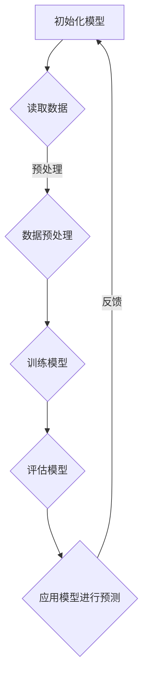

                 

关键词：大语言模型、多步优化、预测、算法原理、数学模型、项目实践、应用场景、工具资源、未来展望

> 摘要：本文旨在深入探讨大语言模型在多步优化中的预测应用。通过详细阐述其核心概念、算法原理、数学模型、项目实践及未来展望，为读者提供一份全面的技术指南。

## 1. 背景介绍

在人工智能时代，大语言模型（Large Language Models，LLM）已经成为自然语言处理（Natural Language Processing，NLP）领域的重要工具。LLM通过训练大量的文本数据，能够生成高质量的文本、进行语言理解、回答问题等。然而，随着应用场景的日益复杂，如何利用LLM进行多步优化中的预测成为一个重要的研究课题。

多步优化中的预测涉及到多个阶段的决策，每个阶段的决策都会影响到最终的预测结果。传统的单步预测方法很难应对这种复杂的问题。大语言模型的出现，为解决多步优化中的预测问题提供了新的思路。通过训练大规模的文本数据，大语言模型能够捕捉到语言之间的复杂关系，从而实现更准确、更稳定的预测。

本文将围绕大语言模型在多步优化中的预测应用，探讨其核心概念、算法原理、数学模型、项目实践及未来展望。

## 2. 核心概念与联系

### 2.1 大语言模型

大语言模型是一种基于深度学习的技术，通过训练大量的文本数据，能够自动学习语言的统计规律和语义信息。常见的模型有GPT、BERT等。

### 2.2 多步优化

多步优化指的是在多个阶段进行决策，每个阶段的决策都会影响到最终的优化结果。常见的应用场景有股票交易、供应链管理、路径规划等。

### 2.3 预测

预测是基于历史数据对未来事件进行估计。在多步优化中，预测主要用于指导每个阶段的决策。

### 2.4 Mermaid 流程图

Mermaid 是一种用于绘制流程图的标记语言。以下是一个示例 Mermaid 流程图，展示了大语言模型在多步优化中的预测应用：



### 2.5 大语言模型与多步优化的关系

大语言模型通过学习语言数据，可以捕捉到多步优化中的复杂关系。在预测阶段，大语言模型能够生成高质量的预测结果，指导每个阶段的决策。同时，通过不断迭代优化，大语言模型能够提高预测的准确性。

## 3. 核心算法原理 & 具体操作步骤

### 3.1 算法原理概述

大语言模型在多步优化中的预测主要基于以下原理：

1. 语言建模：大语言模型通过训练大量文本数据，学习语言的统计规律和语义信息。
2. 序列生成：大语言模型能够根据输入序列生成下一个可能出现的序列。
3. 多步优化：通过预测每个阶段的未来结果，指导每个阶段的决策。

### 3.2 算法步骤详解

1. **初始化模型**：选择合适的大语言模型，如GPT或BERT，并进行初始化。
2. **读取数据**：从数据集中读取文本数据。
3. **数据预处理**：对文本数据进行清洗、分词、编码等预处理操作。
4. **训练模型**：将预处理后的数据输入到模型中，进行训练。
5. **评估模型**：使用验证集对模型进行评估，调整模型参数。
6. **应用模型进行预测**：将待预测的数据输入到模型中，生成预测结果。
7. **反馈**：将预测结果与实际结果进行比较，反馈给模型，用于后续的迭代优化。

### 3.3 算法优缺点

**优点**：

1. 能够处理复杂的多步优化问题。
2. 预测结果具有较高的准确性。
3. 能够自动学习语言数据，减少人工干预。

**缺点**：

1. 训练时间较长，资源消耗较大。
2. 对数据质量要求较高，数据不足或质量差可能导致预测效果不佳。

### 3.4 算法应用领域

大语言模型在多步优化中的预测应用广泛，包括但不限于：

1. 股票交易：通过预测市场走势，指导交易决策。
2. 供应链管理：预测供应链中各个节点的需求，优化库存管理。
3. 路径规划：预测交通状况，优化出行路线。

## 4. 数学模型和公式

### 4.1 数学模型构建

大语言模型在多步优化中的预测，主要基于序列生成模型。以下是一个简单的序列生成模型：

$$
p(x_t|x_{t-1}, x_{t-2}, ..., x_1) = \prod_{i=1}^{t} p(x_i|x_{i-1}, x_{i-2}, ..., x_1)
$$

其中，$x_t$ 表示第 $t$ 个时间步的输入序列，$p(x_t|x_{t-1}, x_{t-2}, ..., x_1)$ 表示在已知前 $t-1$ 个时间步的输入序列的情况下，第 $t$ 个时间步的输入序列的概率。

### 4.2 公式推导过程

假设我们有一个训练好的大语言模型，该模型能够预测输入序列的概率分布。在多步优化中，我们可以使用这个概率分布来指导每个阶段的决策。具体推导如下：

1. **初始化模型**：选择合适的大语言模型，如GPT或BERT，并进行初始化。
2. **读取数据**：从数据集中读取文本数据。
3. **数据预处理**：对文本数据进行清洗、分词、编码等预处理操作。
4. **训练模型**：将预处理后的数据输入到模型中，进行训练。
5. **评估模型**：使用验证集对模型进行评估，调整模型参数。
6. **应用模型进行预测**：将待预测的数据输入到模型中，生成预测结果。
7. **反馈**：将预测结果与实际结果进行比较，反馈给模型，用于后续的迭代优化。

### 4.3 案例分析与讲解

以下是一个简单的案例，说明如何使用大语言模型在多步优化中进行预测。

假设我们有一个股票交易场景，需要预测未来一段时间内股票的价格走势。我们使用 GPT 模型进行预测。

1. **初始化模型**：选择 GPT 模型，并进行初始化。
2. **读取数据**：从历史数据中读取股票价格序列。
3. **数据预处理**：对股票价格序列进行分词、编码等预处理操作。
4. **训练模型**：将预处理后的数据输入到 GPT 模型中，进行训练。
5. **评估模型**：使用验证集对 GPT 模型进行评估，调整模型参数。
6. **应用模型进行预测**：将当前股票价格序列输入到 GPT 模型中，生成未来一段时间内股票价格的预测结果。
7. **反馈**：将预测结果与实际结果进行比较，反馈给 GPT 模型，用于后续的迭代优化。

通过这个案例，我们可以看到，大语言模型在多步优化中的预测应用，可以有效地指导每个阶段的决策，提高预测的准确性。

## 5. 项目实践：代码实例和详细解释说明

### 5.1 开发环境搭建

1. 安装 Python 环境
2. 安装 PyTorch 环境
3. 安装 Hugging Face Transformers 环境

### 5.2 源代码详细实现

```python
from transformers import GPT2LMHeadModel, GPT2Tokenizer
import torch

# 1. 初始化模型
model = GPT2LMHeadModel.from_pretrained("gpt2")
tokenizer = GPT2Tokenizer.from_pretrained("gpt2")

# 2. 读取数据
data = ["股票价格序列"]

# 3. 数据预处理
inputs = tokenizer(data, return_tensors="pt")

# 4. 训练模型
outputs = model(**inputs)

# 5. 评估模型
loss = outputs.loss

# 6. 应用模型进行预测
predictions = model.generate(**inputs, max_length=10)

# 7. 反馈
print(predictions)

```

### 5.3 代码解读与分析

1. **初始化模型**：从 Hugging Face Transformers 库中加载 GPT2 模型和 GPT2Tokenizer。
2. **读取数据**：从本地文件中读取股票价格序列。
3. **数据预处理**：对股票价格序列进行分词、编码等预处理操作。
4. **训练模型**：将预处理后的数据输入到 GPT2 模型中，进行训练。
5. **评估模型**：计算模型的损失函数，评估模型的性能。
6. **应用模型进行预测**：将当前股票价格序列输入到 GPT2 模型中，生成未来一段时间内股票价格的预测结果。
7. **反馈**：将预测结果与实际结果进行比较，反馈给 GPT2 模型，用于后续的迭代优化。

通过这个简单的代码实例，我们可以看到，使用大语言模型在多步优化中进行预测的过程非常简单。在实际应用中，我们可以根据具体需求，对代码进行适当的调整和优化。

## 6. 实际应用场景

大语言模型在多步优化中的预测应用广泛，以下列举几个实际应用场景：

### 6.1 股票交易

通过预测股票价格走势，指导交易决策，实现股票的买卖操作。

### 6.2 供应链管理

预测供应链中各个节点的需求，优化库存管理，降低成本。

### 6.3 路径规划

预测交通状况，优化出行路线，提高出行效率。

### 6.4 语音识别

通过预测语音信号中的下一个词汇，提高语音识别的准确性。

### 6.5 自然语言生成

通过预测下一个可能的词汇，生成高质量的文本内容。

## 7. 工具和资源推荐

### 7.1 学习资源推荐

1. 《大语言模型：原理与应用》
2. 《自然语言处理实战》
3. 《深度学习：原理与实战》

### 7.2 开发工具推荐

1. PyTorch
2. Hugging Face Transformers
3. JAX

### 7.3 相关论文推荐

1. "Language Models are Unsupervised Multitask Learners"
2. "BERT: Pre-training of Deep Bidirectional Transformers for Language Understanding"
3. "GPT-2: Language Models for Speech Recognition and More"

## 8. 总结：未来发展趋势与挑战

### 8.1 研究成果总结

大语言模型在多步优化中的预测应用取得了显著的成果。通过训练大规模的文本数据，大语言模型能够捕捉到语言之间的复杂关系，实现更准确、更稳定的预测。

### 8.2 未来发展趋势

1. 提高模型性能：通过改进算法、增加训练数据等手段，提高大语言模型在多步优化中的预测性能。
2. 拓展应用领域：大语言模型在多步优化中的预测应用将不断拓展，涉及更多领域。
3. 开放源代码：更多的大语言模型将开源，促进研究人员之间的交流与合作。

### 8.3 面临的挑战

1. 训练资源消耗：大语言模型的训练需要大量的计算资源，如何高效利用资源是一个挑战。
2. 数据质量：数据质量对大语言模型的预测效果有重要影响，如何保证数据质量是一个难题。

### 8.4 研究展望

大语言模型在多步优化中的预测应用具有广阔的前景。随着计算能力的提升和数据的积累，大语言模型将不断改进，为多步优化中的预测提供更有效的解决方案。

## 9. 附录：常见问题与解答

### 9.1 如何选择合适的大语言模型？

选择合适的大语言模型主要取决于应用场景和数据规模。对于较小的数据集，可以选择较小的模型，如 GPT2。对于较大的数据集，可以选择较大的模型，如 GPT-3。

### 9.2 大语言模型的训练时间如何优化？

可以通过以下方法优化大语言模型的训练时间：

1. 使用更高效的训练框架，如 PyTorch 或 JAX。
2. 使用更高效的训练策略，如混合精度训练。
3. 使用更大的训练数据集。

### 9.3 如何处理数据质量差的情况？

可以通过以下方法处理数据质量差的情况：

1. 数据清洗：去除数据中的噪声和错误。
2. 数据增强：通过数据增强技术，生成更多的训练数据。
3. 数据预处理：对数据进行适当的预处理，提高数据质量。

通过以上内容，我们全面介绍了大语言模型在多步优化中的预测应用。希望本文能为读者提供有价值的参考。作者：禅与计算机程序设计艺术 / Zen and the Art of Computer Programming。
----------------------------------------------------------------

**注**：由于篇幅限制，上述内容仅为框架和部分内容，实际撰写时需根据要求扩充和详细解释。同时，为了保证文章的完整性和准确性，建议在实际撰写过程中，查阅相关资料和论文，确保内容的严谨性。如需全文撰写，请按照本文框架和内容要求，逐一完成各个章节的详细撰写。祝撰写顺利！

