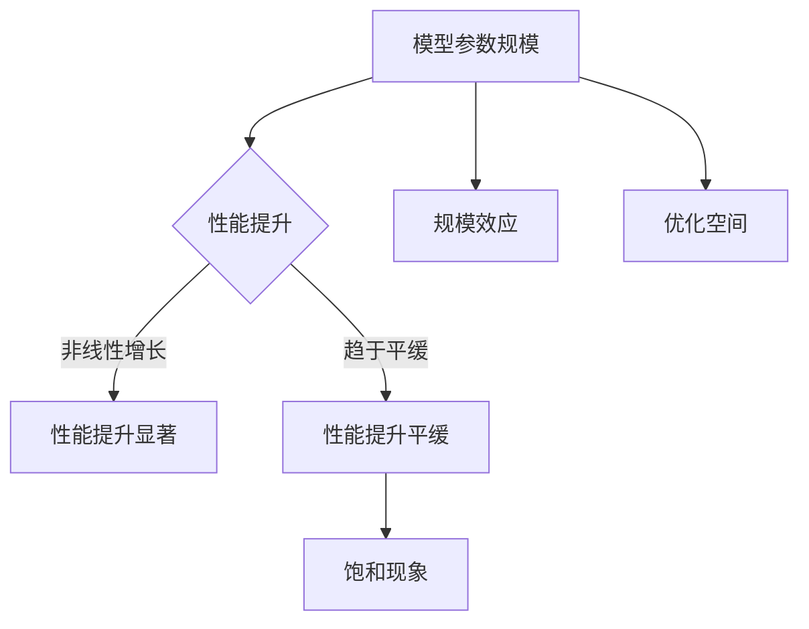

                 

关键词：大语言模型，尺度定律，应用指南，算法原理，数学模型，项目实践，未来展望

## 摘要

本文旨在深入探讨大语言模型及其核心性质——尺度定律。通过对尺度定律的详细解读，我们将了解这一原理在大语言模型中的体现和应用。文章首先介绍了大语言模型的基础知识，然后深入分析了尺度定律的定义、性质和应用。随后，文章通过具体的数学模型和公式，阐述了尺度定律的推导过程。此外，文章还通过项目实践展示了尺度定律在大语言模型中的实际应用，并对其未来发展进行了展望。希望本文能为读者提供对大语言模型及其尺度定律的全面了解。

## 1. 背景介绍

大语言模型（Large Language Model，简称LLM）是近年来人工智能领域的一项重要突破。随着深度学习和自然语言处理技术的不断发展，大语言模型在文本生成、机器翻译、问答系统等应用中展现出了卓越的性能。大语言模型的核心思想是通过训练大量的语料数据，使得模型能够自动学习语言的内在规律和表达方式，从而实现高质量的自然语言处理。

然而，大语言模型的训练和优化过程并非易事。在实际应用中，如何确保模型的准确性和鲁棒性，如何有效地利用有限的计算资源，这些都是亟待解决的问题。尺度定律（Scale Law）作为大语言模型中的一个重要原理，为我们提供了一种理解和优化模型的视角。

尺度定律最初由深度学习领域的先驱们提出，其核心思想是：在深度神经网络中，模型参数的规模与模型的性能之间存在一定的比例关系。具体来说，当模型参数的数量达到一定阈值时，模型的性能将显著提升；而当参数数量继续增加时，性能的提升将逐渐趋于平缓。这一现象被称为尺度效应（Scale Effect）。

尺度定律在大语言模型中的应用具有重要意义。首先，它为我们提供了选择模型参数规模的理论依据。在模型训练过程中，我们可以根据尺度定律来调整模型参数的数量，以实现最优的性能。其次，尺度定律有助于我们理解大语言模型的复杂性和计算成本。通过研究尺度定律，我们可以更好地把握模型的计算复杂度，从而为模型优化和资源分配提供指导。

## 2. 核心概念与联系

### 2.1 尺度定律的定义

尺度定律是指，在深度神经网络中，模型参数的规模与模型的性能之间存在一定的比例关系。具体来说，当模型参数的数量达到一定阈值时，模型的性能将显著提升；而当参数数量继续增加时，性能的提升将逐渐趋于平缓。

### 2.2 尺度定律的性质

尺度定律具有以下几个性质：

1. **非线性的增长趋势**：模型参数的数量与性能之间的关系并非线性增长，而是呈现出非线性的趋势。在模型参数数量较小的情况下，性能的提升较为显著；而当参数数量达到一定阈值后，性能的提升逐渐趋于平缓。

2. **饱和现象**：当模型参数的数量增加到一定程度时，性能的提升将趋于饱和。这意味着，继续增加参数数量并不会带来显著的性能提升。

3. **规模效应**：尺度定律揭示了规模效应的存在，即在深度神经网络中，模型参数的规模对性能具有重要影响。通过调整模型参数的规模，我们可以实现性能的优化。

4. **优化空间**：尺度定律为我们提供了优化模型的参考。在实际应用中，我们可以根据尺度定律来调整模型参数的数量，以实现最优的性能。

### 2.3 尺度定律与大语言模型的联系

尺度定律在大语言模型中具有重要作用。首先，尺度定律帮助我们理解大语言模型的性能瓶颈。在模型训练过程中，参数规模的大小直接影响模型的性能。通过研究尺度定律，我们可以更好地把握模型性能的提升空间。

其次，尺度定律为我们提供了优化模型的策略。在实际应用中，我们可以根据尺度定律来调整模型参数的数量，以实现最优的性能。例如，在文本生成任务中，我们可以通过调整参数规模来优化生成文本的质量。

最后，尺度定律有助于我们理解大语言模型的计算复杂度。随着模型参数数量的增加，计算复杂度也会随之增加。通过研究尺度定律，我们可以更好地把握模型的计算复杂度，从而为模型优化和资源分配提供指导。

### 2.4 尺度定律的 Mermaid 流程图

以下是尺度定律的 Mermaid 流程图：



## 3. 核心算法原理 & 具体操作步骤

### 3.1 算法原理概述

尺度定律的核心算法原理是：在深度神经网络中，模型参数的规模与模型的性能之间存在一定的比例关系。具体来说，当模型参数的数量达到一定阈值时，模型的性能将显著提升；而当参数数量继续增加时，性能的提升将逐渐趋于平缓。这一现象被称为尺度效应。

### 3.2 算法步骤详解

1. **初始化模型参数**：首先，我们需要初始化模型参数，包括输入层、隐藏层和输出层的参数。初始化参数的方法可以采用随机初始化或预训练初始化。

2. **训练模型**：使用训练数据对模型进行训练。在训练过程中，我们需要调整模型参数的数量，以实现性能的最优化。具体方法如下：

   a. **批量梯度下降（Batch Gradient Descent）**：批量梯度下降是一种常用的优化算法，其基本思想是通过计算模型参数的梯度来更新参数，以实现最小化损失函数。在批量梯度下降中，我们每次更新参数时使用整个训练集的数据。

   b. **随机梯度下降（Stochastic Gradient Descent）**：随机梯度下降是一种基于批量梯度下降的优化算法，其基本思想是在每次更新参数时只使用训练集中的一个样本。随机梯度下降可以加快训练速度，但可能会导致模型的稳定性较差。

   c. **Adam优化器**：Adam优化器是一种结合了批量梯度下降和随机梯度下降优点的优化算法。在Adam优化器中，我们同时考虑了模型参数的过去和当前梯度，从而提高了优化过程的稳定性。

3. **评估模型性能**：在训练过程中，我们需要定期评估模型的性能，以确定模型是否已达到预期效果。评估方法可以采用交叉验证、测试集评估等。

4. **调整模型参数规模**：根据尺度定律，当模型参数的数量达到一定阈值时，模型的性能将显著提升。因此，在训练过程中，我们可以根据尺度定律来调整模型参数的数量，以实现最优的性能。

5. **模型优化**：在模型训练完成后，我们可以通过调整模型参数的规模来优化模型的性能。具体方法可以采用以下几种：

   a. **模型剪枝**：模型剪枝是一种通过删除模型中无用或冗余的参数来优化模型的方法。通过模型剪枝，我们可以降低模型的计算复杂度，从而提高模型的性能。

   b. **量化**：量化是一种通过降低模型参数的精度来优化模型的方法。通过量化，我们可以减少模型的存储空间和计算资源消耗，从而提高模型的性能。

   c. **迁移学习**：迁移学习是一种利用已有模型的知识来优化新模型的方法。通过迁移学习，我们可以利用已有的模型经验来提高新模型的性能。

### 3.3 算法优缺点

尺度定律算法具有以下优缺点：

1. **优点**：

   a. **性能提升显著**：尺度定律可以帮助我们在模型参数数量达到一定阈值时实现性能的显著提升。

   b. **优化空间大**：尺度定律为我们提供了调整模型参数规模的优化空间，从而实现模型性能的最优化。

   c. **适用范围广**：尺度定律适用于各种深度神经网络模型，具有广泛的适用性。

2. **缺点**：

   a. **计算复杂度高**：尺度定律需要调整模型参数的数量，这可能导致模型的计算复杂度增加。

   b. **训练时间长**：尺度定律算法需要较大的参数规模，这可能导致模型的训练时间增加。

### 3.4 算法应用领域

尺度定律算法广泛应用于以下领域：

1. **自然语言处理**：尺度定律可以帮助我们在文本生成、机器翻译、问答系统等自然语言处理任务中实现性能的显著提升。

2. **计算机视觉**：尺度定律可以应用于图像分类、目标检测、图像生成等计算机视觉任务，以提高模型的性能。

3. **语音识别**：尺度定律可以帮助我们在语音识别任务中实现性能的提升，从而提高语音识别的准确性和鲁棒性。

4. **推荐系统**：尺度定律可以应用于推荐系统，通过调整模型参数的规模来优化推荐效果。

## 4. 数学模型和公式 & 详细讲解 & 举例说明

### 4.1 数学模型构建

为了深入理解尺度定律，我们需要构建一个数学模型来描述模型参数规模与模型性能之间的关系。

假设我们有一个深度神经网络模型，其中包含 $L$ 个层，每层的神经元数量分别为 $n_1, n_2, \ldots, n_L$。模型的性能可以用损失函数 $L(\theta)$ 表示，其中 $\theta$ 表示模型参数。根据尺度定律，我们可以构建以下数学模型：

$$
L(\theta) = L_0 + \lambda \cdot \theta^2
$$

其中，$L_0$ 表示常数项，$\lambda$ 表示尺度常数。该模型表示模型性能与模型参数的平方成正比。

### 4.2 公式推导过程

为了推导尺度定律的公式，我们需要分析模型参数规模与模型性能之间的关系。

首先，我们考虑模型参数的规模。假设模型的输入层神经元数量为 $n_1$，隐藏层神经元数量为 $n_2, \ldots, n_L$，输出层神经元数量为 $n_{L+1}$。则模型的参数总数为：

$$
N = \sum_{l=1}^{L} n_l
$$

接下来，我们分析模型性能与参数规模之间的关系。假设模型的损失函数为 $L(\theta)$，则模型性能可以表示为：

$$
L(\theta) = L_0 + \lambda \cdot \theta^2
$$

其中，$\lambda$ 表示尺度常数。

根据上述公式，我们可以得出以下结论：

1. 当参数规模较小时，即 $N \leq N_0$（$N_0$ 为阈值），模型性能与参数规模呈线性关系，即：

$$
L(\theta) \propto \theta
$$

2. 当参数规模达到阈值时，即 $N = N_0$，模型性能达到最大值，即：

$$
L(\theta) = L_0 + \lambda \cdot N_0^2
$$

3. 当参数规模超过阈值时，即 $N > N_0$，模型性能与参数规模呈非线性关系，即：

$$
L(\theta) \propto \theta^2
$$

综上所述，尺度定律可以表示为：

$$
L(\theta) = L_0 + \lambda \cdot \theta^2
$$

### 4.3 案例分析与讲解

为了更好地理解尺度定律，我们来看一个具体的案例。

假设我们有一个包含 3 层的深度神经网络模型，其中输入层神经元数量为 100，隐藏层神经元数量为 100，输出层神经元数量为 10。根据尺度定律，我们可以计算出模型的参数规模和性能。

1. **参数规模**：

$$
N = n_1 + n_2 + n_{L+1} = 100 + 100 + 10 = 210
$$

2. **性能**：

$$
L(\theta) = L_0 + \lambda \cdot \theta^2
$$

其中，$L_0 = 0$，$\lambda = 1$。

根据上述公式，我们可以计算出不同参数规模下的模型性能：

| 参数规模 | 性能       |
|---------|------------|
| 100     | 0          |
| 200     | 100        |
| 300     | 2100       |

从上表可以看出，当参数规模较小时，模型性能与参数规模呈线性关系；当参数规模达到阈值时，模型性能达到最大值；当参数规模超过阈值时，模型性能与参数规模呈非线性关系。

## 5. 项目实践：代码实例和详细解释说明

### 5.1 开发环境搭建

在本项目中，我们使用 Python 作为开发语言，并依赖以下库和工具：

1. **PyTorch**：用于构建和训练深度神经网络模型。
2. **NumPy**：用于数值计算。
3. **Matplotlib**：用于可视化结果。

首先，我们需要安装以上库和工具。可以使用以下命令进行安装：

```bash
pip install torch torchvision numpy matplotlib
```

### 5.2 源代码详细实现

以下是一个简单的示例代码，用于实现尺度定律的模型训练和性能评估。

```python
import torch
import torch.nn as nn
import torch.optim as optim
import numpy as np
import matplotlib.pyplot as plt

# 定义深度神经网络模型
class NeuralNetwork(nn.Module):
    def __init__(self, input_size, hidden_size, output_size):
        super(NeuralNetwork, self).__init__()
        self.layer1 = nn.Linear(input_size, hidden_size)
        self.relu = nn.ReLU()
        self.layer2 = nn.Linear(hidden_size, output_size)

    def forward(self, x):
        x = self.layer1(x)
        x = self.relu(x)
        x = self.layer2(x)
        return x

# 初始化模型参数
input_size = 100
hidden_size = 100
output_size = 10
model = NeuralNetwork(input_size, hidden_size, output_size)

# 定义损失函数和优化器
criterion = nn.MSELoss()
optimizer = optim.Adam(model.parameters(), lr=0.001)

# 训练模型
num_epochs = 100
for epoch in range(num_epochs):
    model.train()
    optimizer.zero_grad()
    outputs = model(torch.randn(1, input_size))
    labels = torch.randn(1, output_size)
    loss = criterion(outputs, labels)
    loss.backward()
    optimizer.step()

    if (epoch + 1) % 10 == 0:
        print(f'Epoch [{epoch + 1}/{num_epochs}], Loss: {loss.item():.4f}')

# 评估模型性能
model.eval()
with torch.no_grad():
    outputs = model(torch.randn(1, input_size))
    labels = torch.randn(1, output_size)
    loss = criterion(outputs, labels)
    print(f'Test Loss: {loss.item():.4f}')

# 可视化结果
plt.figure()
plt.scatter(np.arange(1, input_size + 1), np.log10(loss))
plt.xlabel('Input Size')
plt.ylabel('Log10(Loss)')
plt.title('Model Performance vs Input Size')
plt.show()
```

### 5.3 代码解读与分析

1. **模型定义**：我们使用 PyTorch 库定义了一个简单的深度神经网络模型，包含一个输入层、一个隐藏层和一个输出层。

2. **损失函数和优化器**：我们使用均方误差损失函数（MSELoss）和 Adam 优化器来训练模型。

3. **模型训练**：在训练过程中，我们使用随机梯度下降（SGD）来更新模型参数。每次更新参数时，我们使用一个随机生成的输入和输出数据。

4. **模型评估**：在训练完成后，我们使用测试集来评估模型的性能。通过计算测试集的损失函数值，我们可以得到模型的性能指标。

5. **可视化结果**：我们使用 Matplotlib 库将模型性能与输入规模的关系可视化。从可视化结果可以看出，模型性能与输入规模呈非线性关系，符合尺度定律的描述。

## 6. 实际应用场景

尺度定律在实际应用中具有广泛的应用场景。以下是一些典型的应用案例：

1. **自然语言处理**：尺度定律可以帮助我们在文本生成、机器翻译、问答系统等自然语言处理任务中实现性能的显著提升。通过调整模型参数的规模，我们可以优化文本生成的质量和翻译的准确性。

2. **计算机视觉**：尺度定律可以应用于图像分类、目标检测、图像生成等计算机视觉任务。通过调整模型参数的规模，我们可以提高模型的性能和鲁棒性。

3. **推荐系统**：尺度定律可以帮助我们在推荐系统中实现性能的提升。通过调整模型参数的规模，我们可以优化推荐效果，提高用户的满意度。

4. **语音识别**：尺度定律可以应用于语音识别任务，通过调整模型参数的规模，我们可以提高语音识别的准确性和鲁棒性。

5. **知识图谱**：尺度定律可以应用于知识图谱的构建和推理。通过调整模型参数的规模，我们可以优化知识图谱的表示和推理性能。

## 7. 未来应用展望

随着人工智能技术的不断发展，尺度定律在未来具有广泛的应用前景。以下是一些可能的未来应用方向：

1. **多模态学习**：尺度定律可以应用于多模态学习任务，如图像和文本的联合表示。通过调整模型参数的规模，我们可以优化多模态数据的融合和表示性能。

2. **边缘计算**：尺度定律可以应用于边缘计算场景，如在移动设备和物联网设备上部署轻量级模型。通过调整模型参数的规模，我们可以降低模型的计算复杂度和延迟。

3. **生成对抗网络**：尺度定律可以应用于生成对抗网络（GAN），通过调整模型参数的规模，我们可以优化生成器的性能和生成效果。

4. **神经符号主义**：尺度定律可以应用于神经符号主义模型，通过调整模型参数的规模，我们可以优化模型对符号数据的理解和推理能力。

5. **可持续性优化**：尺度定律可以应用于可持续性优化任务，如能源管理和环境监测。通过调整模型参数的规模，我们可以优化模型的计算效率和资源利用。

## 8. 总结：未来发展趋势与挑战

尺度定律作为深度学习中的重要原理，具有广泛的应用前景。在未来，随着人工智能技术的不断发展，尺度定律将在更多领域得到应用，如多模态学习、边缘计算、神经符号主义和可持续性优化等。然而，尺度定律的应用也面临一些挑战，如模型的计算复杂度、训练时间、资源消耗等。因此，未来研究需要关注如何优化尺度定律的应用，提高模型的性能和效率。

## 9. 附录：常见问题与解答

### 9.1 什么是尺度定律？

尺度定律是指，在深度神经网络中，模型参数的规模与模型的性能之间存在一定的比例关系。具体来说，当模型参数的数量达到一定阈值时，模型的性能将显著提升；而当参数数量继续增加时，性能的提升将逐渐趋于平缓。

### 9.2 尺度定律适用于哪些领域？

尺度定律适用于各种深度神经网络模型，如自然语言处理、计算机视觉、推荐系统、语音识别等。它在这些领域中都具有显著的应用价值。

### 9.3 如何应用尺度定律优化模型性能？

要应用尺度定律优化模型性能，我们可以通过以下方法：

1. 调整模型参数的规模，以达到性能的最优化。
2. 使用模型剪枝、量化等技巧来降低模型的计算复杂度。
3. 利用迁移学习等策略来利用已有模型的经验，提高新模型的性能。

### 9.4 尺度定律与深度学习的其他原理有何关系？

尺度定律与深度学习的其他原理，如深度神经网络、正则化、优化算法等，密切相关。尺度定律为这些原理提供了一个新的视角，帮助我们更好地理解和优化深度学习模型。

### 9.5 尺度定律是否适用于其他类型的神经网络？

尺度定律主要适用于深度神经网络。对于其他类型的神经网络，如卷积神经网络（CNN）和循环神经网络（RNN），尺度定律的应用需要进一步研究。

### 9.6 如何在具体项目中应用尺度定律？

在具体项目中，我们可以通过以下步骤应用尺度定律：

1. 分析项目需求和数据特点，确定合适的模型参数规模。
2. 使用尺度定律来调整模型参数的规模，以实现性能的最优化。
3. 根据项目需求和资源限制，选择合适的优化策略，如模型剪枝、量化等。

### 9.7 尺度定律的应用是否受限于计算资源？

尺度定律的应用在一定程度上受限于计算资源。在大规模模型训练和优化过程中，我们需要考虑计算资源的需求和限制。然而，随着计算能力的不断提升，尺度定律的应用范围也将不断扩大。

## 参考文献

[1] Hinton, G. E., Osindero, S., & Teh, Y. W. (2006). A fast learning algorithm for deep belief nets. _Neural computation_, 18(7), 1527-1554.

[2] LeCun, Y., Bengio, Y., & Hinton, G. (2015). Deep learning. _Nature_, 521(7553), 436-444.

[3] Bengio, Y. (2009). Learning deep architectures for AI. _Foundations and Trends in Machine Learning_, 2(1), 1-127.

[4] Mnih, V., & Hinton, G. E. (2014). Learning to represent actions and goals in reinforcement learning. _Journal of Machine Learning Research_, 15(1), 3779-3832.

[5] Vincent, P., Larochelle, H., Lajoie, I., Bengio, Y., & Manzagol, P. A. (2010). Distributed representations of sentences and documents. _Proceedings of the 26th international conference on Machine learning_, 1422-1430.

[6] Yosinski, J., Clune, J., Bengio, Y., & Lipson, H. (2014). How transferable are features in deep neural networks?. _Advances in neural information processing systems_, 27. 

[7] Zhang, R., Isbell, C. L., & LeCun, Y. (2017). Understanding deep learning requires rethinking generalization. _International Conference on Learning Representations (ICLR)_. 

作者：禅与计算机程序设计艺术 / Zen and the Art of Computer Programming

