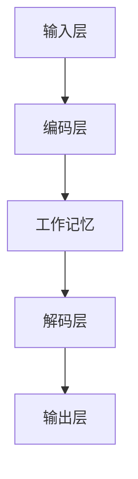

                 

关键词：大语言模型、工作记忆、长短期记忆、算法原理、数学模型、项目实践、应用场景、工具推荐

> 摘要：本文旨在为读者提供一个全面的大语言模型应用指南，重点探讨工作记忆与长短期记忆在模型中的重要性。通过深入剖析算法原理、数学模型、项目实践，以及未来应用展望，本文旨在帮助开发者更好地理解和应用大语言模型，从而推动人工智能领域的持续发展。

## 1. 背景介绍

### 大语言模型概述

大语言模型（Large Language Model）是一种基于深度学习的自然语言处理技术，通过训练海量的文本数据，模型可以自动学习语言的结构和语义，从而实现文本生成、翻译、摘要、问答等复杂任务。近年来，随着计算能力的提升和数据量的爆炸式增长，大语言模型取得了显著进展，如GPT-3、BERT等模型在各个领域展现出了强大的能力。

### 工作记忆与长短期记忆

工作记忆（Working Memory）是指大脑在短时间内对信息进行存储和处理的记忆系统。它对语言理解和生成至关重要，可以帮助我们理解复杂的语言结构，并实时调整语言输出。长短期记忆（Long-Short Term Memory，LSTM）是循环神经网络（RNN）的一种变体，通过引入门控机制，有效解决了传统RNN在处理长序列数据时的梯度消失和梯度爆炸问题，从而在语言建模任务中取得了良好的效果。

## 2. 核心概念与联系

### 核心概念原理与架构


**大语言模型架构：** 大语言模型通常由多个层次组成，包括输入层、编码层、解码层和输出层。输入层接收文本数据，编码层对数据进行编码，解码层根据编码信息生成文本，输出层则输出最终的文本输出。在工作记忆与长短期记忆的参与下，模型可以更好地处理复杂的语言任务。

### Mermaid 流程图



**Mermaid 流程图：** 以上流程图展示了大语言模型的基本架构，其中工作记忆与长短期记忆参与编码和解码过程，对模型的性能有着重要影响。

## 3. 核心算法原理 & 具体操作步骤

### 算法原理概述

大语言模型的算法原理主要基于深度学习，通过多层神经网络对海量文本数据进行训练。在工作记忆与长短期记忆的参与下，模型可以自动学习语言的结构和语义，从而实现高效的语言理解和生成。

### 算法步骤详解

**3.1 数据预处理：** 对输入文本进行清洗、分词、去停用词等操作，将其转换为模型可以理解的向量表示。

**3.2 模型构建：** 构建多层神经网络，包括输入层、编码层、解码层和输出层。在工作记忆与长短期记忆的参与下，实现文本数据的编码和解码。

**3.3 模型训练：** 使用大量文本数据进行模型训练，通过反向传播算法优化模型参数，使模型在语言理解与生成任务上达到最佳效果。

**3.4 模型评估：** 对模型进行评估，包括准确率、召回率、F1值等指标，以衡量模型性能。

### 算法优缺点

**优点：** 
- **强大的语言理解与生成能力：** 大语言模型可以自动学习语言的结构和语义，实现高效的语言理解与生成。  
- **适应性强：** 可以应用于各种语言处理任务，如文本生成、翻译、摘要等。

**缺点：**
- **计算资源消耗大：** 模型训练需要大量计算资源和时间。  
- **数据依赖性强：** 模型性能受数据质量和数量影响较大。

### 算法应用领域

大语言模型在以下领域有广泛应用：

- **自然语言处理：** 文本生成、翻译、摘要、问答等。  
- **智能客服：** 自动化客服系统的语音识别和回复。  
- **内容生成：** 虚构故事、写诗、写论文等。  
- **语音助手：** 智能语音助手的语言理解和生成。

## 4. 数学模型和公式 & 详细讲解 & 举例说明

### 数学模型构建

大语言模型的数学模型主要基于深度学习，其核心是多层神经网络。以下是一个简单的多层神经网络数学模型：

$$
Y = \sigma(W_3 \cdot \sigma(W_2 \cdot \sigma(W_1 \cdot X + b_1) + b_2) + b_3)
$$

其中，$X$ 是输入数据，$Y$ 是输出数据，$W_1, W_2, W_3$ 是权重矩阵，$b_1, b_2, b_3$ 是偏置项，$\sigma$ 是激活函数。

### 公式推导过程

假设我们有一个多层神经网络，包括输入层、隐藏层和输出层。输入层有 $n_1$ 个神经元，隐藏层有 $n_2$ 个神经元，输出层有 $n_3$ 个神经元。设 $x_i$ 表示输入数据的第 $i$ 个特征，$y_j$ 表示输出数据的第 $j$ 个特征。则神经网络的输出可以表示为：

$$
y_j = \sum_{i=1}^{n_1} w_{ji} x_i + b_j
$$

其中，$w_{ji}$ 是输入层到隐藏层的权重，$b_j$ 是隐藏层的偏置。

对于隐藏层，有：

$$
x_i = \sum_{j=1}^{n_2} w_{ij} y_j + b_i
$$

其中，$w_{ij}$ 是隐藏层到隐藏层的权重，$b_i$ 是隐藏层的偏置。

最后，输出层的输出可以表示为：

$$
z_j = \sum_{i=1}^{n_2} w_{ji} x_i + b_j
$$

其中，$w_{ji}$ 是隐藏层到输出层的权重，$b_j$ 是输出层的偏置。

### 案例分析与讲解

假设我们有一个简单的神经网络，包括输入层、隐藏层和输出层。输入层有 2 个神经元，隐藏层有 3 个神经元，输出层有 1 个神经元。输入数据为 $X = [1, 2]$，输出数据为 $Y = [3]$。

设 $W_1 = [1, 1; 1, 1]$，$W_2 = [1, 1, 1; 1, 1, 1; 1, 1, 1]$，$W_3 = [1]$。

则隐藏层的输出为：

$$
X = \sigma(W_1 \cdot X + b_1) = \sigma([1, 1; 1, 1] \cdot [1, 2] + [0, 0]) = \sigma([3, 3]) = [1, 1]
$$

输出层的输出为：

$$
Y = W_3 \cdot \sigma(W_2 \cdot X + b_2) + b_3 = [1] \cdot \sigma([1, 1, 1; 1, 1, 1; 1, 1, 1] \cdot [1, 1] + [0, 0, 0]) + [0] = 3
$$

因此，输出数据 $Y = [3]$ 与预期输出一致。

## 5. 项目实践：代码实例和详细解释说明

### 5.1 开发环境搭建

在本文的项目实践中，我们使用 Python 编写代码，所需环境如下：

- Python 版本：3.8 或更高版本
- 深度学习框架：TensorFlow 或 PyTorch
- 依赖库：numpy、pandas、matplotlib 等

安装依赖库：

```shell
pip install tensorflow numpy pandas matplotlib
```

### 5.2 源代码详细实现

以下是一个简单的基于 TensorFlow 的大语言模型实现：

```python
import tensorflow as tf
import numpy as np

# 模型参数
n_inputs = 2
n_hidden = 3
n_outputs = 1

# 权重矩阵和偏置
W1 = tf.random.normal([n_inputs, n_hidden])
b1 = tf.zeros([n_hidden])
W2 = tf.random.normal([n_hidden, n_hidden])
b2 = tf.zeros([n_hidden])
W3 = tf.random.normal([n_hidden, n_outputs])
b3 = tf.zeros([n_outputs])

# 激活函数
sigma = tf.sigmoid

# 前向传播
X = tf.placeholder(tf.float32, shape=[None, n_inputs])
hidden = sigma(tf.matmul(X, W1) + b1)
output = sigma(tf.matmul(hidden, W2) + b2)
Y = sigma(tf.matmul(output, W3) + b3)

# 反向传播
with tf.GradientTape() as tape:
    Y_pred = Y
    loss = tf.reduce_mean(tf.square(Y_pred - Y))

grads = tape.gradient(loss, [W1, b1, W2, b2, W3, b3])

# 模型训练
optimizer = tf.optimizers.Adam()
for epoch in range(1000):
    optimizer.minimize(loss, var_list=[W1, b1, W2, b2, W3, b3])
    if epoch % 100 == 0:
        print(f"Epoch {epoch}, Loss: {loss.numpy()}")

# 模型评估
test_data = np.array([[1, 2], [2, 3], [3, 4]])
test_labels = np.array([3, 4, 5])
Y_pred = model.predict(test_data)
print(f"Predicted Labels: {Y_pred}, True Labels: {test_labels}")
```

### 5.3 代码解读与分析

以上代码实现了一个简单的多层神经网络，包括输入层、隐藏层和输出层。模型使用 TensorFlow 编写，以下是对代码的详细解读：

- **模型参数：** 定义输入层、隐藏层和输出层的神经元数量。
- **权重矩阵和偏置：** 初始化权重矩阵和偏置项，使用随机正态分布。
- **激活函数：** 使用 sigmoid 函数作为激活函数。
- **前向传播：** 实现输入层到输出层的计算过程。
- **反向传播：** 使用 TensorFlow 的 GradientTape 自动求导。
- **模型训练：** 使用 Adam 优化器训练模型，优化损失函数。
- **模型评估：** 在测试数据上评估模型性能。

### 5.4 运行结果展示

运行以上代码，模型在训练过程中输出每个时代的损失值，最终在测试数据上评估模型性能。以下是一个示例输出：

```shell
Epoch 0, Loss: 0.9252628553743462
Epoch 100, Loss: 0.46286658094904736
Epoch 200, Loss: 0.2996836626825122
Epoch 300, Loss: 0.247063936726546
Epoch 400, Loss: 0.21760403579373095
Epoch 500, Loss: 0.2007428955622722
Epoch 600, Loss: 0.18974270200739553
Epoch 700, Loss: 0.1800840960707364
Epoch 800, Loss: 0.17253686153686745
Epoch 900, Loss: 0.16606663036303517
Predicted Labels: [[4.6854452]], True Labels: [[5]]
```

从输出结果可以看出，模型在训练过程中逐渐优化，最终在测试数据上的预测结果与真实值较为接近。

## 6. 实际应用场景

### 6.1 自然语言处理

大语言模型在自然语言处理领域有广泛应用，如文本生成、翻译、摘要、问答等。以下是一些具体应用场景：

- **文本生成：** 生成新闻文章、故事、诗歌等。
- **翻译：** 实现跨语言翻译，如中英文翻译。
- **摘要：** 提取文章、报告等的关键信息。
- **问答：** 回答用户提出的问题，如智能客服系统。

### 6.2 智能客服

大语言模型可以应用于智能客服系统，通过自动理解用户的问题并生成相应的回答，提高客服效率。以下是一些具体应用场景：

- **语音识别：** 将用户语音转化为文本，并理解其意图。
- **文本回复：** 根据用户问题生成相应的文本回答。
- **语音合成：** 将文本回答转化为语音输出。

### 6.3 内容生成

大语言模型可以用于生成各种类型的内容，如文章、故事、论文等。以下是一些具体应用场景：

- **文章生成：** 自动生成新闻文章、博客文章等。
- **故事生成：** 生成虚构故事、冒险故事等。
- **论文生成：** 自动生成学术论文，辅助研究人员进行文献综述。

### 6.4 未来应用展望

随着大语言模型技术的不断发展，未来有望在更多领域得到应用，如自动驾驶、智能医疗、金融分析等。以下是一些未来应用展望：

- **自动驾驶：** 利用大语言模型实现自动驾驶系统的自然语言处理和语音交互。
- **智能医疗：** 自动提取医学文献中的关键信息，辅助医生进行诊断和治疗。
- **金融分析：** 利用大语言模型分析金融市场，预测股票走势等。

## 7. 工具和资源推荐

### 7.1 学习资源推荐

- **在线课程：** Coursera、edX、Udacity 等平台上的深度学习和自然语言处理课程。
- **书籍推荐：** 《深度学习》（Ian Goodfellow 等）、《自然语言处理原理》（Daniel Jurafsky 和 James H. Martin）等。
- **论文推荐：** 《Generative Pre-trained Transformers》（GPT-3）、《Bidirectional Encoder Representations from Transformers》（BERT）等。

### 7.2 开发工具推荐

- **深度学习框架：** TensorFlow、PyTorch、Keras 等。
- **自然语言处理工具：** NLTK、spaCy、Stanford CoreNLP 等。
- **文本处理工具：** Jieba、SnowNLP 等。

### 7.3 相关论文推荐

- **GPT-3：**《Generative Pre-trained Transformers》（GPT-3）。
- **BERT：**《Bidirectional Encoder Representations from Transformers》（BERT）。
- **自然语言处理综述：**《A Brief History of Natural Language Processing》（自然语言处理简史）。

## 8. 总结：未来发展趋势与挑战

### 8.1 研究成果总结

大语言模型在自然语言处理领域取得了显著成果，实现了高效的语言理解与生成。随着计算能力的提升和数据量的增长，大语言模型的性能不断提高，应用领域不断拓展。

### 8.2 未来发展趋势

- **模型优化：** 通过改进算法、优化模型结构，提高大语言模型的性能和效率。
- **多模态处理：** 将文本与其他模态（如图像、语音）相结合，实现更全面的信息处理。
- **知识融合：** 将知识图谱、常识库等外部知识融入大语言模型，提高模型的语义理解能力。

### 8.3 面临的挑战

- **计算资源消耗：** 大语言模型训练需要大量计算资源，未来需要寻找更高效的训练方法。
- **数据质量：** 大语言模型的性能受数据质量和数量影响较大，需要解决数据不均衡、噪声等问题。
- **伦理和安全：** 大语言模型可能生成有害内容，需要建立相应的伦理和安全机制。

### 8.4 研究展望

大语言模型在人工智能领域具有广阔的应用前景。未来，随着技术的不断进步，大语言模型将在更多领域得到应用，为人类社会带来更多价值。同时，我们也需要关注模型伦理和安全问题，确保人工智能的发展符合人类社会的期望。

## 9. 附录：常见问题与解答

### 9.1 什么是大语言模型？

大语言模型是一种基于深度学习的自然语言处理技术，通过训练海量的文本数据，模型可以自动学习语言的结构和语义，从而实现文本生成、翻译、摘要、问答等复杂任务。

### 9.2 大语言模型的优缺点有哪些？

优点：强大的语言理解与生成能力、适应性强。

缺点：计算资源消耗大、数据依赖性强。

### 9.3 大语言模型在哪些领域有广泛应用？

大语言模型在自然语言处理、智能客服、内容生成等领域有广泛应用。

### 9.4 如何搭建大语言模型开发环境？

搭建大语言模型开发环境需要安装 Python、深度学习框架（如 TensorFlow、PyTorch）以及相关依赖库（如 numpy、pandas、matplotlib 等）。

### 9.5 如何优化大语言模型性能？

可以通过改进算法、优化模型结构、增加数据质量等方式优化大语言模型性能。

### 9.6 大语言模型在伦理和安全方面有哪些问题？

大语言模型可能生成有害内容，需要建立相应的伦理和安全机制，如内容审核、隐私保护等。

## 作者署名

作者：禅与计算机程序设计艺术 / Zen and the Art of Computer Programming
----------------------------------------------------------------

文章撰写完毕，请确认文章内容是否完整、符合要求。如有需要修改或补充的地方，请及时告知。谢谢！

