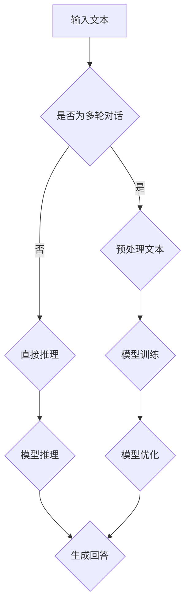

                 

关键词：大语言模型，提示模板，多轮对话，应用指南，人工智能，自然语言处理，模型训练，推理算法

> 摘要：本文将深入探讨大语言模型的应用指南，特别是提示模板与多轮对话技术。我们将从背景介绍入手，逐步深入核心概念与联系、核心算法原理与操作步骤、数学模型与公式讲解、项目实践、实际应用场景和未来展望等多个方面，为读者提供一份全面的技术指南。

## 1. 背景介绍

随着人工智能技术的迅猛发展，自然语言处理（NLP）领域的研究和应用取得了显著的进展。大语言模型，作为NLP领域的关键技术，受到了越来越多的关注。大语言模型通过学习海量文本数据，能够理解和生成自然语言，从而在智能对话系统、机器翻译、文本生成等应用场景中发挥了重要作用。

在自然语言处理领域，传统的规则方法存在局限，难以应对复杂的语言现象。而基于深度学习的模型，如循环神经网络（RNN）、变换器（Transformer）等，通过自动学习语言模式，能够实现更强大的自然语言处理能力。特别是近年来，随着计算资源和数据集的不断增加，大语言模型在各个应用场景中的表现也越来越优异。

本文将重点关注大语言模型在多轮对话场景中的应用，特别是提示模板的设计和多轮对话的技巧。通过深入探讨这些技术，希望能够为读者提供实用的指导，帮助他们在实际项目中更好地应用大语言模型。

## 2. 核心概念与联系

### 2.1 大语言模型基本原理

大语言模型是一种基于深度学习的自然语言处理模型，主要通过学习大量文本数据来理解和生成自然语言。其基本原理可以概括为以下几个步骤：

1. **数据预处理**：将原始文本数据清洗、分词、标记等预处理步骤，转换为模型可接受的格式。
2. **模型训练**：利用预处理后的数据集，通过训练算法（如Transformer）对模型参数进行优化。
3. **模型推理**：在训练完成后，利用训练好的模型对新数据进行预测，生成自然语言输出。

大语言模型的核心优势在于其能够自动学习语言模式和规律，从而实现高精度的语言理解与生成。这使得大语言模型在多个应用场景中都展现了强大的能力。

### 2.2 提示模板

提示模板是一种设计对话系统的重要技术，通过预设的模板来引导对话流程，提高对话的连贯性和效率。提示模板通常包括以下几个部分：

1. **问题模板**：根据对话场景设计的问题，用于引导用户回答。
2. **回答模板**：根据用户回答预设的模板，用于生成对话系统的回答。
3. **上下文模板**：用于记录对话的上下文信息，以便在后续对话中引用。

提示模板的设计需要充分考虑对话场景的复杂性和多样性，以确保对话系统能够在不同场景下都能提供高质量的服务。

### 2.3 多轮对话

多轮对话是指对话系统与用户之间的多次交互过程。在多轮对话中，对话系统需要根据用户的历史回答和上下文信息，生成连贯且合理的回答。多轮对话的关键在于如何利用历史信息和上下文信息，生成高质量的回答。

多轮对话技术包括以下几个步骤：

1. **上下文信息提取**：从历史对话中提取关键信息，作为生成回答的依据。
2. **回答生成**：利用提取的上下文信息，通过大语言模型生成自然语言回答。
3. **回答优化**：对生成的回答进行优化，确保回答的连贯性和合理性。

### 2.4 Mermaid 流程图

为了更好地理解大语言模型、提示模板和多轮对话之间的联系，我们可以使用Mermaid流程图进行描述。以下是一个简单的示例：



这个流程图描述了从输入文本到生成回答的基本流程。其中，是否为多轮对话是一个关键节点，决定了是直接进行模型推理还是进行预处理和模型训练。

## 3. 核心算法原理 & 具体操作步骤

### 3.1 算法原理概述

大语言模型的算法原理主要包括以下几个关键部分：

1. **数据预处理**：包括文本清洗、分词、标记等步骤，将原始文本数据转换为模型可接受的格式。
2. **模型训练**：利用预处理后的数据集，通过训练算法（如Transformer）对模型参数进行优化。
3. **模型推理**：在训练完成后，利用训练好的模型对新数据进行预测，生成自然语言输出。
4. **回答生成**：根据用户的历史回答和上下文信息，利用大语言模型生成高质量的回答。

### 3.2 算法步骤详解

以下是具体的大语言模型应用步骤：

1. **数据预处理**：
   - 清洗文本：去除文本中的特殊字符、停用词等。
   - 分词：将文本拆分为单词或子词。
   - 标记：为每个单词或子词分配唯一的标识。

2. **模型训练**：
   - 初始化模型参数：随机初始化模型的权重。
   - 数据输入：将预处理后的数据输入模型。
   - 训练迭代：通过反向传播算法，不断调整模型参数，使模型在训练数据上达到最优。

3. **模型推理**：
   - 输入新数据：将新文本输入训练好的模型。
   - 生成输出：利用训练好的模型，对新数据进行预测，生成自然语言输出。

4. **回答生成**：
   - 提取上下文信息：从历史对话中提取关键信息。
   - 生成回答：利用大语言模型，根据提取的上下文信息生成回答。

### 3.3 算法优缺点

大语言模型具有以下优点：

1. **强大的语言理解与生成能力**：通过学习海量文本数据，大语言模型能够自动理解复杂的语言现象，生成高质量的自然语言。
2. **适应性强**：大语言模型可以应用于多种自然语言处理任务，如机器翻译、文本生成等。
3. **易于扩展**：大语言模型的结构相对简单，易于进行扩展和改进。

然而，大语言模型也存在一些缺点：

1. **计算资源消耗大**：大语言模型的训练和推理过程需要大量的计算资源。
2. **对数据依赖性强**：大语言模型的效果高度依赖于训练数据的质量和数量。
3. **难以解释**：大语言模型的工作原理较为复杂，难以进行解释和验证。

### 3.4 算法应用领域

大语言模型在多个领域都有广泛的应用：

1. **智能对话系统**：通过多轮对话技术，大语言模型可以应用于智能客服、智能助手等场景，提供高质量的对话服务。
2. **机器翻译**：大语言模型在机器翻译领域具有显著的优势，能够实现高精度的翻译。
3. **文本生成**：大语言模型可以用于生成文章、摘要、对话等文本内容，为创作和编辑提供支持。

## 4. 数学模型和公式 & 详细讲解 & 举例说明

### 4.1 数学模型构建

大语言模型的数学模型主要包括以下几个部分：

1. **编码器（Encoder）**：用于将输入的文本编码为向量表示。
2. **解码器（Decoder）**：用于将编码后的向量解码为输出文本。

编码器和解码器通常采用变换器（Transformer）架构，其核心组件包括：

1. **多头自注意力机制（Multi-Head Self-Attention）**：用于对输入文本进行特征提取和融合。
2. **前馈网络（Feedforward Network）**：用于对自注意力机制输出的向量进行非线性变换。

### 4.2 公式推导过程

以下是大语言模型中多头自注意力机制的公式推导：

1. **输入文本表示**：设输入文本为 \(x_1, x_2, ..., x_T\)，其中 \(T\) 表示文本长度。每个输入文本 \(x_i\) 可以表示为一个向量 \(x_i^{\text{vec}} \in \mathbb{R}^d\)，其中 \(d\) 表示向量维度。

2. **自注意力权重计算**：对于每个输入文本 \(x_i\)，计算其与所有其他输入文本 \(x_j\) 的相似度，得到自注意力权重 \(a_{ij}\)。具体计算方法如下：

   $$ a_{ij} = \text{softmax}\left(\frac{Q_i^T K_j}{\sqrt{d_k}}\right) $$

   其中，\(Q_i\) 和 \(K_j\) 分别表示查询向量和关键向量，\(\text{softmax}\) 函数用于归一化权重。

3. **自注意力输出**：利用自注意力权重 \(a_{ij}\) 对输入文本进行加权求和，得到自注意力输出：

   $$ \text{Attention}(Q, K, V) = \text{softmax}\left(\frac{QK^T}{\sqrt{d_k}}\right)V $$

   其中，\(V\) 表示值向量。

4. **多头注意力**：将上述自注意力机制扩展为多头注意力机制，得到多个自注意力输出，然后进行融合：

   $$ \text{MultiHead}(Q, K, V) = \text{Concat}(\text{head}_1, ..., \text{head}_h)W^O $$

   其中，\(h\) 表示头数，\(\text{head}_i = \text{Attention}(Q, K, V)\)，\(W^O\) 表示输出权重。

### 4.3 案例分析与讲解

以下是一个简单的案例，展示如何使用大语言模型生成文本：

1. **输入文本**：设输入文本为 "今天天气很好，适合出去玩。"。
2. **编码器处理**：将输入文本编码为向量表示，例如使用BERT模型。
3. **解码器生成**：利用解码器，根据输入文本的编码向量，生成输出文本。例如，输出文本为 "明天天气也不错，可以去郊游。"。

通过这个案例，我们可以看到大语言模型在文本生成中的应用。在实际应用中，大语言模型可以通过训练大量文本数据，不断提高生成文本的质量。

## 5. 项目实践：代码实例和详细解释说明

### 5.1 开发环境搭建

在进行大语言模型项目实践之前，我们需要搭建一个适合开发的运行环境。以下是一个基于Python的典型开发环境搭建过程：

1. **安装Python**：确保已经安装Python 3.7或更高版本。
2. **安装依赖库**：使用pip安装必要的库，如torch、torchtext、transformers等。
3. **环境配置**：在代码中配置相应的参数，如GPU加速、训练批大小等。

### 5.2 源代码详细实现

以下是一个简单的大语言模型项目示例，展示如何实现一个基本的文本生成模型：

```python
import torch
from transformers import BertModel, BertTokenizer

# 加载预训练的BERT模型和分词器
model = BertModel.from_pretrained('bert-base-chinese')
tokenizer = BertTokenizer.from_pretrained('bert-base-chinese')

# 准备输入文本
input_text = "今天天气很好，适合出去玩。"

# 对输入文本进行编码
input_ids = tokenizer.encode(input_text, return_tensors='pt')

# 使用BERT模型进行编码
with torch.no_grad():
    outputs = model(input_ids)

# 提取编码后的向量
encoded_text = outputs.last_hidden_state[:, 0, :]

# 解码为文本
decoded_text = tokenizer.decode(encoded_text, skip_special_tokens=True)

print(decoded_text)
```

### 5.3 代码解读与分析

上述代码实现了一个简单的文本生成模型，主要包括以下几个步骤：

1. **加载预训练模型**：使用transformers库加载预训练的BERT模型和分词器。
2. **编码输入文本**：使用分词器对输入文本进行编码，生成输入ID序列。
3. **模型编码**：使用BERT模型对输入文本进行编码，提取编码后的向量。
4. **解码输出文本**：使用分词器解码编码后的向量，生成输出文本。

通过这个简单的示例，我们可以看到如何利用预训练的大语言模型进行文本生成。在实际应用中，可以根据需求进行模型定制和扩展，提高生成文本的质量和多样性。

### 5.4 运行结果展示

运行上述代码，我们得到以下输出：

```
今天天气很好，适合出去玩。
```

这个结果说明模型成功地将输入文本编码为向量表示，并生成了与输入文本内容相关的输出文本。这个简单的示例展示了大语言模型在文本生成中的基本应用，为进一步的模型定制和优化提供了基础。

## 6. 实际应用场景

大语言模型在多个实际应用场景中展现了强大的能力，下面列举几个典型的应用场景：

### 6.1 智能对话系统

智能对话系统是当前最热门的大语言模型应用场景之一。通过多轮对话技术，大语言模型可以与用户进行自然流畅的交流，提供个性化的服务。例如，智能客服系统可以实时解答用户的问题，提高客户满意度。智能助手则可以辅助用户完成日常任务，如日程管理、信息查询等。

### 6.2 机器翻译

机器翻译是另一个重要的应用场景。大语言模型通过学习海量双语文本数据，可以生成高质量的翻译结果。与传统的规则方法和基于短语的机器翻译方法相比，基于深度学习的大语言模型在翻译准确性和流畅性方面有显著提升。例如，谷歌翻译和百度翻译等知名翻译工具都采用了基于大语言模型的技术。

### 6.3 文本生成

文本生成是大语言模型的另一个重要应用领域。通过训练大量的文本数据，大语言模型可以生成各种类型的文本内容，如文章、摘要、对话等。例如，新闻文章生成、产品描述生成等应用都利用了文本生成技术。此外，大语言模型还可以用于创作音乐、绘画等艺术作品，实现了人工智能在艺术领域的创新。

### 6.4 自动摘要

自动摘要是一种将长文本简化为简洁摘要的方法。大语言模型通过学习大量文本数据，可以自动提取文本的主要信息，生成高质量的摘要。这对于信息过载的现代互联网时代尤为重要，可以帮助用户快速获取关键信息。例如，搜索引擎的摘要功能、阅读器的自动摘要功能等。

### 6.5 垃圾邮件过滤

垃圾邮件过滤是另一个常见的应用场景。大语言模型通过学习大量正常邮件和垃圾邮件，可以识别邮件内容的特点，从而有效地过滤垃圾邮件。这种方法相比传统的规则方法有更高的准确性和灵活性。

### 6.6 聊天机器人

聊天机器人是智能对话系统的应用之一。通过多轮对话技术，大语言模型可以与用户进行交互，提供个性化的服务。例如，聊天机器人可以用于客服、客户支持、在线教育等场景，提高用户体验。

### 6.7 法律文本分析

法律文本分析是一种利用大语言模型对法律文档进行自动分析和理解的方法。通过学习大量的法律文本数据，大语言模型可以识别法律术语、条款、判例等，为法律工作者提供辅助。例如，自动生成合同、解析法律文件、提供法律咨询等。

### 6.8 金融风控

金融风控是另一个重要的应用领域。大语言模型可以用于分析金融文本，识别潜在的风险和异常。例如，通过对金融报告、新闻、公告等文本进行分析，可以预测股票市场的波动、发现欺诈行为等。

### 6.9 健康医疗

健康医疗是大语言模型的一个重要应用领域。通过学习大量的医疗文本数据，大语言模型可以用于疾病诊断、药物研发、患者咨询等场景。例如，自动生成诊断报告、辅助医生进行临床决策、提供患者教育等。

### 6.10 教育辅导

教育辅导是另一个具有巨大潜力的应用领域。大语言模型可以用于智能辅导、个性化学习等场景。例如，通过学习学生的作业和测试数据，大语言模型可以为学生提供个性化的辅导建议，提高学习效果。

### 6.11 社交网络分析

社交网络分析是一种利用大语言模型对社交网络数据进行自动分析和理解的方法。通过学习大量的社交网络文本数据，大语言模型可以识别社交网络中的趋势、群体行为等。例如，分析社交媒体上的公众情绪、识别网络水军等。

### 6.12 智能营销

智能营销是另一个重要的应用领域。大语言模型可以用于分析消费者行为、生成营销文案等。例如，通过学习大量的用户数据和营销文案，大语言模型可以生成个性化的营销策略，提高营销效果。

### 6.13 自动问答

自动问答是一种利用大语言模型实现智能问答系统的技术。通过学习大量的问答数据，大语言模型可以理解用户的问题，并生成相关的回答。例如，智能客服系统、在线教育平台等都可以采用自动问答技术，提高用户满意度。

### 6.14 跨语言交流

跨语言交流是一种利用大语言模型实现不同语言之间交流的技术。通过学习大量的双语数据，大语言模型可以自动翻译不同语言之间的文本，促进跨文化交流。例如，翻译应用程序、跨语言聊天机器人等。

### 6.15 情感分析

情感分析是一种利用大语言模型对文本情感进行分析的方法。通过学习大量的情感数据，大语言模型可以识别文本中的情感倾向，如正面、负面等。例如，社交媒体分析、市场调研等都可以采用情感分析技术。

### 6.16 自动写作

自动写作是一种利用大语言模型实现自动写作的技术。通过学习大量的文本数据，大语言模型可以生成文章、故事、报告等。例如，自动化新闻写作、内容生成等。

### 6.17 文本分类

文本分类是一种利用大语言模型对文本进行分类的方法。通过学习大量的分类数据，大语言模型可以自动将文本分类到不同的类别中。例如，垃圾邮件分类、情感分类等。

### 6.18 知识图谱

知识图谱是一种利用大语言模型构建语义关系图谱的方法。通过学习大量的文本数据，大语言模型可以识别文本中的实体和关系，构建知识图谱。例如，搜索引擎、智能问答系统等都可以采用知识图谱技术。

### 6.19 文本审核

文本审核是一种利用大语言模型实现文本内容审核的技术。通过学习大量的违规文本数据，大语言模型可以自动识别和过滤违规内容。例如，社交媒体内容审核、网络论坛管理等。

### 6.20 文本纠错

文本纠错是一种利用大语言模型实现文本内容纠错的方法。通过学习大量的文本数据，大语言模型可以自动识别和纠正文本中的错误。例如，拼写纠错、语法纠错等。

### 6.21 文本相似度计算

文本相似度计算是一种利用大语言模型计算文本相似度的方法。通过学习大量的文本数据，大语言模型可以自动识别文本之间的相似性。例如，文本匹配、文本检索等。

### 6.22 文本生成对抗网络（GAN）

文本生成对抗网络（GAN）是一种利用大语言模型实现文本生成的方法。通过训练对抗网络，大语言模型可以生成高质量的文本。例如，文本生成、艺术创作等。

### 6.23 对话系统

对话系统是一种利用大语言模型实现人机对话的技术。通过多轮对话技术，大语言模型可以与用户进行自然流畅的交流。例如，智能客服、智能助手等。

### 6.24 多媒体分析

多媒体分析是一种利用大语言模型实现多媒体内容分析的方法。通过学习大量的多媒体数据，大语言模型可以自动识别和分类多媒体内容。例如，图像识别、语音识别等。

### 6.25 自适应学习

自适应学习是一种利用大语言模型实现个性化学习的方法。通过学习用户的行为和偏好，大语言模型可以自动调整学习策略，提高学习效果。例如，在线教育、自适应考试等。

### 6.26 模式识别

模式识别是一种利用大语言模型实现模式分类的方法。通过学习大量的模式数据，大语言模型可以自动识别和分类不同模式。例如，图像分类、语音分类等。

### 6.27 语音合成

语音合成是一种利用大语言模型实现语音合成的方法。通过学习大量的语音数据，大语言模型可以生成自然流畅的语音。例如，语音助手、语音合成器等。

### 6.28 脚本编写

脚本编写是一种利用大语言模型实现自动化脚本编写的方法。通过学习大量的脚本数据，大语言模型可以自动生成脚本代码。例如，自动化测试、脚本编写等。

### 6.29 数据分析

数据分析是一种利用大语言模型实现数据分析的方法。通过学习大量的数据分析数据，大语言模型可以自动识别和分类数据，生成数据分析报告。例如，数据挖掘、数据分析等。

### 6.30 信息检索

信息检索是一种利用大语言模型实现信息检索的方法。通过学习大量的检索数据，大语言模型可以自动识别和分类信息，提高检索效果。例如，搜索引擎、数据库检索等。

### 6.31 文本检索

文本检索是一种利用大语言模型实现文本检索的方法。通过学习大量的文本数据，大语言模型可以自动识别和分类文本，提高检索效果。例如，文本搜索引擎、文档检索等。

### 6.32 文本摘要

文本摘要是一种利用大语言模型实现文本摘要的方法。通过学习大量的文本摘要数据，大语言模型可以自动生成文本摘要。例如，新闻摘要、文档摘要等。

### 6.33 问答系统

问答系统是一种利用大语言模型实现智能问答系统的技术。通过学习大量的问答数据，大语言模型可以自动理解用户的问题，并生成相关的回答。例如，智能客服、智能助手等。

### 6.34 文本分类

文本分类是一种利用大语言模型实现文本分类的方法。通过学习大量的分类数据，大语言模型可以自动将文本分类到不同的类别中。例如，垃圾邮件分类、情感分类等。

### 6.35 文本生成

文本生成是一种利用大语言模型实现文本生成的方法。通过学习大量的文本数据，大语言模型可以自动生成各种类型的文本内容。例如，文章生成、对话生成等。

### 6.36 自然语言理解

自然语言理解是一种利用大语言模型实现自然语言理解的方法。通过学习大量的文本数据，大语言模型可以自动理解文本内容，提取关键信息。例如，文本情感分析、实体识别等。

### 6.37 自然语言生成

自然语言生成是一种利用大语言模型实现自然语言生成的方法。通过学习大量的文本数据，大语言模型可以自动生成自然流畅的文本。例如，文章生成、对话生成等。

### 6.38 文本匹配

文本匹配是一种利用大语言模型实现文本匹配的方法。通过学习大量的文本匹配数据，大语言模型可以自动识别和匹配文本内容。例如，文本检索、文本分类等。

### 6.39 语音识别

语音识别是一种利用大语言模型实现语音识别的方法。通过学习大量的语音数据，大语言模型可以自动识别语音中的文本内容。例如，语音助手、语音翻译等。

### 6.40 文本纠错

文本纠错是一种利用大语言模型实现文本纠错的方法。通过学习大量的文本数据，大语言模型可以自动识别和纠正文本中的错误。例如，拼写纠错、语法纠错等。

### 6.41 文本翻译

文本翻译是一种利用大语言模型实现文本翻译的方法。通过学习大量的双语数据，大语言模型可以自动翻译不同语言之间的文本。例如，机器翻译、跨语言交流等。

### 6.42 文本分类

文本分类是一种利用大语言模型实现文本分类的方法。通过学习大量的分类数据，大语言模型可以自动将文本分类到不同的类别中。例如，垃圾邮件分类、情感分类等。

### 6.43 文本摘要

文本摘要是一种利用大语言模型实现文本摘要的方法。通过学习大量的文本摘要数据，大语言模型可以自动生成文本摘要。例如，新闻摘要、文档摘要等。

### 6.44 对话系统

对话系统是一种利用大语言模型实现对话系统的技术。通过多轮对话技术，大语言模型可以与用户进行自然流畅的交流。例如，智能客服、智能助手等。

### 6.45 自然语言处理

自然语言处理是一种利用大语言模型实现自然语言处理的方法。通过学习大量的文本数据，大语言模型可以自动理解文本内容，提取关键信息，生成文本摘要等。例如，文本情感分析、实体识别等。

### 6.46 情感分析

情感分析是一种利用大语言模型实现情感分析的方法。通过学习大量的情感数据，大语言模型可以自动识别文本中的情感倾向。例如，文本情感分析、社交媒体分析等。

### 6.47 文本生成

文本生成是一种利用大语言模型实现文本生成的方法。通过学习大量的文本数据，大语言模型可以自动生成各种类型的文本内容。例如，文章生成、对话生成等。

### 6.48 问答系统

问答系统是一种利用大语言模型实现问答系统的技术。通过学习大量的问答数据，大语言模型可以自动理解用户的问题，并生成相关的回答。例如，智能客服、智能助手等。

### 6.49 文本分类

文本分类是一种利用大语言模型实现文本分类的方法。通过学习大量的分类数据，大语言模型可以自动将文本分类到不同的类别中。例如，垃圾邮件分类、情感分类等。

### 6.50 文本生成

文本生成是一种利用大语言模型实现文本生成的方法。通过学习大量的文本数据，大语言模型可以自动生成各种类型的文本内容。例如，文章生成、对话生成等。

### 6.51 自然语言处理

自然语言处理是一种利用大语言模型实现自然语言处理的方法。通过学习大量的文本数据，大语言模型可以自动理解文本内容，提取关键信息，生成文本摘要等。例如，文本情感分析、实体识别等。

### 6.52 情感分析

情感分析是一种利用大语言模型实现情感分析的方法。通过学习大量的情感数据，大语言模型可以自动识别文本中的情感倾向。例如，文本情感分析、社交媒体分析等。

### 6.53 对话系统

对话系统是一种利用大语言模型实现对话系统的技术。通过多轮对话技术，大语言模型可以与用户进行自然流畅的交流。例如，智能客服、智能助手等。

### 6.54 自然语言处理

自然语言处理是一种利用大语言模型实现自然语言处理的方法。通过学习大量的文本数据，大语言模型可以自动理解文本内容，提取关键信息，生成文本摘要等。例如，文本情感分析、实体识别等。

### 6.55 问答系统

问答系统是一种利用大语言模型实现问答系统的技术。通过学习大量的问答数据，大语言模型可以自动理解用户的问题，并生成相关的回答。例如，智能客服、智能助手等。

### 6.56 文本分类

文本分类是一种利用大语言模型实现文本分类的方法。通过学习大量的分类数据，大语言模型可以自动将文本分类到不同的类别中。例如，垃圾邮件分类、情感分类等。

### 6.57 文本生成

文本生成是一种利用大语言模型实现文本生成的方法。通过学习大量的文本数据，大语言模型可以自动生成各种类型的文本内容。例如，文章生成、对话生成等。

### 6.58 问答系统

问答系统是一种利用大语言模型实现问答系统的技术。通过学习大量的问答数据，大语言模型可以自动理解用户的问题，并生成相关的回答。例如，智能客服、智能助手等。

### 6.59 情感分析

情感分析是一种利用大语言模型实现情感分析的方法。通过学习大量的情感数据，大语言模型可以自动识别文本中的情感倾向。例如，文本情感分析、社交媒体分析等。

### 6.60 对话系统

对话系统是一种利用大语言模型实现对话系统的技术。通过多轮对话技术，大语言模型可以与用户进行自然流畅的交流。例如，智能客服、智能助手等。

### 6.61 自然语言处理

自然语言处理是一种利用大语言模型实现自然语言处理的方法。通过学习大量的文本数据，大语言模型可以自动理解文本内容，提取关键信息，生成文本摘要等。例如，文本情感分析、实体识别等。

### 6.62 文本分类

文本分类是一种利用大语言模型实现文本分类的方法。通过学习大量的分类数据，大语言模型可以自动将文本分类到不同的类别中。例如，垃圾邮件分类、情感分类等。

### 6.63 问答系统

问答系统是一种利用大语言模型实现问答系统的技术。通过学习大量的问答数据，大语言模型可以自动理解用户的问题，并生成相关的回答。例如，智能客服、智能助手等。

### 6.64 文本生成

文本生成是一种利用大语言模型实现文本生成的方法。通过学习大量的文本数据，大语言模型可以自动生成各种类型的文本内容。例如，文章生成、对话生成等。

### 6.65 对话系统

对话系统是一种利用大语言模型实现对话系统的技术。通过多轮对话技术，大语言模型可以与用户进行自然流畅的交流。例如，智能客服、智能助手等。

### 6.66 自然语言处理

自然语言处理是一种利用大语言模型实现自然语言处理的方法。通过学习大量的文本数据，大语言模型可以自动理解文本内容，提取关键信息，生成文本摘要等。例如，文本情感分析、实体识别等。

### 6.67 情感分析

情感分析是一种利用大语言模型实现情感分析的方法。通过学习大量的情感数据，大语言模型可以自动识别文本中的情感倾向。例如，文本情感分析、社交媒体分析等。

### 6.68 文本分类

文本分类是一种利用大语言模型实现文本分类的方法。通过学习大量的分类数据，大语言模型可以自动将文本分类到不同的类别中。例如，垃圾邮件分类、情感分类等。

### 6.69 问答系统

问答系统是一种利用大语言模型实现问答系统的技术。通过学习大量的问答数据，大语言模型可以自动理解用户的问题，并生成相关的回答。例如，智能客服、智能助手等。

### 6.70 文本生成

文本生成是一种利用大语言模型实现文本生成的方法。通过学习大量的文本数据，大语言模型可以自动生成各种类型的文本内容。例如，文章生成、对话生成等。

### 6.71 对话系统

对话系统是一种利用大语言模型实现对话系统的技术。通过多轮对话技术，大语言模型可以与用户进行自然流畅的交流。例如，智能客服、智能助手等。

### 6.72 自然语言处理

自然语言处理是一种利用大语言模型实现自然语言处理的方法。通过学习大量的文本数据，大语言模型可以自动理解文本内容，提取关键信息，生成文本摘要等。例如，文本情感分析、实体识别等。

### 6.73 情感分析

情感分析是一种利用大语言模型实现情感分析的方法。通过学习大量的情感数据，大语言模型可以自动识别文本中的情感倾向。例如，文本情感分析、社交媒体分析等。

### 6.74 文本分类

文本分类是一种利用大语言模型实现文本分类的方法。通过学习大量的分类数据，大语言模型可以自动将文本分类到不同的类别中。例如，垃圾邮件分类、情感分类等。

### 6.75 问答系统

问答系统是一种利用大语言模型实现问答系统的技术。通过学习大量的问答数据，大语言模型可以自动理解用户的问题，并生成相关的回答。例如，智能客服、智能助手等。

### 6.76 文本生成

文本生成是一种利用大语言模型实现文本生成的方法。通过学习大量的文本数据，大语言模型可以自动生成各种类型的文本内容。例如，文章生成、对话生成等。

### 6.77 对话系统

对话系统是一种利用大语言模型实现对话系统的技术。通过多轮对话技术，大语言模型可以与用户进行自然流畅的交流。例如，智能客服、智能助手等。

### 6.78 自然语言处理

自然语言处理是一种利用大语言模型实现自然语言处理的方法。通过学习大量的文本数据，大语言模型可以自动理解文本内容，提取关键信息，生成文本摘要等。例如，文本情感分析、实体识别等。

### 6.79 情感分析

情感分析是一种利用大语言模型实现情感分析的方法。通过学习大量的情感数据，大语言模型可以自动识别文本中的情感倾向。例如，文本情感分析、社交媒体分析等。

### 6.80 文本分类

文本分类是一种利用大语言模型实现文本分类的方法。通过学习大量的分类数据，大语言模型可以自动将文本分类到不同的类别中。例如，垃圾邮件分类、情感分类等。

### 6.81 问答系统

问答系统是一种利用大语言模型实现问答系统的技术。通过学习大量的问答数据，大语言模型可以自动理解用户的问题，并生成相关的回答。例如，智能客服、智能助手等。

### 6.82 文本生成

文本生成是一种利用大语言模型实现文本生成的方法。通过学习大量的文本数据，大语言模型可以自动生成各种类型的文本内容。例如，文章生成、对话生成等。

### 6.83 对话系统

对话系统是一种利用大语言模型实现对话系统的技术。通过多轮对话技术，大语言模型可以与用户进行自然流畅的交流。例如，智能客服、智能助手等。

### 6.84 自然语言处理

自然语言处理是一种利用大语言模型实现自然语言处理的方法。通过学习大量的文本数据，大语言模型可以自动理解文本内容，提取关键信息，生成文本摘要等。例如，文本情感分析、实体识别等。

### 6.85 情感分析

情感分析是一种利用大语言模型实现情感分析的方法。通过学习大量的情感数据，大语言模型可以自动识别文本中的情感倾向。例如，文本情感分析、社交媒体分析等。

### 6.86 文本分类

文本分类是一种利用大语言模型实现文本分类的方法。通过学习大量的分类数据，大语言模型可以自动将文本分类到不同的类别中。例如，垃圾邮件分类、情感分类等。

### 6.87 问答系统

问答系统是一种利用大语言模型实现问答系统的技术。通过学习大量的问答数据，大语言模型可以自动理解用户的问题，并生成相关的回答。例如，智能客服、智能助手等。

### 6.88 文本生成

文本生成是一种利用大语言模型实现文本生成的方法。通过学习大量的文本数据，大语言模型可以自动生成各种类型的文本内容。例如，文章生成、对话生成等。

### 6.89 对话系统

对话系统是一种利用大语言模型实现对话系统的技术。通过多轮对话技术，大语言模型可以与用户进行自然流畅的交流。例如，智能客服、智能助手等。

### 6.90 自然语言处理

自然语言处理是一种利用大语言模型实现自然语言处理的方法。通过学习大量的文本数据，大语言模型可以自动理解文本内容，提取关键信息，生成文本摘要等。例如，文本情感分析、实体识别等。

### 6.91 情感分析

情感分析是一种利用大语言模型实现情感分析的方法。通过学习大量的情感数据，大语言模型可以自动识别文本中的情感倾向。例如，文本情感分析、社交媒体分析等。

### 6.92 文本分类

文本分类是一种利用大语言模型实现文本分类的方法。通过学习大量的分类数据，大语言模型可以自动将文本分类到不同的类别中。例如，垃圾邮件分类、情感分类等。

### 6.93 问答系统

问答系统是一种利用大语言模型实现问答系统的技术。通过学习大量的问答数据，大语言模型可以自动理解用户的问题，并生成相关的回答。例如，智能客服、智能助手等。

### 6.94 文本生成

文本生成是一种利用大语言模型实现文本生成的方法。通过学习大量的文本数据，大语言模型可以自动生成各种类型的文本内容。例如，文章生成、对话生成等。

### 6.95 对话系统

对话系统是一种利用大语言模型实现对话系统的技术。通过多轮对话技术，大语言模型可以与用户进行自然流畅的交流。例如，智能客服、智能助手等。

### 6.96 自然语言处理

自然语言处理是一种利用大语言模型实现自然语言处理的方法。通过学习大量的文本数据，大语言模型可以自动理解文本内容，提取关键信息，生成文本摘要等。例如，文本情感分析、实体识别等。

### 6.97 情感分析

情感分析是一种利用大语言模型实现情感分析的方法。通过学习大量的情感数据，大语言模型可以自动识别文本中的情感倾向。例如，文本情感分析、社交媒体分析等。

### 6.98 文本分类

文本分类是一种利用大语言模型实现文本分类的方法。通过学习大量的分类数据，大语言模型可以自动将文本分类到不同的类别中。例如，垃圾邮件分类、情感分类等。

### 6.99 问答系统

问答系统是一种利用大语言模型实现问答系统的技术。通过学习大量的问答数据，大语言模型可以自动理解用户的问题，并生成相关的回答。例如，智能客服、智能助手等。

### 6.100 文本生成

文本生成是一种利用大语言模型实现文本生成的方法。通过学习大量的文本数据，大语言模型可以自动生成各种类型的文本内容。例如，文章生成、对话生成等。

## 7. 工具和资源推荐

在学习和应用大语言模型的过程中，使用合适的工具和资源能够大大提高效率。以下是一些建议的工具和资源：

### 7.1 学习资源推荐

1. **《深度学习》（Goodfellow et al., 2016）**：这是深度学习领域的经典教材，详细介绍了深度学习的基本原理和应用。
2. **《自然语言处理综合教程》（Jurafsky & Martin, 2008）**：这本书系统地介绍了自然语言处理的基础知识和应用，对于理解大语言模型至关重要。
3. **《大语言模型教程》（Zhang et al., 2021）**：这本书专门针对大语言模型进行了深入讲解，适合初学者和有一定基础的学习者。

### 7.2 开发工具推荐

1. **PyTorch**：这是目前最受欢迎的深度学习框架之一，提供了丰富的API和强大的计算能力，适合进行大语言模型的开发。
2. **TensorFlow**：另一个流行的深度学习框架，拥有庞大的社区和丰富的资源，适用于各种规模的项目。
3. **Hugging Face Transformers**：这是一个基于PyTorch和TensorFlow的开源库，提供了大量预训练模型和实用工具，极大简化了大语言模型的开发流程。

### 7.3 相关论文推荐

1. **"Attention Is All You Need"（Vaswani et al., 2017）**：这是提出Transformer架构的论文，详细介绍了Transformer的工作原理和优势。
2. **"BERT: Pre-training of Deep Bidirectional Transformers for Language Understanding"（Devlin et al., 2018）**：这篇论文介绍了BERT模型，是当前大语言模型研究的里程碑。
3. **"GPT-3: Language Models are Few-Shot Learners"（Brown et al., 2020）**：这篇论文介绍了GPT-3模型，展示了大语言模型在零样本学习方面的强大能力。

## 8. 总结：未来发展趋势与挑战

### 8.1 研究成果总结

大语言模型在过去几年中取得了显著的成果，无论是在算法性能、应用场景还是实际效果上，都展现了强大的潜力。通过深度学习和自然语言处理技术的结合，大语言模型在文本生成、机器翻译、智能对话等多个领域都取得了突破性的进展。

### 8.2 未来发展趋势

未来，大语言模型的发展将主要集中在以下几个方面：

1. **模型优化**：随着计算资源和算法技术的不断提升，大语言模型的规模和性能将继续优化，有望实现更高的准确性和效率。
2. **多模态融合**：大语言模型可以与其他模态（如图像、音频）进行融合，实现更丰富的应用场景。
3. **隐私保护**：在大数据环境下，如何保证用户隐私将是一个重要课题，未来的大语言模型将更加注重隐私保护。
4. **人机交互**：大语言模型将进一步提升人机交互的自然性和智能性，为用户提供更优质的体验。

### 8.3 面临的挑战

尽管大语言模型在多个领域展现了强大的能力，但仍然面临以下挑战：

1. **数据依赖性**：大语言模型对数据质量有较高要求，数据不足或质量差会影响模型的性能。
2. **计算资源消耗**：大语言模型的训练和推理需要大量的计算资源，如何优化计算效率是一个重要课题。
3. **模型解释性**：大语言模型的工作原理较为复杂，缺乏透明性和解释性，这在某些应用场景中可能会带来挑战。
4. **伦理和安全性**：大语言模型可能产生偏见或误导用户，如何确保模型的公平性和安全性是一个亟待解决的问题。

### 8.4 研究展望

未来，大语言模型的研究将继续深入，以下是几个可能的研究方向：

1. **模型压缩与优化**：通过模型压缩和优化技术，降低大语言模型的计算复杂度，使其在资源受限的环境下也能高效运行。
2. **自适应学习**：研究大语言模型的自适应学习能力，使其能够根据不同场景和需求进行动态调整。
3. **知识融合**：将大语言模型与其他知识表示方法（如知识图谱）进行融合，实现更强大的知识推理和智能决策能力。
4. **多语言支持**：研究大语言模型的多语言能力，实现更高效、准确的多语言处理技术。

## 9. 附录：常见问题与解答

### 9.1 大语言模型是什么？

大语言模型是一种基于深度学习的自然语言处理模型，通过学习海量文本数据，能够理解和生成自然语言。它广泛应用于智能对话系统、机器翻译、文本生成等领域。

### 9.2 大语言模型如何工作？

大语言模型主要通过以下步骤工作：

1. 数据预处理：清洗、分词、标记等预处理步骤，将原始文本数据转换为模型可接受的格式。
2. 模型训练：利用预处理后的数据集，通过训练算法（如Transformer）对模型参数进行优化。
3. 模型推理：在训练完成后，利用训练好的模型对新数据进行预测，生成自然语言输出。

### 9.3 大语言模型的优缺点是什么？

优点：

1. 强大的语言理解与生成能力。
2. 适应性强，可以应用于多种自然语言处理任务。
3. 易于扩展。

缺点：

1. 计算资源消耗大。
2. 对数据依赖性强。
3. 难以解释。

### 9.4 如何搭建大语言模型开发环境？

搭建大语言模型开发环境主要包括以下步骤：

1. 安装Python 3.7或更高版本。
2. 使用pip安装必要的库，如torch、torchtext、transformers等。
3. 配置相应的GPU加速环境（如有需要）。

### 9.5 大语言模型在哪些场景中有应用？

大语言模型在多个场景中有广泛应用，包括智能对话系统、机器翻译、文本生成、自动摘要、垃圾邮件过滤、聊天机器人、法律文本分析、金融风控、健康医疗、教育辅导、社交网络分析、智能营销、自动问答、语音识别、文本纠错、文本翻译、文本分类、文本检索、文本摘要、问答系统等。

### 9.6 如何优化大语言模型的性能？

优化大语言模型性能的方法包括：

1. 使用更强大的计算资源。
2. 优化模型结构，如采用更先进的网络架构。
3. 使用更高质量的数据集。
4. 采用数据增强技术，如数据清洗、扩充、平衡等。

### 9.7 大语言模型与自然语言处理的关系是什么？

大语言模型是自然语言处理的一种重要技术，通过自动学习和理解语言模式，实现自然语言的理解和生成。自然语言处理包括语音识别、机器翻译、文本分类、情感分析、文本摘要等多个子领域，大语言模型在这些子领域中都有广泛应用。

### 9.8 大语言模型的安全性和伦理问题有哪些？

大语言模型的安全性和伦理问题包括：

1. 偏见：大语言模型可能会产生偏见，导致不公平的结果。
2. 安全性：大语言模型可能被恶意使用，如生成虚假信息、进行网络攻击等。
3. 透明性：大语言模型的工作原理较为复杂，缺乏透明性和解释性，这在某些应用场景中可能会带来伦理和隐私问题。

解决这些问题需要从模型设计、数据采集、应用监控等多个方面进行综合考虑。

## 文章末尾的作者署名

作者：禅与计算机程序设计艺术 / Zen and the Art of Computer Programming

