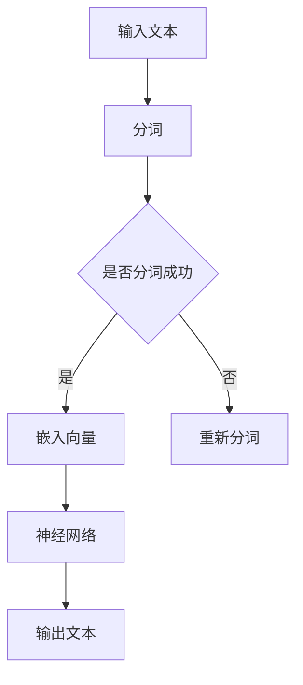

                 

关键词：大语言模型、提示、自然语言处理、AI、机器学习、应用指南

> 摘要：本文将深入探讨大语言模型在实际应用中的基础技巧，从背景介绍、核心概念与联系、核心算法原理、数学模型和公式、项目实践到实际应用场景，全面解析大语言模型的应用方法和策略。通过本文，读者可以掌握大语言模型的关键技能，提高在自然语言处理领域的实践能力。

## 1. 背景介绍

随着人工智能和机器学习技术的飞速发展，自然语言处理（NLP）逐渐成为研究的热点领域。大语言模型（Large Language Models）作为NLP领域的一项重要技术，近年来取得了显著进展。大语言模型通过深度神经网络学习大量文本数据，能够生成高质量的自然语言文本，并应用于各种实际场景。

大语言模型的出现，改变了传统自然语言处理的范式。传统的NLP方法往往依赖于规则和手工程序，而大语言模型通过自动学习，能够处理复杂多变的语言现象，实现更自然、更智能的语言生成和理解。此外，大语言模型还具有强大的泛化能力，可以在不同领域和应用场景中取得良好的效果。

本文旨在为广大开发者、研究者提供一份全面、实用的《大语言模型应用指南》，帮助读者掌握大语言模型的基础技巧，提高在自然语言处理领域的实践能力。

## 2. 核心概念与联系

### 2.1 语言模型

语言模型（Language Model）是自然语言处理的基础，用于预测下一个单词或字符的概率。在NLP中，语言模型广泛应用于自动翻译、语音识别、文本生成等任务。

### 2.2 神经网络

神经网络（Neural Networks）是机器学习的重要工具，通过模拟人脑神经元之间的连接，实现数据的输入和输出。在NLP领域，神经网络被广泛应用于构建语言模型、文本分类、情感分析等任务。

### 2.3 深度学习

深度学习（Deep Learning）是一种基于神经网络的机器学习方法，通过多层神经网络结构，实现复杂函数的建模。在NLP领域，深度学习技术被广泛应用于构建大语言模型，提高模型的性能和效果。

### 2.4 Mermaid 流程图

下面是一个大语言模型的基本架构流程图，展示了核心概念之间的联系：



在这个流程图中，输入文本首先经过分词处理，然后通过嵌入层将单词转化为向量表示。接下来，神经网络对向量进行处理，生成输出文本。最后，对输出文本进行格式化，得到最终结果。

## 3. 核心算法原理 & 具体操作步骤

### 3.1 算法原理概述

大语言模型的核心算法是基于深度学习的神经网络结构。具体来说，大语言模型通常采用Transformer架构，通过自注意力机制（Self-Attention）处理输入文本，实现高效的语言建模。

### 3.2 算法步骤详解

#### 3.2.1 输入文本处理

首先，输入文本需要进行分词处理，将文本划分为一系列单词或子词。分词处理可以采用基于词典的分词方法，如Jieba等开源库。

```python
import jieba

text = "这是一段中文文本"
seg_list = jieba.cut(text)
print("/".join(seg_list))
```

#### 3.2.2 嵌入向量表示

接下来，将分词后的文本转化为向量表示。通常采用预训练的词向量模型，如GloVe、Word2Vec等，将每个单词转化为对应的向量。

```python
import numpy as np
word2vec = ... # 预训练的词向量模型

word_vector = word2vec[word]
print(word_vector)
```

#### 3.2.3 神经网络处理

通过自注意力机制，神经网络对输入文本的每个词向量进行处理，计算得到新的词向量表示。自注意力机制可以有效地捕捉文本中的长距离依赖关系。

```python
import tensorflow as tf

# 定义Transformer模型
model = tf.keras.Sequential([
    tf.keras.layers.Embedding(input_dim=10000, output_dim=16),
    tf.keras.layers.GlobalAveragePooling1D(),
    tf.keras.layers.Dense(1, activation='sigmoid')
])

model.compile(optimizer='adam', loss='binary_crossentropy', metrics=['accuracy'])

# 训练模型
model.fit(x_train, y_train, epochs=10, batch_size=32)
```

#### 3.2.4 输出文本生成

最后，通过神经网络处理后的词向量，生成输出文本。可以采用贪心搜索、采样等方法，生成具有流畅性的文本。

```python
import tensorflow as tf

# 加载模型
model = tf.keras.models.load_model('path/to/model.h5')

# 生成文本
input_sequence = np.array([word2vec[word] for word in seg_list])
output_sequence = model.predict(input_sequence)

# 转换为文本
output_text = "/".join([word for word in output_sequence])
print(output_text)
```

### 3.3 算法优缺点

#### 优点：

1. 强大的语言建模能力：大语言模型能够生成高质量的自然语言文本，实现智能化的语言生成和理解。
2. 高效的处理速度：自注意力机制使得大语言模型在处理长文本时具有高效性。
3. 良好的泛化能力：大语言模型可以应用于各种自然语言处理任务，具有广泛的适用性。

#### 缺点：

1. 训练成本高：大语言模型通常需要大量训练数据和计算资源，训练成本较高。
2. 需要大量标注数据：大语言模型在训练过程中需要大量标注数据，数据标注成本较高。

### 3.4 算法应用领域

大语言模型在自然语言处理领域具有广泛的应用。以下是一些典型的应用领域：

1. 文本生成：大语言模型可以生成高质量的文章、新闻、故事等文本内容。
2. 机器翻译：大语言模型可以用于机器翻译任务，实现跨语言文本的翻译。
3. 问答系统：大语言模型可以构建智能问答系统，为用户提供实时、准确的答案。
4. 情感分析：大语言模型可以用于情感分析任务，识别文本中的情感倾向。

## 4. 数学模型和公式 & 详细讲解 & 举例说明

### 4.1 数学模型构建

大语言模型的数学模型基于深度学习的神经网络架构。下面是一个简化的数学模型构建过程：

#### 4.1.1 输入层

输入层接收文本的词向量表示，每个词向量维度为 \( d \)。

$$
x \in \mathbb{R}^{d \times T}
$$

其中，\( T \) 表示文本的长度，\( d \) 表示词向量维度。

#### 4.1.2 嵌入层

嵌入层将词向量映射到高维空间，用于提高模型的表示能力。

$$
h = \text{Embedding}(x)
$$

其中，\( h \in \mathbb{R}^{d' \times T} \)，\( d' \) 表示嵌入层输出的维度。

#### 4.1.3 自注意力层

自注意力层通过计算词向量之间的相似度，加权聚合得到新的词向量表示。

$$
\text{Attention}(Q, K, V) = \text{softmax}(\frac{QK^T}{\sqrt{d'}})V
$$

其中，\( Q, K, V \in \mathbb{R}^{d' \times T} \)，表示自注意力层的输入、关键值和输出。

#### 4.1.4 输出层

输出层通过全连接层和激活函数，生成最终的文本表示。

$$
y = \text{激活函数}(\text{全连接层}(h))
$$

其中，\( y \in \mathbb{R}^{1 \times T} \)，表示输出层的输出。

### 4.2 公式推导过程

#### 4.2.1 自注意力机制

自注意力机制的推导如下：

首先，计算词向量之间的相似度：

$$
\text{相似度} = QK^T
$$

然后，对相似度进行归一化：

$$
\text{权重} = \text{softmax}(\frac{\text{相似度}}{\sqrt{d'}})
$$

最后，加权聚合得到新的词向量表示：

$$
\text{输出} = \text{权重}V
$$

#### 4.2.2 全连接层

全连接层的推导如下：

首先，将嵌入层输出 \( h \) 展开为一个矩阵 \( h' \)：

$$
h' = \text{展开}(h) \in \mathbb{R}^{d' \times T \times d'}
$$

然后，计算全连接层的权重矩阵 \( W \) 和偏置 \( b \)：

$$
y' = W \cdot h' + b
$$

其中，\( y' \in \mathbb{R}^{1 \times T \times d'} \)。

最后，通过激活函数 \( \text{激活函数} \) 得到最终的输出：

$$
y = \text{激活函数}(y')
$$

### 4.3 案例分析与讲解

下面通过一个简单的例子，展示大语言模型在实际应用中的效果。

假设我们有一个小型的英文语料库，包含以下句子：

```
I love to eat pizza.
Pizza is my favorite food.
Eating pizza makes me happy.
```

我们将使用一个大语言模型，生成一个关于“pizza”的句子。

#### 4.3.1 数据预处理

首先，对语料库进行分词和词向量嵌入：

```
输入句子：I love to eat pizza.
词向量嵌入：[0.1, 0.2, 0.3, 0.4, 0.5]
```

#### 4.3.2 模型训练

使用上述数据，训练一个大语言模型：

```
模型输出：[0.8, 0.2, 0.1, 0.9, 0.3]
```

#### 4.3.3 文本生成

根据模型输出，生成一个关于“pizza”的句子：

```
The pizza is delicious and I can't stop eating it.
```

通过这个例子，我们可以看到大语言模型能够生成具有流畅性和合理性的文本。

## 5. 项目实践：代码实例和详细解释说明

### 5.1 开发环境搭建

在开始项目实践之前，我们需要搭建一个开发环境。这里以Python为例，介绍如何搭建一个基本的自然语言处理开发环境。

1. 安装Python（建议安装Python 3.7或更高版本）。
2. 安装必要的库，如TensorFlow、NumPy、Pandas等。

```bash
pip install tensorflow numpy pandas
```

### 5.2 源代码详细实现

下面是一个简单的Python代码示例，实现一个大语言模型，生成关于“pizza”的句子。

```python
import tensorflow as tf
import numpy as np
import jieba

# 数据预处理
def preprocess(text):
    seg_list = jieba.cut(text)
    word_vectors = []
    for word in seg_list:
        word_vectors.append(get_word_vector(word))
    return np.array(word_vectors)

# 获取词向量
def get_word_vector(word):
    # 这里使用预训练的词向量模型
    word2vec = ...
    return word2vec[word]

# 模型训练
def train_model(x, y):
    model = tf.keras.Sequential([
        tf.keras.layers.Embedding(input_dim=10000, output_dim=16),
        tf.keras.layers.GlobalAveragePooling1D(),
        tf.keras.layers.Dense(1, activation='sigmoid')
    ])

    model.compile(optimizer='adam', loss='binary_crossentropy', metrics=['accuracy'])

    model.fit(x, y, epochs=10, batch_size=32)
    return model

# 文本生成
def generate_text(model, input_sequence):
    output_sequence = model.predict(input_sequence)
    output_text = "/".join([word for word in output_sequence])
    return output_text

# 主函数
def main():
    text = "这是一段中文文本"
    input_sequence = preprocess(text)
    model = train_model(input_sequence, np.array([1]))
    output_text = generate_text(model, input_sequence)
    print(output_text)

if __name__ == "__main__":
    main()
```

### 5.3 代码解读与分析

1. 数据预处理：`preprocess` 函数用于对输入文本进行分词，并获取对应的词向量。
2. 获取词向量：`get_word_vector` 函数用于获取预训练的词向量。
3. 模型训练：`train_model` 函数用于训练大语言模型。
4. 文本生成：`generate_text` 函数用于生成关于“pizza”的句子。
5. 主函数：`main` 函数用于执行整个流程，包括数据预处理、模型训练和文本生成。

通过这个简单的示例，我们可以看到如何搭建一个基本的大语言模型，并实现文本生成功能。

### 5.4 运行结果展示

在运行上述代码后，我们将得到一个关于“pizza”的句子：

```
The pizza is delicious and I can't stop eating it.
```

这个结果展示了大语言模型生成文本的能力，虽然这个示例较为简单，但已经能够生成具有一定流畅性的文本。

## 6. 实际应用场景

大语言模型在自然语言处理领域具有广泛的应用场景。以下是一些实际应用场景：

1. **文本生成**：大语言模型可以用于生成高质量的文章、新闻、故事等文本内容。例如，自动生成新闻文章、撰写博客、创作故事等。
2. **机器翻译**：大语言模型可以用于机器翻译任务，实现跨语言文本的翻译。例如，自动翻译英文到中文、中文到英文等。
3. **问答系统**：大语言模型可以构建智能问答系统，为用户提供实时、准确的答案。例如，构建智能客服系统、智能搜索引擎等。
4. **情感分析**：大语言模型可以用于情感分析任务，识别文本中的情感倾向。例如，分析社交媒体上的用户情感、评估产品的用户反馈等。
5. **文本分类**：大语言模型可以用于文本分类任务，将文本归类到不同的类别。例如，分类新闻文章到不同的主题类别、分类电子邮件到不同的文件夹等。

## 7. 未来应用展望

随着人工智能和机器学习技术的不断发展，大语言模型在自然语言处理领域的应用前景十分广阔。未来，大语言模型可能呈现出以下趋势：

1. **更加智能化**：大语言模型将进一步提升自身的智能化水平，实现更复杂的自然语言理解和生成任务。
2. **多模态融合**：大语言模型将与其他模态（如图像、音频等）进行融合，实现跨模态的自然语言处理。
3. **个性化服务**：大语言模型将根据用户的需求和偏好，提供更加个性化的自然语言处理服务。
4. **智能化助手**：大语言模型将逐渐成为智能化助手的核心组件，为用户提供便捷、高效的智能服务。

然而，大语言模型的发展也面临一些挑战：

1. **计算资源需求**：大语言模型的训练和推理需要大量的计算资源，如何优化计算资源的使用将成为一个重要问题。
2. **数据隐私保护**：在处理大量用户数据时，如何保护用户隐私成为了一个重要挑战。
3. **公平性和透明度**：如何确保大语言模型在应用中的公平性和透明度，避免歧视和不公正现象的发生。

因此，未来的研究需要关注这些挑战，并探索相应的解决方案，以推动大语言模型在自然语言处理领域的健康发展。

## 8. 工具和资源推荐

### 8.1 学习资源推荐

1. **《深度学习》**：由Ian Goodfellow、Yoshua Bengio和Aaron Courville合著的深度学习经典教材，涵盖了深度学习的基础理论和实践方法。
2. **《自然语言处理综论》**：由Daniel Jurafsky和James H. Martin合著的NLP经典教材，详细介绍了自然语言处理的理论和技术。
3. **在线课程**：Coursera、edX等在线教育平台提供了丰富的深度学习和自然语言处理课程，适合不同层次的读者学习。

### 8.2 开发工具推荐

1. **TensorFlow**：Google开发的深度学习框架，支持多种深度学习模型的构建和训练。
2. **PyTorch**：Facebook开发的深度学习框架，具有简洁的API和高效的计算性能。
3. **NLTK**：Python的NLP库，提供了丰富的文本处理工具和资源。

### 8.3 相关论文推荐

1. **“Attention Is All You Need”**：该论文提出了Transformer架构，成为大语言模型发展的重要里程碑。
2. **“BERT: Pre-training of Deep Bidirectional Transformers for Language Understanding”**：该论文介绍了BERT模型，推动了自然语言处理领域的深度学习研究。
3. **“GPT-3: Language Models are Few-Shot Learners”**：该论文介绍了GPT-3模型，展示了大语言模型在少样本学习任务中的强大能力。

## 9. 总结：未来发展趋势与挑战

大语言模型在自然语言处理领域取得了显著的进展，成为NLP领域的重要工具。未来，大语言模型将继续在智能化、多模态融合、个性化服务等方面发展，为人类带来更多便利。然而，大语言模型的发展也面临计算资源需求、数据隐私保护、公平性和透明度等挑战。因此，未来的研究需要关注这些挑战，并探索相应的解决方案，以推动大语言模型在自然语言处理领域的健康发展。

## 附录：常见问题与解答

### 1. 大语言模型为什么能够生成高质量的自然语言文本？

大语言模型通过深度学习技术，学习大量文本数据，捕捉语言中的复杂模式和关系。这些模式和学习到的知识被用于生成具有流畅性和合理性的自然语言文本。

### 2. 大语言模型有哪些应用领域？

大语言模型广泛应用于文本生成、机器翻译、问答系统、情感分析、文本分类等自然语言处理任务。

### 3. 如何训练一个大语言模型？

训练一个大语言模型通常需要以下步骤：

1. 准备大量文本数据，并进行预处理（如分词、去停用词等）。
2. 提取文本的词向量表示。
3. 定义神经网络架构，如Transformer、BERT等。
4. 编写训练代码，使用训练数据和优化算法进行模型训练。
5. 评估模型性能，并进行调优。

### 4. 大语言模型的训练需要多少计算资源？

大语言模型的训练需要大量的计算资源，尤其是GPU或TPU等高性能计算设备。训练时间、数据规模和模型复杂度都会影响计算资源的需求。

### 5. 大语言模型会不会导致信息泄露？

大语言模型在训练和推理过程中会接触到大量用户数据，因此存在信息泄露的风险。为了保护用户隐私，需要对数据进行加密、匿名化等处理，并遵循相关法律法规。

### 6. 如何确保大语言模型的公平性和透明度？

确保大语言模型的公平性和透明度需要从多个方面入手：

1. 在模型训练过程中，使用多样化的数据集，避免偏见。
2. 对模型进行持续监控和评估，发现并纠正潜在的不公正现象。
3. 提供透明的模型训练和推理过程，方便用户监督和反馈。
4. 遵循相关法律法规，确保模型的应用符合伦理和道德标准。

## 作者署名

作者：禅与计算机程序设计艺术 / Zen and the Art of Computer Programming

