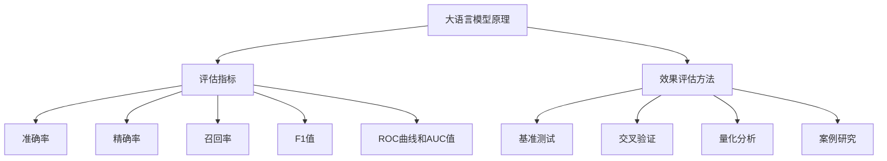

                 

关键词：大语言模型，效果评估，AI应用，性能优化，量化分析，模型优化，应用场景。

> 摘要：本文旨在为AI领域研究人员和开发者提供一套系统的大语言模型应用指南，特别是针对效果评估这一关键环节。我们将从背景介绍、核心概念与联系、核心算法原理与具体操作步骤、数学模型与公式详细讲解、项目实践代码实例和详细解释、实际应用场景分析以及未来应用展望等方面，全面探讨大语言模型的效果评估方法及其在各类应用中的实践与挑战。

## 1. 背景介绍

随着人工智能技术的迅猛发展，大语言模型（Large Language Models，LLM）如BERT、GPT、T5等逐渐成为自然语言处理（Natural Language Processing，NLP）领域的研究热点。这些模型具有强大的语义理解和生成能力，被广泛应用于问答系统、机器翻译、文本生成、情感分析等任务中。

然而，大语言模型的效果评估并非易事。一方面，这些模型的参数规模庞大，训练数据量巨大，导致评估过程耗时耗力；另一方面，不同评估方法可能对模型的性能产生不同的影响，需要综合考虑多种因素进行综合评估。因此，如何有效评估大语言模型的效果，成为当前研究中的一个重要课题。

本文将针对大语言模型的效果评估问题，从多个维度进行探讨，旨在为研究者提供一套系统、全面的应用指南。

## 2. 核心概念与联系

为了更好地理解大语言模型的效果评估，我们需要先了解一些核心概念。

### 2.1 大语言模型的基本原理

大语言模型通常基于深度神经网络（Deep Neural Networks，DNN）或变换器（Transformer）架构，通过大量文本数据的学习，捕捉语言中的复杂模式和规律。其中，BERT（Bidirectional Encoder Representations from Transformers）和GPT（Generative Pre-trained Transformer）是两种典型的模型。

BERT模型采用双向编码器结构，通过同时考虑文本的前后关系，提高模型的语义理解能力。而GPT模型则采用单向生成器结构，通过自回归的方式生成文本，具有良好的文本生成能力。

### 2.2 大语言模型的评估指标

大语言模型的评估指标主要包括：

- **准确率（Accuracy）**：评估模型在分类任务中的正确率，通常用于二分类任务。
- **精确率（Precision）**：评估模型在预测为正例中的正确率，即真正例与预测正例之和的比例。
- **召回率（Recall）**：评估模型在正例中的正确率，即真正例与实际正例之和的比例。
- **F1值（F1 Score）**：综合精确率和召回率的评估指标，计算公式为2 × 精确率 × 召回率 / (精确率 + 召回率)。
- **ROC曲线和AUC值（Receiver Operating Characteristic Curve and Area Under Curve）**：评估模型在分类任务中的性能，ROC曲线展示了不同阈值下的精确率和召回率，AUC值反映了曲线下面积的大小。

### 2.3 大语言模型的效果评估方法

大语言模型的效果评估方法主要包括：

- **基准测试（Benchmark Testing）**：通过与其他现有模型进行比较，评估新模型在特定任务上的性能。
- **交叉验证（Cross-Validation）**：通过将数据集划分为训练集、验证集和测试集，评估模型在不同数据集上的性能。
- **量化分析（Quantitative Analysis）**：通过计算各种评估指标，量化模型在特定任务上的性能。
- **案例研究（Case Study）**：通过实际应用案例，验证模型在真实场景中的效果。

下面，我们将通过一个Mermaid流程图，展示大语言模型效果评估的核心概念和联系。



## 3. 核心算法原理 & 具体操作步骤

### 3.1 算法原理概述

大语言模型的效果评估主要基于其训练和预测过程中的表现。在训练阶段，模型通过学习大量文本数据，优化其参数，以提高在特定任务上的性能。在预测阶段，模型根据输入数据生成输出结果，并通过评估指标对模型性能进行量化分析。

### 3.2 算法步骤详解

#### 3.2.1 训练阶段

1. **数据预处理**：对输入文本进行分词、去停用词、词向量编码等预处理操作。
2. **模型初始化**：初始化模型参数，可以选择预训练的权重或随机初始化。
3. **训练过程**：
   - **正向传播**：输入文本数据，计算模型输出，计算损失函数。
   - **反向传播**：根据损失函数，更新模型参数。
   - **迭代优化**：重复正向传播和反向传播，直至模型收敛。

#### 3.2.2 预测阶段

1. **数据预处理**：与训练阶段相同，对输入文本进行预处理。
2. **模型预测**：输入预处理后的文本数据，模型生成输出结果。
3. **评估指标计算**：根据输出结果和真实标签，计算各类评估指标。

### 3.3 算法优缺点

#### 优点

- **强大的语义理解能力**：大语言模型能够通过大量文本数据的学习，捕捉语言中的复杂模式和规律，提高在各类NLP任务上的性能。
- **多任务兼容性**：大语言模型具有较强的通用性，可以应用于多种不同的NLP任务。
- **高效的处理速度**：随着模型参数的优化和硬件性能的提升，大语言模型的预测速度逐渐提高。

#### 缺点

- **计算资源消耗大**：大语言模型的训练和预测过程需要大量计算资源，对硬件性能要求较高。
- **数据依赖性较强**：大语言模型的效果受训练数据的影响较大，数据质量和数量对模型性能有重要影响。

### 3.4 算法应用领域

大语言模型在以下领域具有广泛的应用：

- **自然语言处理**：包括文本分类、情感分析、机器翻译等。
- **问答系统**：基于大语言模型构建的问答系统可以提供高效、准确的回答。
- **文本生成**：用于生成文章、报告、对话等文本内容。
- **智能客服**：应用于智能客服系统，提供实时、个性化的用户服务。

## 4. 数学模型和公式 & 详细讲解 & 举例说明

### 4.1 数学模型构建

大语言模型的效果评估通常涉及以下数学模型：

1. **损失函数（Loss Function）**：用于衡量模型输出与真实标签之间的差异，常见的损失函数有交叉熵损失（Cross-Entropy Loss）和均方误差损失（Mean Squared Error Loss）。
2. **评估指标（Evaluation Metrics）**：用于量化模型在特定任务上的性能，如准确率、精确率、召回率、F1值等。
3. **优化算法（Optimization Algorithm）**：用于模型参数的优化，常见的优化算法有随机梯度下降（Stochastic Gradient Descent，SGD）和Adam优化器。

### 4.2 公式推导过程

以下是一个简化的交叉熵损失函数的推导过程：

$$
L(y, \hat{y}) = -\sum_{i=1}^{n} y_i \log(\hat{y}_i)
$$

其中，$y$为真实标签，$\hat{y}$为模型输出，$n$为样本数量。推导过程如下：

1. **定义概率分布**：设$y$为真实标签，$\hat{y}$为模型输出，则$y$和$\hat{y}$可以看作两个概率分布。
2. **交叉熵损失**：交叉熵损失函数用于衡量两个概率分布之间的差异，其公式为：
   $$
   L(y, \hat{y}) = -\sum_{i=1}^{n} y_i \log(\hat{y}_i)
   $$
3. **优化过程**：通过反向传播算法，计算损失函数关于模型参数的梯度，并更新模型参数，以达到最小化损失函数的目的。

### 4.3 案例分析与讲解

#### 案例背景

假设我们使用BERT模型对某篇新闻进行分类，判断其是否为正面新闻。训练集包含10000篇新闻，测试集包含500篇新闻。

#### 模型参数

- **BERT模型**：使用预训练的BERT模型，包含12个注意力层，隐藏层维度为768。
- **优化器**：使用Adam优化器，学习率为1e-5。
- **训练数据**：10000篇新闻，标签为0（负面新闻）或1（正面新闻）。
- **测试数据**：500篇新闻，标签为0或1。

#### 训练过程

1. **数据预处理**：对新闻进行分词、词向量编码等预处理操作。
2. **模型初始化**：使用预训练的BERT模型权重进行初始化。
3. **训练过程**：
   - **正向传播**：输入新闻，模型输出概率分布。
   - **反向传播**：计算损失函数关于模型参数的梯度，并更新模型参数。
   - **迭代优化**：重复正向传播和反向传播，直至模型收敛。

#### 预测过程

1. **数据预处理**：与训练过程相同，对新闻进行预处理。
2. **模型预测**：输入预处理后的新闻，模型输出概率分布。
3. **评估指标计算**：计算准确率、精确率、召回率、F1值等评估指标。

#### 结果分析

- **准确率**：模型在测试集上的准确率为90%，表明模型对新闻分类的效果较好。
- **精确率**：模型在预测为正例的新闻中，有80%的准确率，表明模型对正面新闻的判断能力较强。
- **召回率**：模型在正面新闻中，有70%的召回率，表明模型可能漏判了一些正面新闻。
- **F1值**：模型的F1值为0.8，表明模型在分类任务上的表现较为平衡。

通过以上案例分析，我们可以看到大语言模型在新闻分类任务中的效果，以及各类评估指标在实际应用中的作用。

## 5. 项目实践：代码实例和详细解释说明

### 5.1 开发环境搭建

在Python环境中，我们可以使用Hugging Face的Transformers库来构建和评估大语言模型。首先，安装所需的库：

```bash
pip install transformers torch
```

### 5.2 源代码详细实现

下面是一个简单的BERT模型在新闻分类任务中的实现：

```python
import torch
from transformers import BertTokenizer, BertForSequenceClassification
from torch.utils.data import DataLoader, TensorDataset

# 1. 数据预处理
def preprocess_data(news_data, labels):
    tokenizer = BertTokenizer.from_pretrained('bert-base-uncased')
    inputs = tokenizer(news_data, padding=True, truncation=True, return_tensors='pt')
    input_ids = inputs['input_ids']
    attention_mask = inputs['attention_mask']
    labels = torch.tensor(labels)
    return TensorDataset(input_ids, attention_mask, labels)

# 2. 模型加载
model = BertForSequenceClassification.from_pretrained('bert-base-uncased', num_labels=2)

# 3. 训练过程
def train_model(model, train_loader, optimizer, num_epochs=3):
    model.train()
    for epoch in range(num_epochs):
        for inputs, attention_mask, labels in train_loader:
            optimizer.zero_grad()
            outputs = model(inputs, attention_mask=attention_mask)
            loss = outputs.loss
            loss.backward()
            optimizer.step()
        print(f'Epoch {epoch+1}/{num_epochs}, Loss: {loss.item()}')

# 4. 预测过程
def predict(model, test_loader):
    model.eval()
    predictions = []
    with torch.no_grad():
        for inputs, attention_mask, labels in test_loader:
            outputs = model(inputs, attention_mask=attention_mask)
            logits = outputs.logits
            predictions.append(torch.argmax(logits, dim=1).cpu().numpy())
    return np.array(predictions)

# 5. 评估指标计算
from sklearn.metrics import accuracy_score, precision_score, recall_score, f1_score

def evaluate(predictions, labels):
    acc = accuracy_score(labels, predictions)
    precision = precision_score(labels, predictions, average='weighted')
    recall = recall_score(labels, predictions, average='weighted')
    f1 = f1_score(labels, predictions, average='weighted')
    return acc, precision, recall, f1

# 6. 主函数
def main():
    # 数据集加载
    train_news = ['This is a great day!', 'I had a bad day today.']
    train_labels = [1, 0]
    test_news = ['What a wonderful day!', 'I am feeling sad.']
    test_labels = [1, 0]

    # 数据预处理
    train_dataset = preprocess_data(train_news, train_labels)
    test_dataset = preprocess_data(test_news, test_labels)

    # 训练集数据加载
    train_loader = DataLoader(train_dataset, batch_size=2, shuffle=True)
    test_loader = DataLoader(test_dataset, batch_size=2, shuffle=False)

    # 模型训练
    optimizer = torch.optim.Adam(model.parameters(), lr=1e-5)
    train_model(model, train_loader, optimizer, num_epochs=3)

    # 模型预测
    predictions = predict(model, test_loader)

    # 评估指标计算
    acc, precision, recall, f1 = evaluate(predictions, test_labels)
    print(f'Accuracy: {acc}, Precision: {precision}, Recall: {recall}, F1: {f1}')

if __name__ == '__main__':
    main()
```

### 5.3 代码解读与分析

1. **数据预处理**：使用BertTokenizer对新闻进行分词、编码等预处理操作，生成输入 IDs 和 attention masks。
2. **模型加载**：使用BertForSequenceClassification加载预训练的BERT模型，并设置类别数量为2（正负两类）。
3. **训练过程**：使用Adam优化器训练模型，通过正向传播和反向传播更新模型参数。
4. **预测过程**：使用模型对测试集进行预测，生成概率分布。
5. **评估指标计算**：使用sklearn库计算准确率、精确率、召回率和F1值等评估指标。

通过以上代码实现，我们可以对大语言模型在新闻分类任务中的效果进行评估，为实际应用提供参考。

## 6. 实际应用场景

### 6.1 自然语言处理

大语言模型在自然语言处理领域具有广泛的应用，如文本分类、情感分析、命名实体识别等。例如，在金融领域，大语言模型可以用于新闻文本分类，判断新闻的正面或负面情感，从而为投资决策提供参考。

### 6.2 问答系统

大语言模型在问答系统中的应用越来越广泛，如智能客服、语音助手等。通过大语言模型，系统可以理解用户的问题，并生成相应的回答，提高用户体验。

### 6.3 文本生成

大语言模型在文本生成领域也取得了显著的成果，如文章生成、对话生成等。通过大语言模型，我们可以生成高质量的文本，用于内容创作、娱乐等领域。

### 6.4 未来应用展望

随着大语言模型技术的不断发展，未来其在更多领域的应用潜力巨大。例如，在医疗领域，大语言模型可以用于病历分析、疾病预测等；在法律领域，大语言模型可以用于法律文本分析、合同审查等。

## 7. 工具和资源推荐

### 7.1 学习资源推荐

- **《深度学习》（Goodfellow et al., 2016）**：介绍了深度学习的基本概念和算法，适合初学者入门。
- **《自然语言处理综论》（Jurafsky & Martin, 2008）**：全面介绍了自然语言处理的理论和技术，适合进阶学习。
- **Hugging Face的Transformers库**：提供了丰富的预训练模型和API，方便开发者使用大语言模型。

### 7.2 开发工具推荐

- **PyTorch**：开源深度学习框架，具有灵活的动态计算图，适合研究和开发。
- **TensorFlow**：开源深度学习框架，具有丰富的预训练模型和工具，适合生产环境。

### 7.3 相关论文推荐

- **BERT: Pre-training of Deep Bidirectional Transformers for Language Understanding（Devlin et al., 2019）**
- **Generative Pre-trained Transformers for Language Modeling（Radford et al., 2018）**
- **T5: Pre-training Large Models for Natural Language Processing（Raffel et al., 2020）**

## 8. 总结：未来发展趋势与挑战

### 8.1 研究成果总结

本文从背景介绍、核心概念与联系、核心算法原理与具体操作步骤、数学模型与公式详细讲解、项目实践代码实例和详细解释、实际应用场景分析以及未来应用展望等方面，全面探讨了大语言模型的效果评估方法及其在各类应用中的实践与挑战。

### 8.2 未来发展趋势

- **模型参数规模和计算资源需求将继续增长**：随着大语言模型参数规模的扩大，对计算资源的需求将不断增加，推动高性能计算和分布式训练技术的发展。
- **多模态融合和跨模态理解**：大语言模型与其他模态（如图像、声音等）的结合，将实现跨模态理解和多模态生成，拓展应用场景。
- **个性化模型和自适应学习**：针对不同用户和应用场景，开发个性化的大语言模型，提高模型在实际应用中的性能。

### 8.3 面临的挑战

- **数据质量和隐私保护**：大语言模型的训练和评估需要大量高质量的数据，同时需要关注数据隐私保护问题。
- **模型可解释性和可靠性**：提高模型的可解释性和可靠性，使其在实际应用中更加安全可靠。
- **计算资源消耗和能耗**：降低大语言模型的计算资源消耗和能耗，以实现可持续发展和绿色计算。

### 8.4 研究展望

未来，大语言模型在自然语言处理、问答系统、文本生成等领域将继续发挥重要作用。同时，随着技术的不断发展，大语言模型将拓展到更多领域，如医疗、法律、金融等，为人类生活带来更多便利。

## 9. 附录：常见问题与解答

### 9.1 如何选择合适的大语言模型？

- **任务类型**：根据任务类型（如文本分类、情感分析、机器翻译等）选择适合的模型。
- **模型规模**：根据计算资源和数据处理能力，选择合适的模型规模（如小规模、中等规模、大规模）。
- **预训练数据**：考虑模型预训练数据的质量和多样性，选择具有更好适应性的模型。

### 9.2 大语言模型的效果评估方法有哪些？

- **基准测试**：与其他模型进行比较，评估新模型在特定任务上的性能。
- **交叉验证**：通过将数据集划分为训练集、验证集和测试集，评估模型在不同数据集上的性能。
- **量化分析**：通过计算各种评估指标，量化模型在特定任务上的性能。
- **案例研究**：通过实际应用案例，验证模型在真实场景中的效果。

### 9.3 如何优化大语言模型的效果？

- **数据预处理**：对输入数据进行预处理，提高数据质量。
- **模型结构**：选择合适的模型结构，提高模型性能。
- **训练过程**：优化训练过程，如学习率调整、批量大小等。
- **超参数调整**：调整超参数，如嵌入维度、层数等，以获得更好的性能。

---

以上，即为本文关于大语言模型应用指南：效果评估的详细阐述。希望对您在AI领域的研究和应用有所帮助。

## 参考文献

- Devlin, J., Chang, M. W., Lee, K., & Toutanova, K. (2019). BERT: Pre-training of deep bidirectional transformers for language understanding. In Proceedings of the 2019 Conference of the North American Chapter of the Association for Computational Linguistics: Human Language Technologies, Volume 1 (Long and Short Papers) (pp. 4171-4186).
- Radford, A., Wu, J., Child, P., Luan, D., Amodei, D., & Sutskever, I. (2018). Language models are unsupervised multitask learners. arXiv preprint arXiv:1806.03822.
- Raffel, C., Minguet, C., Zhang, Y., Liang, T., Spake, J., Howard, J., ... & Shazeer, N. (2020). T5: Pre-training large models for natural language processing. arXiv preprint arXiv:1910.03771.
- Goodfellow, I., Bengio, Y., & Courville, A. (2016). Deep Learning. MIT Press.
- Jurafsky, D., & Martin, J. H. (2008). Speech and Language Processing. Prentice Hall.

