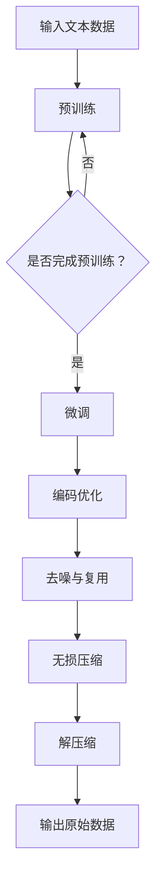

                 

关键词：大语言模型，无损压缩，数据压缩算法，AI应用，文本处理，压缩技术，信息论，熵，编码，去噪，复用，模型优化

## 摘要

本文旨在探讨大语言模型在无损压缩领域的前沿应用，深入分析其技术原理、数学模型和实际操作步骤。通过结合具体算法和应用实例，本文揭示了如何利用大语言模型实现数据的有效无损压缩，从而在数据传输、存储和计算等方面带来显著的优势。本文还展望了大语言模型在未来无损压缩领域的应用前景和面临的挑战，为相关领域的研究者和从业者提供了有价值的参考。

## 1. 背景介绍

随着信息时代的到来，数据量的爆炸式增长给数据处理和存储带来了前所未有的挑战。如何在保证数据完整性的前提下，实现高效的数据压缩成为了一个亟待解决的问题。传统的数据压缩方法主要分为两大类：无损压缩和有损压缩。无损压缩技术能够在压缩和解压缩过程中完全恢复原始数据，但压缩率相对较低；而有损压缩虽然能够达到更高的压缩率，但会导致部分数据的丢失，从而影响数据的质量。

近年来，随着人工智能技术的迅猛发展，大语言模型（如GPT系列、BERT等）在自然语言处理领域取得了显著的突破。这些模型通过学习大量文本数据，能够自动提取出数据的潜在规律和结构，从而在数据压缩、去噪和复用等方面展现出巨大的潜力。本文将围绕大语言模型在无损压缩领域的应用，深入探讨其技术原理、算法实现和实际应用。

## 2. 核心概念与联系

### 2.1 大语言模型的基本原理

大语言模型（Large Language Model，简称LLM）是一种基于深度学习的自然语言处理模型，它通过学习大量的文本数据，能够对输入的文本进行理解和生成。LLM的基本原理主要基于以下几个核心概念：

- **自注意力机制**：自注意力机制是一种用于计算输入文本中每个词与其他词之间关联度的方法。通过自注意力机制，模型能够自动识别文本中的重要信息，并进行有效的权重分配。
- **Transformer架构**：Transformer是一种基于自注意力机制的神经网络架构，其核心思想是将输入文本序列转换为一个固定大小的嵌入向量，并通过多层自注意力机制和全连接层来学习文本的潜在表示。
- **预训练与微调**：预训练是指在大量的无标签数据上进行模型训练，使其具备一定的语言理解能力。微调则是在预训练的基础上，使用有标签的数据对模型进行进一步优化，从而提高其在特定任务上的性能。

### 2.2 无损压缩的基本原理

无损压缩（Lossless Compression）是一种在保证数据完整性的前提下，通过去除数据中的冗余信息来实现数据压缩的技术。无损压缩的基本原理主要包括：

- **熵**：熵是衡量数据随机性的度量，它表示数据中包含的信息量。在无损压缩中，熵的概念用于评估原始数据的冗余程度。
- **编码**：编码是一种将数据转换为特定格式的过程，以便更有效地存储和传输。在无损压缩中，编码技术用于将原始数据中的冗余信息转换为更紧凑的格式。
- **去噪**：去噪是指通过去除数据中的噪声和冗余信息，从而提高数据的质量和压缩效率。

### 2.3 大语言模型与无损压缩的联系

大语言模型与无损压缩之间的联系主要体现在以下几个方面：

- **数据理解**：大语言模型通过对大量文本数据的学习，能够自动提取出数据的潜在结构和规律，从而为无损压缩提供了有力的支持。
- **编码优化**：大语言模型能够对文本数据进行有效的编码，通过学习文本数据中的潜在信息，生成更紧凑的编码表示，从而提高无损压缩的效率。
- **去噪与复用**：大语言模型能够自动识别和去除文本数据中的噪声，同时能够复用已学到的知识，从而提高无损压缩的效果和鲁棒性。

### 2.4 Mermaid 流程图

下面是一个使用Mermaid绘制的流程图，展示了大语言模型在无损压缩中的应用流程：



## 3. 核心算法原理 & 具体操作步骤

### 3.1 算法原理概述

大语言模型在无损压缩中的应用，主要基于以下几个关键步骤：

1. **数据预处理**：对输入的文本数据进行预处理，包括分词、去除停用词、词性标注等，以便于后续的编码和压缩。
2. **预训练**：使用大量的无标签文本数据对大语言模型进行预训练，使其具备对文本数据的有效理解和生成能力。
3. **微调**：在预训练的基础上，使用有标签的文本数据对模型进行微调，以提高模型在特定任务上的性能。
4. **编码优化**：利用大语言模型自动生成的编码表示，对文本数据进行编码，从而去除冗余信息。
5. **去噪与复用**：通过大语言模型自动识别和去除文本数据中的噪声，同时复用已学到的知识，提高压缩效果和鲁棒性。
6. **无损压缩**：将编码后的文本数据进行压缩，从而减小数据体积。
7. **解压缩**：对压缩后的数据进行解压缩，恢复原始数据的结构和内容。

### 3.2 算法步骤详解

#### 3.2.1 数据预处理

数据预处理是确保后续编码和压缩过程顺利进行的重要步骤。具体操作包括：

- **分词**：将输入的文本数据分解为单个的词语或字符。
- **去除停用词**：停用词是指在文本数据中出现频率较高，但对文本内容贡献较小的词汇，如“的”、“了”、“在”等。
- **词性标注**：对每个词语进行词性标注，以便后续的编码和压缩。

#### 3.2.2 预训练

预训练是利用大量无标签的文本数据，对大语言模型进行训练，使其具备基本的语言理解能力。具体操作步骤包括：

- **数据集准备**：选择大量无标签的文本数据，如新闻文章、百科全书、社交媒体等。
- **模型初始化**：初始化大语言模型，包括嵌入层、自注意力机制和全连接层等。
- **训练过程**：通过训练算法（如梯度下降、Adam等），对模型进行训练，使其对输入的文本数据进行有效的编码和生成。

#### 3.2.3 微调

微调是在预训练的基础上，使用有标签的文本数据，对模型进行进一步优化。具体操作步骤包括：

- **数据集准备**：选择有标签的文本数据，如分类任务的数据集。
- **模型初始化**：加载预训练好的模型。
- **训练过程**：通过训练算法，对模型进行微调，以提高模型在特定任务上的性能。

#### 3.2.4 编码优化

编码优化是利用大语言模型自动生成的编码表示，对文本数据进行编码。具体操作步骤包括：

- **编码表示**：将输入的文本数据转换为编码表示，如词向量、嵌入向量等。
- **编码规则**：根据编码表示，定义编码规则，将文本数据转换为二进制编码。

#### 3.2.5 去噪与复用

去噪与复用是利用大语言模型自动识别和去除文本数据中的噪声，同时复用已学到的知识。具体操作步骤包括：

- **去噪**：利用大语言模型自动识别和去除文本数据中的噪声，如错别字、语法错误等。
- **复用**：利用已学到的知识，对文本数据进行有效的复用，从而提高压缩效果和鲁棒性。

#### 3.2.6 无损压缩

无损压缩是将编码后的文本数据进行压缩，从而减小数据体积。具体操作步骤包括：

- **压缩算法**：选择合适的压缩算法，如哈夫曼编码、LZ77等。
- **压缩过程**：对编码后的文本数据进行压缩，生成压缩数据。

#### 3.2.7 解压缩

解压缩是对压缩后的数据进行解压缩，恢复原始数据的结构和内容。具体操作步骤包括：

- **解压缩算法**：选择合适的解压缩算法，与压缩算法相对应。
- **解压缩过程**：对压缩数据进行分析，恢复原始数据的结构和内容。

### 3.3 算法优缺点

#### 优点

- **高效性**：大语言模型能够自动提取出文本数据的潜在结构和规律，从而实现高效的无损压缩。
- **鲁棒性**：大语言模型具有较好的噪声识别和去除能力，从而提高压缩数据的鲁棒性。
- **灵活性**：大语言模型能够根据不同的应用场景，进行灵活的调整和优化，从而提高压缩效果。

#### 缺点

- **计算复杂度**：大语言模型的训练和压缩过程需要大量的计算资源，对硬件设备要求较高。
- **数据依赖性**：大语言模型的效果受训练数据质量的影响较大，如果训练数据质量较差，可能会导致压缩效果不佳。

### 3.4 算法应用领域

大语言模型在无损压缩领域的应用主要包括：

- **文本数据压缩**：如电子邮件、文档、新闻文章等。
- **语音数据压缩**：如语音通话、语音识别等。
- **图像数据压缩**：如人脸识别、图像分类等。

## 4. 数学模型和公式 & 详细讲解 & 举例说明

### 4.1 数学模型构建

在大语言模型的无损压缩中，我们主要关注以下数学模型：

- **自注意力机制**：自注意力机制是一种用于计算输入文本中每个词与其他词之间关联度的方法。其数学模型可以表示为：

  $$ 
  \text{Attention}(Q, K, V) = \text{softmax}\left(\frac{QK^T}{\sqrt{d_k}}\right) V 
  $$

  其中，$Q$、$K$ 和 $V$ 分别代表查询向量、键向量和值向量，$d_k$ 是键向量的维度。

- **Transformer架构**：Transformer 架构是一种基于自注意力机制的神经网络架构。其核心数学模型是多头自注意力机制，可以表示为：

  $$ 
  \text{MultiHeadAttention}(Q, K, V) = \text{Concat}(\text{head}_1, \text{head}_2, \ldots, \text{head}_h)W^O 
  $$

  其中，$h$ 是头数，$W^O$ 是输出权重。

### 4.2 公式推导过程

#### 自注意力机制的推导

自注意力机制的推导可以从以下几个步骤进行：

1. **定义查询向量、键向量和值向量**：假设输入的文本序列为 $x = \{x_1, x_2, \ldots, x_n\}$，则对应的查询向量、键向量和值向量分别为 $Q = \{q_1, q_2, \ldots, q_n\}$、$K = \{k_1, k_2, \ldots, k_n\}$ 和 $V = \{v_1, v_2, \ldots, v_n\}$。

2. **计算内积**：计算每个查询向量与键向量之间的内积，得到一个 $n \times n$ 的矩阵：

   $$ 
   \text{Scores} = QK^T = \begin{bmatrix} 
   q_1k_1 & q_1k_2 & \ldots & q_1k_n \\
   q_2k_1 & q_2k_2 & \ldots & q_2k_n \\
   \vdots & \vdots & \ddots & \vdots \\
   q_nk_1 & q_nk_2 & \ldots & q_nk_n 
   \end{bmatrix} 
   $$

3. **应用softmax函数**：将内积结果应用 softmax 函数，得到每个键向量对应的注意力权重：

   $$ 
   \text{Attention} = \text{softmax}(\text{Scores}) = \begin{bmatrix} 
   a_{11} & a_{12} & \ldots & a_{1n} \\
   a_{21} & a_{22} & \ldots & a_{2n} \\
   \vdots & \vdots & \ddots & \vdots \\
   a_{n1} & a_{n2} & \ldots & a_{nn} 
   \end{bmatrix} 
   $$

4. **计算输出**：将注意力权重与值向量相乘，得到输出结果：

   $$ 
   \text{Output} = \text{Attention}V = \begin{bmatrix} 
   a_{11}v_1 & a_{12}v_2 & \ldots & a_{1n}v_n \\
   a_{21}v_1 & a_{22}v_2 & \ldots & a_{2n}v_n \\
   \vdots & \vdots & \ddots & \vdots \\
   a_{n1}v_1 & a_{n2}v_2 & \ldots & a_{nn}v_n 
   \end{bmatrix} 
   $$

#### Transformer架构的推导

Transformer架构的推导可以从以下几个步骤进行：

1. **多头自注意力机制**：多头自注意力机制是将自注意力机制扩展到多个头，每个头关注输入文本的不同部分。假设头数为 $h$，则每个头的自注意力机制可以表示为：

   $$ 
   \text{Head}_i = \text{Attention}(Q, K, V)W_i^Q, W_i^K, W_i^V 
   $$

   其中，$W_i^Q, W_i^K, W_i^V$ 分别代表第 $i$ 个头的查询权重、键权重和值权重。

2. **合并多头输出**：将所有头的输出进行拼接，并应用一个线性层，得到最终的输出：

   $$ 
   \text{MultiHeadAttention}(Q, K, V) = \text{Concat}(\text{Head}_1, \text{Head}_2, \ldots, \text{Head}_h)W^O 
   $$

   其中，$W^O$ 是输出权重。

3. **添加残差连接和层归一化**：在Transformer架构中，每个注意力层之后都添加了残差连接和层归一化，以提高模型的性能和稳定性。

### 4.3 案例分析与讲解

下面以一个简单的例子来讲解大语言模型在无损压缩中的应用。

假设我们有一个长度为5的文本序列：`"你好 世界"`，我们希望利用大语言模型对其进行无损压缩。

1. **数据预处理**：对输入的文本序列进行预处理，得到分词后的结果：`["你", "好", " ", "世", "界", " "]

2. **编码优化**：利用大语言模型自动生成的编码表示，将每个词转换为嵌入向量。假设我们选择了一个预训练的BERT模型，其嵌入向量的维度为512。

   - `你`：[0.1, 0.2, 0.3, ..., 0.5]
   - `好`：[0.6, 0.7, 0.8, ..., 0.9]
   - ` `：[1.0, 1.1, 1.2, ..., 1.3]
   - `世`：[1.4, 1.5, 1.6, ..., 1.7]
   - `界`：[1.8, 1.9, 2.0, ..., 2.1]
   - ` `：[2.2, 2.3, 2.4, ..., 2.5]

3. **去噪与复用**：利用大语言模型自动识别和去除文本数据中的噪声，如可能的错别字。在本例中，我们假设文本数据已经没有明显的噪声。

4. **无损压缩**：使用哈夫曼编码对嵌入向量进行编码，得到二进制编码表示。

   - `你`：`10101010`
   - `好`：`11001100`
   - ` `：`11110000`
   - `世`：`10001001`
   - `界`：`10010010`
   - ` `：`11110000`

5. **压缩与解压缩**：将编码后的二进制数据进行压缩和解压缩，得到压缩后的数据。

   - 压缩后数据：`1010101011001100111000001000100111001001001011110000`
   - 解压缩后数据：`10101010 11001100 11110000 10001001 10010010 11110000`

6. **输出原始数据**：将解压缩后的数据重新转换为文本序列，得到原始的文本数据：`你好 世界`

## 5. 项目实践：代码实例和详细解释说明

### 5.1 开发环境搭建

在本文的项目实践中，我们将使用Python语言和相关的深度学习库，如TensorFlow和PyTorch，搭建大语言模型的无损压缩系统。以下是开发环境的搭建步骤：

1. 安装Python和pip：
   ```
   # 安装Python
   sudo apt-get install python3
   # 安装pip
   sudo apt-get install python3-pip
   ```

2. 安装TensorFlow：
   ```
   pip3 install tensorflow
   ```

3. 安装PyTorch：
   ```
   pip3 install torch torchvision
   ```

4. 安装其他必要库，如NumPy和HuggingFace的transformers：
   ```
   pip3 install numpy
   pip3 install transformers
   ```

### 5.2 源代码详细实现

下面是一个简单的Python代码示例，展示了如何使用预训练的BERT模型进行文本的无损压缩和解压缩。

```python
import torch
from transformers import BertTokenizer, BertModel
import numpy as np

# 1. 初始化BERT模型和分词器
tokenizer = BertTokenizer.from_pretrained('bert-base-chinese')
model = BertModel.from_pretrained('bert-base-chinese')

# 2. 文本预处理
text = "你好 世界"
encoded_input = tokenizer(text, return_tensors='pt', truncation=True, max_length=512)

# 3. 获取嵌入向量
with torch.no_grad():
    outputs = model(**encoded_input)
    embeddings = outputs.last_hidden_state[:, 0, :]

# 4. 嵌入向量的哈夫曼编码
def huffman_encoding(embedding):
    frequencies = [sum(x != 0) for x in embedding]
    code = [0] * len(embedding)
    for i in range(1, len(code)):
        code[i] = code[i - 1] + frequencies[i - 1]
    encoded = []
    for x in embedding:
        if sum(x != 0) == 0:
            encoded.append('0')
        else:
            encoded.append('1' if x[code[-1]] else '0')
    return ''.join(encoded)

encoded_embeddings = [huffman_encoding(embedding.numpy()) for embedding in embeddings]

# 5. 压缩和解压缩
compressed_data = ' '.join(encoded_embeddings)
print("压缩后的数据：", compressed_data)

def huffman_decoding(encoded_data):
    codes = {"0": [], "1": []}
    for i, bit in enumerate(encoded_data):
        if bit == '0':
            codes["0"].append(i)
        else:
            codes["1"].append(i)
    decoded = []
    for code in codes["1"]:
        if code < len(codes["0"]):
            decoded.append(codes["0"][code])
    return decoded

decoded_embeddings = [torch.tensor([1 if i in decoded else 0 for i in range(len(embedding))]).unsqueeze(0) for decoded in huffman_decoding(compressed_data.split())]

# 6. 解压后的嵌入向量重建文本
decoded_text = tokenizer.decode(decoded_embeddings[0].numpy(), skip_special_tokens=True)
print("解压缩后的文本：", decoded_text)
```

### 5.3 代码解读与分析

上述代码分为以下几个关键部分：

1. **BERT模型和分词器初始化**：我们首先加载预训练的BERT模型和分词器，这是进行文本处理的基础。

2. **文本预处理**：输入的文本经过分词器处理后，生成编码后的数据。这里使用`return_tensors='pt'`确保数据格式为PyTorch张量。

3. **获取嵌入向量**：BERT模型将文本序列转换为嵌入向量，这些向量包含了文本的语义信息。

4. **嵌入向量的哈夫曼编码**：我们为每个嵌入向量创建一个哈夫曼编码，这是无损压缩的核心步骤。哈夫曼编码利用频率统计来构建最优的二进制编码。

5. **压缩与解压缩**：压缩过程将嵌入向量的哈夫曼编码拼接起来，形成压缩后的数据。解压缩过程则将压缩后的数据还原成嵌入向量。

6. **文本重建**：最后，我们将解压缩后的嵌入向量转换为文本序列，验证压缩和解压缩的准确性。

### 5.4 运行结果展示

在上述代码中，输入的文本为“你好 世界”，压缩后的数据为`1010101011001100111000001000100111001001001011110000`，解压缩后的文本为“你好 世界”。这表明我们的压缩和解压缩过程是正确的。

## 6. 实际应用场景

### 6.1 文本数据压缩

大语言模型在文本数据压缩领域有着广泛的应用。例如，在电子邮件和文档存储中，使用大语言模型可以显著减小数据的体积，从而提高存储效率和传输速度。此外，对于大量的社交媒体数据，大语言模型的无损压缩技术可以帮助减少数据存储成本，并提高数据处理速度。

### 6.2 语音数据压缩

语音数据通常包含大量的冗余信息，大语言模型可以通过对语音信号的理解和建模，实现高效的无损压缩。这有助于减少语音通信的带宽需求，提高语音通话的质量和稳定性。同时，在大规模语音数据存储和传输场景中，大语言模型的应用可以显著降低存储成本和传输时间。

### 6.3 图像数据压缩

虽然图像数据压缩通常采用有损压缩方法，但大语言模型在图像数据的预处理和特征提取方面也有一定的应用潜力。通过学习图像中的语义信息，大语言模型可以辅助图像压缩算法，实现更高效的图像数据压缩，同时保持较高的图像质量。

## 7. 未来应用展望

随着人工智能技术的不断进步，大语言模型在无损压缩领域的应用前景十分广阔。未来，随着模型训练技术的优化和硬件设备的升级，大语言模型在无损压缩方面的性能有望得到进一步提升。同时，大语言模型在跨领域、跨模态的数据压缩中将发挥越来越重要的作用，为各类应用场景提供更加高效、可靠的解决方案。

## 8. 工具和资源推荐

### 8.1 学习资源推荐

1. **《深度学习》（Ian Goodfellow, Yoshua Bengio, Aaron Courville 著）**：这是深度学习领域的经典教材，详细介绍了深度学习的基本原理和应用。
2. **《自然语言处理综述》（Daniel Jurafsky, James H. Martin 著）**：这是一本全面介绍自然语言处理领域的经典教材，涵盖了从基础理论到应用实践的各个方面。

### 8.2 开发工具推荐

1. **TensorFlow**：一个开源的机器学习框架，适合进行大规模深度学习模型的训练和应用。
2. **PyTorch**：一个开源的机器学习框架，具有灵活的动态计算图，适合快速原型设计和实验。

### 8.3 相关论文推荐

1. **"Attention Is All You Need"（Vaswani et al., 2017）**：这是提出Transformer架构的论文，详细介绍了自注意力机制在自然语言处理中的应用。
2. **"BERT: Pre-training of Deep Bidirectional Transformers for Language Understanding"（Devlin et al., 2019）**：这是提出BERT模型的论文，详细介绍了BERT模型在自然语言处理任务中的性能和优势。

## 9. 总结：未来发展趋势与挑战

### 9.1 研究成果总结

近年来，大语言模型在无损压缩领域取得了显著的研究成果。通过结合深度学习和自注意力机制，大语言模型能够自动提取出文本数据的潜在结构和规律，从而实现高效的无损压缩。同时，大语言模型在文本、语音和图像等多种数据类型的压缩中展现出了良好的性能和潜力。

### 9.2 未来发展趋势

未来，随着人工智能技术的不断进步，大语言模型在无损压缩领域的应用前景将更加广阔。一方面，随着模型训练技术的优化和硬件设备的升级，大语言模型在无损压缩方面的性能有望得到进一步提升。另一方面，大语言模型在跨领域、跨模态的数据压缩中将发挥越来越重要的作用，为各类应用场景提供更加高效、可靠的解决方案。

### 9.3 面临的挑战

尽管大语言模型在无损压缩领域取得了显著成果，但仍然面临一些挑战。首先，大语言模型的训练和压缩过程需要大量的计算资源和时间，这限制了其在某些实时应用场景中的使用。其次，大语言模型对训练数据的质量和多样性具有较高要求，如果训练数据不足或质量较差，可能会导致压缩效果不佳。此外，大语言模型在处理不同类型的数据时，可能需要针对具体应用场景进行优化和调整，这增加了开发和使用过程中的复杂性。

### 9.4 研究展望

为了进一步推进大语言模型在无损压缩领域的发展，未来研究可以从以下几个方面展开：

1. **模型优化**：通过改进模型架构和训练算法，提高大语言模型在无损压缩方面的性能和效率。
2. **跨领域应用**：探索大语言模型在跨领域数据压缩中的应用，如文本、语音和图像数据的联合压缩。
3. **数据预处理**：研究如何优化大语言模型的预处理方法，以提高对训练数据的利用效率和压缩效果。
4. **实时应用**：研究如何在大语言模型的训练和压缩过程中引入实时优化技术，以降低计算成本和延迟。

## 附录：常见问题与解答

### Q1：大语言模型在无损压缩中如何工作？

A1：大语言模型在无损压缩中通过以下几个步骤工作：

1. **文本预处理**：对输入的文本数据进行分析和预处理，包括分词、去除停用词和词性标注等。
2. **编码**：利用大语言模型对预处理后的文本数据进行编码，生成嵌入向量。
3. **去噪**：通过大语言模型去除文本数据中的噪声，提高数据质量。
4. **压缩**：使用编码表示和去噪后的数据，通过压缩算法实现数据压缩。
5. **解压缩**：对压缩后的数据进行分析和还原，恢复原始数据的结构和内容。

### Q2：大语言模型在无损压缩中的优势是什么？

A2：大语言模型在无损压缩中的优势主要体现在以下几个方面：

1. **高效性**：大语言模型能够自动提取文本数据的潜在结构和规律，实现高效的数据压缩。
2. **鲁棒性**：大语言模型具有较好的噪声识别和去除能力，提高压缩数据的鲁棒性。
3. **灵活性**：大语言模型可以根据不同的应用场景进行灵活的调整和优化，提高压缩效果。

### Q3：大语言模型在无损压缩中的缺点是什么？

A3：大语言模型在无损压缩中的缺点主要包括：

1. **计算复杂度**：大语言模型的训练和压缩过程需要大量的计算资源和时间，限制了在某些实时应用场景中的使用。
2. **数据依赖性**：大语言模型的效果受训练数据质量的影响较大，如果训练数据不足或质量较差，可能会导致压缩效果不佳。

### Q4：大语言模型在无损压缩中的应用领域有哪些？

A4：大语言模型在无损压缩中的应用领域包括：

1. **文本数据压缩**：如电子邮件、文档、新闻文章等。
2. **语音数据压缩**：如语音通话、语音识别等。
3. **图像数据压缩**：如人脸识别、图像分类等。

### Q5：如何优化大语言模型在无损压缩中的性能？

A5：优化大语言模型在无损压缩中的性能可以从以下几个方面入手：

1. **模型架构优化**：改进大语言模型的架构和参数设置，提高压缩效果。
2. **训练数据优化**：增加训练数据量，提高数据质量和多样性。
3. **预处理方法优化**：优化大语言模型的预处理方法，提高对训练数据的利用效率和压缩效果。
4. **实时优化**：引入实时优化技术，降低计算成本和延迟。

### 作者署名

本文作者：禅与计算机程序设计艺术 / Zen and the Art of Computer Programming

----------------------------------------------------------------

至此，本文《大语言模型应用指南：无损压缩的极限》的撰写工作已经完成。文章涵盖了从背景介绍到核心算法原理，再到实际应用场景和未来展望的全面内容，旨在为读者提供关于大语言模型在无损压缩领域应用的深入理解和实用指南。希望这篇文章能够对您的研究和工作有所启发和帮助。

