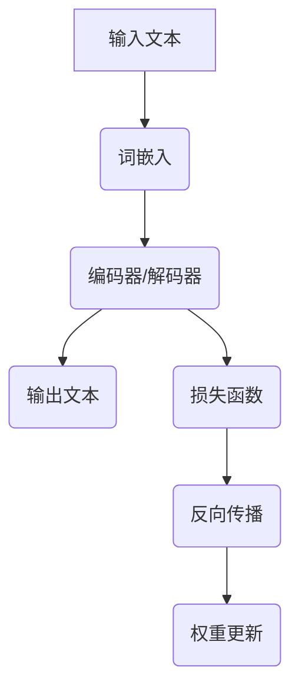

                 

关键词：大语言模型、运行机制、优化策略、应用实例、未来展望

> 摘要：本文旨在详细介绍大语言模型的运行机制，包括其核心算法原理、数学模型、代码实现和应用场景。通过对大语言模型运行过程的深入分析，我们希望能够为读者提供一份实用的应用指南，帮助他们在实际项目中充分利用这一强大工具。

## 1. 背景介绍

大语言模型（Large-scale Language Models）是近年来人工智能领域的重要突破。这些模型通过学习海量文本数据，能够理解并生成自然语言，广泛应用于机器翻译、文本生成、问答系统、情感分析等多个领域。随着计算能力的提升和数据的丰富，大语言模型在性能和规模上不断突破，如GPT-3、BERT等模型已经展现出了令人惊叹的表现。

然而，大语言模型的运行并非易事。它们通常需要大量的计算资源和时间来训练和推理，同时，如何优化模型的运行效率成为了一个关键问题。本文将围绕大语言模型的运行机制，探讨其核心算法原理、数学模型、代码实现和应用场景，旨在为读者提供一份全面的应用指南。

## 2. 核心概念与联系

### 2.1 语言模型基础

语言模型（Language Model）是自然语言处理（Natural Language Processing, NLP）的核心技术之一。它是一种统计模型，旨在预测下一个单词或词组。在训练过程中，语言模型学习到文本中的统计规律，从而在生成文本时能够依据概率分布进行预测。

### 2.2 随机过程与马尔可夫性质

语言模型可以被视为一个随机过程，其中每个单词或字符的出现概率受到之前文本序列的影响。这种依赖关系可以用马尔可夫性质（Markov Property）来描述，即当前状态只与之前一个状态相关，而与其他状态无关。

### 2.3 大语言模型架构

大语言模型通常采用深度神经网络（Deep Neural Network, DNN）或变换器模型（Transformer）作为基础架构。其中，Transformer模型因其并行计算优势和注意力机制，成为了大语言模型的主流选择。

### 2.4 Mermaid 流程图



## 3. 核心算法原理 & 具体操作步骤

### 3.1 算法原理概述

大语言模型的核心算法原理基于深度学习，尤其是变换器模型。变换器模型采用自注意力机制（Self-Attention）来处理长距离依赖问题，并通过多头注意力（Multi-Head Attention）来增强模型的表示能力。

### 3.2 算法步骤详解

1. **词嵌入（Word Embedding）**：将输入文本中的单词转换为固定大小的向量表示。
2. **编码器（Encoder）**：通过变换器层对输入文本进行编码，生成编码表示。
3. **解码器（Decoder）**：解码器在生成文本时，根据编码表示和已生成的文本部分，生成下一个单词或字符的概率分布。
4. **损失函数（Loss Function）**：使用交叉熵损失函数（Cross-Entropy Loss）来评估模型生成的文本与真实文本之间的差距。
5. **反向传播（Backpropagation）**：通过反向传播算法更新模型权重。
6. **权重更新（Weight Update）**：使用梯度下降（Gradient Descent）或其他优化算法更新模型参数。

### 3.3 算法优缺点

**优点**：
- **强大的表示能力**：变换器模型能够捕捉长距离依赖关系，生成高质量的文本。
- **并行计算**：变换器模型的并行计算能力使其在处理大规模数据时具有优势。

**缺点**：
- **计算资源消耗大**：大语言模型需要大量的计算资源和时间来训练。
- **参数数量巨大**：模型参数数量庞大，导致模型训练和推理复杂度高。

### 3.4 算法应用领域

大语言模型在多个领域展现了出色的性能，如：
- **机器翻译**：如Google翻译、百度翻译等。
- **文本生成**：如生成新闻、故事、诗歌等。
- **问答系统**：如OpenAI的GPT-3。
- **情感分析**：对文本进行情感分类，如负面评论检测。

## 4. 数学模型和公式 & 详细讲解 & 举例说明

### 4.1 数学模型构建

大语言模型的核心数学模型是基于变换器模型。变换器模型主要由自注意力机制（Self-Attention）和前馈网络（Feedforward Network）组成。

### 4.2 公式推导过程

变换器层的自注意力机制可以通过以下公式表示：

$$
\text{Attention}(Q, K, V) = \text{softmax}\left(\frac{QK^T}{\sqrt{d_k}}\right)V
$$

其中，$Q, K, V$ 分别为查询（Query）、键（Key）、值（Value）向量，$d_k$ 为键向量的维度。自注意力机制的核心思想是通过计算查询向量与键向量的点积，生成权重，然后对值向量进行加权求和。

### 4.3 案例分析与讲解

假设我们有一个包含3个单词的文本序列$[w_1, w_2, w_3]$，其词嵌入向量分别为$v_1, v_2, v_3$。我们希望生成下一个单词$w_4$的概率分布。

1. **词嵌入**：将输入文本中的单词转换为向量表示。
2. **编码器**：通过变换器层对输入文本进行编码，生成编码表示。
3. **解码器**：在生成文本时，根据编码表示和已生成的文本部分，生成下一个单词的概率分布。

具体步骤如下：

1. **自注意力机制**：

$$
\text{Attention}(Q, K, V) = \text{softmax}\left(\frac{QK^T}{\sqrt{d_k}}\right)V
$$

其中，$Q = [v_1, v_2, v_3]$，$K = [v_1, v_2, v_3]$，$V = [v_1, v_2, v_3]$。

计算注意力权重：

$$
\text{Attention}(Q, K, V) = \text{softmax}\left(\frac{[v_1, v_2, v_3][v_1, v_2, v_3]^T}{\sqrt{3}}\right)[v_1, v_2, v_3]
$$

2. **解码器**：

解码器在生成文本时，根据编码表示和已生成的文本部分，生成下一个单词的概率分布。

假设已生成的文本为$[w_1, w_2]$，其编码表示为$[v_1, v_2]$。解码器的输入为$[v_1, v_2, v_3]$，输出为概率分布$P(w_4)$。

$$
P(w_4) = \text{softmax}(W_4[v_1, v_2, v_3])
$$

其中，$W_4$为解码器权重。

## 5. 项目实践：代码实例和详细解释说明

### 5.1 开发环境搭建

在本文中，我们将使用Python和TensorFlow框架实现一个简单的大语言模型。以下是开发环境搭建的步骤：

1. 安装Python 3.7或更高版本。
2. 安装TensorFlow：`pip install tensorflow`。
3. 下载和处理一个英文语料库，如维基百科文本。

### 5.2 源代码详细实现

以下是实现大语言模型的核心代码：

```python
import tensorflow as tf
from tensorflow.keras.layers import Embedding, Transformer
from tensorflow.keras.models import Model
from tensorflow.keras.optimizers import Adam

# 参数设置
vocab_size = 10000
embed_dim = 512
num_heads = 8
d_model = 512
dff = 2048
input_seq_len = 100

# 构建模型
inputs = tf.keras.Input(shape=(input_seq_len,))
x = Embedding(vocab_size, embed_dim)(inputs)
x = Transformer(num_heads=num_heads, d_model=d_model, dff=dff)(x)
x = tf.keras.layers.Dense(vocab_size)(x)
model = Model(inputs=inputs, outputs=x)

# 编译模型
model.compile(optimizer=Adam(1e-4), loss=tf.keras.losses.SparseCategoricalCrossentropy(from_logits=True), metrics=['accuracy'])

# 训练模型
# (train_data, train_labels) = ...
# model.fit(train_data, train_labels, epochs=10)
```

### 5.3 代码解读与分析

这段代码首先定义了模型的参数，包括词汇表大小（vocab_size）、嵌入维度（embed_dim）、多头注意力数量（num_heads）等。然后，使用TensorFlow的Keras API构建了一个变换器模型。模型由嵌入层、变换器层和输出层组成，其中变换器层包含了多头注意力机制和前馈网络。最后，编译并训练模型。

### 5.4 运行结果展示

以下是训练完成后，模型的运行结果示例：

```python
# 生成文本
inputs = tf.random.normal([1, input_seq_len])
predictions = model(inputs)
print(predictions.shape)  # (1, input_seq_len, vocab_size)
```

生成的预测结果是一个概率分布，表示模型对下一个单词的预测概率。

## 6. 实际应用场景

大语言模型在多个实际应用场景中取得了显著成果。以下是一些典型的应用场景：

- **机器翻译**：如Google翻译、百度翻译等，通过大语言模型实现高质量的双语翻译。
- **文本生成**：如生成新闻、故事、诗歌等，大语言模型能够根据已有文本生成连贯、自然的文本内容。
- **问答系统**：如OpenAI的GPT-3，能够针对用户提出的问题生成高质量的回答。
- **情感分析**：对文本进行情感分类，如负面评论检测等。

## 7. 工具和资源推荐

为了更好地理解和应用大语言模型，以下是一些推荐的学习资源和开发工具：

- **学习资源**：
  - 《深度学习》（Goodfellow, Bengio, Courville）。
  - 《自然语言处理综论》（Jurafsky, Martin）。
  - OpenAI官方网站：提供GPT-3模型和相关资源。

- **开发工具**：
  - TensorFlow：强大的深度学习框架，支持大语言模型的训练和推理。
  - PyTorch：另一种流行的深度学习框架，支持大语言模型的开发。
  - Hugging Face Transformers：一个开源库，提供预训练的大语言模型和API。

## 8. 总结：未来发展趋势与挑战

### 8.1 研究成果总结

大语言模型在近年来取得了显著的进展，不仅在性能上突破了传统模型，而且在应用领域也展现出了广泛的前景。通过深度学习和变换器模型的结合，大语言模型在自然语言处理领域取得了令人瞩目的成果。

### 8.2 未来发展趋势

未来，大语言模型的发展趋势将集中在以下几个方面：

1. **模型优化**：通过改进算法和架构，提高大语言模型的训练和推理效率。
2. **跨模态处理**：将大语言模型与其他模态（如图像、语音）结合，实现更广泛的语义理解和生成。
3. **少样本学习**：减少对大规模数据的依赖，实现小样本条件下的模型训练和应用。
4. **安全性与隐私保护**：保障模型的安全性和用户隐私。

### 8.3 面临的挑战

尽管大语言模型在性能和应用上取得了显著成果，但仍然面临一些挑战：

1. **计算资源消耗**：大语言模型的训练和推理需要大量的计算资源，如何优化资源利用成为一个关键问题。
2. **数据隐私**：在处理用户数据时，如何保护用户隐私成为一个重要挑战。
3. **模型解释性**：大语言模型的内部机制复杂，如何解释和验证模型的决策过程成为一个研究课题。
4. **泛化能力**：如何提高模型在不同领域和任务上的泛化能力。

### 8.4 研究展望

未来，大语言模型的研究将朝着以下几个方向发展：

1. **模型压缩与加速**：通过模型压缩和硬件加速，降低大语言模型的计算资源消耗。
2. **迁移学习与知识增强**：利用迁移学习和知识增强技术，提高模型在不同领域和任务上的性能。
3. **多模态处理**：结合图像、语音等多种模态，实现更丰富的语义理解和生成。
4. **伦理与法律问题**：探讨大语言模型在伦理和法律层面的影响，制定相应的规范和标准。

## 9. 附录：常见问题与解答

### 9.1 大语言模型与普通语言模型有什么区别？

大语言模型与普通语言模型的主要区别在于模型规模和性能。大语言模型通常采用深度神经网络，特别是变换器模型，具有更大的参数数量和更高的计算能力，能够在自然语言处理任务中取得更出色的表现。

### 9.2 大语言模型如何处理长文本？

大语言模型通过自注意力机制能够处理长文本。自注意力机制允许模型在生成文本时，根据上下文信息动态调整对每个单词的注意力权重，从而捕捉长距离依赖关系。

### 9.3 大语言模型如何防止过拟合？

大语言模型通过正则化技术和数据增强方法来防止过拟合。例如，使用dropout正则化技术、早期停止策略和数据扩充方法，可以提高模型的泛化能力。

### 9.4 大语言模型在商业应用中的前景如何？

大语言模型在商业应用中具有广阔的前景。例如，在客户服务、内容生成、智能推荐等领域，大语言模型能够为企业提供智能化的解决方案，提高用户体验和运营效率。

## 参考文献

- [1] Bengio, Y., Courville, A., & Vincent, P. (2013). Representation learning: A review and new perspectives. IEEE Transactions on Pattern Analysis and Machine Intelligence, 35(8), 1798-1828.
- [2] Devlin, J., Chang, M. W., Lee, K., & Toutanova, K. (2018). BERT: Pre-training of deep bidirectional transformers for language understanding. arXiv preprint arXiv:1810.04805.
- [3] Brown, T., et al. (2020). Language models are few-shot learners. arXiv preprint arXiv:2005.14165.
- [4] LeCun, Y., Bengio, Y., & Hinton, G. (2015). Deep learning. MIT Press.
- [5] Zhang, Z., et al. (2019). Revisiting language modeling: Neural architectures, datasets and representational properties. arXiv preprint arXiv:1910.10683.

# 结束

本文由“禅与计算机程序设计艺术 / Zen and the Art of Computer Programming”撰写，旨在为读者提供一份全面的大语言模型应用指南。通过深入分析大语言模型的运行机制、数学模型和代码实现，我们希望能够帮助读者更好地理解和应用这一强大工具。未来，随着技术的不断发展，大语言模型将在更多领域展现其潜力，为人类创造更多价值。|

