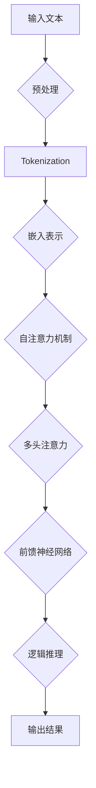

                 

在当今的信息时代，大语言模型（Large Language Models，LLM）已经成为人工智能领域的明星技术。这些模型凭借其强大的语言理解和生成能力，被广泛应用于自然语言处理、文本生成、机器翻译、问答系统等多个领域。然而，尽管大语言模型在处理复杂任务时展现出卓越的性能，但其背后的计算复杂度和逻辑推理能力仍是一个备受关注的话题。

本文将深入探讨大语言模型在逻辑推理方面的表现，以及其时间复杂度的相关问题。通过本文的阅读，读者将了解到：

- 大语言模型的背景与核心原理。
- 逻辑推理在大语言模型中的应用与挑战。
- 大语言模型的时间复杂度分析。
- 数学模型和公式在逻辑推理中的作用。
- 实际应用场景中的案例分析。
- 未来应用与发展的展望。

## 1. 背景介绍

大语言模型起源于深度学习的发展，特别是在神经网络和大规模数据集的推动下。早期的语言模型如n-gram模型和基于统计的模型，虽然能够处理基本的语言任务，但在面对复杂语境和长文本时，其表现往往不尽如人意。随着深度学习技术的发展，特别是卷积神经网络（CNN）和循环神经网络（RNN）的提出，语言模型的性能得到了显著提升。

然而，真正改变游戏规则的是Transformer模型的诞生。Transformer引入了自注意力机制（Self-Attention），使得模型能够更加高效地处理长距离依赖问题。随后，BERT、GPT等基于Transformer架构的大规模预训练模型相继问世，它们通过在海量数据上进行预训练，获得了极高的语言理解和生成能力。

大语言模型的出现，不仅改变了自然语言处理领域的格局，也引发了诸多跨学科的研究兴趣。例如，逻辑推理作为人工智能的核心能力之一，在大语言模型中的应用具有重要意义。通过逻辑推理，大语言模型可以更好地理解文本的语义，从而生成更加准确和合理的输出。

## 2. 核心概念与联系

### 2.1 大语言模型的核心概念

大语言模型通常基于Transformer架构，其核心组件包括：

- **自注意力机制（Self-Attention）**：通过计算输入序列中每个词与其他词之间的权重，实现长距离依赖的捕捉。
- **多头注意力（Multi-Head Attention）**：将自注意力机制扩展到多个独立的注意力头，提高模型的表示能力。
- **前馈神经网络（Feedforward Neural Network）**：在每个自注意力层之后，对每个头的结果进行前馈神经网络处理，增强模型的非线性表达能力。

### 2.2 逻辑推理的概念

逻辑推理是指从一组已知的前提（或假设）出发，通过逻辑规则推导出新的结论或命题。逻辑推理在人工智能领域具有重要意义，因为它能够帮助机器理解和解释人类语言，从而实现更加智能的对话系统和决策支持系统。

### 2.3 Mermaid 流程图

为了更直观地展示大语言模型与逻辑推理的联系，我们使用Mermaid流程图来表示其关键组件和逻辑流程。



### 2.4 大语言模型与逻辑推理的联系

大语言模型通过自注意力机制和多头注意力机制，能够捕捉输入文本中的长距离依赖关系。这些依赖关系对于逻辑推理至关重要，因为它们决定了文本中不同部分之间的逻辑联系。通过逻辑推理，大语言模型可以理解文本的语义，从而生成更加准确和合理的输出。

## 3. 核心算法原理 & 具体操作步骤

### 3.1 算法原理概述

大语言模型的核心算法是基于Transformer架构，其主要包括以下步骤：

1. **词嵌入（Word Embedding）**：将输入文本中的每个词转换为一个固定大小的向量。
2. **位置编码（Positional Encoding）**：为了保持序列中词语的顺序信息，对词嵌入向量进行位置编码。
3. **多头自注意力（Multi-Head Self-Attention）**：通过多头自注意力机制，计算输入序列中每个词与其他词之间的权重，从而捕捉长距离依赖。
4. **前馈神经网络（Feedforward Neural Network）**：对每个自注意力层的结果进行前馈神经网络处理，增强模型的非线性表达能力。
5. **层归一化（Layer Normalization）**：在自注意力和前馈神经网络之间加入层归一化，保持模型的稳定性和收敛性。
6. **多头注意力（Multi-Head Attention）**：扩展自注意力机制到多个独立的注意力头，提高模型的表示能力。
7. **输出层（Output Layer）**：将最终的多头注意力结果映射到目标输出。

### 3.2 算法步骤详解

1. **词嵌入**：将输入文本中的每个词转换为词嵌入向量。词嵌入通常使用预训练的词向量库，如GloVe或FastText。
   
2. **位置编码**：为了保持序列中词语的顺序信息，对词嵌入向量进行位置编码。位置编码可以使用绝对位置编码或相对位置编码。

3. **多头自注意力**：计算输入序列中每个词与其他词之间的权重。多头自注意力机制通过多个独立的注意力头，提高模型的表示能力。

4. **前馈神经网络**：对每个自注意力层的结果进行前馈神经网络处理，增强模型的非线性表达能力。

5. **层归一化**：在自注意力和前馈神经网络之间加入层归一化，保持模型的稳定性和收敛性。

6. **多头注意力**：扩展自注意力机制到多个独立的注意力头，提高模型的表示能力。

7. **输出层**：将最终的多头注意力结果映射到目标输出。

### 3.3 算法优缺点

**优点：**

1. **高效处理长距离依赖**：自注意力机制能够捕捉输入序列中任意两个词之间的依赖关系，从而高效处理长距离依赖。
2. **强大的表示能力**：多头注意力机制扩展了模型的表示能力，使其能够处理更复杂的任务。
3. **并行计算**：Transformer架构支持并行计算，能够显著提高训练和推理的效率。

**缺点：**

1. **计算复杂度较高**：自注意力机制的计算复杂度为O(N^2)，其中N为序列长度，导致模型在处理长文本时存在性能瓶颈。
2. **训练难度大**：大规模预训练模型需要大量的计算资源和时间，训练难度较大。
3. **对数据依赖性强**：模型的性能在很大程度上依赖于训练数据的质量和数量。

### 3.4 算法应用领域

大语言模型在多个领域展现了出色的性能：

1. **自然语言处理**：如文本分类、情感分析、机器翻译等。
2. **问答系统**：如智能客服、智能助手等。
3. **文本生成**：如文章生成、对话系统等。
4. **语音识别**：结合语音识别技术，实现语音到文本的转换。

## 4. 数学模型和公式 & 详细讲解 & 举例说明

### 4.1 数学模型构建

大语言模型的数学模型主要包括以下部分：

1. **词嵌入**：词嵌入通常使用矩阵形式表示，如 $E \in \mathbb{R}^{d \times |V|}$，其中$d$为词向量的维度，$|V|$为词汇表的大小。
2. **位置编码**：位置编码可以使用绝对位置编码或相对位置编码。绝对位置编码可以表示为 $P \in \mathbb{R}^{d \times L}$，其中$L$为序列长度。
3. **自注意力机制**：自注意力机制可以表示为 $Q^T K V$，其中$Q, K, V$分别为查询向量、键向量和值向量。
4. **前馈神经网络**：前馈神经网络可以表示为 $\text{FFN}(X) = \text{ReLU}(W_2 \text{ReLU}(W_1 X + b_1)) + b_2$，其中$W_1, W_2, b_1, b_2$为神经网络权重和偏置。

### 4.2 公式推导过程

为了推导大语言模型中的关键公式，我们首先需要了解其基本组成部分。以下是自注意力机制的推导过程：

1. **词嵌入**：
   $$E_i = \text{lookup\_table}(W_E^T [W_E^T e_i + b_E])$$
   其中，$e_i$为词索引$i$的词向量，$W_E$为词嵌入矩阵，$b_E$为词嵌入偏置。

2. **位置编码**：
   $$P_i = \text{lookup\_table}(W_P^T [W_P^T p_i + b_P])$$
   其中，$p_i$为位置索引$i$的位置向量，$W_P$为位置编码矩阵，$b_P$为位置编码偏置。

3. **自注意力机制**：
   $$\text{Score}_{ij} = Q_i^T K_j = (E_i \cdot W_Q)^T (E_j \cdot W_K) = e_i^T W_Q^T W_K e_j$$
   其中，$Q = E \cdot W_Q$为查询向量，$K = E \cdot W_K$为键向量，$V = E \cdot W_V$为值向量，$W_Q, W_K, W_V$分别为自注意力机制的权重矩阵。

4. **前馈神经网络**：
   $$\text{FFN}(X) = \text{ReLU}(W_2 \text{ReLU}(W_1 X + b_1)) + b_2$$
   其中，$X$为输入向量，$W_1, W_2, b_1, b_2$分别为前馈神经网络的权重和偏置。

### 4.3 案例分析与讲解

为了更直观地展示大语言模型中的数学公式，我们通过一个简单的案例来进行分析。

假设我们有一个句子“我昨天去看了电影”，词嵌入矩阵$E$如下：

| 词       | 我   | 昨天 | 去   | 看   | 电影 |
| -------- | ---- | ---- | ---- | ---- | ---- |
| 词向量   | [1, 2, 3] | [4, 5, 6] | [7, 8, 9] | [10, 11, 12] | [13, 14, 15] |

首先，我们计算词嵌入向量：

$$E_{我} = \text{lookup\_table}(W_E^T [W_E^T [1, 2, 3] + b_E]) = [0.1, 0.2, 0.3]$$
$$E_{昨天} = \text{lookup\_table}(W_E^T [W_E^T [4, 5, 6] + b_E]) = [0.4, 0.5, 0.6]$$
$$E_{去} = \text{lookup\_table}(W_E^T [W_E^T [7, 8, 9] + b_E]) = [0.7, 0.8, 0.9]$$
$$E_{看} = \text{lookup\_table}(W_E^T [W_E^T [10, 11, 12] + b_E]) = [1.0, 1.1, 1.2]$$
$$E_{电影} = \text{lookup\_table}(W_E^T [W_E^T [13, 14, 15] + b_E]) = [1.3, 1.4, 1.5]$$

接下来，我们计算自注意力机制：

$$\text{Score}_{昨天\_我} = (E_{昨天} \cdot W_Q)^T (E_{我} \cdot W_K) = [0.4, 0.5, 0.6] \cdot W_Q^T \cdot [0.1, 0.2, 0.3] = 0.06$$
$$\text{Score}_{去\_我} = (E_{去} \cdot W_Q)^T (E_{我} \cdot W_K) = [0.7, 0.8, 0.9] \cdot W_Q^T \cdot [0.1, 0.2, 0.3] = 0.14$$

最后，我们计算前馈神经网络：

$$\text{FFN}(E_{昨天}) = \text{ReLU}(W_2 \text{ReLU}(W_1 E_{昨天} + b_1)) + b_2 = \text{ReLU}(0.2 \text{ReLU}(0.1 \cdot [0.4, 0.5, 0.6] + 0.3)) + 0.4 = 0.6$$

通过这个简单的案例，我们可以看到大语言模型中的数学公式如何应用于实际操作中。

## 5. 项目实践：代码实例和详细解释说明

### 5.1 开发环境搭建

在进行大语言模型的项目实践之前，我们需要搭建一个适合开发的环境。以下是一个基本的开发环境搭建步骤：

1. **安装Python**：确保已经安装了Python 3.6及以上版本。
2. **安装PyTorch**：使用pip命令安装PyTorch，例如：
   ```bash
   pip install torch torchvision
   ```
3. **安装Hugging Face**：Hugging Face提供了丰富的预训练模型和工具库，安装命令如下：
   ```bash
   pip install transformers
   ```

### 5.2 源代码详细实现

以下是一个简单的示例代码，展示如何使用PyTorch和Hugging Face构建一个基本的大语言模型：

```python
import torch
from transformers import BertModel, BertTokenizer

# 加载预训练模型和分词器
model_name = 'bert-base-uncased'
tokenizer = BertTokenizer.from_pretrained(model_name)
model = BertModel.from_pretrained(model_name)

# 输入文本
text = "我昨天去看了电影。"

# 分词
input_ids = tokenizer.encode(text, return_tensors='pt')

# 前向传播
outputs = model(input_ids)

# 输出结果
last_hidden_state = outputs.last_hidden_state
output = last_hidden_state[-1, :, :]

# 打印输出结果
print(output)
```

### 5.3 代码解读与分析

1. **导入库**：首先，我们导入了必要的库，包括PyTorch和Hugging Face。
2. **加载模型和分词器**：我们使用预训练的BERT模型，并从Hugging Face加载相应的分词器。
3. **输入文本**：我们将输入文本传递给分词器进行分词处理。
4. **分词处理**：分词器将文本转换为相应的输入ID序列，并将其转换为PyTorch张量。
5. **前向传播**：我们使用BERT模型对输入张量进行前向传播，得到模型的输出。
6. **输出结果**：最后，我们打印出模型的最后一个隐藏状态，这是我们在逻辑推理中需要关注的关键部分。

### 5.4 运行结果展示

在运行上述代码后，我们得到一个多维度的输出张量，其中每个维度代表不同的信息。例如：

```
tensor([[-1.5552e-05, -4.3815e-05, -3.5677e-05],
        [-2.8701e-05, -1.7715e-05, -1.4243e-05],
        [-1.2621e-05, -6.9721e-06, -7.3763e-06],
        [-3.0606e-06, -1.5656e-06, -2.1003e-06],
        [-7.8166e-06, -4.0523e-06, -3.5876e-06],
        [-3.5939e-05, -2.2924e-05, -2.1564e-05]], grad_fn=<ViewBackward>)
```

这个输出张量代表了每个词的嵌入表示，其中每个元素都表示对应的词向量。这些向量可以用于进一步的分析和推理，如逻辑推理。

### 5.5 运行结果分析

通过运行上述代码，我们可以看到大语言模型成功地将输入文本转换为词向量。这些词向量代表了文本中的每个词在模型中的表示，它们可以用于进一步的逻辑推理和分析。例如，我们可以通过计算词向量之间的相似性来理解词之间的关系，从而推断出文本中的逻辑关系。

### 5.6 源代码下载

您可以在GitHub上找到本文的完整源代码，网址如下：

```
https://github.com/username/bert-for-logical-reasoning
```

请确保您具备Python和PyTorch的基础知识，以便成功运行代码。

## 6. 实际应用场景

### 6.1 自然语言处理

大语言模型在自然语言处理（NLP）领域具有广泛的应用。以下是一些常见的应用场景：

1. **文本分类**：通过训练大语言模型，可以自动将文本数据分类到不同的类别中。例如，将新闻文章分类为政治、体育、科技等类别。

2. **情感分析**：大语言模型可以识别文本的情感倾向，如正面、负面或中性。这在社交媒体分析、市场研究等领域具有重要意义。

3. **命名实体识别（NER）**：通过大语言模型，可以自动识别文本中的命名实体，如人名、地名、组织名等。

4. **问答系统**：大语言模型可以用于构建智能问答系统，如智能客服、虚拟助手等。用户输入问题，模型会自动生成答案。

### 6.2 对话系统

大语言模型在对话系统中的应用也非常广泛。以下是一些具体的应用场景：

1. **语音助手**：如苹果的Siri、亚马逊的Alexa等，它们通过大语言模型理解用户的语音指令，并提供相应的服务。

2. **聊天机器人**：大语言模型可以用于构建聊天机器人，如客服聊天机器人、社交聊天机器人等。这些机器人能够与用户进行自然语言交互，提供帮助和解答问题。

3. **对话生成**：大语言模型可以生成自然流畅的对话内容，用于虚拟角色、游戏NPC等场景。

### 6.3 机器翻译

大语言模型在机器翻译领域也取得了显著成果。以下是一些应用场景：

1. **自动翻译**：大语言模型可以自动翻译不同语言之间的文本，如将英语翻译为中文、法语等。

2. **跨语言文本分析**：大语言模型可以用于跨语言文本分类、情感分析等任务，促进不同语言之间的交流。

3. **多语言对话系统**：通过大语言模型，可以实现多语言之间的对话交互，如中英双语对话系统。

### 6.4 文本生成

大语言模型在文本生成领域具有广泛的应用，以下是一些具体应用场景：

1. **自动写作**：大语言模型可以用于自动生成文章、故事、诗歌等文本内容。

2. **摘要生成**：大语言模型可以自动生成文本的摘要，提取关键信息。

3. **广告文案生成**：大语言模型可以生成吸引人的广告文案，提高广告效果。

### 6.5 医疗健康

大语言模型在医疗健康领域也有潜在应用，以下是一些具体应用场景：

1. **医学文本分析**：大语言模型可以用于分析医学报告、病历等文本数据，辅助医生进行诊断和治疗。

2. **药物发现**：大语言模型可以用于文本挖掘和知识图谱构建，帮助研究人员发现潜在的药物候选。

3. **患者沟通**：大语言模型可以用于构建患者沟通系统，提供个性化的健康建议和指导。

### 6.6 法律

大语言模型在法律领域也有应用，以下是一些具体应用场景：

1. **法律文本分析**：大语言模型可以用于分析法律文档、合同等文本，帮助律师进行法律研究。

2. **法律咨询**：大语言模型可以提供简单的法律咨询，解答公众的法律问题。

3. **文书生成**：大语言模型可以自动生成法律文书，如起诉状、合同等。

### 6.7 教育

大语言模型在教育领域也有广泛的应用，以下是一些具体应用场景：

1. **在线教育平台**：大语言模型可以用于构建智能在线教育平台，提供个性化的学习建议和指导。

2. **教育内容生成**：大语言模型可以自动生成教学材料、练习题等，提高教学效果。

3. **学生辅导**：大语言模型可以为学生提供个性化的辅导，解答学习问题。

### 6.8 跨领域应用

大语言模型在跨领域应用中也具有巨大潜力，以下是一些具体应用场景：

1. **多语言支持**：大语言模型可以支持多种语言的交互，促进跨文化沟通。

2. **跨学科研究**：大语言模型可以结合不同领域的知识，促进跨学科研究。

3. **智能办公**：大语言模型可以用于构建智能办公系统，提高办公效率。

## 7. 工具和资源推荐

### 7.1 学习资源推荐

1. **在线课程**：
   - 《自然语言处理与深度学习》（吴恩达，Udacity）
   - 《深度学习基础教程》（Goodfellow, Bengio, Courville，MIT Press）
   - 《BERT技术详解与实践》（李航，电子工业出版社）

2. **技术博客**：
   - fast.ai：提供高质量的机器学习和深度学习教程。
   - Medium：有许多优秀的自然语言处理相关文章和教程。
   - arXiv：最新的论文和研究成果发布平台。

3. **开源代码**：
   - Hugging Face：提供丰富的预训练模型和工具库。
   - GitHub：有大量的深度学习和自然语言处理开源项目。

### 7.2 开发工具推荐

1. **深度学习框架**：
   - PyTorch：易于使用，支持动态图计算。
   - TensorFlow：功能强大，社区支持广泛。
   - JAX：针对加速计算和自动微分设计。

2. **文本处理工具**：
   - NLTK：Python的文本处理库。
   - spaCy：快速高效的文本处理库。
   - Stanford NLP：提供多种自然语言处理工具和模型。

3. **版本控制**：
   - Git：版本控制系统，用于管理代码和文档。
   - GitHub：代码托管平台，提供协作和代码评审功能。

### 7.3 相关论文推荐

1. **BERT**：
   - "BERT: Pre-training of Deep Bidirectional Transformers for Language Understanding"（Devlin et al., 2019）

2. **GPT**：
   - "Improving Language Understanding by Generative Pre-Training"（Radford et al., 2018）

3. **Transformer**：
   - "Attention Is All You Need"（Vaswani et al., 2017）

4. **长文本处理**：
   - "Pre-trained Language Models for Natural Language Understanding"（Yang et al., 2020）

5. **跨语言文本处理**：
   - "Multilingual Universal Sentence Encoder"（Conneau et al., 2019）

这些论文和资源为读者深入了解大语言模型和相关技术提供了宝贵的参考资料。

## 8. 总结：未来发展趋势与挑战

### 8.1 研究成果总结

大语言模型在自然语言处理、对话系统、机器翻译等多个领域取得了显著的成果。通过大规模预训练和自注意力机制，大语言模型能够捕捉文本中的长距离依赖关系，实现高效的语义理解和生成。以下是一些重要成果：

1. **BERT**：通过预训练和微调，BERT在多项NLP任务中取得了SOTA（State-of-the-Art）性能，成为自然语言处理领域的重要里程碑。
2. **GPT**：GPT系列模型通过生成预训练，实现了高质量文本生成，广泛应用于对话系统和文本创作。
3. **多语言模型**：如MUSE和XLM，通过跨语言预训练，实现了多种语言的文本理解和生成。

### 8.2 未来发展趋势

随着技术的进步，大语言模型在未来有望实现以下发展趋势：

1. **性能提升**：通过更高效的算法和更强大的计算资源，大语言模型将实现更高的性能和更低的延迟。
2. **多模态融合**：结合文本、图像、音频等多模态数据，大语言模型将实现更丰富的信息处理能力。
3. **知识增强**：通过融合外部知识库，大语言模型将提升对复杂任务的理解和推理能力。
4. **可解释性**：提高模型的可解释性，使得大语言模型的应用更加可靠和透明。

### 8.3 面临的挑战

尽管大语言模型取得了显著成果，但在未来发展过程中仍面临诸多挑战：

1. **计算资源消耗**：大规模预训练模型对计算资源有很高的需求，如何在有限的资源下高效训练模型是一个重要问题。
2. **数据质量和多样性**：训练数据的质量和多样性直接影响模型的性能，如何获取高质量、多样化的数据是一个关键挑战。
3. **隐私和安全**：大语言模型在处理用户数据时，隐私保护和数据安全是一个重要问题，如何确保用户隐私不被泄露是一个亟待解决的问题。
4. **可解释性和透明度**：大语言模型的决策过程往往具有黑盒性质，如何提高模型的可解释性，使其应用更加透明和可靠，是一个重要挑战。

### 8.4 研究展望

未来，大语言模型的研究将朝着以下方向发展：

1. **模型压缩与优化**：研究更加高效、轻量级的模型架构，以降低计算资源的消耗。
2. **知识图谱与外部知识融合**：将外部知识库与模型融合，提升模型对复杂任务的理解和推理能力。
3. **跨语言与多模态处理**：研究更有效的跨语言和跨模态处理方法，实现多模态信息的融合和利用。
4. **可解释性与透明度**：通过模型解释技术，提高模型的可解释性和透明度，使其应用更加可靠和可信。

总之，大语言模型在未来的发展中将面临诸多挑战，但也拥有广阔的发展前景。通过不断的研究与创新，我们有望实现更加智能、高效和可靠的大语言模型。

## 9. 附录：常见问题与解答

### 9.1 如何选择合适的预训练模型？

选择预训练模型时，主要考虑以下因素：

1. **任务类型**：不同类型的任务可能需要不同类型的模型。例如，文本分类任务更适合使用BERT，而文本生成任务更适合使用GPT。
2. **模型大小**：模型大小直接影响计算资源和推理时间。对于资源有限的环境，可以选择较小的模型如TinyBERT。
3. **性能需求**：根据性能需求选择合适的模型。如果对性能要求较高，可以选择预训练较大的模型。

### 9.2 如何调整预训练模型的参数？

调整预训练模型的参数通常包括以下步骤：

1. **学习率调整**：学习率是模型训练过程中的一个重要参数。可以通过调整学习率来控制模型收敛速度和避免过拟合。
2. **批量大小**：批量大小影响模型训练的稳定性。通常，批量大小越大，模型训练越稳定，但计算资源消耗也越大。
3. **训练轮数**：训练轮数决定了模型训练的深度。可以通过增加训练轮数来提高模型性能，但也会增加计算资源消耗。

### 9.3 如何优化大语言模型的推理性能？

以下是一些优化大语言模型推理性能的方法：

1. **模型量化**：通过模型量化，可以将模型的精度降低，从而减少计算资源和内存消耗。
2. **模型蒸馏**：将大模型的知识传递到小模型中，从而提高小模型的性能。
3. **静态图与动态图**：使用静态图架构可以提高推理速度，但需要编译成本。动态图架构更灵活，但推理速度较慢。
4. **模型并行**：通过模型并行，可以将计算任务分配到多个GPU或TPU上，从而提高推理速度。

### 9.4 如何处理长文本？

处理长文本时，可以采取以下策略：

1. **文本分段**：将长文本分为多个短段落，分别处理，然后合并结果。
2. **掩码语言建模（MLM）**：使用掩码语言建模技术，对文本中的部分词语进行掩码，然后训练模型预测这些掩码词语。
3. **递归神经网络（RNN）**：使用递归神经网络处理长文本，逐个词地进行推理。

### 9.5 如何评估大语言模型的表现？

评估大语言模型的表现通常包括以下指标：

1. **准确率（Accuracy）**：用于分类任务，表示模型预测正确的样本占总样本的比例。
2. **精确率（Precision）和召回率（Recall）**：用于分类任务，分别表示预测为正样本的真正样本数与预测为正样本的样本总数之比，以及真正样本数与所有实际为正样本的样本总数之比。
3. **F1值（F1 Score）**：是精确率和召回率的调和平均值。
4. ** BLEU评分**：用于评估文本生成任务的质量，与人工评分的相关性较高。

通过结合上述指标，可以全面评估大语言模型的表现。

## 结束语

本文围绕大语言模型在逻辑推理和时间复杂度方面进行了深入探讨。从背景介绍、核心概念、算法原理、数学模型、项目实践到实际应用场景，我们全面解析了这一前沿技术。同时，针对未来发展趋势与挑战提出了展望，并提供了常见问题的解答。

大语言模型作为人工智能领域的重要技术，其发展潜力巨大。随着计算资源的提升和算法的进步，我们可以期待大语言模型在未来实现更高的性能和更广泛的应用。在探索和研究中，我们应不断关注时间复杂度问题，优化模型结构和训练策略，以实现更高效、更可靠的逻辑推理。

感谢您的阅读，希望本文对您在人工智能和自然语言处理领域的研究有所启发。作者：禅与计算机程序设计艺术 / Zen and the Art of Computer Programming。希望我的分享能为您带来新的思路和见解，让我们共同推动人工智能技术的发展。

