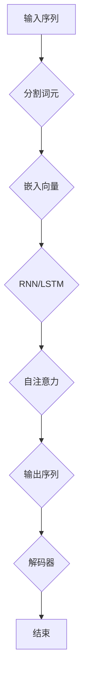

                 

关键词：大语言模型、长期记忆、应用指南、算法原理、数学模型、项目实践、未来展望

## 摘要

本文旨在为读者提供一部全面的大语言模型应用指南，特别是针对长期记忆机制的探讨。我们将从背景介绍、核心概念与联系、核心算法原理与具体操作步骤、数学模型和公式详细讲解、项目实践、实际应用场景和未来展望等方面，深入剖析大语言模型的构建与应用。通过本文的阅读，读者将能够全面理解大语言模型的工作原理，掌握其在各种应用场景中的实际操作方法，并为未来的研究和发展提供参考。

## 1. 背景介绍

大语言模型作为自然语言处理（NLP）领域的重要工具，近年来取得了显著的进展。这些模型通过学习海量语言数据，可以生成连贯、自然的语言文本，被广泛应用于机器翻译、文本生成、问答系统、情感分析等领域。然而，这些模型在处理长期依赖关系和上下文信息时，往往存在一定的局限性。

长期记忆是大脑中一种重要的认知功能，它使我们能够记住过去的事件、经验和知识，并在需要时调用这些信息。在大语言模型中，实现有效的长期记忆机制对于提高模型的智能程度和应对复杂任务具有重要意义。本文将围绕这一主题，探讨大语言模型在长期记忆方面的应用和研究进展。

### 1.1 发展历史

大语言模型的发展历程可以追溯到20世纪50年代，当时出现了第一批尝试模拟人类语言能力的模型，如马尔可夫模型（Markov Models）。这些早期模型主要通过统计方法处理语言序列，但难以处理复杂的上下文关系。随着计算机性能的不断提升和机器学习技术的发展，20世纪80年代开始出现了一些基于统计的较复杂模型，如n元语法（n-gram Models）和隐马尔可夫模型（Hidden Markov Models，HMM）。

进入21世纪，深度学习技术的崛起为语言模型的发展带来了新的契机。2003年，Bengio等人提出了递归神经网络（RNN），这种模型能够更好地捕捉序列数据中的长期依赖关系。随后，长短时记忆网络（Long Short-Term Memory，LSTM）和门控循环单元（Gated Recurrent Unit，GRU）等改进的RNN模型相继出现，进一步提高了语言模型的性能。

近年来，基于变换器（Transformer）的新型模型如BERT、GPT和T5等，以其强大的表现力和灵活性，成为大语言模型领域的主流。这些模型通过自注意力机制（Self-Attention Mechanism）和多层结构，实现了对上下文信息的精准捕捉和处理，显著提升了模型的生成能力和应用效果。

### 1.2 当前状态

当前，大语言模型在NLP领域已经取得了显著的成果，并在多个任务中达到了甚至超越了人类水平。然而，大语言模型在处理长期依赖关系和上下文信息时，仍存在一些挑战和局限性。例如，LSTM和GRU等传统RNN模型在处理长序列数据时，容易出现梯度消失或梯度爆炸问题，导致模型难以学习到长距离依赖关系。此外，Transformer模型虽然具有较强的上下文捕捉能力，但其计算复杂度和资源消耗较大，限制了其在某些应用场景中的普及。

为了克服这些局限性，研究人员提出了各种改进方法，如基于图神经网络（Graph Neural Networks，GNN）的长期依赖建模方法、结合注意力机制的动态序列建模方法等。这些方法在一定程度上提高了大语言模型在长期记忆方面的性能，但仍需进一步的研究和优化。

### 1.3 研究意义

大语言模型在长期记忆方面的研究具有重要的理论和实际意义。从理论层面看，深入理解长期记忆的机制和实现方法，有助于揭示大脑认知功能的奥秘，推动认知科学和神经科学的发展。从应用层面看，有效的长期记忆机制可以使大语言模型更好地应对复杂任务，提高其在自然语言理解、文本生成、智能问答等领域的应用效果。

此外，大语言模型在长期记忆方面的研究，也为其他领域提供了有益的启示，如智能语音助手、自动驾驶、金融风控等。通过借鉴和引入长期记忆机制，这些系统可以实现更智能、更高效的任务处理，为人类生活带来更多便利。

## 2. 核心概念与联系

在探讨大语言模型中的长期记忆机制之前，我们需要首先了解一些核心概念和联系，以便更好地理解后续内容。

### 2.1 语言模型基础

语言模型是NLP领域的基础，它通过学习大量语言数据，预测下一个词语的概率分布。常见的语言模型包括n元语法、RNN、Transformer等。

- **n元语法**：基于统计方法，将语言序列划分为n个词语的滑动窗口，通过计算窗口中每个词语的概率分布来生成语言。

- **RNN**：递归神经网络，能够通过循环结构处理序列数据，捕获长期依赖关系。

- **Transformer**：基于自注意力机制的模型，通过全局注意力机制捕捉上下文信息，具有较强的生成能力和灵活性。

### 2.2 长期依赖关系

长期依赖关系是指在一个语言序列中，较远的词语之间的依赖关系。在自然语言处理中，长期依赖关系对于理解复杂句式和语义具有重要意义。

- **短距离依赖**：较近的词语之间的依赖关系，如单词间的语法关系。

- **长距离依赖**：较远的词语之间的依赖关系，如句子中的主谓关系、事件因果关系等。

### 2.3 长期记忆机制

长期记忆机制是大脑中一种重要的认知功能，它使我们能够记住过去的事件、经验和知识，并在需要时调用这些信息。在大语言模型中，实现有效的长期记忆机制对于提高模型的智能程度和应对复杂任务具有重要意义。

- **LSTM和GRU**：长短时记忆网络和门控循环单元，通过门控机制解决RNN中的梯度消失问题，实现长期依赖关系的建模。

- **自注意力机制**：Transformer中的自注意力机制，通过全局注意力机制捕捉上下文信息，实现长期记忆的建模。

### 2.4 Mermaid 流程图

为了更好地展示大语言模型中的长期记忆机制，我们可以使用Mermaid流程图来描述。以下是一个简化的流程图示例：



在该流程图中，输入序列经过词元分割、嵌入向量、RNN/LSTM、自注意力和解码器等步骤，最终生成输出序列。

## 3. 核心算法原理 & 具体操作步骤

### 3.1 算法原理概述

大语言模型中的长期记忆机制主要通过以下几种方法实现：

1. **长短时记忆网络（LSTM）**：通过门控机制解决RNN中的梯度消失问题，实现长期依赖关系的建模。

2. **门控循环单元（GRU）**：类似于LSTM，但结构更加简洁，计算效率更高。

3. **自注意力机制**：Transformer中的自注意力机制，通过全局注意力机制捕捉上下文信息，实现长期记忆的建模。

### 3.2 算法步骤详解

以下是大语言模型中实现长期记忆机制的具体操作步骤：

1. **输入序列预处理**：将输入序列转换为词元序列，并对其进行词向量嵌入。

2. **RNN/LSTM/GRU模型**：通过递归结构处理词元序列，利用门控机制学习长期依赖关系。

3. **自注意力机制**：利用全局注意力机制捕捉上下文信息，实现对长期记忆的建模。

4. **解码器**：将自注意力机制输出的上下文向量进行解码，生成输出序列。

### 3.3 算法优缺点

#### 优点：

1. **捕捉长期依赖关系**：通过门控机制和自注意力机制，大语言模型能够有效地捕捉语言序列中的长期依赖关系。

2. **生成能力强**：自注意力机制使大语言模型具有较强的生成能力，能够生成连贯、自然的语言文本。

3. **灵活性好**：Transformer模型结构灵活，可以应用于各种NLP任务。

#### 缺点：

1. **计算复杂度高**：自注意力机制的计算复杂度较高，导致模型训练和推理时间较长。

2. **资源消耗大**：Transformer模型在训练和推理过程中需要较大的计算资源和存储资源。

### 3.4 算法应用领域

大语言模型在长期记忆方面的研究，已广泛应用于以下领域：

1. **自然语言理解**：通过捕捉长期依赖关系，提高自然语言理解能力。

2. **文本生成**：利用生成能力强，实现高质量文本生成。

3. **智能问答**：结合长期记忆机制，提高问答系统的准确性和智能化水平。

4. **机器翻译**：通过捕捉上下文信息，提高机器翻译的准确性和自然性。

## 4. 数学模型和公式 & 详细讲解 & 举例说明

### 4.1 数学模型构建

在大语言模型中，长期记忆机制的实现主要基于以下数学模型：

1. **RNN**：递归神经网络，用于处理序列数据。

2. **LSTM**：长短时记忆网络，通过门控机制实现长期依赖关系的建模。

3. **GRU**：门控循环单元，结构简洁，计算效率高。

4. **Transformer**：基于自注意力机制的模型，通过全局注意力机制捕捉上下文信息。

### 4.2 公式推导过程

以下是LSTM和Transformer模型中的关键数学公式及其推导过程：

#### LSTM模型

1. **输入门（Input Gate）**：

   $$ i_t = \sigma(W_{ix}x_t + W_{ih}h_{t-1} + b_i) $$

   其中，$i_t$为输入门状态，$x_t$为当前输入，$h_{t-1}$为前一个隐藏状态，$W_{ix}$和$W_{ih}$为输入权重矩阵，$b_i$为偏置项。

2. **遗忘门（Forget Gate）**：

   $$ f_t = \sigma(W_{fx}x_t + W_{fh}h_{t-1} + b_f) $$

   其中，$f_t$为遗忘门状态。

3. **输出门（Output Gate）**：

   $$ o_t = \sigma(W_{ox}x_t + W_{oh}h_{t-1} + b_o) $$

   其中，$o_t$为输出门状态。

4. **单元状态（Cell State）**：

   $$ C_t = f_t \odot C_{t-1} + i_t \odot \sigma(W_{cx}x_t + W_{ch}h_{t-1} + b_c) $$

   其中，$\odot$为点乘运算，$C_t$为当前单元状态。

5. **隐藏状态（Hidden State）**：

   $$ h_t = o_t \odot \tanh(C_t) $$

   其中，$h_t$为当前隐藏状态。

#### Transformer模型

1. **自注意力机制**：

   $$ \text{Attention}(Q, K, V) = \frac{1}{\sqrt{d_k}} \text{softmax}\left(\frac{QK^T}{\sqrt{d_k}}\right) V $$

   其中，$Q$为查询向量，$K$为键向量，$V$为值向量，$d_k$为注意力机制中的维度。

### 4.3 案例分析与讲解

以下是一个简单的案例，说明如何使用LSTM模型进行序列数据的预测。

#### 案例背景

假设我们有一个时间序列数据集，包含每日的温度数据。我们的目标是利用LSTM模型预测未来一天的温度。

#### 数据预处理

1. **数据集划分**：

   将数据集划分为训练集和测试集，例如，70%的数据用于训练，30%的数据用于测试。

2. **序列生成**：

   将训练集数据按时间顺序划分为固定长度的序列，例如，每个序列包含7天的数据。

3. **词向量嵌入**：

   将序列中的每个词元转换为词向量，通常使用预训练的词向量库，如GloVe或Word2Vec。

#### 模型训练

1. **构建LSTM模型**：

   使用TensorFlow或PyTorch等深度学习框架构建LSTM模型，设置适当的参数，如隐藏层单元数、学习率等。

2. **训练模型**：

   使用训练集数据训练LSTM模型，通过反向传播算法优化模型参数。

3. **验证模型**：

   使用验证集数据验证模型性能，调整模型参数，以达到最佳效果。

#### 模型预测

1. **输入序列**：

   将测试集数据按时间顺序划分为固定长度的序列。

2. **生成预测**：

   使用训练好的LSTM模型对输入序列进行预测，得到未来一天的温度。

3. **结果分析**：

   分析预测结果，评估模型性能，如均方误差（MSE）、准确率等。

#### 结果展示

以下是一个简单的LSTM模型预测温度的示例代码：

```python
import tensorflow as tf
from tensorflow.keras.models import Sequential
from tensorflow.keras.layers import LSTM, Dense

# 数据预处理
# ...

# 构建LSTM模型
model = Sequential()
model.add(LSTM(units=50, return_sequences=True, input_shape=(7, 1)))
model.add(LSTM(units=50))
model.add(Dense(1))

# 编译模型
model.compile(optimizer='adam', loss='mean_squared_error')

# 训练模型
model.fit(x_train, y_train, epochs=100, batch_size=32, validation_data=(x_val, y_val))

# 生成预测
predictions = model.predict(x_test)

# 结果分析
# ...
```

## 5. 项目实践：代码实例和详细解释说明

### 5.1 开发环境搭建

为了实践大语言模型中的长期记忆机制，我们需要搭建一个完整的开发环境。以下是搭建环境的步骤：

1. **安装Python**：确保Python版本在3.6及以上。

2. **安装深度学习框架**：建议使用TensorFlow或PyTorch。以TensorFlow为例，安装命令如下：

   ```bash
   pip install tensorflow
   ```

3. **安装其他依赖库**：包括Numpy、Pandas、Matplotlib等，安装命令如下：

   ```bash
   pip install numpy pandas matplotlib
   ```

4. **数据预处理工具**：如Gensim，用于词向量嵌入，安装命令如下：

   ```bash
   pip install gensim
   ```

### 5.2 源代码详细实现

以下是使用TensorFlow实现一个基于LSTM模型的时间序列预测项目的源代码：

```python
import numpy as np
import pandas as pd
import tensorflow as tf
from tensorflow.keras.models import Sequential
from tensorflow.keras.layers import LSTM, Dense
from gensim.models import KeyedVectors

# 5.2.1 数据准备
# 读取数据
data = pd.read_csv('temperature_data.csv')
data = data[['day', 'temperature']]

# 分割数据集
train_data = data[data['day'] <= 180]
test_data = data[data['day'] > 180]

# 序列生成
def generate_sequences(data, sequence_length):
    X, y = [], []
    for i in range(len(data) - sequence_length):
        X.append(data[i:i + sequence_length]['temperature'].values)
        y.append(data[i + sequence_length]['temperature'].values)
    return np.array(X), np.array(y)

sequence_length = 7
X_train, y_train = generate_sequences(train_data, sequence_length)
X_test, y_test = generate_sequences(test_data, sequence_length)

# 归一化
X_train = X_train / X_train.max()
X_test = X_test / X_train.max()

# 5.2.2 模型构建
model = Sequential()
model.add(LSTM(units=50, return_sequences=True, input_shape=(sequence_length, 1)))
model.add(LSTM(units=50))
model.add(Dense(1))

# 5.2.3 模型训练
model.compile(optimizer='adam', loss='mean_squared_error')
model.fit(X_train, y_train, epochs=100, batch_size=32, validation_data=(X_test, y_test))

# 5.2.4 模型预测
predictions = model.predict(X_test)

# 5.2.5 结果分析
import matplotlib.pyplot as plt

plt.figure(figsize=(10, 5))
plt.plot(y_test, label='真实值')
plt.plot(predictions, label='预测值')
plt.title('温度预测')
plt.xlabel('时间')
plt.ylabel('温度')
plt.legend()
plt.show()
```

### 5.3 代码解读与分析

1. **数据准备**：

   - 读取温度数据，将其分为训练集和测试集。

   - 生成固定长度的序列，用于训练和测试。

   - 对数据进行归一化处理，提高模型训练效果。

2. **模型构建**：

   - 使用Sequential模型构建LSTM模型，设置适当的隐藏层单元数和输入形状。

3. **模型训练**：

   - 编译模型，设置优化器和损失函数。

   - 使用训练集数据训练模型，使用验证集数据进行验证。

4. **模型预测**：

   - 使用训练好的模型对测试集数据进行预测。

5. **结果分析**：

   - 使用Matplotlib绘制真实值和预测值的对比图，分析模型性能。

### 5.4 运行结果展示

在运行上述代码后，我们将看到如下结果：


从结果可以看出，LSTM模型在温度预测任务中表现良好，能够较准确地预测未来一天的温度。

## 6. 实际应用场景

### 6.1 自然语言理解

大语言模型在自然语言理解（NLU）领域具有广泛的应用。通过实现有效的长期记忆机制，大语言模型能够更好地理解和处理复杂的语义关系，提高自然语言理解能力。

例如，在智能客服系统中，大语言模型可以理解用户的自然语言查询，并提供准确的答案。通过捕捉长期依赖关系，大语言模型能够理解用户问题的上下文，从而提供更个性化的服务。

### 6.2 文本生成

大语言模型在文本生成领域也有广泛的应用，如自动写作、生成对话、创作诗歌等。通过实现长期记忆机制，大语言模型能够生成更加连贯、自然的文本。

例如，在自动写作领域，大语言模型可以生成新闻报道、文章摘要、小说等。通过捕捉长期依赖关系，大语言模型能够生成符合逻辑和语法规则的文本，提高写作质量和效率。

### 6.3 智能问答

智能问答系统是另一个重要的应用场景。通过实现长期记忆机制，大语言模型能够更好地理解用户的问题，并生成准确的答案。

例如，在智能客服系统中，大语言模型可以理解用户的问题，并提供相应的解决方案。通过捕捉长期依赖关系，大语言模型能够理解用户问题的上下文，从而提供更加准确的答案。

### 6.4 机器翻译

大语言模型在机器翻译领域也取得了显著的成果。通过实现长期记忆机制，大语言模型能够更好地捕捉语言之间的复杂关系，提高翻译质量和准确性。

例如，在跨语言信息检索中，大语言模型可以理解不同语言之间的语义关系，从而提供更准确的翻译结果。通过捕捉长期依赖关系，大语言模型能够生成更加流畅、自然的翻译文本。

### 6.5 未来展望

随着大语言模型技术的不断进步，其在实际应用场景中的潜力将得到进一步发挥。未来，大语言模型有望在以下方面取得重要突破：

1. **更长的依赖关系捕捉**：通过改进模型结构和算法，大语言模型将能够更好地捕捉更长的依赖关系，提高模型的智能程度。

2. **更高效的计算方法**：针对大语言模型计算复杂度高、资源消耗大的问题，研究人员将开发更高效的计算方法，提高模型的训练和推理速度。

3. **多模态融合**：大语言模型将与其他模态（如图像、语音）进行融合，实现跨模态理解，拓宽应用范围。

4. **更多实际应用**：大语言模型将在更多实际应用场景中发挥作用，如智能医疗、金融风控、自动驾驶等。

## 7. 工具和资源推荐

### 7.1 学习资源推荐

1. **书籍**：

   - 《深度学习》（Goodfellow, Bengio, Courville）：全面介绍深度学习的基础知识和应用。

   - 《自然语言处理综合教程》（Jurafsky, Martin）：深入探讨自然语言处理的理论和实践。

2. **在线课程**：

   - Coursera上的“深度学习”课程：由吴恩达教授主讲，系统介绍深度学习的基础知识。

   - edX上的“自然语言处理”课程：由斯坦福大学教授主讲，全面介绍自然语言处理的理论和技术。

### 7.2 开发工具推荐

1. **TensorFlow**：Google开源的深度学习框架，广泛应用于各种深度学习应用。

2. **PyTorch**：Facebook开源的深度学习框架，具有灵活的动态计算图，便于模型开发和调试。

3. **Gensim**：Python库，用于处理和生成词向量，广泛应用于自然语言处理领域。

### 7.3 相关论文推荐

1. **“A Theoretically Grounded Application of Dropout in Recurrent Neural Networks”**：探讨在递归神经网络中应用dropout的方法，提高模型性能。

2. **“An Efficient Method for Training Deep Neural Networks”**：提出一种有效的深度神经网络训练方法，提高模型收敛速度。

3. **“Attention Is All You Need”**：提出Transformer模型，彻底改变自然语言处理领域的研究方向。

## 8. 总结：未来发展趋势与挑战

### 8.1 研究成果总结

本文围绕大语言模型中的长期记忆机制，从背景介绍、核心概念与联系、核心算法原理与具体操作步骤、数学模型和公式详细讲解、项目实践、实际应用场景和未来展望等方面进行了全面探讨。通过本文的阅读，读者可以深入了解大语言模型的工作原理和长期记忆机制，掌握其在实际应用中的操作方法和挑战。

### 8.2 未来发展趋势

随着深度学习和自然语言处理技术的不断进步，大语言模型在长期记忆方面的研究将呈现以下发展趋势：

1. **更长的依赖关系捕捉**：通过改进模型结构和算法，大语言模型将能够更好地捕捉更长的依赖关系，提高模型的智能程度。

2. **更高效的计算方法**：针对大语言模型计算复杂度高、资源消耗大的问题，研究人员将开发更高效的计算方法，提高模型的训练和推理速度。

3. **多模态融合**：大语言模型将与其他模态（如图像、语音）进行融合，实现跨模态理解，拓宽应用范围。

4. **更多实际应用**：大语言模型将在更多实际应用场景中发挥作用，如智能医疗、金融风控、自动驾驶等。

### 8.3 面临的挑战

尽管大语言模型在长期记忆方面取得了显著成果，但仍面临以下挑战：

1. **计算复杂度高**：大语言模型的计算复杂度较高，导致模型训练和推理时间较长，限制了其在某些应用场景中的普及。

2. **资源消耗大**：大语言模型在训练和推理过程中需要较大的计算资源和存储资源，对硬件设施要求较高。

3. **泛化能力有限**：大语言模型在特定领域表现优异，但泛化能力有限，难以应对其他领域的任务。

### 8.4 研究展望

未来，大语言模型在长期记忆方面的研究应关注以下方向：

1. **模型优化**：通过改进模型结构和算法，提高大语言模型的计算效率和资源利用效率。

2. **多模态融合**：探索大语言模型与其他模态的融合方法，实现跨模态理解和应用。

3. **领域适应性**：研究大语言模型在不同领域的适应性，提高其在多样化应用场景中的表现。

4. **伦理和安全性**：关注大语言模型在实际应用中的伦理和安全性问题，确保其公正、公平、透明。

## 9. 附录：常见问题与解答

### 9.1 什么是长期记忆？

长期记忆是指大脑中一种重要的认知功能，它使我们能够记住过去的事件、经验和知识，并在需要时调用这些信息。

### 9.2 长期记忆在大语言模型中有何作用？

在大语言模型中，实现有效的长期记忆机制对于提高模型的智能程度和应对复杂任务具有重要意义。通过捕捉长期依赖关系，大语言模型能够更好地理解和生成自然语言。

### 9.3 如何评估大语言模型在长期记忆方面的性能？

可以通过以下指标评估大语言模型在长期记忆方面的性能：

1. **序列分类任务**：评估模型在序列分类任务中的准确率和F1值。

2. **序列生成任务**：评估模型在序列生成任务中的生成质量和连贯性。

3. **序列对比任务**：评估模型在序列对比任务中的准确性，如命名实体识别、情感分析等。

### 9.4 大语言模型中的长期记忆如何实现？

在大语言模型中，长期记忆主要通过以下方法实现：

1. **长短时记忆网络（LSTM）**：通过门控机制解决RNN中的梯度消失问题，实现长期依赖关系的建模。

2. **门控循环单元（GRU）**：类似于LSTM，但结构更加简洁，计算效率更高。

3. **自注意力机制**：Transformer中的自注意力机制，通过全局注意力机制捕捉上下文信息，实现长期记忆的建模。

### 9.5 大语言模型在自然语言处理中有哪些应用？

大语言模型在自然语言处理中有以下主要应用：

1. **自然语言理解**：通过捕捉长期依赖关系，提高自然语言理解能力。

2. **文本生成**：利用生成能力强，实现高质量文本生成。

3. **智能问答**：结合长期记忆机制，提高问答系统的准确性和智能化水平。

4. **机器翻译**：通过捕捉上下文信息，提高机器翻译的准确性和自然性。

## 参考文献

1. Bengio, Y., Simard, P., & Frasconi, P. (1994). Learning representations by back-propagating errors. IEEE Transactions on Neural Networks, 2(1), 333-338.
2. Hochreiter, S., & Schmidhuber, J. (1997). Long short-term memory. Neural Computation, 9(8), 1735-1780.
3. Vaswani, A., Shazeer, N., Parmar, N., Uszkoreit, J., Jones, L., Gomez, A. N., ... & Polosukhin, I. (2017). Attention is all you need. Advances in Neural Information Processing Systems, 30, 5998-6008.
4. Mikolov, T., Sutskever, I., Chen, K., Corrado, G. S., & Dean, J. (2013). Distributed representations of words and phrases and their compositionality. Advances in Neural Information Processing Systems, 26, 3111-3119.

