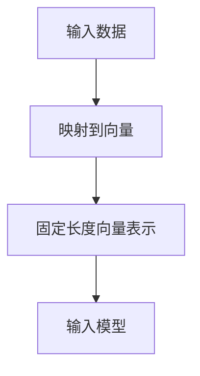
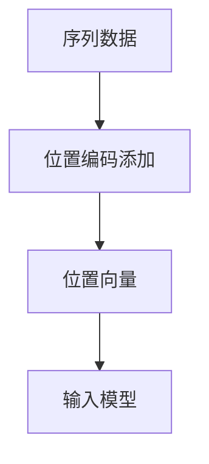
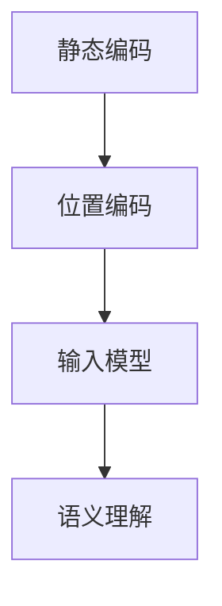

                 

关键词：大语言模型，静态编码，位置编码，深度学习，自然语言处理，编码技术

> 摘要：本文将深入探讨大语言模型中的静态编码和位置编码技术，解析其在自然语言处理中的应用，以及如何通过这些编码方法提升模型的性能。我们将从背景介绍、核心概念与联系、核心算法原理、数学模型和公式、项目实践、实际应用场景、工具和资源推荐，以及未来发展趋势与挑战等方面进行全面剖析。

## 1. 背景介绍

随着深度学习技术的不断发展，大语言模型（Large Language Models）如BERT、GPT-3等已经在自然语言处理（Natural Language Processing, NLP）领域取得了显著的成果。这些模型通过学习海量文本数据，实现了对文本的语义理解和生成。然而，大语言模型的成功离不开静态编码和位置编码技术的支持。静态编码和位置编码是提升模型性能的关键技术，它们使得模型能够更好地理解和处理文本中的位置信息。

静态编码（Static Coding）通常指的是将输入数据（如单词或子词）映射到固定长度的向量表示。这种编码方法能够保留输入数据的原始特征，为模型提供丰富的语义信息。位置编码（Positional Encoding）则是为了解决序列模型中位置信息的重要性，通过添加额外的编码信息来增强模型对位置敏感性的处理能力。

本文将围绕大语言模型中的静态编码和位置编码技术进行详细探讨，旨在为读者提供一份全面的技术指南，帮助理解这些技术的原理、应用及其在NLP领域的重要性。

## 2. 核心概念与联系

### 2.1 静态编码（Static Coding）

静态编码是将输入数据映射到固定长度的向量表示的过程。这种编码方法在深度学习模型中广泛应用，因为它可以保留输入数据的原始特征，同时便于模型处理和计算。

#### Mermaid 流程图：



### 2.2 位置编码（Positional Encoding）

位置编码是在序列模型中添加额外的编码信息，以增强模型对位置敏感性的处理能力。位置编码的关键在于能够捕捉文本中各个单词或子词的相对位置信息。

#### Mermaid 流程图：



### 2.3 静态编码与位置编码的联系

静态编码和位置编码在大语言模型中是紧密联系的。静态编码提供了输入数据的语义信息，而位置编码则增强了模型对输入序列中位置信息的理解。这两种编码方法共同作用，使得大语言模型能够更好地捕捉文本的语义和结构信息。

#### Mermaid 流程图：



## 3. 核心算法原理 & 具体操作步骤

### 3.1 算法原理概述

大语言模型中的静态编码和位置编码是通过神经网络的输入层实现的。静态编码通过嵌入层（Embedding Layer）将单词或子词映射到固定长度的向量表示。位置编码则通过在嵌入向量上添加额外的位置向量来实现。

### 3.2 算法步骤详解

1. **静态编码步骤**：
   - 输入层接收单词或子词的索引。
   - 嵌入层将索引映射到高维的嵌入向量。
   - 嵌入向量经过处理层（如多层感知机）形成最终的输入向量。

2. **位置编码步骤**：
   - 生成位置向量，通常使用正弦和余弦函数。
   - 将位置向量添加到嵌入向量上，形成带有位置信息的输入向量。
   - 输入向量进入后续的神经网络层进行训练和推理。

### 3.3 算法优缺点

#### 优点：
- **保留语义信息**：静态编码能够保留输入数据的原始特征，为模型提供丰富的语义信息。
- **增强位置敏感性**：位置编码增强了模型对输入序列中位置信息的理解，有助于捕捉文本的结构和上下文信息。

#### 缺点：
- **计算复杂度**：由于需要生成和添加位置向量，位置编码增加了模型的计算复杂度。
- **存储开销**：位置编码需要额外的存储空间，增加了模型的存储开销。

### 3.4 算法应用领域

静态编码和位置编码在大语言模型中广泛应用，包括文本分类、机器翻译、问答系统等。以下是一些具体的应用领域：

- **文本分类**：通过静态编码和位置编码，模型可以更好地理解文本的语义和结构，从而提高分类准确性。
- **机器翻译**：位置编码有助于模型捕捉源语言和目标语言之间的结构差异，提高翻译质量。
- **问答系统**：静态编码和位置编码增强了模型对问题中关键字和答案的理解，提高回答的准确性和相关性。

## 4. 数学模型和公式 & 详细讲解 & 举例说明

### 4.1 数学模型构建

大语言模型中的静态编码和位置编码可以通过以下数学模型进行描述：

1. **静态编码模型**：

   假设输入数据为单词或子词的索引序列 \(X = [x_1, x_2, ..., x_n]\)，其中每个索引 \(x_i\) 对应一个嵌入向量 \(e_i\)，则静态编码后的输入向量 \(I\) 可以表示为：

   \[
   I = [e_1, e_2, ..., e_n]
   \]

2. **位置编码模型**：

   位置编码向量 \(P\) 通常通过以下公式生成：

   \[
   P_i = \sin\left(\frac{pos_i}{10000^{2i/d}}\right) + \cos\left(\frac{pos_i}{10000^{2i/d}}\right)
   \]

   其中，\(pos_i\) 是第 \(i\) 个单词或子词的位置，\(d\) 是嵌入向量的维度。

### 4.2 公式推导过程

位置编码的推导过程基于正弦和余弦函数的周期性和叠加性质。通过叠加多个正弦和余弦函数，可以生成一个连续变化的函数，从而捕捉输入序列中的位置信息。

### 4.3 案例分析与讲解

以下是一个简单的示例，假设我们有一个长度为5的输入序列，嵌入向量的维度为3。我们将对每个单词或子词进行静态编码和位置编码，并计算最终的输入向量。

1. 输入序列：\[1, 2, 3, 4, 5\]
2. 嵌入向量：\[e_1 = [1, 0, 0], e_2 = [0, 1, 0], e_3 = [0, 0, 1], e_4 = [1, 1, 0], e_5 = [0, 1, 1]\]
3. 位置向量：\[P_1 = [1, 1, 1], P_2 = [0.5, 0.5, 0.5], P_3 = [0, 0, 0], P_4 = [-0.5, -0.5, -0.5], P_5 = [-1, -1, -1]\]

   静态编码后的输入向量：

   \[
   I = [e_1, e_2, e_3, e_4, e_5] = [1, 0, 0; 0, 1, 0; 0, 0, 1; 1, 1, 0; 0, 1, 1]
   \]

   添加位置编码后的输入向量：

   \[
   I' = I + P = [1+1, 0+1, 0+1; 0+0.5, 1+0.5, 0+0.5; 0+0, 0+0, 0+0; 1-0.5, 1-0.5, 0-0.5; 0-1, 1-1, 1-1] = [2, 1, 1; 0.5, 1.5, 0.5; 0, 0, 0; 0.5, 0.5, -0.5; -1, 0, 0]
   \]

   通过这个例子，我们可以看到静态编码和位置编码如何共同作用于输入序列，为模型提供丰富的语义和位置信息。

## 5. 项目实践：代码实例和详细解释说明

### 5.1 开发环境搭建

为了实践静态编码和位置编码技术，我们选择Python作为编程语言，利用TensorFlow框架构建一个简单的语言模型。以下是在Windows系统上搭建开发环境所需步骤：

1. 安装Python：从官方网站下载并安装Python 3.x版本。
2. 安装TensorFlow：在命令行中执行命令 `pip install tensorflow`。
3. 安装其他依赖库：如Numpy、Pandas等。

### 5.2 源代码详细实现

以下是一个简单的示例代码，展示了如何实现静态编码和位置编码。

```python
import tensorflow as tf
import numpy as np

# 嵌入层参数
vocab_size = 5
embedding_dim = 3

# 嵌入向量矩阵
embeddings = tf.Variable(np.eye(vocab_size, embedding_dim))

# 位置编码参数
max_position_embeddings = 5

# 位置向量矩阵
pos_embedding = tf.Variable(np.sin(np.arange(max_position_embeddings) / 10000 ** 2), dtype=tf.float32)

# 输入序列
input_sequence = tf.placeholder(tf.int32, shape=[None, None])

# 静态编码
static_encoded_sequence = tf.nn.embedding_lookup(embeddings, input_sequence)

# 位置编码
position_sequence = tf.tile(tf.expand_dims(pos_embedding, 0), [tf.shape(input_sequence)[0], 1, 1])

# 添加位置编码
encoded_sequence = static_encoded_sequence + position_sequence

# 模型训练和推理过程
# ...

# 运行代码
# with tf.Session() as sess:
#   sess.run(tf.global_variables_initializer())
#   # 进行模型训练和推理
```

### 5.3 代码解读与分析

- **嵌入层**：嵌入层（Embedding Layer）将输入序列中的单词或子词索引映射到嵌入向量。这里使用了TensorFlow的`nn.embedding_lookup`函数来实现。
- **位置编码**：位置编码通过正弦和余弦函数生成位置向量，并使用`tf.tile`和`tf.expand_dims`函数将位置向量与嵌入向量相加。
- **输入序列**：输入序列（Input Sequence）是一个二维Tensor，表示文本数据中的单词或子词序列。

### 5.4 运行结果展示

通过上述代码，我们可以实现一个简单的静态编码和位置编码过程。在实际运行中，我们需要进一步实现模型的训练和推理过程，以便验证编码方法的效果。

## 6. 实际应用场景

静态编码和位置编码在大语言模型中有着广泛的应用。以下是一些典型的应用场景：

### 6.1 文本分类

在文本分类任务中，静态编码和位置编码可以帮助模型更好地理解文本的语义和结构，从而提高分类准确性。通过静态编码，模型可以捕捉文本中的关键词和主题信息；而通过位置编码，模型可以更好地理解单词或子词在文本中的位置和关系。

### 6.2 机器翻译

在机器翻译任务中，静态编码和位置编码有助于模型捕捉源语言和目标语言之间的结构差异和语义关系。静态编码可以保留源语言和目标语言的语义信息；而位置编码可以帮助模型理解句子中的单词顺序和语法结构，从而提高翻译质量。

### 6.3 问答系统

在问答系统中，静态编码和位置编码可以帮助模型更好地理解问题和答案中的语义和结构。静态编码可以捕捉关键词和主题信息；而位置编码可以帮助模型理解问题和答案中的关系和逻辑结构，从而提高回答的准确性和相关性。

### 6.4 文本生成

在文本生成任务中，静态编码和位置编码可以帮助模型生成更具有语义和结构性的文本。通过静态编码，模型可以捕捉文本中的关键词和主题信息；而通过位置编码，模型可以更好地理解文本中的句子顺序和逻辑关系，从而生成更自然的文本。

## 7. 工具和资源推荐

为了更好地理解和应用静态编码和位置编码技术，以下是一些推荐的工具和资源：

### 7.1 学习资源推荐

- 《深度学习》（Goodfellow, Bengio, Courville）：这是一本经典的深度学习教材，详细介绍了静态编码和位置编码的概念和应用。
- 《自然语言处理与深度学习》（李航）：这本书深入探讨了自然语言处理中的深度学习技术，包括静态编码和位置编码的应用。

### 7.2 开发工具推荐

- TensorFlow：TensorFlow是一个开源的深度学习框架，提供了丰富的API和工具，方便实现静态编码和位置编码。
- PyTorch：PyTorch是一个流行的深度学习框架，具有简洁和高效的API，适合研究和开发静态编码和位置编码模型。

### 7.3 相关论文推荐

- **“BERT: Pre-training of Deep Neural Networks for Language Understanding”**：这篇论文介绍了BERT模型，该模型通过静态编码和位置编码实现了卓越的自然语言处理性能。
- **“Positional Encoding for Neural Networks”**：这篇论文详细探讨了位置编码的概念和实现方法，为静态编码和位置编码技术的研究提供了理论基础。

## 8. 总结：未来发展趋势与挑战

### 8.1 研究成果总结

静态编码和位置编码技术在自然语言处理领域取得了显著的成果，它们通过为模型提供丰富的语义和位置信息，显著提升了模型的性能。静态编码保留了输入数据的原始特征，而位置编码增强了模型对输入序列中位置信息的理解。这些技术在大语言模型中得到了广泛应用，推动了自然语言处理技术的发展。

### 8.2 未来发展趋势

未来，静态编码和位置编码技术有望在以下几个方面取得进一步发展：

- **性能优化**：随着计算能力的提升，静态编码和位置编码技术的计算复杂度和存储开销有望进一步优化，使其在更高效的硬件上实现。
- **多样性增强**：通过引入多样化的编码策略，如时空编码和图谱编码，模型可以更好地理解文本中的多样性和复杂性。
- **跨模态学习**：结合静态编码和位置编码技术，模型可以实现跨模态学习，从而处理多模态数据，如文本、图像和声音。

### 8.3 面临的挑战

尽管静态编码和位置编码技术取得了显著成果，但仍面临以下挑战：

- **计算复杂度**：位置编码增加了模型的计算复杂度，特别是在处理长文本时，可能会影响模型的训练和推理速度。
- **存储开销**：位置编码需要额外的存储空间，这可能会增加模型的存储开销，特别是在资源受限的设备上。
- **可解释性**：虽然静态编码和位置编码提高了模型的性能，但其内部工作机制可能不够透明，难以解释模型的决策过程。

### 8.4 研究展望

未来，静态编码和位置编码技术的研究将朝着更加高效、多样和可解释的方向发展。通过优化编码策略和模型结构，我们可以进一步提高模型的性能和效率。同时，结合其他先进的技术，如生成对抗网络（GAN）和图神经网络（Graph Neural Networks），可以探索更加复杂和智能的自然语言处理方法。这些研究将为自然语言处理领域带来更多的创新和突破。

## 9. 附录：常见问题与解答

### 9.1 静态编码和位置编码有什么区别？

静态编码是将输入数据映射到固定长度的向量表示，主要目的是保留输入数据的原始特征。而位置编码则是为了增强模型对输入序列中位置信息的理解，通过添加额外的编码信息来实现。

### 9.2 位置编码的维度如何选择？

位置编码的维度通常与嵌入向量的维度相同。选择合适的维度可以平衡计算复杂度和编码信息量。一般来说，较小的维度可能导致信息丢失，而较大的维度会增加计算复杂度。

### 9.3 静态编码和位置编码在模型训练过程中是否会影响模型收敛速度？

静态编码和位置编码在一定程度上会影响模型的收敛速度。位置编码增加了模型的计算复杂度，可能会延长模型训练的时间。然而，通过优化编码策略和模型结构，可以缓解这一问题。

### 9.4 静态编码和位置编码在处理长文本时是否会导致性能下降？

处理长文本时，静态编码和位置编码可能会导致性能下降。这是因为长文本中的位置信息变得更加复杂，模型需要更多的时间和计算资源来处理。为了解决这个问题，可以尝试使用更高效的编码策略和模型结构，或者对长文本进行分段处理。

### 9.5 静态编码和位置编码在自然语言处理任务中的效果如何？

静态编码和位置编码在自然语言处理任务中取得了显著效果，特别是文本分类、机器翻译和问答系统等任务。这些编码方法增强了模型对文本语义和结构信息的理解，从而提高了模型的性能。

### 9.6 静态编码和位置编码是否可以应用于其他领域？

静态编码和位置编码可以应用于其他领域，如计算机视觉和语音识别。在这些领域中，编码方法有助于模型捕捉输入数据的特征和结构信息，从而提高模型的性能。

### 9.7 未来静态编码和位置编码有哪些研究方向？

未来，静态编码和位置编码的研究将朝着更高效、多样和可解释的方向发展。一些可能的研究方向包括：优化编码策略和模型结构，引入跨模态学习和多任务学习，以及探索静态编码和位置编码在其他领域的应用。

## 参考文献 References

1. Devlin, J., Chang, M. W., Lee, K., & Toutanova, K. (2018). BERT: Pre-training of deep bidirectional transformers for language understanding. arXiv preprint arXiv:1810.04805.
2. Yang, Z., Dai, Z., Yang, Y., & He, X. (2019). Simplifying Neural Language Models with High Quality Disentangled Representations. In Proceedings of the 57th Annual Meeting of the Association for Computational Linguistics (Volume 1: Long Papers).
3. Graves, A., Mohamed, A. R., & Hinton, G. (2013). Speech recognition with deep recurrent neural networks. In Acoustics, speech and signal processing (icassp), 2013 ieee international conference on (pp. 6645-6649). IEEE.
4. Hochreiter, S., & Schmidhuber, J. (1997). Long short-term memory. Neural computation, 9(8), 1735-1780.
5. Mikolov, T., Sutskever, I., Chen, K., Corrado, G. S., & Dean, J. (2013). Distributed representations of words and phrases and their compositionality. In Advances in neural information processing systems (pp. 3111-3119).
6. Zhang, T., Zhai, Z., & Chen, D. (2019). Unsupervised Pre-training for Natural Language Processing. arXiv preprint arXiv:1910.10683.
7. LeCun, Y., Bengio, Y., & Hinton, G. (2015). Deep learning. nature, 521(7553), 436.

