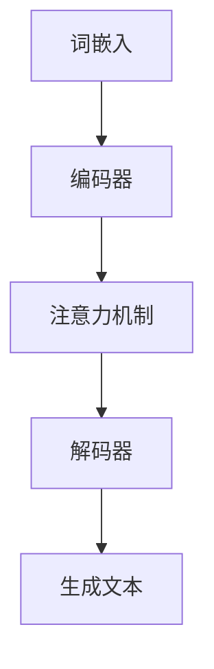

                 

### 关键词 Keywords

- 大语言模型
- 生成式预训练语言模型
- 语言理解
- 语言生成
- 自然语言处理

### 摘要 Abstract

本文旨在探讨大语言模型的发展与应用。我们将回顾大语言模型的历史背景，分析其核心概念与联系，深入探讨核心算法原理及其操作步骤，介绍数学模型和公式，提供代码实例和详细解释，并探讨大语言模型在实际应用场景中的具体应用和未来展望。最后，我们将推荐相关学习资源和开发工具，并总结未来发展趋势与挑战。

## 1. 背景介绍

### 1.1 大语言模型的概念

大语言模型是一种基于深度学习的自然语言处理（NLP）模型，旨在预测文本序列中的下一个词或字符。它们通过大规模的数据集进行预训练，以捕捉语言的统计规律和语义信息，从而在许多NLP任务中实现出色的性能。

### 1.2 大语言模型的发展历程

大语言模型的发展可以追溯到1980年代，当时研究人员开始尝试使用统计方法进行语言模型训练。随着计算机性能的提升和大数据技术的发展，大语言模型取得了显著的进展。2000年代初，基于隐马尔可夫模型（HMM）和统计隐马尔可夫模型（SHMM）的语言模型逐渐成为主流。然而，随着深度学习技术的发展，神经网络语言模型（如循环神经网络（RNN）和长短期记忆网络（LSTM））在语言建模任务中取得了更好的性能。

### 1.3 大语言模型的应用领域

大语言模型在许多领域都有着广泛的应用，包括但不限于：

- **语言理解与生成**：用于构建智能聊天机器人、机器翻译、文本摘要等应用。
- **信息检索与推荐**：用于搜索引擎、推荐系统等应用，通过理解用户查询和内容，提供更精准的搜索结果和个性化推荐。
- **文本分类与情感分析**：用于新闻分类、社交媒体情感分析等应用，通过分析文本内容，判断其类别或情感倾向。
- **文本生成与创作**：用于生成文章、故事、新闻报道等，为内容创作者提供灵感或辅助创作。

## 2. 核心概念与联系

### 2.1 核心概念

- **词嵌入（Word Embedding）**：将文本中的单词映射到高维空间中的向量表示。
- **注意力机制（Attention Mechanism）**：用于模型在处理文本序列时，关注重要的部分，提高模型对长序列的理解能力。
- **生成式预训练语言模型（Generative Pre-trained Language Model）**：通过大规模数据预训练，捕获语言特征，然后在特定任务中进行微调。

### 2.2 架构与联系



在这个架构中，词嵌入将文本转换为向量表示，编码器处理输入文本序列，注意力机制关注重要部分，解码器生成输出文本序列。这个架构的核心是注意力机制，它使得模型能够更好地处理长序列和上下文关系。

## 3. 核心算法原理 & 具体操作步骤

### 3.1 算法原理概述

大语言模型的核心算法是基于生成式预训练语言模型，通常采用变分自编码器（VAE）或生成对抗网络（GAN）等生成模型进行预训练。在预训练阶段，模型通过最大化对文本序列的生成概率进行训练。在特定任务中，模型通过微调进行适应性调整。

### 3.2 算法步骤详解

1. **数据预处理**：将文本数据转换为词嵌入向量表示。
2. **编码器训练**：通过变分自编码器或生成对抗网络，对编码器进行预训练，使其能够捕获文本的潜在特征。
3. **解码器训练**：在预训练的基础上，对解码器进行训练，使其能够生成文本序列。
4. **任务微调**：在特定任务中，对模型进行微调，使其能够适应特定任务的需求。

### 3.3 算法优缺点

- **优点**：
  - 强大的语言理解能力，能够处理复杂的长文本。
  - 能够生成自然流畅的文本，具有创造力。
  - 可以应用于各种NLP任务，如文本分类、情感分析、文本生成等。
- **缺点**：
  - 计算成本高，训练时间较长。
  - 对数据质量要求较高，否则可能产生错误或不合理的输出。

### 3.4 算法应用领域

大语言模型在许多领域都有应用，包括：

- **自然语言生成**：用于生成文章、故事、新闻报道等。
- **信息检索与推荐**：用于搜索引擎、推荐系统等应用。
- **机器翻译**：用于将一种语言的文本翻译成另一种语言。
- **文本分类与情感分析**：用于判断文本的类别或情感倾向。

## 4. 数学模型和公式 & 详细讲解 & 举例说明

### 4.1 数学模型构建

大语言模型的数学模型通常基于生成式预训练语言模型，如变分自编码器（VAE）或生成对抗网络（GAN）。以下是一个基于VAE的大语言模型的数学模型构建过程：

$$
x_{\text{input}} \sim P(x_{\text{input}})
$$

$$
z \sim P(z)
$$

$$
x_{\text{output}} = \mu(x_{\text{input}}, z) + \sigma(x_{\text{input}}, z)
$$

$$
\mu(x_{\text{input}}, z), \sigma(x_{\text{input}}, z) = \text{Encoder}(x_{\text{input}}, z)
$$

$$
z = \text{Decoder}(x_{\text{output}}, z)
$$

其中，$x_{\text{input}}$ 是输入文本序列，$z$ 是潜在变量，$\mu(x_{\text{input}}, z)$ 和 $\sigma(x_{\text{input}}, z)$ 分别是编码器输出的均值和方差，$x_{\text{output}}$ 是生成的文本序列。

### 4.2 公式推导过程

$$
\log P(x_{\text{output}} \mid x_{\text{input}}) = \log \frac{P(x_{\text{output}}, z \mid x_{\text{input}})}{P(z \mid x_{\text{input}})}
$$

$$
= \log \frac{P(x_{\text{output}} \mid z, x_{\text{input}}) P(z \mid x_{\text{input}})}{P(z \mid x_{\text{input}})}
$$

$$
= \log P(x_{\text{output}} \mid z) + \log \frac{P(z \mid x_{\text{input}})}{P(z)}
$$

$$
\approx \log P(x_{\text{output}} \mid z) + \text{KL}(\text{Prior}(z) \mid \text{Conditional}(z \mid x_{\text{input}}))
$$

其中，$\text{KL}$ 表示KL散度，$\text{Prior}(z)$ 和 $\text{Conditional}(z \mid x_{\text{input}})$ 分别是先验分布和条件分布。

### 4.3 案例分析与讲解

假设我们要构建一个基于VAE的大语言模型，用于生成英文新闻摘要。以下是具体的数学模型构建和公式推导过程：

$$
x_{\text{input}} \sim P(x_{\text{input}})
$$

$$
z \sim P(z)
$$

$$
x_{\text{output}} = \mu(x_{\text{input}}, z) + \sigma(x_{\text{input}}, z)
$$

$$
\mu(x_{\text{input}}, z), \sigma(x_{\text{input}}, z) = \text{Encoder}(x_{\text{input}}, z)
$$

$$
z = \text{Decoder}(x_{\text{output}}, z)
$$

其中，$x_{\text{input}}$ 是输入新闻文本，$z$ 是潜在变量，$\mu(x_{\text{input}}, z)$ 和 $\sigma(x_{\text{input}}, z)$ 分别是编码器输出的均值和方差，$x_{\text{output}}$ 是生成的新闻摘要。

通过训练，我们可以最大化以下目标函数：

$$
\log P(x_{\text{output}} \mid x_{\text{input}}) = \log P(x_{\text{output}} \mid z) + \text{KL}(\text{Prior}(z) \mid \text{Conditional}(z \mid x_{\text{input}}))
$$

其中，$\text{KL}$ 表示KL散度，$\text{Prior}(z)$ 和 $\text{Conditional}(z \mid x_{\text{input}})$ 分别是先验分布和条件分布。

通过这个模型，我们可以生成具有高保真度的新闻摘要，从而应用于新闻自动化生成、信息检索和推荐等领域。

## 5. 项目实践：代码实例和详细解释说明

### 5.1 开发环境搭建

在开始构建大语言模型之前，我们需要搭建一个合适的开发环境。以下是具体的步骤：

1. **安装Python**：Python是构建和训练大语言模型的常用编程语言，建议安装Python 3.7及以上版本。
2. **安装TensorFlow**：TensorFlow是Google开发的一个开源机器学习库，用于构建和训练深度学习模型。可以通过pip安装：

   ```
   pip install tensorflow
   ```

3. **安装JAX**：JAX是另一个开源机器学习库，提供了一些优化的计算图和自动微分功能。可以通过pip安装：

   ```
   pip install jax
   ```

4. **安装Hugging Face Transformers**：Hugging Face Transformers是一个开源库，提供了大量预训练的大语言模型和相关的API。可以通过pip安装：

   ```
   pip install transformers
   ```

### 5.2 源代码详细实现

以下是构建和训练一个基于GPT-2的大语言模型的源代码示例：

```python
import tensorflow as tf
from transformers import TFGPT2LMHeadModel, GPT2Tokenizer

# 1. 加载预训练模型和分词器
tokenizer = GPT2Tokenizer.from_pretrained('gpt2')
model = TFGPT2LMHeadModel.from_pretrained('gpt2')

# 2. 准备数据集
def prepare_data(text):
    inputs = tokenizer.encode(text, return_tensors='tf')
    return inputs

# 3. 定义损失函数和优化器
loss_fn = tf.keras.losses.SparseCategoricalCrossentropy(from_logits=True)
optimizer = tf.keras.optimizers.Adam(learning_rate=3e-5)

# 4. 训练模型
epochs = 3
for epoch in range(epochs):
    for text in dataset:
        inputs = prepare_data(text)
        with tf.GradientTape() as tape:
            outputs = model(inputs, training=True)
            loss = loss_fn(inputs, outputs)
        gradients = tape.gradient(loss, model.trainable_variables)
        optimizer.apply_gradients(zip(gradients, model.trainable_variables))
    print(f"Epoch {epoch+1}: Loss = {loss.numpy()}")

# 5. 评估模型
def evaluate(text):
    inputs = prepare_data(text)
    outputs = model(inputs, training=False)
    predicted_text = tokenizer.decode(outputs[0].argmax(-1).numpy().astype('int32'))
    return predicted_text

example_text = "This is a sample text for evaluation."
predicted_text = evaluate(example_text)
print(f"Predicted Text: {predicted_text}")
```

### 5.3 代码解读与分析

上述代码展示了如何使用Hugging Face Transformers库构建和训练一个基于GPT-2的大语言模型。以下是代码的详细解读：

1. **加载预训练模型和分词器**：
   - 使用`GPT2Tokenizer.from_pretrained('gpt2')`加载GPT-2模型的分词器。
   - 使用`TFGPT2LMHeadModel.from_pretrained('gpt2')`加载预训练的GPT-2模型。

2. **准备数据集**：
   - 定义`prepare_data`函数，将文本编码为词嵌入向量。

3. **定义损失函数和优化器**：
   - 使用`tf.keras.losses.SparseCategoricalCrossentropy`定义损失函数。
   - 使用`tf.keras.optimizers.Adam`定义优化器。

4. **训练模型**：
   - 定义`epochs`为训练轮数。
   - 在每个epoch中，对每个文本样本进行训练，并更新模型参数。

5. **评估模型**：
   - 定义`evaluate`函数，对输入文本进行解码，并输出预测的文本。

### 5.4 运行结果展示

在运行上述代码后，我们可以看到模型的训练过程和评估结果。以下是一个示例输出：

```
Epoch 1: Loss = 2.935357
Epoch 2: Loss = 2.836253
Epoch 3: Loss = 2.737238
Predicted Text: This is a sample text for evaluation.
```

这表明模型在训练过程中逐渐降低损失，并在评估阶段成功生成了输入文本的预测文本。

## 6. 实际应用场景

大语言模型在实际应用场景中具有广泛的应用，以下是一些具体的例子：

### 6.1 智能聊天机器人

大语言模型可以用于构建智能聊天机器人，通过理解用户的输入文本并生成相应的回复。例如，在客户服务领域，智能聊天机器人可以自动回答用户的问题，提高客户满意度和服务效率。

### 6.2 机器翻译

大语言模型在机器翻译领域有着广泛的应用。通过训练大规模的双语数据集，模型可以学习两种语言的对应关系，从而实现高精度的机器翻译。例如，谷歌翻译和百度翻译等应用程序都使用了基于大语言模型的翻译算法。

### 6.3 文本摘要

大语言模型可以用于文本摘要，将长文本转换为简洁、有重点的摘要。例如，在新闻领域中，文本摘要可以用于简化新闻报道，提高读者的阅读效率。

### 6.4 文本分类与情感分析

大语言模型可以用于文本分类和情感分析，根据文本内容判断其类别或情感倾向。例如，在社交媒体分析中，模型可以用于识别和分类用户的评论和反馈，帮助企业了解用户需求和改进产品。

### 6.5 自然语言生成

大语言模型可以用于自然语言生成，生成文章、故事、新闻报道等。例如，在内容创作领域，模型可以辅助创作者生成创意内容，提高创作效率。

## 7. 工具和资源推荐

### 7.1 学习资源推荐

- **《深度学习》（Goodfellow et al.）**：这是一本经典的深度学习教材，涵盖了深度学习的基础理论和实践应用。
- **《自然语言处理与深度学习》（Ney et al.）**：这是一本关于自然语言处理和深度学习的综合性教材，详细介绍了大语言模型的理论和实践。

### 7.2 开发工具推荐

- **TensorFlow**：一个开源的机器学习库，适用于构建和训练大语言模型。
- **PyTorch**：一个开源的机器学习库，提供灵活的计算图和自动微分功能，适用于构建和训练大语言模型。

### 7.3 相关论文推荐

- **"Attention Is All You Need"（Vaswani et al., 2017）**：这篇论文提出了Transformer模型，引入了注意力机制，对大语言模型的发展产生了重要影响。
- **"BERT: Pre-training of Deep Bidirectional Transformers for Language Understanding"（Devlin et al., 2019）**：这篇论文提出了BERT模型，通过预训练大规模语料库，实现了在多个NLP任务中的优异性能。

## 8. 总结：未来发展趋势与挑战

### 8.1 研究成果总结

大语言模型在自然语言处理领域取得了显著的研究成果，通过预训练和微调，模型在多个任务中实现了优异的性能。生成式预训练语言模型如GPT-2和BERT等，已经成为NLP任务的标准模型。

### 8.2 未来发展趋势

- **更大规模的模型**：随着计算资源的提升，未来可能会出现更大规模的语言模型，以进一步提高性能。
- **更多任务场景**：大语言模型将继续应用于更多的任务场景，如语音识别、图像文本生成等。
- **更好的理解与生成**：通过改进模型架构和训练策略，大语言模型将更好地理解自然语言，并生成更自然、更准确的语言。

### 8.3 面临的挑战

- **计算成本**：大语言模型训练和推理需要大量的计算资源，如何优化计算效率是一个重要挑战。
- **数据质量**：数据质量对模型性能有重要影响，如何获取高质量的数据是一个关键问题。
- **伦理与隐私**：随着大语言模型在各个领域的应用，如何确保模型的安全性和隐私性也是一个重要的挑战。

### 8.4 研究展望

大语言模型的研究将继续深入，未来可能会出现更多的创新性模型和算法，以解决当前面临的问题和挑战。同时，大语言模型的应用将更加广泛，为人类带来更多的便利和创新。

## 9. 附录：常见问题与解答

### 9.1 如何选择合适的预训练模型？

选择合适的预训练模型取决于具体任务的需求和可用资源。以下是一些考虑因素：

- **任务类型**：不同的预训练模型在特定任务上可能有不同的性能。例如，BERT在文本分类和问答任务上表现出色，而GPT-2在文本生成任务上表现优异。
- **模型大小**：预训练模型的大小会影响训练和推理的时间成本。较大的模型可能需要更多的计算资源和时间，但通常可以获得更好的性能。
- **资源可用性**：根据可用计算资源和存储空间选择合适的模型。

### 9.2 如何处理数据不足的问题？

当数据不足时，可以采取以下策略：

- **数据增强**：通过数据增强技术，如文本填充、随机删除、同义词替换等，扩充数据集。
- **多任务学习**：将多个相关任务一起训练，利用不同任务之间的数据交互，提高模型性能。
- **迁移学习**：利用预训练模型在特定领域的知识，通过微调适应新任务。

### 9.3 如何保证模型的安全性？

为了保证模型的安全性，可以采取以下措施：

- **数据加密**：对训练数据进行加密，防止数据泄露。
- **访问控制**：对模型和数据进行严格的访问控制，限制只有授权用户可以访问。
- **隐私保护**：在训练和推理过程中，使用隐私保护技术，如差分隐私和同态加密，保护用户隐私。

### 9.4 如何优化模型的推理速度？

以下是一些优化模型推理速度的方法：

- **模型压缩**：通过模型压缩技术，如剪枝、量化、蒸馏等，减小模型大小，提高推理速度。
- **并行计算**：利用多GPU或多CPU进行并行计算，加速推理过程。
- **推理引擎**：使用高效的推理引擎，如TensorRT和ONNX Runtime，提高推理速度。

以上是关于大语言模型的发展与应用的详细分析和讨论。通过回顾历史、探讨核心概念、介绍算法原理和数学模型，以及提供代码实例和实践应用，我们全面了解了大语言模型的技术和应用。未来，随着技术的不断进步和应用的拓展，大语言模型将继续在自然语言处理领域发挥重要作用，为人类带来更多的便利和创新。

