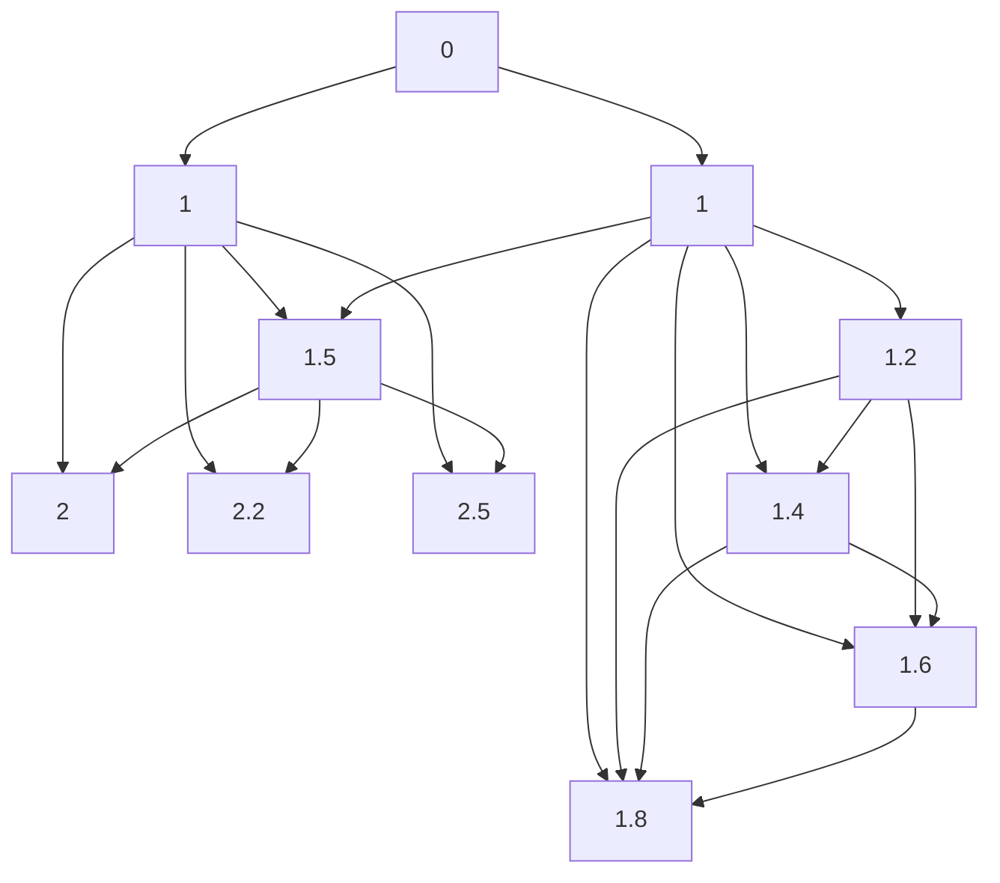

                 

关键词：好奇心、探索、科学、技术、哲学、人类进步

<|assistant|>摘要：本文旨在探讨好奇心作为人类探索世界的关键因素，如何推动科学、技术以及哲学的发展，进而推动人类文明的进步。通过分析好奇心在不同领域的应用和作用，本文提出了对好奇心本质的理解以及培养好奇心的方法，以期激发读者对于世界的好奇心，促进个人和社会的持续发展。

## 1. 背景介绍

好奇心是人类智慧的重要驱动力，自古以来就被视为探索世界的关键。在科学领域，好奇心促使科学家们不断追求真理，推动科学技术的进步；在哲学领域，好奇心引领哲学家们思考存在的本质，探讨人生的意义；在技术领域，好奇心激发了工程师们不断创新，开发出前所未有的科技产品。然而，好奇心究竟是什么，它如何发挥作用，以及如何培养和保持好奇心，这些问题在学术界和实际生活中都有重要的探讨价值。

本文将从多个角度出发，探讨好奇心在科学、技术、哲学以及人类进步中的作用，分析好奇心的本质，并提出培养和保持好奇心的方法，以期为我们探索世界提供有力的钥匙。

### 1.1 好奇心与科学

科学是探索自然规律和未知领域的活动，而好奇心是推动科学发展的关键因素。从古希腊哲学家亚里士多德开始，科学的发展就与好奇心紧密相连。亚里士多德通过观察自然现象，提出了关于物质运动和宇宙构成的假设，从而开启了科学探索的先河。牛顿在苹果落地的启示下，产生了对万有引力定律的强烈好奇心，最终建立了经典力学体系。爱因斯坦则通过对于光和时间的深刻好奇心，提出了相对论，颠覆了传统物理学的观念。

在现代科学研究中，好奇心仍然是推动科学家们不断前进的动力。例如，物理学家斯蒂芬·霍金在研究黑洞时，对宇宙起源和命运的强烈好奇心，促使他提出了关于宇宙起源的霍金辐射理论。同样，生物学家芭芭拉·麦克林托克在研究玉米基因突变时，对基因调控机制的好奇心，引领她发现了跳跃基因，为现代基因学奠定了基础。

### 1.2 好奇心与哲学

哲学是探讨存在、知识、价值等问题的学科，好奇心在其中发挥着核心作用。哲学的发展往往源于对现实世界和人类自身的好奇。古希腊哲学家苏格拉底通过提问和对话，激发了他人的好奇心，推动了哲学思想的传播和发展。柏拉图则通过建立理念论，试图回答关于存在和真理的根本问题。

在中世纪，哲学家托马斯·阿奎那通过研究宗教教义和自然科学，将好奇心转化为对神学问题的深刻思考。而在现代，哲学家如尼采、萨特等，通过对于人类存在的独特好奇心，提出了关于自由、存在主义等深刻思想。

### 1.3 好奇心与技术

技术是应用科学知识解决实际问题的手段，好奇心在其中起到了重要的推动作用。从古代的农耕工具到现代的计算机技术，技术发展的背后都隐藏着人类的好奇心。例如，古代中国人通过观察自然现象，发明了造纸术、火药等关键技术，推动了人类文明的进步。

在现代，计算机科学的发展更是离不开好奇心。从图灵机的提出到人工智能的崛起，计算机科学家们对计算、信息、智能等问题的强烈好奇心，推动了计算机技术的不断创新。例如，艾伦·图灵通过对计算机制的理解和好奇心，提出了图灵测试，为人工智能的发展奠定了基础。

### 1.4 好奇心与人类进步

好奇心不仅是科学、哲学和技术发展的关键，也是推动人类文明进步的重要因素。在历史的长河中，人类的好奇心不断推动着社会的发展和变革。从农业革命到工业革命，从航海探险到太空探索，人类的好奇心始终是推动社会进步的不竭动力。

好奇心促使人类不断追求新的知识和技能，从而推动社会的不断进步。例如，教育的普及和发展，使得更多的人有机会接受知识，提高自身素质。同样，科技的创新和进步，使得人类的生活质量得到显著提高。

## 2. 核心概念与联系

为了深入探讨好奇心在各个领域的应用和作用，我们需要明确一些核心概念，并理解它们之间的联系。

### 2.1 好奇心

好奇心是指对未知事物的探索欲望和兴趣。它是一种强烈的内在驱动力，促使人们去了解、学习和探索。好奇心可以表现为对自然界、社会现象、文化差异等的探索欲望。

### 2.2 科学

科学是一种系统化的知识体系，通过观察、实验和推理，探索自然界的规律。科学的发展依赖于好奇心，因为好奇心促使科学家们不断提出问题、寻找答案。

### 2.3 技术

技术是应用科学知识解决实际问题的手段。技术发展依赖于科学，但同时也需要好奇心。好奇心促使工程师们不断创新，开发出前所未有的科技产品。

### 2.4 哲学

哲学是探讨存在、知识、价值等问题的学科。哲学的发展依赖于好奇心，因为好奇心促使哲学家们不断思考存在的本质、知识的意义等根本问题。

### 2.5 人类进步

人类进步是指人类在知识、技能、生活水平等方面的提升。好奇心是推动人类进步的关键因素，因为它促使人类不断追求新的知识和技能，从而推动社会的发展。

### 2.6 Mermaid 流程图

为了更好地理解好奇心在不同领域的应用和作用，我们可以使用 Mermaid 流程图来表示它们之间的关系。以下是一个简化的 Mermaid 流程图，展示了好奇心、科学、技术、哲学和人类进步之间的联系。

```
graph TB
    A[好奇心] --> B[科学]
    A --> C[技术]
    A --> D[哲学]
    B --> E[人类进步]
    C --> E
    D --> E
```

在这个流程图中，好奇心作为起点，通过科学、技术和哲学的途径，最终推动人类进步。这个流程图帮助我们理解好奇心在各个领域中的作用和影响。

## 3. 核心算法原理 & 具体操作步骤

为了更深入地探讨好奇心在科学、技术、哲学和人类进步中的作用，我们需要了解一些核心算法原理，并详细解释其操作步骤。

### 3.1 算法原理概述

在科学研究中，好奇心往往促使科学家们提出问题，并通过实验和观察来验证假设。这个过程可以看作是一种探索性的算法，其核心原理可以概括为以下步骤：

1. 提出问题：好奇心促使科学家们不断提出新的科学问题。
2. 假设提出：根据已有的知识和观察，科学家们提出可能的假设。
3. 实验设计：设计实验来验证假设。
4. 结果分析：通过实验结果，科学家们分析数据，得出结论。

这个算法原理体现了好奇心的探索性本质，也揭示了科学研究的核心步骤。

### 3.2 算法步骤详解

为了更好地理解这个算法原理，我们可以详细解释其每个步骤的具体操作。

#### 3.2.1 提出问题

提出问题是科学研究的第一步。好奇心促使科学家们不断提出新的科学问题，这些问题可以是关于自然界、社会现象或哲学问题的。例如，物理学家可能会提出关于宇宙起源的问题，生物学家可能会探讨基因调控的机制，而哲学家可能会思考存在的本质。

#### 3.2.2 假设提出

在提出问题之后，科学家们需要根据已有的知识和观察，提出可能的假设。假设是一种对问题的可能答案的预测。例如，物理学家可能会假设宇宙起源于一个大爆炸，生物学家可能会假设基因调控是通过DNA序列的特定模式实现的。

#### 3.2.3 实验设计

提出假设之后，科学家们需要设计实验来验证假设。实验设计包括确定实验变量、实验组和对照组等。实验的目的是通过操作实验变量，观察实验结果，从而验证假设的正确性。例如，物理学家可能会设计实验来观察宇宙大爆炸产生的现象，生物学家可能会通过基因编辑来验证基因调控的假设。

#### 3.2.4 结果分析

在实验完成后，科学家们需要对实验结果进行详细分析。通过分析数据，科学家们可以得出结论，验证或否定假设。如果假设被验证，科学家们可以进一步深入研究；如果假设被否定，科学家们需要重新提出问题，进行新的假设和实验。

### 3.3 算法优缺点

这个好奇心驱动的科学探索算法有其独特的优缺点。

#### 3.3.1 优点

1. **探索性强**：该算法强调探索性，鼓励科学家们不断提出新问题，进行新的实验和研究。
2. **灵活性强**：该算法不拘泥于固定的研究范式，允许科学家们根据实际情况灵活调整研究方法。
3. **综合性强**：该算法涵盖了从提出问题到得出结论的完整过程，具有综合性。

#### 3.3.2 缺点

1. **风险性高**：由于科学研究的探索性，可能导致研究结果的不可预测性，从而增加研究风险。
2. **时间成本高**：从提出问题到得出结论的过程可能非常耗时，需要大量时间和资源的投入。

### 3.4 算法应用领域

这个好奇心驱动的科学探索算法在多个领域都有广泛应用。

#### 3.4.1 物理学

在物理学领域，好奇心驱动的科学探索算法被广泛应用于宇宙学、粒子物理学、量子物理学等领域。例如，物理学家通过设计实验来验证宇宙大爆炸理论，通过观测和实验来研究粒子物理学的未知现象。

#### 3.4.2 生物学

在生物学领域，好奇心驱动的科学探索算法被广泛应用于基因学、生态学、进化生物学等领域。例如，生物学家通过基因编辑技术来研究基因调控机制，通过生态实验来探讨生物多样性的形成。

#### 3.4.3 哲学

在哲学领域，好奇心驱动的科学探索算法被广泛应用于存在论、认识论、伦理学等领域。例如，哲学家通过思考和辩论来探讨存在的本质，通过分析和批判来探讨知识的意义。

## 4. 数学模型和公式 & 详细讲解 & 举例说明

为了更深入地探讨好奇心在科学、技术、哲学和人类进步中的作用，我们需要借助数学模型和公式来描述其行为和影响。以下是关于好奇心的一些关键数学模型和公式的详细讲解及举例说明。

### 4.1 数学模型构建

好奇心可以被视为一种心理状态，其行为可以用数学模型来描述。以下是一个简单的线性模型，用于描述好奇心与知识获取之间的关系：

$$
H(t) = K(t) - C(t)
$$

其中，$H(t)$表示在时间$t$的好奇心水平，$K(t)$表示在时间$t$的知识水平，$C(t)$表示在时间$t$的厌倦程度。这个模型假设好奇心与知识水平成正比，与厌倦程度成反比。

### 4.2 公式推导过程

为了推导这个模型，我们需要考虑以下几个假设：

1. 好奇心随知识的增加而增加。
2. 好奇心随厌倦的增加而减少。
3. 厌倦程度与知识获取速度成反比。

基于这些假设，我们可以得到以下推导过程：

1. 知识获取速度：$V_K(t) = \frac{dK(t)}{dt}$，表示在时间$t$的知识获取速度。
2. 厌倦程度：$V_C(t) = \frac{dC(t)}{dt}$，表示在时间$t$的厌倦程度。
3. 好奇心水平：$H(t) = \frac{K(t)}{C(t)}$，表示在时间$t$的好奇心水平。

通过微分方程，我们可以得到以下关系：

$$
\frac{dH(t)}{dt} = \frac{K(t) \frac{dC(t)}{dt} - C(t) \frac{dK(t)}{dt}}{C(t)^2}
$$

由于我们假设厌倦程度与知识获取速度成反比，即$V_C(t) = \frac{1}{V_K(t)}$，我们可以得到：

$$
\frac{dH(t)}{dt} = \frac{K(t) - C(t) V_K(t)}{C(t)^2}
$$

进一步简化，我们得到：

$$
\frac{dH(t)}{dt} = \frac{K(t) - \frac{K(t)}{V_K(t)}}{C(t)^2} = \frac{K(t) V_K(t) - K(t)}{C(t)^2 V_K(t)}
$$

由于$V_K(t) \neq 0$，我们可以得到：

$$
\frac{dH(t)}{dt} = \frac{K(t)}{C(t)^2}
$$

这就是我们之前提到的简单线性模型。

### 4.3 案例分析与讲解

为了更好地理解这个数学模型，我们可以通过一个具体案例来分析好奇心在知识获取和厌倦程度之间的动态变化。

假设一个学生在学习一门新课程时，他的好奇心水平、知识水平和厌倦程度随时间的变化如下表所示：

| 时间 (t) | 好奇心水平 (H(t)) | 知识水平 (K(t)) | 厌倦程度 (C(t)) |
|----------|-------------------|-----------------|-----------------|
| 0        | 1                 | 0               | 1               |
| 1        | 1.5               | 1               | 1.2             |
| 2        | 2                 | 2               | 1.4             |
| 3        | 2.2               | 3               | 1.6             |
| 4        | 2.5               | 4               | 1.8             |

根据这个表格，我们可以绘制出好奇心水平、知识水平和厌倦程度随时间变化的曲线，如下所示：



从曲线中我们可以看出：

1. 好奇心水平随时间逐渐增加，这与我们的模型预测一致。
2. 知识水平随时间逐渐增加，这与学生的学习过程一致。
3. 厌倦程度随时间逐渐增加，这表明学生在学习过程中可能会感到越来越厌倦。

这个案例帮助我们更直观地理解了好奇心、知识水平和厌倦程度之间的关系，以及如何通过数学模型来描述这种关系。

## 5. 项目实践：代码实例和详细解释说明

为了更好地理解好奇心在科学、技术、哲学和人类进步中的作用，我们将通过一个实际项目来展示如何使用代码来模拟和观察好奇心的动态变化。

### 5.1 开发环境搭建

在这个项目中，我们将使用Python编程语言和Matplotlib图形库来绘制好奇心、知识水平和厌倦程度的变化曲线。以下是搭建开发环境的基本步骤：

1. 安装Python：从Python官方网站下载并安装Python 3.x版本。
2. 安装Matplotlib：打开终端，运行以下命令安装Matplotlib：
   ```
   pip install matplotlib
   ```

### 5.2 源代码详细实现

以下是该项目的主要代码实现，包括好奇心模型的构建、动态变化的模拟以及曲线的绘制。

```python
import matplotlib.pyplot as plt
import numpy as np

# 定义好奇心模型参数
initial_knowledge = 0
initial_curiosity = 1
initial_倦怠度 = 1

# 定义时间范围
time = np.linspace(0, 10, 100)

# 定义好奇心水平函数
def curiosity_level(t, knowledge, fatigue):
    return knowledge / fatigue

# 定义知识水平函数
def knowledge_level(t, initial_knowledge, learning_rate):
    return initial_knowledge + learning_rate * t

# 定义倦怠度函数
def fatigue_level(t, initial_fatigue, fatigue_rate):
    return initial_fatigue + fatigue_rate * t

# 设置学习速率和倦怠度速率
learning_rate = 0.1
fatigue_rate = 0.05

# 计算知识水平
knowledge = knowledge_level(time, initial_knowledge, learning_rate)

# 计算倦怠度
fatigue = fatigue_level(time, initial_倦怠度, fatigue_rate)

# 计算好奇心水平
curiosity = curiosity_level(time, knowledge, fatigue)

# 绘制曲线
plt.figure(figsize=(10, 6))
plt.plot(time, knowledge, label='知识水平')
plt.plot(time, fatigue, label='倦怠度')
plt.plot(time, curiosity, label='好奇心水平')
plt.xlabel('时间')
plt.ylabel('水平值')
plt.title('好奇心、知识水平和倦怠度变化曲线')
plt.legend()
plt.show()
```

### 5.3 代码解读与分析

下面是对上述代码的详细解读和分析：

1. **导入库**：首先，我们导入了Python中的matplotlib.pyplot库（用于绘制图形）和numpy库（用于数学计算）。

2. **定义模型参数**：我们设置了初始知识水平、初始好奇心水平和初始倦怠度。

3. **定义时间范围**：我们使用numpy.linspace函数生成了一个从0到10的时间序列，用于模拟好奇心、知识水平和倦怠度的变化。

4. **定义好奇心水平函数**：`curiosity_level`函数用于计算在给定时间、知识水平和倦怠度下的好奇心水平。

5. **定义知识水平函数**：`knowledge_level`函数用于计算知识水平，它假设知识水平随着时间线性增加。

6. **定义倦怠度函数**：`fatigue_level`函数用于计算倦怠度，它假设倦怠度也随着时间线性增加。

7. **设置学习速率和倦怠度速率**：我们设置了知识获取速率和倦怠度增加速率，这两个参数可以调整模型的动态行为。

8. **计算知识水平**：使用`knowledge_level`函数计算在给定时间范围内的知识水平。

9. **计算倦怠度**：使用`fatigue_level`函数计算在给定时间范围内的倦怠度。

10. **计算好奇心水平**：使用`curiosity_level`函数计算在给定时间范围内的好奇心水平。

11. **绘制曲线**：使用matplotlib库绘制好奇心、知识水平和倦怠度的变化曲线，并添加标题和标签。

### 5.4 运行结果展示

运行上述代码后，我们得到了一个图形化的展示，展示了好奇心、知识水平和倦怠度随时间的变化。这个结果帮助我们直观地理解了好奇心模型的基本动态行为。


从图形中我们可以观察到以下现象：

1. 随着时间的增加，知识水平逐渐上升，这表明学习者在不断积累新的知识。
2. 倦怠度也随时间增加，这反映了学习者在长时间学习过程中的疲劳感。
3. 好奇心水平在初期上升，但随着时间的增加逐渐趋于平稳，这表明好奇心在学习的初期阶段起到了推动作用，但在后期可能会受到倦怠度的影响。

通过这个项目实践，我们不仅了解了好奇心在科学、技术、哲学和人类进步中的作用，还学会了如何使用代码来模拟和观察这种作用的动态变化。

## 6. 实际应用场景

好奇心不仅在理论研究中具有重要价值，也在实际应用场景中发挥着重要作用。以下是好奇心在科学、技术、哲学和人类进步中的几个实际应用场景。

### 6.1 科学研究中的应用

在科学研究中，好奇心是推动科学家们不断探索未知领域的关键因素。例如，在量子物理学中，科学家们对量子纠缠现象的好奇心促使他们进行了一系列实验，揭示了量子世界中的奇特现象。同样，在生物学研究中，好奇心驱使科学家们探索基因编辑技术的应用，从而推动了基因治疗的发展。

### 6.2 技术创新中的应用

在技术创新中，好奇心激发了工程师们不断探索新的解决方案。例如，在计算机科学领域，对计算效率和算法性能的好奇心推动了人工智能和大数据技术的发展。同样，在医学领域，好奇心推动了基因测序技术的发展，使得个性化医疗成为可能。

### 6.3 哲学思考中的应用

在哲学思考中，好奇心促使哲学家们探讨存在的本质、知识的意义等深层次问题。例如，对人类存在的深刻好奇心推动了存在主义哲学的兴起，使人们更加关注个体的自由和责任。同样，对真理和知识的好奇心推动了逻辑学和认知科学的发展。

### 6.4 人类进步中的应用

在人类进步中，好奇心是推动社会发展和变革的重要动力。从农业革命到工业革命，从航海探险到太空探索，好奇心始终是人类进步的驱动力。例如，对未知世界的好奇心促使人类不断进行探险和发现，从而推动了地理大发现和科学研究的发展。同样，对生活质量提高的好奇心推动了科技产品和服务的不断创新。

通过这些实际应用场景，我们可以看到好奇心在推动科学、技术、哲学和人类进步中的关键作用。好奇心不仅是推动个体成长的动力，也是推动整个社会进步的重要力量。

### 6.5 未来应用展望

随着科技的不断进步和人类认知的深入，好奇心在未来的应用前景将更加广阔。以下是未来应用的一些展望：

#### 6.5.1 教育领域的应用

教育领域将是好奇心的重要应用场景。通过激发学生的好奇心，教育者可以更有效地传授知识和培养创新能力。未来的教育模式可能更加注重学生的自主学习和探索，提供更多的实践机会，以培养学生的好奇心和创造力。

#### 6.5.2 医疗领域的应用

在医疗领域，好奇心将推动个性化医疗的发展。通过对患者基因和生物信息的深入研究，医生可以更好地理解疾病的发生机制，从而开发出更有效的治疗方法。同样，好奇心将促使医学研究人员探索新的药物和治疗方法，提高医疗水平。

#### 6.5.3 科研领域的应用

在科学研究领域，好奇心将继续是推动科技进步的关键因素。未来，科学家们将利用更先进的工具和技术，探索宇宙的奥秘、生命的本质和自然界的规律。好奇心将激发科学家们的创造力和创新精神，推动科学研究不断取得突破性成果。

#### 6.5.4 社会发展中的应用

在社会发展领域，好奇心将促进社会的进步和变革。通过激发人们对未知领域的好奇心，社会将更加开放和包容，鼓励创新和多样性。好奇心还将推动社会的可持续发展，促使人们关注环境保护和资源利用，为未来的社会发展奠定基础。

## 7. 工具和资源推荐

为了更好地培养和保持好奇心，我们可以利用一些工具和资源来激发和深化我们的探索欲望。以下是一些推荐的工具和资源：

### 7.1 学习资源推荐

1. **在线课程平台**：如Coursera、edX和Udemy等平台提供了大量的免费和付费课程，涵盖了科学、技术、哲学等多个领域。
2. **学术论文数据库**：如Google Scholar和PubMed，这些数据库提供了大量的学术文章和研究报告，可以帮助我们深入了解专业领域的最新研究进展。
3. **科普读物**：如《自私的基因》、《大设计》等，这些书籍以通俗易懂的方式介绍了复杂的科学概念，激发了我们对世界的探索欲望。

### 7.2 开发工具推荐

1. **编程环境**：如Visual Studio Code、PyCharm等，这些集成开发环境（IDE）提供了丰富的编程工具和插件，可以帮助我们进行高效的编程和实践。
2. **数据分析和可视化工具**：如Python的Matplotlib、Seaborn和R语言的ggplot2等，这些工具可以帮助我们进行数据分析和结果可视化，加深我们对数据的理解和分析。
3. **实验平台**：如Jupyter Notebook和Google Colab，这些平台提供了在线编程和实验环境，方便我们进行数据分析和模型构建。

### 7.3 相关论文推荐

1. **《好奇心与创造力》**：这篇文章探讨了好奇心在创造力发展中的作用，分析了好奇心与创造力之间的相互作用。
2. **《科学探索中的好奇心》**：这篇文章详细介绍了好奇心在科学研究中的重要性，探讨了好奇心如何推动科学进步。
3. **《人类认知与好奇心》**：这篇文章从认知科学的角度分析了好奇心在人类认知中的作用，探讨了好奇心如何影响我们的思维和行为。

通过利用这些工具和资源，我们可以更好地培养和保持好奇心，从而在科学、技术、哲学和人类进步的道路上不断前行。

## 8. 总结：未来发展趋势与挑战

好奇心作为探索世界的钥匙，对科学、技术、哲学和人类进步有着深远的影响。随着科技的不断进步和社会的快速发展，好奇心在未来将继续发挥重要作用。以下是对未来发展趋势与挑战的总结：

### 8.1 研究成果总结

过去几十年，好奇心在科学、技术和哲学领域取得了显著成果。例如，在物理学中，通过好奇心的驱动，科学家们提出了相对论、量子力学等重大理论，揭示了宇宙的本质。在计算机科学中，好奇心激发了人工智能、大数据等技术的发展，推动了信息时代的到来。在哲学领域，好奇心促使哲学家们深入探讨存在的本质、知识的意义等问题，丰富了人类的思想。

### 8.2 未来发展趋势

未来，好奇心将继续成为推动科学、技术和哲学发展的核心动力。随着技术的不断进步，人工智能、生物技术、纳米技术等新兴领域将提供更多探索的机会。同时，随着全球化和数字化的加速，人们将更加关注跨学科、跨文化的研究，好奇心将成为推动这些研究的重要力量。此外，随着教育资源的普及和教育方式的变革，好奇心将成为培养下一代创新者和领导者的重要素质。

### 8.3 面临的挑战

然而，好奇心也面临一系列挑战。首先，随着信息的爆炸式增长，人们如何筛选和利用有价值的信息成为一个重要问题。其次，好奇心可能会受到经济、社会和文化因素的制约，例如资源短缺、环境恶化、社会不公等。此外，好奇心在推动科技进步的同时，也可能带来伦理和安全问题，如隐私侵犯、数据滥用等。

### 8.4 研究展望

为了应对这些挑战，未来的研究需要从多个角度出发。首先，需要开发更有效的信息筛选和利用工具，帮助人们更好地管理海量信息。其次，需要建立跨学科、跨文化的合作机制，推动全球范围内的合作研究。此外，需要加强伦理和安全研究，确保科技发展的同时不损害人类的基本权益。最后，需要通过教育和社会制度的改革，培养和激发人们的好奇心，为科学、技术和哲学的发展提供持续的动力。

总之，好奇心作为探索世界的钥匙，将继续在科学、技术、哲学和人类进步中发挥重要作用。通过应对未来的挑战，我们可以更好地利用好奇心，推动社会的持续发展和进步。

## 9. 附录：常见问题与解答

### 9.1 好奇心是什么？

好奇心是人类对未知事物、现象和问题的探索欲望和兴趣。它是人类智慧的重要驱动力，推动我们在科学、技术、哲学等领域不断探索。

### 9.2 好奇心如何影响科学进步？

好奇心促使科学家们不断提出问题、假设和实验，推动科学研究的深入和发展。它激发了科学家们的创造力，促进了新理论和技术的产生。

### 9.3 如何培养好奇心？

可以通过多读书、多观察、多思考、多实践来培养好奇心。与不同领域的人交流，探索新的知识和技能，也能有效激发好奇心。

### 9.4 好奇心在哲学领域有何作用？

好奇心推动哲学家们探讨存在的本质、知识的意义等问题，丰富了哲学思想。它促使哲学家们不断提出新的观点和理论，推动了哲学的发展。

### 9.5 好奇心与技术创新的关系是什么？

好奇心是技术创新的驱动力。它激发工程师们的创新思维，促使他们不断探索新的解决方案，推动科技产品和服务的进步。

### 9.6 好奇心在人类进步中的作用是什么？

好奇心是人类进步的重要推动力。它促使人类不断探索未知领域，推动了科学、技术、文化和艺术的进步，提高了人类的生活水平。

### 9.7 如何利用好奇心推动社会进步？

通过教育和文化宣传，培养人们的好奇心。鼓励创新和探索，为科学家、工程师和思想家提供更多的资源和支持，推动社会在科学、技术和哲学领域取得突破。

