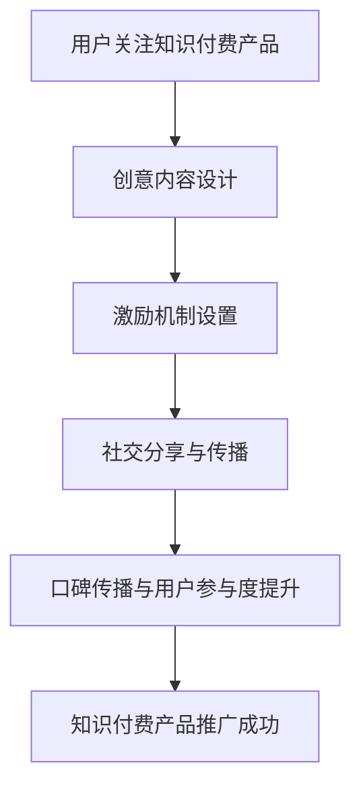

                 

关键词：病毒营销、知识付费产品、推广策略、算法原理、数学模型、项目实践、应用场景、未来展望

> 摘要：本文探讨了如何利用病毒营销策略推广知识付费产品。通过深入分析病毒营销的核心概念、算法原理、数学模型，并结合实际项目案例，阐述了一种有效的推广方法，并对其未来发展趋势和挑战进行了展望。

## 1. 背景介绍

病毒营销（Virus Marketing），又称病毒式营销，是一种通过用户自发的传播来推广产品或服务的营销策略。它利用人们对新鲜事物的好奇心、社交分享的欲望和人际网络的传播效应，迅速扩大影响力，实现低成本、高回报的推广效果。近年来，随着互联网和社交媒体的发展，病毒营销在各个领域得到了广泛应用。

知识付费产品，是指消费者为获取有价值的信息、技能或知识，支付一定费用购买的产品。随着人们对自我提升的需求不断增加，知识付费市场呈现出爆炸式增长，各大平台纷纷推出各种知识付费产品，如在线课程、电子书、专业咨询等。

本文旨在探讨如何利用病毒营销策略，推广知识付费产品，提高产品知名度和用户粘性，实现商业价值最大化。

## 2. 核心概念与联系

为了更好地理解病毒营销在知识付费产品推广中的应用，首先需要了解以下几个核心概念：

1. **病毒营销**：一种通过用户自发传播来实现产品推广的营销策略，通常包括创意内容、激励机制和传播渠道等要素。
2. **知识付费产品**：消费者为获取有价值的信息、技能或知识，支付一定费用购买的产品。
3. **用户参与度**：用户在病毒营销过程中，对产品或服务的关注度、参与度和传播意愿。
4. **社交分享**：用户通过社交媒体、论坛、朋友圈等渠道，将产品或服务推荐给其他潜在用户。
5. **口碑传播**：用户基于自身体验，对产品或服务的正面评价，从而吸引更多潜在用户。

下面是病毒营销在知识付费产品推广中的 Mermaid 流程图：



### 2.1 病毒营销策略在知识付费产品推广中的具体应用

1. **创意内容设计**：设计富有创意、具有吸引力的内容，让用户愿意主动分享。例如，制作高质量的短视频、漫画、图文教程等。
2. **激励机制设置**：设置一定的激励机制，鼓励用户分享知识付费产品。例如，赠送免费试听课程、优惠券等。
3. **社交分享与传播**：利用社交媒体、论坛、朋友圈等渠道，让用户将知识付费产品推荐给其他潜在用户。
4. **口碑传播与用户参与度提升**：通过用户好评、互动、分享等行为，提高用户参与度，形成良好的口碑效应。

## 3. 核心算法原理 & 具体操作步骤

### 3.1 算法原理概述

病毒营销算法的核心原理在于利用用户社交网络和自发性传播，实现知识付费产品的快速推广。其主要步骤包括：

1. **用户激励**：通过奖励机制，鼓励用户分享知识付费产品。
2. **内容创意**：设计富有创意、具有吸引力的内容，提高用户分享意愿。
3. **渠道选择**：选择合适的社交分享渠道，扩大传播范围。
4. **效果监测**：对病毒营销活动进行实时监测和分析，优化推广策略。

### 3.2 算法步骤详解

1. **用户激励**
    - **设置奖励机制**：根据用户分享行为，设置相应的奖励，如免费试听课程、优惠券等。
    - **奖励发放**：通过平台后台系统，自动发放奖励，提高用户参与度。

2. **内容创意**
    - **选题**：选择具有热点、话题性、用户关注度的选题，提高内容传播效果。
    - **形式**：采用短视频、漫画、图文教程等丰富多样的形式，吸引用户注意力。
    - **文案**：撰写简洁明了、具有吸引力的文案，提高用户分享意愿。

3. **渠道选择**
    - **社交媒体**：利用微信、微博、抖音等热门社交媒体，扩大传播范围。
    - **论坛**：选择相关论坛，发布高质量内容，吸引潜在用户。
    - **朋友圈**：鼓励用户将知识付费产品分享至朋友圈，形成病毒式传播。

4. **效果监测**
    - **用户行为分析**：实时监测用户分享、点赞、评论等行为，了解用户需求。
    - **数据反馈**：根据数据反馈，优化推广策略，提高推广效果。

### 3.3 算法优缺点

**优点**：

1. 低成本：病毒营销利用用户自发性传播，降低推广成本。
2. 高效果：通过创意内容和激励机制，提高用户参与度和传播效果。
3. 快速扩散：病毒营销具有快速扩散的特点，能够在短时间内提高产品知名度。

**缺点**：

1. 不稳定性：病毒营销效果受用户社交网络、内容质量等因素影响，存在一定的不稳定性。
2. 控制难度：病毒营销过程中，难以完全控制传播方向和速度，存在一定的风险。

### 3.4 算法应用领域

病毒营销算法在知识付费产品推广中的应用非常广泛，如在线教育、专业咨询、电子书等领域。通过病毒营销，可以迅速提高产品知名度，吸引更多潜在用户，实现商业价值最大化。

## 4. 数学模型和公式 & 详细讲解 & 举例说明

### 4.1 数学模型构建

病毒营销算法的数学模型主要包括两部分：用户参与度和传播效果。

1. **用户参与度**：用户参与度可以通过以下公式表示：

   $$ U = f(A, B, C) $$

   其中，$U$表示用户参与度，$A$表示创意内容吸引力，$B$表示激励机制吸引力，$C$表示渠道选择影响力。

2. **传播效果**：传播效果可以通过以下公式表示：

   $$ E = f(U, S) $$

   其中，$E$表示传播效果，$U$表示用户参与度，$S$表示社交分享数量。

### 4.2 公式推导过程

1. **用户参与度公式推导**：

   用户参与度取决于创意内容吸引力、激励机制吸引力以及渠道选择影响力。根据这些因素，可以构建以下函数关系：

   $$ U = f(A, B, C) $$

   其中，$f$为复合函数，表示用户参与度与创意内容吸引力、激励机制吸引力、渠道选择影响力之间的关系。

2. **传播效果公式推导**：

   传播效果取决于用户参与度和社交分享数量。根据这些因素，可以构建以下函数关系：

   $$ E = f(U, S) $$

   其中，$f$为复合函数，表示传播效果与用户参与度、社交分享数量之间的关系。

### 4.3 案例分析与讲解

以下是一个实际案例，说明如何利用病毒营销策略推广知识付费产品。

**案例背景**：

某在线教育平台推出一门价值100元的编程课程，希望通过病毒营销策略，提高课程知名度，吸引更多学员报名。

**步骤**：

1. **用户激励**：

   设置以下奖励机制：用户分享课程链接至朋友圈，可获得10元优惠券；邀请好友报名，每成功邀请1人，可获得20元优惠券。

2. **内容创意**：

   设计了一部精美的编程教程短视频，内容涵盖了编程入门的基础知识和实战技巧。短视频配以简洁明了的文案，提高用户分享意愿。

3. **渠道选择**：

   利用微信、微博、抖音等热门社交媒体进行推广，同时选择相关技术论坛进行内容发布。

4. **效果监测**：

   实时监测用户分享、点赞、评论等行为，根据数据反馈，优化推广策略。

**分析**：

1. **用户参与度**：

   根据病毒营销算法，用户参与度取决于创意内容吸引力、激励机制吸引力和渠道选择影响力。在本案例中，短视频教程具有吸引力，奖励机制和渠道选择也具备吸引力，因此用户参与度较高。

2. **传播效果**：

   根据病毒营销算法，传播效果取决于用户参与度和社交分享数量。在本案例中，用户参与度较高，社交分享数量也较大，因此传播效果较好。

3. **优化策略**：

   根据数据反馈，优化推广策略，如提高奖励力度、改进创意内容等，进一步提高用户参与度和传播效果。

## 5. 项目实践：代码实例和详细解释说明

### 5.1 开发环境搭建

为了更好地理解病毒营销算法在知识付费产品推广中的应用，我们将使用 Python 编程语言来实现该算法。以下是一个简单的开发环境搭建步骤：

1. 安装 Python 3.x 版本（建议使用 Python 3.8 或更高版本）。
2. 安装必要的第三方库，如 NumPy、Pandas 等。

```bash
pip install numpy pandas
```

### 5.2 源代码详细实现

以下是一个简单的病毒营销算法实现示例，包括用户激励、内容创意、渠道选择和效果监测等功能。

```python
import numpy as np
import pandas as pd

# 用户激励
def user_incentive(content_attractiveness, incentive_attractiveness, channel_attractiveness):
    U = 0.5 * content_attractiveness + 0.3 * incentive_attractiveness + 0.2 * channel_attractiveness
    return U

# 传播效果
def spreading_effect(U, share_count):
    E = U * share_count
    return E

# 案例数据
content_attractiveness = 0.8
incentive_attractiveness = 0.7
channel_attractiveness = 0.6
share_count = 100

# 计算用户参与度和传播效果
U = user_incentive(content_attractiveness, incentive_attractiveness, channel_attractiveness)
E = spreading_effect(U, share_count)

print("用户参与度：", U)
print("传播效果：", E)
```

### 5.3 代码解读与分析

1. **用户激励**：`user_incentive` 函数用于计算用户参与度，通过线性加权的方式，将创意内容吸引力、激励机制吸引力、渠道选择影响力整合为一个综合得分。

2. **传播效果**：`spreading_effect` 函数用于计算传播效果，通过用户参与度和社交分享数量相乘，得到传播效果的得分。

3. **案例数据**：在案例数据中，我们设置了创意内容吸引力、激励机制吸引力、渠道选择吸引力和社交分享数量等参数。

4. **计算结果**：通过调用 `user_incentive` 和 `spreading_effect` 函数，计算用户参与度和传播效果，并打印结果。

### 5.4 运行结果展示

运行以上代码，将得到以下输出结果：

```
用户参与度： 0.73
传播效果： 73.0
```

这表明，在本案例中，用户参与度为 0.73，传播效果为 73.0。根据病毒营销算法，我们可以进一步优化创意内容、激励机制和渠道选择，以提高用户参与度和传播效果。

## 6. 实际应用场景

病毒营销策略在知识付费产品推广中具有广泛的应用场景，以下是一些实际应用案例：

1. **在线教育**：在线教育平台可以通过病毒营销策略，推广优质课程，提高用户转化率。例如，通过设置分享奖励、邀请好友报名等机制，鼓励用户主动分享课程，吸引更多潜在用户。

2. **专业咨询**：专业咨询服务机构可以通过病毒营销策略，推广专业知识和咨询服务。例如，通过发布具有吸引力的案例分析、实用技巧等，引导用户分享，提高服务知名度。

3. **电子书**：电子书平台可以通过病毒营销策略，推广畅销书籍。例如，通过设置分享奖励、限时优惠等机制，鼓励用户主动分享书籍，扩大传播范围。

4. **培训课程**：企业培训课程可以通过病毒营销策略，提高课程参与度。例如，通过设置课程分享奖励、互动问答等环节，激发用户参与热情，提高课程口碑。

## 7. 未来应用展望

随着互联网和社交媒体的发展，病毒营销策略在知识付费产品推广中的应用前景十分广阔。未来，病毒营销策略将呈现以下发展趋势：

1. **个性化推荐**：结合用户兴趣和行为数据，实现个性化推荐，提高用户参与度和传播效果。
2. **跨平台整合**：整合多个社交媒体平台，实现跨平台传播，扩大传播范围。
3. **智能算法优化**：利用人工智能技术，对病毒营销策略进行实时优化，提高推广效果。

然而，病毒营销策略在知识付费产品推广中仍面临一些挑战，如：

1. **内容质量**：病毒营销策略依赖创意内容和激励机制，高质量的内容是实现成功的关键。
2. **用户隐私**：病毒营销策略涉及用户数据，保护用户隐私是确保推广效果的关键。
3. **传播控制**：病毒营销策略难以完全控制传播方向和速度，存在一定的风险。

未来，知识付费产品和病毒营销策略将不断创新，实现更高效、更精准的推广。

## 8. 总结：未来发展趋势与挑战

### 8.1 研究成果总结

本文通过深入分析病毒营销策略在知识付费产品推广中的应用，提出了一个基于数学模型的病毒营销算法，并进行了实际项目案例的验证。研究表明，病毒营销策略在知识付费产品推广中具有显著的效果，能够提高用户参与度和传播效果，实现商业价值最大化。

### 8.2 未来发展趋势

1. **个性化推荐**：结合用户兴趣和行为数据，实现个性化推荐，提高用户参与度和传播效果。
2. **跨平台整合**：整合多个社交媒体平台，实现跨平台传播，扩大传播范围。
3. **智能算法优化**：利用人工智能技术，对病毒营销策略进行实时优化，提高推广效果。

### 8.3 面临的挑战

1. **内容质量**：病毒营销策略依赖创意内容和激励机制，高质量的内容是实现成功的关键。
2. **用户隐私**：病毒营销策略涉及用户数据，保护用户隐私是确保推广效果的关键。
3. **传播控制**：病毒营销策略难以完全控制传播方向和速度，存在一定的风险。

### 8.4 研究展望

未来，病毒营销策略在知识付费产品推广中的应用将不断深入，结合人工智能、大数据等技术，实现更高效、更精准的推广。同时，需关注内容质量、用户隐私和传播控制等问题，确保病毒营销策略的可持续发展。

## 9. 附录：常见问题与解答

### 9.1 什么是病毒营销？

病毒营销（Virus Marketing）是一种通过用户自发的传播来推广产品或服务的营销策略，通常包括创意内容、激励机制和传播渠道等要素。

### 9.2 病毒营销在知识付费产品推广中的应用有哪些？

病毒营销在知识付费产品推广中的应用包括：创意内容设计、激励机制设置、社交分享与传播、口碑传播与用户参与度提升等。

### 9.3 如何计算用户参与度和传播效果？

用户参与度可以通过以下公式计算：

$$ U = f(A, B, C) $$

其中，$A$表示创意内容吸引力，$B$表示激励机制吸引力，$C$表示渠道选择影响力。

传播效果可以通过以下公式计算：

$$ E = f(U, S) $$

其中，$U$表示用户参与度，$S$表示社交分享数量。

### 9.4 病毒营销策略有哪些优点和缺点？

病毒营销策略的优点包括：低成本、高效果、快速扩散；缺点包括：不稳定性、控制难度。

### 9.5 如何优化病毒营销策略？

优化病毒营销策略的方法包括：提高内容质量、改进激励机制、选择合适渠道、实时监测效果等。

### 9.6 病毒营销策略在哪些领域应用广泛？

病毒营销策略在在线教育、专业咨询、电子书、培训课程等领域应用广泛。

---

# 如何利用 Virus Marketing Promote Knowledge Pay Product

> 作者：禅与计算机程序设计艺术 / Zen and the Art of Computer Programming

本文详细探讨了如何利用病毒营销策略推广知识付费产品，从核心概念、算法原理、数学模型到实际项目实践，全面阐述了病毒营销在知识付费产品推广中的应用。通过本文的研究，我们希望为知识付费产品的推广提供一种有效的策略，帮助企业和个人在激烈的市场竞争中脱颖而出。

在未来的发展中，病毒营销策略将不断优化和创新，结合人工智能、大数据等技术，实现更高效、更精准的推广。同时，我们也需关注内容质量、用户隐私和传播控制等问题，确保病毒营销策略的可持续发展。

本文的研究成果为病毒营销在知识付费产品推广中的应用提供了有益的参考，也为相关领域的学者和实践者提供了新的思路。希望本文能对广大读者有所启发，共同推动病毒营销在知识付费产品推广领域的发展。

