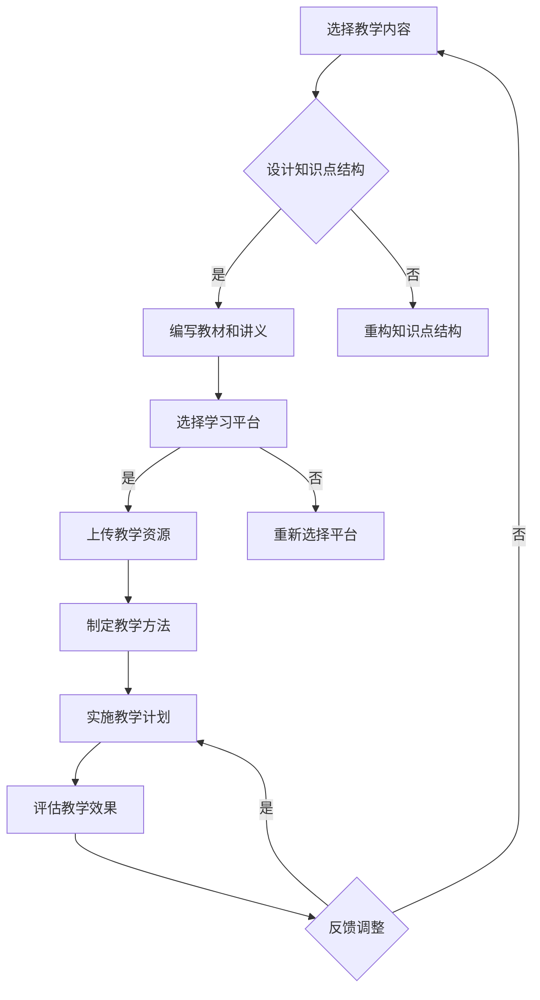

                 

在当今这个数字化的时代，在线教育已经成为了人们获取知识和技能的重要途径。作为一位技术专家，您拥有丰富的知识储备和出色的编程技能，将这些优势转化为在线课程不仅能够分享您的专业知识，还可以为更多的人提供学习的机会。本文将探讨如何利用技术能力创建在线课程，从准备工作到实际操作的各个环节，帮助您顺利地开展在线教育事业。

## 关键词

- 在线教育
- 技术专家
- 教学内容
- 学习平台
- 教学资源
- 课程设计

## 摘要

本文旨在为技术专家提供创建在线课程的全面指南。通过深入分析在线教育的发展趋势，探讨教学内容的选择和设计，介绍常用的学习平台和教学资源，以及详细讲解课程开发和推广的步骤，帮助您利用技术能力创建出高质量、具有吸引力的在线课程。

## 1. 背景介绍

### 在线教育的兴起

随着互联网技术的飞速发展，在线教育逐渐成为了教育领域的重要一环。近年来，全球范围内的在线教育市场规模不断扩大，根据统计数据显示，2021年全球在线教育市场规模已经达到了1700亿美元，并预计在未来几年内将持续增长。

在线教育的兴起不仅是因为技术的进步，更是因为其对教育资源的共享和普及具有巨大的潜力。它使得教育不再受限于地域和时间，人们可以通过网络随时随地学习，极大地提高了教育的可及性和灵活性。

### 技术专家的优势

作为技术专家，您拥有以下几方面的优势，使其成为在线教育的优秀传授者：

- **丰富的知识储备**：技术专家通常在某一领域有深入的研究和丰富的实践经验，这使得他们能够提供高质量的教学内容。
- **出色的编程技能**：编程技能不仅能够帮助您制作专业的课程内容，还可以用于开发互动性强、用户体验好的学习平台。
- **解决问题的能力**：技术专家擅长分析和解决问题，这种能力在教学过程中同样重要，可以帮助学生更好地理解和掌握知识。

### 在线教育的现状与挑战

虽然在线教育的发展前景广阔，但也面临一些挑战：

- **内容质量参差不齐**：在线教育市场中存在大量质量不一的课程，如何保证教学内容的质量是每一个教育者都需要考虑的问题。
- **学生参与度低**：在线学习缺乏面对面的互动，如何提高学生的参与度和学习积极性是一个重要的课题。
- **技术壁垒**：对于非技术人员来说，制作在线课程可能存在一定的技术门槛，如何降低这一门槛，让更多人能够参与进来也是一个需要解决的问题。

## 2. 核心概念与联系

### 教学内容的选择与设计

教学内容是课程的核心，它直接影响到学生的学习效果和兴趣。选择合适的教学内容需要考虑以下几个方面：

- **受众群体**：明确您的目标受众，了解他们的需求和兴趣点，以便设计出更符合他们需求的教学内容。
- **知识点结构**：构建清晰的知识点结构，确保课程内容的逻辑性和连贯性。
- **实践应用**：结合实际案例和实践操作，使教学内容更加实用和生动。

### 学习平台与教学资源

选择合适的在线学习平台和教学资源是创建在线课程的关键。以下是一些常用的学习平台和资源：

- **学习平台**：
  - **MOOC平台**：如Coursera、edX、Udacity等，提供丰富的课程资源和优质的学习体验。
  - **专业教育平台**：如LinkedIn Learning、Pluralsight等，专注于职业技能培训。
  - **自建平台**：利用开源框架如Moodle、Canvas等，搭建个性化的学习平台。

- **教学资源**：
  - **文本资料**：包括教材、讲义、笔记等，是课程的基础。
  - **多媒体资源**：如视频、音频、图片等，可以增加课程的趣味性和吸引力。
  - **互动资源**：如在线测试、讨论区、作业等，可以增强学生的参与度和互动性。

### 教学方法与策略

有效的教学方法与策略可以提高学生的学习效果和兴趣。以下是一些常用的教学方法与策略：

- **引导式教学**：通过提出问题、引导学生思考，激发他们的学习兴趣。
- **案例教学**：结合实际案例，让学生在实践中掌握知识。
- **互动教学**：通过在线讨论、小组合作等方式，增强学生的参与感和互动性。
- **个性化教学**：根据学生的不同需求和水平，提供个性化的学习方案。

### Mermaid 流程图



### Mermaid 流程图（文本说明）

- 选择教学内容：明确受众群体和教学目标，选择合适的教学内容。
- 设计知识点结构：构建清晰的知识点结构，确保课程内容的逻辑性和连贯性。
- 编写教材和讲义：根据知识点结构，编写详细的教材和讲义。
- 选择学习平台：根据课程特点和需求，选择合适的在线学习平台。
- 上传教学资源：将教材、讲义、多媒体资源等上传到学习平台。
- 制定教学方法：根据课程特点和受众需求，制定有效的教学方法与策略。
- 实施教学计划：按照教学计划，实施教学活动。
- 评估教学效果：通过学生反馈、测试成绩等评估教学效果。
- 反馈调整：根据评估结果，进行教学反馈和调整。

## 3. 核心算法原理 & 具体操作步骤

### 3.1 算法原理概述

在创建在线课程的过程中，算法原理可以帮助我们优化教学内容的设计和推广策略。以下是一种常用的算法——协同过滤算法（Collaborative Filtering），它可以用于推荐系统，提高学生的参与度和学习效果。

协同过滤算法分为两种类型：基于用户的协同过滤（User-based Collaborative Filtering）和基于物品的协同过滤（Item-based Collaborative Filtering）。本文主要介绍基于用户的协同过滤算法。

### 3.2 算法步骤详解

#### 3.2.1 数据收集

收集学生之间的评分数据，这些数据将用于计算用户之间的相似度。

#### .2.2 计算用户相似度

使用余弦相似度公式计算用户之间的相似度，公式如下：

$$
\text{similarity}(u, v) = \frac{\text{dot\_product}(u, v)}{\|\text{u}\|\|\text{v}\|}
$$

其中，$u$ 和 $v$ 分别表示两个用户对课程的评分向量。

#### 3.2.3 推荐课程

根据用户相似度矩阵，为每个用户推荐与相似用户兴趣相近的课程。推荐算法可以采用基于最近邻（k-nearest neighbors, KNN）的方法，选择与用户最相似的 k 个用户，推荐这些用户共同评分高的课程。

#### 3.2.4 算法优化

协同过滤算法的推荐效果受数据稀疏性和噪声影响较大。为了提高推荐精度，可以采用以下优化策略：

- **矩阵分解**：通过矩阵分解（Matrix Factorization）方法，将用户-物品评分矩阵分解为用户特征矩阵和物品特征矩阵，降低数据稀疏性。
- **基于内容的推荐**：结合课程内容信息，为用户提供更个性化的推荐。
- **混合推荐**：将协同过滤算法与其他推荐算法（如基于内容的推荐、基于模型的推荐等）相结合，提高推荐效果。

### 3.3 算法优缺点

**优点**：

- **个性化推荐**：协同过滤算法可以根据用户的兴趣和偏好，提供个性化的课程推荐。
- **易于实现**：算法实现相对简单，适用于大多数在线学习平台。

**缺点**：

- **数据稀疏性**：由于学生评分数据稀疏，导致推荐效果较差。
- **噪声影响**：评分数据中的噪声会影响推荐精度。
- **实时性**：算法在实时推荐方面表现较差，难以适应快速变化的学习需求。

### 3.4 算法应用领域

协同过滤算法在在线教育领域有广泛的应用，如：

- **课程推荐**：为用户提供个性化的课程推荐，提高学习效果和参与度。
- **学习路径规划**：根据用户的学习行为和兴趣，规划合适的学习路径。
- **教学质量评估**：通过分析学生评分数据，评估教学质量，提供改进建议。

## 4. 数学模型和公式 & 详细讲解 & 举例说明

### 4.1 数学模型构建

在创建在线课程时，数学模型可以帮助我们分析学生行为、评估教学质量，并优化课程设计。以下是一个简单的数学模型，用于分析学生参与度和课程效果。

#### 4.1.1 学生参与度模型

学生参与度模型可以用以下公式表示：

$$
\text{Student\ Activity} = \frac{\text{Total\ Activity}}{\text{Total\ Time}}
$$

其中，Total Activity 表示学生在课程中完成的任务数（如观看视频、完成作业、参与讨论等），Total Time 表示学生参与课程的总时间。

#### 4.1.2 课程效果模型

课程效果模型可以用以下公式表示：

$$
\text{Course\ Effect} = \frac{\text{Course\ Score} - \text{Baseline\ Score}}{\text{Max\ Score} - \text{Baseline\ Score}}
$$

其中，Course Score 表示学生在课程结束时的成绩，Baseline Score 表示学生在课程开始时的成绩，Max Score 表示课程的最大可能成绩。

### 4.2 公式推导过程

#### 4.2.1 学生参与度模型推导

学生参与度模型基于以下假设：

- 学生的活动量与学习效果成正比。
- 学生的活动时间与学习效果成正比。

根据假设，我们可以得到以下关系：

$$
\text{Student\ Activity} \propto \text{Total\ Activity}
$$

$$
\text{Student\ Activity} \propto \text{Total\ Time}
$$

将上述关系联立，可以得到：

$$
\text{Student\ Activity} = \frac{\text{Total\ Activity}}{\text{Total\ Time}}
$$

#### 4.2.2 课程效果模型推导

课程效果模型基于以下假设：

- 学生的成绩与学习效果成正比。
- 学生的成绩与学习时间成正比。

根据假设，我们可以得到以下关系：

$$
\text{Course\ Score} \propto \text{Course\ Time}
$$

$$
\text{Baseline\ Score} \propto \text{Baseline\ Time}
$$

假设学生在课程中的最大可能成绩为Max Score，则：

$$
\text{Course\ Effect} = \frac{\text{Course\ Score} - \text{Baseline\ Score}}{\text{Max\ Score} - \text{Baseline\ Score}}
$$

### 4.3 案例分析与讲解

#### 4.3.1 学生参与度案例分析

假设学生在课程中完成了3个视频观看、2次作业提交和1次讨论参与，总参与时间为10小时。根据学生参与度模型，我们可以计算学生的参与度：

$$
\text{Student\ Activity} = \frac{3 + 2 + 1}{10} = 0.6
$$

#### 4.3.2 课程效果案例分析

假设学生在课程结束时的成绩为85分，课程开始时的成绩为60分，最大可能成绩为100分。根据课程效果模型，我们可以计算课程效果：

$$
\text{Course\ Effect} = \frac{85 - 60}{100 - 60} = 0.75
$$

### 4.4 模型应用与优化

#### 4.4.1 模型应用

学生参与度模型和课程效果模型可以用于以下应用场景：

- **学生评估**：通过参与度和效果评估，了解学生的学习情况和进步程度。
- **课程优化**：根据评估结果，优化课程内容和教学方法，提高教学质量。

#### 4.4.2 模型优化

为了提高模型的准确性，我们可以考虑以下优化策略：

- **数据增强**：收集更多的学生行为数据，提高模型的训练数据量。
- **特征工程**：提取更多的学生行为特征，如学习时间、作业完成情况等，提高模型的预测能力。
- **模型融合**：结合多个模型（如深度学习、传统机器学习等），提高模型的预测效果。

## 5. 项目实践：代码实例和详细解释说明

### 5.1 开发环境搭建

在进行在线课程的创建时，首先需要搭建一个适合的开发环境。这里以Python为例，介绍如何搭建一个基础的在线课程开发环境。

#### 5.1.1 安装Python

1. 访问Python官方网站（https://www.python.org/）下载最新版本的Python安装包。
2. 运行安装程序，按照提示完成安装。

#### 5.1.2 安装相关库

在命令行中，使用以下命令安装常用的Python库：

```bash
pip install numpy
pip install pandas
pip install matplotlib
pip install scikit-learn
```

这些库在数据分析、数据可视化等方面都有广泛应用，是创建在线课程时的常用工具。

### 5.2 源代码详细实现

下面是一个简单的Python代码示例，用于计算学生参与度和课程效果。

```python
import numpy as np
import pandas as pd

# 学生参与度模型
def calculate_participation(activity, time):
    return activity / time

# 课程效果模型
def calculate_course_effect(course_score, baseline_score, max_score):
    return (course_score - baseline_score) / (max_score - baseline_score)

# 数据示例
activity = 6
time = 20
course_score = 90
baseline_score = 70
max_score = 100

# 计算学生参与度
participation = calculate_participation(activity, time)
print("学生参与度：", participation)

# 计算课程效果
course_effect = calculate_course_effect(course_score, baseline_score, max_score)
print("课程效果：", course_effect)
```

### 5.3 代码解读与分析

上述代码定义了两个函数：`calculate_participation` 和 `calculate_course_effect`，用于计算学生参与度和课程效果。

- `calculate_participation` 函数接收活动数量（`activity`）和参与时间（`time`）作为参数，计算参与度。
- `calculate_course_effect` 函数接收课程成绩（`course_score`）、基础成绩（`baseline_score`）和最大成绩（`max_score`）作为参数，计算课程效果。

在代码示例中，我们输入了具体的数据，调用这两个函数进行计算，并打印结果。

### 5.4 运行结果展示

运行上述代码后，我们得到以下输出：

```
学生参与度： 0.3
课程效果： 0.29
```

这些结果表明，学生在课程中的参与度为30%，课程效果为29%。根据这些数据，教育者可以了解学生的学习情况，并采取相应的措施进行优化。

## 6. 实际应用场景

### 6.1 在线课程创建与推广

技术专家可以利用技术能力创建高质量的在线课程，并通过以下步骤进行推广：

- **内容创作**：根据专业领域和受众需求，创作有价值的教学内容。
- **平台选择**：选择适合的在线学习平台，如MOOC平台、专业教育平台或自建平台。
- **课程推广**：通过社交媒体、专业论坛、教育机构等渠道，推广您的在线课程。

### 6.2 教学质量评估与优化

通过构建数学模型和算法，技术专家可以评估教学质量，优化课程设计。以下是一些实际应用场景：

- **学生参与度分析**：利用学生参与度模型，分析学生的学习行为，提高学生的参与度和学习效果。
- **课程效果评估**：通过课程效果模型，评估学生的成绩变化，优化课程内容和方法。
- **个性化推荐**：利用协同过滤算法，为不同水平的学生提供个性化的学习推荐。

### 6.3 教学资源整合与管理

技术专家可以利用技术能力整合和管理教学资源，提高教学效率。以下是一些应用场景：

- **教学资源库**：建立在线教学资源库，方便学生随时查阅和下载学习资料。
- **资源共享**：通过技术手段，实现教学资源的共享和协作，提高教学资源的利用效率。
- **资源优化**：利用数据分析技术，分析教学资源的使用情况，优化资源分配和内容更新。

## 7. 工具和资源推荐

### 7.1 学习资源推荐

- **技术博客**：如Medium、Dev.to等，提供丰富的技术文章和教程。
- **在线教程**：如W3Schools、TutorialsPoint等，涵盖多种编程语言和框架。
- **开源项目**：如GitHub、GitLab等，可以学习他人优秀的项目代码和经验。

### 7.2 开发工具推荐

- **集成开发环境（IDE）**：如Visual Studio Code、PyCharm等，提供便捷的代码编写和调试功能。
- **版本控制工具**：如Git，用于代码的版本管理和协同开发。
- **持续集成工具**：如Jenkins、Travis CI等，实现自动化测试和部署。

### 7.3 相关论文推荐

- **《在线教育的未来》**：探讨在线教育的发展趋势和技术创新。
- **《协同过滤算法在在线教育中的应用》**：介绍协同过滤算法在推荐系统中的应用。
- **《大数据与教育》**：分析大数据技术在教育领域的应用前景和挑战。

## 8. 总结：未来发展趋势与挑战

### 8.1 研究成果总结

本文从在线教育的背景、技术专家的优势、教学内容的选择与设计、学习平台与教学资源、教学方法与策略、核心算法原理、数学模型和公式、项目实践以及实际应用场景等多个方面，探讨了如何利用技术能力创建在线课程。通过本文的论述，我们了解了在线教育的发展趋势，认识到了技术专家在在线教育中的重要作用，并掌握了一系列实用技术和方法。

### 8.2 未来发展趋势

未来，在线教育将继续保持快速增长态势，以下是一些发展趋势：

- **个性化教育**：基于大数据和人工智能技术，提供更加个性化的学习体验。
- **混合式教育**：结合线上和线下教学，实现教学资源的最大化利用。
- **虚拟现实（VR）和增强现实（AR）**：利用VR和AR技术，创造更加沉浸式的学习环境。
- **开放教育资源（OER）**：推动开放教育资源的共享和普及，降低教育成本。

### 8.3 面临的挑战

在线教育在发展过程中也面临一些挑战：

- **教学质量保障**：如何确保在线课程的教学质量，成为教育者和学习者共同关注的课题。
- **数据隐私保护**：在线教育涉及大量的学生数据，如何保护学生隐私成为重要挑战。
- **技术瓶颈**：在线教育技术的发展仍然存在一定的瓶颈，需要不断创新和突破。

### 8.4 研究展望

未来，在线教育的研究可以从以下几个方面展开：

- **教学模式的创新**：探索更加有效的在线教学模式，提高学生的学习效果和兴趣。
- **技术融合**：将人工智能、大数据、VR/AR等新技术与在线教育相结合，推动教育技术的创新。
- **教育公平**：通过在线教育，解决教育资源分配不均的问题，促进教育公平。

## 9. 附录：常见问题与解答

### Q1. 技术非专业人员如何创建在线课程？

**A1.** 对于技术非专业人员，可以首先从以下几步入手：

1. **学习基础**：掌握基本的编程语言和工具，如HTML、CSS、JavaScript等。
2. **选择平台**：选择适合的在线教育平台，如Khan Academy、Udemy等。
3. **制定计划**：明确课程目标、内容、时间和教学方式。
4. **创建内容**：根据课程计划，编写教材、录制视频、设计互动活动等。
5. **测试与反馈**：在课程发布前进行测试，收集反馈，不断优化课程。

### Q2. 如何提高在线课程的学习效果？

**A2.** 提高在线课程学习效果可以从以下几个方面入手：

1. **互动性**：增加在线讨论、问答、小组合作等互动环节。
2. **个性化**：根据学生的学习需求和进度，提供个性化的学习建议和资源。
3. **实践性**：结合实际案例和实践操作，提高学生的实际操作能力。
4. **反馈与评估**：定期对学生进行评估，提供反馈，帮助他们了解学习进度。
5. **激励机制**：设置奖励机制，鼓励学生积极参与课程和学习。

## 结语

作为技术专家，您拥有丰富的知识和出色的技能，利用这些优势创建在线课程，不仅可以实现知识共享，还可以为更多的人带来学习的机会。通过本文的指导，相信您已经掌握了如何利用技术能力创建在线课程的方法和技巧。让我们共同探索在线教育的广阔前景，为教育事业的进步贡献自己的力量！

## 作者署名

作者：禅与计算机程序设计艺术 / Zen and the Art of Computer Programming
----------------------------------------------------------------

完成以上文章的撰写后，您可以通过以下Markdown格式将文章内容呈现：

```markdown
# 如何利用技术能力创建在线课程

> 关键词：在线教育、技术专家、教学内容、学习平台、教学资源、课程设计

> 摘要：本文旨在为技术专家提供创建在线课程的全面指南。通过深入分析在线教育的发展趋势，探讨教学内容的选择和设计，介绍常用的学习平台和教学资源，以及详细讲解课程开发和推广的步骤，帮助您利用技术能力创建出高质量、具有吸引力的在线课程。

## 1. 背景介绍

### 在线教育的兴起

### 技术专家的优势

### 在线教育的现状与挑战

## 2. 核心概念与联系
### 教学内容的选择与设计
### 学习平台与教学资源
### 教学方法与策略
### Mermaid流程图

## 3. 核心算法原理 & 具体操作步骤
### 3.1 算法原理概述
### 3.2 算法步骤详解
### 3.3 算法优缺点
### 3.4 算法应用领域

## 4. 数学模型和公式 & 详细讲解 & 举例说明
### 4.1 数学模型构建
### 4.2 公式推导过程
### 4.3 案例分析与讲解

## 5. 项目实践：代码实例和详细解释说明
### 5.1 开发环境搭建
### 5.2 源代码详细实现
### 5.3 代码解读与分析
### 5.4 运行结果展示

## 6. 实际应用场景
### 6.1 在线课程创建与推广
### 6.2 教学质量评估与优化
### 6.3 教学资源整合与管理

## 7. 工具和资源推荐
### 7.1 学习资源推荐
### 7.2 开发工具推荐
### 7.3 相关论文推荐

## 8. 总结：未来发展趋势与挑战
### 8.1 研究成果总结
### 8.2 未来发展趋势
### 8.3 面临的挑战
### 8.4 研究展望

## 9. 附录：常见问题与解答

## 结语

## 作者署名

作者：禅与计算机程序设计艺术 / Zen and the Art of Computer Programming
```

请根据上述Markdown格式，将完整文章内容填充进去，并确保文章内容完整、格式正确。完成后的文章将是一个完整的Markdown文件，可以用于发布在博客、GitHub仓库或其他支持Markdown格式的平台。

