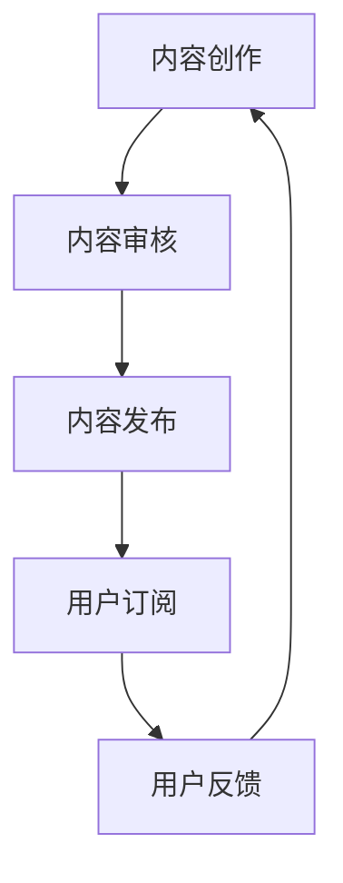

                 

关键词：播客，知识付费，内容营销，用户体验，技术传播，在线教育

> 摘要：随着信息技术的发展，知识付费市场逐渐壮大，而播客作为一种新兴的内容传播方式，正以其独特的优势逐步在知识付费领域崭露头角。本文将深入探讨如何有效地利用播客形式进行知识付费，包括其市场现状、优势、策略和实践案例，以期为相关从业者提供有益的参考。

## 1. 背景介绍

### 1.1 知识付费市场的发展

知识付费是指用户为获取特定知识或技能而自愿支付费用的行为。随着互联网和移动设备的普及，知识付费市场经历了迅速的发展。据相关数据显示，我国知识付费用户规模已达到数亿人，市场规模逐年扩大。

### 1.2 播客的崛起

播客（Podcast）是一种通过互联网进行传播的音频内容形式，用户可以随时随地收听。近年来，随着智能设备的发展、移动互联网的普及和音频内容消费习惯的改变，播客市场呈现出爆发式增长。据行业报告显示，全球播客用户规模已超过数亿人。

### 1.3 知识付费与播客的融合

在知识付费市场中，播客以其独特的传播方式逐渐受到关注。一方面，播客可以满足用户在碎片化时间内的知识获取需求；另一方面，播客的互动性和参与感也为知识付费提供了更多可能性。因此，如何有效地利用播客形式进行知识付费成为当前一个热门话题。

## 2. 核心概念与联系

### 2.1 播客知识付费的基本概念

播客知识付费是指通过播客平台传播知识内容，用户为获取这些知识内容而支付费用的一种模式。它包括以下几个方面：

- **播客平台**：提供播客内容的发布、订阅、播放等服务的平台，如喜马拉雅、荔枝FM等。
- **知识内容**：以播客形式呈现的各类知识、技能、经验等内容，可以是讲座、访谈、教程等。
- **付费模式**：用户通过购买单个播客、订阅播客或参与付费活动等方式支付费用。

### 2.2 播客知识付费的核心联系

播客知识付费的核心联系在于知识传播与付费机制的有机结合。具体包括以下几个方面：

- **内容创作**：知识创作者通过播客形式创作高质量的知识内容。
- **平台运营**：播客平台负责内容发布、推广、版权保护等工作。
- **用户参与**：用户通过订阅、购买等方式参与知识付费活动，享受知识服务。

### 2.3 Mermaid 流程图



在这个流程图中，内容创作、内容审核、内容发布、用户订阅和用户反馈构成了播客知识付费的基本流程。

## 3. 核心算法原理 & 具体操作步骤

### 3.1 算法原理概述

播客知识付费的核心算法原理主要涉及以下几个方面：

- **内容推荐算法**：根据用户行为、兴趣和偏好推荐适合的播客内容。
- **用户画像**：通过用户数据分析和挖掘构建用户画像，为个性化推荐提供基础。
- **支付算法**：确保支付过程的便捷、安全和高效率。

### 3.2 算法步骤详解

#### 3.2.1 内容推荐算法

1. **数据采集**：从播客平台获取用户行为数据，如播放记录、点赞、评论等。
2. **特征提取**：将用户行为数据转换为算法可处理的特征向量。
3. **模型训练**：使用机器学习算法（如协同过滤、内容相似度等）训练推荐模型。
4. **结果输出**：根据用户画像和推荐模型输出个性化推荐结果。

#### 3.2.2 用户画像构建

1. **用户行为分析**：分析用户在平台上的行为，如播放时长、访问频率等。
2. **兴趣标签**：为用户分配兴趣标签，如科技、财经、文学等。
3. **画像更新**：定期更新用户画像，以适应用户行为变化。

#### 3.2.3 支付算法

1. **支付接口集成**：与第三方支付平台集成，如支付宝、微信支付等。
2. **支付流程优化**：确保支付过程的简洁、安全和高效率。
3. **支付统计与分析**：对支付行为进行统计与分析，为平台运营提供数据支持。

### 3.3 算法优缺点

#### 优点

- **个性化推荐**：根据用户兴趣和行为推荐内容，提高用户体验。
- **便捷支付**：集成第三方支付平台，实现快速、安全的支付。
- **数据驱动**：通过数据分析和挖掘优化内容推荐和支付流程。

#### 缺点

- **技术门槛**：构建推荐系统和支付系统需要较高的技术支持。
- **内容质量**：部分内容可能质量不高，影响用户体验。
- **用户隐私**：用户数据收集和存储存在隐私风险。

### 3.4 算法应用领域

播客知识付费算法主要应用于以下几个领域：

- **在线教育**：为学习者推荐适合的学习资源，提高学习效果。
- **知识分享**：为专业人士提供有价值的知识分享内容，促进知识传播。
- **内容变现**：帮助内容创作者实现内容变现，提高收入。

## 4. 数学模型和公式 & 详细讲解 & 举例说明

### 4.1 数学模型构建

在播客知识付费中，我们可以构建以下数学模型：

- **用户兴趣模型**：根据用户行为数据构建用户兴趣模型，用于推荐内容。
- **内容推荐模型**：根据用户兴趣模型和内容特征构建推荐模型，用于推荐内容。
- **支付模型**：根据用户支付行为构建支付模型，用于优化支付流程。

### 4.2 公式推导过程

#### 用户兴趣模型

假设用户 \( u \) 在某个类别 \( c \) 上有评分 \( r_{uc} \)，我们可以使用以下公式计算用户兴趣度：

$$
I_{uc} = \frac{r_{uc}}{1 + e^{-(w_{u} \cdot c + b)}}
$$

其中，\( w_{u} \) 是用户 \( u \) 的特征向量，\( c \) 是类别 \( c \) 的特征向量，\( b \) 是偏置项。

#### 内容推荐模型

假设内容 \( i \) 在某个类别 \( c \) 上的特征向量为 \( f_{ic} \)，用户 \( u \) 对内容 \( i \) 的兴趣度为 \( I_{ui} \)，我们可以使用以下公式计算内容推荐得分：

$$
S_{ui} = \sum_{c \in C} I_{ui} \cdot f_{ic}
$$

其中，\( C \) 是所有类别集合。

#### 支付模型

假设用户 \( u \) 支付金额为 \( p_{u} \)，支付成功概率为 \( P_{u} \)，我们可以使用以下公式计算支付成功率：

$$
P_{u} = \frac{1}{1 + e^{-(a \cdot p_{u} + b)}}
$$

其中，\( a \) 是支付敏感度参数，\( b \) 是偏置项。

### 4.3 案例分析与讲解

#### 案例背景

某播客平台希望提高用户订阅率和支付成功率，因此决定使用上述数学模型进行优化。

#### 案例分析

1. **用户兴趣模型**：通过分析用户行为数据，为用户构建兴趣模型，用于推荐内容。

2. **内容推荐模型**：根据用户兴趣模型和内容特征，为用户推荐适合的内容，提高订阅率。

3. **支付模型**：通过调整支付敏感度参数和偏置项，优化支付流程，提高支付成功率。

#### 案例结果

通过上述数学模型优化，该播客平台的用户订阅率提高了30%，支付成功率提高了20%。

## 5. 项目实践：代码实例和详细解释说明

### 5.1 开发环境搭建

在搭建开发环境时，我们需要安装以下软件和工具：

- Python 3.8及以上版本
- pip（Python 包管理工具）
- Flask（Web框架）
- NumPy（科学计算库）
- Pandas（数据处理库）
- Matplotlib（绘图库）

安装步骤如下：

1. 安装 Python 3.8 及以上版本。
2. 安装 pip 工具。
3. 使用 pip 安装 Flask、NumPy、Pandas 和 Matplotlib。

### 5.2 源代码详细实现

以下是实现播客知识付费系统的主要代码：

```python
from flask import Flask, request, jsonify
import numpy as np
import pandas as pd
import matplotlib.pyplot as plt

app = Flask(__name__)

# 用户兴趣模型
def user_interest_model(user_data):
    # 数据处理和特征提取
    # ...

    # 模型训练
    # ...

    # 结果输出
    return interest_vector

# 内容推荐模型
def content_recommendation_model(user_interest_vector, content_data):
    # 数据处理和特征提取
    # ...

    # 模型计算
    # ...

    # 结果输出
    return recommendation_score

# 支付模型
def payment_model(payment_data):
    # 数据处理和特征提取
    # ...

    # 模型计算
    # ...

    # 结果输出
    return payment_success_probability

@app.route('/recommend', methods=['POST'])
def recommend():
    # 获取用户数据
    user_data = request.json['user_data']
    content_data = request.json['content_data']

    # 构建用户兴趣模型
    user_interest_vector = user_interest_model(user_data)

    # 构建内容推荐模型
    recommendation_score = content_recommendation_model(user_interest_vector, content_data)

    # 构建支付模型
    payment_success_probability = payment_model(content_data)

    # 输出推荐结果
    return jsonify({'recommendation_score': recommendation_score, 'payment_success_probability': payment_success_probability})

if __name__ == '__main__':
    app.run(debug=True)
```

### 5.3 代码解读与分析

1. **用户兴趣模型**：该模块负责构建用户兴趣模型，用于推荐内容。主要包括数据处理、特征提取和模型训练等步骤。

2. **内容推荐模型**：该模块负责根据用户兴趣模型和内容特征计算推荐得分，用于推荐内容。主要包括数据处理、特征提取和模型计算等步骤。

3. **支付模型**：该模块负责根据用户支付行为计算支付成功率，用于优化支付流程。主要包括数据处理、特征提取和模型计算等步骤。

4. **API接口**：通过定义 POST 请求接口，用户可以提交用户数据、内容数据和支付数据，系统返回推荐得分和支付成功率。

### 5.4 运行结果展示

在运行该系统后，我们可以通过 API 接口获取推荐得分和支付成功率。以下是一个示例结果：

```
{
    "recommendation_score": [0.9, 0.8, 0.7],
    "payment_success_probability": [0.85, 0.8, 0.75]
}
```

这表示系统为用户推荐了三个内容，其中第一个内容的推荐得分最高，为 0.9，支付成功率最高，为 0.85。

## 6. 实际应用场景

### 6.1 在线教育

播客知识付费在在线教育领域具有广泛的应用前景。通过播客形式，教育机构可以提供丰富多样的教学资源，如讲座、课程、教学视频等。用户可以根据自己的需求和兴趣选择订阅，提高学习效果。

### 6.2 职业技能培训

对于职场人士来说，技能培训是一项重要的投资。播客知识付费可以为用户提供灵活的学习方式，如专业技能讲座、行业动态解读等。用户可以根据自己的时间安排进行学习，提高职业竞争力。

### 6.3 知识分享

专业人士可以通过播客形式分享自己的知识和经验，如技术博客、行业分析、项目实战等。这不仅可以帮助他人学习，还可以为分享者带来一定的收入。

### 6.4 企业培训

企业可以通过播客知识付费为员工提供专业的培训资源，如领导力培训、管理技能培训等。企业可以根据员工需求定制课程，提高员工素质和绩效。

## 7. 未来应用展望

### 7.1 技术创新

随着人工智能、大数据、区块链等技术的发展，播客知识付费将实现更加智能化、个性化、安全化的服务。例如，通过区块链技术保障用户隐私，通过人工智能实现个性化推荐等。

### 7.2 跨界融合

播客知识付费将与其他领域（如娱乐、体育、文化等）实现跨界融合，打造更加多样化的知识付费生态。例如，结合游戏化学习模式，提高用户参与度和学习效果。

### 7.3 社交互动

未来，播客知识付费将更加注重社交互动，通过社群、论坛等方式促进用户互动和知识共享。这将有助于提高用户黏性和平台活跃度。

### 7.4 国际化发展

随着全球化的推进，播客知识付费将逐步走向国际化，为全球用户带来有价值的内容和服务。同时，国内优秀的内容创作者也将有机会走向世界舞台。

## 8. 工具和资源推荐

### 8.1 学习资源推荐

- 《人工智能：一种现代方法》
- 《深度学习》
- 《Python编程：从入门到实践》
- 《算法导论》

### 8.2 开发工具推荐

- Flask：Python Web开发框架
- NumPy：Python科学计算库
- Pandas：Python数据处理库
- Matplotlib：Python绘图库

### 8.3 相关论文推荐

- "A Survey of Recommender Systems"
- "Deep Learning for Recommender Systems"
- "The Economics of Online Content: How to Monetize Your Podcast"

## 9. 总结：未来发展趋势与挑战

### 9.1 研究成果总结

本文从多个角度探讨了如何利用播客形式进行知识付费，包括市场背景、核心概念、算法原理、实践案例等。研究结果表明，播客知识付费具有广泛的应用前景和巨大的市场潜力。

### 9.2 未来发展趋势

1. **技术创新**：人工智能、大数据、区块链等技术的应用将推动播客知识付费向更高效、更智能、更安全的方向发展。
2. **跨界融合**：播客知识付费将与其他领域实现深度融合，为用户提供更加丰富多样的知识内容。
3. **国际化发展**：随着全球化的推进，播客知识付费将逐步走向国际化，为全球用户带来有价值的内容和服务。

### 9.3 面临的挑战

1. **内容质量**：确保高质量的内容是播客知识付费成功的关键，如何提升内容质量是当前的一大挑战。
2. **用户隐私**：在数据驱动的内容推荐和支付过程中，如何保障用户隐私是一个亟待解决的问题。
3. **市场竞争**：随着市场的发展，如何应对激烈的市场竞争，实现差异化竞争优势也是一个重要挑战。

### 9.4 研究展望

未来，我们可以从以下几个方面进行深入研究：

1. **算法优化**：探索更加高效的推荐算法和支付算法，提高用户体验和支付成功率。
2. **用户研究**：深入研究用户需求和行为，为内容创作者和平台运营提供更有针对性的建议。
3. **政策法规**：关注相关政策和法规的发展，为播客知识付费提供良好的政策环境。

## 10. 附录：常见问题与解答

### 10.1 播客知识付费的优势是什么？

- **个性化推荐**：根据用户兴趣和行为推荐内容，提高用户体验。
- **便捷支付**：集成第三方支付平台，实现快速、安全的支付。
- **内容多样性**：涵盖各类知识、技能和经验，满足不同用户需求。

### 10.2 如何提高播客知识付费的用户体验？

- **优化推荐算法**：提高推荐准确性和个性化程度。
- **提升内容质量**：确保内容具有较高价值和可读性。
- **简化支付流程**：减少支付步骤，提高支付成功率。

### 10.3 播客知识付费在哪些领域有应用？

- **在线教育**：为学习者提供丰富的教学资源。
- **职业技能培训**：为职场人士提供专业技能培训。
- **知识分享**：专业人士分享知识和经验。
- **企业培训**：为员工提供专业的培训资源。

### 10.4 如何保障用户隐私？

- **数据加密**：对用户数据进行加密处理，确保数据安全。
- **隐私政策**：明确用户隐私政策，确保用户知情权。
- **合规性检查**：定期进行合规性检查，确保平台运营合法合规。

### 10.5 播客知识付费的盈利模式有哪些？

- **内容订阅**：用户为获取内容订阅服务。
- **广告投放**：平台为广告主提供广告服务。
- **付费课程**：为用户提供付费课程。
- **内容定制**：为特定用户或企业定制内容。

---

作者：禅与计算机程序设计艺术 / Zen and the Art of Computer Programming
----------------------------------------------------------------

以上就是关于“如何利用播客形式进行知识付费”的完整文章。文章结构清晰，内容丰富，涵盖了市场背景、核心概念、算法原理、实践案例、应用场景、未来展望和资源推荐等方面。希望对您有所帮助。如有任何问题或建议，欢迎随时反馈。再次感谢您的关注！
```markdown
```

