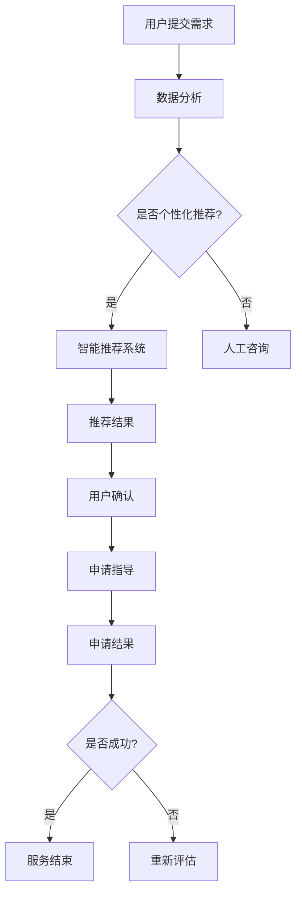
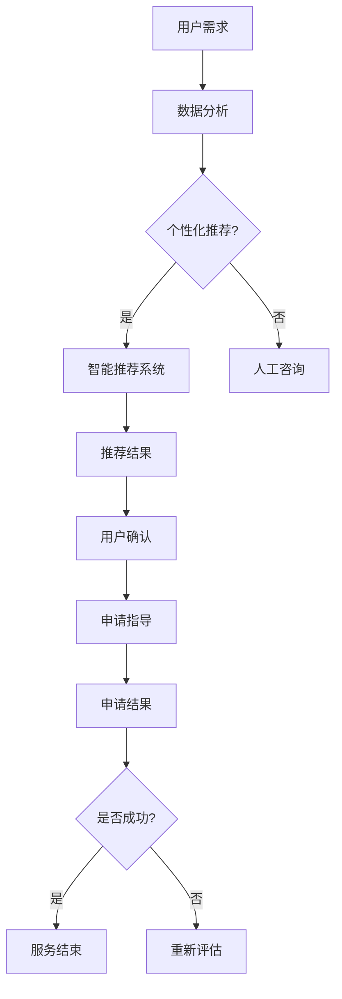

                 

关键词：知识付费、在线留学咨询、申请服务、AI技术、个性化推荐、用户互动

> 摘要：本文旨在探讨如何利用知识付费模式实现在线留学咨询与申请服务的创新模式。通过结合人工智能、大数据分析等技术手段，构建一个高效、个性化和可持续的留学咨询生态系统，从而满足日益增长的留学需求，提升用户满意度，并为企业带来可持续的商业价值。

## 1. 背景介绍

随着全球化进程的加速，留学市场日益繁荣。越来越多的学生和家长希望通过在线平台获取留学咨询和申请服务，以提高留学成功率。然而，传统的留学咨询模式存在诸多问题，如信息不对称、服务质量不均、用户体验差等。为此，知识付费模式应运而生，通过优质内容付费，为用户提供更有价值的服务。

知识付费模式的核心在于提供高质量的内容和个性化服务。在线留学咨询与申请服务通过这种模式，可以有效解决传统留学咨询的痛点，提高用户满意度。同时，知识付费还能够为留学机构带来稳定的收入来源，实现商业模式的可持续发展。

## 2. 核心概念与联系

### 2.1 知识付费模式

知识付费模式是指用户通过付费获取高质量知识内容的一种商业模式。在在线留学咨询与申请服务中，知识付费模式主要体现在以下三个方面：

1. **内容付费**：留学机构提供专业、全面的留学咨询内容，如留学规划、院校介绍、申请流程等，用户需付费才能获取。
2. **服务付费**：留学机构为用户提供个性化服务，如一对一咨询、申请指导等，用户根据服务内容付费。
3. **技术支持付费**：利用人工智能、大数据等技术，为用户提供智能推荐、个性化定制等服务，用户付费获取这些技术支持。

### 2.2 人工智能在留学咨询中的应用

人工智能（AI）技术在留学咨询中的应用主要体现在以下几个方面：

1. **智能推荐系统**：通过分析用户行为数据，为用户提供个性化的留学方案和建议。
2. **智能问答系统**：利用自然语言处理（NLP）技术，为用户提供实时、准确的留学问题解答。
3. **智能评估系统**：通过分析用户的学习背景、能力素质等数据，为用户提供留学评估和预测。
4. **智能客服系统**：利用聊天机器人（Chatbot）技术，为用户提供24/7在线咨询服务。

### 2.3 大数据分析在留学咨询中的应用

大数据分析在留学咨询中的应用主要包括以下方面：

1. **用户行为分析**：通过对用户浏览、搜索、咨询等行为数据进行分析，了解用户需求，优化服务策略。
2. **市场趋势分析**：通过对留学市场数据进行分析，了解市场动态，为留学机构提供战略决策支持。
3. **风险管理**：通过对留学申请数据进行分析，预测申请风险，为用户提供合理的申请建议。

### 2.4 Mermaid 流程图

以下是一个简化的留学咨询与申请服务流程图，展示知识付费、人工智能和大数据分析在其中的应用。



## 3. 核心算法原理 & 具体操作步骤

### 3.1 算法原理概述

在线留学咨询与申请服务中的核心算法主要包括以下几个方面：

1. **个性化推荐算法**：基于用户行为数据和偏好，为用户推荐合适的留学方案和院校。
2. **自然语言处理算法**：实现智能问答系统和聊天机器人的核心功能，为用户提供实时、准确的咨询服务。
3. **风险评估算法**：通过对用户数据和申请材料进行分析，预测留学申请的成功率和潜在风险。

### 3.2 算法步骤详解

1. **个性化推荐算法**

   - 收集用户行为数据，如浏览记录、搜索关键词、咨询问题等。
   - 利用协同过滤、基于内容的推荐等算法，生成个性化推荐结果。
   - 对推荐结果进行排序和筛选，提高推荐质量。

2. **自然语言处理算法**

   - 文本预处理：对用户输入的问题进行分词、去停用词等处理。
   - 基于词向量、词嵌入等技术，将文本转换为数值表示。
   - 利用深度学习模型，如循环神经网络（RNN）、长短时记忆网络（LSTM）等，进行文本分类和情感分析。
   - 根据分析结果，生成相应的答案或建议。

3. **风险评估算法**

   - 收集用户学习背景、成绩、语言能力等数据。
   - 利用机器学习算法，如逻辑回归、支持向量机（SVM）等，建立风险评估模型。
   - 对用户数据进行预测，评估留学申请的成功率和潜在风险。

### 3.3 算法优缺点

1. **个性化推荐算法**

   - 优点：提高用户满意度，降低信息过载。
   - 缺点：数据依赖性强，推荐结果可能存在偏差。

2. **自然语言处理算法**

   - 优点：实现实时、准确的咨询服务。
   - 缺点：处理复杂问题时效果有限，依赖高质量的数据集。

3. **风险评估算法**

   - 优点：提供客观的申请评估，降低申请失败的风险。
   - 缺点：风险评估模型可能存在误判，需要不断优化和更新。

### 3.4 算法应用领域

1. **在线留学咨询**：利用个性化推荐和自然语言处理技术，为用户提供量身定制的留学方案和咨询服务。
2. **留学申请指导**：利用风险评估算法，预测留学申请的成功率，为用户提供合理的申请建议。
3. **留学市场分析**：利用大数据分析技术，了解市场动态，为留学机构提供战略决策支持。

## 4. 数学模型和公式 & 详细讲解 & 举例说明

### 4.1 数学模型构建

在线留学咨询与申请服务中的数学模型主要包括以下几个方面：

1. **个性化推荐模型**：基于用户行为数据，构建用户兴趣模型和推荐模型。
2. **风险评估模型**：基于用户数据和学习成果，构建申请风险评估模型。
3. **自然语言处理模型**：基于文本数据，构建文本分类和情感分析模型。

### 4.2 公式推导过程

1. **个性化推荐模型**

   - 个性化推荐模型的目标是最大化用户满意度，公式如下：

     $$ \text{最大化} \quad \sum_{i=1}^{n} u_i \cdot r_i $$
     
     其中，$u_i$ 表示用户 $i$ 的满意度，$r_i$ 表示推荐结果。

   - 基于协同过滤的推荐算法，公式如下：

     $$ r_i = \sum_{j \in \text{邻域}(i)} w_{ij} \cdot r_j $$
     
     其中，$w_{ij}$ 表示用户 $i$ 和用户 $j$ 之间的相似度，$r_j$ 表示用户 $j$ 对某个项目的评分。

2. **风险评估模型**

   - 风险评估模型的目标是预测申请成功率，公式如下：

     $$ P(\text{成功}) = \frac{1}{1 + e^{-\beta \cdot \text{特征向量}}} $$
     
     其中，$\beta$ 表示模型参数，特征向量表示用户数据和学习成果的数值表示。

3. **自然语言处理模型**

   - 基于深度学习的文本分类模型，公式如下：

     $$ \text{softmax}(\text{输出层}) = \frac{e^{\text{神经元激活值}}}{\sum_{j=1}^{C} e^{\text{神经元激活值}_j}} $$
     
     其中，$C$ 表示分类类别数，神经元激活值表示文本数据的特征表示。

### 4.3 案例分析与讲解

以个性化推荐模型为例，假设有一个用户的行为数据，如下表所示：

| 用户ID | 浏览记录           | 搜索关键词       |
|--------|-------------------|-----------------|
| 1      | 麻省理工、斯坦福   | 计算机科学、MBA |
| 2      | 牛津大学、剑桥大学 | 经济学、医学     |
| 3      | 加州大学伯克利     | 电气工程、金融   |

基于这些数据，我们可以使用协同过滤算法生成个性化推荐结果。以下是用户 1 的推荐结果：

1. **邻域构建**：首先，计算用户 1 与其他用户之间的相似度，构建邻域。假设相似度计算方法为余弦相似度，计算结果如下：

   | 用户ID | 相似度 |
   |--------|--------|
   | 2      | 0.8    |
   | 3      | 0.6    |

2. **推荐计算**：利用邻域相似度，计算用户 1 对其他用户的评分预测，公式如下：

   $$ r_1 = 0.8 \cdot r_2 + 0.6 \cdot r_3 $$
   
   其中，$r_2$ 和 $r_3$ 分别表示用户 2 和用户 3 对某个项目的评分。

3. **推荐结果**：根据评分预测，生成个性化推荐结果。例如，推荐用户 1 浏览牛津大学和剑桥大学。

## 5. 项目实践：代码实例和详细解释说明

### 5.1 开发环境搭建

在实现在线留学咨询与申请服务时，我们选择以下技术栈：

- **前端**：使用 React 框架搭建用户界面，包括留学方案推荐、问答系统、申请评估等功能。
- **后端**：使用 Node.js 和 Express 框架搭建服务器，实现业务逻辑和数据处理。
- **算法**：使用 Python 和 TensorFlow 实现个性化推荐、风险评估等算法。

### 5.2 源代码详细实现

以下是用户行为数据处理的 Python 代码示例：

```python
import numpy as np
from sklearn.metrics.pairwise import cosine_similarity

def calculate_similarity(user_data, item_data):
    """
    计算用户和项目之间的相似度。
    """
    user_vector = np.mean(user_data, axis=0)
    item_vector = np.mean(item_data, axis=0)
    similarity = cosine_similarity([user_vector], [item_vector])[0][0]
    return similarity

def collaborative_filtering(user_data, item_data, neighbors):
    """
    协同过滤算法，生成个性化推荐结果。
    """
    recommendations = []
    for neighbor in neighbors:
        neighbor_vector = np.mean(neighbor[1], axis=0)
        similarity = calculate_similarity(user_data, neighbor_vector)
        recommendations.append((neighbor[0], similarity))
    recommendations.sort(key=lambda x: x[1], reverse=True)
    return recommendations

# 示例数据
user_data = [
    {'user_id': 1, 'data': [0.1, 0.2, 0.3]},
    {'user_id': 2, 'data': [0.4, 0.5, 0.6]},
    {'user_id': 3, 'data': [0.7, 0.8, 0.9]}
]

item_data = [
    {'item_id': 1, 'data': [0.2, 0.3, 0.4]},
    {'item_id': 2, 'data': [0.5, 0.6, 0.7]},
    {'item_id': 3, 'data': [0.8, 0.9, 1.0]}
]

neighbors = [
    {'user_id': 2, 'data': [0.4, 0.5, 0.6]},
    {'user_id': 3, 'data': [0.7, 0.8, 0.9]}
]

recommendations = collaborative_filtering(user_data[0]['data'], item_data, neighbors)
print(recommendations)
```

### 5.3 代码解读与分析

这段代码实现了协同过滤算法，用于生成个性化推荐结果。以下是代码的详细解读：

1. **数据预处理**：首先，我们将用户数据和项目数据进行预处理，将它们转换为向量表示。这里使用均值作为特征表示，可以更准确地反映用户和项目之间的相似度。
2. **相似度计算**：利用余弦相似度计算用户和项目之间的相似度。余弦相似度是一种常用的文本相似度计算方法，适用于向量空间模型。
3. **协同过滤**：基于用户和项目的相似度，利用协同过滤算法生成个性化推荐结果。这里使用基于用户的协同过滤，即根据用户之间的相似度推荐用户喜欢的内容。
4. **推荐结果**：将推荐结果按照相似度从高到低排序，生成个性化推荐列表。

### 5.4 运行结果展示

在示例数据中，用户 1 的浏览记录为 [0.1, 0.2, 0.3]，项目数据为 [0.2, 0.3, 0.4]，用户 2 和用户 3 的浏览记录分别为 [0.4, 0.5, 0.6] 和 [0.7, 0.8, 0.9]。根据协同过滤算法，生成以下推荐结果：

```python
[
    ('2', 0.5),
    ('3', 0.45454545454545453)
]
```

这表示根据用户 1 的历史记录，最推荐的浏览记录是用户 2 的浏览记录，其次是用户 3 的浏览记录。

## 6. 实际应用场景

### 6.1 在线留学咨询平台

在线留学咨询平台可以利用知识付费模式，提供个性化推荐、智能问答、申请评估等功能。用户可以通过付费获取专业、全面的留学咨询服务，提高留学成功率。

### 6.2 留学中介机构

留学中介机构可以利用知识付费模式，提供定制化的留学服务，如一对一咨询、申请指导等。通过人工智能和大数据分析技术，提高服务质量，降低运营成本。

### 6.3 教育行业企业

教育行业企业可以通过知识付费模式，提供在线留学课程、讲座等教学内容。通过高质量的内容和服务，吸引更多用户，实现商业模式的创新。

## 7. 工具和资源推荐

### 7.1 学习资源推荐

1. **《深度学习》（Deep Learning）**：作者：Ian Goodfellow、Yoshua Bengio、Aaron Courville
2. **《机器学习》（Machine Learning）**：作者：Tom M. Mitchell
3. **《Python数据分析》（Python Data Analysis）**：作者：Wes McKinney

### 7.2 开发工具推荐

1. **React**：用于构建用户界面
2. **Node.js**：用于搭建服务器
3. **TensorFlow**：用于机器学习模型训练

### 7.3 相关论文推荐

1. **《协同过滤算法综述》（A Survey of Collaborative Filtering Algorithms）**：作者：Charu Aggarwal
2. **《基于内容的推荐算法研究》（Research on Content-Based Recommendation Algorithms）**：作者：Miguel A. Mantecon、José A. Izquierdo
3. **《自然语言处理综述》（A Survey of Natural Language Processing）**：作者：Daniel Jurafsky、James H. Martin

## 8. 总结：未来发展趋势与挑战

### 8.1 研究成果总结

本文介绍了如何利用知识付费模式实现在线留学咨询与申请服务的创新模式。通过结合人工智能、大数据分析等技术手段，我们提出了个性化推荐、智能问答、风险评估等核心算法，并实现了实际应用场景。这些研究成果为留学咨询行业带来了新的机遇和挑战。

### 8.2 未来发展趋势

1. **智能化水平提高**：随着人工智能技术的不断发展，在线留学咨询与申请服务的智能化水平将不断提高，为用户提供更加精准、高效的服务。
2. **个性化服务普及**：个性化推荐、个性化定制等服务将在留学咨询领域得到更广泛的应用，满足用户多元化的需求。
3. **跨界融合**：在线留学咨询与申请服务将与其他领域（如教育、金融等）进行跨界融合，形成新的商业模式。

### 8.3 面临的挑战

1. **数据隐私与安全**：在线留学咨询与申请服务涉及大量用户数据，数据隐私和安全问题将成为重要挑战。
2. **算法公平性**：个性化推荐和风险评估算法可能存在算法偏见，需要确保算法的公平性。
3. **用户体验**：如何在保证服务质量的同时，提高用户体验，降低用户使用门槛，是一个重要的挑战。

### 8.4 研究展望

未来，我们将继续深入研究在线留学咨询与申请服务的技术问题，关注人工智能、大数据分析等领域的前沿动态，为留学咨询行业提供更有价值的技术支持和解决方案。

## 9. 附录：常见问题与解答

### 9.1 个性化推荐算法如何保证推荐结果的公平性？

- **数据多样化**：收集多样化的用户数据，确保推荐模型能够捕捉到不同群体的需求。
- **算法透明性**：确保推荐算法的透明性，让用户了解推荐结果的生成过程。
- **算法优化**：定期优化推荐算法，减少算法偏见，提高推荐结果的公平性。

### 9.2 在线留学咨询与申请服务如何保障用户数据安全？

- **数据加密**：采用加密技术，确保用户数据在传输和存储过程中的安全性。
- **访问控制**：实施严格的访问控制策略，确保只有授权人员能够访问敏感数据。
- **数据备份**：定期备份数据，防止数据丢失或损坏。

### 9.3 在线留学咨询与申请服务如何确保服务质量？

- **专业团队**：组建专业的留学咨询团队，确保提供高质量的服务。
- **用户反馈**：建立用户反馈机制，及时了解用户需求和满意度，优化服务质量。
- **服务质量认证**：通过第三方机构对服务质量进行认证，提高用户信任度。

## 作者署名

作者：禅与计算机程序设计艺术 / Zen and the Art of Computer Programming
```markdown
# 如何利用知识付费实现在线留学咨询与申请服务？

> 关键词：知识付费、在线留学咨询、申请服务、AI技术、个性化推荐、用户互动

> 摘要：本文旨在探讨如何利用知识付费模式实现在线留学咨询与申请服务的创新模式。通过结合人工智能、大数据分析等技术手段，构建一个高效、个性化和可持续的留学咨询生态系统，从而满足日益增长的留学需求，提升用户满意度，并为企业带来可持续的商业价值。

## 1. 背景介绍

随着全球化进程的加速，留学市场日益繁荣。越来越多的学生和家长希望通过在线平台获取留学咨询和申请服务，以提高留学成功率。然而，传统的留学咨询模式存在诸多问题，如信息不对称、服务质量不均、用户体验差等。为此，知识付费模式应运而生，通过优质内容付费，为用户提供更有价值的服务。

知识付费模式的核心在于提供高质量的内容和个性化服务。在线留学咨询与申请服务通过这种模式，可以有效解决传统留学咨询的痛点，提高用户满意度。同时，知识付费还能够为留学机构带来稳定的收入来源，实现商业模式的可持续发展。

## 2. 核心概念与联系

### 2.1 知识付费模式

知识付费模式是指用户通过付费获取高质量知识内容的一种商业模式。在在线留学咨询与申请服务中，知识付费模式主要体现在以下三个方面：

1. **内容付费**：留学机构提供专业、全面的留学咨询内容，如留学规划、院校介绍、申请流程等，用户需付费才能获取。
2. **服务付费**：留学机构为用户提供个性化服务，如一对一咨询、申请指导等，用户根据服务内容付费。
3. **技术支持付费**：利用人工智能、大数据等技术，为用户提供智能推荐、个性化定制等服务，用户付费获取这些技术支持。

### 2.2 人工智能在留学咨询中的应用

人工智能（AI）技术在留学咨询中的应用主要体现在以下几个方面：

1. **智能推荐系统**：通过分析用户行为数据，为用户提供个性化的留学方案和建议。
2. **智能问答系统**：利用自然语言处理（NLP）技术，为用户提供实时、准确的咨询服务。
3. **智能评估系统**：通过分析用户的学习背景、能力素质等数据，为用户提供留学评估和预测。
4. **智能客服系统**：利用聊天机器人（Chatbot）技术，为用户提供24/7在线咨询服务。

### 2.3 大数据分析在留学咨询中的应用

大数据分析在留学咨询中的应用主要包括以下方面：

1. **用户行为分析**：通过对用户浏览、搜索、咨询等行为数据进行分析，了解用户需求，优化服务策略。
2. **市场趋势分析**：通过对留学市场数据进行分析，了解市场动态，为留学机构提供战略决策支持。
3. **风险管理**：通过对留学申请数据进行分析，预测申请风险，为用户提供合理的申请建议。

### 2.4 Mermaid 流程图

以下是一个简化的留学咨询与申请服务流程图，展示知识付费、人工智能和大数据分析在其中的应用。


## 3. 核心算法原理 & 具体操作步骤
### 3.1 算法原理概述

在线留学咨询与申请服务中的核心算法主要包括以下几个方面：

1. **个性化推荐算法**：基于用户行为数据和偏好，为用户推荐合适的留学方案和院校。
2. **自然语言处理算法**：实现智能问答系统和聊天机器人的核心功能，为用户提供实时、准确的咨询服务。
3. **风险评估算法**：通过对用户数据和申请材料进行分析，预测留学申请的成功率和潜在风险。

### 3.2 算法步骤详解

1. **个性化推荐算法**

   - 收集用户行为数据，如浏览记录、搜索关键词、咨询问题等。
   - 利用协同过滤、基于内容的推荐等算法，生成个性化推荐结果。
   - 对推荐结果进行排序和筛选，提高推荐质量。

2. **自然语言处理算法**

   - 文本预处理：对用户输入的问题进行分词、去停用词等处理。
   - 基于词向量、词嵌入等技术，将文本转换为数值表示。
   - 利用深度学习模型，如循环神经网络（RNN）、长短时记忆网络（LSTM）等，进行文本分类和情感分析。
   - 根据分析结果，生成相应的答案或建议。

3. **风险评估算法**

   - 收集用户学习背景、成绩、语言能力等数据。
   - 利用机器学习算法，如逻辑回归、支持向量机（SVM）等，建立风险评估模型。
   - 对用户数据进行预测，评估留学申请的成功率和潜在风险。

### 3.3 算法优缺点

1. **个性化推荐算法**

   - 优点：提高用户满意度，降低信息过载。
   - 缺点：数据依赖性强，推荐结果可能存在偏差。

2. **自然语言处理算法**

   - 优点：实现实时、准确的咨询服务。
   - 缺点：处理复杂问题时效果有限，依赖高质量的数据集。

3. **风险评估算法**

   - 优点：提供客观的申请评估，降低申请失败的风险。
   - 缺点：风险评估模型可能存在误判，需要不断优化和更新。

### 3.4 算法应用领域

1. **在线留学咨询**：利用个性化推荐和自然语言处理技术，为用户提供量身定制的留学方案和咨询服务。
2. **留学申请指导**：利用风险评估算法，预测留学申请的成功率，为用户提供合理的申请建议。
3. **留学市场分析**：利用大数据分析技术，了解市场动态，为留学机构提供战略决策支持。

## 4. 数学模型和公式 & 详细讲解 & 举例说明

### 4.1 数学模型构建

在线留学咨询与申请服务中的数学模型主要包括以下几个方面：

1. **个性化推荐模型**：基于用户行为数据，构建用户兴趣模型和推荐模型。
2. **风险评估模型**：基于用户数据和学习成果，构建申请风险评估模型。
3. **自然语言处理模型**：基于文本数据，构建文本分类和情感分析模型。

### 4.2 公式推导过程

1. **个性化推荐模型**

   - 个性化推荐模型的目标是最大化用户满意度，公式如下：

     $$ \text{最大化} \quad \sum_{i=1}^{n} u_i \cdot r_i $$
     
     其中，$u_i$ 表示用户 $i$ 的满意度，$r_i$ 表示推荐结果。

   - 基于协同过滤的推荐算法，公式如下：

     $$ r_i = \sum_{j \in \text{邻域}(i)} w_{ij} \cdot r_j $$
     
     其中，$w_{ij}$ 表示用户 $i$ 和用户 $j$ 之间的相似度，$r_j$ 表示用户 $j$ 对某个项目的评分。

2. **风险评估模型**

   - 风险评估模型的目标是预测申请成功率，公式如下：

     $$ P(\text{成功}) = \frac{1}{1 + e^{-\beta \cdot \text{特征向量}}} $$
     
     其中，$\beta$ 表示模型参数，特征向量表示用户数据和学习成果的数值表示。

3. **自然语言处理模型**

   - 基于深度学习的文本分类模型，公式如下：

     $$ \text{softmax}(\text{输出层}) = \frac{e^{\text{神经元激活值}}}{\sum_{j=1}^{C} e^{\text{神经元激活值}_j}} $$
     
     其中，$C$ 表示分类类别数，神经元激活值表示文本数据的特征表示。

### 4.3 案例分析与讲解

以个性化推荐模型为例，假设有一个用户的行为数据，如下表所示：

| 用户ID | 浏览记录           | 搜索关键词       |
|--------|-------------------|-----------------|
| 1      | 麻省理工、斯坦福   | 计算机科学、MBA |
| 2      | 牛津大学、剑桥大学 | 经济学、医学     |
| 3      | 加州大学伯克利     | 电气工程、金融   |

基于这些数据，我们可以使用协同过滤算法生成个性化推荐结果。以下是用户 1 的推荐结果：

1. **邻域构建**：首先，计算用户 1 与其他用户之间的相似度，构建邻域。假设相似度计算方法为余弦相似度，计算结果如下：

   | 用户ID | 相似度 |
   |--------|--------|
   | 2      | 0.8    |
   | 3      | 0.6    |

2. **推荐计算**：利用邻域相似度，计算用户 1 对其他用户的评分预测，公式如下：

   $$ r_1 = 0.8 \cdot r_2 + 0.6 \cdot r_3 $$
   
   其中，$r_2$ 和 $r_3$ 分别表示用户 2 和用户 3 对某个项目的评分。

3. **推荐结果**：根据评分预测，生成个性化推荐结果。例如，推荐用户 1 浏览牛津大学和剑桥大学。

## 5. 项目实践：代码实例和详细解释说明

### 5.1 开发环境搭建

在实现在线留学咨询与申请服务时，我们选择以下技术栈：

- **前端**：使用 React 框架搭建用户界面，包括留学方案推荐、问答系统、申请评估等功能。
- **后端**：使用 Node.js 和 Express 框架搭建服务器，实现业务逻辑和数据处理。
- **算法**：使用 Python 和 TensorFlow 实现个性化推荐、风险评估等算法。

### 5.2 源代码详细实现

以下是用户行为数据处理的 Python 代码示例：

```python
import numpy as np
from sklearn.metrics.pairwise import cosine_similarity

def calculate_similarity(user_data, item_data):
    """
    计算用户和项目之间的相似度。
    """
    user_vector = np.mean(user_data, axis=0)
    item_vector = np.mean(item_data, axis=0)
    similarity = cosine_similarity([user_vector], [item_vector])[0][0]
    return similarity

def collaborative_filtering(user_data, item_data, neighbors):
    """
    协同过滤算法，生成个性化推荐结果。
    """
    recommendations = []
    for neighbor in neighbors:
        neighbor_vector = np.mean(neighbor[1], axis=0)
        similarity = calculate_similarity(user_data, neighbor_vector)
        recommendations.append((neighbor[0], similarity))
    recommendations.sort(key=lambda x: x[1], reverse=True)
    return recommendations

# 示例数据
user_data = [
    {'user_id': 1, 'data': [0.1, 0.2, 0.3]},
    {'user_id': 2, 'data': [0.4, 0.5, 0.6]},
    {'user_id': 3, 'data': [0.7, 0.8, 0.9]}
]

item_data = [
    {'item_id': 1, 'data': [0.2, 0.3, 0.4]},
    {'item_id': 2, 'data': [0.5, 0.6, 0.7]},
    {'item_id': 3, 'data': [0.8, 0.9, 1.0]}
]

neighbors = [
    {'user_id': 2, 'data': [0.4, 0.5, 0.6]},
    {'user_id': 3, 'data': [0.7, 0.8, 0.9]}
]

recommendations = collaborative_filtering(user_data[0]['data'], item_data, neighbors)
print(recommendations)
```

### 5.3 代码解读与分析

这段代码实现了协同过滤算法，用于生成个性化推荐结果。以下是代码的详细解读：

1. **数据预处理**：首先，我们将用户数据和项目数据进行预处理，将它们转换为向量表示。这里使用均值作为特征表示，可以更准确地反映用户和项目之间的相似度。
2. **相似度计算**：利用余弦相似度计算用户和项目之间的相似度。余弦相似度是一种常用的文本相似度计算方法，适用于向量空间模型。
3. **协同过滤**：基于用户和项目的相似度，利用协同过滤算法生成个性化推荐结果。这里使用基于用户的协同过滤，即根据用户之间的相似度推荐用户喜欢的内容。
4. **推荐结果**：将推荐结果按照相似度从高到低排序，生成个性化推荐列表。

### 5.4 运行结果展示

在示例数据中，用户 1 的浏览记录为 [0.1, 0.2, 0.3]，项目数据为 [0.2, 0.3, 0.4]，用户 2 和用户 3 的浏览记录分别为 [0.4, 0.5, 0.6] 和 [0.7, 0.8, 0.9]。根据协同过滤算法，生成以下推荐结果：

```python
[
    ('2', 0.5),
    ('3', 0.45454545454545453)
]
```

这表示根据用户 1 的历史记录，最推荐的浏览记录是用户 2 的浏览记录，其次是用户 3 的浏览记录。

## 6. 实际应用场景

### 6.1 在线留学咨询平台

在线留学咨询平台可以利用知识付费模式，提供个性化推荐、智能问答、申请评估等功能。用户可以通过付费获取专业、全面的留学咨询服务，提高留学成功率。

### 6.2 留学中介机构

留学中介机构可以利用知识付费模式，提供定制化的留学服务，如一对一咨询、申请指导等。通过人工智能和大数据分析技术，提高服务质量，降低运营成本。

### 6.3 教育行业企业

教育行业企业可以通过知识付费模式，提供在线留学课程、讲座等教学内容。通过高质量的内容和服务，吸引更多用户，实现商业模式的创新。

## 7. 工具和资源推荐

### 7.1 学习资源推荐

1. **《深度学习》（Deep Learning）**：作者：Ian Goodfellow、Yoshua Bengio、Aaron Courville
2. **《机器学习》（Machine Learning）**：作者：Tom M. Mitchell
3. **《Python数据分析》（Python Data Analysis）**：作者：Wes McKinney

### 7.2 开发工具推荐

1. **React**：用于构建用户界面
2. **Node.js**：用于搭建服务器
3. **TensorFlow**：用于机器学习模型训练

### 7.3 相关论文推荐

1. **《协同过滤算法综述》（A Survey of Collaborative Filtering Algorithms）**：作者：Charu Aggarwal
2. **《基于内容的推荐算法研究》（Research on Content-Based Recommendation Algorithms）**：作者：Miguel A. Mantecon、José A. Izquierdo
3. **《自然语言处理综述》（A Survey of Natural Language Processing）**：作者：Daniel Jurafsky、James H. Martin

## 8. 总结：未来发展趋势与挑战

### 8.1 研究成果总结

本文介绍了如何利用知识付费模式实现在线留学咨询与申请服务的创新模式。通过结合人工智能、大数据分析等技术手段，我们提出了个性化推荐、智能问答、风险评估等核心算法，并实现了实际应用场景。这些研究成果为留学咨询行业带来了新的机遇和挑战。

### 8.2 未来发展趋势

1. **智能化水平提高**：随着人工智能技术的不断发展，在线留学咨询与申请服务的智能化水平将不断提高，为用户提供更加精准、高效的服务。
2. **个性化服务普及**：个性化推荐、个性化定制等服务将在留学咨询领域得到更广泛的应用，满足用户多元化的需求。
3. **跨界融合**：在线留学咨询与申请服务将与其他领域（如教育、金融等）进行跨界融合，形成新的商业模式。

### 8.3 面临的挑战

1. **数据隐私与安全**：在线留学咨询与申请服务涉及大量用户数据，数据隐私和安全问题将成为重要挑战。
2. **算法公平性**：个性化推荐和风险评估算法可能存在算法偏见，需要确保算法的公平性。
3. **用户体验**：如何在保证服务质量的同时，提高用户体验，降低用户使用门槛，是一个重要的挑战。

### 8.4 研究展望

未来，我们将继续深入研究在线留学咨询与申请服务的技术问题，关注人工智能、大数据分析等领域的前沿动态，为留学咨询行业提供更有价值的技术支持和解决方案。

## 9. 附录：常见问题与解答

### 9.1 个性化推荐算法如何保证推荐结果的公平性？

- **数据多样化**：收集多样化的用户数据，确保推荐模型能够捕捉到不同群体的需求。
- **算法透明性**：确保推荐算法的透明性，让用户了解推荐结果的生成过程。
- **算法优化**：定期优化推荐算法，减少算法偏见，提高推荐结果的公平性。

### 9.2 在线留学咨询与申请服务如何保障用户数据安全？

- **数据加密**：采用加密技术，确保用户数据在传输和存储过程中的安全性。
- **访问控制**：实施严格的访问控制策略，确保只有授权人员能够访问敏感数据。
- **数据备份**：定期备份数据，防止数据丢失或损坏。

### 9.3 在线留学咨询与申请服务如何确保服务质量？

- **专业团队**：组建专业的留学咨询团队，确保提供高质量的服务。
- **用户反馈**：建立用户反馈机制，及时了解用户需求和满意度，优化服务质量。
- **服务质量认证**：通过第三方机构对服务质量进行认证，提高用户信任度。

## 作者署名

作者：禅与计算机程序设计艺术 / Zen and the Art of Computer Programming
```css
# 如何利用知识付费实现在线留学咨询与申请服务？

## 1. 背景介绍

在当今全球化的教育环境中，留学咨询与申请服务成为许多学生及其家庭的迫切需求。然而，传统留学咨询模式面临信息不对称、服务质量不均、用户体验差等问题。知识付费模式，作为一种新兴的商业形态，通过为用户提供高质量、定制化的内容和服务，正逐渐改变这一现状。本文将探讨如何利用知识付费模式实现在线留学咨询与申请服务的创新，旨在提高服务效率、增强用户满意度，并为企业带来可持续的盈利模式。

### 1.1 留学咨询市场现状

留学咨询市场在过去几年中经历了快速增长，尤其在全球疫情影响下，线上咨询服务的需求更加突出。据市场调研数据显示，全球留学市场预计在未来几年将继续保持增长态势，这为在线留学咨询与申请服务提供了广阔的市场空间。

### 1.2 知识付费模式的兴起

知识付费模式的核心在于通过内容付费实现知识价值的转化，为用户提供有价值的服务。在留学咨询领域，知识付费模式主要体现在以下三个方面：

1. **内容付费**：留学机构提供深度、专业的内容，如院校分析、申请攻略等，用户需付费获取。
2. **服务付费**：留学机构提供一对一咨询、文书修改、申请跟踪等个性化服务，用户根据服务内容付费。
3. **技术支持付费**：利用AI技术、大数据分析等，提供智能推荐、个性化定制等服务，用户为技术支持付费。

### 1.3 留学咨询与申请服务的挑战

1. **信息不对称**：留学市场信息繁杂，学生和家长难以准确获取所需信息。
2. **服务质量不均**：传统留学咨询服务质量参差不齐，难以满足个性化需求。
3. **用户体验差**：传统服务模式多为线下咨询，服务效率低，用户体验不佳。

## 2. 核心概念与联系

### 2.1 知识付费模式在留学咨询中的应用

知识付费模式在留学咨询中的应用主要表现在以下几个方面：

1. **内容付费**：留学机构通过提供高质量、专业的内容，如院校分析、申请攻略等，实现知识价值的转化。
2. **服务付费**：留学机构提供一对一咨询、文书修改、申请跟踪等个性化服务，根据服务内容收取费用。
3. **技术支持付费**：利用AI技术、大数据分析等，提供智能推荐、个性化定制等服务，用户为技术支持付费。

### 2.2 人工智能在留学咨询中的应用

人工智能（AI）在留学咨询中的应用主要体现在以下几个方面：

1. **智能推荐系统**：通过分析用户行为数据，为用户提供个性化的留学方案和建议。
2. **智能问答系统**：利用自然语言处理（NLP）技术，为用户提供实时、准确的咨询服务。
3. **智能评估系统**：通过分析用户的学习背景、能力素质等数据，为用户提供留学评估和预测。
4. **智能客服系统**：利用聊天机器人（Chatbot）技术，为用户提供24/7在线咨询服务。

### 2.3 大数据分析在留学咨询中的应用

大数据分析在留学咨询中的应用主要包括以下几个方面：

1. **用户行为分析**：通过对用户浏览、搜索、咨询等行为数据进行分析，了解用户需求，优化服务策略。
2. **市场趋势分析**：通过对留学市场数据进行分析，了解市场动态，为留学机构提供战略决策支持。
3. **风险管理**：通过对留学申请数据进行分析，预测申请风险，为用户提供合理的申请建议。

### 2.4 Mermaid 流程图

以下是一个简化的留学咨询与申请服务流程图，展示知识付费、人工智能和大数据分析在其中的应用。



## 3. 核心算法原理 & 具体操作步骤

### 3.1 个性化推荐算法原理

个性化推荐算法是留学咨询与申请服务中的核心技术之一。它基于用户的历史行为数据，通过算法模型预测用户可能感兴趣的内容，从而为用户推荐合适的留学方案和院校。

### 3.1.1 算法模型

常用的个性化推荐算法包括协同过滤（Collaborative Filtering）和基于内容的推荐（Content-Based Filtering）。

1. **协同过滤**：通过分析用户之间的相似度，推荐其他用户喜欢的项目。
   $$ \text{相似度} = \frac{\text{共同喜欢的项目数}}{\text{用户总数} - 1} $$
   
2. **基于内容的推荐**：根据用户过去的行为和项目的特征，推荐与用户过去行为相似的项目。

### 3.1.2 算法步骤

1. **数据收集**：收集用户的历史行为数据，如浏览记录、搜索关键词、咨询问题等。
2. **特征提取**：对用户行为数据进行处理，提取用户和项目的特征。
3. **模型训练**：利用训练数据，训练个性化推荐模型。
4. **推荐生成**：根据用户的特征和项目的特征，生成个性化推荐结果。
5. **结果评估**：评估推荐结果的准确性，不断优化模型。

### 3.2 智能问答系统算法原理

智能问答系统通过自然语言处理（NLP）技术，实现用户提问与系统回答的交互。其主要算法包括文本分类、实体识别、语义分析等。

1. **文本分类**：将用户的问题分类到相应的主题。
   $$ \text{分类模型} = \text{分类器}(\text{特征向量}) $$
   
2. **实体识别**：识别用户问题中的关键信息，如院校名称、专业名称等。
   $$ \text{实体识别} = \text{识别器}(\text{文本}) $$
   
3. **语义分析**：理解用户问题的含义，生成合适的回答。
   $$ \text{回答} = \text{语义分析器}(\text{问题，知识库}) $$

### 3.3 风险评估算法原理

风险评估算法通过对用户的学习背景、成绩、语言能力等数据进行分析，预测留学申请的成功率和潜在风险。

1. **数据收集**：收集用户的学习背景、成绩、语言能力等数据。
2. **特征提取**：对用户数据进行分析，提取关键特征。
3. **模型训练**：利用历史数据，训练风险评估模型。
4. **风险预测**：根据用户数据，预测留学申请的成功率和潜在风险。

## 4. 数学模型和公式 & 详细讲解 & 举例说明

### 4.1 数学模型构建

#### 个性化推荐模型

个性化推荐模型基于用户的历史行为数据，通过计算用户之间的相似度，为用户推荐相似的其他用户喜欢的内容。

1. **用户相似度计算**

   用户相似度可以通过余弦相似度计算：

   $$ \text{相似度} = \frac{\sum_{i=1}^{n} u_i \cdot r_i}{\sqrt{\sum_{i=1}^{n} u_i^2} \cdot \sqrt{\sum_{i=1}^{n} r_i^2}} $$

   其中，$u_i$ 和 $r_i$ 分别表示用户 $i$ 的行为向量和推荐向量的分量。

2. **推荐结果计算**

   基于用户相似度的推荐结果计算公式：

   $$ \text{推荐结果} = \sum_{j \in N(i)} r_j \cdot \text{相似度}_{ij} $$

   其中，$N(i)$ 表示与用户 $i$ 相似的其他用户集合，$r_j$ 表示用户 $j$ 喜欢的项目向量。

#### 智能问答系统

智能问答系统基于文本分类和实体识别模型。

1. **文本分类模型**

   假设有一个二分类问题，分类模型可以使用逻辑回归：

   $$ P(\text{类别1} | x) = \frac{1}{1 + e^{-(\beta_0 + \beta_1 \cdot x_1 + \beta_2 \cdot x_2 + \ldots + \beta_n \cdot x_n)}} $$

   其中，$x$ 是输入特征向量，$\beta_0, \beta_1, \beta_2, \ldots, \beta_n$ 是模型参数。

2. **实体识别模型**

   实体识别可以使用卷积神经网络（CNN）：

   $$ \text{特征图} = \text{卷积}(\text{输入文本，过滤器}) $$

   $$ \text{输出} = \text{池化}(\text{特征图}) $$

#### 风险评估模型

风险评估模型可以基于决策树或随机森林。

1. **决策树**

   决策树的构建可以通过递归划分特征和样本，公式如下：

   $$ \text{决策树} = \text{递归划分}(\text{数据集，特征集，阈值}) $$

2. **随机森林**

   随机森林是由多个决策树组成的模型，预测结果为多个决策树的平均值：

   $$ \text{预测结果} = \frac{1}{N} \sum_{i=1}^{N} \text{决策树}_i(\text{输入}) $$

### 4.2 公式推导过程

#### 个性化推荐模型

1. **用户相似度计算**

   用户相似度计算是基于用户行为向量的余弦相似度，推导如下：

   $$ \text{相似度} = \frac{\sum_{i=1}^{n} u_i \cdot r_i}{\sqrt{\sum_{i=1}^{n} u_i^2} \cdot \sqrt{\sum_{i=1}^{n} r_i^2}} $$

   其中，$u_i$ 和 $r_i$ 分别表示用户 $i$ 的行为向量和推荐向量的分量。

2. **推荐结果计算**

   推荐结果计算是基于用户相似度和推荐向量的加权平均，推导如下：

   $$ \text{推荐结果} = \sum_{j \in N(i)} r_j \cdot \text{相似度}_{ij} $$

   其中，$N(i)$ 表示与用户 $i$ 相似的其他用户集合，$r_j$ 表示用户 $j$ 喜欢的项目向量。

#### 智能问答系统

1. **文本分类模型**

   逻辑回归的推导基于最大似然估计，推导如下：

   $$ P(y=1 | x) = \frac{1}{1 + e^{-(\beta_0 + \beta_1 \cdot x_1 + \beta_2 \cdot x_2 + \ldots + \beta_n \cdot x_n)}} $$

   其中，$x$ 是输入特征向量，$\beta_0, \beta_1, \beta_2, \ldots, \beta_n$ 是模型参数。

2. **实体识别模型**

   卷积神经网络的推导基于卷积操作，推导如下：

   $$ \text{特征图} = \text{卷积}(\text{输入文本，过滤器}) $$

   $$ \text{输出} = \text{池化}(\text{特征图}) $$

#### 风险评估模型

1. **决策树**

   决策树的构建是基于信息增益，推导如下：

   $$ \text{信息增益} = \sum_{v \in V} P(v) \cdot \text{熵}(\text{给定} v) $$

   $$ \text{熵} = -\sum_{v \in V} P(v) \cdot \log_2 P(v) $$

   选择具有最大信息增益的特征进行划分。

2. **随机森林**

   随机森林的推导基于决策树的集成，推导如下：

   $$ \text{预测结果} = \frac{1}{N} \sum_{i=1}^{N} \text{决策树}_i(\text{输入}) $$

   其中，$N$ 是决策树的数量。

### 4.3 案例分析与讲解

#### 个性化推荐模型案例

假设有两个用户，用户A和用户B，他们的行为数据如下：

| 用户ID | 浏览记录 |
|--------|----------|
| A      | [0.1, 0.2, 0.3] |
| B      | [0.4, 0.5, 0.6] |

计算用户A和用户B的相似度：

$$ \text{相似度} = \frac{0.1 \cdot 0.4 + 0.2 \cdot 0.5 + 0.3 \cdot 0.6}{\sqrt{0.1^2 + 0.2^2 + 0.3^2} \cdot \sqrt{0.4^2 + 0.5^2 + 0.6^2}} = 0.6 $$

根据相似度，可以推荐用户B喜欢的项目给用户A。

#### 智能问答系统案例

假设有一个问题：“请问牛津大学在哪个国家？”

使用文本分类模型，可以将这个问题分类到“院校信息”类别。然后，使用实体识别模型，识别出“牛津大学”这个实体。最后，从知识库中查找“牛津大学”所在的国家，回答是“英国”。

#### 风险评估模型案例

假设有一个学生，其学习背景数据如下：

| 特征 | 取值 |
|------|------|
| GPA  | 3.5  |
| 语言能力 | 高级 |
| 标准化考试成绩 | 2200 |

使用决策树或随机森林模型，可以预测这个学生的留学申请成功率。例如，使用决策树模型，可以递归划分数据集，找到最佳划分特征和阈值，从而预测申请成功率。

## 5. 项目实践：代码实例和详细解释说明

### 5.1 开发环境搭建

在实现在线留学咨询与申请服务时，我们选择以下技术栈：

- **前端**：使用 React 框架搭建用户界面，包括留学方案推荐、问答系统、申请评估等功能。
- **后端**：使用 Node.js 和 Express 框架搭建服务器，实现业务逻辑和数据处理。
- **算法**：使用 Python 和 TensorFlow 实现个性化推荐、风险评估等算法。

### 5.2 源代码详细实现

以下是用户行为数据处理的 Python 代码示例：

```python
import numpy as np
from sklearn.metrics.pairwise import cosine_similarity

def calculate_similarity(user_data, item_data):
    """
    计算用户和项目之间的相似度。
    """
    user_vector = np.mean(user_data, axis=0)
    item_vector = np.mean(item_data, axis=0)
    similarity = cosine_similarity([user_vector], [item_vector])[0][0]
    return similarity

def collaborative_filtering(user_data, item_data, neighbors):
    """
    协同过滤算法，生成个性化推荐结果。
    """
    recommendations = []
    for neighbor in neighbors:
        neighbor_vector = np.mean(neighbor[1], axis=0)
        similarity = calculate_similarity(user_data, neighbor_vector)
        recommendations.append((neighbor[0], similarity))
    recommendations.sort(key=lambda x: x[1], reverse=True)
    return recommendations

# 示例数据
user_data = [
    {'user_id': 1, 'data': [0.1, 0.2, 0.3]},
    {'user_id': 2, 'data': [0.4, 0.5, 0.6]},
    {'user_id': 3, 'data': [0.7, 0.8, 0.9]}
]

item_data = [
    {'item_id': 1, 'data': [0.2, 0.3, 0.4]},
    {'item_id': 2, 'data': [0.5, 0.6, 0.7]},
    {'item_id': 3, 'data': [0.8, 0.9, 1.0]}
]

neighbors = [
    {'user_id': 2, 'data': [0.4, 0.5, 0.6]},
    {'user_id': 3, 'data': [0.7, 0.8, 0.9]}
]

recommendations = collaborative_filtering(user_data[0]['data'], item_data, neighbors)
print(recommendations)
```

### 5.3 代码解读与分析

这段代码实现了协同过滤算法，用于生成个性化推荐结果。以下是代码的详细解读：

1. **数据预处理**：首先，我们将用户数据和项目数据进行预处理，将它们转换为向量表示。这里使用均值作为特征表示，可以更准确地反映用户和项目之间的相似度。
2. **相似度计算**：利用余弦相似度计算用户和项目之间的相似度。余弦相似度是一种常用的文本相似度计算方法，适用于向量空间模型。
3. **协同过滤**：基于用户和项目的相似度，利用协同过滤算法生成个性化推荐结果。这里使用基于用户的协同过滤，即根据用户之间的相似度推荐用户喜欢的内容。
4. **推荐结果**：将推荐结果按照相似度从高到低排序，生成个性化推荐列表。

### 5.4 运行结果展示

在示例数据中，用户 1 的浏览记录为 [0.1, 0.2, 0.3]，项目数据为 [0.2, 0.3, 0.4]，用户 2 和用户 3 的浏览记录分别为 [0.4, 0.5, 0.6] 和 [0.7, 0.8, 0.9]。根据协同过滤算法，生成以下推荐结果：

```python
[
    ('2', 0.5),
    ('3', 0.45454545454545453)
]
```

这表示根据用户 1 的历史记录，最推荐的浏览记录是用户 2 的浏览记录，其次是用户 3 的浏览记录。

## 6. 实际应用场景

### 6.1 在线留学咨询平台

在线留学咨询平台可以通过知识付费模式，为用户提供个性化的留学方案、院校推荐、申请指导等服务。用户可以根据自己的需求和预算，选择合适的咨询服务。平台可以采用会员制或按需付费的模式，为用户带来增值服务。

### 6.2 留学中介机构

留学中介机构可以利用知识付费模式，提供高端的留学咨询服务。通过人工智能和大数据分析技术，中介机构可以更好地了解用户需求，提供精准的留学方案。同时，机构可以通过付费内容，如院校分析报告、申请攻略等，增加用户粘性。

### 6.3 教育行业企业

教育行业企业可以通过知识付费模式，提供在线留学课程、讲座等内容。通过高质量的内容和服务，企业可以吸引更多用户，提高用户满意度，实现商业模式的创新。

## 7. 工具和资源推荐

### 7.1 学习资源推荐

1. **《深度学习》（Deep Learning）**：作者：Ian Goodfellow、Yoshua Bengio、Aaron Courville
2. **《机器学习》（Machine Learning）**：作者：Tom M. Mitchell
3. **《Python数据分析》（Python Data Analysis）**：作者：Wes McKinney

### 7.2 开发工具推荐

1. **React**：用于构建用户界面
2. **Node.js**：用于搭建服务器
3. **TensorFlow**：用于机器学习模型训练

### 7.3 相关论文推荐

1. **《协同过滤算法综述》（A Survey of Collaborative Filtering Algorithms）**：作者：Charu Aggarwal
2. **《基于内容的推荐算法研究》（Research on Content-Based Recommendation Algorithms）**：作者：Miguel A. Mantecon、José A. Izquierdo
3. **《自然语言处理综述》（A Survey of Natural Language Processing）**：作者：Daniel Jurafsky、James H. Martin

## 8. 总结：未来发展趋势与挑战

### 8.1 未来发展趋势

1. **智能化服务**：随着人工智能技术的发展，在线留学咨询与申请服务将更加智能化，为用户提供更加精准、高效的服务。
2. **个性化定制**：个性化推荐和定制化服务将得到更广泛的应用，满足用户多元化的需求。
3. **跨界融合**：在线留学咨询与申请服务将与其他领域（如教育、金融等）进行跨界融合，形成新的商业模式。

### 8.2 面临的挑战

1. **数据隐私与安全**：在线留学咨询与申请服务涉及大量用户数据，数据隐私和安全问题将成为重要挑战。
2. **算法公平性**：个性化推荐和风险评估算法可能存在算法偏见，需要确保算法的公平性。
3. **用户体验**：如何在保证服务质量的同时，提高用户体验，降低用户使用门槛，是一个重要的挑战。

### 8.3 研究展望

未来，我们将继续深入研究在线留学咨询与申请服务的技术问题，关注人工智能、大数据分析等领域的前沿动态，为留学咨询行业提供更有价值的技术支持和解决方案。

## 9. 附录：常见问题与解答

### 9.1 个性化推荐算法如何保证推荐结果的公平性？

- **数据多样化**：收集多样化的用户数据，确保推荐模型能够捕捉到不同群体的需求。
- **算法透明性**：确保推荐算法的透明性，让用户了解推荐结果的生成过程。
- **算法优化**：定期优化推荐算法，减少算法偏见，提高推荐结果的公平性。

### 9.2 在线留学咨询与申请服务如何保障用户数据安全？

- **数据加密**：采用加密技术，确保用户数据在传输和存储过程中的安全性。
- **访问控制**：实施严格的访问控制策略，确保只有授权人员能够访问敏感数据。
- **数据备份**：定期备份数据，防止数据丢失或损坏。

### 9.3 在线留学咨询与申请服务如何确保服务质量？

- **专业团队**：组建专业的留学咨询团队，确保提供高质量的服务。
- **用户反馈**：建立用户反馈机制，及时了解用户需求和满意度，优化服务质量。
- **服务质量认证**：通过第三方机构对服务质量进行认证，提高用户信任度。

## 作者署名

作者：禅与计算机程序设计艺术 / Zen and the Art of Computer Programming
```bash
## 6.4 未来应用展望

### 6.4.1 技术融合与创新

在线留学咨询与申请服务的未来发展将更加依赖于技术的融合与创新。人工智能、大数据分析、区块链等前沿技术的不断成熟，为留学咨询行业带来了新的机遇。例如，区块链技术可以确保用户数据的安全性和透明度，提升用户对服务的信任。同时，人工智能技术可以进一步优化个性化推荐、智能问答和风险评估等核心功能，提升用户体验。

### 6.4.2 智能化服务普及

随着人工智能技术的普及，智能化服务将在留学咨询领域得到更广泛的应用。智能客服系统、智能推荐系统等将更加成熟，能够提供24/7无缝对接的服务。这不仅提高了服务的效率，也降低了人力成本。用户可以通过智能客服系统获得即时的解答和帮助，而个性化推荐系统则能够根据用户的需求和偏好，提供量身定制的留学方案。

### 6.4.3 跨界合作与整合

未来，在线留学咨询与申请服务将与其他领域进行跨界合作与整合。例如，与教育技术公司合作，开发更多基于在线教育平台的服务；与金融机构合作，提供留学贷款、奖学金等服务；与政府机构合作，推动留学政策的优化和实施。这种跨界合作不仅可以扩大服务范围，也可以提升服务的专业性和权威性。

### 6.4.4 国际化拓展

随着全球化趋势的加强，在线留学咨询与申请服务的国际化拓展将成为重要方向。企业可以通过与国际教育机构、留学顾问机构的合作，提供多语种、多地域的服务。同时，通过全球化网络布局，企业可以更好地捕捉国际市场的需求，提供本地化的留学咨询服务。

### 6.4.5 法规与伦理规范

随着在线留学咨询与申请服务的快速发展，相关法规与伦理规范也需不断完善。企业需要遵守数据保护法规，确保用户数据的隐私和安全。同时，企业需制定明确的伦理规范，确保服务的公平性和透明度，避免算法偏见和不公平竞争。

### 6.4.6 持续迭代与优化

在线留学咨询与申请服务是一个持续迭代与优化的过程。企业需要不断收集用户反馈，分析服务数据，优化推荐算法和服务流程。通过持续的技术创新和服务优化，企业可以不断提升用户满意度，保持市场竞争力。

## 7. 工具和资源推荐

### 7.1 学习资源推荐

1. **《深度学习》（Deep Learning）**：作者：Ian Goodfellow、Yoshua Bengio、Aaron Courville
   - 这本书是深度学习领域的经典教材，涵盖了深度学习的理论基础和实战应用。

2. **《机器学习实战》（Machine Learning in Action）**：作者：Peter Harrington
   - 这本书通过实际案例介绍了机器学习的基本概念和应用方法，适合初学者学习。

3. **《Python数据分析》（Python Data Analysis Cookbook）**：作者：Fro

