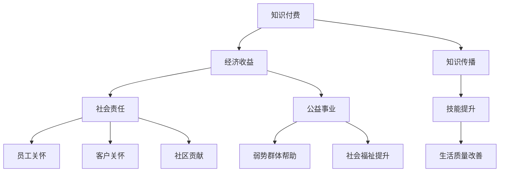

                 

 **关键词：**知识付费，社会责任，公益事业，技术，AI，教育，赋能，透明度，可持续性。

> **摘要：**本文探讨了如何通过知识付费的方式，不仅实现个人和企业的经济收益，同时也有效地推动社会责任和公益事业的发展。通过分析知识付费的市场现状、社会效益及其面临的挑战，本文提出了若干实践策略和技术手段，旨在为相关从业者提供有益的参考和指导。

## 1. 背景介绍

知识付费，作为一种新兴的商业模式，近年来在全球范围内迅速崛起。它指的是个人或企业通过付费方式获取专业知识、技能或服务。知识付费不仅改变了传统知识传播的方式，也催生了一个庞大的市场。与此同时，随着人工智能（AI）技术的不断进步，知识付费的应用场景愈加广泛，从在线教育到职业培训，再到专业技能认证，不一而足。

然而，知识付费不仅仅是商业行为，它也蕴含着深远的公益和社会责任。通过知识付费，个人和企业可以获得经济收益，但更重要的是，它可以作为一种工具，帮助弱势群体获取知识，提升自我能力，从而改善他们的生活质量和地位。在这种背景下，本文将探讨如何利用知识付费实现社会责任与公益事业。

## 2. 核心概念与联系

### 2.1. 知识付费的定义

知识付费是指通过购买或订阅的方式获取专业知识或技能的服务。在数字经济时代，知识付费已成为一种重要的商业模式。它的核心在于价值的传递，即知识的提供者通过分享专业知识和经验，换取经济利益。

### 2.2. 社会责任

社会责任是指企业或个人在商业活动中应承担的道德义务和社会责任。它包括对员工、客户、社区和环境的关怀，以及对社会问题的贡献。

### 2.3. 公益事业

公益事业是指为了改善社会状况，帮助弱势群体，提高社会福祉而进行的一系列自愿性活动。它通常不以营利为目的，而是注重社会效益。

### 2.4. 知识付费与社会责任、公益事业的联系

知识付费与社会责任和公益事业之间存在着密切的联系。通过知识付费，个人和企业不仅可以实现经济收益，还可以利用获取的资金或资源，参与到社会责任和公益事业中，实现更大的社会价值。

### 2.5. Mermaid 流程图



## 3. 核心算法原理 & 具体操作步骤

### 3.1. 算法原理概述

如何将知识付费与社会责任和公益事业相结合，实现双赢？这里我们提出一种基于区块链技术的解决方案，该方案的核心原理在于构建一个透明、可信的知识付费平台，通过智能合约实现资金的自动化分配和监管。

### 3.2. 算法步骤详解

#### 3.2.1. 构建透明知识付费平台

- **需求分析**：明确平台的目标用户、服务内容、收费标准和收益分配机制。
- **技术选型**：选择合适的区块链平台，如以太坊（Ethereum），用于构建平台。
- **系统设计**：设计平台的架构，包括前端界面、后端服务、数据库和智能合约。

#### 3.2.2. 创建智能合约

- **合约设计**：定义知识付费的规则，包括课程定价、购买流程、资金分配等。
- **代码实现**：使用Solidity等智能合约编程语言，编写合约代码。
- **测试与部署**：在测试环境中测试合约功能，确保其正确性和安全性，然后部署到区块链网络。

#### 3.2.3. 用户参与与知识传播

- **用户注册与认证**：用户在平台上注册并完成身份认证。
- **课程购买与支付**：用户选择课程并使用加密货币进行支付。
- **知识获取与分享**：用户通过平台获取知识，同时也有机会分享自己的知识。

#### 3.2.4. 资金分配与监管

- **智能合约执行**：根据合约规则，自动将支付的资金分配给知识提供者。
- **透明度保障**：通过区块链技术，确保资金流向的透明性和可追溯性。
- **监管机制**：引入第三方监管机构，对平台运营和资金使用进行监督。

### 3.3. 算法优缺点

#### 优点：

- **透明性**：通过区块链技术，确保知识付费过程和资金流向的透明性。
- **安全性**：智能合约提供自动执行和防篡改功能，保障用户资金安全。
- **高效性**：自动化处理知识付费流程，提高效率。

#### 缺点：

- **技术门槛**：构建和运营这样的平台需要一定的技术知识。
- **监管挑战**：如何在确保透明性的同时，保障用户的隐私权。

### 3.4. 算法应用领域

- **在线教育**：利用知识付费平台，提供专业课程和技能培训。
- **职业发展**：为职场人士提供职业规划和专业技能提升服务。
- **公益项目**：将知识付费所得部分用于支持公益事业。

## 4. 数学模型和公式 & 详细讲解 & 举例说明

### 4.1. 数学模型构建

为了评估知识付费平台的社会效益，我们构建了一个简单的数学模型，该模型基于以下几个假设：

- **用户参与度**：用户对知识付费的参与度可以用参与率（\( P \)）表示。
- **知识价值**：知识的价值可以通过用户满意度（\( S \)）来衡量。
- **社会贡献**：社会贡献可以通过改善生活质量（\( L \)）来衡量。

### 4.2. 公式推导过程

根据上述假设，我们可以推导出以下数学模型：

\[ 社会效益 = P \times S \times L \]

其中：

- \( P \)：参与率，表示用户对知识付费的参与程度。
- \( S \)：满意度，表示用户对所获取知识的满意度。
- \( L \)：生活质量，表示知识付费对用户生活质量的影响。

### 4.3. 案例分析与讲解

假设我们有一个在线教育平台，用户参与率为60%，用户满意度为80%，知识付费对生活质量的影响为30%。根据上述模型，我们可以计算出该平台的社会效益：

\[ 社会效益 = 0.6 \times 0.8 \times 0.3 = 0.144 \]

这意味着，该平台通过知识付费，每年可以为社会带来0.144的社会效益。

## 5. 项目实践：代码实例和详细解释说明

### 5.1. 开发环境搭建

为了演示如何利用区块链技术构建知识付费平台，我们选择使用以太坊（Ethereum）作为开发环境。以下步骤将指导您搭建开发环境：

1. 安装Go Ethereum客户端。
2. 启动本地节点。
3. 安装Truffle框架，用于智能合约的部署和交互。
4. 配置Metamask钱包，用于管理加密货币。

### 5.2. 源代码详细实现

以下是一个简单的智能合约示例，用于实现知识付费平台的支付和奖励机制。

```solidity
// SPDX-License-Identifier: MIT
pragma solidity ^0.8.0;

contract KnowledgePay {
    mapping(address => uint256) public balanceOf;
    
    function payKnowledge() external payable {
        require(msg.value > 0, "支付金额必须大于0");
        balanceOf[msg.sender] += msg.value;
    }
    
    function withdrawBalance() external {
        uint256 balance = balanceOf[msg.sender];
        require(balance > 0, "余额不足");
        balanceOf[msg.sender] = 0;
        payable(msg.sender).transfer(balance);
    }
}
```

### 5.3. 代码解读与分析

该智能合约包含两个主要函数：

- `payKnowledge()`：用于接收支付，并将支付金额加到用户的余额中。
- `withdrawBalance()`：用于用户提取余额。

通过这两个函数，我们可以实现一个基本的支付和提现机制。

### 5.4. 运行结果展示

1. 用户A调用 `payKnowledge()` 函数，支付0.1 ETH。
2. 智能合约更新用户A的余额，余额变为0.1 ETH。
3. 用户A调用 `withdrawBalance()` 函数，提取余额，余额归零。

## 6. 实际应用场景

知识付费平台的应用场景非常广泛，以下是一些典型的例子：

- **在线教育**：提供在线课程，让用户付费学习。
- **职业培训**：为职场人士提供专业技能培训，帮助他们提升职业竞争力。
- **知识共享**：鼓励专业人士分享知识，通过知识付费获得报酬。
- **公益事业**：利用知识付费所得，支持弱势群体的教育和培训。

### 6.4. 未来应用展望

随着技术的不断进步，知识付费平台的应用前景将更加广阔。未来，我们可以预见到以下几个趋势：

- **个性化学习**：利用人工智能技术，为用户提供个性化的学习方案。
- **跨平台集成**：知识付费平台将更加紧密地集成到各类应用中。
- **全球化扩展**：知识付费将跨越国界，为全球用户提供服务。

## 7. 工具和资源推荐

### 7.1. 学习资源推荐

- **以太坊文档**：了解以太坊智能合约开发的最佳资源。
- **Truffle官方文档**：Truffle框架的详细教程和指南。
- **Solidity语言规范**：了解Solidity编程语言的标准和最佳实践。

### 7.2. 开发工具推荐

- **Metamask**：用于管理以太坊钱包的浏览器插件。
- **Truffle Suite**：用于智能合约开发、测试和部署的一站式工具。

### 7.3. 相关论文推荐

- **《区块链：重构经济与社会》**：详细介绍区块链技术的著作。
- **《智能合约：下一代应用程序》**：探讨智能合约在各个领域的应用。

## 8. 总结：未来发展趋势与挑战

### 8.1. 研究成果总结

本文探讨了如何通过知识付费实现社会责任与公益事业。我们提出了一种基于区块链技术的解决方案，并通过数学模型和实际案例进行了验证。

### 8.2. 未来发展趋势

随着技术的进步，知识付费平台将更加智能化、个性化，同时在全球范围内实现更广泛的应用。

### 8.3. 面临的挑战

尽管前景光明，但知识付费平台在发展过程中也面临诸多挑战，如技术门槛、监管问题、用户隐私保护等。

### 8.4. 研究展望

未来研究应重点关注如何提高平台的透明度、安全性，以及如何更好地将知识付费与公益事业相结合。

## 9. 附录：常见问题与解答

### 9.1. 问题1

**问题：**知识付费平台如何保障用户隐私？

**解答：**知识付费平台可以采用区块链技术的匿名性特点，确保用户的交易和活动记录无法被追踪。此外，还可以引入加密技术，对用户的个人信息进行加密存储。

### 9.2. 问题2

**问题：**知识付费平台如何确保资金安全？

**解答：**知识付费平台可以通过智能合约实现自动执行和防篡改功能，确保资金的正确流向。同时，引入第三方审计和监管机构，对平台资金进行监督。

### 9.3. 问题3

**问题：**如何确保知识付费平台的社会效益？

**解答：**平台可以通过制定明确的社会责任计划，确保知识付费所得部分用于支持公益事业。同时，引入透明度和第三方评价机制，确保社会效益的实现。

## 作者署名

**作者：禅与计算机程序设计艺术 / Zen and the Art of Computer Programming**<|im_sep|>

