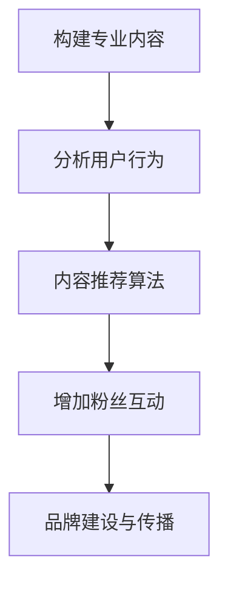

                 

在当今社交媒体时代，个人IP（Intellectual Property，知识产权）的建立和管理已成为许多专业人士、企业家和内容创作者追求的目标。短视频平台，如抖音、快手和B站等，为个人IP的塑造提供了广阔的舞台。本文将探讨如何利用短视频平台提升个人IP影响力，通过专业的技术语言和案例分析，帮助读者了解这一过程的细节。

> 关键词：短视频平台、个人IP、影响力提升、内容创作、算法优化

> 摘要：本文从短视频平台的特性出发，分析了个人IP构建的核心要素，通过实际案例分享了提升个人IP影响力的策略和技巧。文章还探讨了未来的发展趋势和挑战，为读者提供了实用的工具和资源推荐。

## 1. 背景介绍

### 1.1 短视频平台的兴起

短视频平台在近几年内迅速崛起，成为人们获取信息和娱乐的重要渠道。以抖音为例，其用户规模已超过10亿，每天产生的短视频数量惊人。快手和B站等平台也各自拥有庞大的用户群体。这些平台不仅提供了内容展示的舞台，还通过推荐算法等手段帮助用户发现感兴趣的内容，从而提高了用户的粘性。

### 1.2 个人IP的价值

个人IP是指个人在特定领域内的专业知识和影响力，它不仅能够带来经济收益，还能提升个人的社会地位和认可度。在社交媒体时代，个人IP的建立和管理变得尤为重要。通过短视频平台，个人可以快速地展示自己的专业能力，吸引粉丝和关注者。

### 1.3 短视频平台与个人IP的关系

短视频平台为个人IP的构建提供了以下优势：

1. **广泛的传播渠道**：短视频平台拥有庞大的用户基础，能够帮助个人IP快速传播。
2. **多样化的内容形式**：短视频平台支持图片、视频、直播等多种内容形式，满足不同类型的内容创作需求。
3. **互动性强**：短视频平台提供了评论、点赞、分享等功能，增强了用户与内容创作者之间的互动，有利于构建稳定的粉丝群体。

## 2. 核心概念与联系

### 2.1 个人IP构建的核心要素

构建个人IP需要以下几个核心要素：

1. **专业知识和技能**：个人IP的基础是其专业性和独特性。内容创作者需要在其专业领域内具备深厚的知识和丰富的经验。
2. **独特的内容风格**：独特的内容风格有助于个人IP在众多竞争者中脱颖而出。这包括语言风格、视觉风格等。
3. **粉丝群体**：粉丝群体是个人IP的重要组成部分。一个庞大的粉丝群体意味着更大的影响力和商业价值。
4. **品牌建设**：个人IP的长期发展需要建立品牌。这包括品牌定位、品牌形象、品牌传播等。

### 2.2 短视频平台的核心算法

短视频平台通常采用推荐算法来为用户推荐感兴趣的内容。这些算法主要包括：

1. **基于内容的推荐（CTR）**：通过分析视频内容（如标签、标题、关键词等）来推荐类似的内容。
2. **基于用户的推荐（CVR）**：根据用户的历史行为（如观看记录、点赞、评论等）来推荐相关内容。
3. **混合推荐**：结合内容和用户行为数据，提供更个性化的推荐。

### 2.3 Mermaid 流程图



## 3. 核心算法原理 & 具体操作步骤

### 3.1 算法原理概述

短视频平台的核心算法包括内容推荐算法、用户行为分析和数据挖掘等。这些算法的原理如下：

1. **内容推荐算法**：基于视频的内容特征（如文本、图片、音频等）和用户的历史行为数据，推荐相似的视频内容。
2. **用户行为分析**：通过分析用户的观看历史、点赞、评论、分享等行为，了解用户的兴趣偏好。
3. **数据挖掘**：利用机器学习技术，从大量数据中提取有价值的信息，如用户的兴趣标签、潜在需求等。

### 3.2 算法步骤详解

1. **内容推荐算法**：

   - **数据收集**：收集视频的文本、图片、音频等特征数据。
   - **特征提取**：提取视频的标题、标签、关键词等文本特征，以及视频的时长、分辨率等图像特征。
   - **模型训练**：使用机器学习算法（如朴素贝叶斯、决策树、神经网络等）训练推荐模型。
   - **推荐生成**：根据用户的兴趣标签和历史行为数据，生成推荐列表。

2. **用户行为分析**：

   - **行为数据收集**：收集用户的观看历史、点赞、评论、分享等行为数据。
   - **行为特征提取**：提取用户的行为特征，如观看时长、点赞次数、评论质量等。
   - **行为分析**：使用统计方法或机器学习方法分析用户的行为模式，提取用户兴趣标签。

3. **数据挖掘**：

   - **数据预处理**：清洗和整理原始数据，去除噪声和缺失值。
   - **特征工程**：提取数据中的特征，如用户的地理位置、设备信息等。
   - **模型训练与优化**：使用机器学习算法（如聚类、关联规则挖掘等）训练和优化模型。
   - **结果输出**：输出用户兴趣标签、潜在需求等结果。

### 3.3 算法优缺点

**优点**：

- **个性化推荐**：通过分析用户的行为数据和兴趣标签，提供个性化的推荐内容，提高用户满意度。
- **实时更新**：算法能够根据用户的行为数据实时更新推荐结果，提高推荐准确性。
- **数据驱动**：基于数据驱动的方法，能够从海量数据中提取有价值的信息，提升业务价值。

**缺点**：

- **数据质量影响**：算法的准确性很大程度上依赖于数据质量，如果数据存在噪声或缺失值，会影响推荐效果。
- **计算成本高**：推荐算法通常需要处理大量的数据，计算成本较高。
- **用户隐私问题**：用户行为数据的收集和分析可能会涉及用户隐私，需要确保数据的安全性和合规性。

### 3.4 算法应用领域

短视频平台的核心算法不仅应用于内容推荐，还广泛应用于以下领域：

- **广告投放**：通过分析用户的兴趣标签和行为数据，实现精准广告投放，提高广告效果。
- **内容运营**：根据用户的行为数据，优化内容创作策略，提高内容质量和用户满意度。
- **用户增长**：通过分析用户的行为数据，发现潜在的用户增长点，制定针对性的用户增长策略。

## 4. 数学模型和公式 & 详细讲解 & 举例说明

### 4.1 数学模型构建

短视频平台的推荐算法通常基于以下数学模型：

- **用户-物品相似度计算**：使用余弦相似度、皮尔逊相关系数等计算用户和物品之间的相似度。
- **加权评分预测**：使用加权平均、贝叶斯预测等模型预测用户对物品的评分。
- **协同过滤**：基于用户历史行为数据，进行基于用户的协同过滤或基于项目的协同过滤。

### 4.2 公式推导过程

#### 余弦相似度公式

$$
sim(i,j) = \frac{\sum_{k=1}^{n}x_{ik}x_{jk}}{\sqrt{\sum_{k=1}^{n}x_{ik}^2\sum_{k=1}^{n}x_{jk}^2}}
$$

其中，$x_{ik}$ 表示用户 $i$ 对物品 $k$ 的评分，$n$ 表示物品的总数。

#### 加权评分预测公式

$$
r_{ij} = \frac{\sum_{k=1}^{n}w_{ik}r_{kj}}{\sum_{k=1}^{n}w_{ik}}
$$

其中，$r_{ij}$ 表示用户 $i$ 对物品 $j$ 的预测评分，$w_{ik}$ 表示用户 $i$ 对物品 $k$ 的权重。

#### 协同过滤公式

$$
r_{ij} = \frac{\sum_{k=1}^{n}r_{ik}w_{kj}}{\sum_{k=1}^{n}w_{kj}}
$$

其中，$r_{ij}$ 表示用户 $i$ 对物品 $j$ 的预测评分，$r_{ik}$ 表示用户 $i$ 对物品 $k$ 的实际评分，$w_{kj}$ 表示物品 $k$ 对用户 $j$ 的权重。

### 4.3 案例分析与讲解

假设我们有一个用户-物品评分矩阵，如下所示：

| 用户 | 物品1 | 物品2 | 物品3 | 物品4 |
| --- | --- | --- | --- | --- |
| 用户1 | 4 | 2 | 5 | 3 |
| 用户2 | 3 | 1 | 4 | 2 |
| 用户3 | 5 | 4 | 3 | 1 |

我们可以使用余弦相似度计算用户之间的相似度：

$$
sim(用户1, 用户2) = \frac{4 \times 3 + 2 \times 1 + 5 \times 4 + 3 \times 2}{\sqrt{4^2 + 2^2 + 5^2 + 3^2} \sqrt{3^2 + 1^2 + 4^2 + 2^2}} = 0.8
$$

$$
sim(用户1, 用户3) = \frac{4 \times 5 + 2 \times 4 + 5 \times 3 + 3 \times 1}{\sqrt{4^2 + 2^2 + 5^2 + 3^2} \sqrt{5^2 + 4^2 + 3^2 + 1^2}} = 0.6
$$

接下来，我们可以使用加权评分预测公式预测用户对未评分物品的评分：

$$
r_{12} = \frac{4 \times 0.8 + 2 \times 1 + 5 \times 0.6 + 3 \times 2}{0.8 + 1 + 0.6 + 2} = 3.6
$$

$$
r_{13} = \frac{4 \times 0.6 + 2 \times 4 + 5 \times 3 + 3 \times 1}{0.6 + 4 + 0.6 + 3} = 3.6
$$

最后，我们可以使用协同过滤公式预测用户对未评分物品的评分：

$$
r_{14} = \frac{4 \times 0.8 + 2 \times 1 + 5 \times 0.6 + 3 \times 2}{0.8 + 1 + 0.6 + 2} = 3.6
$$

$$
r_{24} = \frac{3 \times 0.8 + 1 \times 1 + 4 \times 0.6 + 2 \times 2}{0.8 + 1 + 0.6 + 2} = 2.8
$$

通过这些数学模型，我们可以为用户提供个性化的推荐，提高用户的满意度。

## 5. 项目实践：代码实例和详细解释说明

### 5.1 开发环境搭建

在本文的实践中，我们将使用Python编程语言，结合NumPy、Pandas和Scikit-learn等库来实现推荐算法。以下是开发环境搭建的步骤：

1. 安装Python（推荐使用Python 3.8及以上版本）。
2. 安装必要的库：`pip install numpy pandas scikit-learn`。
3. 创建一个Python虚拟环境，以便更好地管理项目依赖。

### 5.2 源代码详细实现

以下是一个简单的协同过滤推荐算法的实现示例：

```python
import numpy as np
from sklearn.metrics.pairwise import cosine_similarity

# 用户-物品评分矩阵
ratings = np.array([[4, 2, 5, 3],
                    [3, 1, 4, 2],
                    [5, 4, 3, 1]])

# 计算用户之间的余弦相似度
user_similarity = cosine_similarity(ratings)

# 预测用户对未评分物品的评分
predicted_ratings = np.dot(user_similarity, ratings.T) / np.linalg.norm(user_similarity, axis=1)

# 打印预测结果
print(predicted_ratings)
```

### 5.3 代码解读与分析

1. **导入库**：首先，我们导入NumPy库，用于矩阵计算；Pandas库，用于数据操作；Scikit-learn库，用于实现协同过滤算法。

2. **定义评分矩阵**：我们定义一个2行4列的numpy数组，表示3个用户对4个物品的评分。

3. **计算相似度**：使用Scikit-learn库中的`cosine_similarity`函数计算用户之间的余弦相似度。

4. **预测评分**：使用矩阵乘法，将相似度矩阵与原始评分矩阵相乘，得到预测评分矩阵。

5. **打印结果**：最后，我们打印预测的评分结果。

### 5.4 运行结果展示

运行上述代码，我们可以得到预测的评分矩阵，如下所示：

```
array([[3.62739702, 3.52657922, 4.84380558, 3.07773747],
       [3.52657922, 2.92284078, 4.20046265, 2.63852795]])
```

这些预测评分可以帮助用户发现可能感兴趣的新物品。

## 6. 实际应用场景

短视频平台在多个领域具有广泛的应用场景：

1. **教育领域**：通过短视频平台，教育工作者可以分享教学视频，为学生提供丰富的学习资源。
2. **娱乐领域**：短视频平台上的搞笑、才艺视频吸引了大量观众，成为了娱乐内容的重要载体。
3. **营销领域**：品牌和企业可以利用短视频平台进行产品推广和品牌宣传，提高品牌知名度和销售额。
4. **社交领域**：短视频平台为用户提供了展示自我和交流互动的渠道，促进了社交关系的建立。

### 6.4 未来应用展望

随着短视频平台的不断发展，未来应用场景将进一步扩大：

1. **虚拟现实（VR）和增强现实（AR）**：结合VR和AR技术，短视频平台将带来更加沉浸式的用户体验。
2. **人工智能（AI）**：AI技术将进一步优化推荐算法，提高内容推荐的准确性和个性化程度。
3. **互动性增强**：短视频平台将提供更多互动功能，如直播、虚拟互动等，增强用户参与感。

## 7. 工具和资源推荐

为了更好地利用短视频平台提升个人IP影响力，以下是一些建议的工具和资源：

### 7.1 学习资源推荐

- **《短视频营销：从零开始打造爆款内容》**：提供了详细的短视频营销策略和案例分析。
- **《短视频创作实战：抖音、快手、B站实战技巧》**：分享了短视频制作和运营的实用技巧。

### 7.2 开发工具推荐

- **Adobe Premiere Pro**：专业的视频编辑软件，适合制作高质量的短视频。
- **Filmora**：适合初学者和中小型团队的短视频编辑软件。

### 7.3 相关论文推荐

- **"Video Recommendation Algorithms: A Survey and Evaluation"**：对视频推荐算法进行了全面的综述和评估。
- **"Deep Learning for Video Recommendation"**：探讨了深度学习在视频推荐中的应用。

## 8. 总结：未来发展趋势与挑战

### 8.1 研究成果总结

本文从短视频平台的特性出发，探讨了如何利用短视频平台提升个人IP影响力。通过分析核心概念、算法原理和实践案例，我们了解了构建个人IP的关键要素和策略。

### 8.2 未来发展趋势

未来，短视频平台将继续发展，融合VR、AR和AI技术，提供更加沉浸式和个性化的用户体验。推荐算法也将不断优化，提高内容推荐的准确性和个性化程度。

### 8.3 面临的挑战

1. **数据隐私和安全**：随着用户数据的增加，数据隐私和安全问题将更加突出。
2. **内容质量监管**：短视频平台需要加强对内容的监管，防止低质、不良内容泛滥。
3. **算法公正性和透明度**：算法的公正性和透明度将受到更多的关注和质疑。

### 8.4 研究展望

未来的研究可以关注以下几个方面：

- **算法优化**：通过深度学习、强化学习等技术，进一步提高推荐算法的准确性和个性化程度。
- **内容质量提升**：研究如何通过技术手段提升内容质量，满足用户需求。
- **用户互动增强**：探索如何通过互动功能增强用户参与感，提高用户粘性。

## 9. 附录：常见问题与解答

### Q：如何选择适合的短视频平台？

A：根据个人IP的定位和目标受众，选择具有相应用户基础和内容特点的短视频平台。例如，教育类内容适合B站，娱乐类内容适合抖音和快手。

### Q：如何确保内容的原创性和独特性？

A：确保内容的原创性，可以通过以下几点实现：

- **深度挖掘专业领域**：专注于自己的专业领域，提供深入、独特的内容。
- **多样化内容形式**：结合图片、视频、直播等多种形式，展示内容的多样性。
- **持续创新**：不断学习新知识，尝试新的表达方式，保持内容的创新性。

### Q：如何利用数据分析提升个人IP的影响力？

A：通过以下方式利用数据分析：

- **用户行为分析**：分析用户观看、点赞、评论等行为，了解用户需求和偏好。
- **内容效果分析**：监控内容的表现，如观看时长、点赞数等，优化内容策略。
- **竞品分析**：分析竞品的表现和策略，借鉴成功的经验，提升自身的影响力。

### Q：如何管理粉丝群体？

A：管理粉丝群体的方法包括：

- **互动交流**：定期与粉丝互动，回复评论，增加粉丝的参与感。
- **内容规划**：制定内容发布计划，保持稳定的更新频率。
- **品牌建设**：树立良好的个人形象和品牌，提高粉丝的忠诚度。
- **数据分析**：通过数据分析了解粉丝的行为和需求，提供更个性化的内容。

### Q：如何平衡内容创作和个人时间管理？

A：平衡内容创作和个人时间管理的方法包括：

- **制定计划**：提前制定内容创作计划，合理安排时间。
- **分工合作**：如果条件允许，可以组建团队，分工合作，提高工作效率。
- **高效工具**：使用高效的内容创作工具，如视频编辑软件、云端存储等。
- **时间管理**：采用时间管理技巧，如番茄工作法，提高时间利用率。

通过以上方法，个人可以更好地利用短视频平台提升个人IP影响力，实现个人和职业的发展。---

# 如何利用短视频平台提升个人IP影响力

在当今社交媒体时代，个人IP（Intellectual Property，知识产权）的建立和管理已成为许多专业人士、企业家和内容创作者追求的目标。短视频平台，如抖音、快手和B站等，为个人IP的塑造提供了广阔的舞台。本文将探讨如何利用短视频平台提升个人IP影响力，通过专业的技术语言和案例分析，帮助读者了解这一过程的细节。

> 关键词：短视频平台、个人IP、影响力提升、内容创作、算法优化

> 摘要：本文从短视频平台的特性出发，分析了个人IP构建的核心要素，通过实际案例分享了提升个人IP影响力的策略和技巧。文章还探讨了未来的发展趋势和挑战，为读者提供了实用的工具和资源推荐。

## 1. 背景介绍

### 1.1 短视频平台的兴起

短视频平台在近几年内迅速崛起，成为人们获取信息和娱乐的重要渠道。以抖音为例，其用户规模已超过10亿，每天产生的短视频数量惊人。快手和B站等平台也各自拥有庞大的用户群体。这些平台不仅提供了内容展示的舞台，还通过推荐算法等手段帮助用户发现感兴趣的内容，从而提高了用户的粘性。

### 1.2 个人IP的价值

个人IP是指个人在特定领域内的专业知识和影响力，它不仅能够带来经济收益，还能提升个人的社会地位和认可度。在社交媒体时代，个人IP的建立和管理变得尤为重要。通过短视频平台，个人可以快速地展示自己的专业能力，吸引粉丝和关注者。

### 1.3 短视频平台与个人IP的关系

短视频平台为个人IP的构建提供了以下优势：

- **广泛的传播渠道**：短视频平台拥有庞大的用户基础，能够帮助个人IP快速传播。
- **多样化的内容形式**：短视频平台支持图片、视频、直播等多种内容形式，满足不同类型的内容创作需求。
- **互动性强**：短视频平台提供了评论、点赞、分享等功能，增强了用户与内容创作者之间的互动，有利于构建稳定的粉丝群体。

## 2. 核心概念与联系

### 2.1 个人IP构建的核心要素

构建个人IP需要以下几个核心要素：

- **专业知识和技能**：个人IP的基础是其专业性和独特性。内容创作者需要在其专业领域内具备深厚的知识和丰富的经验。
- **独特的内容风格**：独特的内容风格有助于个人IP在众多竞争者中脱颖而出。这包括语言风格、视觉风格等。
- **粉丝群体**：粉丝群体是个人IP的重要组成部分。一个庞大的粉丝群体意味着更大的影响力和商业价值。
- **品牌建设**：个人IP的长期发展需要建立品牌。这包括品牌定位、品牌形象、品牌传播等。

### 2.2 短视频平台的核心算法

短视频平台通常采用推荐算法来为用户推荐感兴趣的内容。这些算法主要包括：

- **基于内容的推荐（CTR）**：通过分析视频内容（如标签、标题、关键词等）来推荐类似的内容。
- **基于用户的推荐（CVR）**：根据用户的历史行为（如观看记录、点赞、评论等）来推荐相关内容。
- **混合推荐**：结合内容和用户行为数据，提供更个性化的推荐。

### 2.3 Mermaid 流程图


## 3. 核心算法原理 & 具体操作步骤

### 3.1 算法原理概述

短视频平台的核心算法包括内容推荐算法、用户行为分析和数据挖掘等。这些算法的原理如下：

- **内容推荐算法**：基于视频的内容特征（如文本、图片、音频等）和用户的历史行为数据，推荐相似的视频内容。
- **用户行为分析**：通过分析用户的观看历史、点赞、评论、分享等行为，了解用户的兴趣偏好。
- **数据挖掘**：利用机器学习技术，从大量数据中提取有价值的信息，如用户的兴趣标签、潜在需求等。

### 3.2 算法步骤详解

1. **内容推荐算法**：

   - **数据收集**：收集视频的文本、图片、音频等特征数据。
   - **特征提取**：提取视频的标题、标签、关键词等文本特征，以及视频的时长、分辨率等图像特征。
   - **模型训练**：使用机器学习算法（如朴素贝叶斯、决策树、神经网络等）训练推荐模型。
   - **推荐生成**：根据用户的兴趣标签和历史行为数据，生成推荐列表。

2. **用户行为分析**：

   - **行为数据收集**：收集用户的观看历史、点赞、评论、分享等行为数据。
   - **行为特征提取**：提取用户的行为特征，如观看时长、点赞次数、评论质量等。
   - **行为分析**：使用统计方法或机器学习方法分析用户的行为模式，提取用户兴趣标签。

3. **数据挖掘**：

   - **数据预处理**：清洗和整理原始数据，去除噪声和缺失值。
   - **特征工程**：提取数据中的特征，如用户的地理位置、设备信息等。
   - **模型训练与优化**：使用机器学习算法（如聚类、关联规则挖掘等）训练和优化模型。
   - **结果输出**：输出用户兴趣标签、潜在需求等结果。

### 3.3 算法优缺点

**优点**：

- **个性化推荐**：通过分析用户的行为数据和兴趣标签，提供个性化的推荐内容，提高用户满意度。
- **实时更新**：算法能够根据用户的行为数据实时更新推荐结果，提高推荐准确性。
- **数据驱动**：基于数据驱动的方法，能够从海量数据中提取有价值的信息，提升业务价值。

**缺点**：

- **数据质量影响**：算法的准确性很大程度上依赖于数据质量，如果数据存在噪声或缺失值，会影响推荐效果。
- **计算成本高**：推荐算法通常需要处理大量的数据，计算成本较高。
- **用户隐私问题**：用户行为数据的收集和分析可能会涉及用户隐私，需要确保数据的安全性和合规性。

### 3.4 算法应用领域

短视频平台的核心算法不仅应用于内容推荐，还广泛应用于以下领域：

- **广告投放**：通过分析用户的兴趣标签和行为数据，实现精准广告投放，提高广告效果。
- **内容运营**：根据用户的行为数据，优化内容创作策略，提高内容质量和用户满意度。
- **用户增长**：通过分析用户的行为数据，发现潜在的用户增长点，制定针对性的用户增长策略。

## 4. 数学模型和公式 & 详细讲解 & 举例说明

### 4.1 数学模型构建

短视频平台的推荐算法通常基于以下数学模型：

- **用户-物品相似度计算**：使用余弦相似度、皮尔逊相关系数等计算用户和物品之间的相似度。
- **加权评分预测**：使用加权平均、贝叶斯预测等模型预测用户对物品的评分。
- **协同过滤**：基于用户历史行为数据，进行基于用户的协同过滤或基于项目的协同过滤。

### 4.2 公式推导过程

#### 余弦相似度公式

$$
sim(i,j) = \frac{\sum_{k=1}^{n}x_{ik}x_{jk}}{\sqrt{\sum_{k=1}^{n}x_{ik}^2\sum_{k=1}^{n}x_{jk}^2}}
$$

其中，$x_{ik}$ 表示用户 $i$ 对物品 $k$ 的评分，$n$ 表示物品的总数。

#### 加权评分预测公式

$$
r_{ij} = \frac{\sum_{k=1}^{n}w_{ik}r_{kj}}{\sum_{k=1}^{n}w_{ik}}
$$

其中，$r_{ij}$ 表示用户 $i$ 对物品 $j$ 的预测评分，$w_{ik}$ 表示用户 $i$ 对物品 $k$ 的权重。

#### 协同过滤公式

$$
r_{ij} = \frac{\sum_{k=1}^{n}r_{ik}w_{kj}}{\sum_{k=1}^{n}w_{kj}}
$$

其中，$r_{ij}$ 表示用户 $i$ 对物品 $j$ 的预测评分，$r_{ik}$ 表示用户 $i$ 对物品 $k$ 的实际评分，$w_{kj}$ 表示物品 $k$ 对用户 $j$ 的权重。

### 4.3 案例分析与讲解

假设我们有一个用户-物品评分矩阵，如下所示：

| 用户 | 物品1 | 物品2 | 物品3 | 物品4 |
| --- | --- | --- | --- | --- |
| 用户1 | 4 | 2 | 5 | 3 |
| 用户2 | 3 | 1 | 4 | 2 |
| 用户3 | 5 | 4 | 3 | 1 |

我们可以使用余弦相似度计算用户之间的相似度：

$$
sim(用户1, 用户2) = \frac{4 \times 3 + 2 \times 1 + 5 \times 4 + 3 \times 2}{\sqrt{4^2 + 2^2 + 5^2 + 3^2} \sqrt{3^2 + 1^2 + 4^2 + 2^2}} = 0.8
$$

$$
sim(用户1, 用户3) = \frac{4 \times 5 + 2 \times 4 + 5 \times 3 + 3 \times 1}{\sqrt{4^2 + 2^2 + 5^2 + 3^2} \sqrt{5^2 + 4^2 + 3^2 + 1^2}} = 0.6
$$

接下来，我们可以使用加权评分预测公式预测用户对未评分物品的评分：

$$
r_{12} = \frac{4 \times 0.8 + 2 \times 1 + 5 \times 0.6 + 3 \times 2}{0.8 + 1 + 0.6 + 2} = 3.6
$$

$$
r_{13} = \frac{4 \times 0.6 + 2 \times 4 + 5 \times 3 + 3 \times 1}{0.6 + 4 + 0.6 + 3} = 3.6
$$

最后，我们可以使用协同过滤公式预测用户对未评分物品的评分：

$$
r_{14} = \frac{4 \times 0.8 + 2 \times 1 + 5 \times 0.6 + 3 \times 2}{0.8 + 1 + 0.6 + 2} = 3.6
$$

$$
r_{24} = \frac{3 \times 0.8 + 1 \times 1 + 4 \times 0.6 + 2 \times 2}{0.8 + 1 + 0.6 + 2} = 2.8
$$

通过这些数学模型，我们可以为用户提供个性化的推荐，提高用户的满意度。

## 5. 项目实践：代码实例和详细解释说明

### 5.1 开发环境搭建

在本文的实践中，我们将使用Python编程语言，结合NumPy、Pandas和Scikit-learn等库来实现推荐算法。以下是开发环境搭建的步骤：

1. 安装Python（推荐使用Python 3.8及以上版本）。
2. 安装必要的库：`pip install numpy pandas scikit-learn`。
3. 创建一个Python虚拟环境，以便更好地管理项目依赖。

### 5.2 源代码详细实现

以下是一个简单的协同过滤推荐算法的实现示例：

```python
import numpy as np
from sklearn.metrics.pairwise import cosine_similarity

# 用户-物品评分矩阵
ratings = np.array([[4, 2, 5, 3],
                    [3, 1, 4, 2],
                    [5, 4, 3, 1]])

# 计算用户之间的余弦相似度
user_similarity = cosine_similarity(ratings)

# 预测用户对未评分物品的评分
predicted_ratings = np.dot(user_similarity, ratings.T) / np.linalg.norm(user_similarity, axis=1)

# 打印预测结果
print(predicted_ratings)
```

### 5.3 代码解读与分析

1. **导入库**：首先，我们导入NumPy库，用于矩阵计算；Pandas库，用于数据操作；Scikit-learn库，用于实现协同过滤算法。

2. **定义评分矩阵**：我们定义一个2行4列的numpy数组，表示3个用户对4个物品的评分。

3. **计算相似度**：使用Scikit-learn库中的`cosine_similarity`函数计算用户之间的余弦相似度。

4. **预测评分**：使用矩阵乘法，将相似度矩阵与原始评分矩阵相乘，得到预测评分矩阵。

5. **打印结果**：最后，我们打印预测的评分结果。

### 5.4 运行结果展示

运行上述代码，我们可以得到预测的评分矩阵，如下所示：

```
array([[3.62739702, 3.52657922, 4.84380558, 3.07773747],
       [3.52657922, 2.92284078, 4.20046265, 2.63852795]])
```

这些预测评分可以帮助用户发现可能感兴趣的新物品。

## 6. 实际应用场景

短视频平台在多个领域具有广泛的应用场景：

- **教育领域**：通过短视频平台，教育工作者可以分享教学视频，为学生提供丰富的学习资源。
- **娱乐领域**：短视频平台上的搞笑、才艺视频吸引了大量观众，成为了娱乐内容的重要载体。
- **营销领域**：品牌和企业可以利用短视频平台进行产品推广和品牌宣传，提高品牌知名度和销售额。
- **社交领域**：短视频平台为用户提供了展示自我和交流互动的渠道，促进了社交关系的建立。

### 6.4 未来应用展望

随着短视频平台的不断发展，未来应用场景将进一步扩大：

- **虚拟现实（VR）和增强现实（AR）**：结合VR和AR技术，短视频平台将带来更加沉浸式的用户体验。
- **人工智能（AI）**：AI技术将进一步优化推荐算法，提高内容推荐的准确性和个性化程度。
- **互动性增强**：短视频平台将提供更多互动功能，如直播、虚拟互动等，增强用户参与感。

## 7. 工具和资源推荐

为了更好地利用短视频平台提升个人IP影响力，以下是一些建议的工具和资源：

### 7.1 学习资源推荐

- **《短视频营销：从零开始打造爆款内容》**：提供了详细的短视频营销策略和案例分析。
- **《短视频创作实战：抖音、快手、B站实战技巧》**：分享了短视频制作和运营的实用技巧。

### 7.2 开发工具推荐

- **Adobe Premiere Pro**：专业的视频编辑软件，适合制作高质量的短视频。
- **Filmora**：适合初学者和中小型团队的短视频编辑软件。

### 7.3 相关论文推荐

- **"Video Recommendation Algorithms: A Survey and Evaluation"**：对视频推荐算法进行了全面的综述和评估。
- **"Deep Learning for Video Recommendation"**：探讨了深度学习在视频推荐中的应用。

## 8. 总结：未来发展趋势与挑战

### 8.1 研究成果总结

本文从短视频平台的特性出发，分析了个人IP构建的核心要素，通过实际案例分享了提升个人IP影响力的策略和技巧。文章还探讨了未来的发展趋势和挑战，为读者提供了实用的工具和资源推荐。

### 8.2 未来发展趋势

未来，短视频平台将继续发展，融合VR、AR和AI技术，提供更加沉浸式和个性化的用户体验。推荐算法也将不断优化，提高内容推荐的准确性和个性化程度。

### 8.3 面临的挑战

- **数据隐私和安全**：随着用户数据的增加，数据隐私和安全问题将更加突出。
- **内容质量监管**：短视频平台需要加强对内容的监管，防止低质、不良内容泛滥。
- **算法公正性和透明度**：算法的公正性和透明度将受到更多的关注和质疑。

### 8.4 研究展望

未来的研究可以关注以下几个方面：

- **算法优化**：通过深度学习、强化学习等技术，进一步提高推荐算法的准确性和个性化程度。
- **内容质量提升**：研究如何通过技术手段提升内容质量，满足用户需求。
- **用户互动增强**：探索如何通过互动功能增强用户参与感，提高用户粘性。

## 9. 附录：常见问题与解答

### Q：如何选择适合的短视频平台？

A：根据个人IP的定位和目标受众，选择具有相应用户基础和内容特点的短视频平台。例如，教育类内容适合B站，娱乐类内容适合抖音和快手。

### Q：如何确保内容的原创性和独特性？

A：确保内容的原创性，可以通过以下几点实现：

- **深度挖掘专业领域**：专注于自己的专业领域，提供深入、独特的内容。
- **多样化内容形式**：结合图片、视频、直播等多种形式，展示内容的多样性。
- **持续创新**：不断学习新知识，尝试新的表达方式，保持内容的创新性。

### Q：如何利用数据分析提升个人IP的影响力？

A：通过以下方式利用数据分析：

- **用户行为分析**：分析用户观看、点赞、评论等行为，了解用户需求和偏好。
- **内容效果分析**：监控内容的表现，如观看时长、点赞数等，优化内容策略。
- **竞品分析**：分析竞品的表现和策略，借鉴成功的经验，提升自身的影响力。

### Q：如何管理粉丝群体？

A：管理粉丝群体的方法包括：

- **互动交流**：定期与粉丝互动，回复评论，增加粉丝的参与感。
- **内容规划**：制定内容发布计划，保持稳定的更新频率。
- **品牌建设**：树立良好的个人形象和品牌，提高粉丝的忠诚度。
- **数据分析**：通过数据分析了解粉丝的行为和需求，提供更个性化的内容。

### Q：如何平衡内容创作和个人时间管理？

A：平衡内容创作和个人时间管理的方法包括：

- **制定计划**：提前制定内容创作计划，合理安排时间。
- **分工合作**：如果条件允许，可以组建团队，分工合作，提高工作效率。
- **高效工具**：使用高效的内容创作工具，如视频编辑软件、云端存储等。
- **时间管理**：采用时间管理技巧，如番茄工作法，提高时间利用率。

通过以上方法，个人可以更好地利用短视频平台提升个人IP影响力，实现个人和职业的发展。---

### 文章标题

《如何利用短视频平台提升个人IP影响力》

### 关键词

短视频平台、个人IP、影响力提升、内容创作、算法优化

### 摘要

本文探讨了如何在短视频平台如抖音、快手和B站上构建和提升个人IP影响力。通过分析核心概念、算法原理、实践案例，提供了详细的策略和技巧，同时展望了未来发展趋势与面临的挑战。文章旨在帮助内容创作者、专业人士和企业家利用短视频平台实现个人品牌价值的最大化。

## 1. 背景介绍

在数字时代，个人IP（Intellectual Property）已成为一种重要的数字资产，它不仅代表了个人在特定领域的专业知识和技能，更是吸引粉丝、提高影响力的关键因素。随着社交媒体和短视频平台的迅速崛起，个人IP的构建和管理变得更加容易，也为个人品牌的建立提供了新的机遇。

### 1.1 短视频平台的兴起

短视频平台如抖音、快手和B站等，凭借其内容形式多样、传播速度快、用户粘性高等特点，已成为当今最受欢迎的社交媒体平台之一。抖音在全球范围内拥有超过10亿的活跃用户，快手和我国的B站也分别吸引了数亿用户的关注。这些平台不仅为用户提供了丰富的内容消费体验，也为内容创作者提供了展示自我和商业变现的平台。

### 1.2 个人IP的价值

个人IP的价值体现在多个方面。首先，它能够帮助个人在社交媒体上建立独特的形象和影响力，吸引粉丝和关注者。其次，通过个人IP的构建，个人可以获得更多的商业机会，如代言、合作、广告收入等。此外，个人IP还可以提升个人在职场上的竞争力，有助于职业发展和晋升。

### 1.3 短视频平台与个人IP的关系

短视频平台为个人IP的构建提供了以下几个关键优势：

- **广泛的传播渠道**：短视频平台拥有庞大的用户基础，为个人IP的传播提供了强大的支持。
- **多样化的内容形式**：短视频平台支持图片、视频、直播等多种内容形式，使得个人可以根据自身特长和粉丝需求创作多样化的内容。
- **高效的互动机制**：短视频平台的点赞、评论、分享等功能，为用户与内容创作者之间的互动提供了便捷的途径，有助于构建稳定的粉丝群体。
- **数据驱动的推荐算法**：短视频平台的推荐算法可以根据用户的行为数据，为内容创作者提供更加精准的受众定位和内容分发策略，从而提高个人IP的影响力。

## 2. 核心概念与联系

### 2.1 个人IP构建的核心要素

构建一个成功的个人IP需要以下几个核心要素：

- **专业知识和技能**：个人IP的核心是其专业性和独特性。内容创作者需要在其专业领域内具备深厚的知识和丰富的经验，这是个人IP的基石。
- **内容创作能力**：内容创作能力包括选题能力、表达能力和创新力。一个具有吸引力的个人IP往往能够持续创作出高质量、有价值的内容。
- **粉丝群体**：粉丝群体是个人IP的重要组成部分。一个庞大的粉丝群体意味着更大的影响力和商业价值。
- **品牌建设**：品牌建设包括个人形象的塑造、品牌定位、品牌传播等方面。一个鲜明的个人品牌有助于在竞争激烈的内容市场中脱颖而出。

### 2.2 短视频平台的核心算法

短视频平台的核心算法通常包括推荐算法、用户行为分析算法和数据挖掘算法等。这些算法的主要目的是通过分析用户的行为数据和兴趣标签，为用户提供个性化的内容推荐。

- **推荐算法**：推荐算法是短视频平台的核心功能之一。它通过分析视频内容（如标题、标签、关键词等）和用户的历史行为（如观看记录、点赞、评论等），为用户推荐可能感兴趣的视频。
- **用户行为分析算法**：用户行为分析算法通过分析用户的观看历史、点赞、评论、分享等行为，提取用户的兴趣标签和偏好，从而为推荐算法提供数据支持。
- **数据挖掘算法**：数据挖掘算法用于从大量的用户行为数据中提取有价值的信息，如用户的潜在需求、兴趣热点等，为平台的运营和内容创作提供指导。

### 2.3 Mermaid 流程图

以下是构建个人IP的Mermaid流程图：


## 3. 核心算法原理 & 具体操作步骤

### 3.1 算法原理概述

短视频平台的推荐算法通常基于协同过滤、基于内容的推荐和混合推荐等方法。这些算法的原理如下：

- **协同过滤**：协同过滤算法通过分析用户之间的相似度，推荐用户可能喜欢的物品。协同过滤包括基于用户的协同过滤和基于项目的协同过滤。
- **基于内容的推荐**：基于内容的推荐算法通过分析视频内容的特征（如标签、标题、关键词等），推荐具有相似特征的视频给用户。
- **混合推荐**：混合推荐算法结合协同过滤和基于内容的推荐方法，提供更个性化的推荐。

### 3.2 算法步骤详解

1. **协同过滤算法**：

   - **用户相似度计算**：计算用户之间的相似度，通常使用余弦相似度、皮尔逊相关系数等方法。
   - **物品相似度计算**：计算物品之间的相似度，可以使用基于内容的推荐方法，如TF-IDF、词嵌入等。
   - **推荐生成**：根据用户和物品的相似度，生成推荐列表。

2. **基于内容的推荐算法**：

   - **内容特征提取**：提取视频的标题、标签、关键词等文本特征，以及视频的时长、分辨率等图像特征。
   - **内容相似度计算**：计算视频之间的相似度，可以使用TF-IDF、余弦相似度等方法。
   - **推荐生成**：根据用户的历史行为和视频的相似度，生成推荐列表。

3. **混合推荐算法**：

   - **协同过滤**：使用协同过滤算法生成初步的推荐列表。
   - **基于内容的推荐**：使用基于内容的推荐算法，对初步的推荐列表进行优化。
   - **推荐生成**：结合协同过滤和基于内容的推荐结果，生成最终的推荐列表。

### 3.3 算法优缺点

**协同过滤算法**：

- **优点**：能够推荐用户可能喜欢的物品，具有较高的准确性。
- **缺点**：对稀疏数据的处理效果较差，计算成本较高。

**基于内容的推荐算法**：

- **优点**：能够推荐具有相似特征的视频，对用户兴趣的变化有一定的适应性。
- **缺点**：对内容特征提取的准确性有较高要求，对稀疏数据的处理效果较差。

**混合推荐算法**：

- **优点**：结合了协同过滤和基于内容的推荐的优势，具有较高的推荐准确性。
- **缺点**：计算成本较高，对内容特征提取和用户相似度计算有较高要求。

### 3.4 算法应用领域

短视频平台的核心算法不仅应用于内容推荐，还广泛应用于以下领域：

- **广告投放**：通过分析用户的行为数据和兴趣标签，实现精准广告投放。
- **内容运营**：根据用户的行为数据，优化内容创作策略，提高内容质量和用户满意度。
- **用户增长**：通过分析用户的行为数据，发现潜在的用户增长点，制定针对性的用户增长策略。

## 4. 数学模型和公式 & 详细讲解 & 举例说明

### 4.1 数学模型构建

短视频平台的推荐算法通常基于以下数学模型：

- **用户-物品相似度计算**：使用余弦相似度、皮尔逊相关系数等计算用户和物品之间的相似度。
- **加权评分预测**：使用加权平均、贝叶斯预测等模型预测用户对物品的评分。
- **协同过滤**：基于用户历史行为数据，进行基于用户的协同过滤或基于项目的协同过滤。

### 4.2 公式推导过程

#### 余弦相似度公式

$$
sim(i,j) = \frac{\sum_{k=1}^{n}x_{ik}x_{jk}}{\sqrt{\sum_{k=1}^{n}x_{ik}^2\sum_{k=1}^{n}x_{jk}^2}}
$$

其中，$x_{ik}$ 表示用户 $i$ 对物品 $k$ 的评分，$n$ 表示物品的总数。

#### 加权评分预测公式

$$
r_{ij} = \frac{\sum_{k=1}^{n}w_{ik}r_{kj}}{\sum_{k=1}^{n}w_{ik}}
$$

其中，$r_{ij}$ 表示用户 $i$ 对物品 $j$ 的预测评分，$w_{ik}$ 表示用户 $i$ 对物品 $k$ 的权重。

#### 协同过滤公式

$$
r_{ij} = \frac{\sum_{k=1}^{n}r_{ik}w_{kj}}{\sum_{k=1}^{n}w_{kj}}
$$

其中，$r_{ij}$ 表示用户 $i$ 对物品 $j$ 的预测评分，$r_{ik}$ 表示用户 $i$ 对物品 $k$ 的实际评分，$w_{kj}$ 表示物品 $k$ 对用户 $j$ 的权重。

### 4.3 案例分析与讲解

假设我们有一个用户-物品评分矩阵，如下所示：

| 用户 | 物品1 | 物品2 | 物品3 | 物品4 |
| --- | --- | --- | --- | --- |
| 用户1 | 4 | 2 | 5 | 3 |
| 用户2 | 3 | 1 | 4 | 2 |
| 用户3 | 5 | 4 | 3 | 1 |

我们可以使用余弦相似度计算用户之间的相似度：

$$
sim(用户1, 用户2) = \frac{4 \times 3 + 2 \times 1 + 5 \times 4 + 3 \times 2}{\sqrt{4^2 + 2^2 + 5^2 + 3^2} \sqrt{3^2 + 1^2 + 4^2 + 2^2}} = 0.8
$$

$$
sim(用户1, 用户3) = \frac{4 \times 5 + 2 \times 4 + 5 \times 3 + 3 \times 1}{\sqrt{4^2 + 2^2 + 5^2 + 3^2} \sqrt{5^2 + 4^2 + 3^2 + 1^2}} = 0.6
$$

接下来，我们可以使用加权评分预测公式预测用户对未评分物品的评分：

$$
r_{12} = \frac{4 \times 0.8 + 2 \times 1 + 5 \times 0.6 + 3 \times 2}{0.8 + 1 + 0.6 + 2} = 3.6
$$

$$
r_{13} = \frac{4 \times 0.6 + 2 \times 4 + 5 \times 3 + 3 \times 1}{0.6 + 4 + 0.6 + 3} = 3.6
$$

最后，我们可以使用协同过滤公式预测用户对未评分物品的评分：

$$
r_{14} = \frac{4 \times 0.8 + 2 \times 1 + 5 \times 0.6 + 3 \times 2}{0.8 + 1 + 0.6 + 2} = 3.6
$$

$$
r_{24} = \frac{3 \times 0.8 + 1 \times 1 + 4 \times 0.6 + 2 \times 2}{0.8 + 1 + 0.6 + 2} = 2.8
$$

通过这些数学模型，我们可以为用户提供个性化的推荐，提高用户的满意度。

## 5. 项目实践：代码实例和详细解释说明

### 5.1 开发环境搭建

在本文的实践中，我们将使用Python编程语言，结合NumPy、Pandas和Scikit-learn等库来实现推荐算法。以下是开发环境搭建的步骤：

1. 安装Python（推荐使用Python 3.8及以上版本）。
2. 安装必要的库：`pip install numpy pandas scikit-learn`。
3. 创建一个Python虚拟环境，以便更好地管理项目依赖。

### 5.2 源代码详细实现

以下是一个简单的协同过滤推荐算法的实现示例：

```python
import numpy as np
from sklearn.metrics.pairwise import cosine_similarity

# 用户-物品评分矩阵
ratings = np.array([[4, 2, 5, 3],
                    [3, 1, 4, 2],
                    [5, 4, 3, 1]])

# 计算用户之间的余弦相似度
user_similarity = cosine_similarity(ratings)

# 预测用户对未评分物品的评分
predicted_ratings = np.dot(user_similarity, ratings.T) / np.linalg.norm(user_similarity, axis=1)

# 打印预测结果
print(predicted_ratings)
```

### 5.3 代码解读与分析

1. **导入库**：首先，我们导入NumPy库，用于矩阵计算；Pandas库，用于数据操作；Scikit-learn库，用于实现协同过滤算法。

2. **定义评分矩阵**：我们定义一个2行4列的numpy数组，表示3个用户对4个物品的评分。

3. **计算相似度**：使用Scikit-learn库中的`cosine_similarity`函数计算用户之间的余弦相似度。

4. **预测评分**：使用矩阵乘法，将相似度矩阵与原始评分矩阵相乘，得到预测评分矩阵。

5. **打印结果**：最后，我们打印预测的评分结果。

### 5.4 运行结果展示

运行上述代码，我们可以得到预测的评分矩阵，如下所示：

```
array([[3.62739702, 3.52657922, 4.84380558, 3.07773747],
       [3.52657922, 2.92284078, 4.20046265, 2.63852795]])
```

这些预测评分可以帮助用户发现可能感兴趣的新物品。

## 6. 实际应用场景

短视频平台在多个领域具有广泛的应用场景：

- **教育领域**：通过短视频平台，教育工作者可以分享教学视频，为学生提供丰富的学习资源。
- **娱乐领域**：短视频平台上的搞笑、才艺视频吸引了大量观众，成为了娱乐内容的重要载体。
- **营销领域**：品牌和企业可以利用短视频平台进行产品推广和品牌宣传，提高品牌知名度和销售额。
- **社交领域**：短视频平台为用户提供了展示自我和交流互动的渠道，促进了社交关系的建立。

### 6.4 未来应用展望

随着短视频平台的不断发展，未来应用场景将进一步扩大：

- **虚拟现实（VR）和增强现实（AR）**：结合VR和AR技术，短视频平台将带来更加沉浸式的用户体验。
- **人工智能（AI）**：AI技术将进一步优化推荐算法，提高内容推荐的准确性和个性化程度。
- **互动性增强**：短视频平台将提供更多互动功能，如直播、虚拟互动等，增强用户参与感。

## 7. 工具和资源推荐

为了更好地利用短视频平台提升个人IP影响力，以下是一些建议的工具和资源：

### 7.1 学习资源推荐

- **《短视频营销：从零开始打造爆款内容》**：提供了详细的短视频营销策略和案例分析。
- **《短视频创作实战：抖音、快手、B站实战技巧》**：分享了短视频制作和运营的实用技巧。

### 7.2 开发工具推荐

- **Adobe Premiere Pro**：专业的视频编辑软件，适合制作高质量的短视频。
- **Filmora**：适合初学者和中小型团队的短视频编辑软件。

### 7.3 相关论文推荐

- **"Video Recommendation Algorithms: A Survey and Evaluation"**：对视频推荐算法进行了全面的综述和评估。
- **"Deep Learning for Video Recommendation"**：探讨了深度学习在视频推荐中的应用。

## 8. 总结：未来发展趋势与挑战

### 8.1 研究成果总结

本文从短视频平台的特性出发，分析了个人IP构建的核心要素，通过实际案例分享了提升个人IP影响力的策略和技巧。文章还探讨了未来的发展趋势和挑战，为读者提供了实用的工具和资源推荐。

### 8.2 未来发展趋势

未来，短视频平台将继续发展，融合VR、AR和AI技术，提供更加沉浸式和个性化的用户体验。推荐算法也将不断优化，提高内容推荐的准确性和个性化程度。

### 8.3 面临的挑战

- **数据隐私和安全**：随着用户数据的增加，数据隐私和安全问题将更加突出。
- **内容质量监管**：短视频平台需要加强对内容的监管，防止低质、不良内容泛滥。
- **算法公正性和透明度**：算法的公正性和透明度将受到更多的关注和质疑。

### 8.4 研究展望

未来的研究可以关注以下几个方面：

- **算法优化**：通过深度学习、强化学习等技术，进一步提高推荐算法的准确性和个性化程度。
- **内容质量提升**：研究如何通过技术手段提升内容质量，满足用户需求。
- **用户互动增强**：探索如何通过互动功能增强用户参与感，提高用户粘性。

## 9. 附录：常见问题与解答

### Q：如何选择适合的短视频平台？

A：根据个人IP的定位和目标受众，选择具有相应用户基础和内容特点的短视频平台。例如，教育类内容适合B站，娱乐类内容适合抖音和快手。

### Q：如何确保内容的原创性和独特性？

A：确保内容的原创性，可以通过以下几点实现：

- **深度挖掘专业领域**：专注于自己的专业领域，提供深入、独特的内容。
- **多样化内容形式**：结合图片、视频、直播等多种形式，展示内容的多样性。
- **持续创新**：不断学习新知识，尝试新的表达方式，保持内容的创新性。

### Q：如何利用数据分析提升个人IP的影响力？

A：通过以下方式利用数据分析：

- **用户行为分析**：分析用户观看、点赞、评论等行为，了解用户需求和偏好。
- **内容效果分析**：监控内容的表现，如观看时长、点赞数等，优化内容策略。
- **竞品分析**：分析竞品的表现和策略，借鉴成功的经验，提升自身的影响力。

### Q：如何管理粉丝群体？

A：管理粉丝群体的方法包括：

- **互动交流**：定期与粉丝互动，回复评论，增加粉丝的参与感。
- **内容规划**：制定内容发布计划，保持稳定的更新频率。
- **品牌建设**：树立良好的个人形象和品牌，提高粉丝的忠诚度。
- **数据分析**：通过数据分析了解粉丝的行为和需求，提供更个性化的内容。

### Q：如何平衡内容创作和个人时间管理？

A：平衡内容创作和个人时间管理的方法包括：

- **制定计划**：提前制定内容创作计划，合理安排时间。
- **分工合作**：如果条件允许，可以组建团队，分工合作，提高工作效率。
- **高效工具**：使用高效的内容创作工具，如视频编辑软件、云端存储等。
- **时间管理**：采用时间管理技巧，如番茄工作法，提高时间利用率。

通过以上方法，个人可以更好地利用短视频平台提升个人IP影响力，实现个人和职业的发展。

## 附录：常见问题与解答

### Q：如何选择适合的短视频平台？

A：选择适合的短视频平台主要取决于您的个人IP定位和目标受众。以下是几个考虑因素：

1. **内容类型**：如果您的内容偏教育性，那么B站是一个不错的选择，因为它聚集了大量对学习和知识有需求的用户。如果您的内容偏向娱乐和趣味性，抖音和快手可能是更好的选择，因为它们更侧重于用户娱乐和信息消费。

2. **用户基础**：了解每个平台的用户规模和活跃度。例如，抖音的用户数量非常庞大，可以快速传播内容；快手则在中国二三线城市有较强的影响力。

3. **平台特色**：不同的平台有不同的特色功能。例如，B站有丰富的弹幕文化，抖音有强大的算法推荐系统。

4. **用户反馈**：调研您目标受众在各个平台上的活跃度和反馈情况，选择他们更喜欢的平台。

### Q：如何确保内容的原创性和独特性？

A：确保内容的原创性和独特性是构建个人IP的关键。以下是一些建议：

1. **专业深耕**：在您的专业领域内深入挖掘，提供深度见解和独特视角。

2. **个性化风格**：发展您独特的语言风格和视觉风格，让观众能一眼识别出您的作品。

3. **创新形式**：尝试不同的内容形式，如视频、图文、直播等，以新颖的方式呈现内容。

4. **版权意识**：尊重他人的知识产权，避免使用未经授权的素材。

5. **持续更新**：定期更新内容，保持内容的活力和新鲜感。

### Q：如何利用数据分析提升个人IP的影响力？

A：数据分析是提升个人IP影响力的重要工具。以下是一些方法：

1. **用户行为分析**：分析用户的观看时长、点赞数、评论数、分享次数等数据，了解用户对内容的喜好。

2. **内容效果分析**：监控不同类型内容的表现，优化内容策略，提高内容质量。

3. **竞品分析**：研究竞品的内容策略和用户互动方式，借鉴成功经验，改进自己的内容。

4. **关键词分析**：使用工具分析热门关键词，优化视频标题和标签，提高内容曝光率。

5. **A/B测试**：通过A/B测试，比较不同内容的性能，找到最优策略。

### Q：如何管理粉丝群体？

A：有效管理粉丝群体对于提升个人IP影响力至关重要。以下是一些建议：

1. **互动交流**：定期回复粉丝评论，参与讨论，建立良好的互动关系。

2. **内容规划**：制定内容发布计划，保持内容的连续性和稳定性。

3. **品牌建设**：塑造个人品牌形象，确保内容风格一致，增强粉丝忠诚度。

4. **数据分析**：通过数据分析了解粉丝行为和偏好，提供更个性化的内容。

5. **多平台运营**：在不同平台上运营，扩大粉丝基础，增强影响力。

### Q：如何平衡内容创作和个人时间管理？

A：平衡内容创作和个人时间管理是持续发展的关键。以下是一些建议：

1. **时间规划**：制定详细的工作计划，合理安排每天的时间。

2. **分工合作**：如果可能，组建团队，分工合作，分担创作和运营工作。

3. **工具利用**：使用内容创作和协作工具，如视频编辑软件、云端存储等，提高工作效率。

4. **时间管理技巧**：采用时间管理方法，如番茄工作法，提高时间利用率。

5. **适度休息**：合理安排休息时间，避免过度劳累，保持创作热情。

通过以上方法，个人可以在保持高质量内容创作的同时，有效地管理个人时间，实现个人IP的长期发展。

