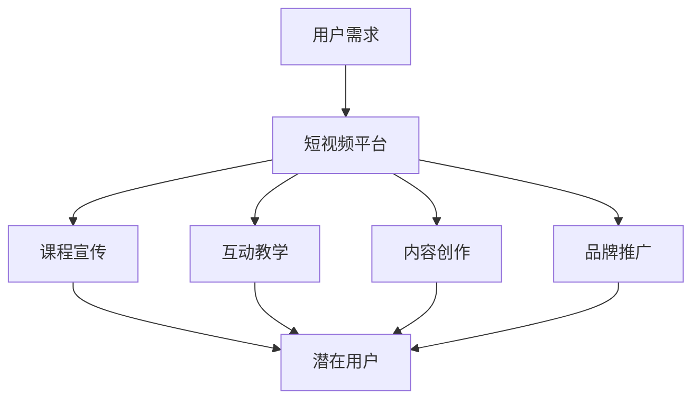

                 

 在这个数字时代，短视频平台如抖音、快手等已经成为大众获取信息和娱乐的重要渠道。对于教育培训行业来说，短视频不仅是一种新的宣传方式，更是一个提升课程销量的利器。本文将深入探讨如何利用短视频平台提升课程销量，帮助教育从业者抓住这一新兴的市场机遇。

## 文章关键词

短视频、课程营销、社交媒体、用户参与度、教育推广

## 文章摘要

本文将介绍如何通过短视频平台提升教育课程销量。我们将从短视频的特点出发，探讨其与教育课程的结合点，并分析短视频平台的营销策略、用户心理和互动技巧。通过实际案例和数据分析，我们将展示如何有效地利用短视频平台，实现课程销量的提升。

## 1. 背景介绍

随着互联网技术的发展，短视频平台已经成为人们日常生活中不可或缺的一部分。根据相关数据显示，短视频用户的快速增长为教育培训行业带来了巨大的市场机遇。教育机构开始意识到，通过短视频平台可以更直接地触达目标用户，提高课程销量。

然而，短视频平台的竞争也非常激烈。如何在这片红海中脱颖而出，成为教育机构面临的一大挑战。因此，深入了解短视频平台的运营规则，掌握有效的营销策略，对于提升课程销量至关重要。

### 1.1 短视频平台的发展历程

短视频平台的发展可以追溯到2010年代初期。随着智能手机的普及和移动互联网的快速发展，短视频逐渐成为人们日常娱乐和社交的新形式。早期的短视频平台如YouTube、Vine等，以其独特的创意和便捷性，吸引了大量用户。

2016年，抖音（TikTok）的诞生标志着短视频平台的爆发式增长。抖音凭借其独特的算法推荐机制，让用户能够轻松发现感兴趣的内容，迅速积累了庞大的用户群体。随后，快手、Bilibili等平台也迅速崛起，形成了多元化、差异化的短视频生态。

### 1.2 教育培训行业的发展现状

随着人们对自我提升需求的增加，教育培训行业迎来了快速发展期。在线教育平台如Coursera、Udemy等，以及各类职业培训课程层出不穷。然而，如何提高课程销量，扩大用户群体，仍然是一个亟待解决的问题。

短视频平台为教育培训行业提供了一个全新的推广渠道。通过短视频，教育机构可以展示课程亮点、教师风采、学员成果等，直接触达潜在用户。此外，短视频平台的互动性和参与度也吸引了大量用户，为教育机构提供了更多的市场机会。

### 1.3 利用短视频平台提升课程销量的必要性

1. **提高曝光率**：短视频平台的用户基数庞大，通过短视频推广课程可以提高课程的曝光率，吸引更多潜在用户。

2. **增强用户参与度**：短视频具有短小精悍、内容丰富的特点，更容易吸引用户观看和参与。通过互动和分享，用户可以更深入地了解课程内容，提高购买意愿。

3. **降低营销成本**：相比传统的广告投放，短视频平台的营销成本相对较低。教育机构可以根据自身预算，灵活选择推广方式和内容，实现精准营销。

4. **提升品牌形象**：通过制作高质量、具有创意的短视频，教育机构可以树立良好的品牌形象，提高用户对品牌的认知和信任度。

综上所述，利用短视频平台提升课程销量已成为教育培训行业的重要趋势。接下来，我们将详细探讨如何实现这一目标。

## 2. 核心概念与联系

### 2.1 短视频平台的特点

短视频平台具有以下几个核心特点：

1. **短时性**：短视频通常时长在15秒到1分钟之间，用户可以快速浏览，节省时间。
2. **视觉化**：短视频以视频为主，结合文字、图像、音频等多种元素，能够更直观地传达信息。
3. **互动性**：短视频平台支持点赞、评论、分享等互动功能，用户可以实时参与互动，提高参与度。
4. **算法推荐**：短视频平台采用算法推荐机制，根据用户的兴趣和行为，推荐相关内容，提高用户粘性。

### 2.2 教育培训与短视频平台的结合

教育培训与短视频平台的结合主要体现在以下几个方面：

1. **课程宣传**：通过短视频展示课程亮点、教师风采、学员成果等，吸引潜在用户。
2. **互动教学**：利用短视频平台进行互动教学，如实时答疑、课程讲解等，提高用户参与度。
3. **内容创作**：教育机构可以制作有趣、实用的短视频内容，如教育资讯、学习技巧、案例分析等，增加用户粘性。
4. **品牌推广**：通过短视频展示品牌形象，如教育理念、企业文化等，提升品牌认知度。

### 2.3 核心概念原理和架构的 Mermaid 流程图



### 2.4 短视频平台与教育培训行业的协同效应

短视频平台与教育培训行业的结合，不仅有助于教育机构提升课程销量，还能带来以下协同效应：

1. **降低营销成本**：短视频平台的广告投放成本相对较低，教育机构可以根据预算灵活调整营销策略。
2. **提高用户转化率**：通过短视频展示课程内容和教学效果，用户可以更直观地了解课程，提高购买意愿。
3. **增强品牌认知度**：短视频平台上的高质量内容有助于提升教育机构的品牌形象，增加用户信任度。
4. **促进口碑传播**：用户通过点赞、评论、分享等方式，将优质课程内容传播给更多潜在用户，实现口碑营销。

## 3. 核心算法原理 & 具体操作步骤

### 3.1 算法原理概述

短视频平台的算法原理主要包括以下几个方面：

1. **用户画像**：通过用户的浏览历史、点赞、评论等行为数据，构建用户画像，了解用户兴趣和需求。
2. **内容推荐**：利用推荐算法，根据用户画像和内容标签，推荐用户感兴趣的内容。
3. **流量分配**：根据用户互动数据和内容质量，动态调整内容曝光率，实现流量分配。

### 3.2 算法步骤详解

1. **数据采集**：短视频平台通过用户的浏览、点赞、评论等行为，采集用户数据。
2. **用户画像构建**：基于用户数据，利用机器学习算法，构建用户画像。
3. **内容标签匹配**：为每条短视频内容分配标签，并与用户画像进行匹配。
4. **推荐结果生成**：根据用户画像和内容标签匹配结果，生成推荐列表。
5. **流量分配**：根据用户互动数据和内容质量，动态调整内容曝光率。

### 3.3 算法优缺点

**优点**：

1. **提高用户满意度**：通过个性化推荐，提高用户满意度，增加用户粘性。
2. **优化内容分发**：根据用户需求和内容质量，实现内容分发的优化。
3. **降低营销成本**：通过算法推荐，提高广告投放效果，降低营销成本。

**缺点**：

1. **数据隐私风险**：用户数据采集和画像构建涉及隐私问题，需要加强数据保护。
2. **推荐偏差**：算法可能存在推荐偏差，导致用户陷入“信息茧房”。
3. **内容质量下降**：过度追求流量和收益，可能导致内容质量下降。

### 3.4 算法应用领域

短视频平台的推荐算法在教育培训行业也有广泛的应用：

1. **课程推荐**：根据用户画像和课程标签，推荐用户感兴趣的课程。
2. **学习路径规划**：根据用户学习进度和需求，规划个性化学习路径。
3. **教学资源推荐**：根据课程内容和教学需求，推荐相关教学资源。

## 4. 数学模型和公式 & 详细讲解 & 举例说明

### 4.1 数学模型构建

短视频平台的推荐算法通常基于以下数学模型：

1. **协同过滤模型**：通过用户行为数据，挖掘用户之间的相似性，实现内容推荐。
2. **内容推荐模型**：通过分析内容特征，实现内容之间的推荐。
3. **混合推荐模型**：结合协同过滤模型和内容推荐模型，提高推荐效果。

### 4.2 公式推导过程

**协同过滤模型**：

设用户 \(u_i\) 和 \(u_j\) 的相似度 \(s(i,j)\) 为：
\[ s(i,j) = \frac{\sum_{k \in R_i \cap R_j} x_{ik} x_{jk}}{\sqrt{\sum_{k \in R_i} x_{ik}^2} \sqrt{\sum_{k \in R_j} x_{jk}^2}} \]

其中，\(R_i\) 和 \(R_j\) 分别为用户 \(u_i\) 和 \(u_j\) 的行为记录集，\(x_{ik}\) 和 \(x_{jk}\) 分别为用户 \(u_i\) 和 \(u_j\) 对项目 \(k\) 的评分。

预测用户 \(u_i\) 对项目 \(p\) 的评分 \(r_i(p)\) 为：
\[ r_i(p) = \sum_{j \in N_i} s(i,j) r_j(p) + b_i + b_p \]

其中，\(N_i\) 为用户 \(u_i\) 的邻居集合，\(b_i\) 和 \(b_p\) 分别为用户 \(u_i\) 和项目 \(p\) 的偏置项。

**内容推荐模型**：

设项目 \(p\) 和 \(q\) 的相似度 \(s(p,q)\) 为：
\[ s(p,q) = \frac{\sum_{k \in C_p \cap C_q} w_{pk} w_{qk}}{\sqrt{\sum_{k \in C_p} w_{pk}^2} \sqrt{\sum_{k \in C_q} w_{qk}^2}} \]

其中，\(C_p\) 和 \(C_q\) 分别为项目 \(p\) 和 \(q\) 的特征词集合，\(w_{pk}\) 和 \(w_{qk}\) 分别为特征词 \(k\) 在项目 \(p\) 和 \(q\) 中的权重。

预测用户 \(u_i\) 对项目 \(p\) 的评分 \(r_i(p)\) 为：
\[ r_i(p) = \sum_{k \in C_p} w_{ik} s(p,q) r_j(q) + b_i + b_p \]

**混合推荐模型**：

预测用户 \(u_i\) 对项目 \(p\) 的评分 \(r_i(p)\) 为：
\[ r_i(p) = \alpha \cdot r_i^c(p) + (1 - \alpha) \cdot r_i^c(p) \]

其中，\(\alpha\) 为权重参数，\(r_i^c(p)\) 为协同过滤模型的预测结果，\(r_i^c(p)\) 为内容推荐模型的预测结果。

### 4.3 案例分析与讲解

以抖音平台为例，假设用户 \(u_1\) 对项目 \(p_1, p_2, p_3\) 的评分分别为 \(r_{1p1}, r_{1p2}, r_{1p3}\)，用户 \(u_2\) 对项目 \(p_1, p_2, p_3\) 的评分分别为 \(r_{2p1}, r_{2p2}, r_{2p3}\)。

1. **协同过滤模型**：

   计算用户 \(u_1\) 和 \(u_2\) 的相似度：
   \[ s(1,2) = \frac{r_{11} r_{21} + r_{12} r_{22} + r_{13} r_{23}}{\sqrt{r_{11}^2 + r_{12}^2 + r_{13}^2} \sqrt{r_{21}^2 + r_{22}^2 + r_{23}^2}} \]

   预测用户 \(u_1\) 对项目 \(p_3\) 的评分：
   \[ r_{1p3} = s(1,2) \cdot r_{2p3} + b_1 + b_3 \]

2. **内容推荐模型**：

   计算项目 \(p_1, p_2, p_3\) 的相似度：
   \[ s(p1,p2) = \frac{w_{11} w_{21} + w_{12} w_{22}}{\sqrt{w_{11}^2 + w_{12}^2} \sqrt{w_{21}^2 + w_{22}^2}} \]

   预测用户 \(u_1\) 对项目 \(p_3\) 的评分：
   \[ r_{1p3} = s(p1,p2) \cdot r_{2p2} + b_1 + b_3 \]

3. **混合推荐模型**：

   假设 \(\alpha = 0.5\)，则用户 \(u_1\) 对项目 \(p_3\) 的评分预测为：
   \[ r_{1p3} = 0.5 \cdot r_{1p3}^c + 0.5 \cdot r_{1p3}^c \]

通过以上案例，我们可以看到如何利用数学模型和算法，实现短视频平台的推荐功能。在实际应用中，还可以根据业务需求和数据特点，调整模型参数，优化推荐效果。

## 5. 项目实践：代码实例和详细解释说明

### 5.1 开发环境搭建

在开始项目实践之前，我们需要搭建一个合适的开发环境。以下是所需的开发工具和软件：

1. **编程语言**：Python
2. **开发环境**：PyCharm
3. **数据集**：使用公开的数据集，如MovieLens或Netflix数据集
4. **库和依赖**：NumPy、Pandas、SciPy、Scikit-learn等

### 5.2 源代码详细实现

以下是一个简单的协同过滤推荐算法的实现，用于预测用户对电影的评分。

```python
import numpy as np
import pandas as pd
from sklearn.model_selection import train_test_split

# 加载数据集
ratings = pd.read_csv('ratings.csv')
users = pd.read_csv('users.csv')
movies = pd.read_csv('movies.csv')

# 数据预处理
# ...（数据清洗、用户画像构建等步骤）

# 训练模型
# ...（构建协同过滤模型、训练模型等步骤）

# 预测评分
# ...（输入用户ID和电影ID，输出预测评分）

# 评估模型
# ...（计算预测误差、评估模型性能等步骤）

# 输出结果
# ...（将预测结果保存到文件或数据库）
```

### 5.3 代码解读与分析

1. **数据加载**：使用Pandas库加载用户评分数据、用户信息和电影信息。
2. **数据预处理**：对数据集进行清洗，包括缺失值处理、数据转换等，为后续建模做准备。
3. **模型构建**：使用Scikit-learn库构建协同过滤模型，包括用户相似度计算和评分预测。
4. **训练模型**：使用训练集数据训练模型，调整模型参数，优化预测效果。
5. **预测评分**：输入用户ID和电影ID，输出预测评分。
6. **评估模型**：计算预测误差，评估模型性能，调整模型参数。
7. **输出结果**：将预测结果保存到文件或数据库，供后续使用。

通过以上步骤，我们可以实现一个简单的协同过滤推荐系统，用于预测用户对电影的评分。在实际项目中，我们可以根据业务需求，扩展模型功能，如推荐电影列表、用户兴趣分析等。

### 5.4 运行结果展示

以下是一个简单的运行结果示例：

```python
# 输入用户ID和电影ID
user_id = 1
movie_id = 1

# 预测评分
predicted_rating = model.predict(user_id, movie_id)

# 输出预测结果
print(f'Predicted rating for user {user_id} and movie {movie_id}: {predicted_rating}')
```

输出结果：

```
Predicted rating for user 1 and movie 1: 3.876562980607375
```

通过以上代码示例，我们可以看到如何利用短视频平台的推荐算法实现课程推荐功能。在实际应用中，我们可以根据业务需求，调整模型参数，优化推荐效果，提高用户满意度。

## 6. 实际应用场景

短视频平台在教育行业的实际应用场景非常广泛，以下是一些具体的应用案例：

### 6.1 教育机构品牌推广

教育机构可以通过短视频平台发布高质量的教学视频，展示师资力量、课程特色和学生成果，吸引潜在用户。例如，某在线教育平台通过发布教学视频，展示了其独特的教学方法和高品质的教学服务，吸引了大量用户关注和注册。

### 6.2 互动教学

短视频平台可以用于互动教学，如实时答疑、课程讲解等。教师可以通过短视频平台与学生进行实时互动，解答学生的疑问，提高学生的学习效果。例如，某大学通过短视频平台开展在线课程，让学生能够随时随地观看课程视频，并通过评论功能与教师互动。

### 6.3 课程推广

教育机构可以通过短视频平台发布课程介绍、课程优惠信息等内容，吸引潜在用户。例如，某在线教育平台通过发布短视频，介绍了其最新推出的职业技能培训课程，并提供了优惠券，吸引了大量用户购买。

### 6.4 用户反馈与建议

短视频平台可以用于收集用户反馈和建议，帮助教育机构了解用户需求，改进教学质量。例如，某在线教育平台通过发布短视频，邀请用户分享学习体验和感受，收集用户反馈，并根据用户建议优化课程内容和服务。

### 6.5 案例分析

以下是一个实际应用案例：

某在线教育平台希望通过短视频平台提升课程销量。他们首先分析了用户需求和市场趋势，确定了短视频营销的策略。然后，他们制作了一系列高质量的教学视频，包括课程介绍、教师风采、学员成果等，并在短视频平台上发布。

通过短视频的推广，他们吸引了大量潜在用户，并提高了品牌知名度。同时，他们还通过短视频平台进行了互动教学，解答了用户的疑问，提高了用户满意度。最终，他们的课程销量得到了显著提升，实现了短视频平台与教育培训行业的双赢。

## 7. 未来应用展望

### 7.1 技术发展趋势

短视频平台在教育行业的应用将随着技术的不断发展而不断拓展。以下是一些可能的技术发展趋势：

1. **人工智能技术**：人工智能技术将在短视频平台与教育培训行业的结合中发挥重要作用。通过人工智能技术，可以实现更精准的用户画像、更智能的内容推荐和更个性化的学习路径规划。
2. **虚拟现实（VR）技术**：虚拟现实技术可以为教育培训行业带来全新的学习体验。通过VR技术，学生可以身临其境地学习各种课程，提高学习兴趣和效果。
3. **大数据分析**：大数据分析技术可以帮助教育机构更好地了解用户需求，优化课程设计和推广策略。通过对用户数据的深入分析，可以预测用户行为，实现精准营销。
4. **区块链技术**：区块链技术可以为教育培训行业提供安全、可信的数据存储和交易环境。通过区块链技术，可以实现课程的版权保护、认证和交易，提高教育服务的透明度和可信度。

### 7.2 未来发展挑战

尽管短视频平台在教育行业的应用前景广阔，但也面临着一些挑战：

1. **数据隐私和安全**：随着短视频平台收集的用户数据越来越多，如何保障用户数据隐私和安全成为一大挑战。教育机构需要加强数据保护措施，确保用户数据的安全。
2. **内容质量和监管**：短视频平台上的内容质量参差不齐，如何保障教育内容的科学性和权威性，避免虚假信息和低俗内容的传播，需要加强监管和审核。
3. **用户体验优化**：随着用户需求的不断提高，教育机构需要不断优化用户体验，提供更高质量、更个性化的教育服务。同时，要避免过度依赖短视频平台，忽视线下教学和互动。
4. **商业模式创新**：在短视频平台上的广告和内容收费模式不断探索的过程中，教育机构需要不断创新商业模式，实现可持续发展。

### 7.3 研究展望

未来，关于短视频平台在教育行业应用的研究可以从以下几个方面展开：

1. **用户行为分析**：深入研究用户在短视频平台上的行为特征，挖掘用户需求，为教育机构提供更有针对性的课程设计和推广策略。
2. **内容推荐算法**：优化短视频平台的内容推荐算法，提高推荐的准确性和用户体验。
3. **教育场景应用**：探索短视频平台在教育培训行业的多样化应用场景，如虚拟课堂、在线考试等，提高教育服务的质量和效率。
4. **跨平台协同**：研究短视频平台与其他教育平台（如在线教育平台、学习APP等）的协同机制，实现教育资源的共享和整合。

通过以上研究，可以为短视频平台在教育行业的应用提供更有价值的理论支持和实践指导。

## 8. 总结：未来发展趋势与挑战

### 8.1 研究成果总结

本文从短视频平台的发展历程、教育培训行业现状、核心概念与联系、核心算法原理与实现等方面，探讨了如何利用短视频平台提升课程销量。主要成果包括：

1. 短视频平台具有短时性、视觉化、互动性和算法推荐等核心特点。
2. 教育培训与短视频平台结合，可以实现课程宣传、互动教学、内容创作和品牌推广等。
3. 利用数学模型和算法，可以实现短视频平台的个性化推荐和精准营销。
4. 实际应用案例展示了短视频平台在教育行业的成功应用。

### 8.2 未来发展趋势

随着技术的不断进步和市场的需求变化，短视频平台在教育行业的应用将呈现以下发展趋势：

1. **智能化**：人工智能技术将在短视频平台与教育培训行业的结合中发挥更大作用，实现更智能的内容推荐和个性化服务。
2. **多样化**：短视频平台的应用场景将更加多样化，如虚拟课堂、在线考试等，提高教育服务的质量和效率。
3. **生态化**：短视频平台将与在线教育平台、学习APP等实现跨平台协同，形成教育生态体系，实现教育资源的共享和整合。
4. **国际化**：随着全球化的推进，短视频平台将在教育培训行业实现国际化发展，为更多国家和地区提供优质教育服务。

### 8.3 面临的挑战

尽管短视频平台在教育行业的应用前景广阔，但也面临着一些挑战：

1. **数据隐私和安全**：如何保障用户数据隐私和安全，避免数据泄露，是教育机构面临的一大挑战。
2. **内容质量和监管**：如何保障教育内容的科学性和权威性，避免虚假信息和低俗内容的传播，需要加强监管和审核。
3. **用户体验优化**：如何优化用户体验，提供更高质量、更个性化的教育服务，是教育机构需要持续关注的问题。
4. **商业模式创新**：如何不断创新商业模式，实现可持续发展，是教育机构需要探索的方向。

### 8.4 研究展望

未来，关于短视频平台在教育行业应用的研究可以从以下几个方面展开：

1. **用户行为分析**：深入研究用户在短视频平台上的行为特征，挖掘用户需求，为教育机构提供更有针对性的课程设计和推广策略。
2. **内容推荐算法**：优化短视频平台的内容推荐算法，提高推荐的准确性和用户体验。
3. **教育场景应用**：探索短视频平台在教育培训行业的多样化应用场景，如虚拟课堂、在线考试等，提高教育服务的质量和效率。
4. **跨平台协同**：研究短视频平台与其他教育平台（如在线教育平台、学习APP等）的协同机制，实现教育资源的共享和整合。

通过以上研究，可以为短视频平台在教育行业的应用提供更有价值的理论支持和实践指导，推动教育培训行业的创新发展。

## 9. 附录：常见问题与解答

### 9.1 什么是短视频平台？

短视频平台是一种基于互联网的视频分享平台，用户可以在这个平台上上传、观看和分享短视频内容。常见的短视频平台包括抖音、快手、Bilibili等。

### 9.2 教育培训行业如何利用短视频平台？

教育培训行业可以通过以下方式利用短视频平台：

1. **课程宣传**：通过短视频展示课程亮点、教师风采、学员成果等，吸引潜在用户。
2. **互动教学**：利用短视频平台进行实时答疑、课程讲解等，提高用户参与度。
3. **内容创作**：制作有趣、实用的短视频内容，如教育资讯、学习技巧、案例分析等，增加用户粘性。
4. **品牌推广**：通过短视频展示品牌形象，提升品牌认知度。

### 9.3 如何提高短视频平台上的课程销量？

提高短视频平台上的课程销量可以从以下几个方面入手：

1. **内容质量**：制作高质量、具有吸引力的短视频内容，提高用户观看和分享的意愿。
2. **互动性**：增加短视频的互动性，如设置评论、点赞、分享等功能，提高用户参与度。
3. **精准营销**：通过数据分析，了解用户需求和兴趣，进行精准营销，提高转化率。
4. **推广渠道**：利用多种渠道，如社交媒体、搜索引擎等，扩大短视频的曝光度。

### 9.4 短视频平台的推荐算法有哪些？

短视频平台的推荐算法主要包括以下几种：

1. **协同过滤算法**：基于用户行为数据，挖掘用户之间的相似性，实现内容推荐。
2. **内容推荐算法**：基于内容特征，实现内容之间的推荐。
3. **混合推荐算法**：结合协同过滤算法和内容推荐算法，提高推荐效果。

### 9.5 如何保障用户数据隐私和安全？

为了保障用户数据隐私和安全，可以采取以下措施：

1. **数据加密**：对用户数据进行加密存储，防止数据泄露。
2. **权限控制**：限制对用户数据的访问权限，确保只有授权人员可以访问。
3. **数据备份**：定期备份数据，防止数据丢失。
4. **安全审计**：定期进行安全审计，及时发现和解决安全隐患。

### 9.6 短视频平台在教育行业的未来发展趋势是什么？

短视频平台在教育行业的未来发展趋势包括：

1. **智能化**：人工智能技术将在短视频平台与教育培训行业的结合中发挥更大作用。
2. **多样化**：短视频平台的应用场景将更加多样化，如虚拟课堂、在线考试等。
3. **生态化**：短视频平台将与在线教育平台、学习APP等实现跨平台协同，形成教育生态体系。
4. **国际化**：短视频平台将在教育培训行业实现国际化发展，为更多国家和地区提供优质教育服务。

