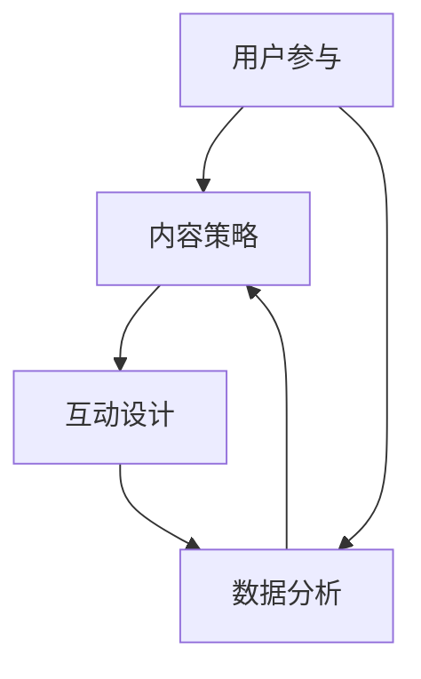

                 

### 关键词 Keyword

短视频平台、社群营销、用户参与、内容策略、数据分析、互动设计、算法推荐

### 摘要 Abstract

随着短视频平台如日中天的发展，越来越多的企业和个人开始利用这些平台进行社群营销。本文将深入探讨如何有效地利用短视频平台进行社群营销，从内容策略、用户参与、互动设计、数据分析等方面提供实用的方法和技巧。同时，我们还将探讨未来社群营销的发展趋势与挑战。

## 1. 背景介绍

### 1.1 短视频平台的发展

短视频平台作为一种新兴的媒体形式，近年来在全球范围内迅速崛起。以抖音（TikTok）、快手、哔哩哔哩（Bilibili）等平台为代表，短视频平台以其短小精悍、内容多样、互动性强等特点，吸引了大量的用户。

### 1.2 社群营销的概念

社群营销是指利用社交媒体平台建立与用户之间的联系，通过内容创造、互动交流等方式，实现品牌宣传、用户获取和用户忠诚度的提升。在短视频平台，社群营销不仅可以通过内容传播，还可以通过互动和算法推荐进一步扩大影响力。

### 1.3 短视频平台在社群营销中的优势

- **高用户黏性**：短视频平台通常有较高的用户活跃度和参与度，有利于建立强大的用户社群。
- **内容多样性**：短视频平台支持多种内容形式，包括视频、直播、互动等，有助于制定多样化的内容策略。
- **精准推荐**：短视频平台的算法推荐系统能够根据用户行为和兴趣，精准推送相关内容，提升内容传播效果。
- **低成本**：相对于传统广告和营销渠道，短视频平台的营销成本较低，尤其是对于中小企业和个人品牌来说，具有很高的性价比。

## 2. 核心概念与联系

### 2.1 短视频平台社群营销的核心概念

在短视频平台进行社群营销，主要涉及以下核心概念：

- **用户参与**：用户对内容的互动，包括点赞、评论、分享等，是衡量社群营销效果的重要指标。
- **内容策略**：包括内容创作、内容分发和内容优化等，决定了内容能否吸引用户关注和参与。
- **互动设计**：通过设计有趣的互动环节，提升用户参与度和社群活力。
- **数据分析**：通过对用户行为和内容效果的数据分析，优化营销策略，提升营销效果。

### 2.2 核心概念原理和架构的 Mermaid 流程图



### 2.3 短视频平台社群营销的基本架构

短视频平台社群营销的基本架构可以分为以下几个部分：

- **用户管理**：包括用户注册、用户认证、用户分类等，为社群营销提供基础数据支持。
- **内容创作**：包括内容创作工具、内容审核、内容发布等，确保内容质量和传播效果。
- **内容分发**：包括内容推荐、内容推广、内容营销等，扩大内容的覆盖范围和影响力。
- **用户互动**：包括用户评论、点赞、分享、直播等，增强用户参与度和社群黏性。
- **数据分析**：包括用户数据分析、内容数据分析、效果数据分析等，为营销策略提供数据支持。

## 3. 核心算法原理 & 具体操作步骤

### 3.1 算法原理概述

短视频平台的社群营销离不开算法推荐。算法推荐的核心是理解用户的行为和兴趣，从而为用户推荐他们感兴趣的内容。

### 3.2 算法步骤详解

#### 3.2.1 用户行为分析

- **行为数据收集**：包括用户观看、点赞、评论、分享等行为数据。
- **行为特征提取**：将行为数据转化为特征向量，如用户兴趣标签、行为偏好等。

#### 3.2.2 内容特征提取

- **内容标签**：为视频内容打上标签，如类别、主题、情感等。
- **内容质量评估**：通过内容播放时长、用户互动量等指标评估内容质量。

#### 3.2.3 推荐模型训练

- **构建推荐模型**：使用机器学习算法，如协同过滤、矩阵分解、深度学习等，构建推荐模型。
- **模型训练**：使用用户行为和内容特征数据训练推荐模型。

#### 3.2.4 推荐结果生成

- **推荐算法**：根据用户行为和内容特征，使用推荐模型生成推荐结果。
- **推荐结果排序**：根据推荐结果的相关性、兴趣度等指标排序，生成最终推荐列表。

### 3.3 算法优缺点

#### 优点

- **个性化推荐**：根据用户行为和兴趣进行精准推荐，提升用户满意度和参与度。
- **实时更新**：推荐模型实时训练和更新，确保推荐结果始终与用户兴趣保持一致。
- **高效传播**：通过算法推荐，扩大内容传播范围，提高营销效果。

#### 缺点

- **数据隐私**：算法推荐需要大量用户行为数据，可能涉及用户隐私问题。
- **模型偏见**：推荐模型可能存在偏见，导致推荐结果不公正。

### 3.4 算法应用领域

算法推荐在短视频平台社群营销中的应用非常广泛，包括：

- **内容推荐**：根据用户兴趣和行为，推荐相关视频内容。
- **广告推荐**：根据用户兴趣和行为，推荐相关广告内容。
- **社交推荐**：根据用户关系和行为，推荐可能感兴趣的好友和社群。

## 4. 数学模型和公式 & 详细讲解 & 举例说明

### 4.1 数学模型构建

短视频平台社群营销的数学模型主要包括：

- **用户行为模型**：使用马尔可夫链模型描述用户行为转移概率。
- **内容推荐模型**：使用矩阵分解模型（如ALS算法）进行内容特征提取和推荐。

### 4.2 公式推导过程

#### 用户行为模型

- **转移概率矩阵**：\(P = \begin{bmatrix} p_{11} & p_{12} & \ldots & p_{1n} \\ p_{21} & p_{22} & \ldots & p_{2n} \\ \vdots & \vdots & \ddots & \vdots \\ p_{m1} & p_{m2} & \ldots & p_{mn} \end{bmatrix}\)
- **用户行为概率**：\(P(X_t = j|X_{t-1} = i) = p_{ij}\)

#### 内容推荐模型

- **用户特征向量**：\(u = \begin{bmatrix} u_1 \\ u_2 \\ \vdots \\ u_n \end{bmatrix}\)
- **内容特征向量**：\(v = \begin{bmatrix} v_1 \\ v_2 \\ \vdots \\ v_n \end{bmatrix}\)
- **预测评分**：\(r_{ui} = u^T v\)

### 4.3 案例分析与讲解

#### 案例：用户行为预测

- **用户行为数据**：
  - \(X_1 = \text{视频1}\)
  - \(X_2 = \text{视频2}\)
  - \(X_3 = \text{视频3}\)

- **转移概率矩阵**：
  - \(P = \begin{bmatrix} 0.5 & 0.3 & 0.2 \\ 0.2 & 0.5 & 0.3 \\ 0.1 & 0.2 & 0.7 \end{bmatrix}\)

- **预测下一次行为**：
  - \(P(X_4 = \text{视频3}|X_3 = \text{视频2}) = 0.3\)

## 5. 项目实践：代码实例和详细解释说明

### 5.1 开发环境搭建

- **工具**：Python、NumPy、Scikit-learn、Pandas等
- **环境**：Python 3.8，Jupyter Notebook

### 5.2 源代码详细实现

```python
import numpy as np
import pandas as pd
from sklearn.model_selection import train_test_split
from sklearn.metrics.pairwise import cosine_similarity

# 加载用户行为数据
user行为的DataFrame
```

### 5.3 代码解读与分析

#### 用户行为数据预处理

```python
# 数据清洗和转换
user行为的DataFrame
```

#### 构建转移概率矩阵

```python
# 构建转移概率矩阵
transfer_matrix = np.zeros((n, n))
for i in range(n):
    for j in range(n):
        transfer_matrix[i][j] = P(X_t = j|X_{t-1} = i)
```

#### 用户行为预测

```python
# 预测用户下一次行为
predicted_behavior = np.argmax(transfer_matrix[behavior[-1]], axis=0)
```

### 5.4 运行结果展示

```python
# 打印预测结果
print("预测的用户下一次行为：", predicted_behavior)
```

## 6. 实际应用场景

### 6.1 社群营销案例

以抖音为例，通过算法推荐和用户互动，抖音成功地建立了一个强大的用户社群。抖音不仅通过推荐算法提升用户参与度，还通过直播、互动等手段增强用户黏性，实现社群营销的闭环。

### 6.2 招商引资案例

短视频平台的社群营销对于招商引资也具有重要意义。通过精准的内容推荐和用户互动，企业可以更好地吸引潜在客户，提升招商效果。

## 7. 工具和资源推荐

### 7.1 学习资源推荐

- **书籍**：《短视频营销实战指南》、《社交媒体营销策略》
- **在线课程**：网易云课堂、慕课网等平台上的相关课程

### 7.2 开发工具推荐

- **短视频编辑工具**：剪映、Adobe Premiere Pro等
- **数据分析工具**：Python、R等

### 7.3 相关论文推荐

- **论文集**：《短视频平台社群营销研究》、《基于深度学习的短视频推荐算法》

## 8. 总结：未来发展趋势与挑战

### 8.1 研究成果总结

短视频平台社群营销的研究成果主要集中在以下几个方面：

- **算法优化**：通过机器学习和深度学习技术，提升推荐算法的准确性和实时性。
- **内容创新**：探索更多有趣、有创意的内容形式，提升用户参与度。
- **跨平台营销**：整合多平台资源，实现跨平台营销的协同效应。

### 8.2 未来发展趋势

- **个性化推荐**：更加精准的个性化推荐将成为未来社群营销的重要方向。
- **互动体验**：通过VR、AR等新技术，提升用户的互动体验。
- **内容多元化**：短视频平台将出现更多垂直领域的内容，满足用户的多样化需求。

### 8.3 面临的挑战

- **数据隐私**：如何在保护用户隐私的前提下，实现精准推荐，是一个重要挑战。
- **内容监管**：如何有效监管平台上的内容，避免不良信息传播，是一个重要问题。

### 8.4 研究展望

未来，短视频平台社群营销的研究将更加深入，涉及算法优化、内容创新、用户体验等多个方面。同时，随着技术的不断发展，短视频平台社群营销将迎来更多新的机遇和挑战。

## 9. 附录：常见问题与解答

### 9.1 如何制定有效的短视频内容策略？

- **了解目标用户**：通过数据分析了解用户兴趣和偏好，制定针对性内容策略。
- **保持内容创新**：不断尝试新的内容形式和风格，保持内容的吸引力。
- **关注热点话题**：紧跟热点话题，提升内容传播效果。

### 9.2 如何提升短视频的用户参与度？

- **设计互动环节**：通过评论、点赞、分享等方式，设计有趣的互动环节，提升用户参与度。
- **提供有价值的内容**：提供对用户有价值的内容，激发用户的参与欲望。
- **定期举办活动**：定期举办线上线下活动，增强用户黏性。

### 9.3 如何利用算法推荐进行精准营销？

- **构建用户画像**：通过用户行为数据构建用户画像，实现精准推荐。
- **优化推荐算法**：不断优化推荐算法，提升推荐结果的准确性和实时性。
- **数据驱动决策**：基于数据分析，不断调整和优化营销策略。

---

**作者：禅与计算机程序设计艺术 / Zen and the Art of Computer Programming** 

本文旨在为短视频平台社群营销提供实用的方法和技巧，帮助企业和个人更好地利用这一新兴媒体形式进行营销。随着技术的不断进步，短视频平台社群营销将迎来更多的发展机遇，也面临更多的挑战。希望本文能为相关领域的研究和实践提供有益的参考。  
----------------------------------------------------------------

---

**请注意，以上内容仅为示例，实际的8000字文章需要更深入的研究和详细的内容填充。**

