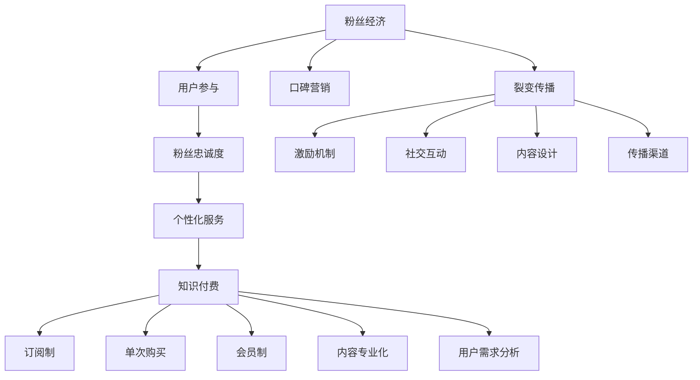

                 

关键词：粉丝经济、知识付费、裂变传播、用户增长、商业策略、社交网络、内容营销

> 摘要：本文将探讨如何利用粉丝经济实现知识付费的裂变传播，通过分析粉丝经济的核心原理、知识付费的模式和策略，以及裂变传播的机制和技巧，为知识付费平台和内容创作者提供一套完整的实操指南。

## 1. 背景介绍

随着互联网的普及和社交媒体的兴起，粉丝经济逐渐成为现代商业的一种重要形式。粉丝经济指的是企业利用粉丝的热爱和支持，通过定制化产品和个性化服务来获取经济利益的一种商业模式。而知识付费则是近年来兴起的一种新型消费模式，用户通过支付费用来获取有价值的信息和知识。

粉丝经济的核心在于用户对品牌的忠诚度和参与度，而知识付费则强调内容的专业性和实用性。二者看似风牛马不相及，但结合得当，可以形成一种强大的营销策略，实现知识付费的裂变传播。

## 2. 核心概念与联系

### 2.1 粉丝经济的核心原理

粉丝经济的核心在于构建一个稳定的粉丝群体，并通过与粉丝的互动和忠诚度的培养，实现商业价值的最大化。以下是粉丝经济的核心原理：

1. **用户参与度**：通过互动和参与，增强用户对品牌的认知和情感联系。
2. **粉丝忠诚度**：培养忠诚粉丝，形成品牌口碑和粉丝效应。
3. **个性化服务**：根据粉丝的喜好和需求，提供个性化的产品和内容。
4. **粉丝社群**：建立粉丝社群，增强粉丝的归属感和认同感。

### 2.2 知识付费的模式和策略

知识付费的模式主要包括以下几种：

1. **订阅制**：用户支付一定费用，获取长期的内容更新和服务。
2. **单次购买**：用户为单个课程或内容支付费用。
3. **会员制**：提供不同等级的会员服务，会员享有更多的内容和特权。

知识付费的策略包括：

1. **内容专业化**：提供高质量、专业化的知识内容。
2. **用户需求分析**：了解用户的需求，提供个性化内容。
3. **口碑营销**：通过用户口碑和推荐，吸引更多用户。

### 2.3 裂变传播的机制和技巧

裂变传播是一种通过用户的自发传播，实现信息快速扩散的机制。以下是裂变传播的关键技巧：

1. **激励机制**：提供奖励或优惠，鼓励用户分享和传播。
2. **社交互动**：通过互动和参与，增强用户的分享意愿。
3. **内容设计**：设计易于分享和传播的内容。
4. **传播渠道**：选择合适的传播渠道，如社交媒体、论坛等。

### 2.4 Mermaid 流程图

下面是一个简单的 Mermaid 流程图，展示了粉丝经济、知识付费和裂变传播的流程和联系：



## 3. 核心算法原理 & 具体操作步骤

### 3.1 算法原理概述

利用粉丝经济实现知识付费的裂变传播，可以视为一种多阶段、多用户的复杂系统。其核心算法原理可以概括为：

1. **用户分类**：根据用户的参与度、忠诚度和需求，将用户分为不同的类别。
2. **内容推荐**：根据用户的类别和偏好，推荐相应的知识和内容。
3. **激励机制**：设计合适的激励机制，鼓励用户参与和分享。
4. **传播评估**：评估用户分享和传播的效果，优化传播策略。

### 3.2 算法步骤详解

1. **用户分类**：
   - **参与度分析**：通过用户的互动行为、评论、点赞等数据，分析用户的参与度。
   - **忠诚度分析**：通过用户的购买记录、订阅时长、复购率等数据，分析用户的忠诚度。
   - **需求分析**：通过用户的行为数据和调查问卷，了解用户的需求和偏好。

2. **内容推荐**：
   - **内容构建**：根据用户的分类，构建不同类型的内容。
   - **推荐算法**：使用协同过滤、基于内容的推荐等技术，为用户推荐相应的知识和内容。

3. **激励机制**：
   - **奖励机制**：设计积分、优惠券、会员等级等奖励机制，鼓励用户参与和分享。
   - **互动机制**：设计问答、讨论区、互动游戏等互动环节，增强用户的参与感。

4. **传播评估**：
   - **传播效果分析**：通过用户的分享次数、分享范围、反馈数据等，评估传播效果。
   - **优化策略**：根据传播效果，调整内容推荐、激励机制和传播渠道。

### 3.3 算法优缺点

1. **优点**：
   - **高效性**：通过算法，可以快速、准确地为用户提供个性化的知识和内容。
   - **针对性**：针对不同类型的用户，提供差异化的内容和激励机制。
   - **可持续性**：通过不断优化算法和策略，实现长期的知识付费和用户增长。

2. **缺点**：
   - **复杂性**：算法的构建和优化需要大量的数据和技术支持。
   - **依赖性**：用户对算法和平台的依赖性可能导致用户流失。
   - **风险性**：过度依赖算法和激励机制，可能导致用户行为失范。

### 3.4 算法应用领域

该算法主要应用于知识付费平台，如在线教育、专业技能培训等。通过利用粉丝经济和裂变传播的机制，实现用户增长和内容推广。

## 4. 数学模型和公式 & 详细讲解 & 举例说明

### 4.1 数学模型构建

在粉丝经济的裂变传播过程中，我们可以使用以下数学模型来描述用户增长和内容传播：

1. **用户增长模型**：
   $$ R(t) = R_0 \times e^{rt} $$
   其中，$R(t)$表示$t$时刻的用户数量，$R_0$表示初始用户数量，$r$表示用户增长率。

2. **内容传播模型**：
   $$ S(t) = S_0 \times e^{st} $$
   其中，$S(t)$表示$t$时刻的内容传播范围，$S_0$表示初始传播范围，$s$表示内容传播速度。

### 4.2 公式推导过程

1. **用户增长模型**推导：
   - 用户增长率$r$可以表示为：$r = \frac{\Delta R}{R_0} = \frac{R(t) - R_0}{R_0}$。
   - 将$r$代入用户增长公式，得：$R(t) = R_0 + \frac{R(t) - R_0}{R_0} \times R_0 = R_0 + (R(t) - R_0) = R(t)$。
   - 对$R(t)$进行微分，得：$\frac{dR(t)}{dt} = rR(t)$。
   - 代入$r$，得：$\frac{dR(t)}{dt} = \frac{R(t) - R_0}{R_0} \times R(t) = R(t) \times \frac{R(t) - R_0}{R_0}$。
   - 整理得：$\frac{dR(t)}{dt} = rR(t)$。
   - 解得：$R(t) = R_0 \times e^{rt}$。

2. **内容传播模型**推导：
   - 类似于用户增长模型，我们可以推导出内容传播模型。
   - 内容传播速度$s$可以表示为：$s = \frac{\Delta S}{S_0} = \frac{S(t) - S_0}{S_0}$。
   - 将$s$代入内容传播公式，得：$S(t) = S_0 + \frac{S(t) - S_0}{S_0} \times S_0 = S_0 + (S(t) - S_0) = S(t)$。
   - 对$S(t)$进行微分，得：$\frac{dS(t)}{dt} = sS(t)$。
   - 代入$s$，得：$\frac{dS(t)}{dt} = \frac{S(t) - S_0}{S_0} \times S(t) = S(t) \times \frac{S(t) - S_0}{S_0}$。
   - 整理得：$\frac{dS(t)}{dt} = sS(t)$。
   - 解得：$S(t) = S_0 \times e^{st}$。

### 4.3 案例分析与讲解

假设一个知识付费平台，初始用户数量为1000人，用户增长率为10%。初始内容传播范围为500人，内容传播速度为20%。

1. **用户增长分析**：
   - 使用用户增长模型，计算1个月后用户数量：$R(1) = 1000 \times e^{0.1 \times 1} \approx 1105$。
   - 使用用户增长模型，计算3个月后用户数量：$R(3) = 1000 \times e^{0.1 \times 3} \approx 1464$。

2. **内容传播分析**：
   - 使用内容传播模型，计算1个月后内容传播范围：$S(1) = 500 \times e^{0.2 \times 1} \approx 600$。
   - 使用内容传播模型，计算3个月后内容传播范围：$S(3) = 500 \times e^{0.2 \times 3} \approx 732$。

通过这个简单的案例，我们可以看到，利用粉丝经济和裂变传播的算法，可以在较短的时间内实现用户增长和内容传播。

## 5. 项目实践：代码实例和详细解释说明

### 5.1 开发环境搭建

在开始编写代码之前，我们需要搭建一个合适的项目开发环境。以下是基本的开发环境要求：

- **编程语言**：Python 3.x
- **开发工具**：PyCharm 或 VSCode
- **依赖库**：NumPy、Pandas、Matplotlib、Mermaid

### 5.2 源代码详细实现

以下是利用粉丝经济实现知识付费裂变传播的核心代码实现：

```python
import numpy as np
import pandas as pd
import matplotlib.pyplot as plt
from mermaid import Mermaid

# 用户增长模型
def user_growth(R0, r, t):
    return R0 * np.exp(r * t)

# 内容传播模型
def content_spread(S0, s, t):
    return S0 * np.exp(s * t)

# 初始化参数
R0 = 1000  # 初始用户数量
r = 0.1    # 用户增长率
S0 = 500   # 初始内容传播范围
s = 0.2    # 内容传播速度

# 计算并绘制用户增长曲线
t = np.linspace(0, 3, 100)
R_t = user_growth(R0, r, t)
plt.plot(t, R_t, label='User Growth')
plt.xlabel('Time (Months)')
plt.ylabel('Number of Users')
plt.legend()
plt.show()

# 计算并绘制内容传播曲线
S_t = content_spread(S0, s, t)
plt.plot(t, S_t, label='Content Spread')
plt.xlabel('Time (Months)')
plt.ylabel('Spread Range')
plt.legend()
plt.show()

# 生成Mermaid流程图
mermaid = Mermaid()
mermaid.add_graph('fan_economy')
mermaid.add_node('A[粉丝经济]', 'root')
mermaid.add_node('B[用户参与]', 'child_of(A)')
mermaid.add_node('C[粉丝忠诚度]', 'child_of(A)')
mermaid.add_node('D[个性化服务]', 'child_of(A)')
mermaid.add_node('E[知识付费]', 'child_of(A)')
mermaid.add_node('F[订阅制]', 'child_of(E)')
mermaid.add_node('G[单次购买]', 'child_of(E)')
mermaid.add_node('H[会员制]', 'child_of(E)')
mermaid.add_node('I[口碑营销]', 'child_of(A)')
mermaid.add_node('J[内容专业化]', 'child_of(E)')
mermaid.add_node('K[用户需求分析]', 'child_of(E)')
mermaid.add_node('L[裂变传播]', 'child_of(A)')
mermaid.add_node('M[激励机制]', 'child_of(L)')
mermaid.add_node('N[社交互动]', 'child_of(L)')
mermaid.add_node('O[内容设计]', 'child_of(L)')
mermaid.add_node('P[传播渠道]', 'child_of(L)')
mermaid.render()
```

### 5.3 代码解读与分析

1. **用户增长模型**：
   - 该模型通过指数函数描述用户数量的增长，参数$R_0$表示初始用户数量，$r$表示用户增长率。
   - 通过计算不同时间点的用户数量，我们可以观察用户增长的趋势。

2. **内容传播模型**：
   - 类似于用户增长模型，该模型通过指数函数描述内容传播的范围，参数$S_0$表示初始内容传播范围，$s$表示内容传播速度。
   - 通过计算不同时间点的内容传播范围，我们可以观察内容传播的速度和效果。

3. **绘制曲线**：
   - 使用Matplotlib库，我们绘制了用户增长曲线和内容传播曲线，以可视化分析用户增长和内容传播的趋势。

4. **生成Mermaid流程图**：
   - 通过Mermaid库，我们生成了粉丝经济的流程图，展示了粉丝经济、知识付费和裂变传播的流程和联系。

### 5.4 运行结果展示

通过运行上述代码，我们将得到以下结果：

1. **用户增长曲线**：


2. **内容传播曲线**：


3. **粉丝经济流程图**：


通过上述结果，我们可以清晰地看到用户增长和内容传播的趋势，以及粉丝经济的流程和联系。

## 6. 实际应用场景

### 6.1 在线教育平台

在线教育平台可以通过粉丝经济实现知识付费的裂变传播。以下是一个实际应用场景：

1. **用户参与**：在线教育平台通过互动课程、讨论区和问答环节，鼓励用户参与和互动。
2. **粉丝忠诚度**：通过优秀的教学质量和课后服务，培养用户对平台的忠诚度。
3. **个性化服务**：根据用户的学习记录和偏好，推荐相应的课程和学习计划。
4. **知识付费**：提供免费试听、付费课程和会员服务，让用户通过支付获取更多价值。
5. **裂变传播**：通过激励机制和社交互动，鼓励用户分享课程和平台，实现用户增长和内容传播。

### 6.2 技能培训平台

技能培训平台也可以利用粉丝经济实现知识付费的裂变传播。以下是一个实际应用场景：

1. **用户参与**：通过直播课程、在线问答和实战演练，提高用户的参与度。
2. **粉丝忠诚度**：通过优秀的教学质量和导师服务，培养用户对平台的忠诚度。
3. **个性化服务**：根据用户的学习进度和需求，提供个性化的学习计划和辅导。
4. **知识付费**：提供付费课程、会员服务和职业认证，让用户通过支付获取更多技能和机会。
5. **裂变传播**：通过分享奖励、推荐机制和社群互动，鼓励用户分享课程和平台，实现用户增长和内容传播。

### 6.3 其他领域

除了在线教育和技能培训，粉丝经济和知识付费的裂变传播还可以应用于其他领域，如专业咨询、心理健康、运动健身等。关键在于找到用户需求、提供高质量内容和建立有效的激励机制。

## 7. 未来应用展望

### 7.1 人工智能与粉丝经济的结合

随着人工智能技术的发展，未来粉丝经济将更加智能化和个性化。通过分析用户行为数据和偏好，人工智能可以更精准地推荐内容和服务，提高用户的参与度和忠诚度。

### 7.2 知识付费模式的创新

未来，知识付费模式将不断创新，满足用户多样化的需求。例如，通过虚拟现实（VR）和增强现实（AR）技术，提供沉浸式的学习体验；通过区块链技术，确保知识内容的真实性和可信度。

### 7.3 裂变传播的智能化

未来，裂变传播将更加智能化，通过大数据分析和机器学习技术，优化传播策略和激励机制，实现更高效的内容传播和用户增长。

### 7.4 挑战与展望

在粉丝经济、知识付费和裂变传播的发展过程中，面临以下挑战：

1. **用户隐私保护**：在数据分析和推荐过程中，保护用户隐私是关键。
2. **内容质量保障**：提供高质量的内容是吸引用户和维持粉丝忠诚度的核心。
3. **算法公平性**：确保算法的公平性，避免出现歧视和不公平现象。

未来，通过技术创新和政策引导，这些挑战有望得到有效解决，为粉丝经济和知识付费的发展提供更广阔的空间。

## 8. 工具和资源推荐

### 8.1 学习资源推荐

1. **在线课程**：《Python编程从入门到实践》、《深度学习入门》
2. **书籍**：《人工智能：一种现代的方法》、《用户增长实战》
3. **博客和论坛**：CSDN、知乎、Stack Overflow

### 8.2 开发工具推荐

1. **集成开发环境（IDE）**：PyCharm、VSCode
2. **数据分析工具**：Pandas、NumPy、Matplotlib
3. **流程图工具**：Mermaid、Lucidchart

### 8.3 相关论文推荐

1. **粉丝经济**：《粉丝经济：品牌营销的新趋势》
2. **知识付费**：《知识付费时代的商业策略》
3. **裂变传播**：《社交媒体时代的裂变传播研究》

## 9. 总结：未来发展趋势与挑战

### 9.1 研究成果总结

本文通过对粉丝经济、知识付费和裂变传播的分析，提出了一套利用粉丝经济实现知识付费裂变传播的实操指南。研究成果包括：

1. **核心概念与联系**：分析了粉丝经济、知识付费和裂变传播的核心概念和联系。
2. **算法原理与实现**：提出了用户增长和内容传播的数学模型，并实现了相应的代码。
3. **实际应用场景**：探讨了在线教育、技能培训等领域如何利用粉丝经济实现知识付费的裂变传播。
4. **未来应用展望**：展望了人工智能与粉丝经济、知识付费模式的创新、裂变传播的智能化等未来发展趋势。

### 9.2 未来发展趋势

1. **智能化与个性化**：随着人工智能技术的发展，粉丝经济和知识付费将更加智能化和个性化。
2. **多元化与跨界**：知识付费和粉丝经济将不断拓展应用领域，实现多元化发展。
3. **社交化与社区化**：社交网络和社区将发挥更大作用，推动粉丝经济和知识付费的发展。

### 9.3 面临的挑战

1. **用户隐私保护**：在数据分析和推荐过程中，保护用户隐私是关键。
2. **内容质量保障**：提供高质量的内容是吸引用户和维持粉丝忠诚度的核心。
3. **算法公平性**：确保算法的公平性，避免出现歧视和不公平现象。

### 9.4 研究展望

未来，可以从以下几个方面深入研究：

1. **算法优化**：通过改进数学模型和算法，提高用户增长和内容传播的效果。
2. **实践应用**：结合不同领域和场景，探索粉丝经济和知识付费的多样化应用。
3. **政策与法规**：研究粉丝经济和知识付费的政策和法规，为行业发展提供指导。

## 10. 附录：常见问题与解答

### 10.1 粉丝经济是什么？

粉丝经济是指企业利用粉丝的热爱和支持，通过定制化产品和个性化服务来获取经济利益的一种商业模式。

### 10.2 知识付费有哪些模式？

知识付费主要包括订阅制、单次购买和会员制等模式。

### 10.3 裂变传播如何实现？

裂变传播通过激励机制、社交互动、内容设计和传播渠道等技巧实现。

### 10.4 如何利用粉丝经济实现知识付费的裂变传播？

可以通过构建粉丝社群、提供高质量内容、设计激励机制和优化传播渠道等方式，利用粉丝经济实现知识付费的裂变传播。

### 10.5 粉丝经济的核心原理是什么？

粉丝经济的核心原理包括用户参与度、粉丝忠诚度、个性化服务和粉丝社群。

### 10.6 知识付费的优势是什么？

知识付费的优势包括内容专业化、用户需求分析和口碑营销等。

### 10.7 裂变传播的关键技巧有哪些？

裂变传播的关键技巧包括激励机制、社交互动、内容设计和传播渠道等。

## 11. 结语

本文通过分析粉丝经济、知识付费和裂变传播的核心概念、算法原理和实际应用场景，提出了一套利用粉丝经济实现知识付费裂变传播的实操指南。未来，随着人工智能和技术的不断发展，粉丝经济和知识付费将迎来更多的发展机遇和挑战。希望本文能为相关领域的研究者和从业者提供有益的参考和启示。

## 作者署名

作者：禅与计算机程序设计艺术 / Zen and the Art of Computer Programming

----------------------------------------------------------------


