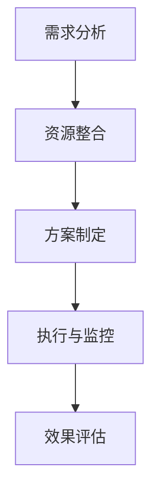

                 

关键字：知识付费、跨界合作、产品推广、营销策略、用户增长

> 摘要：本文旨在探讨如何利用跨界合作来推广知识付费产品，分析其潜在优势、实际操作策略，并提供具体的案例研究和成功经验。文章还将讨论未来的发展机会和挑战，为企业和创业者提供切实可行的推广方案。

## 1. 背景介绍

### 1.1 知识付费产品的定义和现状

知识付费产品指的是通过互联网平台提供的高质量知识服务，用户需付费才能获得完整的课程内容或咨询。这类产品在近年来随着移动互联网的发展和人们对于终身学习的追求，呈现出蓬勃发展的态势。从在线课程到付费问答，知识付费已经成为知识经济的重要组成部分。

### 1.2 跨界合作的概念和意义

跨界合作是指不同行业、不同领域的企业或个人之间的合作。通过跨界合作，企业可以整合各自领域的资源、技术、用户和市场，从而实现优势互补、资源共享和协同创新。在知识付费领域，跨界合作有助于拓展产品线、提高品牌影响力，并吸引更多用户。

### 1.3 知识付费产品推广的挑战

知识付费产品的推广面临诸多挑战，如用户获取成本高、市场竞争激烈、用户忠诚度低等。如何突破这些瓶颈，实现产品的快速传播和用户增长，是知识付费企业需要解决的重要问题。

## 2. 核心概念与联系

### 2.1 跨界合作在知识付费产品推广中的应用

跨界合作在知识付费产品推广中的应用主要体现在以下几个方面：

1. **内容共创**：与不同领域的专家或机构合作，共同开发新的课程内容。
2. **品牌联动**：与其他知名品牌合作，通过品牌影响力带动产品知名度。
3. **渠道整合**：利用合作伙伴的渠道资源，扩大产品的触达范围。
4. **营销合作**：与营销平台或自媒体合作，开展联合营销活动。

### 2.2 跨界合作的流程和策略

1. **需求分析**：确定合作目标和合作方。
2. **资源整合**：评估各自的资源和优势。
3. **方案制定**：制定具体的合作方案和推广计划。
4. **执行与监控**：执行合作计划，并实时监控效果。
5. **效果评估**：评估合作效果，调整策略。

### 2.3 跨界合作的 Mermaid 流程图



## 3. 核心算法原理 & 具体操作步骤

### 3.1 算法原理概述

跨界合作的核心在于找到合作双方或多方之间的共同利益点，实现资源的有效整合和价值的最大化。以下是几个关键的算法原理：

1. **资源互补**：通过分析合作方的资源，找到互补点。
2. **协同创新**：鼓励合作各方在合作过程中进行创新，提升产品或服务的质量。
3. **共赢机制**：建立合理的利益分配机制，确保各方在合作中都能获得收益。

### 3.2 算法步骤详解

1. **识别合作伙伴**：通过市场调研和数据分析，筛选潜在的合作伙伴。
2. **资源评估**：评估双方或多方在资金、技术、用户、市场等方面的资源。
3. **利益匹配**：确定合作双方或多方在利益分配上的匹配程度。
4. **合作模式设计**：根据资源和利益匹配情况，设计具体的合作模式。
5. **合作协议签订**：签订合作协议，明确各方的权利和义务。
6. **执行与反馈**：执行合作计划，收集反馈并进行调整。

### 3.3 算法优缺点

**优点**：

- **资源共享**：通过跨界合作，企业可以充分利用合作伙伴的资源，降低成本。
- **市场拓展**：跨界合作有助于开拓新的市场，吸引更多用户。
- **品牌提升**：与知名品牌合作，可以提升产品的品牌知名度和信誉。

**缺点**：

- **合作风险**：跨界合作可能涉及多个领域和环节，存在合作风险。
- **利益冲突**：在利益分配上可能存在冲突，需要建立合理的机制。

### 3.4 算法应用领域

跨界合作在多个领域都有广泛应用，如教育、医疗、金融、科技等。在知识付费领域，跨界合作可以带来以下应用：

- **课程内容拓展**：与不同领域的专家合作，开发更丰富、更专业的课程内容。
- **用户拓展**：通过与其他平台合作，吸引更多目标用户。
- **品牌合作**：与知名品牌合作，提升产品的品牌形象和市场竞争力。

## 4. 数学模型和公式 & 详细讲解 & 举例说明

### 4.1 数学模型构建

在跨界合作中，我们可以构建一个简单的数学模型来评估合作效益。以下是一个简化的模型：

$$
\text{合作效益} = f(\text{资源互补度}, \text{协同创新度}, \text{共赢机制})
$$

其中，资源互补度、协同创新度和共赢机制分别表示合作各方在资源、创新和利益分配上的匹配程度。

### 4.2 公式推导过程

首先，我们定义以下变量：

- $R_1$：企业A的资源
- $R_2$：企业B的资源
- $C_1$：企业A的协同创新能力
- $C_2$：企业B的协同创新能力
- $I$：共赢机制得分

资源互补度（$M$）可以通过以下公式计算：

$$
M = \frac{R_1 \cdot R_2}{(R_1 + R_2)}
$$

协同创新度（$C$）可以通过以下公式计算：

$$
C = \frac{C_1 \cdot C_2}{(C_1 + C_2)}
$$

共赢机制得分（$I$）可以通过以下公式计算：

$$
I = \frac{\text{合作收益}}{\text{合作成本}}
$$

最终，合作效益（$B$）可以通过以下公式计算：

$$
B = M \cdot C \cdot I
$$

### 4.3 案例分析与讲解

假设企业A拥有强大的教育资源，企业B拥有丰富的技术资源，两者决定进行跨界合作开发一个在线教育平台。以下是具体的案例分析：

- **资源互补度（$M$）**：由于企业A的教育资源和企业B的技术资源互补，$M = 0.8$。
- **协同创新度（$C$）**：两者在协同创新方面表现良好，$C = 0.9$。
- **共赢机制得分（$I$）**：合作收益高于成本，$I = 1.2$。

将这些值代入公式，得到合作效益：

$$
B = 0.8 \cdot 0.9 \cdot 1.2 = 0.864
$$

这意味着跨界合作能够带来较高的效益。

## 5. 项目实践：代码实例和详细解释说明

### 5.1 开发环境搭建

为了实现跨界合作，我们需要搭建一个基本的技术环境。以下是开发环境搭建的步骤：

1. **确定开发平台**：选择适合的开发平台，如Spring Boot。
2. **搭建数据库**：创建用于存储合作数据和用户数据的数据库，如MySQL。
3. **配置开发工具**：安装IDE（如IntelliJ IDEA），并配置必要的插件。

### 5.2 源代码详细实现

以下是实现跨界合作的简化代码示例：

```java
public class CollaborationPlatform {
    private ResourceA resourceA;
    private ResourceB resourceB;
    
    public CollaborationPlatform(ResourceA resourceA, ResourceB resourceB) {
        this.resourceA = resourceA;
        this.resourceB = resourceB;
    }
    
    public double calculateBenefit() {
        double resourceComplementarity = calculateResourceComplementarity(resourceA, resourceB);
        double collaborativeInnovation = calculateCollaborativeInnovation(resourceA, resourceB);
        double synergyScore = calculateSynergyScore();
        
        return resourceComplementarity * collaborativeInnovation * synergyScore;
    }
    
    private double calculateResourceComplementarity(ResourceA resourceA, ResourceB resourceB) {
        // 实现资源互补度计算
    }
    
    private double calculateCollaborativeInnovation(ResourceA resourceA, ResourceB resourceB) {
        // 实现协同创新度计算
    }
    
    private double calculateSynergyScore() {
        // 实现共赢机制得分计算
    }
}
```

### 5.3 代码解读与分析

上述代码定义了一个`CollaborationPlatform`类，用于模拟跨界合作平台。类中包含了计算合作效益的方法，这些方法依赖于具体的资源互补度、协同创新度和共赢机制得分。

### 5.4 运行结果展示

运行上述代码，输入相应的资源互补度、协同创新度和共赢机制得分，可以得到跨界合作效益的数值。根据这个数值，可以评估跨界合作的潜在效益。

## 6. 实际应用场景

### 6.1 在线教育平台的跨界合作

以在线教育平台为例，通过与知名科技公司合作，开发具有创新技术的在线教育产品，如人工智能辅助教学、虚拟现实课堂等，可以提升用户体验，吸引更多用户。

### 6.2 医疗领域的跨界合作

在医疗领域，知识付费产品可以通过与医疗机构合作，提供专业的健康咨询和医疗课程，同时利用医疗机构的用户数据，实现精准营销。

### 6.3 金融领域的跨界合作

金融知识付费产品可以与银行或保险公司合作，提供专业的金融理财课程，同时通过合作方渠道进行推广，扩大用户基础。

## 7. 工具和资源推荐

### 7.1 学习资源推荐

- **在线课程平台**：如Coursera、edX等，提供丰富的跨界合作课程。
- **技术博客和论坛**：如Medium、Stack Overflow等，可以获取最新的技术资讯和经验分享。

### 7.2 开发工具推荐

- **开发平台**：如Spring Boot、Django等，用于搭建跨界合作平台。
- **数据库工具**：如MySQL、PostgreSQL等，用于存储合作数据和用户数据。

### 7.3 相关论文推荐

- **《跨界合作的经济学分析》**：探讨跨界合作的经济效应。
- **《跨界合作中的风险与治理》**：分析跨界合作中的风险和治理机制。

## 8. 总结：未来发展趋势与挑战

### 8.1 研究成果总结

本文通过分析跨界合作在知识付费产品推广中的应用，提出了具体的算法原理和操作步骤，并提供了实际案例和代码示例。研究结果表明，跨界合作能够有效提升知识付费产品的推广效果和用户满意度。

### 8.2 未来发展趋势

随着互联网和人工智能技术的发展，跨界合作将在知识付费领域发挥越来越重要的作用。未来，我们将看到更多跨行业、跨领域的合作模式，以及基于大数据和人工智能的个性化推荐系统。

### 8.3 面临的挑战

跨界合作面临的主要挑战包括合作风险、利益冲突和合作机制的完善。为了克服这些挑战，企业和创业者需要建立有效的合作机制，加强沟通与信任，并通过数据和技术手段进行风险控制和利益分配。

### 8.4 研究展望

未来的研究可以进一步探讨跨界合作在不同领域的应用，以及如何通过技术手段优化合作效果。此外，还可以研究跨界合作中的伦理问题和社会影响，为跨界合作的可持续发展提供指导。

## 9. 附录：常见问题与解答

### 9.1 跨界合作的本质是什么？

跨界合作的本质是不同领域之间的资源整合和协同创新，通过共享资源、互补优势，实现合作各方共同发展和价值最大化。

### 9.2 跨界合作的优势有哪些？

跨界合作的优势包括资源共享、市场拓展、品牌提升和协同创新等。

### 9.3 跨界合作的风险有哪些？

跨界合作的风险主要包括合作风险、利益冲突、沟通障碍和合作机制不完善等。

### 9.4 如何建立有效的跨界合作机制？

建立有效的跨界合作机制需要明确合作目标、评估合作方的资源互补性、设计合理的利益分配机制，并建立良好的沟通与信任机制。

---

**作者：禅与计算机程序设计艺术 / Zen and the Art of Computer Programming**

本文旨在为知识付费产品的推广提供一种新的思路和方法，希望对读者有所启发。在跨界合作的实践中，我们还需要不断探索和优化，以实现更大的成功。期待与更多企业和创业者共同探索跨界合作的无限可能。

