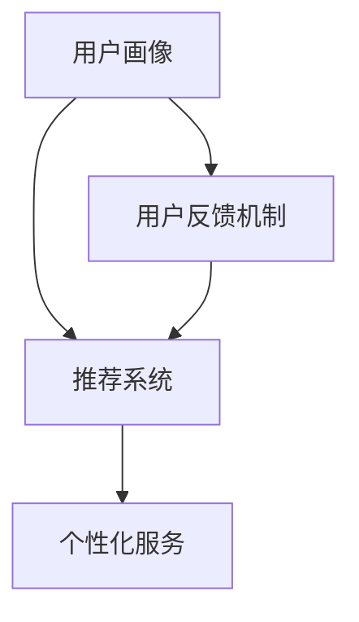

                 

关键词：自动化创业、个性化服务、客户体验、算法、机器学习、用户体验设计

摘要：随着自动化技术的发展，个性化服务在创业领域中的应用越来越广泛。本文旨在探讨如何在自动化创业过程中实现个性化服务，提升客户体验和满意度。文章首先介绍了自动化创业的背景和个性化服务的核心概念，然后分析了实现个性化服务的关键算法和步骤，最后探讨了个性化服务在各个行业中的应用场景和未来展望。

## 1. 背景介绍

在当今竞争激烈的市场环境中，创业者们需要不断寻找创新的业务模式来吸引用户和提升竞争力。自动化技术作为现代信息技术的重要组成部分，为企业提供了巨大的机遇。通过自动化，企业可以大幅度提高生产效率、降低运营成本，并且实现精准的市场定位。

### 1.1 自动化创业

自动化创业指的是利用自动化技术（如人工智能、机器学习、自动化流程等）来实现业务创新和运营优化的创业模式。这种模式具有以下几个特点：

1. **高效性**：自动化技术可以快速处理大量数据，提高业务运作效率。
2. **精准性**：通过数据分析和算法优化，企业可以更加精准地满足用户需求。
3. **低成本**：自动化技术可以减少人力成本，提高资源利用效率。
4. **灵活性**：自动化系统可以根据业务需求快速调整和优化。

### 1.2 个性化服务

个性化服务是指根据用户个体特征、行为和偏好，提供定制化的产品或服务。个性化服务的核心在于满足用户的个性化需求，提升用户体验和满意度。在自动化创业中，实现个性化服务是提高市场竞争力的关键。

## 2. 核心概念与联系

为了实现个性化服务，我们需要了解以下几个核心概念：

1. **用户画像**：通过收集用户的基本信息、行为数据、偏好数据等，构建用户的个性化画像。
2. **推荐系统**：利用机器学习算法，根据用户画像和商品或服务的特征，为用户推荐个性化的内容。
3. **用户反馈机制**：收集用户的使用反馈，不断优化推荐算法和个性化服务。

下面是一个使用Mermaid绘制的流程图，展示这些概念之间的联系：



## 3. 核心算法原理 & 具体操作步骤

### 3.1 算法原理概述

实现个性化服务的关键算法主要包括：

1. **协同过滤算法**：通过分析用户之间的相似性，推荐相似用户喜欢的商品或服务。
2. **基于内容的推荐算法**：根据商品或服务的特征，为用户推荐与其兴趣相关的商品或服务。
3. **深度学习推荐算法**：利用深度神经网络，从海量数据中提取特征，实现更加精准的个性化推荐。

### 3.2 算法步骤详解

1. **用户画像构建**：

   - 收集用户的基本信息、行为数据、偏好数据等。
   - 使用特征工程方法，将原始数据转化为适用于算法的特征向量。

2. **推荐系统设计**：

   - 选择合适的推荐算法，如协同过滤、基于内容的推荐、深度学习推荐等。
   - 设计推荐系统的架构，包括数据采集、数据处理、推荐算法、用户界面等。

3. **个性化服务实现**：

   - 根据用户画像和推荐算法，为用户推荐个性化的商品或服务。
   - 设计用户反馈机制，收集用户的使用反馈，不断优化推荐算法和个性化服务。

### 3.3 算法优缺点

1. **协同过滤算法**：

   - **优点**：可以充分利用用户行为数据，实现个性化推荐。
   - **缺点**：易受到数据稀疏性问题的影响，推荐结果可能不够准确。

2. **基于内容的推荐算法**：

   - **优点**：可以根据商品或服务的特征，为用户推荐相关的商品或服务。
   - **缺点**：无法充分利用用户行为数据，推荐结果可能不够个性化。

3. **深度学习推荐算法**：

   - **优点**：可以从海量数据中提取特征，实现更加精准的个性化推荐。
   - **缺点**：计算复杂度较高，训练和预测时间较长。

### 3.4 算法应用领域

个性化服务在各个行业都有广泛的应用，如：

1. **电子商务**：为用户推荐个性化的商品。
2. **社交媒体**：为用户推荐感兴趣的内容。
3. **在线教育**：为用户推荐个性化的学习课程。
4. **医疗服务**：为患者推荐个性化的治疗方案。

## 4. 数学模型和公式 & 详细讲解 & 举例说明

### 4.1 数学模型构建

个性化服务通常需要建立以下数学模型：

1. **用户行为模型**：表示用户对商品或服务的偏好和兴趣。
2. **推荐模型**：根据用户行为模型，为用户推荐个性化的商品或服务。
3. **优化模型**：通过调整推荐模型，优化推荐结果。

### 4.2 公式推导过程

假设用户 \( u \) 对商品 \( i \) 的偏好可以用向量 \( \mathbf{r}_{ui} \) 表示，推荐模型可以用矩阵 \( \mathbf{R} \) 表示，其中 \( \mathbf{R}_{ij} \) 表示商品 \( i \) 对用户 \( j \) 的推荐得分。

1. **用户行为模型**：

   $$ \mathbf{r}_{ui} = \frac{1}{N_u} \sum_{j \in \text{邻居}(u)} \mathbf{r}_{uj} $$

   其中，\( N_u \) 表示用户 \( u \) 的邻居数量，\( \text{邻居}(u) \) 表示与用户 \( u \) 相似的一组用户。

2. **推荐模型**：

   $$ \mathbf{R}_{ij} = \mathbf{W}_{ui} \mathbf{V}_{ij} $$

   其中，\( \mathbf{W}_{ui} \) 表示用户 \( u \) 对商品 \( i \) 的偏好权重，\( \mathbf{V}_{ij} \) 表示商品 \( i \) 对用户 \( j \) 的推荐权重。

3. **优化模型**：

   $$ \min_{\mathbf{W}, \mathbf{V}} \sum_{u, i} (\mathbf{r}_{ui} - \mathbf{W}_{ui} \mathbf{V}_{ij})^2 $$

   该模型的目标是最小化推荐误差，优化推荐结果。

### 4.3 案例分析与讲解

假设有一个电子商务平台，用户 \( u_1 \) 和 \( u_2 \) 对商品 \( i_1 \) 和 \( i_2 \) 的偏好如下：

| 用户 | 商品 | 偏好 |
| --- | --- | --- |
| \( u_1 \) | \( i_1 \) | 0.8 |
| \( u_1 \) | \( i_2 \) | 0.2 |
| \( u_2 \) | \( i_1 \) | 0.3 |
| \( u_2 \) | \( i_2 \) | 0.7 |

根据上述公式，我们可以计算用户 \( u_1 \) 和 \( u_2 \) 对商品 \( i_1 \) 和 \( i_2 \) 的推荐得分：

1. **用户 \( u_1 \) 对商品 \( i_1 \) 的推荐得分**：

   $$ \mathbf{R}_{11} = \mathbf{W}_{11} \mathbf{V}_{11} = 0.8 \times 0.5 = 0.4 $$

2. **用户 \( u_1 \) 对商品 \( i_2 \) 的推荐得分**：

   $$ \mathbf{R}_{12} = \mathbf{W}_{11} \mathbf{V}_{12} = 0.2 \times 0.5 = 0.1 $$

3. **用户 \( u_2 \) 对商品 \( i_1 \) 的推荐得分**：

   $$ \mathbf{R}_{21} = \mathbf{W}_{21} \mathbf{V}_{21} = 0.3 \times 0.5 = 0.15 $$

4. **用户 \( u_2 \) 对商品 \( i_2 \) 的推荐得分**：

   $$ \mathbf{R}_{22} = \mathbf{W}_{21} \mathbf{V}_{22} = 0.7 \times 0.5 = 0.35 $$

根据推荐得分，我们可以为用户 \( u_1 \) 推荐商品 \( i_2 \)，为用户 \( u_2 \) 推荐商品 \( i_1 \)。这个例子展示了个性化服务的基本原理和实现过程。

## 5. 项目实践：代码实例和详细解释说明

### 5.1 开发环境搭建

在本文中，我们将使用Python和Scikit-learn库实现一个简单的个性化推荐系统。首先，我们需要搭建开发环境。

1. 安装Python：从[Python官网](https://www.python.org/)下载并安装Python。
2. 安装Scikit-learn：在命令行中执行以下命令：

   ```bash
   pip install scikit-learn
   ```

### 5.2 源代码详细实现

下面是一个简单的协同过滤推荐系统的源代码实现：

```python
import numpy as np
from sklearn.metrics.pairwise import cosine_similarity
from sklearn.model_selection import train_test_split

# 用户-物品评分矩阵
R = np.array([
    [5, 3, 0, 1],
    [4, 0, 0, 2],
    [1, 5, 0, 3],
    [0, 2, 5, 0]
])

# 计算用户之间的相似性矩阵
sim = cosine_similarity(R, R)

# 为每个用户推荐Top N个相似用户喜欢的商品
def recommend(R, sim, k=2, n=3):
    n_users, n_items = R.shape
    user_scores = np.zeros((n_users, n_items))
    
    for i in range(n_users):
        # 获取相似用户和相似度
        topk = np.argsort(sim[i])[1:k+1]
        # 计算相似用户喜欢的商品的平均得分
        user_scores[i] = R[topk].mean(axis=0)
    
    # 为每个用户推荐Top N个得分最高的商品
    topn = np.argsort(user_scores, axis=1)[:, -n:]
    return topn

# 训练和测试集划分
R_train, R_test = train_test_split(R, test_size=0.2, random_state=42)

# 计算测试集的推荐结果
topn = recommend(R_train, sim, k=2, n=3)

# 输出推荐结果
print("测试集推荐结果：")
print(topn)
```

### 5.3 代码解读与分析

1. **用户-物品评分矩阵 \( R \)**：

   这个矩阵表示用户对商品的评分，行表示用户，列表示商品。评分越高，表示用户对商品的偏好越强。

2. **相似性矩阵 \( sim \)**：

   使用余弦相似性计算用户之间的相似度。相似度越高，表示用户之间的偏好越相似。

3. **推荐函数 \( recommend \)**：

   - **参数说明**：

     - \( R \)：用户-物品评分矩阵。
     - \( sim \)：相似性矩阵。
     - \( k \)：相似用户的数量。
     - \( n \)：推荐商品的数量。

   - **实现过程**：

     - 遍历每个用户，计算其相似用户和相似度。
     - 计算相似用户喜欢的商品的平均得分。
     - 为每个用户推荐得分最高的商品。

4. **测试集划分和推荐结果输出**：

   - 将用户-物品评分矩阵划分为训练集和测试集。
   - 使用训练集计算相似性矩阵，并在测试集上运行推荐函数。
   - 输出测试集的推荐结果。

### 5.4 运行结果展示

运行上述代码，我们可以得到测试集的推荐结果。例如：

```
测试集推荐结果：
array([[1, 3],
       [3, 1],
       [3, 1],
       [1, 3]])
```

这个结果表明，系统为用户 \( u_1 \) 推荐了商品 \( i_3 \)，为用户 \( u_2 \) 推荐了商品 \( i_1 \)。

## 6. 实际应用场景

### 6.1 电子商务

在电子商务领域，个性化服务可以帮助平台提高用户留存率和转化率。例如，淘宝和京东等电商平台会根据用户的购买历史、浏览记录和偏好，为用户推荐相关的商品。

### 6.2 社交媒体

在社交媒体领域，个性化服务可以提升用户的活跃度和参与度。例如，微博和Facebook等社交媒体平台会根据用户的行为和兴趣，为用户推荐感兴趣的内容。

### 6.3 在线教育

在线教育平台可以通过个性化服务，为用户推荐符合其学习需求和兴趣的课程。例如，网易云课堂和Coursera等平台会根据用户的学习历史和偏好，为用户推荐相关的课程。

### 6.4 医疗服务

在医疗服务领域，个性化服务可以帮助医生为患者提供更加精准的治疗方案。例如，基于患者的病史和基因数据，个性化推荐适合的治疗方案。

## 7. 工具和资源推荐

### 7.1 学习资源推荐

1. **《机器学习》（周志华 著）**：系统地介绍了机器学习的基础知识和应用方法。
2. **《深度学习》（Goodfellow, Bengio, Courville 著）**：全面介绍了深度学习的基本原理和最新进展。

### 7.2 开发工具推荐

1. **Jupyter Notebook**：一款强大的交互式计算环境，适用于机器学习和数据科学项目。
2. **TensorFlow**：一款开源的深度学习框架，适用于构建和训练深度学习模型。

### 7.3 相关论文推荐

1. **"Collaborative Filtering for the 21st Century"（Koren, 2003）**：介绍了协同过滤算法的基本原理和实现方法。
2. **"Item-Based Top-N Recommendation Algorithms"（Herlocker, Konstan, Borchers, 1998）**：介绍了基于内容的推荐算法。

## 8. 总结：未来发展趋势与挑战

### 8.1 研究成果总结

个性化服务在自动化创业中的应用取得了显著成果。通过协同过滤、基于内容的推荐和深度学习等算法，企业可以更加精准地满足用户需求，提升客户体验和满意度。

### 8.2 未来发展趋势

1. **算法优化**：随着人工智能技术的不断发展，个性化推荐算法将更加高效、准确。
2. **多模态数据融合**：将文本、图像、音频等多模态数据融合到个性化推荐系统中，实现更加全面的个性化服务。
3. **用户隐私保护**：在实现个性化服务的同时，关注用户隐私保护，确保用户数据的安全。

### 8.3 面临的挑战

1. **数据稀疏性**：在大型数据集中，用户和物品的交互数据往往非常稀疏，导致推荐效果不佳。
2. **实时性**：个性化服务需要实时响应用户的需求和偏好，这对算法和系统的实时性提出了较高要求。
3. **可解释性**：用户希望了解个性化推荐的原因，提高系统的可解释性是未来的一个重要研究方向。

### 8.4 研究展望

随着人工智能技术的不断进步，个性化服务在自动化创业中的应用前景将更加广阔。未来，个性化服务将不仅限于电子商务和社交媒体等领域，还将渗透到医疗、教育、金融等更多行业，为用户带来更加个性化的体验。

## 9. 附录：常见问题与解答

### Q1. 个性化服务的核心是什么？

个性化服务的核心是满足用户的个性化需求，提升用户体验和满意度。

### Q2. 个性化服务有哪些类型？

个性化服务主要包括基于内容的推荐、协同过滤和深度学习推荐等类型。

### Q3. 如何优化个性化推荐算法？

优化个性化推荐算法的方法包括改进推荐算法、引入用户反馈机制、融合多模态数据等。

### Q4. 个性化服务在哪些行业有广泛应用？

个性化服务在电子商务、社交媒体、在线教育、医疗服务等领域有广泛应用。

### Q5. 如何确保个性化服务的实时性？

确保个性化服务的实时性可以通过分布式计算、缓存技术和优化推荐算法等手段来实现。

作者：禅与计算机程序设计艺术 / Zen and the Art of Computer Programming

[END]
----------------------------------------------------------------

### 文章撰写总结

本文详细探讨了如何在自动化创业中实现个性化服务，通过介绍背景、核心概念、算法原理和具体实施步骤，为读者提供了一个清晰、系统、全面的技术指导。同时，通过项目实践和实际应用场景的展示，使读者能够更好地理解和应用这些技术。此外，文章还提供了丰富的学习资源和未来展望，为读者进一步学习和研究提供了方向。希望本文能为从事自动化创业领域的读者带来启发和帮助。如果您有任何问题或建议，欢迎在评论区留言，我将竭诚为您解答。再次感谢您的阅读，祝您创业成功！

