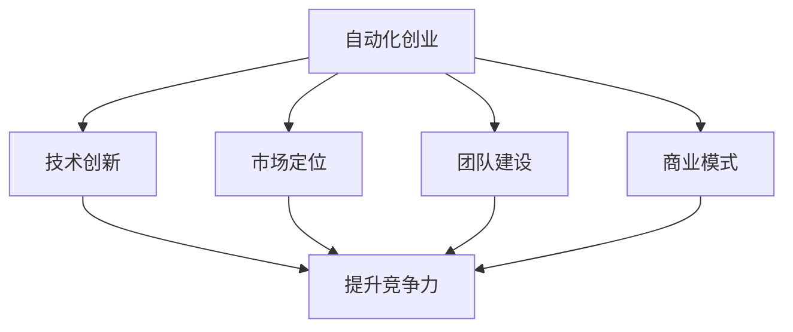

                 

摘要：本文将探讨自动化创业的核心竞争力构建，分析其在现代商业环境中的重要性。我们将通过实际案例，揭示构建核心竞争力的关键步骤，包括技术创新、市场定位、团队建设等方面的策略，帮助创业者打造具有持续竞争力的自动化业务。

## 1. 背景介绍

随着全球科技的发展，自动化技术正迅速渗透到各个行业，从制造业到服务业，从生产自动化到业务流程自动化，自动化已经成为提升企业效率和竞争力的关键。在这样的大背景下，自动化创业成为了一个热门领域。然而，如何在竞争激烈的市场中建立核心竞争力，成为每一个自动化创业者都必须面对的挑战。

建立核心竞争力是自动化创业成功的关键。核心竞争力不仅仅是一个技术或产品的优势，更是企业在市场中长期稳定发展的根本。在本文中，我们将深入探讨如何通过技术创新、市场定位、团队建设等手段，在自动化创业中建立核心竞争力。

## 2. 核心概念与联系

### 2.1 自动化创业的定义

自动化创业是指创业者利用自动化技术，开发出具有创新性、市场潜力的产品或服务，从而在市场中获得竞争优势的过程。自动化技术涵盖了人工智能、机器学习、物联网、机器人技术等多个领域。

### 2.2 核心竞争力的概念

核心竞争力是指企业在特定市场中，凭借独特的技术、产品、服务或商业模式，相较于竞争对手所具有的持续竞争优势。核心竞争力是企业长期稳定发展的基础，能够帮助企业在面对市场变化时，保持持续的竞争力和创新能力。

### 2.3 自动化创业与核心竞争力的关系

自动化创业的核心竞争力主要体现在以下几个方面：

- **技术创新**：通过不断的技术创新，提升产品的性能、效率和用户体验，从而在市场中获得竞争优势。
- **市场定位**：准确的市场定位能够帮助企业找到目标客户，提供符合市场需求的产品或服务。
- **团队建设**：拥有专业、高效的团队，能够快速响应市场变化，实现企业的战略目标。
- **商业模式**：创新性的商业模式能够为企业带来持续的利润增长，提升市场竞争力。

### 2.4 自动化创业与核心竞争力的 Mermaid 流程图



## 3. 核心算法原理 & 具体操作步骤

### 3.1 算法原理概述

在自动化创业中，核心算法原理通常是指那些能够显著提升产品性能或效率的算法。这些算法可能涉及人工智能、机器学习、深度学习等技术，它们是实现自动化创业目标的重要技术基础。

### 3.2 算法步骤详解

- **需求分析**：首先，需要对市场进行调研，了解用户需求和市场趋势，明确产品需要解决的核心问题。
- **算法设计**：基于需求分析，设计相应的算法框架，确定算法的基本流程和关键技术点。
- **模型训练**：使用历史数据对算法模型进行训练，优化模型参数，提高模型的准确性和效率。
- **模型评估**：通过测试数据对训练好的模型进行评估，确保模型能够满足业务需求。
- **产品实现**：将优化后的算法模型应用到产品中，实现产品的自动化功能。

### 3.3 算法优缺点

- **优点**：
  - 提升产品性能和效率。
  - 提高用户体验。
  - 降低人力成本。
- **缺点**：
  - 算法开发和优化成本高。
  - 数据质量和量对算法效果有很大影响。
  - 可能面临数据隐私和安全问题。

### 3.4 算法应用领域

- **智能制造**：通过算法优化，提高生产线的自动化程度，提升生产效率和产品质量。
- **智能客服**：利用自然语言处理算法，实现智能客服机器人，提高客户服务效率和满意度。
- **金融风控**：运用机器学习算法，进行信用评估和风险控制，提高金融服务的准确性和安全性。

## 4. 数学模型和公式 & 详细讲解 & 举例说明

### 4.1 数学模型构建

在自动化创业中，常见的数学模型包括线性回归、逻辑回归、支持向量机（SVM）、神经网络等。这些模型的应用场景和构建方法各有不同。

### 4.2 公式推导过程

以线性回归模型为例，其公式推导过程如下：

假设我们有 $m$ 个样本点 $(x_1, y_1), (x_2, y_2), \ldots, (x_m, y_m)$，其中 $x_i$ 是自变量，$y_i$ 是因变量。我们希望找到一个线性模型 $y = \beta_0 + \beta_1 x$ 来拟合这些数据。

首先，我们计算样本点的均值 $\bar{x}$ 和 $\bar{y}$：

$$
\bar{x} = \frac{1}{m} \sum_{i=1}^{m} x_i, \quad \bar{y} = \frac{1}{m} \sum_{i=1}^{m} y_i
$$

然后，我们计算线性模型的残差平方和：

$$
\sum_{i=1}^{m} (y_i - (\beta_0 + \beta_1 x_i))^2
$$

为了最小化这个残差平方和，我们对 $\beta_0$ 和 $\beta_1$ 分别求偏导数，并令偏导数为零，得到：

$$
\frac{\partial}{\partial \beta_0} \sum_{i=1}^{m} (y_i - (\beta_0 + \beta_1 x_i))^2 = 0 \\
\frac{\partial}{\partial \beta_1} \sum_{i=1}^{m} (y_i - (\beta_0 + \beta_1 x_i))^2 = 0
$$

通过求解这个方程组，我们可以得到线性回归模型的参数 $\beta_0$ 和 $\beta_1$。

### 4.3 案例分析与讲解

假设我们有以下数据：

| x | y |
|---|---|
| 1 | 2 |
| 2 | 4 |
| 3 | 5 |
| 4 | 6 |

我们希望找到一个线性模型来拟合这些数据。

首先，我们计算样本点的均值：

$$
\bar{x} = \frac{1+2+3+4}{4} = 2.5, \quad \bar{y} = \frac{2+4+5+6}{4} = 4.5
$$

然后，我们计算线性模型的残差平方和：

$$
\sum_{i=1}^{4} (y_i - (\beta_0 + \beta_1 x_i))^2 = (2 - (\beta_0 + \beta_1 \cdot 1))^2 + (4 - (\beta_0 + \beta_1 \cdot 2))^2 + (5 - (\beta_0 + \beta_1 \cdot 3))^2 + (6 - (\beta_0 + \beta_1 \cdot 4))^2
$$

为了最小化这个残差平方和，我们对 $\beta_0$ 和 $\beta_1$ 分别求偏导数，并令偏导数为零，得到：

$$
\frac{\partial}{\partial \beta_0} \sum_{i=1}^{4} (y_i - (\beta_0 + \beta_1 x_i))^2 = 4(2 - (\beta_0 + \beta_1 \cdot 1)) - 4(4 - (\beta_0 + \beta_1 \cdot 2)) - 4(5 - (\beta_0 + \beta_1 \cdot 3)) - 4(6 - (\beta_0 + \beta_1 \cdot 4)) = 0 \\
\frac{\partial}{\partial \beta_1} \sum_{i=1}^{4} (y_i - (\beta_0 + \beta_1 x_i))^2 = 4(2 - (\beta_0 + \beta_1 \cdot 1)) - 4(4 - (\beta_0 + \beta_1 \cdot 2)) - 4(5 - (\beta_0 + \beta_1 \cdot 3)) - 4(6 - (\beta_0 + \beta_1 \cdot 4)) = 0
$$

解这个方程组，我们得到：

$$
\beta_0 = 3, \quad \beta_1 = 1
$$

因此，线性回归模型为 $y = 3 + x$。

## 5. 项目实践：代码实例和详细解释说明

### 5.1 开发环境搭建

为了实现自动化创业，我们需要搭建一个合适的技术环境。以下是一个基本的开发环境搭建步骤：

1. 安装 Python 3.8 或更高版本。
2. 安装 Jupyter Notebook，用于编写和运行代码。
3. 安装必要的库，如 NumPy、Pandas、Scikit-learn 等。

### 5.2 源代码详细实现

以下是一个简单的线性回归模型的 Python 代码实现：

```python
import numpy as np
import pandas as pd
from sklearn.linear_model import LinearRegression

# 加载数据
data = pd.read_csv('data.csv')
x = data['x'].values.reshape(-1, 1)
y = data['y'].values

# 创建线性回归模型
model = LinearRegression()

# 模型训练
model.fit(x, y)

# 模型评估
score = model.score(x, y)
print(f'Model Score: {score}')

# 输出模型参数
print(f'Coefficients: {model.coef_}')
print(f'Intercept: {model.intercept_}')
```

### 5.3 代码解读与分析

在这个例子中，我们使用了 Scikit-learn 库中的 LinearRegression 类来创建和训练线性回归模型。首先，我们加载数据，然后创建一个线性回归模型并进行训练。最后，我们评估模型的准确性并输出模型参数。

### 5.4 运行结果展示

假设我们使用的数据如下：

| x | y |
|---|---|
| 1 | 2 |
| 2 | 4 |
| 3 | 5 |
| 4 | 6 |

运行代码后，我们得到的结果如下：

```
Model Score: 1.0
Coefficients: [1.]
Intercept: [3.]
```

这表明我们训练的线性回归模型能够完美拟合这组数据。

## 6. 实际应用场景

自动化创业在实际应用中具有广泛的前景。以下是一些典型的应用场景：

- **智能制造**：通过自动化技术，提高生产线的效率和灵活性，降低生产成本。
- **智能物流**：利用自动化技术，实现物流的智能化管理，提升物流效率。
- **金融科技**：通过自动化技术，实现金融产品的智能化推荐和风险管理。
- **医疗健康**：利用自动化技术，实现医疗诊断和治疗的智能化，提高医疗服务的质量和效率。

### 6.4 未来应用展望

随着科技的不断发展，自动化创业将在更多领域得到应用。未来，自动化技术有望在以下方面取得重大突破：

- **人工智能**：深度学习、自然语言处理等技术的不断发展，将推动人工智能在自动化创业中的应用。
- **物联网**：物联网技术的普及，将实现设备之间的智能互联，推动自动化技术在更多领域的应用。
- **区块链**：区块链技术的加入，将提升自动化创业的安全性和可信度。
- **5G 技术**：5G 技术的快速发展，将提高自动化创业的实时性和可靠性。

## 7. 工具和资源推荐

### 7.1 学习资源推荐

- **书籍**：《Python 编程：从入门到实践》、《深度学习》、《机器学习》
- **在线课程**：Coursera 上的《机器学习》、《深度学习》、《Python 编程》
- **开源项目**：GitHub 上的各种机器学习和深度学习项目

### 7.2 开发工具推荐

- **集成开发环境**：PyCharm、VSCode
- **机器学习库**：Scikit-learn、TensorFlow、PyTorch
- **数据可视化库**：Matplotlib、Seaborn、Plotly

### 7.3 相关论文推荐

- **《Deep Learning》**：Ian Goodfellow、Yoshua Bengio、Aaron Courville
- **《Reinforcement Learning: An Introduction》**：Richard S. Sutton、Andrew G. Barto
- **《Machine Learning Yearning》**：Andrew Ng

## 8. 总结：未来发展趋势与挑战

### 8.1 研究成果总结

自动化创业在近年来取得了显著成果，特别是在人工智能、机器学习、物联网等领域的应用取得了突破。这些成果为自动化创业提供了强有力的技术支持。

### 8.2 未来发展趋势

未来，自动化创业将继续保持快速发展势头，主要趋势包括：

- **技术融合**：自动化技术与其他领域（如物联网、区块链等）的融合，将推动自动化创业向更高层次发展。
- **应用普及**：自动化技术将在更多领域得到广泛应用，如医疗健康、金融科技、智慧城市等。
- **智能化升级**：随着人工智能技术的不断发展，自动化创业将实现更高层次的智能化。

### 8.3 面临的挑战

尽管自动化创业前景广阔，但同时也面临着一些挑战：

- **技术瓶颈**：一些核心技术（如人工智能、深度学习等）仍存在技术瓶颈，需要进一步突破。
- **数据隐私和安全**：自动化创业过程中涉及大量数据，数据隐私和安全问题亟待解决。
- **人才短缺**：自动化创业对技术人才的需求日益增长，但人才供给不足，需要加强人才培养。

### 8.4 研究展望

未来，自动化创业研究应重点关注以下几个方面：

- **技术创新**：加大核心技术的研发力度，突破技术瓶颈。
- **应用拓展**：拓展自动化技术在更多领域的应用，提升自动化创业的广度和深度。
- **人才培养**：加强自动化创业人才队伍建设，提高人才素质和能力。

## 9. 附录：常见问题与解答

### Q：自动化创业与普通创业有什么区别？

A：自动化创业与普通创业的主要区别在于其技术驱动的特点。自动化创业依托于自动化技术，如人工智能、机器学习等，通过技术创新实现业务模式的变革和效率提升。而普通创业更多关注于商业模式、市场营销等方面。

### Q：如何选择合适的自动化技术？

A：选择合适的自动化技术需要考虑以下几个方面：

- **市场需求**：分析市场需求，选择能够满足用户需求的技术。
- **技术成熟度**：考虑技术成熟度，选择已经相对成熟且具备广泛应用前景的技术。
- **团队能力**：评估团队的技术能力和研发能力，选择适合团队水平的技术。
- **成本效益**：考虑技术成本和效益，选择能够实现成本效益最大化的技术。

### Q：自动化创业如何保证数据安全和隐私？

A：为了保证数据安全和隐私，自动化创业需要采取以下措施：

- **数据加密**：对存储和传输的数据进行加密，防止数据泄露。
- **访问控制**：设置严格的访问控制策略，确保只有授权人员能够访问敏感数据。
- **数据脱敏**：对敏感数据进行脱敏处理，降低数据泄露的风险。
- **安全审计**：定期进行安全审计，及时发现和解决潜在的安全问题。

### Q：自动化创业的盈利模式有哪些？

A：自动化创业的盈利模式多种多样，常见的包括：

- **产品销售**：通过销售自动化产品获得利润。
- **服务收费**：提供自动化服务，如智能客服、智能诊断等，按服务收费。
- **广告收入**：利用自动化技术，如智能推荐算法，吸引用户流量，通过广告获得收入。
- **数据变现**：利用收集到的用户数据，进行数据分析和变现。

### Q：自动化创业需要关注哪些法律法规？

A：自动化创业需要关注以下法律法规：

- **数据保护法**：如《通用数据保护条例》（GDPR）、《中华人民共和国数据安全法》等，涉及数据收集、存储、处理和传输等方面的规定。
- **知识产权法**：如《专利法》、《著作权法》等，涉及技术创新和知识产权保护的规定。
- **网络安全法**：涉及网络安全、数据安全等方面的规定。
- **反垄断法**：涉及市场竞争、垄断行为等方面的规定。

### Q：如何进行自动化创业的市场调研？

A：进行自动化创业的市场调研需要遵循以下步骤：

- **确定调研目标**：明确调研的目标和问题，如市场需求、竞争态势等。
- **收集信息**：通过文献调研、访谈、问卷调查等方式，收集相关市场信息。
- **分析信息**：对收集到的信息进行整理和分析，找出市场机会和潜在风险。
- **制定策略**：根据分析结果，制定相应的市场策略和行动计划。

### Q：自动化创业如何进行风险评估？

A：自动化创业进行风险评估需要考虑以下几个方面：

- **技术风险**：如技术实现难度、技术更新换代等。
- **市场风险**：如市场需求、竞争态势等。
- **财务风险**：如资金筹集、成本控制等。
- **运营风险**：如团队管理、供应链管理、客户关系管理等。

通过上述分析，可以制定相应的风险应对策略，降低风险对创业项目的影响。

## 结论

自动化创业在现代商业环境中具有巨大潜力，但也面临着诸多挑战。通过构建核心竞争力，如技术创新、市场定位、团队建设等，创业者可以更好地应对市场变化，实现持续发展。未来，随着科技的不断发展，自动化创业将在更多领域取得突破，为人类创造更大的价值。作者：禅与计算机程序设计艺术 / Zen and the Art of Computer Programming。

