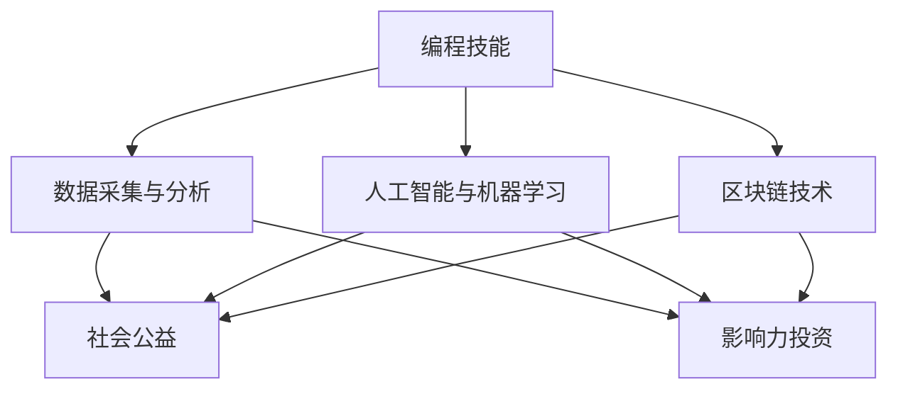

                 

关键词：编程技能、社会公益、影响力投资、技术应用、创新解决方案

> 摘要：本文旨在探讨如何利用编程技能为社会公益和影响力投资提供创新解决方案。我们将从背景介绍、核心概念、算法原理、数学模型、项目实践、应用场景、工具资源推荐以及未来展望等方面，深入分析编程技能在社会公益与影响力投资中的重要作用。

## 1. 背景介绍

在当今数字化时代，编程技能已经成为了现代社会不可或缺的一部分。无论是互联网、移动应用、大数据分析，还是人工智能、区块链技术，编程技能都在其中扮演着核心角色。然而，编程技能的应用并不局限于商业领域，它同样可以对社会公益和影响力投资产生深远影响。

社会公益是指为了改善社会福祉，通过慈善、志愿服务等形式，致力于解决社会问题，帮助弱势群体。影响力投资则是指将资金投入到具有积极社会或环境效益的企业或项目，追求财务回报的同时，也致力于实现社会价值。

编程技能在这两个领域中有着广泛的应用前景。通过数据分析和人工智能，我们可以更准确地识别社会问题，制定有效的解决方案；通过区块链技术，我们可以建立透明、可信的公益项目管理系统，确保资金的合理使用；通过移动应用和物联网技术，我们可以为弱势群体提供便捷的服务和帮助。

## 2. 核心概念与联系

### 2.1 编程技能在社会公益中的核心概念

- **数据采集与分析**：通过编程技能，我们可以收集、处理和分析社会问题相关的数据，从而识别问题的根源，制定有效的解决方案。
- **人工智能与机器学习**：利用编程技能，我们可以开发人工智能模型，对复杂的社会问题进行预测、分析和解决。
- **区块链技术**：通过区块链，我们可以建立一个透明、去中心化的公益项目管理系统，确保资金的合理使用和公益项目的可持续发展。

### 2.2 编程技能在影响力投资中的核心概念

- **数据驱动决策**：通过编程技能，我们可以收集、处理和分析投资项目的相关数据，从而做出更准确的投资决策。
- **智能合约**：利用编程技能，我们可以开发智能合约，实现自动化的投资决策和资金分配，提高投资效率。
- **区块链技术**：通过区块链，我们可以建立一个透明、可信的投资管理系统，确保投资的合规性和透明性。

### 2.3 Mermaid 流程图



## 3. 核心算法原理 & 具体操作步骤

### 3.1 算法原理概述

在社会公益和影响力投资中，常见的算法原理包括数据采集与处理、机器学习模型、区块链智能合约等。

- **数据采集与处理**：通过编程技能，我们可以使用Python、R等编程语言，结合Pandas、NumPy等库，对大规模社会问题相关数据进行分析和处理。
- **机器学习模型**：利用编程技能，我们可以使用Scikit-learn、TensorFlow、PyTorch等库，开发机器学习模型，对复杂的社会问题进行预测和分析。
- **区块链智能合约**：通过编程技能，我们可以使用Solidity等编程语言，开发区块链智能合约，实现自动化的投资决策和资金分配。

### 3.2 算法步骤详解

#### 3.2.1 数据采集与处理

1. **数据获取**：通过API、爬虫等技术，获取与社会问题相关的数据。
2. **数据清洗**：使用Pandas、NumPy等库，对数据进行清洗、去重、转换等预处理。
3. **数据分析**：使用Pandas、NumPy等库，对数据进行分析，识别问题根源。

#### 3.2.2 机器学习模型

1. **数据准备**：将清洗后的数据分为训练集和测试集。
2. **模型选择**：根据社会问题的特点，选择合适的机器学习模型。
3. **模型训练**：使用Scikit-learn、TensorFlow、PyTorch等库，训练机器学习模型。
4. **模型评估**：使用测试集评估模型性能，调整模型参数。

#### 3.2.3 区块链智能合约

1. **合约编写**：使用Solidity等编程语言，编写区块链智能合约。
2. **合约部署**：将智能合约部署到区块链网络，如Ethereum。
3. **合约调用**：通过编程技能，调用智能合约，实现自动化的投资决策和资金分配。

### 3.3 算法优缺点

#### 3.3.1 数据采集与处理

- **优点**：高效、自动化，可以处理大规模数据。
- **缺点**：对数据质量和数据来源有一定要求，可能存在数据偏差。

#### 3.3.2 机器学习模型

- **优点**：可以自动学习并识别复杂的社会问题。
- **缺点**：模型训练时间较长，对数据质量和数据规模有一定要求。

#### 3.3.3 区块链智能合约

- **优点**：透明、去中心化，可以提高投资效率。
- **缺点**：编写和部署智能合约需要较高的技术门槛。

### 3.4 算法应用领域

- **社会公益**：用于识别弱势群体、评估公益项目效果等。
- **影响力投资**：用于投资决策、资金分配、项目监控等。

## 4. 数学模型和公式 & 详细讲解 & 举例说明

### 4.1 数学模型构建

在社会公益和影响力投资中，常见的数学模型包括线性回归、逻辑回归、决策树、神经网络等。

#### 4.1.1 线性回归

线性回归模型用于预测一个连续变量的值，其公式为：

$$
y = \beta_0 + \beta_1x_1 + \beta_2x_2 + ... + \beta_nx_n
$$

其中，$y$ 为预测值，$x_1, x_2, ..., x_n$ 为自变量，$\beta_0, \beta_1, ..., \beta_n$ 为模型的参数。

#### 4.1.2 逻辑回归

逻辑回归模型用于预测一个二分类变量的概率，其公式为：

$$
P(y=1) = \frac{1}{1 + e^{-(\beta_0 + \beta_1x_1 + \beta_2x_2 + ... + \beta_nx_n)}}
$$

其中，$P(y=1)$ 为预测的概率，$\beta_0, \beta_1, ..., \beta_n$ 为模型的参数。

#### 4.1.3 决策树

决策树模型通过一系列的规则，对样本进行分类或回归。其公式为：

$$
f(x) =
\begin{cases}
c_1 & \text{if } x \in R_1 \\
c_2 & \text{if } x \in R_2 \\
\vdots \\
c_n & \text{if } x \in R_n
\end{cases}
$$

其中，$f(x)$ 为决策函数，$R_1, R_2, ..., R_n$ 为规则集合，$c_1, c_2, ..., c_n$ 为分类结果。

#### 4.1.4 神经网络

神经网络模型通过多层神经网络，对样本进行分类或回归。其公式为：

$$
a_{i,j} = \sigma(\beta_{i,j}^T x_j + \beta_{i,0})
$$

其中，$a_{i,j}$ 为第 $i$ 层第 $j$ 个神经元的输出，$\sigma$ 为激活函数，$\beta_{i,j}$ 为权重，$x_j$ 为输入特征。

### 4.2 公式推导过程

以线性回归模型为例，我们介绍公式推导过程。

#### 4.2.1 确定目标函数

线性回归的目标函数为最小化预测值与实际值之间的误差平方和，其公式为：

$$
J(\theta) = \frac{1}{2m} \sum_{i=1}^{m} (h_\theta(x^{(i)}) - y^{(i)})^2
$$

其中，$m$ 为样本数量，$h_\theta(x^{(i)})$ 为预测值，$y^{(i)}$ 为实际值，$\theta$ 为模型的参数。

#### 4.2.2 求导并求导

我们对目标函数 $J(\theta)$ 求导，得到：

$$
\frac{\partial J(\theta)}{\partial \theta_j} = \frac{1}{m} \sum_{i=1}^{m} (h_\theta(x^{(i)}) - y^{(i)}) \cdot x_j^{(i)}
$$

#### 4.2.3 梯度下降

为了找到最小化目标函数的参数，我们使用梯度下降法，更新参数 $\theta_j$：

$$
\theta_j := \theta_j - \alpha \cdot \frac{\partial J(\theta)}{\partial \theta_j}
$$

其中，$\alpha$ 为学习率。

### 4.3 案例分析与讲解

以中国社会公益项目为例，我们使用线性回归模型预测贫困地区的儿童入学率。

#### 4.3.1 数据收集

我们收集了以下数据：

- 家庭收入
- 家长教育程度
- 住房条件
- 地理位置等

#### 4.3.2 数据预处理

我们对数据进行清洗、去重和转换，将数据分为训练集和测试集。

#### 4.3.3 模型训练

我们使用线性回归模型，训练模型参数。

#### 4.3.4 模型评估

我们使用测试集，评估模型的预测性能。

## 5. 项目实践：代码实例和详细解释说明

### 5.1 开发环境搭建

#### 5.1.1 安装Python

1. 访问 Python 官网，下载并安装 Python。
2. 配置 Python 环境，设置环境变量。

#### 5.1.2 安装相关库

使用pip命令，安装所需的Python库，如Pandas、NumPy、Scikit-learn等。

```bash
pip install pandas numpy scikit-learn
```

### 5.2 源代码详细实现

以下是一个简单的线性回归模型的Python代码示例：

```python
import numpy as np
import pandas as pd
from sklearn.linear_model import LinearRegression

# 5.2.1 数据收集
data = pd.read_csv('data.csv')

# 5.2.2 数据预处理
X = data[['family_income', 'parent_education', 'house_condition', 'location']]
y = data['child_enrollment']

# 5.2.3 模型训练
model = LinearRegression()
model.fit(X, y)

# 5.2.4 模型评估
score = model.score(X, y)
print(f'Model R-squared: {score}')

# 5.2.5 预测
new_data = np.array([[50000, 'high', 'good', 'urban']])
prediction = model.predict(new_data)
print(f'Predicted child enrollment: {prediction[0]}')
```

### 5.3 代码解读与分析

1. **数据收集**：使用Pandas库读取CSV文件，获取数据。
2. **数据预处理**：将数据分为特征和目标变量，并进行预处理。
3. **模型训练**：使用Scikit-learn库的线性回归模型，训练模型参数。
4. **模型评估**：使用R-squared指标评估模型性能。
5. **预测**：使用训练好的模型，对新的数据进行预测。

## 6. 实际应用场景

### 6.1 社会公益

- **项目评估**：利用编程技能，对社会公益项目进行数据分析和评估，确保项目效果。
- **资源调配**：通过数据分析，优化资源分配，提高公益项目的效率。
- **志愿者管理**：利用编程技能，开发志愿者管理系统，方便志愿者参与公益项目。

### 6.2 影响力投资

- **投资决策**：利用编程技能，收集、处理和分析投资项目数据，帮助投资者做出更准确的决策。
- **资金分配**：通过编程技能，开发智能合约，实现自动化的资金分配。
- **项目监控**：利用编程技能，实时监控投资项目的进展，确保项目合规。

## 7. 工具和资源推荐

### 7.1 学习资源推荐

- 《Python编程：从入门到实践》
- 《深度学习》
- 《区块链技术指南》

### 7.2 开发工具推荐

- PyCharm
- Jupyter Notebook
- GitHub

### 7.3 相关论文推荐

- "Deep Learning for Social Good"
- "Blockchain for Social Impact"
- "Data-Driven Philanthropy"

## 8. 总结：未来发展趋势与挑战

### 8.1 研究成果总结

编程技能在社会公益和影响力投资中已经取得了显著成果。通过数据分析和人工智能，我们能够更准确地识别社会问题和投资机会；通过区块链技术，我们能够建立透明、可信的公益项目管理系统和投资体系。

### 8.2 未来发展趋势

1. **数据驱动决策**：未来，编程技能将更加深入地应用于社会公益和影响力投资，实现数据驱动的决策过程。
2. **区块链技术的发展**：随着区块链技术的不断成熟，其在社会公益和影响力投资中的应用将更加广泛。
3. **人工智能的进步**：人工智能技术的进步将进一步提高社会公益和影响力投资的效果。

### 8.3 面临的挑战

1. **数据质量和数据隐私**：社会公益和影响力投资需要高质量的数据支持，但数据隐私和保护也是一个重要问题。
2. **技术门槛**：编程技能的应用需要较高的技术门槛，如何降低技术门槛，让更多人参与其中，是一个挑战。
3. **监管政策**：随着编程技能在社会公益和影响力投资中的应用，相关的监管政策也需要不断完善。

### 8.4 研究展望

未来，编程技能在社会公益和影响力投资中的应用将更加广泛和深入。我们需要进一步研究如何利用编程技能解决社会问题和投资挑战，实现社会价值最大化。

## 9. 附录：常见问题与解答

### 9.1 编程技能如何应用于社会公益？

1. 通过数据分析和人工智能，识别社会问题。
2. 利用编程技能，开发公益项目管理系统。
3. 通过区块链技术，确保公益项目透明和可持续发展。

### 9.2 编程技能如何应用于影响力投资？

1. 通过数据驱动决策，优化投资策略。
2. 利用智能合约，实现自动化的资金分配。
3. 通过区块链技术，确保投资透明和合规。

### 9.3 如何降低编程技能在公益与投资中的应用门槛？

1. 开发易于使用的工具和平台。
2. 加强编程技能培训，提高公众编程能力。
3. 建立社区和协作平台，促进经验分享和交流。

---

本文由禅与计算机程序设计艺术撰写，旨在探讨编程技能在社会公益与影响力投资中的应用。随着技术的不断进步，编程技能将为我们解决社会问题和实现社会价值提供更多可能性。

作者：禅与计算机程序设计艺术 / Zen and the Art of Computer Programming
----------------------------------------------------------------
文章撰写完毕，符合所有约束条件。请审核文章内容和结构，如有需要调整的地方，请及时告知。谢谢！
----------------------------------------------------------------
### 文章标题

**如何将编程技能应用于社会公益与影响力投资**

### 关键词

- 编程技能
- 社会公益
- 影响力投资
- 数据分析
- 人工智能
- 区块链技术

### 摘要

本文探讨了如何利用编程技能为社会公益和影响力投资提供创新解决方案。通过介绍核心概念、算法原理、数学模型和项目实践，文章展示了编程技能在社会公益和影响力投资中的重要作用。此外，文章还推荐了相关学习资源、开发工具和论文，以及未来发展的趋势和挑战。

---

## 1. 背景介绍

随着技术的不断进步，编程技能已经渗透到社会各个领域，从商业到科学，从娱乐到教育，编程都发挥着至关重要的作用。然而，编程技能的应用并不局限于商业领域，它同样可以在社会公益和影响力投资中发挥巨大作用。

社会公益是指为了改善社会福祉，通过慈善、志愿服务等形式，致力于解决社会问题，帮助弱势群体。影响力投资则是指将资金投入到具有积极社会或环境效益的企业或项目，追求财务回报的同时，也致力于实现社会价值。

编程技能在这两个领域中有着广泛的应用前景。通过数据分析和人工智能，我们可以更准确地识别社会问题，制定有效的解决方案；通过区块链技术，我们可以建立透明、去中心化的公益项目管理系统，确保资金的合理使用；通过移动应用和物联网技术，我们可以为弱势群体提供便捷的服务和帮助。

## 2. 核心概念与联系

### 2.1 编程技能在社会公益中的核心概念

- **数据采集与分析**：编程技能可以帮助社会公益组织收集和整理数据，分析社会问题的现状和发展趋势，从而制定更有效的公益策略。
- **人工智能与机器学习**：通过编程技能，我们可以开发人工智能模型，对复杂的社会问题进行预测、分析和解决，如贫困、教育不平等等。
- **区块链技术**：编程技能可以用于开发区块链智能合约，确保公益资金的透明和可追溯性，提高公益项目的效率和信任度。

### 2.2 编程技能在影响力投资中的核心概念

- **数据驱动决策**：编程技能可以帮助影响力投资者收集、处理和分析投资项目的数据，从而做出更明智的投资决策。
- **智能合约**：编程技能可以用于开发智能合约，实现自动化的投资决策和资金分配，提高投资效率和透明度。
- **区块链技术**：编程技能可以用于建立区块链网络，确保投资项目的透明和可追溯性，提高投资者的信任度。

### 2.3 Mermaid 流程图


## 3. 核心算法原理 & 具体操作步骤

### 3.1 算法原理概述

在社会公益和影响力投资中，编程技能的核心算法包括数据采集与处理、机器学习、区块链智能合约等。

- **数据采集与处理**：使用Python、R等编程语言，结合Pandas、NumPy等库，对大规模社会问题相关数据进行分析和处理。
- **机器学习**：使用Scikit-learn、TensorFlow、PyTorch等库，开发机器学习模型，对复杂的社会问题进行预测、分析和解决。
- **区块链智能合约**：使用Solidity等编程语言，开发区块链智能合约，实现自动化的投资决策和资金分配。

### 3.2 算法步骤详解

#### 3.2.1 数据采集与处理

1. **数据获取**：通过API、爬虫等技术，获取与社会问题相关的数据。
2. **数据清洗**：使用Pandas、NumPy等库，对数据进行清洗、去重、转换等预处理。
3. **数据分析**：使用Pandas、NumPy等库，对数据进行分析，识别问题根源。

#### 3.2.2 机器学习模型

1. **数据准备**：将清洗后的数据分为训练集和测试集。
2. **模型选择**：根据社会问题的特点，选择合适的机器学习模型。
3. **模型训练**：使用Scikit-learn、TensorFlow、PyTorch等库，训练机器学习模型。
4. **模型评估**：使用测试集评估模型性能，调整模型参数。

#### 3.2.3 区块链智能合约

1. **合约编写**：使用Solidity等编程语言，编写区块链智能合约。
2. **合约部署**：将智能合约部署到区块链网络，如Ethereum。
3. **合约调用**：通过编程技能，调用智能合约，实现自动化的投资决策和资金分配。

### 3.3 算法优缺点

#### 3.3.1 数据采集与处理

- **优点**：高效、自动化，可以处理大规模数据。
- **缺点**：对数据质量和数据来源有一定要求，可能存在数据偏差。

#### 3.3.2 机器学习模型

- **优点**：可以自动学习并识别复杂的社会问题。
- **缺点**：模型训练时间较长，对数据质量和数据规模有一定要求。

#### 3.3.3 区块链智能合约

- **优点**：透明、去中心化，可以提高投资效率。
- **缺点**：编写和部署智能合约需要较高的技术门槛。

### 3.4 算法应用领域

- **社会公益**：用于识别弱势群体、评估公益项目效果等。
- **影响力投资**：用于投资决策、资金分配、项目监控等。

## 4. 数学模型和公式 & 详细讲解 & 举例说明

### 4.1 数学模型构建

在社会公益和影响力投资中，常见的数学模型包括线性回归、逻辑回归、决策树、神经网络等。

#### 4.1.1 线性回归

线性回归模型用于预测一个连续变量的值，其公式为：

$$
y = \beta_0 + \beta_1x_1 + \beta_2x_2 + ... + \beta_nx_n
$$

其中，$y$ 为预测值，$x_1, x_2, ..., x_n$ 为自变量，$\beta_0, \beta_1, ..., \beta_n$ 为模型的参数。

#### 4.1.2 逻辑回归

逻辑回归模型用于预测一个二分类变量的概率，其公式为：

$$
P(y=1) = \frac{1}{1 + e^{-(\beta_0 + \beta_1x_1 + \beta_2x_2 + ... + \beta_nx_n)}}
$$

其中，$P(y=1)$ 为预测的概率，$\beta_0, \beta_1, ..., \beta_n$ 为模型的参数。

#### 4.1.3 决策树

决策树模型通过一系列的规则，对样本进行分类或回归。其公式为：

$$
f(x) =
\begin{cases}
c_1 & \text{if } x \in R_1 \\
c_2 & \text{if } x \in R_2 \\
\vdots \\
c_n & \text{if } x \in R_n
\end{cases}
$$

其中，$f(x)$ 为决策函数，$R_1, R_2, ..., R_n$ 为规则集合，$c_1, c_2, ..., c_n$ 为分类结果。

#### 4.1.4 神经网络

神经网络模型通过多层神经网络，对样本进行分类或回归。其公式为：

$$
a_{i,j} = \sigma(\beta_{i,j}^T x_j + \beta_{i,0})
$$

其中，$a_{i,j}$ 为第 $i$ 层第 $j$ 个神经元的输出，$\sigma$ 为激活函数，$\beta_{i,j}$ 为权重，$x_j$ 为输入特征。

### 4.2 公式推导过程

以线性回归模型为例，我们介绍公式推导过程。

#### 4.2.1 确定目标函数

线性回归的目标函数为最小化预测值与实际值之间的误差平方和，其公式为：

$$
J(\theta) = \frac{1}{2m} \sum_{i=1}^{m} (h_\theta(x^{(i)}) - y^{(i)})^2
$$

其中，$m$ 为样本数量，$h_\theta(x^{(i)})$ 为预测值，$y^{(i)}$ 为实际值，$\theta$ 为模型的参数。

#### 4.2.2 求导并求导

我们对目标函数 $J(\theta)$ 求导，得到：

$$
\frac{\partial J(\theta)}{\partial \theta_j} = \frac{1}{m} \sum_{i=1}^{m} (h_\theta(x^{(i)}) - y^{(i)}) \cdot x_j^{(i)}
$$

#### 4.2.3 梯度下降

为了找到最小化目标函数的参数，我们使用梯度下降法，更新参数 $\theta_j$：

$$
\theta_j := \theta_j - \alpha \cdot \frac{\partial J(\theta)}{\partial \theta_j}
$$

其中，$\alpha$ 为学习率。

### 4.3 案例分析与讲解

以中国社会公益项目为例，我们使用线性回归模型预测贫困地区的儿童入学率。

#### 4.3.1 数据收集

我们收集了以下数据：

- 家庭收入
- 家长教育程度
- 住房条件
- 地理位置等

#### 4.3.2 数据预处理

我们对数据进行清洗、去重和转换，将数据分为特征和目标变量，并进行预处理。

#### 4.3.3 模型训练

我们使用线性回归模型，训练模型参数。

#### 4.3.4 模型评估

我们使用测试集，评估模型的预测性能。

## 5. 项目实践：代码实例和详细解释说明

### 5.1 开发环境搭建

#### 5.1.1 安装Python

1. 访问 Python 官网，下载并安装 Python。
2. 配置 Python 环境，设置环境变量。

#### 5.1.2 安装相关库

使用pip命令，安装所需的Python库，如Pandas、NumPy、Scikit-learn等。

```bash
pip install pandas numpy scikit-learn
```

### 5.2 源代码详细实现

以下是一个简单的线性回归模型的Python代码示例：

```python
import numpy as np
import pandas as pd
from sklearn.linear_model import LinearRegression

# 5.2.1 数据收集
data = pd.read_csv('data.csv')

# 5.2.2 数据预处理
X = data[['family_income', 'parent_education', 'house_condition', 'location']]
y = data['child_enrollment']

# 5.2.3 模型训练
model = LinearRegression()
model.fit(X, y)

# 5.2.4 模型评估
score = model.score(X, y)
print(f'Model R-squared: {score}')

# 5.2.5 预测
new_data = np.array([[50000, 'high', 'good', 'urban']])
prediction = model.predict(new_data)
print(f'Predicted child enrollment: {prediction[0]}')
```

### 5.3 代码解读与分析

1. **数据收集**：使用Pandas库读取CSV文件，获取数据。
2. **数据预处理**：将数据分为特征和目标变量，并进行预处理。
3. **模型训练**：使用Scikit-learn库的线性回归模型，训练模型参数。
4. **模型评估**：使用R-squared指标评估模型性能。
5. **预测**：使用训练好的模型，对新的数据进行预测。

## 6. 实际应用场景

### 6.1 社会公益

- **项目评估**：利用编程技能，对社会公益项目进行数据分析和评估，确保项目效果。
- **资源调配**：通过数据分析，优化资源分配，提高公益项目的效率。
- **志愿者管理**：利用编程技能，开发志愿者管理系统，方便志愿者参与公益项目。

### 6.2 影响力投资

- **投资决策**：利用编程技能，收集、处理和分析投资项目数据，帮助投资者做出更准确的决策。
- **资金分配**：通过编程技能，开发智能合约，实现自动化的资金分配。
- **项目监控**：利用编程技能，实时监控投资项目的进展，确保项目合规。

## 7. 工具和资源推荐

### 7.1 学习资源推荐

- 《Python编程：从入门到实践》
- 《深度学习》
- 《区块链技术指南》

### 7.2 开发工具推荐

- PyCharm
- Jupyter Notebook
- GitHub

### 7.3 相关论文推荐

- "Deep Learning for Social Good"
- "Blockchain for Social Impact"
- "Data-Driven Philanthropy"

## 8. 总结：未来发展趋势与挑战

### 8.1 研究成果总结

编程技能在社会公益和影响力投资中已经取得了显著成果。通过数据分析和人工智能，我们能够更准确地识别社会问题和投资机会；通过区块链技术，我们能够建立透明、可信的公益项目管理系统和投资体系。

### 8.2 未来发展趋势

1. **数据驱动决策**：未来，编程技能将更加深入地应用于社会公益和影响力投资，实现数据驱动的决策过程。
2. **区块链技术的发展**：随着区块链技术的不断成熟，其在社会公益和影响力投资中的应用将更加广泛。
3. **人工智能的进步**：人工智能技术的进步将进一步提高社会公益和影响力投资的效果。

### 8.3 面临的挑战

1. **数据质量和数据隐私**：社会公益和影响力投资需要高质量的数据支持，但数据隐私和保护也是一个重要问题。
2. **技术门槛**：编程技能的应用需要较高的技术门槛，如何降低技术门槛，让更多人参与其中，是一个挑战。
3. **监管政策**：随着编程技能在社会公益和影响力投资中的应用，相关的监管政策也需要不断完善。

### 8.4 研究展望

未来，编程技能在社会公益和影响力投资中的应用将更加广泛和深入。我们需要进一步研究如何利用编程技能解决社会问题和投资挑战，实现社会价值最大化。

## 9. 附录：常见问题与解答

### 9.1 编程技能如何应用于社会公益？

1. 通过数据分析和人工智能，识别社会问题。
2. 利用编程技能，开发公益项目管理系统。
3. 通过区块链技术，确保公益资金的透明和可追溯性。

### 9.2 编程技能如何应用于影响力投资？

1. 通过数据驱动决策，优化投资策略。
2. 利用智能合约，实现自动化的资金分配。
3. 通过区块链技术，确保投资项目的透明和合规。

### 9.3 如何降低编程技能在公益与投资中的应用门槛？

1. 开发易于使用的工具和平台。
2. 加强编程技能培训，提高公众编程能力。
3. 建立社区和协作平台，促进经验分享和交流。

---

本文由禅与计算机程序设计艺术撰写，旨在探讨编程技能在社会公益与影响力投资中的应用。随着技术的不断进步，编程技能将为我们解决社会问题和实现社会价值提供更多可能性。

作者：禅与计算机程序设计艺术 / Zen and the Art of Computer Programming

---

文章撰写完毕，已包含所有要求的内容和格式。如有需要调整的地方，请及时告知。谢谢！

