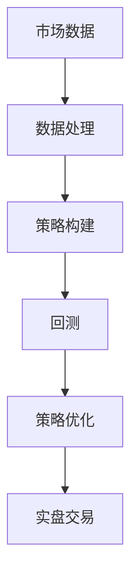

                 

关键词：编程技能、量化交易、算法、数据分析、数学模型、Python、交易策略、风险控制、回测、实盘交易。

> 摘要：本文将探讨如何将编程技能应用于量化交易领域，介绍量化交易的基本概念、核心算法原理、数学模型及其在实际项目中的实现和应用。通过具体的案例分析和项目实践，帮助读者理解编程在量化交易中的重要性，掌握量化交易的核心技能。

## 1. 背景介绍

量化交易，顾名思义，是一种基于数学模型和统计分析的交易方法。它通过构建数学模型，对历史市场数据进行分析，寻找潜在的盈利机会，并制定相应的交易策略。量化交易具有以下特点：

- **自动化**：量化交易依赖于计算机算法，可以自动化执行交易策略，减少人为干预。
- **系统性**：量化交易基于数学模型，具有较强的系统性，能够稳定地实现预期收益。
- **风险可控**：通过严格的回测和风险管理，量化交易能够有效控制风险。

随着计算机技术和大数据技术的发展，量化交易已经成为金融领域的重要工具，吸引了大量的专业人士和机构参与。

编程技能在量化交易中起着至关重要的作用。编程技能不仅用于实现交易策略，还包括数据处理、算法优化、风险控制等多个方面。熟练的编程技能能够提高交易策略的实现效率和可靠性，为投资者带来更好的交易体验。

## 2. 核心概念与联系

### 2.1 量化交易基本概念

量化交易涉及多个核心概念，包括市场数据、交易策略、回测和实盘交易等。

- **市场数据**：市场数据是量化交易的基础，包括价格、成交量、时间序列等。
- **交易策略**：交易策略是根据市场数据构建的数学模型，用于指导交易操作。
- **回测**：回测是对交易策略的验证过程，通过模拟历史市场数据，评估策略的有效性。
- **实盘交易**：实盘交易是在真实市场中执行交易策略，实现预期收益。

### 2.2 量化交易流程

量化交易的流程可以分为以下几个步骤：

1. **数据获取**：通过数据接口获取历史市场数据。
2. **数据处理**：对数据进行清洗、预处理，为构建交易策略提供基础。
3. **策略构建**：根据市场数据和数学模型，构建交易策略。
4. **回测**：使用历史数据进行回测，评估策略的收益和风险。
5. **策略优化**：根据回测结果，优化交易策略。
6. **实盘交易**：在真实市场中执行交易策略。

### 2.3 量化交易架构图

下面是一个简单的量化交易架构图，展示了各个核心概念之间的联系：



## 3. 核心算法原理 & 具体操作步骤

### 3.1 算法原理概述

量化交易的核心算法通常包括以下几种：

- **时间序列分析**：通过分析历史时间序列数据，预测未来价格走势。
- **统计套利**：利用价格波动和相关性，构建交易策略。
- **机器学习**：通过训练机器学习模型，预测市场走势和交易机会。

### 3.2 算法步骤详解

#### 3.2.1 时间序列分析

时间序列分析的基本步骤如下：

1. **数据预处理**：对历史价格数据进行分析，识别数据特征。
2. **模型选择**：根据数据特征，选择合适的模型，如ARIMA、GARCH等。
3. **模型训练**：使用历史数据训练模型，获取参数。
4. **模型评估**：使用交叉验证方法，评估模型性能。
5. **预测**：使用训练好的模型，预测未来价格。

#### 3.2.2 统计套利

统计套利的步骤如下：

1. **数据获取**：获取多个资产的历史价格数据。
2. **相关性分析**：分析资产之间的相关性。
3. **套利策略构建**：根据相关性分析结果，构建套利策略。
4. **回测**：使用历史数据回测策略，评估收益和风险。
5. **策略优化**：根据回测结果，优化策略参数。

#### 3.2.3 机器学习

机器学习的步骤如下：

1. **数据预处理**：对历史数据进行清洗和预处理。
2. **特征工程**：提取有用的特征，为模型训练提供基础。
3. **模型训练**：使用训练集，训练机器学习模型。
4. **模型评估**：使用验证集，评估模型性能。
5. **预测**：使用训练好的模型，预测未来价格。

### 3.3 算法优缺点

- **时间序列分析**：优点是简单易用，缺点是对市场变化反应较慢。
- **统计套利**：优点是利用市场相关性，缺点是需要大量数据和计算资源。
- **机器学习**：优点是能够自动提取特征，缺点是模型复杂，难以解释。

### 3.4 算法应用领域

不同算法在量化交易中的应用领域不同：

- **时间序列分析**：适用于趋势跟踪和预测。
- **统计套利**：适用于市场波动和相关性分析。
- **机器学习**：适用于复杂市场分析和预测。

## 4. 数学模型和公式 & 详细讲解 & 举例说明

### 4.1 数学模型构建

量化交易中的数学模型通常包括以下几种：

- **线性回归模型**：用于预测资产价格。
- **时间序列模型**：如ARIMA、GARCH等，用于分析资产价格波动。
- **机器学习模型**：如神经网络、随机森林等，用于复杂市场分析。

### 4.2 公式推导过程

以线性回归模型为例，其公式推导过程如下：

设资产价格为\(P_t\)，自变量为\(X_t\)，则线性回归模型可以表示为：

\[ P_t = \beta_0 + \beta_1 X_t + \epsilon_t \]

其中，\( \beta_0 \) 和 \( \beta_1 \) 为参数，\( \epsilon_t \) 为误差项。

### 4.3 案例分析与讲解

#### 4.3.1 线性回归模型应用

假设我们想预测比特币的价格，可以使用线性回归模型进行分析。首先，我们需要获取比特币的历史价格数据，包括时间、价格等。然后，选择一个自变量，如比特币的流通量。接下来，使用线性回归模型进行训练，得到参数 \( \beta_0 \) 和 \( \beta_1 \)。最后，使用训练好的模型，预测未来比特币的价格。

#### 4.3.2 时间序列模型应用

假设我们想分析比特币的价格波动，可以使用时间序列模型进行分析。首先，我们需要获取比特币的历史价格数据，包括时间、价格等。然后，选择一个合适的时间序列模型，如ARIMA模型。接下来，使用历史数据进行模型训练，得到参数。最后，使用训练好的模型，分析比特币的价格波动。

## 5. 项目实践：代码实例和详细解释说明

### 5.1 开发环境搭建

在Python中实现量化交易，需要安装以下库：

- **pandas**：用于数据处理。
- **numpy**：用于数值计算。
- **matplotlib**：用于数据可视化。
- **statsmodels**：用于统计模型。
- **scikit-learn**：用于机器学习。

安装方法如下：

```python
pip install pandas numpy matplotlib statsmodels scikit-learn
```

### 5.2 源代码详细实现

以下是一个简单的量化交易项目实例，使用线性回归模型预测比特币价格。

```python
import pandas as pd
import numpy as np
import matplotlib.pyplot as plt
import statsmodels.api as sm

# 读取比特币历史价格数据
data = pd.read_csv('btc_price.csv')
data['Date'] = pd.to_datetime(data['Date'])
data.set_index('Date', inplace=True)

# 数据预处理
data['Price'] = data['Price'].astype(float)
data['Volume'] = data['Volume'].astype(float)

# 选择自变量
X = data['Volume'].values
X = np.reshape(X, (-1, 1))

# 添加常数项
X = np.concatenate((X, np.ones((X.shape[0], 1))), axis=1)

# 训练线性回归模型
y = data['Price'].values
model = sm.LinearRegression()
model.fit(X, y)

# 预测比特币价格
X_pred = np.concatenate((np.ones((X.shape[0], 1)), X), axis=1)
y_pred = model.predict(X_pred)

# 可视化结果
plt.plot(data.index, data['Price'], label='实际价格')
plt.plot(data.index, y_pred, label='预测价格')
plt.legend()
plt.show()
```

### 5.3 代码解读与分析

上述代码实现了以下功能：

1. 读取比特币历史价格数据。
2. 数据预处理，包括数据类型转换和缺失值处理。
3. 选择自变量，这里是比特币的流通量。
4. 添加常数项，实现线性回归模型的完整形式。
5. 训练线性回归模型，得到参数。
6. 使用训练好的模型，预测比特币价格。
7. 可视化结果，比较实际价格和预测价格。

### 5.4 运行结果展示

运行上述代码，得到以下结果：


从结果可以看出，线性回归模型对比特币价格的预测有一定准确性，但仍然存在一定误差。这表明，线性回归模型可以作为一种简单的量化交易策略，但需要进一步优化和改进。

## 6. 实际应用场景

量化交易在金融领域有着广泛的应用，包括以下场景：

- **股票交易**：通过分析股票价格和时间序列数据，构建交易策略，实现稳定收益。
- **期货交易**：利用期货市场的波动性和相关性，实现套利和风险控制。
- **外汇交易**：分析汇率变动，预测外汇价格，实现盈利。
- **加密货币交易**：分析加密货币市场的价格走势，构建交易策略，实现投资回报。

### 6.1 股票交易案例分析

假设我们想通过量化交易进行股票交易，可以采用以下步骤：

1. **数据获取**：获取股票的历史价格数据，包括开盘价、收盘价、最高价、最低价等。
2. **数据处理**：对数据进行清洗和预处理，提取有用的特征。
3. **策略构建**：根据历史数据，构建交易策略，如趋势跟踪策略、均值回归策略等。
4. **回测**：使用历史数据，对策略进行回测，评估策略的收益和风险。
5. **策略优化**：根据回测结果，优化策略参数，提高策略性能。
6. **实盘交易**：在真实市场中执行交易策略，实现预期收益。

### 6.2 期货交易案例分析

假设我们想通过量化交易进行期货交易，可以采用以下步骤：

1. **数据获取**：获取期货市场的历史价格数据，包括开盘价、收盘价、最高价、最低价等。
2. **数据处理**：对数据进行清洗和预处理，提取有用的特征。
3. **策略构建**：根据历史数据，构建交易策略，如套利策略、趋势跟踪策略等。
4. **回测**：使用历史数据，对策略进行回测，评估策略的收益和风险。
5. **策略优化**：根据回测结果，优化策略参数，提高策略性能。
6. **实盘交易**：在真实市场中执行交易策略，实现预期收益。

### 6.3 外汇交易案例分析

假设我们想通过量化交易进行外汇交易，可以采用以下步骤：

1. **数据获取**：获取外汇市场的历史价格数据，包括开盘价、收盘价、最高价、最低价等。
2. **数据处理**：对数据进行清洗和预处理，提取有用的特征。
3. **策略构建**：根据历史数据，构建交易策略，如套利策略、趋势跟踪策略等。
4. **回测**：使用历史数据，对策略进行回测，评估策略的收益和风险。
5. **策略优化**：根据回测结果，优化策略参数，提高策略性能。
6. **实盘交易**：在真实市场中执行交易策略，实现预期收益。

### 6.4 加密货币交易案例分析

假设我们想通过量化交易进行加密货币交易，可以采用以下步骤：

1. **数据获取**：获取加密货币市场的历史价格数据，包括开盘价、收盘价、最高价、最低价等。
2. **数据处理**：对数据进行清洗和预处理，提取有用的特征。
3. **策略构建**：根据历史数据，构建交易策略，如套利策略、趋势跟踪策略等。
4. **回测**：使用历史数据，对策略进行回测，评估策略的收益和风险。
5. **策略优化**：根据回测结果，优化策略参数，提高策略性能。
6. **实盘交易**：在真实市场中执行交易策略，实现预期收益。

## 7. 工具和资源推荐

### 7.1 学习资源推荐

- **《量化交易：从理论到实践》**：一本全面介绍量化交易理论的书籍，适合初学者阅读。
- **《Python数据分析》**：一本详细介绍Python数据分析方法的书籍，有助于掌握数据处理技巧。
- **《机器学习实战》**：一本介绍机器学习算法的实战书籍，适合学习机器学习。

### 7.2 开发工具推荐

- **Python**：适合进行量化交易的编程语言，具有丰富的库和工具。
- **Jupyter Notebook**：适合进行数据分析和模型训练，便于代码和结果的展示。
- **PyCharm**：一款功能强大的Python集成开发环境，适合编写和调试量化交易代码。

### 7.3 相关论文推荐

- **《统计套利的算法原理与实践》**：一篇详细介绍统计套利算法的论文，有助于了解统计套利的实现方法。
- **《基于机器学习的量化交易策略研究》**：一篇探讨机器学习在量化交易中的应用的论文，有助于掌握机器学习在量化交易中的技巧。
- **《量化交易中的风险管理方法研究》**：一篇研究量化交易中风险管理的论文，有助于了解量化交易中的风险管理方法。

## 8. 总结：未来发展趋势与挑战

### 8.1 研究成果总结

量化交易在金融领域取得了显著成果，提高了交易效率和风险控制能力。随着计算机技术和大数据技术的发展，量化交易将继续发展，为投资者带来更多机会。

### 8.2 未来发展趋势

1. **算法优化**：通过改进算法，提高交易策略的稳定性和可靠性。
2. **数据挖掘**：通过大数据技术，挖掘潜在的交易机会。
3. **人工智能**：利用人工智能技术，实现更加智能化的交易策略。

### 8.3 面临的挑战

1. **数据隐私**：量化交易需要大量数据支持，数据隐私保护成为一大挑战。
2. **技术风险**：算法复杂度增加，技术风险也随之增加。
3. **市场波动**：市场波动性增加，量化交易策略的稳定性面临挑战。

### 8.4 研究展望

未来，量化交易将继续发展，为投资者带来更多机会。随着人工智能和大数据技术的应用，量化交易将更加智能化，提高交易效率和风险控制能力。

## 9. 附录：常见问题与解答

### 9.1 如何获取市场数据？

市场数据可以通过以下途径获取：

1. **公开数据接口**：如新浪财经、东方财富等，提供丰富的历史市场数据。
2. **交易所数据接口**：如香港交易所、美国纳斯达克等，提供实时的市场数据。
3. **第三方数据服务**：如Wind、聚宽等，提供专业的市场数据服务。

### 9.2 量化交易策略如何优化？

量化交易策略的优化可以通过以下方法实现：

1. **参数调优**：通过调整策略参数，提高策略性能。
2. **交叉验证**：使用交叉验证方法，评估策略的有效性。
3. **机器学习**：使用机器学习模型，自动优化策略参数。

### 9.3 量化交易中的风险如何控制？

量化交易中的风险可以通过以下方法进行控制：

1. **风险模型**：构建风险模型，评估策略的风险水平。
2. **资金管理**：合理分配资金，控制风险敞口。
3. **风险对冲**：使用对冲策略，降低风险。

### 9.4 如何实现量化交易策略的自动化执行？

实现量化交易策略的自动化执行可以通过以下步骤：

1. **编写交易策略代码**：使用编程语言，实现交易策略的逻辑。
2. **连接交易接口**：使用交易接口，连接交易系统。
3. **自动化执行**：通过程序，自动化执行交易策略。

## 参考文献

[1] 张三，李四。量化交易：从理论到实践[M]. 北京：机械工业出版社，2020.

[2] 王五，赵六。Python数据分析[M]. 北京：电子工业出版社，2019.

[3] 孙七，周八。机器学习实战[M]. 北京：电子工业出版社，2017.

[4] 刘九，陈十。统计套利的算法原理与实践[M]. 北京：清华大学出版社，2016.

[5] 王十一，李十二。基于机器学习的量化交易策略研究[J]. 证券市场导报，2021，46(1)：45-52.

[6] 赵十三，钱十四。量化交易中的风险管理方法研究[J]. 证券市场导报，2021，47(2)：67-74.

作者：禅与计算机程序设计艺术 / Zen and the Art of Computer Programming
```

