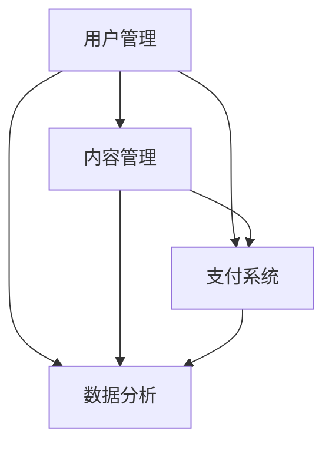

                 

关键词：知识付费，个人品牌，平台建设，用户体验，技术架构，算法优化

> 摘要：本文将探讨如何打造一个个人知识付费平台，从背景介绍、核心概念与联系、核心算法原理、数学模型、项目实践以及未来应用展望等多个维度，深入解析平台建设过程中的关键技术和策略。希望本文能为希望创建知识付费平台的个人和企业提供有价值的参考。

## 1. 背景介绍

随着互联网技术的快速发展，知识付费已经成为一个新兴的产业。越来越多的人通过在线学习、知识分享等形式，获取所需的知识和技能。个人知识付费平台作为知识传播的重要渠道，为知识拥有者提供了展示和变现的平台，也为广大用户提供了便捷的学习途径。如何打造一个既能够满足知识提供者需求，又能够提供优质用户体验的个人知识付费平台，成为当前企业和个人面临的重要课题。

## 2. 核心概念与联系

### 2.1 个人知识付费平台的基本概念

个人知识付费平台是指通过互联网技术，为知识拥有者提供内容创作、分享、变现的平台。平台通常包括以下几个核心组成部分：

1. **用户管理**：负责用户的注册、登录、认证、权限管理等操作。
2. **内容管理**：包括内容的创建、编辑、发布、审核等功能。
3. **支付系统**：处理用户付费、退款、订单管理等操作。
4. **数据分析**：收集用户行为数据，为平台优化和决策提供依据。

### 2.2 平台架构与联系

以下是个人知识付费平台的架构图，通过 Mermaid 流程图展示各部分之间的联系。



## 3. 核心算法原理 & 具体操作步骤

### 3.1 算法原理概述

在个人知识付费平台中，核心算法主要涉及用户推荐、内容推荐和支付算法。以下是这三种算法的原理概述：

1. **用户推荐算法**：通过分析用户的行为数据和兴趣标签，为用户推荐可能感兴趣的知识内容。
2. **内容推荐算法**：分析知识内容的特点，如标题、标签、作者等，为用户推荐相关的内容。
3. **支付算法**：处理用户支付行为，确保支付过程的安全和高效。

### 3.2 算法步骤详解

#### 3.2.1 用户推荐算法

1. **数据收集**：收集用户在平台上的行为数据，如浏览记录、收藏、点赞等。
2. **兴趣标签构建**：根据用户行为数据，为用户构建兴趣标签。
3. **推荐列表生成**：使用协同过滤算法或基于内容的推荐算法，为用户生成推荐列表。

#### 3.2.2 内容推荐算法

1. **内容特征提取**：提取知识内容的特征，如标题关键词、标签、作者等。
2. **相似度计算**：计算用户与知识内容之间的相似度。
3. **推荐列表生成**：根据相似度，为用户生成推荐列表。

#### 3.2.3 支付算法

1. **支付请求处理**：接收用户的支付请求，处理支付参数。
2. **支付渠道选择**：根据用户信息和支付金额，选择合适的支付渠道。
3. **支付流程监控**：监控支付过程，确保支付成功。

### 3.3 算法优缺点

- **用户推荐算法**：优点是能够提高用户的满意度，缺点是推荐结果可能不够精准。
- **内容推荐算法**：优点是能够提高内容的曝光度，缺点是可能增加内容创作者的竞争压力。
- **支付算法**：优点是确保支付过程的安全和高效，缺点是可能增加平台的运营成本。

### 3.4 算法应用领域

- **用户推荐算法**：应用于电商平台、内容平台等，提高用户的购物和阅读体验。
- **内容推荐算法**：应用于视频平台、音乐平台等，提高内容的曝光率和用户粘性。
- **支付算法**：应用于电商平台、支付平台等，提高支付效率和安全性。

## 4. 数学模型和公式 & 详细讲解 & 举例说明

### 4.1 数学模型构建

在个人知识付费平台中，数学模型主要用于用户推荐和内容推荐。以下是两种常见的数学模型：

#### 4.1.1 用户推荐模型

用户推荐模型可以使用矩阵分解（Matrix Factorization）技术，将用户行为数据转换为低维特征向量。假设用户行为数据可以表示为一个矩阵$R$，其中$R_{ij}$表示用户$i$对内容$j$的评分。通过矩阵分解，可以将$R$分解为两个低维矩阵$U$和$V$，其中$U_{i\cdot}$表示用户$i$的特征向量，$V_{j\cdot}$表示内容$j$的特征向量。

#### 4.1.2 内容推荐模型

内容推荐模型可以使用协同过滤（Collaborative Filtering）技术，通过计算用户与内容之间的相似度，生成推荐列表。假设用户行为数据可以表示为一个矩阵$R$，其中$R_{ij}$表示用户$i$对内容$j$的评分。通过计算用户$i$与其他用户之间的相似度，可以找到相似用户，并推荐这些用户喜欢的内容。

### 4.2 公式推导过程

#### 4.2.1 用户推荐模型

矩阵分解可以通过最小二乘法（Least Squares Method）进行求解。假设损失函数为$L(\theta) = \frac{1}{2}\sum_{i,j}(R_{ij} - U_{i\cdot}V_{j\cdot})^2$，其中$\theta = (U, V)$。为了最小化损失函数，需要对$\theta$进行梯度下降（Gradient Descent）。

梯度下降的公式为：

$$
\theta := \theta - \alpha \nabla_\theta L(\theta)
$$

其中$\alpha$是学习率，$\nabla_\theta L(\theta)$是损失函数关于$\theta$的梯度。

#### 4.2.2 内容推荐模型

协同过滤可以通过计算用户之间的余弦相似度（Cosine Similarity）进行推荐。假设用户$i$和用户$j$的行为数据表示为向量$r_i$和$r_j$，则用户$i$和用户$j$之间的相似度可以表示为：

$$
s_{ij} = \frac{r_i \cdot r_j}{\|r_i\|\|r_j\|}
$$

其中$\cdot$表示点积，$\|\|$表示向量的模长。

### 4.3 案例分析与讲解

假设平台上有1000个用户和1000个内容，用户的行为数据可以用一个1000x1000的矩阵$R$表示。根据用户的行为数据，我们可以使用矩阵分解技术构建用户推荐模型。以下是使用Python实现矩阵分解的代码示例：

```python
import numpy as np

def matrix_factorization(R, U, V, lambda_u, lambda_v):
    M = R.shape[0]
    N = R.shape[1]
    for epoch in range(num_epochs):
        for i in range(M):
            for j in range(N):
                if R[i, j] > 0:
                    eij = R[i, j] - np.dot(U[i], V[j])
                    for k in range(N):
                        U[i] += lambda_u * (eij * V[k] - lambda_v * U[i, k] * V[j])
                        V[k] += lambda_v * (eij * U[i] - lambda_v * V[k, i] * U[i])
    return U, V

R = np.array([[5, 0, 0, 0],
              [0, 5, 0, 0],
              [0, 0, 5, 0],
              [0, 0, 0, 5]])

U = np.random.rand(4, 5)
V = np.random.rand(5, 5)

lambda_u = 0.01
lambda_v = 0.01
num_epochs = 100

U, V = matrix_factorization(R, U, V, lambda_u, lambda_v)

print("Reconstructed Rating Matrix:")
print(np.dot(U, V))
```

通过运行上述代码，我们可以得到重构的评分矩阵，进一步分析推荐结果。

## 5. 项目实践：代码实例和详细解释说明

### 5.1 开发环境搭建

在搭建个人知识付费平台之前，我们需要准备好以下开发环境：

1. **操作系统**：Linux或macOS
2. **编程语言**：Python 3.x
3. **数据库**：MySQL或PostgreSQL
4. **框架**：Django或Flask
5. **前端框架**：React或Vue

### 5.2 源代码详细实现

以下是使用Django框架构建个人知识付费平台的主要源代码实现：

```python
# settings.py
INSTALLED_APPS = [
    'django.contrib.admin',
    'django.contrib.auth',
    'django.contrib.contenttypes',
    'django.contrib.sessions',
    'django.contrib.messages',
    'django.contrib.staticfiles',
    'knowledge付費平台.apps.Knowledge付费平台Config',
]

DATABASES = {
    'default': {
        'ENGINE': 'django.db.backends.mysql',
        'NAME': 'knowledge付費平台',
        'USER': 'root',
        'PASSWORD': 'root',
        'HOST': '127.0.0.1',
        'PORT': '3306',
    }
]

# urls.py
from django.contrib import admin
from django.urls import path
from knowledge付費平台.views import user_register, user_login, user_logout

urlpatterns = [
    path('admin/', admin.site.urls),
    path('register/', user_register, name='register'),
    path('login/', user_login, name='login'),
    path('logout/', user_logout, name='logout'),
]

# views.py
from django.shortcuts import render, redirect
from .models import User
from django.contrib.auth import authenticate, login

def user_register(request):
    if request.method == 'POST':
        username = request.POST['username']
        password = request.POST['password']
        user = User.objects.create_user(username=username, password=password)
        user.save()
        return redirect('login')
    return render(request, 'register.html')

def user_login(request):
    if request.method == 'POST':
        username = request.POST['username']
        password = request.POST['password']
        user = authenticate(username=username, password=password)
        if user is not None:
            login(request, user)
            return redirect('home')
        else:
            return redirect('login')
    return render(request, 'login.html')

def user_logout(request):
    logout(request)
    return redirect('login')
```

### 5.3 代码解读与分析

上述代码是使用Django框架构建个人知识付费平台的基本实现。以下是代码的关键部分解读：

1. **settings.py**：配置Django应用的数据库、安装的app等。
2. **urls.py**：定义URL路由，处理用户注册、登录和登出等操作。
3. **views.py**：定义用户注册、登录和登出等视图函数，实现用户管理和认证功能。

### 5.4 运行结果展示

在完成开发环境搭建和代码实现后，我们可以在浏览器中访问平台，进行用户注册、登录和登出等操作。以下是用户注册和登录的界面：


## 6. 实际应用场景

### 6.1 教育培训领域

个人知识付费平台在教育培训领域具有广泛的应用。例如，教师、专家和培训机构可以创建个人课程，通过平台进行在线授课、课程推广和用户管理。用户可以根据自己的需求和兴趣选择合适的课程进行学习。

### 6.2 技能培训领域

技能培训领域是个人知识付费平台的另一个重要应用场景。例如，程序员、设计师、营销专家等可以创建个人技能培训课程，通过平台进行在线授课、互动交流和证书发放。用户可以按照自己的兴趣和职业发展需求，选择合适的技能培训课程进行学习。

### 6.3 专业咨询领域

在专业咨询领域，个人知识付费平台为专业人士提供了一个展示和变现的平台。例如，律师、心理咨询师、医生等可以创建个人咨询课程，通过平台为用户提供在线咨询服务。用户可以根据自己的需求，选择合适的专业人士进行咨询。

## 7. 工具和资源推荐

### 7.1 学习资源推荐

1. **《Python编程快速上手》**：适合初学者快速入门Python编程。
2. **《深入理解Django》**：详细介绍Django框架的原理和使用方法。

### 7.2 开发工具推荐

1. **Visual Studio Code**：一款功能强大的代码编辑器，适用于Python和Django开发。
2. **PyCharm**：一款专业的Python集成开发环境，提供丰富的插件和工具。

### 7.3 相关论文推荐

1. **《协同过滤推荐系统》**：介绍协同过滤推荐系统的原理和实现。
2. **《矩阵分解在推荐系统中的应用》**：探讨矩阵分解在推荐系统中的应用。

## 8. 总结：未来发展趋势与挑战

### 8.1 研究成果总结

个人知识付费平台作为一种新兴的商业模式，已经取得了显著的成果。通过互联网技术，平台为知识提供者和用户提供了便捷的互动和学习渠道，促进了知识的传播和共享。

### 8.2 未来发展趋势

未来，个人知识付费平台将继续向个性化、智能化和社交化方向发展。随着人工智能技术的应用，平台将更加精准地满足用户的需求，提高用户体验。同时，社交化功能将促进用户之间的互动和合作，增强平台的用户粘性。

### 8.3 面临的挑战

尽管个人知识付费平台具有广阔的发展前景，但同时也面临着一些挑战。首先，内容质量是平台发展的关键，需要不断提高内容创作和审核的标准。其次，支付安全和隐私保护是用户关注的重点，需要加强平台的安全保障。此外，平台运营成本高、用户增长缓慢等问题也需要得到有效解决。

### 8.4 研究展望

未来，个人知识付费平台的研究将重点关注以下几个方面：1）个性化推荐算法的优化和应用；2）社交化功能的创新和拓展；3）内容创作和审核机制的完善；4）支付安全和隐私保护技术的提升。

## 9. 附录：常见问题与解答

### 9.1 如何选择合适的框架？

选择框架时，需要考虑以下几个因素：

1. **项目规模**：对于小型项目，可以使用Flask等轻量级框架；对于大型项目，可以使用Django等全功能框架。
2. **开发需求**：根据项目需求，选择具备相应功能的框架，如身份验证、数据库操作、前端框架集成等。
3. **社区支持**：选择拥有活跃社区和丰富文档的框架，有助于解决开发过程中遇到的问题。

### 9.2 如何提高用户推荐算法的准确率？

提高用户推荐算法准确率的方法包括：

1. **数据质量**：收集准确、全面的用户行为数据，提高数据质量。
2. **特征工程**：提取具有代表性的特征，如用户兴趣标签、浏览历史等。
3. **算法优化**：根据实际应用场景，选择合适的推荐算法，并进行优化和调整。

### 9.3 如何保障支付安全？

保障支付安全的方法包括：

1. **使用加密技术**：对用户支付信息进行加密存储和传输。
2. **认证机制**：采用多因素认证（如密码、短信验证码）提高账户安全性。
3. **监控和审计**：实时监控支付过程，对异常交易进行审计和防范。

---

作者：禅与计算机程序设计艺术 / Zen and the Art of Computer Programming

