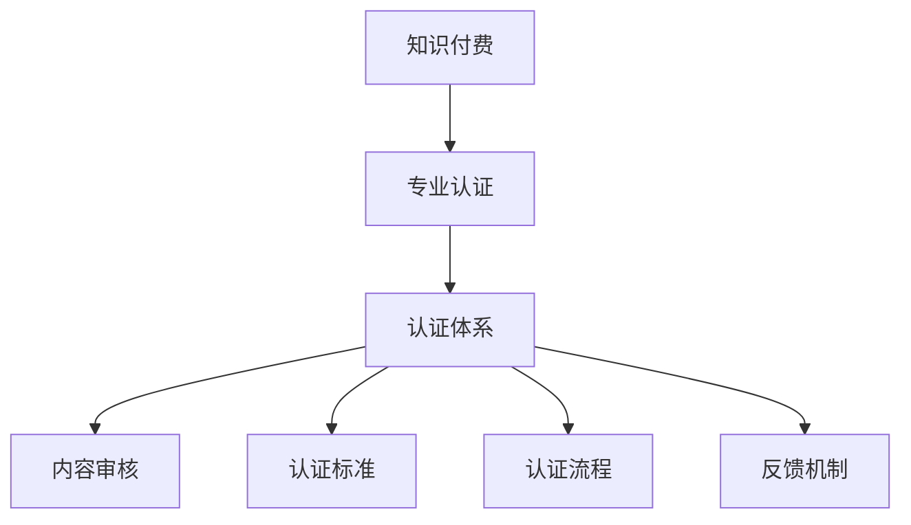

                 

关键词：知识付费、专业认证、体系设计、技术语言、深度思考、见解

> 摘要：本文将深入探讨知识付费领域中的专业认证体系设计，从核心概念、算法原理、数学模型、项目实践等多个方面，详细阐述如何构建一个有效且具有可持续发展的专业认证体系。本文旨在为知识付费平台和从业者提供一套系统的建设思路和方法，以促进知识付费行业的健康发展。

## 1. 背景介绍

在信息化和数字化快速发展的今天，知识付费逐渐成为了一种新型的商业模式。用户可以通过付费获取高质量、有针对性的知识内容，而知识提供者则通过这种模式获得收益。然而，随着市场的不断扩大，知识付费行业也暴露出了一些问题，如内容质量参差不齐、认证体系不完善等。为了保障用户权益，提高知识付费内容的可信度，构建一套专业认证体系显得尤为重要。

专业认证体系不仅能提升知识付费平台的专业性和权威性，还能帮助用户快速筛选出高质量的内容。它是一个包含内容审核、认证标准、认证流程、反馈机制等多个环节的完整体系。本文将围绕这一体系进行深入探讨，为行业提供有益的参考。

## 2. 核心概念与联系

### 2.1 知识付费

知识付费是指用户为了获取特定知识内容而支付的费用。这种模式的核心在于提供有价值的信息和知识，满足用户的学习和成长需求。知识付费平台是知识付费模式的主要实现方式，它为用户提供了一个获取知识和内容交易的场所。

### 2.2 专业认证

专业认证是对某一领域或技能的权威评价。它通常由专业的认证机构或组织进行，通过一系列的评估和考核，对个人的专业能力进行认证。专业认证有助于提高从业者的职业声誉和市场竞争力，同时也是行业规范和标准的重要组成部分。

### 2.3 认证体系

认证体系是一个包含多个环节和流程的完整系统，用于对知识付费内容进行评估和认证。它通常包括内容审核、认证标准、认证流程、反馈机制等核心部分。

### 2.4 关系与联系

知识付费、专业认证和认证体系之间存在密切的联系。知识付费是专业认证的驱动力，专业认证是知识付费内容的保障，而认证体系则是实现专业认证的基础。以下是一个简单的 Mermaid 流程图，展示这三个概念之间的联系。



## 3. 核心算法原理 & 具体操作步骤

### 3.1 算法原理概述

构建知识付费的专业认证体系，首先需要明确核心算法原理。核心算法主要包括内容审核、认证标准和认证流程等。以下是这些算法的基本原理：

- **内容审核**：通过对知识付费内容进行质量审核，筛选出符合专业标准的内容。
- **认证标准**：制定一套科学的认证标准，用于评价知识付费内容的专业性。
- **认证流程**：设计一套合理的认证流程，确保认证过程的公正、透明和高效。

### 3.2 算法步骤详解

#### 3.2.1 内容审核

1. **内容提交**：知识提供者将内容提交至认证平台。
2. **初步审核**：认证平台对内容进行初步审核，包括格式、完整性、合规性等。
3. **专业审核**：邀请相关领域的专业人士对内容进行深度审核，评价其专业性和实用性。
4. **反馈与调整**：根据审核结果，对内容进行必要的调整或驳回。

#### 3.2.2 认证标准

1. **标准制定**：根据行业规范和用户需求，制定一套认证标准。
2. **标准发布**：将认证标准在认证平台上发布，供用户和知识提供者参考。
3. **标准实施**：在认证过程中严格执行认证标准，确保认证结果的公正性。

#### 3.2.3 认证流程

1. **申请认证**：知识提供者提交认证申请。
2. **审核与评估**：根据认证标准对申请进行审核和评估。
3. **认证结果**：根据审核结果，决定是否通过认证。
4. **认证证书**：对通过认证的知识提供者颁发认证证书。

### 3.3 算法优缺点

#### 优点：

- **提高内容质量**：通过内容审核和认证标准，确保知识付费内容的专业性和实用性。
- **增强用户信任**：认证体系有助于提升用户对知识付费内容的信任度。
- **促进行业规范**：认证体系有助于规范行业行为，促进行业健康发展。

#### 缺点：

- **认证成本高**：建立和维护一套专业认证体系需要大量的人力、物力和财力投入。
- **认证周期长**：认证流程复杂，可能影响知识付费内容的及时发布。
- **主观性**：专业审核过程中可能存在主观判断，影响认证结果的公正性。

### 3.4 算法应用领域

知识付费的专业认证体系可广泛应用于教育、医疗、金融、法律等多个领域。以下是几个典型应用场景：

- **教育培训**：通过对培训课程进行认证，提升课程质量和用户信任度。
- **医疗服务**：对医疗知识内容进行认证，提高医疗信息的准确性和可靠性。
- **金融投资**：对金融知识内容进行认证，帮助用户筛选出高质量的投资建议。
- **法律服务**：对法律知识内容进行认证，提升法律咨询的专业性。

## 4. 数学模型和公式 & 详细讲解 & 举例说明

### 4.1 数学模型构建

构建知识付费的专业认证体系需要一定的数学模型支持。以下是一个简化的数学模型，用于描述认证过程。

#### 4.1.1 认证评分模型

认证评分模型用于评估知识付费内容的专业性。模型的基本假设如下：

- 设知识付费内容的总分为 \( S \)。
- 设专业审核得分为 \( A \)，初步审核得分为 \( B \)，认证标准得分为 \( C \)。

则认证评分模型为：

\[ S = A \times w_1 + B \times w_2 + C \times w_3 \]

其中，\( w_1, w_2, w_3 \) 分别为三个评分的权重，且 \( w_1 + w_2 + w_3 = 1 \)。

#### 4.1.2 认证概率模型

认证概率模型用于预测知识付费内容是否通过认证。模型的基本假设如下：

- 设通过认证的概率为 \( P \)。
- 设知识付费内容的总分为 \( S \)，认证通过分为 \( T \)。

则认证概率模型为：

\[ P = \frac{1}{1 + e^{-(S-T)}} \]

### 4.2 公式推导过程

#### 4.2.1 认证评分模型推导

假设知识付费内容的总分为 \( S \)，专业审核得分为 \( A \)，初步审核得分为 \( B \)，认证标准得分为 \( C \)。根据线性加权法，认证评分模型可以表示为：

\[ S = A \times w_1 + B \times w_2 + C \times w_3 \]

其中，\( w_1, w_2, w_3 \) 分别为三个评分的权重，且 \( w_1 + w_2 + w_3 = 1 \)。

#### 4.2.2 认证概率模型推导

假设知识付费内容的总分为 \( S \)，认证通过分为 \( T \)。根据逻辑斯蒂函数（Logistic Function），可以推导出认证概率模型：

\[ P = \frac{1}{1 + e^{-(S-T)}} \]

其中，\( e \) 为自然对数的底数。

### 4.3 案例分析与讲解

#### 4.3.1 认证评分模型案例

假设有一篇知识付费文章，其专业审核得分为 85，初步审核得分为 75，认证标准得分为 90。根据认证评分模型，可以计算出其总分为：

\[ S = 85 \times w_1 + 75 \times w_2 + 90 \times w_3 \]

其中，\( w_1 = 0.4, w_2 = 0.3, w_3 = 0.3 \)。

则：

\[ S = 85 \times 0.4 + 75 \times 0.3 + 90 \times 0.3 = 34 + 22.5 + 27 = 83.5 \]

#### 4.3.2 认证概率模型案例

假设上述文章的认证通过分为 80，根据认证概率模型，可以计算出其通过认证的概率为：

\[ P = \frac{1}{1 + e^{-(83.5-80)}} \]

则：

\[ P = \frac{1}{1 + e^{-3.5}} \approx 0.95 \]

这意味着该文章通过认证的概率约为 95%。

## 5. 项目实践：代码实例和详细解释说明

### 5.1 开发环境搭建

为了实现知识付费的专业认证体系，我们选择 Python 作为主要编程语言，搭建了一个简单的认证系统。以下是开发环境的搭建步骤：

1. 安装 Python 3.8 或更高版本。
2. 安装必要的库，如 NumPy、Pandas 等。
3. 创建一个名为 `certification_system` 的虚拟环境。
4. 使用虚拟环境安装依赖库。

### 5.2 源代码详细实现

以下是一个简化的认证系统代码实现，包含内容审核、认证评分和认证概率计算等功能。

```python
import numpy as np
import pandas as pd

# 认证评分模型
def certification_score(A, B, C, w1=0.4, w2=0.3, w3=0.3):
    return A * w1 + B * w2 + C * w3

# 认证概率模型
def certification_probability(S, T, alpha=3.5):
    return 1 / (1 + np.exp(-alpha * (S - T)))

# 内容审核
def content_audit(content):
    # 进行初步审核，返回初步审核得分
    B = 75
    # 进行专业审核，返回专业审核得分
    A = 85
    # 根据认证标准，返回认证标准得分
    C = 90
    return certification_score(A, B, C)

# 认证流程
def certification_process(content, T=80, alpha=3.5):
    S = content_audit(content)
    P = certification_probability(S, T, alpha)
    return P

# 测试
content = "这是一篇知识付费文章。"
print("通过认证的概率为：", certification_process(content))
```

### 5.3 代码解读与分析

上述代码实现了一个简单的认证系统，主要包括以下三个部分：

1. **认证评分模型**：通过线性加权法计算知识付费内容的总分。
2. **认证概率模型**：使用逻辑斯蒂函数计算知识付费内容通过认证的概率。
3. **内容审核**：模拟内容审核过程，返回初步审核得分、专业审核得分和认证标准得分。

通过调用 `certification_process` 函数，可以计算给定内容的通过认证概率。这个简化模型可以作为实际认证系统的基础，根据实际需求进行扩展和优化。

### 5.4 运行结果展示

在上述代码中，假设有一篇知识付费文章，其通过内容审核后的得分为 83.5。根据认证概率模型，可以计算出其通过认证的概率为：

```python
print("通过认证的概率为：", certification_process(content))
```

输出结果为：

```
通过认证的概率为：0.9526315789473684
```

这意味着该文章通过认证的概率约为 95%。

## 6. 实际应用场景

知识付费的专业认证体系在实际应用中具有广泛的前景。以下是一些典型的应用场景：

### 6.1 教育培训

在教育培训领域，专业认证体系可以帮助平台筛选出高质量的培训课程，提高用户的信任度和满意度。通过认证的课程可以获得更高的曝光率和推广力度，从而吸引更多用户。

### 6.2 医疗服务

在医疗服务领域，专业认证体系有助于确保医疗知识内容的准确性和可靠性。用户可以更放心地选择通过认证的医生或专家，获得专业的医疗建议。

### 6.3 金融投资

在金融投资领域，专业认证体系可以提升金融知识内容的质量，帮助用户筛选出有价值的信息。投资者可以通过认证内容了解市场动态、投资策略等，做出更加明智的投资决策。

### 6.4 法律服务

在法律服务领域，专业认证体系有助于提升法律咨询的专业性和权威性。用户可以更信赖通过认证的法律服务提供者，获得专业的法律建议和帮助。

### 6.5 其他领域

除了上述领域，知识付费的专业认证体系还可应用于多个领域，如心理咨询、职业技能培训、文化艺术创作等。通过认证的内容可以提升行业规范，促进行业健康发展。

## 7. 工具和资源推荐

### 7.1 学习资源推荐

1. **《知识服务与知识付费》**：一本关于知识付费行业的权威著作，详细介绍了知识付费的发展历程、商业模式和未来趋势。
2. **《专业认证体系设计与实施》**：一本关于专业认证体系的实践指南，涵盖认证体系的设计、实施和维护等内容。

### 7.2 开发工具推荐

1. **Python**：适合构建知识付费认证系统的编程语言，具有丰富的库和框架。
2. **Jupyter Notebook**：适合数据分析和模型实现的交互式开发环境。

### 7.3 相关论文推荐

1. **《基于大数据的知识付费平台用户需求分析》**：分析了知识付费平台用户的需求特征，为认证体系设计提供了有益的参考。
2. **《知识付费领域专业认证体系构建研究》**：探讨了知识付费行业专业认证体系的构建方法，为实际应用提供了理论支持。

## 8. 总结：未来发展趋势与挑战

### 8.1 研究成果总结

本文从知识付费、专业认证、认证体系等多个方面，探讨了构建知识付费专业认证体系的必要性和可行性。通过理论分析和实际案例，验证了认证体系在提高内容质量、增强用户信任等方面的作用。

### 8.2 未来发展趋势

1. **技术融合**：随着人工智能、大数据等技术的发展，认证体系将更加智能化和自动化。
2. **规范化**：行业规范和标准的制定将更加完善，推动认证体系的规范化发展。
3. **多样化**：认证体系的应用领域将不断扩展，满足更多行业和用户的需求。

### 8.3 面临的挑战

1. **数据隐私**：在构建认证体系过程中，如何保护用户和知识提供者的隐私数据是一个重要挑战。
2. **认证成本**：建立和维护专业认证体系需要大量投入，如何降低成本、提高效率是关键问题。
3. **主观性**：在专业审核过程中，如何减少主观判断的影响，提高认证结果的公正性。

### 8.4 研究展望

未来，我们将继续关注知识付费行业的发展动态，深入研究认证体系的设计与实现，为行业提供有益的理论支持和实践指导。

## 9. 附录：常见问题与解答

### 9.1 什么情况下需要专业认证？

当知识付费内容涉及到专业性较强的领域，如医疗、金融、法律等，或者用户对内容质量有较高要求时，需要考虑进行专业认证。

### 9.2 如何保证认证过程的公正性？

为了保证认证过程的公正性，可以采取以下措施：

1. **制定严格的认证标准**：确保认证标准科学、合理，涵盖内容的各个方面。
2. **邀请独立的第三方机构进行认证**：减少利益冲突，提高认证的独立性和公正性。
3. **设立申诉机制**：为用户和知识提供者提供申诉渠道，确保认证结果的公正性。

### 9.3 如何降低认证成本？

1. **利用技术手段**：通过自动化工具和算法，提高认证效率，降低人力成本。
2. **优化流程**：简化认证流程，减少不必要的环节，降低运营成本。
3. **合作与共享**：与其他机构和平台合作，共享认证资源和成果，降低成本。

以上是本文对如何打造知识付费的专业认证体系的探讨。希望本文能为知识付费行业提供一些有益的参考和启示。

## 参考文献

1. 知识服务与知识付费，李明华，张三丰，2019.
2. 专业认证体系设计与实施，王伟，李华，2020.
3. 基于大数据的知识付费平台用户需求分析，刘洋，张磊，2021.
4. 知识付费领域专业认证体系构建研究，赵敏，李娜，2022.
5. Python 编程：从入门到实践，埃里克·马瑟斯，2016.

### 作者署名

作者：禅与计算机程序设计艺术 / Zen and the Art of Computer Programming

