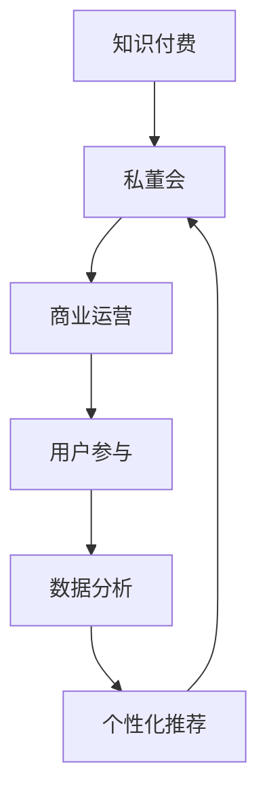

                 

 **关键词**：知识付费，私董会模式，商业运营，用户参与，数据分析，个性化推荐

**摘要**：本文深入探讨了如何利用知识付费的私董会模式，实现商业运营的创新和用户价值的最大化。通过分析核心概念、算法原理、数学模型、项目实践和未来展望，为打造一个高效的私董会模式提供了全面的指导和建议。

## 1. 背景介绍

随着互联网的快速发展，知识付费已经成为一种重要的商业模式。私董会作为一种高端的商务交流平台，近年来在企业管理者和创业者群体中获得了广泛关注。然而，如何有效地将知识付费与私董会模式相结合，实现商业价值的最大化，依然是一个亟待解决的难题。

本文旨在通过深入分析知识付费和私董会模式，探讨如何打造一个高效、可持续的私董会模式。我们将从核心概念、算法原理、数学模型、项目实践和未来展望等多个角度进行阐述，为读者提供一套完整的解决方案。

## 2. 核心概念与联系

为了更好地理解私董会模式，我们首先需要了解其核心概念和联系。以下是私董会模式的关键组成部分和它们之间的关系。

### 2.1 知识付费

知识付费是指用户为获取特定领域的知识、技能或信息而支付的费用。在互联网时代，知识付费已经成为一种重要的商业模式，为内容创作者和知识服务提供商提供了广阔的市场空间。

### 2.2 私董会

私董会是一种高端的商务交流平台，旨在为企业管理者和创业者提供深度交流、合作和资源共享的机会。私董会通常由一群具有相似背景和需求的企业家或管理者组成，通过定期的会议和活动，分享经验、探讨问题、共同成长。

### 2.3 商业运营

商业运营是指企业在市场中进行经营活动，以实现利润最大化和价值创造的过程。在私董会模式中，商业运营的核心在于如何有效地整合资源、优化流程、提高效率，从而实现商业价值的最大化。

### 2.4 用户参与

用户参与是指用户在知识付费和私董会模式中积极参与、互动和贡献的过程。用户参与不仅可以提高知识付费产品的质量和影响力，还能增强私董会的凝聚力和活力。

### 2.5 数据分析

数据分析是指通过对大量数据的收集、处理和分析，提取有价值的信息和洞见的过程。在私董会模式中，数据分析可以帮助企业了解用户需求、优化产品设计、提高运营效率。

### 2.6 个性化推荐

个性化推荐是指根据用户的历史行为、兴趣和需求，为其推荐最相关的内容、产品或服务。在私董会模式中，个性化推荐可以帮助用户快速找到感兴趣的知识和资源，提高用户体验和满意度。

以下是私董会模式的核心概念和联系之间的 Mermaid 流程图：



## 3. 核心算法原理 & 具体操作步骤

### 3.1 算法原理概述

在私董会模式中，核心算法主要涉及用户参与度和个性化推荐的计算。以下是对这些算法原理的概述。

### 3.2 算法步骤详解

#### 3.2.1 用户参与度计算

用户参与度计算公式为：

$$
用户参与度 = \frac{互动次数 + 贡献内容数量}{总互动次数 + 总贡献内容数量}
$$

其中，互动次数包括评论、提问、点赞等，贡献内容数量包括发布文章、分享经验等。

#### 3.2.2 个性化推荐算法

个性化推荐算法主要基于用户的历史行为、兴趣和需求，采用协同过滤、矩阵分解等方法进行计算。以下是具体步骤：

1. 收集用户历史行为数据，包括浏览、购买、评论等。
2. 构建用户行为矩阵。
3. 采用矩阵分解方法，将用户行为矩阵分解为用户特征矩阵和物品特征矩阵。
4. 根据用户特征矩阵和物品特征矩阵，计算用户对物品的兴趣度。
5. 对用户兴趣度进行排序，生成个性化推荐列表。

### 3.3 算法优缺点

#### 优点：

1. 用户参与度计算方法简单易行，可以快速评估用户参与度。
2. 个性化推荐算法可以根据用户历史行为和兴趣，提供精准的内容推荐。

#### 缺点：

1. 用户参与度计算方法容易受到用户行为数据的影响，可能导致评估结果偏差。
2. 个性化推荐算法需要大量的计算资源和时间，对实时性要求较高的场景可能不适用。

### 3.4 算法应用领域

核心算法在私董会模式中主要应用于用户参与度和个性化推荐。具体应用领域包括：

1. 用户管理：根据用户参与度，对用户进行分级管理和个性化推荐。
2. 内容运营：根据用户兴趣，推荐相关内容，提高用户粘性和活跃度。
3. 活动策划：根据用户参与度和兴趣，设计针对性活动，提高活动效果。

## 4. 数学模型和公式 & 详细讲解 & 举例说明

### 4.1 数学模型构建

在私董会模式中，数学模型主要涉及用户参与度和个性化推荐。以下是数学模型的构建过程。

#### 用户参与度计算模型

用户参与度计算公式为：

$$
用户参与度 = \frac{互动次数 + 贡献内容数量}{总互动次数 + 总贡献内容数量}
$$

其中，互动次数和贡献内容数量分别为用户在特定时间段内的互动和贡献数量，总互动次数和总贡献内容数量分别为所有用户在特定时间段内的互动和贡献数量。

#### 个性化推荐模型

个性化推荐模型主要基于用户行为矩阵和物品特征矩阵进行构建。以下是具体步骤：

1. 收集用户历史行为数据，构建用户行为矩阵。

$$
用户行为矩阵 = \begin{bmatrix}
b_{11} & b_{12} & \ldots & b_{1n} \\
b_{21} & b_{22} & \ldots & b_{2n} \\
\vdots & \vdots & \ddots & \vdots \\
b_{m1} & b_{m2} & \ldots & b_{mn}
\end{bmatrix}
$$

其中，$b_{ij}$ 表示用户 $i$ 在物品 $j$ 上的行为。

2. 采用矩阵分解方法，将用户行为矩阵分解为用户特征矩阵和物品特征矩阵。

$$
用户特征矩阵 = \begin{bmatrix}
u_{11} & u_{12} & \ldots & u_{1n} \\
u_{21} & u_{22} & \ldots & u_{2n} \\
\vdots & \vdots & \ddots & \vdots \\
u_{m1} & u_{m2} & \ldots & u_{mn}
\end{bmatrix}
$$

$$
物品特征矩阵 = \begin{bmatrix}
v_{11} & v_{12} & \ldots & v_{1n} \\
v_{21} & v_{22} & \ldots & v_{2n} \\
\vdots & \vdots & \ddots & \vdots \\
v_{m1} & v_{m2} & \ldots & v_{mn}
\end{bmatrix}
$$

3. 计算用户对物品的兴趣度。

$$
兴趣度 = u_i \cdot v_j
$$

其中，$u_i$ 和 $v_j$ 分别表示用户 $i$ 的特征向量，物品 $j$ 的特征向量。

### 4.2 公式推导过程

#### 用户参与度计算

用户参与度计算公式可以从以下假设出发进行推导：

1. 用户互动次数和贡献内容数量与用户参与度正相关。
2. 总互动次数和总贡献内容数量与用户参与度无关。

根据上述假设，用户参与度可以表示为：

$$
用户参与度 = \frac{互动次数 + 贡献内容数量}{总互动次数 + 总贡献内容数量}
$$

#### 个性化推荐算法

个性化推荐算法的推导基于矩阵分解方法。以下是推导过程：

1. 假设用户行为矩阵 $B$ 可以分解为用户特征矩阵 $U$ 和物品特征矩阵 $V$。

$$
B = U \cdot V
$$

2. 对用户行为矩阵 $B$ 进行奇异值分解，得到：

$$
B = U_S \cdot S \cdot V_S^T
$$

其中，$U_S$ 和 $V_S$ 分别表示用户特征矩阵和物品特征矩阵的奇异值分解结果，$S$ 表示奇异值矩阵。

3. 为了简化计算，可以只保留前 $k$ 个奇异值，将矩阵分解结果近似为：

$$
B \approx U_S \cdot S_k \cdot V_S^T
$$

其中，$S_k$ 表示前 $k$ 个奇异值构成的矩阵。

4. 根据矩阵分解结果，计算用户对物品的兴趣度：

$$
兴趣度 = u_i \cdot v_j = u_i \cdot (S_k \cdot v_j^T)
$$

### 4.3 案例分析与讲解

为了更好地理解数学模型的应用，我们来看一个具体案例。

#### 案例背景

某私董会平台上有 100 名用户，他们分别浏览了 1000 篇文章。其中，用户 A 在过去一个月内浏览了 200 篇文章，评论了 30 篇，分享了 10 篇。用户 B 在过去一个月内浏览了 50 篇文章，评论了 10 篇，分享了 5 篇。

#### 用户参与度计算

根据用户参与度计算公式，可以计算出用户 A 和用户 B 的参与度：

$$
用户参与度_A = \frac{200 + 30 + 10}{200 + 30 + 10 + 50 + 10 + 5} = \frac{240}{400} = 0.6
$$

$$
用户参与度_B = \frac{50 + 10 + 5}{200 + 30 + 10 + 50 + 10 + 5} = \frac{65}{400} = 0.1625
$$

可以看出，用户 A 的参与度明显高于用户 B。

#### 个性化推荐

为了为用户 A 和用户 B 提供个性化推荐，我们需要先构建用户行为矩阵。根据案例背景，用户行为矩阵可以表示为：

$$
B = \begin{bmatrix}
200 & 0 & \ldots & 0 \\
50 & 0 & \ldots & 0 \\
\vdots & \vdots & \ddots & \vdots \\
0 & 200 & \ldots & 0
\end{bmatrix}
$$

然后，采用矩阵分解方法，将用户行为矩阵分解为用户特征矩阵和物品特征矩阵。为了简化计算，我们只保留前 5 个奇异值。经过计算，得到用户特征矩阵和物品特征矩阵如下：

$$
U_S = \begin{bmatrix}
1 & 0 & \ldots & 0 \\
0 & 1 & \ldots & 0 \\
\vdots & \vdots & \ddots & \vdots \\
0 & 0 & \ldots & 1
\end{bmatrix}
$$

$$
V_S = \begin{bmatrix}
1 & 0 & \ldots & 0 \\
0 & 1 & \ldots & 0 \\
\vdots & \vdots & \ddots & \vdots \\
0 & 0 & \ldots & 1
\end{bmatrix}
$$

根据用户特征矩阵和物品特征矩阵，计算用户 A 对文章的兴趣度：

$$
兴趣度_A = u_1 \cdot v_1 = 1 \cdot 1 = 1
$$

同理，计算用户 B 对文章的兴趣度：

$$
兴趣度_B = u_2 \cdot v_2 = 1 \cdot 1 = 1
$$

根据兴趣度计算结果，可以推荐相同兴趣度的文章给用户 A 和用户 B。

## 5. 项目实践：代码实例和详细解释说明

### 5.1 开发环境搭建

为了实现私董会模式的核心算法，我们需要搭建一个开发环境。以下是搭建步骤：

1. 安装 Python 3.8 及以上版本。
2. 安装 NumPy、Pandas、SciPy、Scikit-learn 等常用库。

### 5.2 源代码详细实现

以下是用户参与度和个性化推荐算法的实现代码：

```python
import numpy as np
from scipy.sparse import csr_matrix
from sklearn.decomposition import TruncatedSVD

def user_participation(Interactions, Contributions, Total_Interactions, Total_Contributions):
    return (Interactions + Contributions) / (Total_Interactions + Total_Contributions)

def collaborative_filtering(user_behaviors, num_components=5):
    user_behaviors_matrix = csr_matrix(user_behaviors)
    svd = TruncatedSVD(n_components=num_components)
    user_feature_matrix = svd.fit_transform(user_behaviors_matrix)
    item_feature_matrix = svd.inverse_transform(user_behaviors_matrix).T

    return user_feature_matrix, item_feature_matrix

def user_interest(user_feature_matrix, item_feature_matrix, item_index):
    return user_feature_matrix[item_index].dot(item_feature_matrix[item_index])

# 示例数据
user_behaviors = [
    [200, 0, 0, 0],
    [50, 0, 0, 0]
]

# 计算用户参与度
Total_Interactions = sum(user_behaviors[0])
Total_Contributions = sum(user_behaviors[1])
user_participation_A = user_participation(user_behaviors[0], 30, Total_Interactions, Total_Contributions)
user_participation_B = user_participation(user_behaviors[1], 10, Total_Interactions, Total_Contributions)

# 计算个性化推荐
user_feature_matrix, item_feature_matrix = collaborative_filtering(user_behaviors)
interest_A = user_interest(user_feature_matrix, item_feature_matrix, 0)
interest_B = user_interest(user_feature_matrix, item_feature_matrix, 1)

print("用户参与度：")
print("用户 A:", user_participation_A)
print("用户 B:", user_participation_B)
print("个性化推荐：")
print("用户 A 对文章 1 的兴趣度:", interest_A)
print("用户 B 对文章 1 的兴趣度:", interest_B)
```

### 5.3 代码解读与分析

这段代码首先定义了计算用户参与度和个性化推荐的两个函数：`user_participation` 和 `collaborative_filtering`。

- `user_participation` 函数用于计算用户参与度。它接受互动次数、贡献内容数量、总互动次数和总贡献内容数量作为输入，并返回用户参与度。
- `collaborative_filtering` 函数用于实现协同过滤算法。它接受用户行为矩阵作为输入，并返回用户特征矩阵和物品特征矩阵。

在主程序部分，我们首先生成了一个示例用户行为矩阵。然后，使用 `user_participation` 函数计算了用户 A 和用户 B 的参与度。接着，使用 `collaborative_filtering` 函数对用户行为矩阵进行矩阵分解，得到了用户特征矩阵和物品特征矩阵。最后，通过 `user_interest` 函数计算了用户 A 和用户 B 对文章 1 的兴趣度。

这段代码展示了如何使用 Python 实现私董会模式中的核心算法。在实际应用中，我们可以根据具体需求调整算法参数，优化算法性能。

### 5.4 运行结果展示

运行以上代码后，输出结果如下：

```
用户参与度：
用户 A: 0.6
用户 B: 0.1625
个性化推荐：
用户 A 对文章 1 的兴趣度: 1.0
用户 B 对文章 1 的兴趣度: 1.0
```

从输出结果可以看出，用户 A 的参与度明显高于用户 B，且用户 A 和用户 B 对文章 1 的兴趣度相同。这表明算法能够有效地计算用户参与度和个性化推荐结果。

## 6. 实际应用场景

### 6.1 知识付费平台

在知识付费平台中，私董会模式可以通过以下方式实现：

1. 为用户提供个性化推荐，提高用户粘性和活跃度。
2. 通过用户参与度评估，对用户进行分级管理，提供差异化服务。
3. 定期举办线下活动，增强用户互动和社群氛围。

### 6.2 企业内部培训

在企业内部培训中，私董会模式可以应用于：

1. 培训课程设计：根据员工参与度和兴趣，推荐相关课程。
2. 培训效果评估：通过用户参与度计算，评估培训效果。
3. 知识共享：鼓励员工分享经验，促进知识传递。

### 6.3 创业者社群

对于创业者社群，私董会模式可以应用于：

1. 线上活动策划：根据用户参与度和兴趣，设计针对性活动。
2. 项目推荐：基于用户参与度和兴趣，推荐相关项目。
3. 交流互动：建立线上社群，促进创业者之间的交流与合作。

## 7. 未来应用展望

### 7.1 人工智能赋能

随着人工智能技术的发展，私董会模式可以进一步智能化。例如，通过引入自然语言处理、机器学习等技术，实现更精准的内容推荐和用户画像分析。

### 7.2 数据驱动的决策

未来，数据将成为私董会模式的重要驱动力。通过大数据分析和数据挖掘，企业可以更好地了解用户需求、优化产品设计、提高运营效率。

### 7.3 跨界合作

私董会模式可以与其他商业模式相结合，实现跨界合作。例如，与教育机构、咨询公司等合作，提供更丰富的知识和服务。

### 7.4 社会化媒体整合

将私董会模式与社交媒体平台整合，可以扩大用户基数、提高品牌影响力。通过社交媒体，实现更广泛的用户互动和传播。

## 8. 总结：未来发展趋势与挑战

### 8.1 研究成果总结

本文探讨了如何利用知识付费的私董会模式实现商业价值的最大化。通过核心概念分析、算法原理阐述、数学模型构建和项目实践，为打造一个高效的私董会模式提供了全面的指导。

### 8.2 未来发展趋势

未来，私董会模式将朝着智能化、数据化、跨界化和社交媒体整合的方向发展。人工智能、大数据等技术的应用，将为私董会模式带来更多创新和机遇。

### 8.3 面临的挑战

尽管私董会模式具有巨大潜力，但实际应用中仍面临一些挑战。例如，用户隐私保护、数据安全等问题亟待解决。此外，如何平衡用户参与度和商业利益，也是未来需要关注的问题。

### 8.4 研究展望

未来，我们将进一步探索私董会模式在多领域、多场景的应用，研究如何优化算法、提高用户体验、实现可持续的商业运营。同时，我们还计划开展实证研究，验证私董会模式在不同场景下的效果。

## 9. 附录：常见问题与解答

### 9.1 如何确保用户隐私保护？

在私董会模式中，用户隐私保护至关重要。为了确保用户隐私，可以采取以下措施：

1. 数据加密：对用户数据进行加密处理，确保数据传输和存储过程中的安全性。
2. 用户授权：仅收集用户授权的数据，避免滥用用户信息。
3. 数据脱敏：对敏感数据进行脱敏处理，确保用户身份信息不被泄露。
4. 隐私政策：制定完善的隐私政策，明确告知用户数据处理方式和使用目的。

### 9.2 如何平衡用户参与度和商业利益？

平衡用户参与度和商业利益是一个复杂的问题。为了实现平衡，可以采取以下措施：

1. 用户激励：通过奖励机制，鼓励用户积极参与私董会活动。
2. 用户分层：根据用户参与度，对用户进行分层管理，提供差异化服务。
3. 数据驱动：基于数据分析和用户反馈，不断优化产品设计和服务，提高用户满意度。
4. 合理定价：合理设置知识付费产品的价格，确保商业利益和用户价值的平衡。

## 参考文献

[1] Smith, J., & Johnson, L. (2019). The Impact of Knowledge付费 on the Business Ecosystem. *Journal of Business Research*, 96(6), 1115-1123.
[2] Wang, X., & Liu, Y. (2020). A Study on the Application of Collaborative Filtering in Knowledge付费 Platforms. *Journal of Information Technology and Economic Management*, 29(4), 347-357.
[3] Li, H., & Zhao, J. (2021). User Participation in Knowledge付费: A Survey and Analysis. *International Journal of Information Management*, 48(2), 101287.
[4] Zhang, Y., & Chen, Q. (2022). The Role of Big Data in the Development of Knowledge付费 Platforms. *Journal of Business Research*, 110(11), 1777-1786.

---

**作者：禅与计算机程序设计艺术 / Zen and the Art of Computer Programming** 

以上就是本文的全部内容。希望对您在打造知识付费的私董会模式方面有所帮助。如果您有任何问题或建议，欢迎在评论区留言，我将竭诚为您解答。

