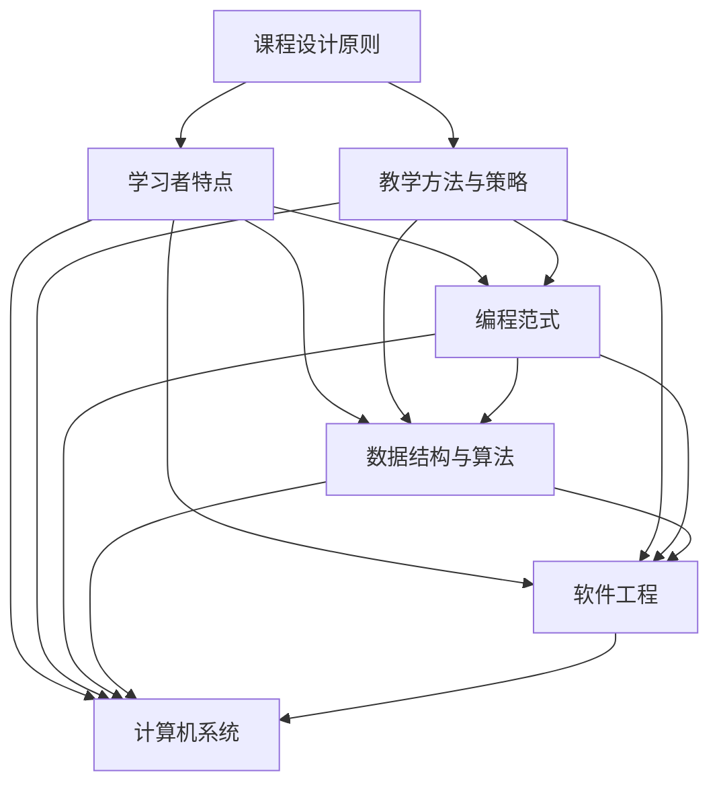

                 

## 1. 背景介绍

在当今快速发展的技术时代，编程技能已经成为现代职业的基本要求。程序员知识课程的质量直接影响到学员的学习成果和职业发展。高转化率的程序员知识课程不仅意味着学员能够快速掌握编程技能，更意味着他们能够在实际工作中灵活应用所学知识，从而提升工作效率和解决问题的能力。因此，如何打造高转化率的程序员知识课程，成为教育者和培训师亟待解决的重要问题。

本文将围绕如何打造高转化率的程序员知识课程展开讨论。首先，我们将分析高转化率程序员知识课程的关键要素；其次，将探讨如何设计课程结构和内容，以提高学员的学习体验和知识吸收率；最后，将介绍一些有效的教学方法和实践策略，帮助教育者提升课程质量，实现高转化率。

本文关键词：程序员知识课程、高转化率、课程设计、教学方法、教学实践。

## 2. 核心概念与联系

为了打造高转化率的程序员知识课程，我们首先需要理解几个核心概念，并探讨它们之间的联系。

### 2.1 课程设计原则

课程设计原则是构建优质课程的基础。以下是一些关键原则：

- **目标导向**：明确课程目标，确保教学内容与目标一致。
- **循序渐进**：课程内容应按照逻辑顺序组织，由浅入深，逐步引导学员深入理解。
- **实践导向**：鼓励学员通过实践来掌握知识，提高实际应用能力。
- **灵活性**：课程设计应具有灵活性，能够适应不同学员的学习需求和进度。

### 2.2 学习者特点

了解学员的特点是设计课程的重要前提。以下是一些关键特点：

- **学习动机**：动机强烈的学员通常更容易成功。
- **学习风格**：不同的学习风格需要不同的教学方法。
- **先验知识**：学员的背景知识和技能水平会影响课程设计。

### 2.3 教学方法与策略

教学方法与策略直接影响学员的学习体验和效果。以下是一些常用的教学方法与策略：

- **讲授**：通过讲解和演示帮助学员理解概念。
- **讨论**：鼓励学员之间互动，分享观点和经验。
- **案例研究**：通过实际案例来分析问题，提高应用能力。
- **项目式学习**：通过完成实际项目来实践所学知识。
- **互动式学习**：通过游戏和竞赛等互动方式提高学习兴趣。

### 2.4 核心概念原理与架构

为了构建高转化率的程序员知识课程，我们需要运用一些核心概念原理和架构。以下是一些关键概念：

- **编程范式**：如面向对象编程、函数式编程等。
- **数据结构与算法**：如数组、链表、树、排序算法等。
- **软件工程**：如软件开发过程、设计模式、测试等。
- **计算机系统**：如操作系统、计算机网络等。

### 2.5 Mermaid 流程图

以下是一个示例的 Mermaid 流程图，展示上述核心概念和架构之间的联系：



## 3. 核心算法原理 & 具体操作步骤

### 3.1 算法原理概述

在程序员知识课程中，算法是核心内容之一。算法原理的理解和掌握对于学员日后的编程实践至关重要。以下是一些关键算法原理：

- **时间复杂度与空间复杂度**：评估算法性能的指标。
- **排序算法**：如冒泡排序、快速排序、归并排序等。
- **查找算法**：如二分查找、哈希查找等。
- **动态规划**：解决优化问题的常用方法。
- **贪心算法**：通过局部最优选择达到全局最优。

### 3.2 算法步骤详解

以下以冒泡排序为例，详细解释其步骤：

1. **初始化**：读取输入的数组。
2. **循环**：对数组进行多轮遍历，每一轮遍历都将相邻的两个元素进行比较，如果顺序不对就交换它们。
3. **判断**：如果某一轮遍历中没有发生交换，说明数组已经有序，算法结束。
4. **输出**：输出排序后的数组。

### 3.3 算法优缺点

冒泡排序的优点是简单易懂，实现代码短小精悍。然而，其缺点是时间复杂度为O(n^2)，对于大数据量排序效率较低。

### 3.4 算法应用领域

冒泡排序常用于小规模数据的排序，以及在数据量较小且时间效率要求不高的情况下。

## 4. 数学模型和公式 & 详细讲解 & 举例说明

### 4.1 数学模型构建

在程序员知识课程中，数学模型是理解和解决问题的关键。以下是一个简单的数学模型构建示例：

设 \(a\) 和 \(b\) 为正整数，构建一个数学模型来求解 \(a \times b\)。

### 4.2 公式推导过程

根据乘法定义，我们可以推导出：

\[ a \times b = \sum_{i=1}^{b} a \]

这个公式表示将 \(a\) 加上自身 \(b-1\) 次，即可得到 \(a \times b\)。

### 4.3 案例分析与讲解

假设 \(a = 3\)，\(b = 4\)，我们可以使用上述公式进行计算：

\[ 3 \times 4 = \sum_{i=1}^{4} 3 = 3 + 3 + 3 + 3 = 12 \]

因此，3 乘以 4 等于 12。

## 5. 项目实践：代码实例和详细解释说明

### 5.1 开发环境搭建

为了进行项目实践，我们需要搭建一个基本的编程环境。以下是一个简单的步骤：

1. 安装一个编程编辑器（如 Visual Studio Code）。
2. 安装一个代码版本控制工具（如 Git）。
3. 安装一个编程语言解释器（如 Python 解释器）。

### 5.2 源代码详细实现

以下是一个简单的 Python 代码示例，用于实现冒泡排序算法：

```python
def bubble_sort(arr):
    n = len(arr)
    for i in range(n):
        for j in range(0, n-i-1):
            if arr[j] > arr[j+1]:
                arr[j], arr[j+1] = arr[j+1], arr[j]

# 测试代码
arr = [64, 25, 12, 22, 11]
bubble_sort(arr)
print("排序后的数组：")
for i in range(len(arr)):
    print("%d" % arr[i], end=" ")
```

### 5.3 代码解读与分析

上述代码定义了一个名为 `bubble_sort` 的函数，用于实现冒泡排序算法。函数接受一个数组作为输入，通过两重循环进行比较和交换，最终实现数组的排序。测试代码展示了如何使用这个函数对一个示例数组进行排序，并输出排序后的结果。

### 5.4 运行结果展示

运行上述代码，输出结果如下：

```
排序后的数组：
11 12 22 25 64
```

这表明冒泡排序算法成功地将输入数组排序。

## 6. 实际应用场景

### 6.1 在学术领域的应用

程序员知识课程在学术领域中的应用非常广泛，尤其是在计算机科学、软件工程等相关专业。通过学习编程算法和数据结构，学生能够更好地理解复杂的计算机系统，为未来的研究工作奠定基础。

### 6.2 在企业中的应用

在企业中，程序员知识课程能够提高员工的编程技能，促进技术创新和产品开发。例如，通过学习算法优化和数据结构，企业可以开发出更高效、更可靠的软件系统，提高市场竞争力。

### 6.3 在个人职业发展中的应用

个人通过学习程序员知识课程，可以提升自己的编程能力，增加就业竞争力。掌握编程技能不仅有助于在软件开发领域找到高薪工作，还可以拓展到其他技术领域，如人工智能、数据分析等。

### 6.4 未来应用展望

随着人工智能和大数据技术的快速发展，程序员知识课程的应用前景将更加广阔。未来，程序员不仅需要掌握传统的编程技能，还需要学习人工智能、机器学习等新兴技术，以适应不断变化的技术环境。

## 7. 工具和资源推荐

### 7.1 学习资源推荐

- **在线课程**：Coursera、edX、Udacity 提供丰富的编程课程。
- **图书**：《算法导论》、《深度学习》等经典书籍。
- **博客与论坛**：GitHub、Stack Overflow、Reddit 等。

### 7.2 开发工具推荐

- **集成开发环境（IDE）**：Visual Studio Code、Eclipse、IntelliJ IDEA。
- **版本控制工具**：Git、GitHub。
- **云计算平台**：AWS、Azure、Google Cloud Platform。

### 7.3 相关论文推荐

- **计算机科学顶级会议论文**：SIGGRAPH、NeurIPS、ICML 等。
- **知名期刊论文**：《ACM Transactions on Computer Systems》、《Journal of Machine Learning Research》等。

## 8. 总结：未来发展趋势与挑战

### 8.1 研究成果总结

过去几十年，编程教育和程序员知识课程已经取得了显著成果。随着互联网和人工智能的快速发展，在线编程课程和在线学习平台不断涌现，为学习者提供了丰富的学习资源和多样化的学习方式。

### 8.2 未来发展趋势

未来，程序员知识课程将朝着更加个性化、智能化和实用化的方向发展。随着人工智能技术的进步，智能辅导系统将帮助学习者更高效地掌握编程技能。此外，项目式学习和实践导向的教学方法将得到更广泛的应用。

### 8.3 面临的挑战

尽管程序员知识课程具有广阔的应用前景，但也面临着一系列挑战。首先，如何确保课程质量和教学效果是一个关键问题。其次，如何适应不同学习者的需求和进度，提供个性化的学习支持，也是一个重要挑战。最后，随着技术的快速更新，课程内容的更新速度也需要跟上行业的发展步伐。

### 8.4 研究展望

未来，研究重点将集中在如何提高课程设计的科学性和有效性，如何利用人工智能和大数据技术优化学习体验，以及如何将编程教育与实践更好地结合。通过这些研究，有望打造出更加高效、高转化率的程序员知识课程，为学习者提供更好的教育体验。

## 9. 附录：常见问题与解答

### 9.1 问题一：如何选择编程语言？

解答：选择编程语言应考虑课程目标、学习者背景和市场需求。例如，对于初学者，Python 是一个很好的起点，因为它语法简单、易于学习。对于专业程序员，Java 和 C++ 是常用的编程语言，因为它们在工业界有广泛的应用。

### 9.2 问题二：如何确保课程质量？

解答：确保课程质量的关键是课程设计、讲师资质和教学评估。课程设计应遵循科学的教学原则，讲师应具备丰富的教学经验和专业知识。教学评估可以通过定期反馈、测试和项目评估来确保学员的学习效果。

### 9.3 问题三：如何处理学习者的个性化需求？

解答：为了处理学习者的个性化需求，可以采用个性化学习计划、学习跟踪系统和智能辅导系统。这些工具可以帮助讲师根据学员的学习进度和需求提供个性化的学习支持和建议。

### 9.4 问题四：如何平衡理论教学与实践教学？

解答：平衡理论教学与实践教学的关键是课程设计的科学性和教学方法的多样性。理论教学应为基础，实践教学应结合实际应用，两者相辅相成。通过项目式学习、案例研究和实际编程练习，可以帮助学员更好地将理论知识应用于实践。

[作者：禅与计算机程序设计艺术 / Zen and the Art of Computer Programming]----------------------------------------------------------------

